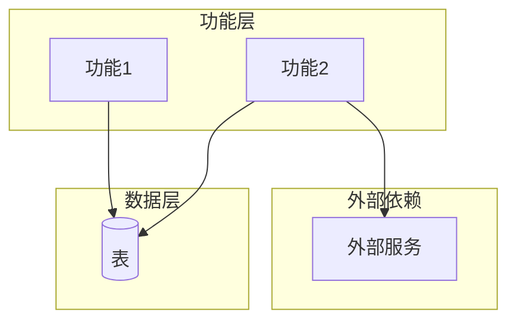
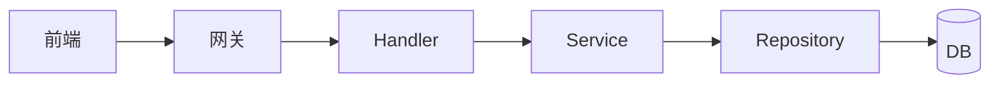
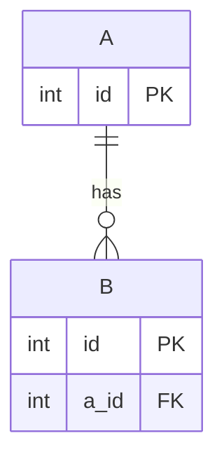
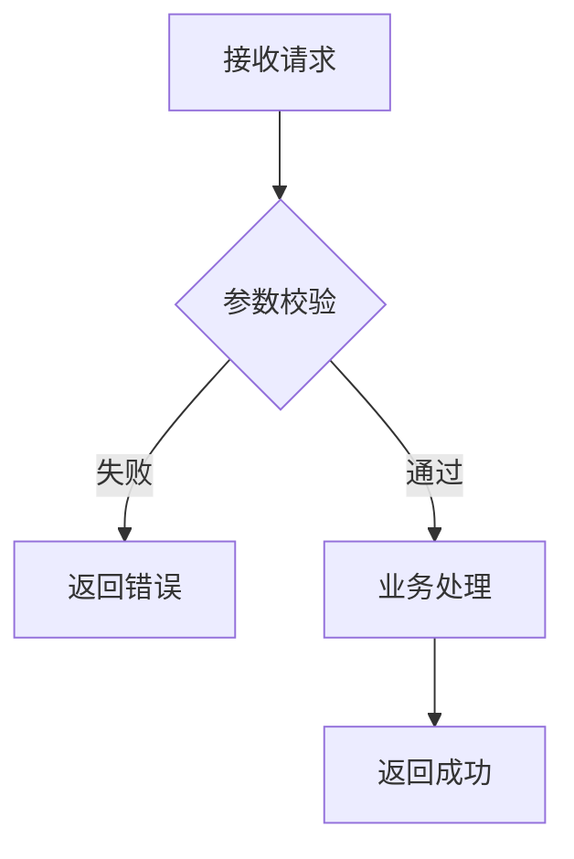

# {模块名称} 模块需求与设计一体化文档

> **文档编号**: MOD-{模块代号}-{版本号}
> **文档版本**: v1.0
> **创建日期**: YYYY-MM-DD
> **文档状态**: 草稿 / 需求评审中 / 设计评审中 / 已批准

**评审边界说明**:
- **需求评审**: 第 2 章（需求分析）→ 通过后锁定为需求基线 v1.0
- **设计评审**: 第 3-4 章（技术设计 + 部署运维）→ 通过后锁定设计基线 v1.x
- **交接契约**: 2.5 验收条件 — 需求定义 What，设计实现 How

**ID 体系**: US（用户故事，来自 PRD）、FEAT（功能）、API（接口）、RULE（业务规则/系统约束）、TC（测试用例）、RISK（风险）、NFR（非功能指标）
场景编号：S-（正常）、E-（异常）、B-（边界，按需）

**填写约定**: 表内数值/阈值（如 `P95≤200ms`、`TPS≥1000`、`SLA≥99.9%`、`RPN≥200`）均为**示例**，必须替换为真实目标或删除；无实测依据填"待定"，**禁止照抄示例值**。接口设计按入口类型（API/CLI/函数库）三选一。标注 `[按需]` 的章节不适用时整节删除，不要留空表。

---

## 目录

- [1. 文档控制](#1-文档控制)
  - [1.1 责任人](#11-责任人)
  - [1.2 修订历史](#12-修订历史)
- [2. 需求分析](#2-需求分析)
  - [2.1 需求概述](#21-需求概述-必填)
  - [2.2 痛点与价值](#22-痛点与价值-必填)
  - [2.3 功能方案](#23-功能方案-必填)
  - [2.4 范围与边界](#24-范围与边界-必填)
  - [2.5 验收条件](#25-验收条件-必填)
- [3. 技术设计](#3-技术设计)
  - [3.1 方案选型](#31-方案选型-必填)
  - [3.2 架构设计](#32-架构设计-必填)
  - [3.3 数据设计](#33-数据设计-必填)
  - [3.4 接口设计](#34-接口设计-必填)
  - [3.5 质量实现方案](#35-质量实现方案-必填)
- [4. 部署与运维](#4-部署与运维)
  - [4.1 部署架构](#41-部署架构)
  - [4.2 发布与回滚](#42-发布与回滚-按需)
  - [4.3 监控告警](#43-监控告警-按需)
  - [4.4 数据迁移](#44-数据迁移-按需)
- [5. 风险与依赖](#5-风险与依赖)
- [6. 需求追溯矩阵](#6-需求追溯矩阵)
- [附录：术语表](#附录术语表)

---

## 1. 文档控制

### 1.1 责任人

| 角色 | 姓名 | 职责范围 |
|------|------|---------|
| 产品经理 | | 需求定义、业务验收 |
| 开发负责人 | | 技术方案、代码实现 |
| 测试负责人 | | 测试策略、质量保证 |
| 架构师（如有） | | 架构审核、技术决策 |

### 1.2 修订历史

| 版本 | 日期 | 作者 | 变更描述 |
|------|------|------|---------|
| v0.1 | YYYY-MM-DD | | 初始草稿 |
| v1.0 | YYYY-MM-DD | | 需求评审通过 |
| v1.1 | YYYY-MM-DD | | 设计方案完成 |

---

## 2. 需求分析

### 2.1 需求概述 [必填]

| 项目 | 内容 |
|------|------|
| **模块名称** | |
| **模块ID** | MOD-XXX |
| **所属系统/产品线** | |
| **需求类型** | 新功能 / 功能优化 / 性能优化 / Bug修复 / 技术重构 |
| **业务背景** | （简述需求来源、触发原因） |
| **核心目标** | （一句话说明要达成的目标） |

---

### 2.2 痛点与价值 [必填]

| 维度 | 内容 |
|------|------|
| **目标用户** | （用户画像、角色、规模） |
| **当前问题** | （用数据量化，如"P95=800ms，超出SLA 200ms"） |
| **业务影响** | （如"用户流失率提升5%"） |
| **预期价值** | （如"提升转化率X%"） |

**用户故事** [按需]

| 编号 | 用户故事 | 优先级 |
|------|---------|--------|
| US-01 | 作为【角色】，我希望【操作】，以便【价值】 | P0 |

---

### 2.3 功能方案 [必填]

#### 2.3.1 功能清单

| 功能ID | 功能名称 | 功能描述 | 优先级 | 来源 |
|--------|---------|---------|--------|------|
| FEAT-01 | | | P0 | US-01 |

> 来源：引用 PRD 中的 US-XX（用户故事）；无 PRD 时留空。

#### 2.3.2 字段约束 [按需]

**FEAT-01 字段约束**

| 字段名 | 字段类型 | 必填 | 约束 | 说明 |
|--------|---------|------|------|------|
| | | | | |

---

### 2.4 范围与边界 [必填]

| 类别 | 内容 |
|------|------|
| **范围（In Scope）** | 本次覆盖的功能场景和系统边界 |
| **非范围（Out of Scope）** | 明确**不做**的功能 |
| **前置假设** | 设计依赖的前提条件 |
| **有意妥协 / 技术债** | 本次明知接受的取舍、欠债及偿还计划（无则填"无"） |

---

### 2.5 验收条件 [必填]

#### 2.5.1 业务规则与约束

| ID | 类型 | 描述 | 验证场景 |
|----|------|------|---------|
| RULE-01 | 业务规则 | | S-01 |
| RULE-02 | 系统约束 | 单次批量导入上限≤10000条 | B-01 |

#### 2.5.2 功能验收场景

> 场景写到可转自动化测试断言的粒度（明确前置、输入、可观测输出）。场景 ID（S-/E-/B-）即测试用例来源，§6 追溯矩阵直接引用这些场景 ID。
>
> **测试层级**只能填 `unit` / `integration` / `E2E` / `manual`。跨 API、存储、运行时生成、渲染或用户可见结果等多个边界的场景必须标为 `E2E`；`manual` 仅限无法自动化的外部条件，并记录原因。**关键真实边界**列出测试中不得 mock 的组件或最终可观测面，编码阶段不得自行降级。

**正常场景**

| 场景ID | 功能ID | 优先级 | 测试层级 | 关键真实边界 | 前置条件 | 操作步骤 | 预期结果 |
|--------|--------|--------|---------|-------------|---------|---------|---------|
| S-01 | FEAT-01 | P0 | E2E | API → Store → 最终输出 | | | |

**异常场景**

| 场景ID | 功能ID | 测试层级 | 关键真实边界 | 触发条件 | 系统行为 | 用户感知 |
|--------|--------|---------|-------------|---------|---------|---------|
| E-01 | FEAT-01 | integration | Service → Store | | | |

**边界场景** [按需]

| 场景ID | 测试层级 | 关键真实边界 | 字段/条件 | 边界值 | 预期行为 |
|--------|---------|-------------|----------|--------|---------|
| B-01 | unit | 校验函数 | | | |

#### 2.5.3 非功能指标 [按需]

**性能指标**

| 指标ID | 指标名称 | 目标值 | 测量方法 |
|--------|---------|-------|---------|
| NFR-PERF-01 | 接口响应时间（P95） | ≤200ms | APM监控 |
| NFR-PERF-02 | 系统吞吐量（TPS） | ≥1000 | 压测报告 |

**可靠性指标**

| 指标ID | 指标名称 | 目标值 |
|--------|---------|-------|
| NFR-REL-01 | 服务可用性（SLA） | ≥99.9% |

**安全性要求**

| 指标ID | 安全域 | 验收标准 |
|--------|--------|---------|
| NFR-SEC-01 | 认证鉴权 | 未授权用户无法访问 |
| NFR-SEC-02 | 数据加密 | 敏感字段不可明文 |

---

## 3. 技术设计

### 3.1 方案选型 [必填]

#### 备选方案对比 [多方案时必填]

| 对比维度 | 权重 | 方案A | 得分 | 方案B | 得分 |
|---------|------|-------|------|-------|------|
| 功能完备性 | 30% | | / | | / |
| 性能预期 | 25% | | / | | / |
| 实现复杂度 | 20% | | / | | / |
| 维护成本 | 15% | | / | | / |
| 风险评估 | 10% | | / | | / |
| **最终得分** | **100%** | | **X.X** | | **X.X** |

#### 关键决策记录

| 决策点 | 选择 | 被否决项 | 理由 | 可逆性 |
|--------|------|---------|------|--------|
| | | | | 易/难回退 |

> 打分表是辅助；真正要沉淀的是"为什么选它、放弃了什么、是否可逆"。

#### 技术栈

| 类别 | 选型 | 版本 | 选型理由 |
|------|------|------|---------|
| 语言 | | | |
| 框架 | | | |
| 数据库 | | | |
| 中间件 | | | |

---

### 3.2 架构设计 [必填]

> mermaid 图规范：节点标签含 `.` `/` `+` 等特殊字符时必须加双引号（`A["label"]`）；点线边标签用 `-.->|text|` 标准语法；避免 `&` 链式声明与紧凑式 `-.text.->`（多数渲染器解析失败）。



#### 技术分层



#### 外部依赖清单 [按需]

| 外部系统 | 依赖类型 | 协议 | 超时 | 降级策略 |
|---------|---------|------|------|---------|
| | | | | |

---

### 3.3 数据设计 [必填]

**新增表: `t_xxx`**

| 字段名 | 类型 | 可空 | 默认值 | 索引 | 说明 |
|--------|------|------|--------|------|------|
| id | BIGINT | N | AUTO | PK | 主键 |
| created_at | DATETIME | N | CURRENT_TIMESTAMP | | 创建时间 |

**索引设计**

| 索引名 | 类型 | 字段 | 使用场景 |
|--------|------|------|---------|
| | | | |

**ER图** [≥2张表时必填]



**容量预估** [按需]

| 维度 | 预估值 |
|------|--------|
| 初始数据量 | |
| 3年预估 | |

---

### 3.4 接口设计 [必填]

> **按入口类型三选一**，删除不适用形态：HTTP API / CLI 命令 / 函数库接口。

#### 形态 B：CLI 命令

| 命令 | 参数 / Flag | 说明 | 退出码 |
|------|------------|------|--------|
| `cmd sub` | `--flag` | | 0=成功 / 非 0=失败 |

> stdout / stderr 分工、错误文案、`--json` 等机器可读输出约定。

#### 形态 C：函数 / 库接口

| 函数签名 | 入参 | 返回 | 错误处理 |
|---------|------|------|---------|
| `fn(a: T) -> R` | | | 异常类型 / 错误码 |

#### 形态 A：HTTP API

#### 接口清单

| 接口ID | 名称 | 方法 | 路径 | 详细 |
|--------|------|------|------|------|
| API-01 | 创建 | POST | `/api/v1/xxx` | [↓](#api-01) |
| API-02 | 查询 | GET | `/api/v1/xxx/{id}` | [↓](#api-02) |

---

#### API-01: {接口名称}

**请求**

| 参数 | 类型 | 必填 | 说明 |
|------|------|------|------|
| | | | |

**请求示例**

```json
{}
```

**响应**

| 参数 | 类型 | 说明 |
|------|------|------|
| code | int | 0=成功 |
| data | object | 响应数据 |

**响应示例**

```json
{
  "code": 0,
  "message": "success",
  "data": {}
}
```

**错误码**

| 错误码 | 信息 | 场景 | HTTP状态码 |
|--------|------|------|----------|
| 40001 | 参数错误 | 校验失败 | 400 |
| 40901 | 资源冲突 | 已存在 | 409 |

**处理逻辑**



---

#### API-02: {接口名称}

> 参考 API-01 结构，以此类推。

---

### 3.5 质量实现方案 [必填]

#### 性能设计 [按需]

> 方案按最优性能设计：先定位热点路径，再给目标与实现，并说明相比朴素实现为何更优。

| 指标ID | 热点路径 | 目标值 | 实现方案（含被放弃的较慢方案） |
|--------|---------|-------|------------------------------|
| NFR-PERF-01 | | ≤200ms | 缓存+索引优化 |

#### 可靠性设计 [按需]

**风险 / 失效应对**（默认轻量表）

| 风险ID | 失效模式 | 影响 | 应对措施 | 验证场景 |
|--------|---------|------|---------|---------|
| RISK-01 | | | | E-01 |

> 仅安全关键 / 高并发 / 强一致系统才升级为 FMEA：追加 S/O/D（1-10）与 RPN=S×O×D 三列，RPN≥200 上线前必须解决。普通功能用上表即可，不要为打分而打分。

#### 安全性设计 [按需]

| 指标ID | 验收标准 | 实现方案 |
|--------|---------|---------|
| NFR-SEC-01 | | JWT + RBAC |

#### 可观测性设计 [按需]

| 场景 | 实现方案 |
|------|---------|
| 监控指标 | Prometheus + Grafana |
| 日志 | 结构化JSON + trace_id |
| 链路追踪 | OpenTelemetry |

---

## 4. 部署与运维

### 4.1 部署架构

| 环境 | 配置 | 实例数 | 用途 |
|------|------|--------|------|
| dev | 2C4G | 1 | 开发调试 |
| prod | 8C16G | 3+ | 生产环境 |

### 4.2 发布与回滚 [按需]

**发布策略**

| 阶段 | 范围 | 持续 | 进入条件 | 回滚条件 |
|------|------|------|---------|---------|
| 灰度 | 10% | 24h | 错误率<0.1% | 错误率>1% |
| 全量 | 100% | - | - | - |

**回滚步骤**: 同发布逆序

### 4.3 监控告警 [按需]

| 指标 | 阈值 | 级别 | 处理SLA |
|------|------|------|---------|
| 错误率 | >0.5% | P1 | 5min响应 |
| P95延迟 | >300ms | P2 | 15min响应 |

### 4.4 数据迁移 [按需]

> 不涉及数据迁移时跳过。

| 阶段 | 操作 | 验证方法 |
|------|------|---------|
| 1 | 新增字段 | 查Schema |
| 2 | 双写过渡 | 一致性校验 |
| 3 | 切换读取 | AB对比 |

---

## 5. 风险与依赖

### 5.1 项目依赖

| 依赖模块/团队 | 依赖内容 | 状态 | 风险等级 |
|-------------|---------|------|---------|
| | | | |

### 5.2 风险识别

| 风险ID | 类型 | 描述 | 概率 | 影响 | 应对措施 | 验证场景 |
|--------|------|------|------|------|---------|---------|
| | | | | | | S-/E-/B- 或手动验证理由 |

---

## 6. 需求追溯矩阵

| 用户故事 | 功能ID | 接口ID | 测试用例ID | 测试层级 | 状态 |
|---------|--------|--------|-----------|---------|------|
| US-01 | FEAT-01 | API-01 | S-01 | E2E | 待实现 |

> 用户故事一列引用 PRD 中的 US-XX（无 PRD 时填"需求描述"）；测试用例 ID 列引用 §2.5.2 的场景 ID（S-/E-/B-），不要另造编号。RULE 与高影响 RISK 必须映射到场景；无法自动化时写明手动验证原因，不得留空。

---

## Spec Compliance Matrix

> 从需求目录 `spec-context.yml` 继承并逐 Rule 回填。required Rule 必须有具体设计落点和 verifier/验收场景；N/A 只接受逐项用户确认。

| Spec/Rule | enforcement | 设计影响 | 设计落点 | 验证场景 | 状态/N/A 理由 |
|-----------|-------------|---------|---------|---------|----------------|
| `{spec-id}#RULE-{domain}-001` | required / advisory | <对方案的影响> | §<heading> / <item-id> | S-/E-/B- + verifier | applied / confirmed N/A |

---

## 附录：术语表

| 术语 | 定义 |
|------|------|
| US | User Story，用户故事（来自 PRD） |
| FEAT | Feature，功能项 |
| API | Application Programming Interface，接口 |
| RULE | 业务规则或系统约束 |
| TC | Test Case，测试用例 |
| RISK | 风险项 |
| NFR | Non-Functional Requirement，非功能性需求 |
| AC | Acceptance Criteria，验收条件 |
| ADR | Architecture Decision Record，架构决策记录 |
| SLA/RTO/RPO | 服务等级协议 / 恢复时间目标 / 恢复点目标 |
| RPN | Risk Priority Number = S × O × D |

---

*文档结束*
