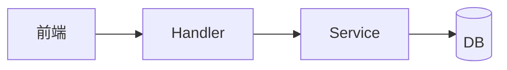
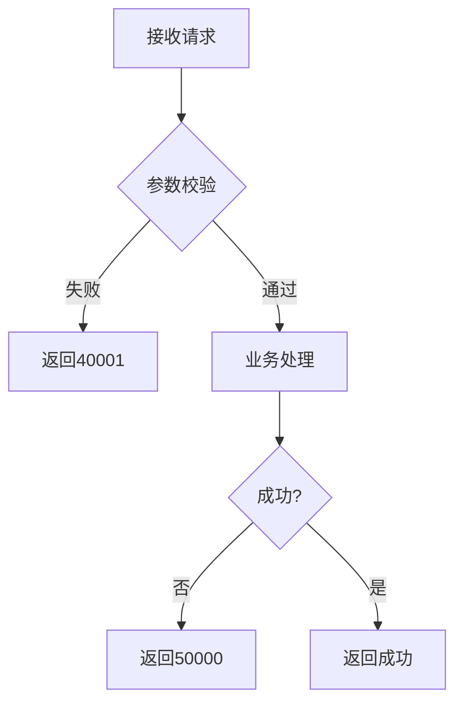

# {模块名称} 模块需求与设计简报

> **文档编号**: MOD-{模块代号}-{版本号}
> **文档版本**: v1.0
> **创建日期**: YYYY-MM-DD
> **文档状态**: 草稿 / 评审中 / 已批准

**评审边界说明**:
- **需求评审**: 第 2 章（需求分析）→ 通过后锁定需求基线
- **设计评审**: 第 3 章（技术设计）→ 通过后锁定设计基线

**ID 体系**: US（来自 PRD，可选）、FEAT（功能）、API（接口）、NFR（非功能指标）
场景编号：S-（正常）、E-（异常）、B-（边界，按需）

**适用场景**: 功能开发(简单) | CLI/脚本 | Bug修复 | 小型重构
**不适用**: 跨系统集成 | 性能优化 | 架构演进（请用 design-full.md）

**填写约定**: 表格内的数值/阈值（如 `≤200ms`、`≥99.9%`）均为**示例**，必须替换为真实目标或删除；无实测依据填"待定"，**禁止照抄示例值**。接口章节按入口类型（API / CLI / 函数库）三选一，删除不适用形态。

---

## 目录

- [1. 文档控制](#1-文档控制)
  - [1.1 责任人](#11-责任人)
  - [1.2 修订历史](#12-修订历史)
- [2. 需求分析](#2-需求分析)
  - [2.1 需求概述](#21-需求概述-必填)
  - [2.2 功能方案](#22-功能方案-必填)
  - [2.3 范围与边界](#23-范围与边界-必填)
  - [2.4 验收条件](#24-验收条件-必填)
- [3. 技术设计](#3-技术设计)
  - [3.1 技术选型](#31-技术选型-必填)
  - [3.2 架构设计](#32-架构设计-必填)
  - [3.3 接口设计](#33-接口设计-必填)
  - [3.4 性能与容量考量](#34-性能与容量考量-按需)
- [4. 风险与依赖](#4-风险与依赖)
- [附录：术语表](#附录术语表)

---

## 1. 文档控制

### 1.1 责任人

| 角色 | 姓名 | 职责范围 |
|------|------|---------|
| 开发负责人 | | 技术方案、代码实现 |
| 测试负责人 | | 测试策略、质量保证 |

### 1.2 修订历史

| 版本 | 日期 | 作者 | 变更描述 |
|------|------|------|---------|
| v0.1 | YYYY-MM-DD | | 初始草稿 |
| v1.0 | YYYY-MM-DD | | 评审通过 |

---

## 2. 需求分析

### 2.1 需求概述 [必填]

| 项目 | 内容 |
|------|------|
| **模块名称** | |
| **需求类型** | 功能开发 / Bug修复 / 重构 / 优化 |
| **业务背景** | （简述需求来源、触发原因） |
| **核心目标** | （一句话说明要达成的目标） |

---

### 2.2 功能方案 [必填]

#### 2.2.1 功能清单

| 功能ID | 功能名称 | 功能描述 | 优先级 | 来源 |
|--------|---------|---------|--------|------|
| FEAT-01 | | | P0 | US-01 |
| FEAT-02 | | | P1 | US-02 |

> P0=核心必做，P1=重要
> 来源：引用 PRD 中的 US-XX（用户故事）或 FEAT-XX；无 PRD 时留空。

#### 2.2.2 字段约束 [按需]

> 涉及数据存储时填写。

**FEAT-01 字段约束**

| 字段名 | 字段类型 | 必填 | 约束 | 说明 |
|--------|---------|------|------|------|
| | | | | |

---

### 2.3 范围与边界 [必填]

| 类别 | 内容 |
|------|------|
| **范围（In Scope）** | 本次覆盖的功能场景 |
| **非范围（Out of Scope）** | 明确**不做**的功能 |
| **有意妥协 / 技术债** | 本次明知接受的取舍、欠债及后续偿还设想（无则填"无"） |

---

### 2.4 验收条件 [必填]

#### 2.4.1 功能验收场景

> 每个 P0/P1 FEAT 至少 1 条正常 + 1 条异常场景；"操作步骤/预期结果"写到可直接转为自动化测试断言的粒度（明确输入与可观测输出）。场景 ID（S-/E-/B-）即测试用例编号，供 plan 拆解引用。

**正常场景**

| 场景ID | 功能ID | 优先级 | 操作步骤 | 预期结果 |
|--------|--------|--------|---------|---------|
| S-01 | FEAT-01 | P0 | 1. <步骤><br>2. <步骤> | <结果> |

**异常场景**

| 场景ID | 功能ID | 触发条件 | 系统行为 |
|--------|--------|---------|---------|
| E-01 | FEAT-01 | | |

#### 2.4.2 非功能指标 [按需]

| 指标ID | 指标名称 | 目标值 | 测量方法 |
|--------|---------|-------|---------|
| NFR-PERF-01 | 响应时间（P95） | ≤200ms | APM监控 |
| NFR-REL-01 | 可用性（SLA） | ≥99.9% | 年度可用时长 |

---

## 3. 技术设计

### 3.1 技术选型 [按需]

> 新功能/重构必填；Bug 修复若沿用既有栈可省略。

| 类别 | 选型 | 版本 | 选型理由 |
|------|------|------|---------|
| 语言 | | | |
| 框架 | | | |
| 数据库 | | | |

---

### 3.2 架构设计
> mermaid 图规范：节点标签含 `.` `/` `+` 等特殊字符时必须加双引号（`A["label"]`）；点线边标签用 `-.->|text|` 标准语法；避免 `&` 链式声明与紧凑式 `-.text.->`（多数渲染器解析失败）。
 [按需]

> 新增模块/跨组件交互时必填；Bug 修复或局部改动可省略。



| 层级 | 职责 |
|------|------|
| Handler | 参数校验、响应格式化 |
| Service | 核心业务逻辑 |
| DB | 数据持久化 |

---

### 3.3 接口设计 [按需]

> 涉及对外入口变更时必填；纯内部实现可省略。**按入口类型三选一**，删除不适用的形态。

#### 形态 B：CLI 命令 [CLI/脚本类选此]

| 命令 | 参数 / Flag | 说明 | 退出码 |
|------|------------|------|--------|
| `cmd sub` | `--flag` | | 0=成功 / 非 0=失败 |

> 明确 stdout / stderr 分工、错误文案、是否支持 `--json` 等机器可读输出。

#### 形态 C：函数 / 库接口 [库/内部模块选此]

| 函数签名 | 入参 | 返回 | 错误处理 |
|---------|------|------|---------|
| `fn(a: T) -> R` | | | 异常类型 / 错误码 |

#### 形态 A：HTTP API [Web 服务选此]

##### 接口清单

| 接口ID | 名称 | 方法 | 路径 | 详细 |
|--------|------|------|------|------|
| API-01 | | | | [详细 ↓](#api-01) |

---

#### API-01: {接口名称}

**接口契约**

```
POST /api/v1/xxx
Content-Type: application/json
```

**请求参数**

| 参数 | 类型 | 必填 | 说明 |
|------|------|------|------|
| | | | |

**请求示例**

```json
{}
```

**响应参数**

| 参数 | 类型 | 说明 |
|------|------|------|
| code | int | 0=成功 |
| message | string | 提示信息 |
| data | object | 响应数据 |

**响应示例**

```json
{
  "code": 0,
  "message": "success",
  "data": {}
}
```

**错误码**

| 错误码 | 信息 | 场景 | HTTP状态码 |
|--------|------|------|----------|
| 40001 | 参数错误 | 校验失败 | 400 |
| 50000 | 服务器错误 | 系统异常 | 500 |

**处理逻辑**



---

### 3.4 性能与容量考量 [按需]

> 命中性能敏感点（写路径 / 高频 / 大数据量 / 并发）时填写；否则注明"无性能敏感点"。方案应在正确性基础上按最优性能设计，本节记录依据。

| 热点路径 | 预估负载 | 潜在瓶颈 | 应对策略 | 目标值 |
|---------|---------|---------|---------|--------|
| | （QPS/数据量，无实测填"待定"） | | 索引/缓存/分页/批量/异步 | （如 P95≤200ms，无则"待定"） |

> 性能依据：所选方案相比被放弃方案为什么更优（复杂度 / IO 次数 / 可缓存性）。

---

## 4. 风险与依赖 [按需]

### 4.1 项目依赖

| 依赖模块 | 依赖内容 | 风险等级 |
|---------|---------|---------|
| | | |

### 4.2 风险识别

| 风险ID | 描述 | 影响 | 应对措施 |
|--------|------|------|---------|
| | | | |

---

## 附录：术语表

| 术语 | 定义 |
|------|------|
| NFR | Non-Functional Requirement，非功能性需求 |
| SLA | Service Level Agreement，服务等级协议 |
| P95 | 95th percentile，第95百分位响应时间 |

---

*文档结束*
