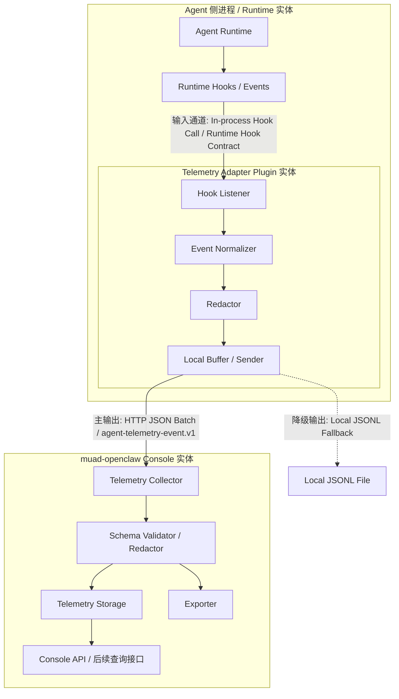

# Agent Telemetry Plugin Architecture 模块需求与设计一体化文档

> **文档编号**: MOD-AGENT-TELEMETRY-2026-07-06
> **文档版本**: v0.1
> **创建日期**: 2026-07-06
> **文档状态**: 设计草稿

**评审边界说明**:
- **需求评审**: 继承 PRD 第 2-6 章，不在本设计中重新定义具体业务指标与前端看板。
- **设计评审**: 聚焦 agent 无关的遥测插件架构、统一事件协议、collector/exporter 边界，以及 OpenClaw、Hermes Agent 首批接入接口细节。
- **交接契约**: 第 2.5 节验收条件定义 What，第 3-4 章定义 How。

**ID 体系**: US（用户故事，来自 PRD）、FEAT（功能）、API（接口/内部契约）、RULE（系统约束）、TC（测试用例）、RISK（风险）、NFR（非功能指标）

---

## 1. 文档控制

### 1.1 责任人

| 角色 | 姓名 | 职责范围 |
|------|------|---------|
| 产品经理 | | 需求定义、范围确认、业务验收 |
| 开发负责人 | | 技术方案、适配边界、落地拆解 |
| 架构师 | | 插件架构、事件协议、跨 agent 兼容性审核 |
| 测试负责人 | | adapter/collector 契约测试、异常场景验证 |

### 1.2 修订历史

| 版本 | 日期 | 作者 | 变更描述 |
|------|------|------|---------|
| v0.1 | 2026-07-06 | | 基于 PRD 生成初始设计草稿，补充 OpenClaw 与 Hermes 接入接口关键细节 |

---

## 2. 需求分析

### 2.1 需求概述

| 项目 | 内容 |
|------|------|
| **模块名称** | Agent Telemetry Plugin Architecture |
| **模块ID** | MOD-AGENT-TELEMETRY |
| **所属系统/产品线** | muad-openclaw 管理/监控控制面 |
| **需求类型** | 架构演进 / 跨系统集成 / 观测能力建设 |
| **业务背景** | 当前平台主要实现 K8S 相关后端能力，缺少对 agent 使用场景的长期观测能力。后续需要分析用户使用频率、问题内容、tool/skill/LLM 调用链路等，但 agent 底座不固定，不能把埋点绑定到单一 runtime。 |
| **核心目标** | 建立 agent 无关、插件化、可插拔的遥测接入架构，让 OpenClaw、Hermes Agent 以及后续 agent runtime 能通过统一 adapter 输出同一事件协议。 |

### 2.2 痛点与价值

| 维度 | 内容 |
|------|------|
| **目标用户** | 平台管理员、后端开发者、agent 适配开发者、后续运营/产品分析人员 |
| **当前问题** | 直接改某个 agent 核心代码或扫日志会造成强耦合、可复用性弱、隐私边界不清晰，且无法稳定支持多 agent runtime。 |
| **业务影响** | 缺少统一事件基础会导致后续指标口径、审计链路、看板能力反复重做。 |
| **预期价值** | 新 agent 接入先评估再适配；首批 OpenClaw 与 Hermes 可验证架构；具体指标与展示后置，不阻塞底层埋点模型稳定。 |

**用户故事**

| 编号 | 用户故事 | 优先级 |
|------|---------|--------|
| US-01 | 作为平台负责人，我希望遥测能力不绑定某个固定 agent，以便后续更换或新增 agent runtime 时不重做整套监控架构。 | P0 |
| US-02 | 作为后端开发者，我希望 OpenClaw 与 Hermes Agent 有明确的首批适配方案，以便优先验证架构是否能落地。 | P0 |
| US-03 | 作为 agent 适配开发者，我希望接入方式插件化、可插拔、低侵入，以便快速适配新 agent 并降低维护成本。 | P0 |
| US-04 | 作为平台管理员，我希望接入前能评估某个 agent 是否具备可埋点能力，以便提前判断需要插件、hook、轻量核心扩展还是暂不接入。 | P0 |
| US-05 | 作为安全/运维负责人，我希望埋点采集默认有明确的开关、脱敏与权限边界，以便避免无意采集敏感用户内容或凭证。 | P0 |
| US-06 | 作为后续数据分析使用者，我希望架构先沉淀统一事件与上下文关联能力，以便后续再定义具体指标、看板和分析模型。 | P1 |

### 2.3 功能方案

#### 2.3.1 功能清单

| 功能ID | 功能名称 | 功能描述 | 优先级 | 来源 |
|--------|---------|---------|--------|------|
| FEAT-01 | 统一 agent 遥测事件抽象 | 定义 runtime 无关的事件模型、上下文模型和事件分类。 | P0 | US-01, US-06 |
| FEAT-02 | 插件化适配器架构 | 定义 adapter 插件接口、加载/启停方式、能力声明、事件上报契约和失败隔离规则。 | P0 | US-01, US-03, US-04 |
| FEAT-03 | OpenClaw 首批适配方案 | 细化 OpenClaw 的可采集事件来源、插件/hook 接入点、缺口与最小改造建议。 | P0 | US-02, US-04 |
| FEAT-04 | Hermes Agent 首批适配方案 | 细化 Hermes Agent 的 hooks、observability 插件模式、skill 采集语义和 adapter 事件映射。 | P0 | US-02, US-04 |
| FEAT-05 | agent 接入评估机制 | 提供候选 agent 的接入评估清单和 capability matrix。 | P0 | US-04 |
| FEAT-06 | 统一 collector/exporter 边界 | 定义 adapter 与平台侧 collector 的职责分界，支持缓冲、校验、入库或转发。 | P0 | US-03, US-06 |
| FEAT-07 | 隐私、脱敏与显式启用策略 | 定义默认关闭、采集范围配置、secret 脱敏、用户 ID hash 等策略。 | P0 | US-05 |
| FEAT-08 | 新 agent 快速接入模板 | 为后续 GenericAgent 或其他 agent 提供 adapter scaffold、事件映射模板和接入说明。 | P1 | US-03, US-04 |
| FEAT-09 | 指标与看板延后承载约束 | 本期只做架构层事件承载，不固化具体指标口径。 | P1 | US-06 |

#### 2.3.2 字段约束

**统一事件字段约束**

| 字段名 | 字段类型 | 必填 | 约束 | 说明 |
|--------|---------|------|------|------|
| `schema_version` | string | 是 | 固定为 `agent-telemetry-event.v1` | 事件协议版本 |
| `event_id` | string | 是 | UUID 或 runtime 内唯一 ID | collector 幂等去重依据 |
| `event_type` | string | 是 | 见第 3.4.2 节枚举 | 统一事件类型 |
| `occurred_at` | string | 是 | RFC3339 | 事件发生时间，由 adapter 生成 |
| `runtime.name` | string | 是 | `openclaw` / `hermes-agent` / 其他 | agent runtime 名称 |
| `runtime.version` | string | 否 | adapter 能获取时填写 | runtime 版本 |
| `adapter.name` | string | 是 | 稳定 adapter 名称 | adapter 标识 |
| `adapter.version` | string | 是 | semver | adapter 版本 |
| `trace.session_id` | string | 否 | 原值或 hash，取决于隐私策略 | 会话关联 |
| `trace.turn_id` | string | 否 | runtime 可见时填写 | 单轮关联 |
| `trace.request_id` | string | 否 | LLM/API 调用关联 |
| `trace.tool_call_id` | string | 否 | tool 调用关联 |
| `subject.user_id_hash` | string | 否 | 禁止明文用户 ID 默认外发 | 用户关联 |
| `subject.channel_id_hash` | string | 否 | 禁止明文渠道 ID 默认外发 | 渠道关联 |
| `privacy.redaction_policy` | string | 是 | `metadata_only` / `hashed` / `content_opt_in` | 当前事件脱敏策略 |
| `payload` | object | 是 | 按事件类型校验 | 事件载荷 |

### 2.4 范围与边界

| 类别 | 内容 |
|------|------|
| **范围（In Scope）** | 统一事件抽象；插件化 adapter 架构；OpenClaw adapter 方案细化；Hermes Agent adapter 方案细化；agent 接入评估清单；collector/exporter 职责边界；隐私与 opt-in 原则。 |
| **非范围（Out of Scope）** | 不定义最终业务指标口径；不做完整前端数据看板；不承诺适配所有 agent；不把 GenericAgent 作为首批实现对象；不通过日志解析作为长期主方案；不直接改 OpenClaw/Hermes 核心业务逻辑实现平台特例。 |
| **前置假设** | OpenClaw 与 Hermes Agent 均允许通过插件或通用 hook 接入；muad-openclaw 平台可新增遥测接收与存储能力；具体指标需求会在架构方案确认后另行细化。 |
| **有意妥协 / 技术债** | skill 在不同 agent 中语义差异较大。本期先定义 `skill.used`、`skill.loaded`、`knowledge.accessed` 三类事件，OpenClaw/Hermes 若缺少原生 lifecycle hook，先在 capability matrix 标记为 partial，并提出通用 hook 扩展建议。 |

### 2.5 验收条件

#### 2.5.1 业务规则与约束

| ID | 类型 | 描述 |
|----|------|------|
| RULE-01 | 系统约束 | adapter 必须 fail-open，采集失败不能阻断 agent 正常会话、工具调用或 LLM 调用。 |
| RULE-02 | 系统约束 | 遥测外发必须显式启用，默认策略不外发用户原文、tool 参数、tool 结果、secret、token、cookie、API key。 |
| RULE-03 | 架构约束 | adapter 输出统一事件给 collector，不直接耦合前端看板或具体业务指标。 |
| RULE-04 | 架构约束 | 新 agent 接入前必须产出 capability matrix，标明原生支持、可插件支持、需轻量改造或暂不可支持。 |
| RULE-05 | 架构约束 | 日志解析只能作为补数或 POC 手段，不作为长期主采集架构。 |
| RULE-06 | 兼容约束 | 事件协议允许新增事件类型和 payload 字段，但不能破坏同一 major 版本的 collector 解析。 |

#### 2.5.2 功能验收场景

**正常场景**

| 场景ID | 功能ID | 优先级 | 前置条件 | 操作步骤 | 预期结果 |
|--------|--------|--------|---------|---------|---------|
| S-01 | FEAT-05 | P0 | 存在一个候选 agent runtime | 按接入评估清单填写入口消息、会话、LLM、tool、skill、隐私、插件能力 | 输出 capability matrix，明确可接入等级与缺口 |
| S-02 | FEAT-04 | P0 | Hermes adapter 已启用 | Hermes 产生 gateway 消息、LLM/API 调用、tool 调用、session 生命周期事件 | adapter 通过 Hermes hooks 输出 `message.received`、`llm.request.*`、`tool.call.*`、`session.*` 统一事件 |
| S-03 | FEAT-03 | P0 | OpenClaw adapter 已启用 | OpenClaw agent 运行一轮包含用户消息、LLM、tool 的任务 | adapter 基于 AgentEventSink/diagnostics 输出 message、turn、tool、usage、diagnostic 相关统一事件，并记录 skill lifecycle 缺口 |
| S-04 | FEAT-07 | P0 | adapter 配置为 disabled | agent 正常运行 | adapter 不采集、不上报，collector 无新事件 |
| S-05 | FEAT-06 | P0 | collector 可用 | adapter 上报合法 `agent-telemetry-event.v1` | collector 校验 schema、执行脱敏检查、写入本地 JSONL 或目标存储，并返回成功 |
| S-06 | FEAT-08 | P1 | 新 agent 仅提供基础 hook | 使用 adapter 模板完成最小适配 | 新 adapter 能声明能力、输出最小 message/session 事件，未支持项在 matrix 中标为 partial/missing |

**异常场景**

| 场景ID | 功能ID | 触发条件 | 系统行为 | 用户感知 |
|--------|--------|---------|---------|---------|
| E-01 | FEAT-02, FEAT-06 | collector 不可用或 HTTP 上报失败 | adapter 按配置进入 buffer/retry/drop，记录本地错误计数，不阻断 agent 主流程 | 用户对话不受影响 |
| E-02 | FEAT-07 | payload 中包含 secret、token、cookie、API key 或疑似凭证 | Redactor 在 adapter 侧和 collector 侧执行双层脱敏或拒收 | 用户无感知，平台可看到脱敏/拒收审计 |
| E-03 | FEAT-03, FEAT-04, FEAT-05 | runtime 缺少 skill lifecycle hook | capability matrix 标记 partial，短期使用 fallback 信号，长期提出通用 hook 扩展 | 用户无感知，评审能看到能力缺口 |
| E-04 | FEAT-02 | adapter 代码异常抛错 | adapter host 捕获异常，熔断当前 adapter 或降级到 no-op sink | agent 主流程继续 |

**边界场景**

| 场景ID | 字段/条件 | 边界值 | 预期行为 |
|--------|----------|--------|---------|
| B-01 | `event_type` | collector 未识别但 schema major 兼容 | collector 可进入 quarantine 或按 unknown event 存储，不影响已知事件 |
| B-02 | tool result / message content | 大内容、二进制、图片路径、base64 | 默认不采集原文；若显式 opt-in，也必须截断、摘要化或只记录 hash/长度 |
| B-03 | 上报批量大小 | 单 batch 过大 | adapter 拆 batch；collector 返回参数错误时不重试同一超限 batch |
| B-04 | 重复事件 | 相同 `event_id` 重复上报 | collector 幂等处理，避免重复入库 |

#### 2.5.3 非功能指标

**性能指标**

| 指标ID | 指标名称 | 目标值 | 测量方法 |
|--------|---------|-------|---------|
| NFR-PERF-01 | agent 主流程附加延迟 | 目标待压测确认；设计要求 adapter 热路径只做内存队列写入和轻量字段提取 | adapter benchmark + 集成测试 |
| NFR-PERF-02 | 上报路径阻塞 | collector 不可用时不得同步阻塞单轮 agent 执行 | 故障注入测试 |

**可靠性指标**

| 指标ID | 指标名称 | 目标值 |
|--------|---------|-------|
| NFR-REL-01 | 遥测链路失败隔离 | adapter/collector 故障不影响 agent 主功能 |
| NFR-REL-02 | 本地缓冲可控 | buffer 达上限后按策略丢弃低优先级事件，并记录 drop 计数 |

**安全性要求**

| 指标ID | 安全域 | 验收标准 |
|--------|--------|---------|
| NFR-SEC-01 | 最小采集 | 默认不采集用户原文、tool 参数/结果明文、secret 和凭证 |
| NFR-SEC-02 | 显式启用 | 未配置或 disabled 时不采集、不外发 |
| NFR-SEC-03 | 身份脱敏 | 用户 ID、渠道 ID 默认 hash 或映射化，禁止默认明文外发 |

---

## 3. 技术设计

### 3.1 方案选型

#### 备选方案对比

| 对比维度 | 权重 | 方案A: 直接在平台/agent 核心硬编码埋点 | 得分 | 方案B: 日志解析 | 得分 | 方案C: runtime adapter plugin + 统一事件协议 + collector | 得分 |
|---------|------|------------------------------------------|------|----------------|------|----------------------------------------------------------|------|
| 功能完备性 | 30% | 单 agent 可快，但多 agent 复用弱 | 2 | 覆盖依赖日志质量，语义弱 | 1 | 可按 runtime 能力映射统一语义 | 5 |
| 性能预期 | 20% | 热路径可控但侵入大 | 3 | 扫日志有延迟和 IO 放大 | 2 | adapter 内存队列 + 异步上报，热路径可控 | 4 |
| 实现复杂度 | 20% | 首个简单，后续复杂 | 3 | POC 简单，长期复杂 | 2 | 初始协议设计复杂，但后续接入简单 | 4 |
| 维护成本 | 20% | 跟随 runtime 内部代码变化 | 2 | 日志格式变化即失效 | 1 | adapter 隔离 runtime 差异，collector 稳定 | 5 |
| 风险评估 | 10% | 强耦合、隐私边界分散 | 2 | 事件可信度低 | 1 | 隐私、能力声明、失败隔离可统一治理 | 4 |
| **最终结论** | **100%** | 不选 | **2.4** | 不选 | **1.4** | **推荐** | **4.5** |

#### 关键决策记录

| 决策点 | 选择 | 被否决项 | 理由 | 可逆性 |
|--------|------|---------|------|--------|
| 埋点入口 | runtime adapter plugin | 平台硬编码 / 日志主采集 | agent 不固定，插件化能隔离 runtime 差异，接入成本可控 | 中 |
| 事件协议 | `agent-telemetry-event.v1` envelope + typed payload | 每个 agent 自定义 payload | collector、存储、后续指标需要稳定输入 | 中 |
| 首批 adapter | OpenClaw + Hermes Agent | 同时适配所有 agent | 两者具备不同 hook 成熟度，适合作为架构验证样本 | 易 |
| skill 语义 | `skill.loaded`、`skill.used`、`knowledge.accessed` 分开 | 强行统一成单一 skill 字段 | 不同 agent 中 skill/tool/知识文件语义不同，强统一会造成指标失真 | 中 |
| 上报方式 | adapter 本地队列 + HTTP/JSONL sink | 同步 HTTP 上报 | 避免 collector 不可用影响 agent 主流程 | 易 |
| 隐私策略 | adapter 侧预脱敏 + collector 侧二次校验 | 只在 collector 脱敏 | 防止外发前泄漏敏感内容 | 中 |

#### 技术栈

| 类别 | 选型 | 版本 | 选型理由 |
|------|------|------|---------|
| 平台后端 | Go `net/http` | 继承 muad-openclaw 后端 | 当前 console/backend 已使用标准库 HTTP 和 SQLite |
| 平台存储 | SQLite / JSONL 起步，后续可扩展 DB/队列 | 待实施确认 | 架构期先定义协议边界，存储可按指标需求演进 |
| OpenClaw adapter | TypeScript plugin/hook adapter | 跟随 OpenClaw | OpenClaw runtime 为 TS，已有 AgentEvent 与 diagnostics |
| Hermes adapter | Python standalone plugin | 跟随 Hermes Agent | Hermes 有成熟插件 hook 与 observability 插件先例 |
| 传输协议 | HTTP JSON / JSONL | `agent-telemetry-event.v1` | 易调试、易回放、低接入门槛 |

### 3.2 架构设计



图里只保留运行实体和真实数据流。协议和契约不单独画成节点，避免误解为独立服务：

- `Runtime Hook Contract`: 体现在 `Agent Runtime -> Adapter` 的输入边上。
- `AdapterPlugin Contract`: 体现在 adapter 插件实现约束里，不是运行节点。
- `agent-telemetry-event.v1`: 体现在 `Adapter -> Console Collector` 的主输出边上。
- `Privacy / Redaction Policy`: 由 adapter 内部 `Redactor` 和 console 侧 `Schema Validator / Redactor` 执行。
- `Capability Matrix`: 是 adapter 的声明/评估文档或配置数据，不在主链路中流转。

图中 `Agent Runtime` 是通用占位，首批实例包括 OpenClaw 和 Hermes Agent，后续可以替换为其他 agent。差异只体现在 `Runtime Hooks / Events` 和 adapter 实现上：

- OpenClaw: `Runtime Hooks / Events` 对应 `AgentEventSink`、`AgentEvent`、diagnostics、skills-runtime snapshot 信号；adapter 为 TypeScript 插件。
- Hermes Agent: `Runtime Hooks / Events` 对应 `pre_gateway_dispatch`、session hooks、API hooks、tool hooks、approval/subagent hooks；adapter 为 Python standalone plugin。
- Future Agent: 先按 Capability Matrix 评估 hook 能力，再实现同一套 AdapterPlugin 契约。

#### 实体、协议、通道边界

| 类型 | 名称 | 所在位置 | 说明 |
|------|------|----------|------|
| 实体 | Agent Runtime | OpenClaw / Hermes / 未来 agent 进程 | 真正执行对话、LLM 调用、tool 调用、skill 加载的运行时。 |
| 实体 | Agent Adapter Plugin | agent 进程内插件或随 agent 部署的插件包 | 安装 adapter 后 agent 侧新增的主要实体。内部包含 Hook Listener、Event Normalizer、Redactor、Local Buffer/Sender。OpenClaw 是 TS adapter，Hermes 是 Python standalone plugin。 |
| 内部组件 | Local Buffer / Sender | Agent Adapter Plugin 内部 | adapter 内部缓冲和发送组件，负责 batch、retry、drop，collector 不可用时保护 agent 主流程。它不是单独部署的服务。 |
| 实体 | Console Telemetry Collector | muad-openclaw console 后端 | 接收 adapter 上报，做 schema 校验、二次脱敏、幂等、存储或转发。 |
| 实体 | Telemetry Storage / Exporter | muad-openclaw console 后端或外部系统 | 存储统一事件，或转发到 JSONL、DB、外部观测系统。 |
| 协议 | Runtime Hook Contract | agent runtime 与 adapter 之间 | runtime 暴露给 adapter 的 hook/event 约定。OpenClaw 对应 `AgentEventSink`/diagnostics，Hermes 对应 `pre_gateway_dispatch`、`pre_api_request` 等 hooks。 |
| 协议 | AdapterPlugin Contract | adapter 实现约定 | 规定 adapter 的 `metadata()`、`capabilities()`、`start()`、`stop()`、`health()` 等能力。 |
| 协议 | `agent-telemetry-event.v1` | adapter 与 collector 之间 | 统一事件 envelope 和 event type 定义。它不是服务，也不是队列，只是双方都遵守的数据格式。 |
| 协议 | Privacy / Redaction Policy | adapter 与 collector 共用 | 规定哪些字段可采、哪些字段 hash、哪些字段禁止外发。 |
| 协议 | Capability Matrix | adapter 输出、console 消费 | 描述某个 agent 的 message/session/LLM/tool/skill 等能力支持程度和缺口。 |
| 输入通道 | In-process Hook Call | agent runtime 到 adapter | runtime 通过同进程函数调用或插件 hook 回调，把原始事件交给 adapter；要求轻量、fail-open。 |
| 主输出通道 | HTTP JSON Batch | adapter 到 console collector | adapter 主动 push `agent-telemetry-event.v1` 批量事件给 console collector。 |
| 降级/辅助输出通道 | Local JSONL Fallback | adapter 到 agent 侧本地文件 | collector 不可用、开发调试或离线回放时使用；不是 console 主动消费的主路径。 |

#### 技术分层


#### 组件职责

| 组件 | 职责 | 不负责 |
|------|------|--------|
| AdapterPlugin | 绑定 runtime hook，提取原始事件，声明能力，转换统一事件 | 指标计算、前端展示、长期存储策略 |
| EventNormalizer | 将 runtime 原始对象映射为 `agent-telemetry-event.v1` | 读取业务配置或做复杂查询 |
| PrivacyPolicy/Redactor | 按配置执行字段级脱敏、hash、截断、禁止外发 | 替代权限系统 |
| EventSink | 本地队列、batch、retry、drop 策略 | 阻塞 agent 主流程等待 collector |
| Collector | 接收、校验、二次脱敏、幂等、写入或转发 | 理解每个 runtime 内部类型 |
| Exporter | 输出到 JSONL、DB、外部观测系统 | 直接访问 agent 进程 |

#### 外部依赖清单

| 外部系统 | 依赖类型 | 协议 | 超时 | 降级策略 |
|---------|---------|------|------|---------|
| OpenClaw runtime | plugin/event/diagnostics 接入 | 进程内 TS API | 不适用 | adapter 禁用或标记 partial capability |
| Hermes Agent runtime | standalone plugin hooks | 进程内 Python hooks | 不适用 | adapter 禁用或 no-op |
| muad-openclaw collector | 事件接收 | HTTP JSON / JSONL | 待实施确认 | 本地 buffer/retry/drop，不阻断 agent |

### 3.3 数据设计

> 本期核心是事件协议与接入架构。以下表结构为实施阶段候选设计，具体 DB 选型、保留周期、聚合表和看板指标在指标需求明确后再锁定。

**新增表候选: `agent_telemetry_events`**

| 字段名 | 类型 | 可空 | 默认值 | 索引 | 说明 |
|--------|------|------|--------|------|------|
| id | INTEGER | N | AUTO | PK | 平台内部主键 |
| event_id | TEXT | N | | UNIQUE | adapter 生成的事件 ID |
| schema_version | TEXT | N | | IDX | `agent-telemetry-event.v1` |
| event_type | TEXT | N | | IDX | 统一事件类型 |
| occurred_at | DATETIME | N | | IDX | 事件发生时间 |
| received_at | DATETIME | N | CURRENT_TIMESTAMP | IDX | collector 接收时间 |
| runtime_name | TEXT | N | | IDX | runtime 名称 |
| runtime_version | TEXT | Y | | | runtime 版本 |
| adapter_name | TEXT | N | | IDX | adapter 名称 |
| adapter_version | TEXT | N | | | adapter 版本 |
| session_id_hash | TEXT | Y | | IDX | 会话 hash |
| turn_id | TEXT | Y | | IDX | turn 关联 |
| user_id_hash | TEXT | Y | | IDX | 用户 hash |
| channel_id_hash | TEXT | Y | | IDX | 渠道 hash |
| payload_json | TEXT | N | | | 脱敏后的 payload |
| redaction_policy | TEXT | N | | | 脱敏策略 |
| ingest_status | TEXT | N | `accepted` | IDX | `accepted` / `quarantined` / `rejected` |

**新增表候选: `agent_runtime_adapters`**

| 字段名 | 类型 | 可空 | 默认值 | 索引 | 说明 |
|--------|------|------|--------|------|------|
| id | INTEGER | N | AUTO | PK | 主键 |
| runtime_name | TEXT | N | | UNIQUE(runtime_name, adapter_name) | runtime 名称 |
| adapter_name | TEXT | N | | | adapter 名称 |
| adapter_version | TEXT | N | | | adapter 版本 |
| capabilities_json | TEXT | N | | | capability matrix 快照 |
| enabled | BOOLEAN | N | false | IDX | 是否启用 |
| last_seen_at | DATETIME | Y | | IDX | 最近上报时间 |
| health_status | TEXT | N | `unknown` | | `healthy` / `degraded` / `disabled` / `unknown` |

**新增表候选: `agent_telemetry_ingest_errors`**

| 字段名 | 类型 | 可空 | 默认值 | 索引 | 说明 |
|--------|------|------|--------|------|------|
| id | INTEGER | N | AUTO | PK | 主键 |
| event_id | TEXT | Y | | IDX | 事件 ID |
| adapter_name | TEXT | Y | | IDX | adapter 名称 |
| error_code | TEXT | N | | IDX | 错误码 |
| error_message | TEXT | N | | | 错误摘要，禁止写入敏感原文 |
| raw_excerpt | TEXT | Y | | | 截断并脱敏后的片段 |
| created_at | DATETIME | N | CURRENT_TIMESTAMP | IDX | 创建时间 |

**索引设计**

| 索引名 | 类型 | 字段 | 使用场景 |
|--------|------|------|---------|
| `idx_events_time_type` | BTREE | `occurred_at`, `event_type` | 按时间和事件类型查询 |
| `idx_events_runtime_time` | BTREE | `runtime_name`, `occurred_at` | 按 runtime 查询事件 |
| `idx_events_user_time` | BTREE | `user_id_hash`, `occurred_at` | 后续用户使用频率分析 |
| `idx_events_session_turn` | BTREE | `session_id_hash`, `turn_id` | 会话链路回放 |
| `idx_events_ingest_status` | BTREE | `ingest_status`, `received_at` | 排查 rejected/quarantined |

### 3.4 接口设计

#### 3.4.1 接口清单

| 接口ID | 名称 | 形态 | 详细 |
|--------|------|------|------|
| API-01 | 单事件上报 | HTTP API | adapter 到 collector |
| API-02 | 批量事件上报 | HTTP API | adapter 到 collector |
| API-03 | AdapterPlugin 契约 | 函数/库接口 | runtime adapter 统一接口 |
| API-04 | EventSink 契约 | 函数/库接口 | adapter 内部输出接口 |
| API-05 | PrivacyPolicy/Redactor 契约 | 函数/库接口 | adapter 与 collector 共用策略 |
| API-06 | CapabilityMatrix 契约 | 配置/函数接口 | 新 agent 接入评估输出 |
| API-07 | OpenClaw 接入接口映射 | runtime hook 契约 | OpenClaw adapter |
| API-08 | Hermes 接入接口映射 | runtime hook 契约 | Hermes adapter |

#### API-01: 单事件上报

**请求**

| 参数 | 类型 | 必填 | 说明 |
|------|------|------|------|
| body | object | 是 | 单个 `agent-telemetry-event.v1` |

**请求示例**

```json
{
  "schema_version": "agent-telemetry-event.v1",
  "event_id": "8f0b7f70-1f4a-4f65-a25c-63e7b9b2a903",
  "event_type": "tool.call.completed",
  "occurred_at": "2026-07-06T13:10:00Z",
  "runtime": {
    "name": "hermes-agent",
    "version": "unknown"
  },
  "adapter": {
    "name": "muad-hermes-telemetry-adapter",
    "version": "0.1.0"
  },
  "trace": {
    "session_id": "session_hash_or_runtime_id",
    "turn_id": "turn-1",
    "tool_call_id": "call-1"
  },
  "subject": {
    "user_id_hash": "user_12hex",
    "channel_id_hash": "channel_12hex"
  },
  "privacy": {
    "redaction_policy": "metadata_only",
    "content_included": false
  },
  "payload": {
    "tool_name": "skill_view",
    "status": "success",
    "duration_ms": 35
  }
}
```

**响应**

| 参数 | 类型 | 说明 |
|------|------|------|
| code | int | 0=成功，4xxxx=客户端错误，5xxxx=服务端错误 |
| message | string | 错误或成功摘要 |
| data.accepted | int | 接收数量 |
| data.rejected | int | 拒收数量 |
| data.quarantined | int | 隔离数量 |

**错误码**

| 错误码 | 信息 | 场景 | HTTP状态码 |
|--------|------|------|----------|
| 40001 | 参数错误 | JSON 无法解析或缺少必填字段 | 400 |
| 40002 | schema 不兼容 | `schema_version` 不支持 | 400 |
| 40003 | payload 超限 | 单事件超过大小限制 | 413 |
| 40004 | 隐私策略违规 | 检测到明文 secret 或禁止字段 | 400 |
| 50001 | collector 内部错误 | 存储或 exporter 异常 | 500 |

#### API-02: 批量事件上报

| 方法 | 路径 | 说明 |
|------|------|------|
| POST | `/api/telemetry/events:batch` | 批量上报统一事件，collector 应逐条校验并返回聚合结果 |

批量接口优先于循环单事件 HTTP，避免 adapter 在高频事件下产生 N 次网络往返。adapter 侧应按数量和字节大小拆 batch。

#### API-03: AdapterPlugin 契约

```ts
type AdapterCapabilityStatus = "native" | "plugin" | "requires_extension" | "partial" | "missing";

interface AdapterPlugin {
  metadata(): {
    name: string;
    version: string;
    runtimeName: string;
    runtimeVersion?: string;
  };
  capabilities(): CapabilityMatrix;
  start(sink: EventSink, config: AdapterConfig): Promise<void> | void;
  stop(): Promise<void> | void;
  health(): AdapterHealth;
}

interface CapabilityMatrix {
  message: AdapterCapabilityStatus;
  session: AdapterCapabilityStatus;
  turn: AdapterCapabilityStatus;
  llm: AdapterCapabilityStatus;
  tool: AdapterCapabilityStatus;
  skill: AdapterCapabilityStatus;
  approval: AdapterCapabilityStatus;
  subagent: AdapterCapabilityStatus;
  userIdentity: AdapterCapabilityStatus;
  privacy: AdapterCapabilityStatus;
  notes: Record<string, string>;
}
```

#### API-04: EventSink 契约

```ts
interface EventSink {
  emit(event: AgentTelemetryEvent): void;
  emitBatch(events: AgentTelemetryEvent[]): void;
  flush(options?: { timeoutMs?: number }): Promise<void>;
  stats(): {
    queued: number;
    sent: number;
    dropped: number;
    failed: number;
  };
}
```

`emit` 不允许在 agent 热路径同步等待远端 collector。实现可以写入内存队列、本地 JSONL 或无锁 ring buffer，再由后台 worker 批量上报。

#### API-05: PrivacyPolicy/Redactor 契约

```ts
interface PrivacyPolicy {
  enabled: boolean;
  exportEnabled: boolean;
  contentMode: "metadata_only" | "hash" | "summary_opt_in" | "raw_opt_in";
  hashSaltRef?: string;
  maxPayloadBytes: number;
  redactSecrets: boolean;
  allowedEventTypes?: string[];
  deniedEventTypes?: string[];
}

interface Redactor {
  redact(event: AgentTelemetryEvent, policy: PrivacyPolicy): AgentTelemetryEvent;
  validate(event: AgentTelemetryEvent, policy: PrivacyPolicy): RedactionValidationResult;
}
```

#### API-06: CapabilityMatrix 契约

| 能力项 | 说明 | OpenClaw 初评 | Hermes 初评 |
|--------|------|---------------|-------------|
| message | 用户消息入口、消息 ID、渠道上下文 | partial/plugin | plugin/native |
| session | 会话 ID、状态、开始/结束 | partial/native diagnostics | plugin/native |
| turn | 单轮开始/结束、turn 关联 | native via AgentEvent | plugin/partial |
| llm | LLM 请求、完成、失败、usage | partial diagnostics + stream wrapper | plugin/native |
| tool | tool call start/end/result/error | native via AgentEvent | plugin/native |
| skill | skill loaded/used/snapshot | partial, 需 lifecycle hook | partial, 可从 skill_view/slash/preload/usage 推断 |
| approval | 审批请求/响应 | 待确认 existing approval diagnostics | plugin/native |
| subagent | 子 agent 生命周期 | 待确认 | plugin/native |
| userIdentity | 用户/渠道 ID hash | 需 adapter 从 gateway/session 上下文提取 | native via MessageEvent/SessionSource |
| privacy | opt-in、脱敏、禁止 secret | 需 adapter 配置 | Hermes 原则要求 opt-in，adapter 实现 |

#### API-07: OpenClaw 接入接口映射

本地代码观察点:
- `/Users/jahan/workspace/openclaw/packages/agent-core/src/agent-loop.ts`: `AgentEventSink`，`runAgentLoop(..., emit)` 可发布 agent 生命周期事件。
- `/Users/jahan/workspace/openclaw/packages/agent-core/src/types.ts`: `AgentEvent` 包含 `agent_start`、`agent_end`、`turn_start`、`turn_end`、`message_start`、`message_update`、`message_end`、`tool_execution_start`、`tool_execution_update`、`tool_execution_end`。
- `/Users/jahan/workspace/openclaw/src/infra/diagnostic-events.ts`: 已有 `model.usage`、`security.event`、`webhook.received`、`message.received`、`message.dispatch.*`、`session.state`、`session.turn.created`、`run.attempt`、`run.progress`、`tool.loop` 等 diagnostic 事件。
- `/Users/jahan/workspace/openclaw/src/plugin-sdk/skills-runtime.ts`: 暴露 skill snapshot refresh 相关接口，如 `registerSkillsChangeListener`、`bumpSkillsSnapshotVersion`，但不是完整 skill loaded/used lifecycle。
- `/Users/jahan/workspace/openclaw/src/plugin-sdk/tool-plugin.ts`: `defineToolPlugin` 与 `api.registerTool` 支持插件注册工具，但它是工具扩展接口，不等同于全局 tool 调用观测接口。

| OpenClaw 事件源 | 可映射统一事件 | 关键字段 | 接入策略 | 缺口 |
|-----------------|----------------|----------|----------|------|
| `AgentEventSink` `agent_start` / `agent_end` | `session.started` / `session.ended` 或 `agent.run.*` | runtime、session、messages count | 在 harness/runner 层包装 sink 或订阅 agent event | session 语义需结合上层 gateway/session key |
| `AgentEventSink` `turn_start` / `turn_end` | `turn.started` / `turn.completed` | turn id、toolResults count、message role | adapter 生成 turn correlation id | 原生事件未直接带 user/channel |
| `message_start` / `message_update` / `message_end` | `message.received` / `message.generated` | role、content length、diagnostics、usage | 默认只采 metadata/hash | 用户入口消息和 assistant 消息需区分 |
| `tool_execution_start/update/end` | `tool.call.started` / `tool.call.completed` / `tool.call.failed` | toolCallId、toolName、args、result、isError、errorKind | args/result 默认脱敏或只记录 schema/hash/size | 大结果必须截断 |
| diagnostics `model.usage` | `llm.request.completed` 或 `llm.usage.recorded` | provider、model、usage、costUsd、durationMs | 直接订阅 diagnostic event | request started/failed 可能需补充 |
| diagnostics `message.received` / `message.dispatch.*` | `message.received` / `message.dispatched` | sessionKey、sessionId、channel、source、duration、outcome | 优先用于 gateway 入口消息 | payload 不含用户原文 |
| diagnostics `session.state` / `session.turn.created` | `session.state.changed` / `turn.started` | sessionKey、sessionId、runId、agentId、channel | 用于会话状态和 run correlation | 与 AgentEvent turn 合并需去重策略 |
| `skills-runtime` snapshot listener | `skill.catalog.changed` | snapshot version、change event | 作为 skill catalog 变更信号 | 无法证明具体 skill 被某次 turn 使用 |

OpenClaw 最小改造建议:
1. 优先做独立 adapter，消费 `AgentEventSink` 和 diagnostic events，避免日志解析。
2. 若现有插件系统不能全局订阅 AgentEvent，需要增加通用观测 hook，例如 `agent_event` 或 `telemetry_event`，payload 使用现有 `AgentEvent`，不要增加 muad 专用逻辑。
3. 为 skill 补一个通用 lifecycle hook，而不是平台特例。建议事件包括 `skill.loaded`、`skill.used`、`skill.catalog.changed`，字段包含 skill name、source、filePath hash、trigger（slash/preload/tool/runtime）。
4. adapter 必须在 OpenClaw 进程内做脱敏和本地 queue，collector 不可用时不影响 agent。

#### API-08: Hermes 接入接口映射

本地代码观察点:
- `/Users/jahan/workspace/hermes-agent/hermes_cli/plugins.py`: `VALID_HOOKS` 包含 session、gateway、API、tool、approval、subagent、kanban 等 hook；插件入口组为 `hermes_agent.plugins`。
- `/Users/jahan/workspace/hermes-agent/gateway/run.py`: `pre_gateway_dispatch` 在内部事件过滤之后、auth/pairing 之前触发，入参为 `event`、`gateway`、`session_store`。
- `/Users/jahan/workspace/hermes-agent/gateway/platforms/base.py`: `MessageEvent` 规范化入口消息，包含 `text`、`message_type`、`source`、`raw_message`、`message_id`、`media_urls`、reply context、`auto_skill`、`channel_prompt`、`channel_context`、`internal`、`metadata`、`timestamp`。
- `/Users/jahan/workspace/hermes-agent/gateway/session.py`: `SessionSource` 包含 `platform`、`chat_id`、`chat_name`、`chat_type`、`user_id`、`user_name`、`thread_id`、`chat_topic`、`user_id_alt`、`chat_id_alt`、`scope_id/guild_id`、`parent_chat_id`、`message_id`、`profile` 等身份与渠道上下文。
- `/Users/jahan/workspace/hermes-agent/agent/conversation_loop.py` 和 `/Users/jahan/workspace/hermes-agent/run_agent.py`: `pre_api_request`、`post_api_request`、`api_request_error` 提供 model/provider/base_url/api_mode/usage/request/response/duration/finish_reason/message count 等信息。
- `/Users/jahan/workspace/hermes-agent/model_tools.py`: `pre_tool_call` 可阻断；`post_tool_call` 提供 `tool_name`、`args`、`result`、`task_id`、`session_id`、`tool_call_id`、`turn_id`、`api_request_id`、`duration_ms`、`status`、`error_type`、`error_message`、`middleware_trace`。
- `/Users/jahan/workspace/hermes-agent/tools/skills_tool.py`、`agent/skill_commands.py`、`tools/skill_usage.py`: `skill_view`、slash/preload 会 bump usage，`.usage.json` 可作为历史补数；尚未看到通用 `skill_loaded` hook。

| Hermes hook / 来源 | 可映射统一事件 | 关键字段 | 接入策略 | 缺口 |
|--------------------|----------------|----------|----------|------|
| `pre_gateway_dispatch` | `message.received`、`turn.started` | MessageEvent、SessionSource、message_id、timestamp、auto_skill | standalone plugin 观察，不改写、不 skip | 默认不外发 `text`，只 hash/长度 |
| `on_session_start/end/finalize/reset` | `session.started`、`session.ended`、`session.finalized`、`session.reset` | session_id、profile、platform | 直接 hook | 需确认各 hook payload 在所有入口一致 |
| `pre_api_request` | `llm.request.started` | task_id、turn_id、api_request_id、session_id、model、provider、api_mode、request payload | 默认只取 metadata 和 message_count | raw request_messages 不建议采集 |
| `post_api_request` | `llm.request.completed` | duration、finish_reason、usage、response_model、assistant_tool_call_count | 直接 hook，usage 可进入 payload | assistant_message/content 默认不采 |
| `api_request_error` | `llm.request.failed` | status_code、retry_count、retryable、error_type、error_message、duration | 直接 hook | error_message 需脱敏 |
| `pre_tool_call` | `tool.call.started` | tool_name、args、task/session/turn/api/tool ids | 观察模式，不返回 block | args 默认脱敏 |
| `post_tool_call` | `tool.call.completed` / `tool.call.failed` | result、duration_ms、status、error_type、error_message | 直接 hook | result 默认不采原文 |
| `pre_approval_request` / `post_approval_response` | `approval.requested` / `approval.completed` | command、description、pattern、surface、choice | 直接 hook | command 可能敏感，默认 hash/摘要 |
| `subagent_start` / `subagent_stop` | `subagent.started` / `subagent.completed` | hook payload 以实际 runtime 为准 | 直接 hook | 需在实现时补 payload 契约测试 |
| `skill_view` wrapper | `skill.used`、`knowledge.accessed` | skill name、file_path、resolved path | 短期从 tool call + usage bump 推断 | 缺少 runtime 级 skill lifecycle hook |
| slash/preload skill commands | `skill.loaded` / `skill.used` | skill_name、trigger | 短期从 usage sidecar 或轻量 hook 扩展 | 需要通用 skill lifecycle hook 更准确 |

Hermes 最小接入原则:
1. adapter 做成独立 plugin repo 或独立插件包，不放进 Hermes core `plugins/` 作为平台特例。
2. 遵守 Hermes 显式 opt-in 原则。未启用时不注册或注册 no-op hook。
3. 不破坏 Hermes prompt caching、会话缓存和主流程。所有上报走后台队列。
4. 若需要更多能力，优先拓宽 Hermes 通用 plugin surface，例如新增 `skill_loaded` / `skill_used` hook，不写 muad 专用分支。

#### 3.4.2 统一事件类型

| 事件类型 | 说明 | 典型来源 |
|----------|------|----------|
| `session.started` | 会话开始 | Hermes session hook / OpenClaw session diagnostics |
| `session.ended` | 会话结束 | Hermes session hook / OpenClaw agent_end |
| `session.state.changed` | 会话状态变化 | OpenClaw diagnostics `session.state` |
| `turn.started` | 单轮开始 | OpenClaw `turn_start` / Hermes gateway dispatch |
| `turn.completed` | 单轮完成 | OpenClaw `turn_end` |
| `message.received` | 用户消息进入 runtime | Hermes `pre_gateway_dispatch` / OpenClaw diagnostics |
| `message.generated` | assistant 消息生成 | OpenClaw `message_end` / Hermes post API response |
| `llm.request.started` | LLM/API 请求开始 | Hermes `pre_api_request` / OpenClaw stream wrapper extension |
| `llm.request.completed` | LLM/API 请求完成 | Hermes `post_api_request` / OpenClaw `model.usage` |
| `llm.request.failed` | LLM/API 请求失败 | Hermes `api_request_error` / OpenClaw diagnostics |
| `tool.call.started` | tool 调用开始 | Hermes `pre_tool_call` / OpenClaw `tool_execution_start` |
| `tool.call.completed` | tool 调用成功 | Hermes `post_tool_call` / OpenClaw `tool_execution_end` |
| `tool.call.failed` | tool 调用失败 | Hermes `post_tool_call` / OpenClaw `tool_execution_end` with `isError` |
| `skill.loaded` | skill 加载进入上下文 | Hermes slash/preload fallback / 未来通用 hook |
| `skill.used` | skill 被主动调用或使用 | Hermes `skill_view` fallback / 未来通用 hook |
| `knowledge.accessed` | 非 skill 知识文件/SOP 被访问 | GenericAgent/后续 runtime 预留 |
| `approval.requested` | 审批请求 | Hermes `pre_approval_request` |
| `approval.completed` | 审批完成 | Hermes `post_approval_response` |
| `subagent.started` | 子 agent 开始 | Hermes `subagent_start` |
| `subagent.completed` | 子 agent 结束 | Hermes `subagent_stop` |

### 3.5 质量实现方案

#### 性能设计

| 指标ID | 热点路径 | 目标值 | 实现方案（含被放弃的较慢方案） |
|--------|---------|-------|------------------------------|
| NFR-PERF-01 | agent hook 回调 | 待压测确认 | hook 内只做字段提取、脱敏和队列 append；放弃同步 HTTP 上报，避免每个 hook 引入网络延迟 |
| NFR-PERF-02 | 高频 tool/message 事件 | 待压测确认 | 使用 batch 上报、大小上限、后台 flush；放弃逐条网络请求 |
| NFR-PERF-03 | 大 payload | 待压测确认 | 默认 metadata only，显式 opt-in 时也截断/hash；放弃传输完整 tool result 和完整用户原文 |

#### 可靠性设计

| 风险ID | 失效模式 | 影响 | 应对措施 |
|--------|---------|------|---------|
| RISK-01 | collector 不可用 | 事件无法实时上报 | 本地队列重试，超限按策略 drop，agent 主流程继续 |
| RISK-02 | adapter hook 抛错 | 可能影响 runtime hook 调用 | adapter 捕获所有异常，必要时熔断自身 |
| RISK-03 | schema 演进不兼容 | collector 无法解析新事件 | 使用 `schema_version`，兼容字段 additive，未知事件 quarantine |
| RISK-04 | runtime 升级改 hook payload | adapter 失效或数据缺失 | adapter capability self-test + 契约测试 + health 状态 |

#### 安全性设计

| 指标ID | 验收标准 | 实现方案 |
|--------|---------|---------|
| NFR-SEC-01 | 不明文采集 secret | adapter 侧 redactor + collector 侧二次校验，命中则脱敏或拒收 |
| NFR-SEC-02 | 外发显式启用 | adapter config `enabled=false` 默认 no-op；`export.enabled=true` 才允许发往 collector |
| NFR-SEC-03 | 身份脱敏 | user/channel/session 默认 hash；hash salt 使用本地配置或平台密钥引用 |
| NFR-SEC-04 | 内容采集可审计 | content mode 必须显式配置，事件中写入 `privacy.redaction_policy` 和 `content_included` |

#### 可观测性设计

| 场景 | 实现方案 |
|------|---------|
| adapter health | 暴露 queued/sent/dropped/failed、last_success_at、last_error_at |
| collector ingest | 记录 accepted/rejected/quarantined、schema error、redaction violation |
| 能力缺口 | 每个 adapter 上报 capability matrix，平台显示 partial/missing 能力 |
| 故障排查 | ingest error 只保存脱敏摘要，不保存敏感原文 |

---

## 4. 部署与运维

### 4.1 部署架构

| 环境 | 配置 | 实例数 | 用途 |
|------|------|--------|------|
| dev | adapter 本地 JSONL + collector dev endpoint | 1 | 本地调试、事件回放、契约测试 |
| staging | adapter HTTP batch + collector + SQLite/JSONL | 1+ | 首批 OpenClaw/Hermes 集成验证 |
| prod | adapter HTTP batch + collector + 持久化存储/exporter | 待定 | 正式遥测接入，具体容量待指标需求明确 |

### 4.2 发布与回滚

| 阶段 | 范围 | 进入条件 | 回滚条件 |
|------|------|---------|---------|
| Phase 1 | 仅本地 JSONL sink | adapter 能生成合法事件，脱敏测试通过 | 影响 agent 主流程或写入敏感字段 |
| Phase 2 | staging collector | collector schema 校验、幂等、失败隔离通过 | collector 错误导致 adapter 队列持续增长 |
| Phase 3 | OpenClaw/Hermes 灰度启用 | capability matrix 和契约测试通过 | agent 延迟异常、隐私违规、事件缺失严重 |

回滚策略: adapter 配置切回 `enabled=false` 或 `export.enabled=false`；collector 保持兼容但停止接收对应 adapter token。

### 4.3 监控告警

| 指标 | 阈值 | 级别 | 处理SLA |
|------|------|------|---------|
| adapter dropped events | 待定 | P2 | 待定 |
| collector rejected events | 待定 | P1 | 待定 |
| redaction violation | 任意出现需审计 | P1 | 待定 |
| adapter health degraded | 连续失败次数待定 | P2 | 待定 |

### 4.4 数据迁移

本设计阶段不要求立即迁移现有业务数据。若实施阶段选择 SQLite 表存储，应使用向后兼容迁移新增 telemetry 表，不改已有用户、容器、审计表语义。

---

## 5. 风险与依赖

### 5.1 项目依赖

| 依赖模块/团队 | 依赖内容 | 状态 | 风险等级 |
|-------------|---------|------|---------|
| OpenClaw runtime | AgentEventSink 可接入方式、diagnostic events 订阅方式、skill lifecycle hook 是否可扩展 | 待设计评审确认 | 中 |
| Hermes Agent runtime | standalone plugin 分发方式、hook payload 稳定性、skill lifecycle hook 扩展可行性 | 已有本地代码依据，待评审确认 | 中 |
| muad-openclaw 后端 | telemetry collector API、存储、配置、权限 | 待实施设计 | 中 |
| 安全/产品侧 | 内容采集模式、保留周期、敏感字段规则 | 后续需求阶段确认 | 高 |

### 5.2 风险识别

| 风险ID | 类型 | 描述 | 概率 | 影响 | 应对措施 |
|--------|------|------|------|------|---------|
| RISK-01 | 语义风险 | 不同 agent 的 skill/tool/message 概念不一致 | 中 | 高 | 保留 runtime 原始语义字段，用 capability matrix 标记可信度 |
| RISK-02 | 兼容风险 | adapter 依赖 runtime 内部实现，升级后失效 | 中 | 中 | 优先使用官方 hook/plugin；必要时只扩展通用 hook |
| RISK-03 | 安全风险 | 用户内容或 secret 被过度采集 | 中 | 高 | 默认 metadata only、双层 redaction、显式 opt-in |
| RISK-04 | 架构风险 | 过早按看板指标固化事件字段 | 中 | 中 | 本期只锁定事件协议和关联上下文，指标后置 |
| RISK-05 | 数据质量风险 | OpenClaw/Hermes 某些关键事件不可见 | 中 | 中 | matrix 标记 partial，短期 fallback，长期补通用 hook |

---

## 6. 需求追溯矩阵

| 用户故事 | 功能ID | 接口ID | 测试用例ID | 状态 |
|---------|--------|--------|-----------|------|
| US-01 | FEAT-01 | API-01, API-02 | S-05, B-01 | 闭合 |
| US-01 | FEAT-02 | API-03, API-04 | E-01, E-04 | 闭合 |
| US-02 | FEAT-03 | API-07 | S-03, E-03 | 闭合 |
| US-02 | FEAT-04 | API-08 | S-02, E-03 | 闭合 |
| US-03 | FEAT-02 | API-03, API-04 | E-01, E-04 | 闭合 |
| US-03 | FEAT-06 | API-01, API-02, API-04 | S-05, E-01, B-03 | 闭合 |
| US-03 | FEAT-08 | API-03, API-06 | S-06 | 闭合 |
| US-04 | FEAT-05 | API-06 | S-01 | 闭合 |
| US-04 | FEAT-03 | API-07 | S-03, E-03 | 闭合 |
| US-04 | FEAT-04 | API-08 | S-02, E-03 | 闭合 |
| US-05 | FEAT-07 | API-05 | S-04, E-02, B-02 | 闭合 |
| US-06 | FEAT-01 | API-01, API-02 | S-05, B-01 | 闭合 |
| US-06 | FEAT-06 | API-01, API-02 | S-05, E-01, B-04 | 闭合 |
| US-06 | FEAT-09 | API-01, API-06 | S-01, B-01 | 闭合 |

追溯自检:
- 每个 FEAT 均保留 PRD 来源 US。
- 每个 FEAT 均有对应接口/契约和验收场景。
- Full 模板要求的 US -> FEAT -> API -> TC 链路已闭合。

---

## 附录：术语表

| 术语 | 定义 |
|------|------|
| Agent Runtime | 具体 agent 底座或运行时，例如 OpenClaw、Hermes Agent、GenericAgent。 |
| Adapter | 面向某个 agent runtime 的遥测适配插件，负责采集原始事件并转换为统一事件。 |
| Collector | 平台侧遥测接收组件，负责接收、校验、缓冲、存储或转发统一事件。 |
| Exporter | 将统一事件输出到具体目的地的组件，例如本地文件、HTTP 服务、数据库、外部观测系统。 |
| Hook | agent runtime 暴露的生命周期扩展点。 |
| Skill | agent 中可复用能力单元。不同 runtime 语义不同，需在 adapter 中明确映射。 |
| Knowledge Artifact | SOP、记忆文件、参考资料等不一定是正式 skill 但会影响 agent 行为的知识对象。 |
| Opt-in | 显式启用。未启用时不采集或不上报遥测数据。 |
| Capability Matrix | 对候选 runtime 可埋点能力的统一评估表，标记 native/plugin/requires_extension/partial/missing。 |

---

*文档结束*
