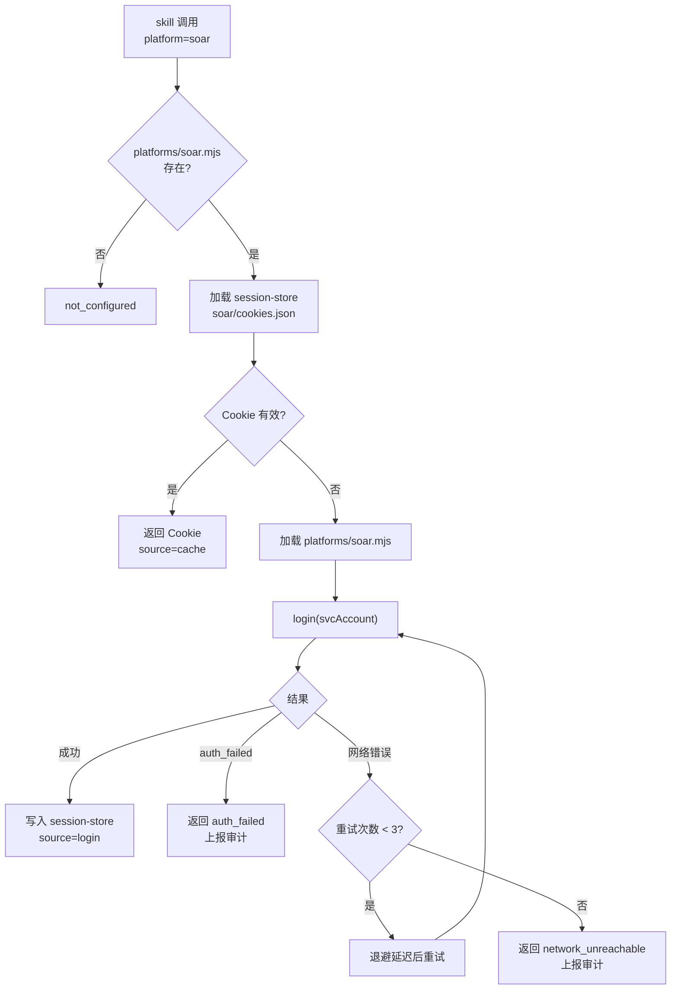

# Skill 服务账号鉴权与浏览器会话管理 — 模块需求与设计一体化文档

> **文档编号**: MOD-SKILL-AUTH-01
> **文档版本**: v0.2
> **创建日期**: 2026-07-07
> **文档状态**: 草稿

**评审边界说明**:
- **需求评审**: 第 2 章（需求分析）-> 通过后锁定为需求基线 v1.0
- **设计评审**: 第 3-4 章（技术设计 + 部署运维）-> 通过后锁定设计基线 v1.x
- **交接契约**: 2.5 验收条件 — 需求定义 What，设计实现 How

**ID 体系**: US（用户故事，来自 PRD）、FEAT（功能）、API（接口）、RULE（业务规则/系统约束）、TC（测试用例）、RISK（风险）、NFR（非功能指标）
场景编号：S-（正常）、E-（异常）、B-（边界，按需）

---

## 目录

- [1. 文档控制](#1-文档控制)
- [2. 需求分析](#2-需求分析)
  - [2.1 需求概述](#21-需求概述)
  - [2.2 痛点与价值](#22-痛点与价值)
  - [2.3 功能方案](#23-功能方案)
  - [2.4 范围与边界](#24-范围与边界)
  - [2.5 验收条件](#25-验收条件)
- [3. 技术设计](#3-技术设计)
  - [3.1 方案选型](#31-方案选型)
  - [3.2 架构设计](#32-架构设计)
  - [3.3 接口设计](#33-接口设计)
  - [3.4 质量实现方案](#34-质量实现方案)
- [4. 部署与运维](#4-部署与运维)
- [5. 风险与依赖](#5-风险与依赖)
- [6. 需求追溯矩阵](#6-需求追溯矩阵)
- [附录：术语表](#附录术语表)

---

## 1. 文档控制

### 1.1 责任人

| 角色 | 姓名 | 职责范围 |
|------|------|---------|
| 产品经理 | | 需求定义、业务验收 |
| 开发负责人 | | 技术方案、代码实现 |
| 测试负责人 | | 测试策略、质量保证 |

### 1.2 修订历史

| 版本 | 日期 | 作者 | 变更描述 |
|------|------|------|---------|
| v0.1 | 2026-07-07 | Codex | 从 PRD v0.2 派生，初始设计草稿 |
| v0.2 | 2026-07-07 | Codex | 简化为 session-manager + 插件式脚本，Console 零改动，无 DB 表 |

---

## 2. 需求分析

### 2.1 需求概述

| 项目 | 内容 |
|------|------|
| **模块名称** | Skill 服务账号鉴权与浏览器会话管理 |
| **模块ID** | MOD-SKILL-AUTH-01 |
| **所属系统/产品线** | muad-openclaw 集中化部署平台 |
| **需求类型** | 新功能 |
| **业务背景** | 集中化部署后 skill 运行在服务器 Pod 内，无法复用用户本地浏览器登录态。通过 session-manager 共享 skill + 插件式登录脚本调用业务平台 token API -> cookie API 获取 Cookie 并持久化。 |
| **核心目标** | 实现 session-manager 共享 skill，登录脚本由 session-manager 集中管理（`platforms/{platform}.mjs`），Console 侧无需任何改动。 |

---

### 2.2 痛点与价值

| 维度 | 内容 |
|------|------|
| **目标用户** | 通过企微使用 Claw skill 的终端用户。管理员负责部署 session-manager 和对应平台的登录脚本。 |
| **当前问题** | 集中化后 skill 无法访问用户本地浏览器 Cookie，且密码+headless Chromium 登录方案因验证码和单 session 约束不可行。 |
| **业务影响** | 所有依赖浏览器操作或 API 调用的 skill 在集中化部署后不可用。 |
| **预期价值** | 无需存储密码、无需 DB 变更、无需 Console 改造；新增平台对接只需一个脚本文件。 |

**用户故事**

| 编号 | 用户故事 | 优先级 |
|------|---------|--------|
| US-01 | 作为 skill 开发者，我希望新增一个平台登录脚本即可支持新业务平台。 | P0 |
| US-02 | 作为 skill 开发者/用户，我希望 skill 调用 session-manager 即可按 service 获取有效 Cookie。 | P0 |
| US-03 | 作为 skill 开发者/用户，我希望 Pod 重启后登录态能从 PVC 恢复。 | P0 |
| US-04 | 作为平台运维人员，我希望系统不存储任何密码或 token 明文。 | P0 |

---

### 2.3 功能方案

#### 2.3.1 功能清单

| 功能ID | 功能名称 | 功能描述 | 优先级 | 来源 |
|--------|---------|---------|--------|------|
| FEAT-01 | 插件式登录脚本框架 | 按 platform 加载 `platforms/{platform}.mjs`，传入 svcAccount，脚本调 token API -> cookie API。 | P0 | US-01 |
| FEAT-02 | Cookie 持久化与缓存 | Cookie 写入 PVC session-store，Pod 重启恢复；内存缓存。 | P0 | US-02, US-03 |
| FEAT-03 | Cookie 有效性管理 | 过期检查 + 可选 health check，失效自动重登。 | P0 | US-02 |
| FEAT-04 | 对外函数契约 | 统一接口：`{ platform }` -> `{ cookie, source }`。 | P0 | US-02 |
| FEAT-05 | 浏览器 Cookie 注入 | Playwright storageState 注入 Chromium profile。 | P1 | US-02 |
| FEAT-06 | 登录审计上报 | 登录/复用事件上报 Console 审计。 | P0 | US-04 |

---

### 2.4 范围与边界

| 类别 | 内容 |
|------|------|
| **范围（In Scope）** | session-manager 共享 skill + 插件式登录脚本框架；Cookie 持久化（PVC session-store）；Cookie 有效性管理；浏览器 Cookie 注入；审计上报。 |
| **非范围（Out of Scope）** | Console 凭证管理 UI/API；数据库表变更；BuildEnv 扩展；密码存储。 |
| **前置假设** | 业务平台提供 token API + cookie API；服务账号命名 `{userId}@skill.sangfor.com`；Pod 已有 headless Chromium + Playwright。 |

---

### 2.5 验收条件

#### 2.5.1 业务规则与约束

| ID | 类型 | 描述 |
|----|------|------|
| RULE-01 | 业务规则 | svcAccount 由 `{userId}@skill.sangfor.com` 派生，不存储 |
| RULE-02 | 系统约束 | 系统不存储密码、token 明文；审计日志不含 Cookie/token 明文 |
| RULE-03 | 系统约束 | session-store 仅当前用户 Pod 可访问（PVC 隔离 + node 权限） |

#### 2.5.2 功能验收场景

**正常场景**

| 场景ID | 功能ID | 优先级 | 前置条件 | 操作步骤 | 预期结果 |
|--------|--------|--------|---------|---------|---------|
| S-01 | FEAT-01, FEAT-02 | P0 | session-manager 已部署，platforms/soar.mjs 存在 | skill 调用 session-manager(platform=soar) | 加载 soar.mjs -> 调 token API -> cookie API -> Cookie 写入 session-store -> 返回 Cookie |
| S-02 | FEAT-02, FEAT-03 | P0 | S-01 已完成 | skill 再次调用 session-manager(platform=soar) | 检查 session-store Cookie 有效 -> 直接返回（source=cache） |
| S-03 | FEAT-02, FEAT-03 | P0 | Pod 被删除重建 | 新 Pod 启动后 skill 调用 session-manager | 加载 PVC session-store -> Cookie 仍有效 -> 直接返回 |

**异常场景**

| 场景ID | 功能ID | 触发条件 | 系统行为 | 用户感知 |
|--------|--------|---------|---------|---------|
| E-01 | FEAT-01 | platforms/soar.mjs 不存在 | 返回 `not_configured` | skill 收到可操作错误 |
| E-02 | FEAT-01 | token API 返回认证失败 | 返回 `auth_failed`，上报审计 | 企微通知管理员 |
| E-03 | FEAT-01 | cookie API 不可达 | 退避重试，连续失败返回 `network_unreachable` | 企微通知管理员 |

---

## 3. 技术设计

### 3.1 方案选型

#### 方案演进过程

| 方案 | 核心思路 | 否决原因 |
|------|---------|---------|
| Cookie 手动导入 | 用户导出 cookie.txt 上传 Console | session 冲突、用户操作负担重、安全风险高 |
| 本地 Agent 代理 | 用户机器跑 agent 转发请求 | 用户机器需 7x24 在线，网络拓扑复杂 |
| OAuth 代理 | Console 做 OAuth proxy | 业务平台不支持 OAuth，不解决浏览器依赖 |
| 密码 + headless 登录 | Pod 内 Chromium 自动填表登录 | 验证码无法自动绕过，登录页结构不稳定 |
| Token API 交换 + Console 存储 | 存 tokenApi/cookieApi 到 Console DB | 过度设计——API 地址是代码不是配置数据 |
| **Session-manager + 插件式脚本（采纳）** | API 地址硬编码在登录脚本中，脚本由 session-manager 集中管理 | — |

#### 关键决策记录

| 决策点 | 选择 | 理由 | 可逆性 |
|--------|------|------|--------|
| 登录脚本管理方式 | session-manager 集中管理（`platforms/`） | 脚本随 session-manager 一起分发和版本管理 | 易 |
| 是否新增 DB 表 | 否 | tokenApi/cookieApi 是代码逻辑不是配置数据 | 易 |
| 是否改造 Console | 否 | 全链路只需 Pod 内 skill 级别的改动 | 易 |

#### 技术栈

| 类别 | 选型 | 说明 |
|------|------|------|
| 运行时 | Node.js | openclaw skill 运行环境 |
| 浏览器自动化 | Playwright | Cookie 注入 Chromium profile |
| 持久化 | PVC 文件系统 | session-store/{service}/cookies.json |
| 审计 | Console audit API | 复用现有审计上报 |

---

### 3.2 架构设计

```
/opt/openclaw-skills/session-manager/       <- 共享 skill（skills PVC）
|-- SKILL.md                                 <- skill 元数据
|-- session-manager.mjs                      <- 核心：Cookie 管理、缓存、重试
|-- platforms/                               <- 登录脚本（由 SM 集中管理）
|   |-- soar.mjs                             <- SOAR: tokenApi + cookieApi
|   |-- jira.mjs                             <- Jira: tokenApi + cookieApi
|   |-- ...                                  <- 按需新增

skills/mss-soar/SKILL.md
  requires: session-manager, platform=soar   <- skill 声明依赖 + 指定平台
```

**数据流**

```
skill 调用 session-manager(platform=soar)
  -> session-manager 检查 session-store/{soar}/cookies.json
  -> 有效？返回 Cookie（source=cache）
  -> 失效？
    -> 加载 platforms/soar.mjs
    -> login(svcAccount="53842@skill.sangfor.com")
    -> 脚本内部: POST tokenApi -> POST cookieApi
    -> 返回 { cookie, expiresAt }
  -> 写入 session-store/{soar}/cookies.json
  -> 存入内存缓存
  -> 返回 Cookie（source=login）
  -> 上报审计 login.success
```

**目录结构（用户 PVC）**

```
/home/node/.openclaw/session-store/
|-- soar/
|   |-- cookies.json     <- { cookie, expiresAt }
|   |-- meta.json        <- { source, lastCheckedAt }
|-- jira/
|   |-- cookies.json
|   |-- meta.json
```

---

### 3.3 接口设计

#### 登录脚本契约

```js
// platforms/soar.mjs — 由 session-manager 加载
// 脚本内硬编码 tokenApi、cookieApi

/**
 * @param {string} svcAccount — "53842@skill.sangfor.com"
 * @returns {Promise<{cookie: string, expiresAt: string}>}
 */
export async function login(svcAccount) {
  // 1. POST tokenApi
  const tokenResp = await fetch("https://soar.sangfor.com/api/v1/token", {
    method: "POST",
    headers: {"Content-Type": "application/json"},
    body: JSON.stringify({userId: svcAccount})
  });
  if (!tokenResp.ok) throw new Error("auth_failed");
  const {token} = await tokenResp.json();

  // 2. POST cookieApi
  const cookieResp = await fetch("https://soar.sangfor.com/api/v1/cookie", {
    method: "POST",
    headers: {"Content-Type": "application/json"},
    body: JSON.stringify({token})
  });
  if (!cookieResp.ok) throw new Error("cookie_api_failed");
  const {cookie, expiresAt} = await cookieResp.json();

  return {cookie, expiresAt};
}
```

#### Session Manager 对外契约

```
skill:session-manager
  input:  { platform: "soar" }
  output: { cookie: "JSESSIONID=...", source: "cache" | "login" }
  error:  { error: "not_configured" | "auth_failed" | "network_unreachable" }
```

#### 处理流程



---

### 3.4 质量实现方案

#### 性能设计

无性能敏感点。Cookie 获取为低频操作（仅在 Cookie 过期时触发），session-store 文件读写为毫秒级。skip。

#### 可靠性设计

| 风险ID | 失效模式 | 影响 | 应对措施 |
|--------|---------|------|---------|
| RISK-01 | 登录脚本执行异常 | 无法获取 Cookie | 脚本 try/catch + 错误分类 + 退避重试 |
| RISK-02 | session-store 文件损坏 | 无法恢复 Cookie | 清理损坏文件，重新登录 |
| RISK-03 | 并发获取同一 service Cookie | 重复调 token API | 文件锁或内存 mutex |

#### 安全性设计

| 指标ID | 验收标准 | 实现方案 |
|--------|---------|---------|
| NFR-SEC-01 | 不存密码/token 明文 | tokenApi/cookieApi 在脚本中是常量；svcAccount 运行时派生；审计日志脱敏 |
| NFR-SEC-02 | session-store 隔离 | PVC per user + node 用户文件权限（0600） |

#### 可观测性设计

| 场景 | 实现方案 |
|------|---------|
| 审计 | 复用 Console audit API：login.success / login.failed / cookie.reused |
| 日志 | session-manager stdout -> kubectl logs，标注 `[session-mgr]` 前缀 |

---

## 4. 部署与运维

### 4.1 部署架构

session-manager 通过共享 skills PVC 分发，或随镜像预置到 `/opt/openclaw-skills/session-manager/`。登录脚本随 session-manager 一同部署。

### 4.2 新增平台

```bash
# 唯一需要的操作: 新增登录脚本
echo 'export async function login(svcAccount) { ... }'   > /opt/openclaw-skills/session-manager/platforms/new-platform.mjs
# 无需重启 Pod、无需改 Console、无需 DB migration
```

### 4.3 发布与回滚

session-manager 随 skills PVC 或镜像更新，登录脚本独立版本管理。

---

## 5. 风险与依赖

### 5.1 项目依赖

| 依赖方 | 依赖内容 | 状态 | 风险等级 |
|--------|----------|------|---------|
| 业务平台团队 | 提供 token API + cookie API | 待确认 | 高 |
| openclaw skill 机制 | session-manager 以 skill 形态运行 | 已满足 | 低 |
| Docker 镜像 | headless Chromium + Playwright | 已内置 | 低 |

### 5.2 风险识别

| 风险ID | 类型 | 描述 | 概率 | 影响 | 应对措施 |
|--------|------|------|------|------|---------|
| RISK-01 | 外部依赖 | 业务平台 token/cookie API 变更 | 中 | 高 | 脚本按平台独立维护；API 变更提前通知 |
| RISK-02 | 安全 | session-store Cookie 泄露 | 低 | 高 | PVC 隔离 + node 权限；不存 token 明文 |
| RISK-03 | 性能 | 首次全量 Pod 并发请求 token | 中 | 中 | 随机延迟启动；已有 session 不复调 API |

---

## 6. 需求追溯矩阵

| 用户故事 | 功能ID | 接口ID | 测试用例ID | 状态 |
|---------|--------|--------|-----------|------|
| US-01 | FEAT-01 | 登录脚本契约 | S-01 | v |
| US-02 | FEAT-02, FEAT-03, FEAT-04, FEAT-05 | session-manager 对外契约 | S-02, S-03 | v |
| US-03 | FEAT-02, FEAT-03 | session-manager 对外契约 | S-03 | v |
| US-04 | FEAT-06 | 审计上报 | E-02 | v |

---

## 附录：术语表

| 术语 | 定义 |
|------|------|
| Session Manager | Pod 内共享 skill，通过登录脚本获取 Cookie、持久化、缓存和有效性管理。 |
| 登录脚本 | `platforms/{platform}.mjs`，硬编码 tokenApi/cookieApi 调用逻辑，由 session-manager 加载。 |
| Session Store | PVC 中 Cookie 快照：`session-store/{service}/cookies.json`。 |
| svcAccount | `{userId}@skill.sangfor.com`，运行时派生。 |

---

*文档结束*
