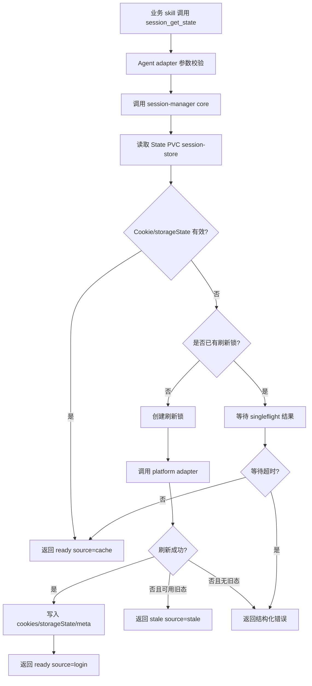

# 用户业务系统登录态与 Cookie 凭证托管 — 模块需求与设计一体化文档

> **文档编号**: MOD-SKILL-AUTH-01
> **文档版本**: v0.3
> **创建日期**: 2026-07-07
> **修订日期**: 2026-07-08
> **文档状态**: 草稿

**评审边界说明**:
- **需求评审**: 第 2 章锁定需求基线
- **设计评审**: 第 3-4 章锁定实现基线
- **交接契约**: 第 2.5、3.3、3.4 定义验收与接口

**ID 体系**: US（用户故事）、FEAT（功能）、API（接口）、RULE（规则）、TC（测试用例）、RISK（风险）、NFR（非功能指标）

---

## 目录

- [1. 文档控制](#1-文档控制)
- [2. 需求分析](#2-需求分析)
- [3. 技术设计](#3-技术设计)
- [4. 部署与运维](#4-部署与运维)
- [5. 风险与依赖](#5-风险与依赖)
- [6. 需求追溯矩阵](#6-需求追溯矩阵)
- [附录：术语表](#附录术语表)

---

## 1. 文档控制

### 1.1 责任人

| 角色 | 姓名 | 职责范围 |
|------|------|---------|
| 产品经理 | | 需求定义、业务验收 |
| 开发负责人 | | 技术方案、实现拆解 |
| 测试负责人 | | 测试策略、质量保证 |
| 运维负责人 | | K8s 挂载、发布、监控 |

### 1.2 修订历史

| 版本 | 日期 | 作者 | 变更描述 |
|------|------|------|---------|
| v0.1 | 2026-07-07 | Codex | 从 PRD v0.2 派生，初始设计草稿 |
| v0.2 | 2026-07-07 | Codex | 简化为 session-manager + 插件式脚本，Console 零改动 |
| v0.3 | 2026-07-08 | Codex | 补充 OpenClaw/Hermes 双 Agent 适配、public/private skill 分层、session-manager tool/plugin 最终形态 |

---

## 2. 需求分析

### 2.1 需求概述

| 项目 | 内容 |
|------|------|
| 模块名称 | 用户业务系统登录态与 Cookie 凭证托管 |
| 模块ID | MOD-SKILL-AUTH-01 |
| 所属系统 | muad-openclaw 集中化部署平台 |
| 需求类型 | 新功能 |
| 背景 | 集中化部署后，业务 skill 无法复用用户本地浏览器登录态，需要 Pod 内可用、按用户隔离、可跨 Agent 复用的登录态能力。 |
| 核心目标 | 通过 session-manager core + Agent adapter 暴露统一 tool，使业务 skill 自动获得 SOAR、Sea_SOAR、MSSW、XDR、SDSP 等平台登录态。 |

### 2.2 痛点与价值

| 维度 | 内容 |
|------|------|
| 当前痛点 | 服务器 Pod 无法读取用户本地 Cookie；业务平台自动登录受验证码、多步校验、单 session 互踢限制。 |
| 用户价值 | 企微/微信触发业务 skill 时无需手动导入 Cookie，不因登录态准备过程卡住。 |
| 开发价值 | 业务 skill 只调用统一 tool，不重复实现平台登录、缓存、刷新、锁。 |
| 架构价值 | OpenClaw/Hermes 切换只替换 adapter，session-manager core 与 session-store 保持复用。 |
| 运维价值 | Public skill 统一发布、Private skill 和 Cookie 按用户隔离，便于 100 用户规模部署。 |

### 2.3 用户故事

| 编号 | 用户故事 | 优先级 |
|------|---------|--------|
| US-01 | 作为内部用户，我希望在企微触发业务 skill 后自动获得业务系统登录态。 | P0 |
| US-02 | 作为 skill 开发者，我希望通过统一 tool 获取平台 Cookie/storageState。 | P0 |
| US-03 | 作为平台管理员，我希望 public skill 共享、private skill 私有。 | P0 |
| US-04 | 作为架构负责人，我希望 OpenClaw/Hermes 切换时核心登录逻辑不重写。 | P0 |
| US-05 | 作为用户，我希望登录态准备失败时收到明确反馈而不是卡住。 | P0 |
| US-06 | 作为运维人员，我希望系统不存密码/token 明文，日志脱敏。 | P0 |

### 2.4 功能方案

| 功能ID | 功能名称 | 功能描述 | 优先级 | 来源 |
|--------|---------|---------|--------|------|
| FEAT-01 | session-manager core | 独立核心能力：登录态获取、缓存、刷新、锁、持久化、状态返回。 | P0 | US-02, US-04 |
| FEAT-02 | OpenClaw adapter | 暴露 OpenClaw tool 或 CLI wrapper，让 OpenClaw 业务 skill 调用 core。 | P0 | US-02, US-04 |
| FEAT-03 | Hermes adapter | 以 Hermes Python plugin 注册 tool，并加入目标 toolset。 | P0 | US-02, US-04 |
| FEAT-04 | Public/Private Skill 分层 | OpenClaw/Hermes 均支持共享 public skill 与用户 private skill。 | P0 | US-03 |
| FEAT-05 | 平台适配模块 | 每个平台独立实现 token API -> cookie API 交换和 health check。 | P0 | US-01, US-02 |
| FEAT-06 | Session Store | Cookie/storageState/meta/lock 写入用户 State PVC。 | P0 | US-01, US-06 |
| FEAT-07 | 流畅体验保障 | 预热、懒加载、超时、singleflight、stale-if-error、结构化错误。 | P0 | US-05 |
| FEAT-08 | 可观测与安全日志 | 登录态事件脱敏记录，便于定位问题。 | P0 | US-06 |

### 2.5 验收条件

#### 2.5.1 规则与约束

| ID | 类型 | 描述 |
|----|------|------|
| RULE-01 | 账号规则 | svcAccount 默认由 `{userId}@skill.sangfor.com` 派生，不持久化。 |
| RULE-02 | 存储规则 | Cookie/storageState 只写当前用户 State PVC，不跨用户共享。 |
| RULE-03 | 安全规则 | 不存储密码或 token 持久明文；日志不含 Cookie/token 原文。 |
| RULE-04 | 分层规则 | Public skill 目录必须只读挂载；Private skill 目录必须位于用户 State PVC。 |
| RULE-05 | 体验规则 | 任何登录态获取路径必须有超时和结构化失败结果。 |
| RULE-06 | 兼容规则 | 平台登录逻辑只能在 core/platform adapter 中实现，不能复制到 OpenClaw/Hermes adapter。 |

#### 2.5.2 功能验收场景

| 场景ID | 功能ID | 前置条件 | 操作步骤 | 预期结果 |
|--------|--------|---------|---------|---------|
| S-01 | FEAT-01, FEAT-05 | 平台 API 正常 | 调用 `session_get_state(platform=soar)` | 返回 `status=ready`、`source=login`、Cookie/storageState 写入 State PVC。 |
| S-02 | FEAT-06 | S-01 已完成 | 再次调用同平台 | 返回 `source=cache`，不重复调用 token API。 |
| S-03 | FEAT-06 | Pod 删除重建 | 新 Pod 再次调用 | 从 State PVC 复用有效登录态。 |
| S-04 | FEAT-02, FEAT-03 | OpenClaw/Hermes adapter 均部署 | 分别在两个 Agent 下调用同一平台 | 返回结构一致，核心 session-store 可复用。 |
| S-05 | FEAT-04 | public/private skill 均存在 | 列出并加载 skill | public skill 可见且只读，private skill 只在当前用户可见。 |
| S-06 | FEAT-07 | 平台 API 超时 | 用户触发业务 skill | 在超时预算内返回 `timeout` 或 `platform_unavailable`，Agent 不无限等待。 |
| S-07 | FEAT-07 | 旧 Cookie 未明确失效，刷新失败 | 调用登录态 | 返回 `source=stale` 并触发后台/下次刷新。 |

#### 2.5.3 异常场景

| 场景ID | 触发条件 | 系统行为 | 用户感知 |
|--------|---------|---------|---------|
| E-01 | 平台适配不存在 | 返回 `not_configured` | 提示管理员补充平台适配。 |
| E-02 | token API 认证失败 | 返回 `credential_error`，不无限重试 | 提示平台凭证或账号映射异常。 |
| E-03 | cookie API 不可达 | 重试后返回 `platform_unavailable` | 提示平台暂不可用，稍后重试。 |
| E-04 | session-store 文件损坏 | 隔离/删除损坏文件并刷新 | 用户最多感知首次刷新变慢。 |
| E-05 | 同平台并发刷新 | singleflight 合并为一次刷新 | 多个请求获得同一结果。 |
| E-06 | public/private 同名冲突 | 不依赖覆盖，要求分类路径或唯一命名 | 管理员修正命名。 |

---

## 3. 技术设计

### 3.1 方案选型

#### 3.1.1 方案演进

| 方案 | 核心思路 | 结论 |
|------|---------|------|
| Cookie 手动导入 | 用户导出 Cookie 并上传 | 用户负担大，安全风险高，否决。 |
| 本地 Agent 代理 | 用户机器转发登录态 | 依赖用户机器在线，网络复杂，否决。 |
| 密码 + headless 登录 | Pod 内自动填表登录 | 验证码/单 session/页面变化不可控，否决。 |
| 纯 session-manager skill | 业务 skill 按说明调用脚本 | 依赖模型执行说明，确定性不足，仅适合 PoC。 |
| Agent 原生 plugin/tool | 分别实现 OpenClaw/Hermes 插件 | 执行稳定，但重复开发平台逻辑。 |
| **core + 双 adapter（采纳）** | 一套 core/CLI，OpenClaw/Hermes adapter 薄封装 | 兼顾稳定性、复用和切换成本。 |

#### 3.1.2 关键决策

| 决策点 | 选择 | 理由 |
|--------|------|------|
| 执行形态 | session-manager core + tool/plugin adapter | 避免纯 skill 自然语言调用的不确定性。 |
| OpenClaw | 优先 plugin/tool；短期可 CLI wrapper | OpenClaw tool 调用确定性更强。 |
| Hermes | Python plugin `ctx.register_tool` | Hermes 原生插件机制支持注册 tool。 |
| 核心复用 | core 一套 | 避免 OpenClaw/Hermes 平台登录逻辑写两遍。 |
| Public skill | 共享 PVC 只读挂载 | 所有 Pod 统一公共能力。 |
| Private skill | 用户 State PVC | 用户扩展和状态隔离。 |
| session-store | 用户 State PVC | Pod 重建恢复，不跨用户。 |

### 3.2 总体架构

```text
企微/微信用户
  -> Worker Pod
    -> 业务 skill
      -> session_get_state tool
        -> Agent adapter
          -> session-manager core / CLI
            -> platform adapter
              -> token API -> cookie API
            -> State PVC session-store
```

#### 3.2.1 目录与组件

```text
/opt/agent-public-skills/                         # Public Skills PVC, readOnly
  session-manager/
    SKILL.md                                      # 使用约定、业务 skill 调用说明
  soar/
    SKILL.md
  sea-soar/
    SKILL.md
  xdr/
    SKILL.md
  mssw/
    SKILL.md
  sdsp/
    SKILL.md

/opt/session-manager/                             # 镜像或只读发布目录
  bin/session-manager                             # core CLI
  platforms/
    soar.mjs                                      # 平台适配：token/cookie/health
    sea_soar.mjs
    xdr.mjs
    mssw.mjs
    sdsp.mjs

/home/node/.agent-session-store/                  # State PVC, per user
  soar/default/
    cookies.json
    storageState.json
    meta.json
    refresh.lock

/home/node/.openclaw/workspace/skills/            # OpenClaw private skill
/home/node/.hermes/skills/                        # Hermes private skill
```

#### 3.2.2 OpenClaw 能力映射

| 能力 | 落点 |
|------|------|
| Public skill | `skills.load.extraDirs` 指向 `/opt/agent-public-skills`。 |
| Private skill | workspace `skills/` 目录，挂载在用户 State PVC。 |
| session-manager tool | OpenClaw plugin/tool，或短期通过固定 CLI wrapper 调用 core。 |
| session-store | `/home/node/.agent-session-store`，兼容 `/home/node/.openclaw/session-store`。 |

#### 3.2.3 Hermes 能力映射

| 能力 | 落点 |
|------|------|
| Public skill | `skills.external_dirs` 指向 `/opt/agent-public-skills`。 |
| Private skill | `~/.hermes/skills`，挂载在用户 State PVC。 |
| session-manager tool | Hermes Python plugin，通过 `ctx.register_tool` 注册。 |
| 插件启用 | `plugins.enabled` 包含 `session-manager`。 |
| toolset | 目标平台 toolsets 需要包含 `session-manager`，避免插件加载但工具不可见。 |
| session-store | `/home/node/.agent-session-store`，兼容 `/home/node/.hermes/session-store`。 |

### 3.3 接口设计

#### API-01: core CLI

```bash
session-manager get-state \
  --platform xdr \
  --account default \
  --mode storage_state \
  --user-id 53842 \
  --json
```

成功返回：

```json
{
  "ok": true,
  "status": "ready",
  "platform": "xdr",
  "account": "default",
  "source": "cache",
  "cookiePath": "/home/node/.agent-session-store/xdr/default/cookies.json",
  "storageStatePath": "/home/node/.agent-session-store/xdr/default/storageState.json",
  "expiresAt": "2026-07-08T18:00:00+08:00"
}
```

失败返回：

```json
{
  "ok": false,
  "status": "timeout",
  "platform": "xdr",
  "account": "default",
  "errorCode": "platform_unavailable",
  "message": "XDR 登录态刷新超时，请稍后重试或联系管理员。"
}
```

#### API-02: tool 参数

| 字段 | 类型 | 必填 | 说明 |
|------|------|------|------|
| platform | string | 是 | `soar`、`sea_soar`、`xdr`、`mssw`、`sdsp`。 |
| account | string | 否 | 默认 `default`，为未来同平台多账号预留。 |
| mode | string | 否 | `cookie` 或 `storage_state`，默认 `cookie`。 |
| forceRefresh | boolean | 否 | 是否强制刷新。 |
| waitMs | number | 否 | 最大等待时间，默认由 adapter/core 决定。 |

#### API-03: platform adapter

```ts
export async function refresh(input: {
  platform: string;
  userId: string;
  svcAccount: string;
  account: string;
  mode: "cookie" | "storage_state";
  signal: AbortSignal;
}): Promise<{
  cookie?: string;
  storageState?: object;
  expiresAt?: string;
  healthCheckUrl?: string;
}>;
```

#### API-04: 状态枚举

| status | 含义 | 用户处理 |
|--------|------|---------|
| ready | 可用 | 业务 skill 继续执行。 |
| refreshing | 正在刷新 | adapter 可等待或提示稍后。 |
| stale | 返回旧登录态 | 业务 skill 可尝试继续。 |
| not_configured | 平台未配置 | 联系管理员。 |
| credential_error | 账号/凭证交换失败 | 联系管理员或平台负责人。 |
| platform_unavailable | 平台不可达 | 稍后重试。 |
| timeout | 超时 | 稍后重试，系统不得继续阻塞。 |

### 3.4 核心流程



### 3.5 流畅体验保障

| 机制 | 说明 |
|------|------|
| 预热 | Worker 启动后或用户首次会话时预热 SOAR/XDR 等高频平台。 |
| 懒加载 | 未预热平台在首次调用时刷新，不影响其他平台。 |
| 超时预算 | cache 读取 <= 1s；刷新 <= 20s；业务 skill 总等待预算可配置。 |
| singleflight | 同用户同平台同账号并发请求只允许一个真实刷新。 |
| stale-if-error | 旧登录态未明确失效时，刷新失败可返回 stale，避免用户立即失败。 |
| 结构化错误 | adapter 不返回自然语言堆栈，统一 errorCode + 用户可读 message。 |
| 用户反馈 | Agent 应把 `not_configured`、`credential_error`、`platform_unavailable` 转成明确话术。 |

### 3.6 安全设计

| 风险 | 设计 |
|------|------|
| token 泄露 | token 仅内存使用，不落盘、不进日志。 |
| Cookie 泄露 | Cookie/storageState 仅在用户 State PVC，文件权限限制当前用户。 |
| Public skill 被篡改 | Public Skills PVC 只读挂载，更新走发布流程。 |
| private skill 越权 | private skill 位于用户 State PVC，不跨用户挂载。 |
| 日志泄密 | 对 Cookie、Set-Cookie、token 做禁止输出和脱敏检查。 |

### 3.7 可观测性

事件格式：

```json
{
  "event": "session.refresh_success",
  "platform": "xdr",
  "account": "default",
  "userId": "53842",
  "source": "login",
  "durationMs": 1380,
  "timestamp": "2026-07-08T10:00:00+08:00"
}
```

事件类型：

| 事件 | 说明 |
|------|------|
| session.cache_hit | 命中有效缓存。 |
| session.refresh_start | 开始刷新。 |
| session.refresh_success | 刷新成功。 |
| session.refresh_failed | 刷新失败。 |
| session.timeout | 超时。 |
| session.stale_used | 使用旧登录态。 |
| session.clear | 清理登录态。 |

---

## 4. 部署与运维

### 4.1 K8s 挂载建议

| 挂载点 | 类型 | 读写 | 内容 |
|--------|------|------|------|
| `/opt/agent-public-skills` | Public Skills PVC / ConfigMap / 镜像目录 | 只读 | public skill、session-manager SKILL.md。 |
| `/opt/session-manager` | 镜像目录或只读 PVC | 只读 | core CLI、platform adapter。 |
| `/home/node/.agent-session-store` | State PVC | 读写 | Cookie、storageState、meta、lock。 |
| `/home/node/.openclaw/workspace/skills` | State PVC | 读写 | OpenClaw private skill。 |
| `/home/node/.hermes/skills` | State PVC | 读写 | Hermes private skill。 |

### 4.2 OpenClaw 配置建议

```json
{
  "skills": {
    "load": {
      "extraDirs": ["/opt/agent-public-skills"],
      "watch": true
    }
  }
}
```

OpenClaw adapter 优先实现为 plugin/tool。PoC 阶段可在 public skill 中固定约定 CLI 调用：

```bash
/opt/session-manager/bin/session-manager get-state --platform xdr --json
```

### 4.3 Hermes 配置建议

```yaml
skills:
  external_dirs:
    - /opt/agent-public-skills

plugins:
  enabled:
    - session-manager

toolsets:
  - hermes-cli
  - session-manager
```

安装方式：

```bash
hermes plugins install <owner>/<session-manager-plugin-repo> --enable
```

也可由镜像预置到：

```text
/home/node/.hermes/plugins/session-manager/
```

但仍需写入 `plugins.enabled`，并在网关/平台使用的 toolsets 中加入 `session-manager`。

### 4.4 新增平台

新增平台只允许改 platform adapter，不改业务 skill 和 Agent adapter。

```text
/opt/session-manager/platforms/new_platform.mjs
```

验收步骤：

1. `session-manager status --platform new_platform --json`
2. `session-manager get-state --platform new_platform --json`
3. 业务 skill 调用 `session_get_state(platform=new_platform)`
4. Pod 重建后再次验证缓存复用

### 4.5 发布与回滚

| 对象 | 发布方式 | 回滚方式 |
|------|---------|---------|
| public skill | 更新 Public Skills PVC 或镜像 | 回滚 PVC 版本或镜像版本。 |
| session-manager core | 镜像版本或只读发布目录 | 回滚镜像/目录版本。 |
| platform adapter | 独立文件版本 | 回滚单平台文件。 |
| Hermes plugin | `hermes plugins install/update` 或镜像预置 | `hermes plugins disable/remove` 或回滚镜像。 |
| OpenClaw plugin | 插件发布或镜像预置 | 禁用插件或回滚镜像。 |

---

## 5. 风险与依赖

### 5.1 项目依赖

| 依赖方 | 依赖内容 | 状态 | 风险等级 |
|--------|----------|------|---------|
| 业务平台团队 | token API、cookie API、health check | 待确认 | 高 |
| K8s 平台 | per-user State PVC、只读 public 挂载 | 待确认 | 中 |
| OpenClaw | plugin/tool 或 CLI wrapper、public/private skill 配置 | 已调研 | 中 |
| Hermes | `skills.external_dirs`、plugin tool、toolset 配置 | 已调研 | 中 |
| 镜像 | Node/Python/Playwright/Chromium/core CLI | 待确认 | 中 |

### 5.2 风险识别

| 风险ID | 类型 | 描述 | 概率 | 影响 | 应对措施 |
|--------|------|------|------|------|---------|
| RISK-01 | 外部依赖 | 平台 token/cookie API 变更 | 中 | 高 | 平台 adapter 独立维护；上线前契约测试。 |
| RISK-02 | 体验 | 平台接口慢导致用户等待 | 中 | 高 | 超时、预热、stale-if-error、结构化反馈。 |
| RISK-03 | 安全 | Cookie/storageState 泄露 | 低 | 高 | State PVC 隔离、权限、日志脱敏。 |
| RISK-04 | 架构 | OpenClaw/Hermes 插件 API 差异 | 中 | 中 | core 一套，adapter 薄封装。 |
| RISK-05 | 运维 | Hermes plugin 启用但 toolset 未配置 | 中 | 中 | 部署检查验证 `session-manager` toolset 可见。 |
| RISK-06 | 运维 | Public Skills PVC 被写入污染 | 低 | 高 | 只读挂载，发布流程更新。 |
| RISK-07 | 功能 | 同名 public/private skill 冲突 | 中 | 中 | 命名规范和分类路径，禁止依赖同名覆盖。 |

---

## 6. 需求追溯矩阵

| 用户故事 | 功能ID | 接口/配置 | 测试用例ID | 状态 |
|---------|--------|-----------|------------|------|
| US-01 | FEAT-05, FEAT-06 | core CLI、platform adapter | S-01, S-02, S-03 | 草稿 |
| US-02 | FEAT-01, FEAT-02, FEAT-03 | `session_get_state` | S-01, S-04 | 草稿 |
| US-03 | FEAT-04 | OpenClaw extraDirs、Hermes external_dirs | S-05 | 草稿 |
| US-04 | FEAT-01, FEAT-02, FEAT-03 | core + Agent adapter | S-04 | 草稿 |
| US-05 | FEAT-07 | status/errorCode/timeout | S-06, S-07, E-01-E-05 | 草稿 |
| US-06 | FEAT-06, FEAT-08 | State PVC、脱敏日志 | S-01, E-04 | 草稿 |

---

## 附录：术语表

| 术语 | 定义 |
|------|------|
| Session Manager | 登录态获取、缓存、刷新、持久化能力集合。 |
| session-manager core | 与 Agent 解耦的核心 CLI/库。 |
| Agent adapter | OpenClaw/Hermes 侧 tool/plugin 薄封装。 |
| Public Skill | 所有用户共享、只读发布的公共 skill。 |
| Private Skill | 当前用户私有、保存在 State PVC 的 skill。 |
| Session Store | 用户 State PVC 中保存 Cookie/storageState/meta/lock 的目录。 |
| Platform Adapter | 单个平台 token/cookie API 适配模块。 |
| svcAccount | `{userId}@skill.sangfor.com` 派生出的服务账号标识。 |
| singleflight | 同 key 并发请求合并为一次真实刷新。 |
| stale-if-error | 刷新失败时临时复用未明确失效的旧登录态。 |

---

*文档结束*
