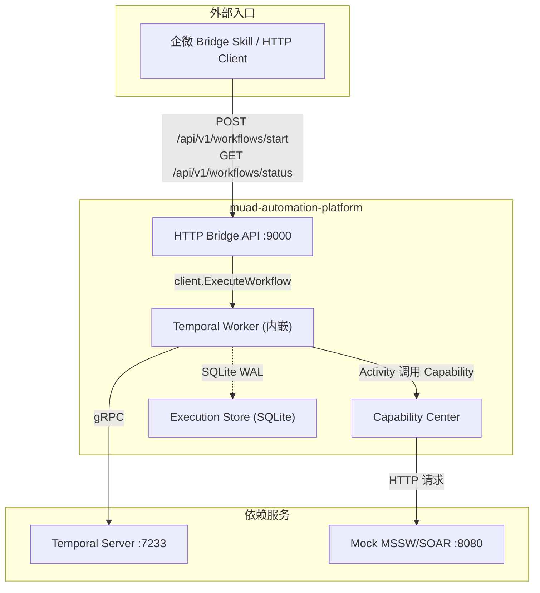
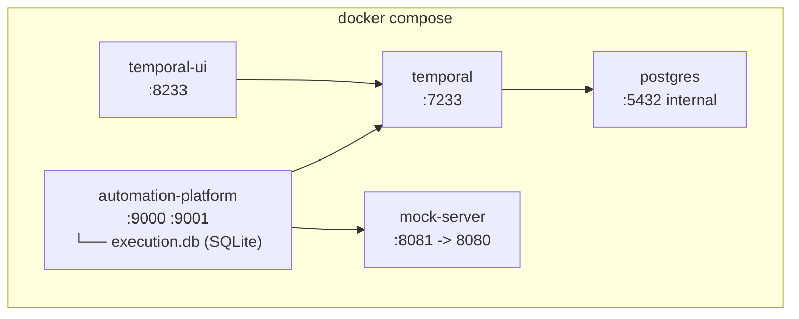

# muad-automation-platform Demo 模块需求与设计一体化文档

> **文档编号**: MOD-AUTOPLAT-0.1
> **文档版本**: v0.1
> **创建日期**: 2026-07-22
> **文档状态**: 草稿

**评审边界说明**:
- **需求评审**: 第 2 章（需求分析）→ 通过后锁定为需求基线 v1.0
- **设计评审**: 第 3-4 章（技术设计 + 部署运维）→ 通过后锁定设计基线 v1.x
- **交接契约**: 2.5 验收条件 — 需求定义 What，设计实现 How

**ID 体系**: US（用户故事，来自 PRD）、FEAT（功能）、API（接口）、RULE（业务规则/系统约束）、TC（测试用例）、RISK（风险）、NFR（非功能指标）
场景编号：S-（正常）、E-（异常）、B-（边界，按需）

---

## 目录

- [1. 文档控制](#1-文档控制)
- [2. 需求分析](#2-需求分析)
  - [2.1 需求概述](#21-需求概述-必填)
  - [2.2 痛点与价值](#22-痛点与价值-必填)
  - [2.3 功能方案](#23-功能方案-必填)
  - [2.4 范围与边界](#24-范围与边界-必填)
  - [2.5 验收条件](#25-验收条件-必填)
- [3. 技术设计](#3-技术设计)
  - [3.1 方案选型](#31-方案选型-必填)
  - [3.2 架构设计](#32-架构设计-必填)
  - [3.3 数据设计](#33-数据设计-必填)
  - [3.4 接口设计](#34-接口设计-必填)
  - [3.5 质量实现方案](#35-质量实现方案-必填)
- [4. 部署与运维](#4-部署与运维)
- [5. 风险与依赖](#5-风险与依赖)
- [6. 需求追溯矩阵](#6-需求追溯矩阵)
- [Spec Compliance Matrix](#spec-compliance-matrix)
- [附录：术语表](#附录术语表)

---

## 1. 文档控制

### 1.1 责任人

| 角色 | 姓名 | 职责范围 |
|------|------|---------|
| 产品经理 | 待填 | 需求定义、业务验收 |
| 开发负责人 | 待填 | 技术方案、代码实现 |
| 测试负责人 | 待填 | 测试策略、质量保证 |

### 1.2 修订历史

| 版本 | 日期 | 作者 | 变更描述 |
|------|------|------|---------|
| v0.1 | 2026-07-22 | | 初始草稿：PRD 派生，Demo 阶段设计 |

---

## 2. 需求分析

### 2.1 需求概述 [必填]

| 项目 | 内容 |
|------|------|
| **模块名称** | muad-automation-platform |
| **模块ID** | MOD-AUTOPLAT |
| **所属系统** | muad-openclaw 架构演进——SOP 可靠执行微服务 |
| **需求类型** | 新功能（新独立微服务） |
| **业务背景** | 当前 muad-openclaw 的 SOP 通过 Skill 脚本实现（mss-report-skill、sangfor-report-downloader），存在 API 封装重复、无状态持久化、步骤强耦合、容错缺失、审计盲区等生产级可靠性缺口 |
| **核心目标** | 构建独立 Go 微服务，引入 Temporal Workflow 引擎 + Capability Center，将两个存量 Skill 迁移为可独立重试、断点续传、结构化审计的 Workflow；本地 `docker compose up` 一键启动全链路 Demo |

### 2.2 痛点与价值 [必填]

| 维度 | 内容 |
|------|------|
| **目标用户** | 服务经理（~100 人，企微私聊交付）；平台管理员（1-2 人）；开发者 |
| **当前问题** | 1) `mss-report-skill/shared/api.py` 636 行 vs `sangfor-report-downloader/api_client.js` 各自封装同一批平台接口；2) `sangfor_downloader.js` `downloadReports()` 500 行顺序执行 15 步，单步失败全丢；3) `trigger_export.py` 用 `subprocess.Popen` 后台导出，Pod 重启即丢失；4) Cookie 6h 过期后全部不可用，无自动刷新；5) 只有 stdout/console.log，无结构化审计 |
| **业务影响** | 服务经理触发 SOP 后遇到中间步骤失败需重头再来；管理员无法追溯执行轨迹排查故障；新增 SOP 需重复实现 API、分页、重试逻辑 |
| **预期价值** | Capability 一次实现多 Workflow 复用；Temporal 原生重试+断点续传，Pod 重启自动恢复；Execution Store 提供 90 天审计回溯；新 SOP 80% 只需定义 Workflow+复用 Capability |

**用户故事**

| 编号 | 用户故事 | 优先级 |
|------|---------|--------|
| US-01 | 作为服务经理，我希望在企微中一句话触发 MSS 周报/月报导出，以便自动完成全流程，中间任何步骤失败自动重试或补偿 | P0 |
| US-02 | 作为服务经理，我希望触发深信服原始数据下载，以便自动获取各类数据并生成 Excel，单表下载失败不影响其他表 | P0 |
| US-03 | 作为平台管理员，我希望查看每次 Workflow 执行的完整轨迹，以便审计 SOP 执行和排查故障 | P0 |
| US-04 | 作为开发者，我希望在 Capability Registry 中注册新的平台 API 封装，以便新增平台接口时只需扩展 Capability 不修改已有 Workflow | P1 |

### 2.3 功能方案 [必填]

#### 2.3.1 功能清单

| 功能ID | 功能名称 | 功能描述 | 优先级 | 来源 |
|--------|---------|---------|--------|------|
| FEAT-01 | Temporal Workflow 引擎 | 集成 Temporal Server（Docker `temporaliotest/auto-setup`），Go SDK 内嵌 Worker，Activity 独立重试（指数退避 1s→4s→16s，最多 3 次）、Saga 补偿、断点续传 | P0 | US-01, US-02, US-03 |
| FEAT-02 | mss-weekly-report Workflow | 将 mss-report-skill 导出流程转为 Temporal Workflow：客户解析→模板获取→触发导出→轮询完成→邮件发送→Portal 同步，每步独立 Activity | P0 | US-01 |
| FEAT-03 | sangfor-download Workflow | 将 sangfor-report-downloader 转为 Temporal Workflow：客户解析→资产表→暴露面→事件表→告警表→漏洞表→弱口令统计→SOAR TopN→Excel 生成，部分失败不丢已完成数据 | P0 | US-02 |
| FEAT-04 | Capability Center (MSSW + SOAR) | 将两个 Skill 的 API 调用统一为 Go 模块（`internal/capability/mssw/`、`internal/capability/soar/`），统一处理分页、重试、熔断，通过 Registry 版本化注册 | P0 | US-01, US-02, US-04 |
| FEAT-05 | HTTP Bridge Workflow API | 提供 HTTP 接口 `POST /api/v1/workflows/start` + `GET /api/v1/workflows/status`，供 Bridge Skill 调用；gRPC 仅保留为本地调试接口 | P0 | US-01, US-02 |
| FEAT-06 | Mock MSSW / SOAR Server | 独立 HTTP 服务，模拟两个 Skill 所需全部依赖接口的固定 JSON 响应，支持零凭证验证 | P0 | US-01, US-02 |
| FEAT-07 | Execution Store | SQLite 存储 Workflow 执行记录和 Activity 步骤记录，提供 HTTP 查询 API | P0 | US-03 |
| FEAT-08 | Docker Compose 本地部署 | `docker compose up` 一键启动全部依赖，`docker compose down -v` 清理 | P0 | US-01, US-02, US-04 |

#### 2.3.2 字段约束

**FEAT-02: mss-weekly-report Workflow 参数**

| 字段名 | 类型 | 必填 | 约束 | 说明 |
|--------|------|------|------|------|
| company_name | string | Y | 非空 | 客户名称 |
| report_type | string | Y | `weekly` / `monthly` | 报告类型 |

**FEAT-03: sangfor-download Workflow 参数**

| 字段名 | 类型 | 必填 | 约束 | 说明 |
|--------|------|------|------|------|
| company_name | string | Y | 非空 | 客户名称 |
| start_date | string | Y | `YYYY-MM-DD` | 开始日期 |
| end_date | string | Y | `YYYY-MM-DD` | 结束日期 |
| type | string | N | `all` / `asset` / `event` / `alarm` / `vuln` / `exposed` | 报告类型，默认 `all` |

### 2.4 范围与边界 [必填]

| 类别 | 内容 |
|------|------|
| **范围（In Scope）** | 1) Temporal Workflow 引擎（Docker `temporaliotest/auto-setup`）；2) `mss-weekly-report` + `sangfor-download` 两个 Workflow；3) `mssw` + `soar` Capability 包；4) HTTP Bridge Workflow API（`POST /api/v1/workflows/start` + `GET /api/v1/workflows/status`），gRPC 仅作调试接口；5) Mock MSSW/SOAR Server；6) Execution Store（SQLite + HTTP 查询）；7) Docker Compose 一键部署；8) 通过企微 Bridge Skill 跑通完整触发链路 |
| **非范围（Out of Scope）** | 1) 生产级 Console 管理界面；2) Temporal Server 高可用；3) MCP 协议完整实现；4) Capability 版本路由（仅 v1）；5) CI/CD pipeline；6) 存量 Skill 删除/替换；7) 飞书/其他 IM |
| **前置假设** | Docker daemon 可用；端口 7233/8233/9001/9000/8081 未占用；Go 1.22+ 已安装 |
| **有意妥协 / 技术债** | Execution Store Demo 用 SQLite 文件；Temporal Demo 使用 PostgreSQL 容器；Mock Server 基于静态 JSON 非契约生成；生产级 Console 管理界面后续补齐 |

### 2.5 验收条件 [必填]

#### 2.5.1 业务规则与约束

| ID | 类型 | 描述 | 验证场景 |
|----|------|------|---------|
| RULE-01 | 业务规则 | Activity 瞬时故障自动重试（初始 1s，指数退避，最大 30s，最多 3 次） | S-01, E-01 |
| RULE-02 | 业务规则 | 业务预期失败（如客户不存在）不重试，直接 Fail Workflow | E-02 |
| RULE-03 | 业务规则 | 写操作 Activity 失败后执行补偿 Activity（Saga 模式） | E-03 |
| RULE-04 | 业务规则 | 非 `all` type 时仅执行对应 Activity，不下载无关数据 | S-03 |
| RULE-05 | 系统约束 | Capability 之间禁止相互调用，通过 boundary_test / AST import scan 约束 import 图 | S-04 |
| RULE-06 | 系统约束 | `docker compose up` 后所有服务 60s 内就绪 | S-01 |
| RULE-07 | 系统约束 | SQL 必须参数化，禁止拼接 | 设计审查 |

#### 2.5.2 功能验收场景

**正常场景**

| 场景ID | 功能ID | 优先级 | 测试层级 | 关键真实边界 | 前置条件 | 操作步骤 | 预期结果 |
|--------|--------|--------|---------|-------------|---------|---------|---------|
| S-01 | FEAT-01, FEAT-08 | P0 | E2E | Temporal Server → Worker → Mock Server → Execution Store | `docker compose up` 全部就绪 | 通过企微 Bridge Skill 或 HTTP `POST /api/v1/workflows/start` 发起 mss-weekly-report | 返回 `workflow_id` + `RUNNING`，Workflow 跑完全部 6 步 Activity，Temporal Web UI 可见完整 Event History |
| S-02 | FEAT-02 | P0 | E2E | Worker → Mock MSSW → Execution Store | Mock Server 就绪，company_name="TestCorp" | `StartWorkflow` mss-weekly-report, report_type=weekly | 全部 Activity 成功：company.resolve→report.get_template→report.trigger_export→report.poll→email.send→portal.sync，最终返回 task_id + email_result + portal_result |
| S-03 | FEAT-03 | P0 | E2E | Worker → Mock SOAR → Execution Store | Mock Server 就绪，company_name="TestCorp", dates 有效 | `StartWorkflow` sangfor-download, type=event | 仅执行 event Activity，不调用 asset/alarm/vuln Activity |
| S-04 | FEAT-04 | P1 | unit | Go 包 import 图 | — | 运行 boundary_test / AST import scan 检查 capability 包依赖 | `internal/capability/mssw` 不 import `internal/capability/soar`，反向同理 |
| S-05 | FEAT-07 | P0 | integration | HTTP API → SQLite | Workflow 已执行完成 | `GET /api/v1/executions?workflow_id=xxx` | 返回 JSON：workflow status + 各 Activity 的 name、status、start_time、end_time |
| S-06 | FEAT-06 | P0 | integration | Mock HTTP Server | Mock Server 就绪 | `curl http://localhost:8081/health` | HTTP 200 |

**异常场景**

| 场景ID | 功能ID | 测试层级 | 关键真实边界 | 触发条件 | 系统行为 | 用户感知 |
|--------|--------|---------|-------------|---------|---------|---------|
| E-01 | FEAT-01, FEAT-02 | E2E | Temporal RetryPolicy → Mock Server → Activity | Mock Server 对 `report.template` 前 2 次返回 500，第 3 次返回 200 | Activity 自动重试 3 次后成功，Workflow 继续 | HTTP status 查询返回 activity attempt=3 + SUCCEEDED |
| E-02 | FEAT-01, FEAT-02 | E2E | Temporal → Activity 错误分类 | Mock Server 对 `company.resolve` 返回 "customer not found" | Activity 不重试，直接 Fail Workflow | HTTP status 查询返回 status=FAILED，activity error="customer not found" |
| E-03 | FEAT-02 | E2E | Temporal → Compensating Activity | `email.send` Activity 成功，`portal.sync` Activity 失败 | 自动执行 `email.recall` 补偿 Activity | Execution Store 记录 `portal.sync=FAILED` + `email.recall=SUCCEEDED` |
| E-04 | FEAT-03 | E2E | Temporal → Activity 独立失败 | Mock SOAR `alarm.list` 始终返回 500（超重试次数） | `alarm.list` Activity 最终 FAILED，其他 Activity 继续完成 | `excel.generate` 在 Excel 中标注"告警表: 未获取" |
| E-05 | FEAT-01 | integration | Temporal Worker → Temporal Server | Worker 进程被 kill | Temporal Server 保留 Workflow 状态，Worker 重启后从中断处恢复继续执行 | 无数据丢失，Workflow 最终完成 |

**边界场景**

| 场景ID | 测试层级 | 关键真实边界 | 字段/条件 | 边界值 | 预期行为 |
|--------|---------|-------------|----------|--------|---------|
| B-01 | unit | HTTP Bridge → 参数校验 | report_type | 空字符串 / 非法值（"daily"） | `POST /api/v1/workflows/start` 返回 4xx 参数错误 |
| B-02 | unit | HTTP Bridge → 参数校验 | type（sangfor-download） | "unknown" | `POST /api/v1/workflows/start` 返回 4xx 参数错误 |
| B-03 | integration | Temporal → Workflow 幂等 | 重复触发同一 Workflow | 相同参数 2 次调用 | 第二次返回已有 `workflow_id` + `ALREADY_RUNNING` |

#### 2.5.3 非功能指标

**部署指标**

| 指标ID | 指标名称 | 目标值 | 测量方法 |
|--------|---------|-------|---------|
| NFR-DEPLOY-01 | `docker compose up` 到全部就绪 | ≤60s | `time docker compose up -d && until curl -s http://localhost:9000/health; do sleep 1; done` |

**可靠性指标**

| 指标ID | 指标名称 | 目标值 |
|--------|---------|-------|
| NFR-REL-01 | Worker 进程退出后恢复 | 重启 10s 内恢复 Workflow 执行 |

**安全指标**

| 指标ID | 安全域 | 验收标准 |
|--------|--------|---------|
| NFR-SEC-01 | 认证鉴权 | HTTP Bridge 使用固定 service token（header `Authorization: Bearer demo-token`），token 不匹配返回 401 |

**兼容性指标**

| 指标ID | 指标名称 | 目标值 |
|--------|---------|-------|
| NFR-COMPAT-01 | Go | 1.22+ |
| NFR-COMPAT-02 | Temporal Server | 内置（`temporaliotest/auto-setup:latest`） |

---

## 3. 技术设计

### 3.1 方案选型 [必填]

#### 关键决策记录

| 决策点 | 选择 | 被否决项 | 理由 | 可逆性 |
|--------|------|---------|------|--------|
| Workflow 引擎 | Temporal | 自建轻量引擎 / Camunda BPMN | 原生重试+断点续传+Saga+Event History，Go SDK 一等支持；自建成本远超引入 | 难（未来可换，但 Workflow 定义需重写） |
| 开发语言 | Go | Python / Node.js / Java | 与 muad Console 后端一致；Temporal Go SDK 成熟；团队统一 Go 技术栈 | 难（重写成本高） |
| Demo 数据库 | SQLite Execution Store + PostgreSQL Temporal DB | 全部 SQLite / 全部 PostgreSQL | Execution Store 保持 Demo 零运维；Temporal 使用 compose 内 PostgreSQL，与 Temporal 生产形态一致 | 易（Execution Store 后续换 driver 即可） |
| 接口协议 | HTTP Bridge API | gRPC / GraphQL | Skill 请求后台微服务统一走 HTTP，和 Demo 实际链路一致；gRPC 仅保留为本地调试接口 | 中（如需 MCP，可在 HTTP Bridge 前增加适配层） |
| Mock Server | 独立 Go 进程 | WireMock / JSON Server | 与主服务同语言，可复用 Capability 的请求/响应结构体定义 | 易（换 Mock 工具即可） |
| 模块结构 | Go `internal/` 分层 + boundary_test | pkg 扁平 | 通过 AST import scan 测试约束 Capability 依赖边界；与 Console backend 惯例一致 | 中（重构目录即可） |

#### 技术栈

| 类别 | 选型 | 版本 | 选型理由 |
|------|------|------|---------|
| 语言 | Go | 1.22+ | 团队统一；Temporal Go SDK 成熟 |
| Workflow 引擎 | Temporal | `temporaliotest/auto-setup:latest` | Docker Compose 一键启动；Temporal 数据落 PostgreSQL 容器 |
| 数据库 | SQLite（Execution Store）+ PostgreSQL（Temporal） | `modernc.org/sqlite` + `postgres:16-alpine` | Demo 执行记录零运维；Temporal 使用 PG |
| 接口协议 | HTTP Bridge API | JSON over HTTP | Skill 请求后台微服务统一 HTTP；gRPC 仅用于本地调试 |
| HTTP 路由 | `net/http` + `encoding/json` | Go 标准库 | Workflow 触发、状态查询和执行记录查询接口规模小，无需框架 |
| Mock Server | Go `net/http` | Go 标准库 | 轻量；同语言可复用结构体 |
| 容器编排 | Docker Compose | v2 | 5 服务：postgres + temporal + temporal-ui + mock-server + automation-platform |

### 3.2 架构设计 [必填]



#### 技术分层

```
api/http/          HTTP Bridge handler ── 入参校验 + token 鉴权 + Workflow 触发/状态查询
     │
workflow/          Temporal Workflow 定义 ── 编排 Activity 执行顺序
     │
capability/        业务能力实现 ── MSSW/SOAR API 调用 + 重试 + 分页
     │
store/             SQLite 持久化 ── Workflow 执行记录 + Activity 记录
```

#### 外部依赖清单

| 外部系统 | 依赖类型 | 协议 | 超时 | 降级策略 |
|---------|---------|------|------|---------|
| Temporal Server | Workflow 引擎 | gRPC :7233 | SDK 默认（长连接） | SDK 自动重连，Workflow 状态在 Server 持久化 |
| Mock MSSW/SOAR | 业务 API | HTTP :8080（容器内），宿主机 :8081 | 单次请求 30s | Demo 无降级；Activity 重试耗尽后 Fail Workflow |
| SQLite | Execution Store | 文件 I/O | 单次写入 <1s | 无（内嵌，不可降级） |

### 3.3 数据设计 [必填]

**新增表: `workflow_executions`**

| 字段名 | 类型 | 可空 | 默认值 | 约束 | 说明 |
|--------|------|------|--------|------|------|
| id | INTEGER | N | AUTO | PRIMARY KEY | 自增主键 |
| workflow_id | TEXT | N | — | UNIQUE | Temporal 生成的 Workflow ID |
| workflow_type | TEXT | N | — | — | `mss.weekly_report` / `soar.download_report` |
| status | TEXT | N | 'RUNNING' | — | `RUNNING` / `COMPLETED` / `FAILED` / `CANCELLED` |
| parameters_json | TEXT | Y | — | — | StartWorkflow 入参 JSON |
| result_json | TEXT | Y | — | — | Workflow 完成后的出参 JSON |
| error_message | TEXT | Y | — | — | 失败原因 |
| start_time | TEXT | N | — | — | ISO 8601 |
| end_time | TEXT | Y | — | — | ISO 8601 |

**索引**

| 索引名 | 字段 | 使用场景 |
|--------|------|---------|
| idx_we_workflow_id | workflow_id | GetWorkflowStatus 按 ID 查询 |
| idx_we_type_status | workflow_type, status | 按类型和状态过滤 |

**新增表: `activity_records`**

| 字段名 | 类型 | 可空 | 默认值 | 约束 | 说明 |
|--------|------|------|--------|------|------|
| id | INTEGER | N | AUTO | PRIMARY KEY | 自增主键 |
| workflow_id | TEXT | N | — | FK → workflow_executions.workflow_id | 所属 Workflow |
| activity_name | TEXT | N | — | — | `mssw.company.resolve` 等 |
| attempt | INTEGER | N | 1 | — | 第几次重试 |
| status | TEXT | N | — | — | `SCHEDULED` / `RUNNING` / `SUCCEEDED` / `FAILED` |
| input_json | TEXT | Y | — | — | Activity 入参 JSON |
| output_json | TEXT | Y | — | — | Activity 出参 JSON |
| error_message | TEXT | Y | — | — | 失败原因 |
| start_time | TEXT | N | — | — | ISO 8601 |
| end_time | TEXT | Y | — | — | ISO 8601 |

**索引**

| 索引名 | 字段 | 使用场景 |
|--------|------|---------|
| idx_ar_workflow | workflow_id | 按 Workflow 查所有 Activity 步骤 |

**ER图**

```mermaid
erDiagram
    workflow_executions ||--o{ activity_records : "workflow_id FK"
    workflow_executions { int id PK }
    activity_records { int id PK; text workflow_id FK }
```

**容量预估**

| 维度 | 预估值 |
|------|--------|
| 初始数据量（Demo） | <100 条 |
| 单次 Workflow 产生 activity_records | 6-10 条 |

### 3.4 接口设计 [必填]

#### 形态 A：HTTP Bridge Workflow API

**接口清单**

| 接口ID | 名称 | 方法 | 路径 | 详细 |
|--------|------|------|------|------|
| API-01 | 触发 Workflow | POST | `/api/v1/workflows/start` | [↓](#api-01) |
| API-02 | 查询 Workflow 状态 | GET | `/api/v1/workflows/status` | [↓](#api-02) |

---

#### API-01: StartWorkflow

**请求**: `POST /api/v1/workflows/start`

```json
{
  "workflow_type": "mss.weekly_report",
  "parameters": {
    "company_name": "TestCorp",
    "report_type": "weekly"
  },
  "timeout_seconds": 1800
}
```

**响应**:

```json
{
  "code": 0,
  "data": {
    "workflow_id": "mss-weekly-report-TestCorp-a1b2c3d",
    "status": "RUNNING"
  }
}
```

**HTTP header**: `Authorization: Bearer demo-token`

**错误码**

| 错误码 | 场景 |
|--------|------|
| 400 | `workflow_type` 非法或 `parameters` 格式错误 |
| 401 | Token 缺失或不匹配 |
| 409 | 相同参数 Workflow 已在运行 |
| 500 | Temporal Client 异常 |

---

#### API-02: GetWorkflowStatus

**请求**: `GET /api/v1/workflows/status?workflow_id=mss-weekly-report-TestCorp-a1b2c3d`

**响应**:

```json
{
  "code": 0,
  "data": {
    "workflow_id": "mss-weekly-report-TestCorp-a1b2c3d",
    "status": "COMPLETED",
    "activities": [
      {
        "name": "mssw.company.resolve",
        "status": "SUCCEEDED",
        "attempt": 1,
        "start_time": "2026-07-22T10:00:00Z",
        "end_time": "2026-07-22T10:00:01Z",
        "error_message": ""
      }
    ],
    "result": {},
    "error_message": ""
  }
}
```

---

> gRPC `:9001` 可保留为本地调试接口，但不作为 Bridge Skill 调用协议。

#### 形态 B：HTTP API（Execution Store 查询）

| 接口ID | 名称 | 方法 | 路径 | 详细 |
|--------|------|------|------|------|
| API-03 | 查询执行记录 | GET | `/api/v1/executions` | [↓](#api-03) |
| API-04 | 查询单次执行 | GET | `/api/v1/executions/{id}` | [↓](#api-04) |

---

#### API-03: 查询执行记录列表

**请求**: `GET /api/v1/executions?workflow_type=mss.weekly_report&status=COMPLETED&limit=20&offset=0`

**响应**:

```json
{
  "code": 0,
  "data": {
    "items": [
      {
        "id": 1,
        "workflow_id": "mss-weekly-report-TestCorp-a1b2c3d",
        "workflow_type": "mss.weekly_report",
        "status": "COMPLETED",
        "start_time": "2026-07-22T10:00:00Z",
        "end_time": "2026-07-22T10:05:30Z"
      }
    ],
    "total": 1
  }
}
```

#### API-04: 查询单次执行 + Activity 详情

**请求**: `GET /api/v1/executions/mss-weekly-report-TestCorp-a1b2c3d`

**响应**:

```json
{
  "code": 0,
  "data": {
    "workflow_id": "mss-weekly-report-TestCorp-a1b2c3d",
    "workflow_type": "mss.weekly_report",
    "status": "COMPLETED",
    "parameters": {"company_name": "TestCorp", "report_type": "weekly"},
    "result": {"task_id": "task-123", "email_result": "sent"},
    "activities": [
      {"name": "mssw.company.resolve", "status": "SUCCEEDED", "attempt": 1, "start_time": "2026-07-22T10:00:00Z", "end_time": "2026-07-22T10:00:01Z"},
      {"name": "mssw.report.get_template", "status": "SUCCEEDED", "attempt": 3, "start_time": "2026-07-22T10:00:01Z", "end_time": "2026-07-22T10:00:10Z", "error_message": "retry 1: 500, retry 2: timeout"}
    ]
  }
}
```

#### 形态 C：Mock Server HTTP Endpoints

> Mock Server 监听 `:8080`，模拟 MSSW 和 SOAR 全部依赖接口。以下列关键端点，详细清单以 `mock/` 目录内实际 handler 为准。

| 方法 | 路径 | 说明 | Capability 调用方 |
|------|------|------|-------------------|
| POST | `/api/mssw/company/search` | 客户搜索 | `mssw.company.SearchCompany` |
| POST | `/api/mssw/report/template` | 获取报告模板 | `mssw.report.GetTemplate` |
| GET | `/api/mssw/report/export` | 触发报告导出 | `mssw.report.TriggerExport` |
| POST | `/api/mssw/report/status` | 轮询报告状态 | `mssw.report.PollStatus` |
| POST | `/api/mssw/email/query` | 查询邮件内容 | `mssw.email.QueryContent` |
| POST | `/api/mssw/email/send` | 发送邮件 | `mssw.email.Send` |
| POST | `/api/mssw/email/recall` | 撤回邮件（补偿） | `mssw.email.Recall` |
| POST | `/api/mssw/portal/sync` | 同步 Portal | `mssw.portal.Sync` |
| POST | `/api/mssw/portal/unpublish` | 取消发布（补偿） | `mssw.portal.Unpublish` |
| POST | `/api/soar/company/search` | 客户搜索 | `soar.company.ResolveCompany` |
| POST | `/api/soar/asset/export` | 导出资产表 | `soar.asset.Download` |
| POST | `/api/soar/exposed/export` | 导出暴露面 | `soar.exposed.Download` |
| POST | `/api/soar/event/list` | 事件列表（分页） | `soar.event.List` |
| POST | `/api/soar/alarm/list` | 告警列表（分页） | `soar.alarm.List` |
| POST | `/api/soar/vuln/list` | 漏洞列表（分页） | `soar.vuln.List` |
| POST | `/api/soar/weakpwd/stats` | 弱口令统计 | `soar.weakpwd.GetStats` |
| POST | `/api/soar/topn/stats` | TopN 统计 | `soar.topn.GetStats` |
| GET | `/health` | 健康检查 | — |

**故障注入**: 请求中携带 `X-Mock-Error: true` 且 `X-Mock-Error-Attempt: N` 时，前 N 次返回 500，第 N+1 次返回正常。用于验证 Activity 重试和补偿逻辑。

### 3.5 质量实现方案 [必填]

#### 性能设计

> Demo 无性能敏感点。Workflow 执行时间由 Mock Server 响应速度决定（通常 <1s per Activity）。唯一可控延迟是 `mssw.report.poll` Activity 的轮询间隔（30s），Mock 模式下可缩短为 2s。

| 指标ID | 热点路径 | 目标值 | 实现方案 |
|--------|---------|-------|---------|
| NFR-DEPLOY-01 | `docker compose up` | ≤60s | 5 服务并行/按依赖启动；automation-platform 等待 Temporal 和 Mock Server 就绪 |

#### 可靠性设计

**风险 / 失效应对**

| 风险ID | 失效模式 | 影响 | 应对措施 | 验证场景 |
|--------|---------|------|---------|---------|
| RISK-01 | Mock Server 不可用 | Workflow 所有 Activity 失败 | Temporal 自动重试（最多 3 次），耗尽后 Workflow FAILED | E-01 |
| RISK-02 | Temporal Server 不可用 | Worker 无法注册/轮询任务 | Worker 自动重连（SDK 默认），重启后恢复 | E-05 |
| RISK-03 | Mock 数据与真实 API 响应结构不一致 | 接入真实 API 后 Capability 需适配 | Mock handler 基于真实 Skill 源码中的 API payload 编写；每个 endpoint 注释来源 API URL | —（架构约束，非运行时验证） |
| RISK-04 | 重复触发同一 Workflow | 资源浪费 | 同一 workflow_type+parameters 幂等返回已有 workflow_id | B-03 |

#### 安全性设计

| 指标ID | 验收标准 | 实现方案 |
|--------|---------|---------|
| NFR-SEC-01 | HTTP Bridge 鉴权 | HTTP handler 校验 `Authorization: Bearer <token>`；Demo 阶段固定 token `demo-token`；token 不匹配返回 401 |
| — | 日志脱敏 | 遵循 RULE-backend-redact-001，Activity input/output 写入 Execution Store 前对敏感字段（cookie、api_key）脱敏 |

#### 可观测性设计

| 场景 | 实现方案 |
|------|---------|
| Workflow 执行追踪 | Temporal Web UI (`http://localhost:8233`) — 查看 Event History、Activity 重试次数、堆栈 |
| Execution 审计 | HTTP API `GET /api/v1/executions/:id` — 结构化 JSON 包含每步 input/output |
| 服务日志 | Go `log/slog` 结构化 JSON 输出到 stdout；Activity 执行时打印 `workflow_id` + `activity_name` + `attempt` |

---

## 4. 部署与运维

### 4.1 部署架构

| 环境 | 配置 | 实例数 | 用途 |
|------|------|--------|------|
| dev | Docker Compose 本地 | 1 per service | 开发 + Demo 验证 |



**docker-compose.yml 结构**:

```yaml
services:
  postgres:
    image: postgres:16-alpine
    environment:
      - POSTGRES_USER=temporal
      - POSTGRES_PASSWORD=temporal
      - POSTGRES_DB=temporal
    healthcheck:
      test: ["CMD-SHELL", "pg_isready -U temporal"]
      interval: 3s
      timeout: 2s
      retries: 10

  temporal:
    image: temporaliotest/auto-setup:latest
    ports:
      - "7233:7233"   # gRPC for SDK
    environment:
      - DB=postgres12
      - DB_PORT=5432
      - POSTGRES_USER=temporal
      - POSTGRES_PWD=temporal
      - POSTGRES_SEEDS=postgres
    depends_on:
      postgres:
        condition: service_healthy

  temporal-ui:
    image: temporalio/ui:latest
    ports:
      - "8233:8080"
    environment:
      - TEMPORAL_ADDRESS=temporal:7233
      - TEMPORAL_CORS_ORIGINS=http://localhost:8233

  mock-server:
    build: ./mock
    ports:
      - "8081:8080"

  automation-platform:
    build: .
    ports:
      - "9000:9000"   # HTTP API
      - "9001:9001"   # gRPC
    environment:
      - TEMPORAL_HOSTPORT=temporal:7233
      - MOCK_SERVER_URL=http://mock-server:8080
      - DB_PATH=/data/execution.db
      - AUTH_TOKEN=demo-token
    depends_on:
      temporal:
        condition: service_started
      mock-server:
        condition: service_started
      mock-server:
        condition: service_started
    volumes:
      - execution_data:/data

volumes:
  execution_data:
```

### 4.2 发布与回滚 [按需]

> Demo 阶段不涉及。持续开发用 `docker compose up --build` 重新构建。

### 4.3 监控告警 [按需]

> Demo 阶段：`docker compose logs -f automation-platform` 查看结构化日志；Temporal Web UI (`:8233`) 查看 Workflow 状态。

---

## 5. 风险与依赖

### 5.1 项目依赖

| 依赖模块/团队 | 依赖内容 | 状态 | 风险等级 |
|-------------|---------|------|---------|
| Temporal | `temporaliotest/auto-setup` Docker 镜像 | 公开可用 | 低 |
| Go 标准库 | `net/http`、`database/sql`、`log/slog` | 内建 | 低 |
| `modernc.org/sqlite` | 纯 Go SQLite driver | 公开发布 | 低 |
| `go.temporal.io/sdk` | Temporal Go SDK | 公开发布 | 低 |
| `google.golang.org/grpc` | gRPC Go（本地调试接口） | 公开发布 | 低 |
| `google.golang.org/protobuf` | Proto 编译（本地调试接口） | 公开发布 | 低 |

### 5.2 风险识别

| 风险ID | 类型 | 描述 | 概率 | 影响 | 应对措施 | 验证场景 |
|--------|------|------|------|------|---------|---------|
| RISK-01 | 技术 | Mock 数据与真实 MSSW/SOAR API 响应结构不一致，导致 Capability 在接入真实 API 后需大量适配 | 中 | 中 | Mock 基于存量 Skill 实际调用的 API payload 编写（参考 `mss-report-skill/shared/api.py` 和 `sangfor-report-downloader/api_client.js`） | E2E 场景全部基于 Mock 跑通后，后续接入真实 API 做一次对照验证 |
| RISK-02 | 技术 | Temporal Go SDK 学习曲线，Activity 和 Workflow 的确定性约束（禁止非确定性操作）可能引入调试成本 | 中 | 中 | 先用官方 `helloworld` 搭建骨架；在 Temporal Web UI 辅助调试 Event History | S-01 |
| RISK-03 | 架构 | sangfor-report-downloader 涉及 SOAR + XDR 两套系统共 15+ 接口，Mock 工作量大 | 中 | 低 | XDR 接口 Demo 阶段先做 2 个核心（in2out/out2in log count），其余后续补充 | S-03 覆盖全部接口 |
| RISK-04 | 技术债 | SQLite 在 Demo 后需迁移到 PostgreSQL | 高 | 低 | Go `database/sql` 接口统一，迁移只需换 driver + DSN | — |

---

## 6. 需求追溯矩阵

| 用户故事 | 功能ID | 接口ID | 测试用例ID | 测试层级 | 状态 |
|---------|--------|--------|-----------|---------|------|
| US-01 | FEAT-01 | API-01 | S-01 | E2E | 待实现 |
| US-01 | FEAT-02 | API-01 | S-02 | E2E | 待实现 |
| US-01 | FEAT-02 | API-01 | E-01, E-02, E-03 | E2E | 待实现 |
| US-02 | FEAT-03 | API-01 | S-03 | E2E | 待实现 |
| US-02 | FEAT-03 | API-01 | E-04 | E2E | 待实现 |
| US-03 | FEAT-07 | API-03, API-04 | S-05 | integration | 待实现 |
| US-04 | FEAT-04 | — | S-04 | unit | 待实现 |
| US-01, US-02 | FEAT-06 | — | S-06 | integration | 待实现 |
| US-01, US-02 | FEAT-01 | — | E-05 | integration | 待实现 |
| US-01, US-02 | FEAT-05 | API-01, API-02 | B-01, B-02 | unit | 待实现 |
| US-01, US-02, US-04 | FEAT-08 | — | S-01 | E2E | 待实现 |
| — | — | — | B-03 | integration | 待实现 |

> RULE-07（SQL 参数化）在编码阶段通过 code review 验证，不映射到自动化场景。

---

## Spec Compliance Matrix

| Spec/Rule | enforcement | 设计影响 | 设计落点 | 验证场景 | 状态/N/A 理由 |
|-----------|-------------|---------|---------|---------|----------------|
| `backend-code-quality-performance#RULE-backend-quality-001` | required | Go 错误必须显式处理；外部调用（Temporal、Mock Server）必须带 context deadline | §3.4 接口设计：HTTP Bridge handler 返回结构化错误；Capability 调用 Mock Server 带 `context.WithTimeout` | S-01, E-01 | applied |
| `backend-database#RULE-backend-database-001` | required | SQL 参数化；持久化限于 `internal/store/` | §3.3 数据设计：repo 方法使用 `?` 占位符；schema 迁移文件 `migrations/` | 设计审查 | applied |
| `backend-database#RULE-backend-no-select-star-001` | required | 查询列显式列出 | §3.3 数据设计：repo 查询写 `SELECT id, workflow_id, workflow_type, status...` | 设计审查 | applied |
| `backend-logging#RULE-backend-logging-001` | required | 结构化日志；不含密钥 | §3.5 质量实现方案：Go `log/slog` JSON 输出，配置见 §4.1 部署 | 设计审查 | applied |
| `backend-logging#RULE-backend-redact-001` | required | Activity input/output 写入前脱敏 | §3.5 安全性设计：敏感字段脱敏后写入 Execution Store | 设计审查 | applied |
| `backend-directory-structure` | required | 不适用——新服务在独立仓库 `/Users/jahan/workspace/muad-automation-platform`，不在 `console/backend/` 下 | — | — | confirmed N/A |
| `backend-platform-rules` | required | 不适用——Console HTTP envelope、模型池绑定非本服务职责 | — | — | confirmed N/A |
| `frontend-component-specs` | required | 不适用——无前端 | — | — | confirmed N/A |
| `frontend-directory-structure` | required | 不适用——无前端 | — | — | confirmed N/A |
| `frontend-quality-standards` | required | 不适用——无前端 | — | — | confirmed N/A |
| `runtime-config-and-apply` | required | 不适用——Worker 运行时配置非本服务职责 | — | — | confirmed N/A |
| `runtime-directory-structure` | required | 不适用——Worker/tools/bin 目录非本服务职责 | — | — | confirmed N/A |
| `runtime-isolation-and-security` | required | 不适用——用户隔离/浏览器 profile 非本服务职责 | — | — | confirmed N/A |
| `runtime-skill-execution` | required | 不适用——Skill 分层/激活/并发非本服务职责（本服务替代了 Skill 的执行逻辑） | — | — | confirmed N/A |

---

## 附录：术语表

| 术语 | 定义 |
|------|------|
| US | User Story，用户故事（来自 PRD） |
| FEAT | Feature，功能项 |
| API | Application Programming Interface，接口 |
| RULE | 业务规则或系统约束 |
| TC | Test Case，测试用例 |
| RISK | 风险项 |
| NFR | Non-Functional Requirement，非功能性需求 |
| ADR | Architecture Decision Record，架构决策记录 |
| Temporal | 分布式 Workflow 引擎，提供重试、补偿、断点续传、Event History |
| Activity | Temporal 中的单个执行步骤，独立重试和超时 |
| Workflow | SOP 的数字化表达，编排多个 Activity 的执行顺序和错误处理 |
| Saga | 分布式事务补偿模式——写操作失败后执行反向补偿操作 |
| Capability | 对业务平台 API 的一次封装（含鉴权、分页、重试），版本化注册 |
| MCP | Model Context Protocol — Agent 工具发现和调用协议（本阶段不实现完整 MCP；Skill 主链路统一走 HTTP Bridge） |

---

*文档结束*
