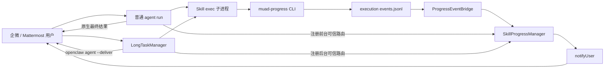
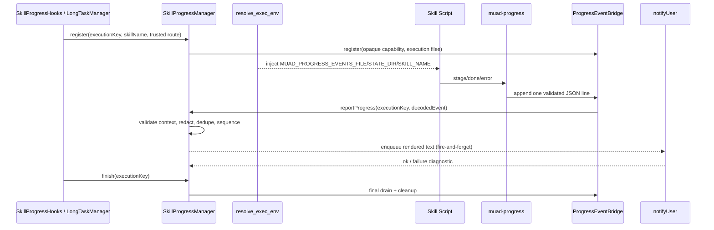

# Skill 主动进度反馈 V2 需求与设计一体化文档

> **文档编号**: MOD-SKILL-PROGRESS-V2
> **文档版本**: v1.0
> **创建日期**: 2026-08-28
> **文档状态**: 已确认（进入 Spec design gate）

**评审边界说明**:

- **需求评审**: 第 2 章锁定前台与后台 Skill 都支持主动进度，不恢复旧执行器和旧审计表模型。
- **设计评审**: 第 3-4 章锁定 `muad-progress`、`SkillProgressManager`、`ProgressEventBridge`、`LongTaskManager` 与 `notifyUser` 的职责边界。
- **交接契约**: §2.5 场景是后续任务拆解与自动化测试的验收来源。

**ID 体系**: US（用户故事）、FEAT（功能）、CLI/IF（接口）、RULE（规则）、S/E/B（验收场景）、RISK（风险）、NFR（非功能指标）。

---

## 1. 文档控制

### 1.1 责任人

| 角色 | 姓名 | 职责范围 |
|------|------|---------|
| 产品负责人 | 待定 | 进度消息范围、频率与格式验收 |
| 开发负责人 | 待定 | CLI、runtime-guard、镜像和模板实现 |
| 测试负责人 | 待定 | 多渠道、多用户隔离及故障场景验证 |
| 架构负责人 | 待定 | OpenClaw 插件边界与运行时安全评审 |

### 1.2 修订历史

| 版本 | 日期 | 作者 | 变更描述 |
|------|------|------|---------|
| v0.1 | 2026-08-28 | Codex | 基于旧版 `muad-progress` 和当前 `LongTaskManager` 形成首版草稿 |
| v0.2 | 2026-08-28 | Codex | 扩展到非长任务 Skill；确认不写数据库、只保证企微/Mattermost 文本消息；补充 `--json` 契约 |
| v0.3 | 2026-08-28 | Codex | 确认仅提供 CLI、Skill 自主选择上报节点；CLI 改为参照 session-manager 的 TypeScript/dist/bin 模式 |

---

## 2. 需求分析

### 2.1 需求概述

| 项目 | 内容 |
|------|------|
| **模块名称** | Skill 主动进度反馈 V2 |
| **模块ID** | MOD-SKILL-PROGRESS-V2 |
| **所属系统** | muad-openclaw Worker Runtime |
| **需求类型** | 功能恢复 + 运行时架构演进 |
| **业务背景** | 当前普通 Skill 在多工具/多步骤执行期间可能长时间静默，`longTask:true` Skill 也只在提交和最终成功/失败时反馈。旧分支曾实现语言无关的 `muad-progress`，但其生产链路依赖已退役的 `muad-run-skill`。 |
| **核心目标** | 恢复 `muad-progress` 作为 Skill 侧结构化事件生产者，由独立 `SkillProgressManager` 为普通前台 Skill 与后台长任务提供统一的可信路由、治理和主动文本推送。 |

### 2.2 痛点与价值

| 维度 | 内容 |
|------|------|
| **目标用户** | 在企微、Mattermost 中触发普通或长任务 Skill 的业务用户；编写 Shell/Python/TypeScript/Go Skill 的开发者；运行时运维人员。 |
| **当前问题** | 普通和长任务 Skill 在多步骤执行期间都可能长时间静默；用户会重复追问或误判任务卡死。Skill 开发者缺少与语言无关的进度入口。 |
| **业务影响** | 降低长任务可信度，增加重复请求、人工确认和故障排查成本。 |
| **预期价值** | 用户可看到“当前节点 + 上一步结果”；Skill 使用统一 CLI；运行时集中保证目标归属、脱敏、顺序和频率。 |

**用户故事**

| 编号 | 用户故事 | 优先级 |
|------|---------|--------|
| US-01 | 作为 Skill 用户，我希望无论当前 Skill 是否标记为长任务，都能看到当前执行节点和已完成节点结果。 | P0 |
| US-02 | 作为 Skill 开发者，我希望 Shell、Python、TypeScript、Go 都能用同一个 CLI 上报进度。 | P0 |
| US-03 | 作为平台运维人员，我希望进度投递不跨用户、不泄密、不影响主任务成功与最终回复。 | P0 |
| US-04 | 作为前台 Skill 用户，我希望进度消息和当前对话保持同一企微/Mattermost 路由，不需要额外配置目标。 | P0 |

### 2.3 功能方案

#### 2.3.1 功能清单

| 功能ID | 功能名称 | 功能描述 | 优先级 | 来源 |
|--------|---------|---------|--------|------|
| FEAT-01 | 恢复 `muad-progress` CLI | 参照 `tools/session-manager` 以 TypeScript strict 实现 `stage`、`done`、`error`、`validate` 和 `--json`；命令调用对 Shell/Python/TypeScript/Go 保持语言无关。 | P0 | 需求描述（US-02） |
| FEAT-02 | 通用 Skill 进度执行上下文 | 为已激活的普通前台 Skill 和已提交的长任务分别注册隔离事件通道；runtime-guard 增量消费并绑定可信 execution。 | P0 | 需求描述（US-01、US-03、US-04） |
| FEAT-03 | 主动 IM 投递 | `SkillProgressManager` 使用可信执行上下文保存的 `channel/peerId` 调用共享 `notifyUser`，Skill 不得指定收件人。 | P0 | 需求描述（US-01、US-03、US-04） |
| FEAT-04 | 进度治理 | 对事件执行 schema 校验、归属校验、脱敏、长度限制、顺序化和故障降级；不自动生成、合并、去重或按业务数量限流进度。 | P0 | 需求描述（US-03） |
| FEAT-05 | 镜像与开发模板 | Worker 镜像构建 CLI、自检命令产物；同步 Shell/Python/TypeScript/Go 调用示例、业务 Skill 模板、README 和测试。 | P0 | 需求描述（US-02） |
| FEAT-06 | 运行时可观测性 | 仅记录不含业务敏感正文的 accepted/delivered/dropped/failed 运行时诊断；不写 Console 数据库、不恢复旧进度审计模型。 | P1 | 需求描述（US-03） |

#### 2.3.2 进度事件字段约束

| 字段名 | 类型 | 必填 | 约束 | 说明 |
|--------|------|------|------|------|
| `type` | enum | 是 | `progress` / `done` / `error` | 节点进行中、节点完成、节点失败；不代表整个任务最终回复。 |
| `stage` | string | 是 | `^[a-z][a-z0-9_-]{0,63}$` | 稳定的业务节点 ID。 |
| `text` | string | 是 | 推荐不超过 160 Unicode 字符，硬上限 1000 字符 | 用户可见摘要，允许换行、Emoji 和 Markdown 字符，仅按文本载荷解释。 |
| `skill` | string | 否 | CLI 可展示；manager 必须覆盖为执行上下文中的真实 skillName | 不作为可信路由字段。 |
| `id` | string | 否 | 最多 80 字符 | 可选业务事件标识，仅用于诊断关联；V2 不据此去重。 |
| `code` | string | 否 | `error` 时可用，最多 80 字符 | 稳定错误码，不允许原始异常。 |
| `visibility` | enum | 否 | V2 固定 `channel` | 非 `channel` 事件丢弃。 |
| `privacy` | enum | 否 | V2 固定 `public` | 非 `public` 事件丢弃。 |
| `ts` | RFC3339 | CLI 生成 | manager 仅用于诊断，不用于排序 | 投递顺序由 manager 接收序号决定。 |

#### 2.3.3 CLI 输出与用户消息格式

- `--text` 是普通 Unicode 字符串，支持中文、英文、换行和 Emoji。
- V2 只把 `--text` 作为文本载荷；其中可以包含 Markdown 字符，但系统不解析或转换 Markdown，也不承诺两渠道具有完全相同的 Markdown 语义。
- 验收口径是中文/英文、换行、Emoji 和常见 Markdown 字符在企微、Mattermost 中可读且不乱码；HTML、卡片、按钮、附件和图片不在本期范围。
- manager 渲染简短稳定的文本消息，例如：

```text
进度 · report-customer-weekly
✅ 查询数据：已获取 128 条有效记录
```

- `--json` 只控制 `muad-progress` 自身 stdout 是否输出机器可读的调用结果，绝不改变 `--text` 的 IM 消息格式。它用于脚本、测试或 CI 判断参数是否合法、事件是否已写入异步通道，例如 `{"ok":true,"delivery":"written"}`；它无法代表企微/Mattermost 已送达。
- 图片、文件、卡片和完整结果继续由 OpenClaw 原生最终回复承担。

#### 2.3.4 Skill 语言兼容边界

- TypeScript 仅是 CLI 的内部实现语言，不是 Skill 接入 SDK；任何能启动子进程的 Skill 脚本都可调用 `/usr/local/bin/muad-progress`。
- Shell 直接执行命令，Python 使用 `subprocess`，TypeScript/JavaScript 使用 `child_process`，Go 使用 `os/exec`；四种调用方式共享完全相同的 argv、env、退出码和 stdout/stderr 契约。
- 纯提示词/多工具编排 Skill 也可在 `SKILL.md` 指定节点，通过 OpenClaw `exec` 调用 CLI；本期不要求注册专用 Agent Tool。
- CLI 不要求调用方安装 Node 包或 import TypeScript 模块；Worker 镜像统一提供命令和 Node runtime。
- 唯一前置条件是调用发生在 runtime-guard 已识别的活动 Skill execution 中，使 `resolve_exec_env` 能注入受信事件文件路径。没有 exec/子进程能力的外部工具本身不能直接调用 CLI。

### 2.4 范围与边界

| 类别 | 内容 |
|------|------|
| **范围（In Scope）** | 恢复 CLI 核心；普通前台与后台长任务执行链中的上下文注册、事件桥、治理和 `notifyUser` 投递；镜像、自检、模板、文档和测试。 |
| **非范围（Out of Scope）** | 不恢复完整 `muad-run-skill`；不恢复 `progress-adapters`；不新增/扩展数据库表或 Console 详情页；不修改 OpenClaw 上游；不让 Skill 直接调用 IM API；不承诺结构化消息格式。 |
| **前置假设** | 进度是低频关键业务节点，不是高频日志流或真实百分比；普通 Skill 生命周期跟随当前 agent run，长任务仍由当前 `LongTaskManager` 管理，最终结果仍走各自现有原生回复链。 |
| **有意妥协 / 技术债** | 首版使用 Worker 本地 execution 事件文件作为语言无关桥，依赖应用层执行上下文归属校验；未来若事件频率或隔离要求提高，可迁移到带一次性 capability 的本地 Unix socket，CLI 命令层保持兼容。 |

**已确认决策**:

- DEC-01：普通前台 Skill 与 `longTask:true` Skill 均支持主动进度消息。
- DEC-02：进度不写 Console 数据库，不恢复旧审计详情页；仅保留有界、脱敏的运行时诊断。
- DEC-03：V2 只保证文本；Markdown 字符按原文本传递，以企微和 Mattermost 可读为验收标准。CLI 成功默认静默，`--json` 仅输出本地机器可读调用结果。

- DEC-04：只提供 `muad-progress` CLI，不注册 Agent Tool。脚本型 Skill 直接调用；纯提示词/多工具 Skill 若要上报，由其 `SKILL.md` 在选定节点指导模型通过 `exec` 调用 CLI。
- DEC-05：Skill 自主决定调用位置与次数。runtime 不自动生成 heartbeat，不设置业务消息条数上限，不抑制语义重复事件；仅保留单条 payload、临时文件和待发送队列的基础资源安全边界。
- DEC-06：CLI 参照 `tools/session-manager`，使用 TypeScript strict、`dist/cli.js`、`package.json#bin` 和镜像内软链接；不恢复旧版 Go 构建链。
- DEC-07：不新增 runtime DTO/config key，不修改 renderer、generation 或事务 apply 链；镜像与插件能力随现有版本发布，S-06 验证现有 config bytes/validation 语义不变。

### 2.5 验收条件

#### 2.5.1 业务规则与系统约束

| ID | 类型 | 描述 | 验证场景 |
|----|------|------|---------|
| RULE-01 | 路由规则 | Skill 事件不得携带或决定 `channel/peerId`；普通 Skill 目标来自当前可信会话，长任务目标来自可信 task，统一封装为 manager execution。 | S-02A、S-02B、E-04、B-03 |
| RULE-02 | 体验规则 | Skill 自行选择关键节点调用 CLI；runtime 不自动插入 heartbeat 或终态 `done`，完整结果只由原生 final reply 投递。 | S-03、S-04、B-02 |
| RULE-03 | 安全规则 | 用户可见进度、日志和诊断不得包含 token、Cookie、Authorization、密码、内部 URL、SQL 或堆栈。 | E-01 |
| RULE-04 | 可靠性规则 | 进度解析或投递失败不得改变前台 run 或后台 task 的业务终态，不得占住 Skill/长任务并发槽。 | E-02、E-03 |
| RULE-05 | 并发规则 | 同一 execution 的通知严格按 manager 接收顺序串行；不同 execution 互不阻塞。 | B-03 |
| RULE-06 | 文件规则 | execution 目录 `0o700`，事件、状态和诊断文件 `0o600`；生命周期结束完成最终 drain 后清理。 | E-05 |
| RULE-07 | Skill 规则 | Skill 脚本业务失败写 stderr 并 exit 非 0；进度 CLI 成功输出不得污染业务脚本 stdout。 | S-05、E-03 |
| RULE-08 | 频控规则 | runtime 不按消息数量、时间或语义重复做业务频控；每条合法 CLI 事件都进入当前 execution 的有序发送链。 | S-03、B-02 |

#### 2.5.2 功能验收场景

**正常场景**

| 场景ID | 功能ID | 优先级 | 测试层级 | 关键真实边界 | 前置条件 | 操作步骤 | 预期结果 |
|--------|--------|--------|---------|-------------|---------|---------|---------|
| S-01 | FEAT-01 | P0 | integration | 编译后的 TypeScript CLI → JSONL 文件 | 注入绝对事件文件路径 | 执行 `stage/done/error` | 每次产生一条合法事件；退出码与 stdout/stderr 契约稳定。 |
| S-02A | FEAT-02、FEAT-03 | P0 | E2E | 普通会话激活 → CLI → runtime-guard → `openclaw message send` | 在企微或 Mattermost 运行一个非长任务测试 Skill | Skill 上报 query 节点 | 当前会话用户收到进度，其他用户收不到；agent run 结束后上下文清理。 |
| S-02B | FEAT-02、FEAT-03 | P0 | E2E | 编译 CLI → 事件文件 → runtime-guard → `openclaw message send` | 运行一个 `longTask:true` 测试 Skill | Skill 上报 query 节点 | 当前任务所属用户收到进度，其他用户收不到。 |
| S-03 | FEAT-03、FEAT-04 | P0 | integration | Manager 事件治理 → notify fake | task 连续上报 stage/done | 上报“正在查询”再上报“已获取 128 条” | 用户消息按序展示节点进行中与节点结果。 |
| S-04 | FEAT-03 | P0 | E2E | runtime-guard → OpenClaw 原生 final delivery | 普通或长任务 Skill 已发节点进度 | execution 正常结束 | 只出现一次完整最终结果；进度 `done` 不复制最终正文。 |
| S-05 | FEAT-05 | P0 | integration | 四种调用示例 → 同一 CLI | Shell/Python/TypeScript/Go 示例 | 执行成功与失败路径 | 均能写入相同 schema 事件；业务失败仍 stderr + 非零退出。 |
| S-06 | FEAT-05 | P0 | integration | Docker recipe/self-check/config renderer | 构建上下文包含 CLI | 运行镜像 recipe、自检和 config byte-stability 测试 | 镜像包含可执行 CLI；没有新增 runtime DTO/config 键；现有 generation/apply 语义不变。 |

**异常场景**

| 场景ID | 功能ID | 测试层级 | 关键真实边界 | 触发条件 | 系统行为 | 用户感知 |
|--------|--------|---------|-------------|---------|---------|---------|
| E-01 | FEAT-01、FEAT-04 | integration | CLI 校验 + manager 二次过滤 | text 包含 token、Cookie、内部 URL、SQL 或堆栈 | CLI 拒绝；伪造文件绕过 CLI 时 manager 再拒绝并记脱敏诊断 | 不收到敏感消息。 |
| E-02 | FEAT-02、FEAT-04 | integration | JSONL 增量解析器 | 文件出现半行、非法 JSON、超长行或被截断 | 保留未完成尾部；隔离非法行；不推进错误 offset；继续处理后续合法事件 | 主任务继续，合法后续进度仍可达。 |
| E-03 | FEAT-03、FEAT-04 | integration | Manager → notify failure | `openclaw message send` 超时或非零退出 | 记录脱敏失败；释放发送队列；任务继续并可最终成功 | 可能缺少单条进度，但最终结果不受影响。 |
| E-04 | FEAT-02、FEAT-04 | unit | session/run/task resolver | 未激活 Skill、未知 run/task、终态 execution、agent 或 skill 名不匹配 | 不注入事件通道或拒绝事件，不调用 notify | 不出现错误投递。 |
| E-05 | FEAT-02、FEAT-06 | integration | Manager 生命周期 + 文件系统 | `agent_end`、长任务终态或 runtime 重启 | 最终 drain；安全清理临时进度目录；重启不重放历史进度 | 用户不收到过期或重复进度。 |

**边界场景**

| 场景ID | 测试层级 | 关键真实边界 | 字段/条件 | 边界值 | 预期行为 |
|--------|---------|-------------|----------|--------|---------|
| B-01 | unit | CLI + manager schema | `text/stage/id/code` 长度 | 上限、上限+1、多字节字符 | 上限内接受；超限稳定拒绝；按 Unicode 字符计 text。 |
| B-02 | integration | Manager 发送队列 | 重复事件与消息数量 | 同一 execution 连续写入两条完全相同事件 | 两条都按写入顺序进入发送链；runtime 不替 Skill 去重或限频。 |
| B-03 | E2E | 两个用户的 execution、事件文件与 notify 目标 | 多用户并发 | 普通 run 和长任务各自并发 | 每个事件只发给自己的 peer；一个渠道超时不阻塞另一 execution。 |
| B-04 | unit + channel smoke | 文本 renderer → 企微/Mattermost | 文案格式 | 中文、英文、Emoji、换行、Markdown 符号 | 两渠道均可读且不乱码；不承诺 Markdown/HTML 语义一致。 |
| B-05 | integration | JSONL + 待发送队列资源边界 | 超长单行、超大临时文件、发送端持续阻塞 | 达到技术安全上限 | 返回/记录稳定 capacity reason，停止继续读取或接受新事件；已入队消息保序，Skill 主流程不受影响。 |

#### 2.5.3 非功能指标

| 指标ID | 类别 | 目标值 | 测量方法 |
|--------|------|--------|---------|
| NFR-PERF-01 | 事件可见延迟 | CLI 写入后到进入 notify 队列的本地 P95 待基准测试确定；设计目标不超过 1 秒 | runtime-guard 集成测试与容器 smoke 时间戳 |
| NFR-PERF-02 | 后台开销 | 单 execution 低频阶段事件；不得为每个 execution 创建永久线程或无上限 timer | 代码审查 + 并发测试 |
| NFR-REL-01 | 主任务隔离 | 任意进度通道/投递故障不改变业务子进程退出码、前台 run 或长任务终态 | E-02、E-03 |
| NFR-SEC-01 | 目标隔离 | 事件协议不含目标字段；manager 仅按可信前台会话/后台 task 映射投递 | B-03 |
| NFR-SEC-02 | 内容保护 | CLI 与 manager 双重过滤，用户消息和日志均无敏感字段 | E-01 |

---

## 3. 技术设计

### 3.1 方案选型

#### 3.1.1 备选方案对比

| 对比维度 | 权重 | A：TypeScript CLI + 通用 Progress Manager | 得分 | B：整体恢复旧 `muad-run-skill` | 得分 | C：Go CLI + 通用 Progress Manager | 得分 |
|---------|------|----------------------------------|------|-------------------------------|------|----------------------------|------|
| 功能完备性 | 30% | CLI 可由任意语言和任意 Skill 的 exec 节点调用；前后台统一 | 5 | 功能完整但形成双执行体系 | 3 | 与 A 相同 | 5 |
| 性能预期 | 20% | 单次有 Node 启动成本，低频节点可接受；append + 共享 drain | 3 | runner 轮询 + 生命周期/审计链更重 | 3 | 单二进制启动更快 | 5 |
| 实现复杂度 | 20% | 复用 session-manager 的 TS/build/bin/image 模式 | 4 | 恢复插件、schema、renderer、telemetry | 1 | 需在当前镜像和两套构建流程重新接入 Go toolchain | 3 |
| 维护成本 | 15% | 与现有 runtime Node/TS 技术栈、strict 和测试工具一致 | 5 | 两套队列、激活、执行与审计 | 1 | 多维护一套 Go module/toolchain | 3 |
| 风险评估 | 15% | 主要风险为 Node 冷启动与 execution 文件治理 | 4 | 双执行、双审计、配置漂移风险高 | 1 | 旧实现成熟，但当前构建链已移除 | 4 |
| **最终得分** | **100%** |  | **4.20** |  | **2.00** |  | **4.10** |

#### 3.1.2 关键决策记录

| 决策点 | 选择 | 被否决项 | 理由 | 可逆性 |
|--------|------|---------|------|--------|
| CLI | 在 `tools/muad-progress` 以 TypeScript strict 重写旧 CLI 协议 | 原样恢复 Go 实现；为每种语言提供 SDK | 对调用方仍是单一命令；复用 session-manager 的构建、测试、镜像和 self-check 模式，不引入 Go toolchain。 | 易；命令/事件协议不变可替换实现 |
| 执行层 | 保留当前原生 Skill 与 `LongTaskManager`，新增独立 `SkillProgressManager` | 恢复完整旧 runner；把普通会话职责塞入 `LongTaskManager` | 避免双执行体系，并保持 manager 单一职责。 | 难；属于架构基线 |
| 入口 | 只提供 CLI | Agent Tool；CLI + Tool 双入口 | 接口最小且适合脚本内部节点；纯提示词 Skill 仍可按 `SKILL.md` 通过 exec 调用。 | 易 |
| 传输 | 首版 execution 专属 JSONL 事件文件 | Skill 直接 `notifyUser`；旧 adapter 猜 channel；高频远程 API | CLI 语言无关、失败不阻塞；manager 掌握可信路由。 | 中；可迁移 Unix socket |
| 投递 | `SkillProgressManager` 间接复用共享 `notifyUser` | Skill 直接执行 `openclaw message send` | 收件人不下放给 Skill，统一做顺序、脱敏、资源保护和日志。 | 易 |
| 格式 | runtime 统一渲染文本 | Skill 声明 HTML/卡片 | 企微/Mattermost 以可读文本验收，降低注入与兼容风险。 | 易；以后可扩 channel renderer |
| 持久化 | 不新增 Console DB；仅任务期事件/诊断 | 恢复旧 progress_json 与详情页 | 本需求目标是用户感知，不扩展控制面和迁移风险。 | 中；后续可独立做审计需求 |

#### 3.1.3 技术栈

| 类别 | 选型 | 版本 | 选型理由 |
|------|------|------|---------|
| CLI | TypeScript / Node.js ESM | Node `>=24`、TypeScript 与 `tools/session-manager` 对齐 | strict、无 runtime npm 依赖、可直接复用 `dist/cli.js` + bin 软链接模式；对外是 OS 命令而非 TS SDK，因此调用方语言无关。 |
| 运行时桥 | Node.js ESM | 当前 Worker Node 版本 | 与 `muad-runtime-guard`、前台 hooks、`LongTaskManager` 同进程共享可信 execution 状态。 |
| 事件介质 | 本地 NDJSON/JSONL | schema v1 | 单行追加、增量读取、进度失败不影响业务。 |
| 最终投递 | `tools/shared/notify-user.mjs` | 当前仓库版本 | 已验证 `openclaw message send`，现有失败通知正在使用。 |

### 3.2 架构设计



#### 3.2.1 组件职责

| 组件 | 职责 | 明确不负责 |
|------|------|-----------|
| `muad-progress` | 参数解析、事件 schema、敏感文本初筛、JSONL 原子单行追加、机器可读结果 | 不解析 task、channel、peer；不直接发 IM。 |
| `skill-progress-hooks` | 从显式 Skill 激活或可信 `SKILL.md` 读取注册普通 run；在 `resolve_exec_env` 注入 execution 专属 progress env；在 `agent_end` 清理 | 不猜测未激活 Skill；不解析用户自报路由。 |
| `ProgressEventBridge` | 共享增量 drain、尾行缓冲、大小限制、事件解码、终态 flush/cleanup | 不决定收件人、不直接拼业务目标。 |
| `SkillProgressManager` | execution 注册、可信路由、skillName 覆盖、序号、per-execution 发送链、资源边界和状态诊断 | 不管理 Skill 租约、长任务队列或业务终态；不替 Skill 决定上报节点、去重或业务限频。 |
| `LongTaskManager` | 在后台 task 创建/终态时向 progress manager 注册/结束 execution，继续管理现有长任务队列与最终回复 | 不承担普通 agent run 生命周期、进度解析或文本渲染。 |
| `notifyUser` | 调用 `openclaw message send`，返回稳定成功/失败结果 | 不理解进度语义、不重试业务事件。 |

#### 3.2.2 生命周期与数据流



#### 3.2.3 文件与隔离布局

```text
/tmp/muad-runtime-queues/
├── long-task/
│   └── state.jsonl                     # 现有，0600；本设计不改变
└── skill-progress/
    └── <opaque-execution-capability>/  # 0700
        ├── events.jsonl                # 0600
        └── diagnostics.jsonl           # 0600，脱敏且有界；可选
```

- 目录名使用不可预测 capability，不使用 peerId、agentId 或业务名称。
- env 只注入到 manager 已确认的运行中 Skill execution；普通 run 以 `runId + agentId + sessionKey` 关联，后台任务以 `taskId + agentId` 关联。
- manager 不信任事件内 `skill/id/ts`；真实 executionKey、skillName、locale、channel、peerId 均来自内存执行上下文。
- 文件只保存用户可见的已过滤摘要；不得包含目标、凭证和原始 stdout/stderr。

**可信路由解析**:

- 普通前台 Skill：从 hook/tool 的可信 `sessionKey` 解析 channel 和 direct peer；要求 session agent 与 `ctx.agentId` 一致，并只接受 direct 会话。
- 后台长任务：使用 `LongTaskManager` 创建 task 时已经保存的 `replyChannel/peerId`；不从 `agent:<id>:longtask:<taskId>` 猜目标。
- 任一字段缺失、群聊语义未明确或 identity 不一致时 fail closed：不注册进度 execution，但不阻断 Skill 主流程。

#### 3.2.4 外部依赖

| 外部系统 | 依赖类型 | 协议 | 超时 | 降级策略 |
|---------|---------|------|------|---------|
| OpenClaw CLI | IM 投递 | `openclaw message send` argv | 现有 30 秒上限 | 失败仅记脱敏日志，任务继续。 |
| 企微/Mattermost 插件 | 渠道发送 | OpenClaw channel plugin | 由 OpenClaw/插件控制 | 进度 best-effort，最终回复链保持不变。 |

### 3.3 数据设计

本次不新增或修改 Console SQLite 表，不恢复旧 `skill_execution_records.progress_json/status/event_seq`。运行时只维护临时事件：

| 数据 | 载体 | 生命周期 | 权限 | 容量策略 |
|------|------|---------|------|---------|
| 原始已校验进度事件 | execution `events.jsonl` | execution 运行期，结束 flush 后删除 | `0600` | 单行与单文件上限；超过后停止接收并记诊断。 |
| manager 内存状态 | execution metadata + bounded send queue | execution 运行期及结束短保留 | 进程内 | 仅保存投递所需上下文与有界待发送项；不持久化 channel/peer。 |
| 脱敏诊断 | runtime logger；可选 task 诊断文件 | 按现有 runtime 生命周期 | `0600` | 不保存完整用户正文；有上限。 |

### 3.4 接口设计

#### CLI-01：`muad-progress`

| 命令 | 参数 / Flag | 说明 | 退出码 |
|------|------------|------|--------|
| `muad-progress stage` | `--stage`、`--text`、可选 `--id/--skill/--json` | 节点开始或进行中 | `0` 接受；`2` 参数错误；`3` 敏感内容拒绝；`4` 事件桥严格模式不可用 |
| `muad-progress done` | `--stage`、`--text`、可选 `--id/--skill/--json` | 某节点完成及其结果摘要 | 同上 |
| `muad-progress error` | `--stage`、`--text`、可选 `--code/--id/--skill/--json` | 某节点失败的用户可理解摘要 | 同上 |
| `muad-progress validate` | 与事件字段相同 | 只校验，不投递 | `0/2/3` |

**stdout/stderr 契约（DEC-03 已确认）**:

- 成功默认静默，避免污染 Skill 脚本的机器可读 stdout；IM 文本始终来自 `--text`。
- `--json` 时 stdout 输出机器可读的本地调用结果，例如 `{ "ok": true, "delivery": "queued", "event": { ... } }`；它不把 JSON 发给用户。
- `--json` 用于脚本/测试/CI 检查参数校验结果以及事件是否成功写入 execution 通道；普通 Skill 调用不需要启用。文件桥是异步的，因此 CLI 不承诺获知最终 IM delivery 结果。
- 参数、敏感内容和严格桥接错误写 stderr，返回稳定非零退出码。
- 默认 best-effort：事件桥不可用时记录诊断并 exit 0；严格模式仅供测试/诊断。

#### IF-01：运行时进度事件

```json
{
  "type": "done",
  "skill": "report-customer-weekly",
  "stage": "query",
  "text": "已获取 128 条有效记录",
  "id": "query-result",
  "visibility": "channel",
  "privacy": "public",
  "ts": "2026-08-28T06:30:00Z"
}
```

#### IF-02：`SkillProgressManager` 内部接口

| 函数签名 | 入参 | 返回 | 错误处理 |
|---------|------|------|---------|
| `registerForeground(input)` | `runId/agentId/sessionKey/skillName`，均来自可信 hook context | `{executionKey, env}` 或 `{registered:false, reason}` | 非 direct、identity 不一致或字段缺失时 fail closed，不阻断 run。 |
| `registerBackground(input)` | `taskId/agentId/skillName/replyChannel/peerId`，来自 `LongTaskManager` | `{executionKey, env}` | 非法 route 拒绝注册，不改变 task 状态。 |
| `progressEnvForExec(context)` | 可信 `runId/agentId/sessionKey` 或 longtask taskId | 只含 progress 相关 env；不命中返回空对象 | 不抛出用户可见异常。 |
| `reportProgress(executionKey, event)` | manager 生成的 executionKey、unknown 事件 | `{accepted, reason?}` | 非法或达到技术资源边界时返回 dropped reason；合法重复事件照常接受；不得抛到业务执行。 |
| `finish(executionKey)` | executionKey | Promise settled | 短超时内 final drain；超时后清理，不阻塞并发槽。 |

### 3.5 质量实现方案

#### 3.5.1 性能与容量

| 指标ID | 热点路径 | 目标值 | 实现方案（含被放弃方案） |
|--------|---------|-------|------------------------------|
| NFR-PERF-01 | JSONL 事件发现 | 本地入队延迟目标 ≤1 秒，最终以基准测试确定 | 一个共享 bridge 扫描 active execution，避免每 execution 永久 timer；结束时强制 drain。放弃旧 runner 为每个 command 建 250ms interval 的方式。 |
| NFR-PERF-02 | IM 发送 | 不阻塞业务 run/task | 每 execution Promise tail 保序、全局不串行；fire-and-forget。放弃在 CLI 或 Skill 内同步等待 30 秒发送。 |
| NFR-PERF-03 | 文件增长 | 有界 | 单行、文件、事件数三重上限；达到上限停止接收进度但不停止任务。 |

#### 3.5.2 可靠性

| 风险ID | 失效模式 | 影响 | 应对措施 | 验证场景 |
|--------|---------|------|---------|---------|
| RISK-01 | JSONL 尾部半行或损坏 | 后续事件无法解析 | 保留尾部 buffer、逐行隔离、offset 只在完整行后推进。 | E-02 |
| RISK-02 | `notifyUser` 慢或失败 | 进度延迟或待发送项堆积 | per-execution 有界队列、bridge 背压、超时后释放；不设置产品消息条数上限，最终回复独立。 | E-03、B-03、B-05 |
| RISK-03 | 重启遗留事件目录 | 重复投递或磁盘积累 | 启动扫描只清理过期/无活 task 目录；不重放旧用户进度。 | E-05 |
| RISK-04 | Skill 高频/恶意上报 | 刷屏或资源消耗 | Skill 对体验负责；runtime 仅做 payload、文件和待发送队列硬资源保护，不做业务去重/限频。 | B-02、B-05 |
| RISK-06 | 普通会话注册过宽 | 非 Skill turn 也获得通知能力 | 仅在显式 Skill 激活或已授权 `SKILL.md` 读取后注册；agent/run/session 三元组匹配；`agent_end`/TTL 清理。 | S-02A、E-04 |
| RISK-05 | 旧 CLI/manifest 语义整体搬回 | 与当前 native Skill/longTask 冲突 | 只恢复 CLI core；旧 runner、adapter、skillcheck manifest 强制规则不迁移。 | S-05、S-06 |

#### 3.5.3 安全性

| 指标ID | 验收标准 | 实现方案 |
|--------|---------|---------|
| NFR-SEC-01 | Skill 无法选择收件人 | 事件 schema 不含 target；manager 用普通会话或后台 task 的可信 route。 |
| NFR-SEC-02 | CLI 绕过不导致泄密 | manager 对 unknown JSON 再次做 schema、长度和敏感模式过滤。 |
| NFR-SEC-03 | 文件不暴露用户标识 | opaque 目录；0700/0600；不落 peerId/channel/credential。 |
| NFR-SEC-04 | 镜像无密钥 | 仅复制预构建 TypeScript dist 和 runtime 源码；所有渠道凭证仍由 OpenClaw runtime 读取。 |

#### 3.5.4 可观测性

| 场景 | 实现方案 |
|------|---------|
| OBS-01 接受/丢弃 | bridge/manager 只使用构造时注入的 `log`，默认 no-op；插件装配注入 `api.logger.warn`。日志形如 `[muad-runtime-guard][skill-progress] execution=<opaque-id> kind=foreground\|longtask stage=<id> outcome=accepted\|dropped reason=<stable-code>`，不记录完整 text。 |
| OBS-02 投递失败 | 统一保留 `[muad-runtime-guard][skill-progress]` 前缀，记录 channel、opaque execution、稳定 error code 和已脱敏 detail；不记录 peerId 或凭证。 |
| OBS-03 CLI 诊断 | 默认 execution-scoped；字段仅保留 stage/type/delivery，不保留被拒绝敏感正文。 |
| OBS-04 健康检查 | P0 不新增健康状态；持续投递故障先通过日志和 E2E smoke 发现，后续独立评估指标。 |

---

## 4. 部署与运维

### 4.1 部署架构

- `tools/muad-progress` 参照 `tools/session-manager` 建立独立 `package.json`、`package-lock.json`、`tsconfig.json`、`src/`、`dist/` 与 `test/`；开启 strict、noUnused、noFallthrough、noUncheckedIndexedAccess 等现有约束。
- `package.json#bin` 暴露 `muad-progress: dist/cli.js`，`dist/cli.js` 保留 `#!/usr/bin/env node`；package 不包含 runtime dependencies，避免容器启动时 npm install。
- GitHub 构建 Dockerfile 使用 Node builder 执行 `npm ci --include=dev && npm test`；千流构建脚本参照 session-manager 预构建 `dist/`，应用镜像只 COPY 产物。
- 镜像创建 `/usr/local/bin/muad-progress -> /opt/muad/muad-progress/dist/cli.js` 软链接并设置可执行/只读权限。
- `runtime-image-self-check` 检查 CLI 存在、可执行和 `--version` 成功。
- 不增加渠道凭证、service token 或 runtime DTO 字段。

### 4.2 发布与回滚

| 阶段 | 范围 | 进入条件 | 回滚条件 |
|------|------|---------|---------|
| 单 Pod smoke | 普通 Skill + longTask Skill + 企微/Mattermost 测试用户 | CLI、bridge、notify、final 全链通过 | 目标错误、敏感泄漏、双最终回复、乱码 |
| 小范围灰度 | 少量普通/长任务业务 Skill 显式接入进度 | 多用户隔离与两渠道文本 smoke 通过 | 明显刷屏、业务终态受影响、事件文件泄漏 |
| 全量模板可用 | 镜像内置 CLI；仅已接入 Skill 产生进度 | 灰度稳定 | 回退 Worker 镜像 |

**回滚**: 回退 Worker 镜像即可同时撤销 CLI、bridge 和模板；旧 Skill 中 CLI 调用必须继续采用 best-effort（调用失败不影响主任务），保证回滚兼容。

### 4.3 数据迁移

无数据库迁移。运行时临时进度目录不跨版本恢复；回滚/重启时清理遗留目录，不重放历史进度。

---

## 5. 风险与依赖

### 5.1 项目依赖

| 依赖模块 | 依赖内容 | 状态 | 风险等级 |
|---------|---------|------|---------|
| `muad-runtime-guard` | 普通 run 激活、后台 task 映射、exec env、Tool 和进度治理 | 已存在，需扩展 | 中 |
| `tools/shared/notify-user.mjs` | 最终 IM 文本投递 | 已存在且失败通知在用 | 中 |
| OpenClaw CLI/channel plugins | `message send` 与各渠道实现 | 已存在 | 中 |
| Worker Node/TypeScript 构建环境 | 构建语言无关 CLI 命令 | session-manager 已使用；需在两套镜像构建流程增加同构步骤 | 低 |

### 5.2 风险识别

| 风险ID | 类型 | 描述 | 概率 | 影响 | 应对措施 | 验证场景 |
|--------|------|------|------|------|---------|---------|
| RISK-01 | 正确性 | 增量 reader 处理半行错误导致漏事件 | 中 | 中 | 尾行 buffer + fuzz/边界测试 | E-02 |
| RISK-02 | 可靠性 | 渠道发送超时拖住发送链 | 中 | 中 | 有界队列、超时、per-execution 隔离 | E-03、B-03 |
| RISK-03 | 安全 | 伪造事件尝试跨 execution 或注入敏感内容 | 低 | 高 | opaque capability + manager 权威映射 + 双重过滤 | E-01、E-04、B-03 |
| RISK-04 | 体验 | Skill 选择过多节点导致刷屏或与 final 重复 | 中 | 高 | 模板说明关键节点规范；runtime 不替 Skill 频控；final 保持原生单通道 | B-02、S-04 |
| RISK-05 | 兼容 | 恢复旧 skillcheck/manifest 规则破坏当前 Skill | 中 | 高 | 不迁移旧 `mode/steps` 强制校验；模板按当前 manifest | S-05、S-06 |

---

## 6. 需求追溯矩阵

| 用户故事 | 功能ID | 接口ID | 测试用例ID | 测试层级 | 状态 |
|---------|--------|--------|-----------|---------|------|
| US-02 | FEAT-01 | CLI-01、IF-01 | S-01、B-01 | integration/unit | 待实现 |
| US-01、US-03、US-04 | FEAT-02 | IF-01、IF-02 | S-02A、S-02B、E-02、E-04、E-05、B-03 | E2E/integration/unit | 待实现 |
| US-01、US-03、US-04 | FEAT-03 | IF-02 | S-02A、S-02B、S-03、S-04、E-03 | E2E/integration | 待实现 |
| US-03 | FEAT-04 | CLI-01、IF-02 | E-01、E-02、E-04、B-01、B-02、B-03、B-04 | integration/unit/E2E | 待实现 |
| US-02、US-03 | FEAT-05 | CLI-01 | S-05、S-06 | integration | 待实现 |
| US-03 | FEAT-06 | IF-02 | E-03、E-05 | integration | 待实现 |

---

## Spec Compliance Matrix

| Spec/Rule | enforcement | 设计影响 | 设计落点 | 验证场景 | 状态/N/A 理由 |
|-----------|-------------|---------|---------|---------|----------------|
| `runtime-config-and-apply#RULE-runtime-config-001` | required | 不新增 runtime DTO/config key，不绕过现有 generation/apply；镜像能力随版本发布。 | §2.4 DEC-07 | S-06 + manual verifier | applied |
| `runtime-config-and-apply#RULE-runtime-validate-before-write-001` | required | 不修改 renderer/inject 配置落盘；测试确认 config bytes 和 validation 链不变。 | §2.4 DEC-07 | S-06 + manual verifier | applied |
| `runtime-directory-structure#RULE-runtime-directory-001` | required | CLI 放 `tools/`，桥放 runtime-guard，模板放 `skills/_templates`，不修改 OpenClaw 上游。 | §2.4 DEC-06；§4.1 | S-05、S-06 + manual verifier | applied |
| `runtime-isolation-and-security#RULE-runtime-security-001` | required | 目标由可信前台会话或后台 task 绑定；事件不含凭证和收件人；镜像不含 secrets。 | §2.5.1 RULE-01、RULE-03 | E-01、E-04、B-03 + manual verifier | applied |
| `runtime-isolation-and-security#RULE-runtime-secret-file-mode-001` | required | execution 目录 0700，事件/状态/诊断 0600，结束清理。 | §2.5.1 RULE-06；§3.3 | E-05 + manual verifier | applied |
| `runtime-skill-execution#RULE-runtime-skill-001` | required | 只对已激活普通 Skill 或 manager 已创建的 longTask 注册进度；不改变租约和并发边界。 | §2.4 DEC-01 | S-02A、S-02B、E-04、B-03 + manual verifier | applied |
| `runtime-skill-execution#RULE-runtime-skill-layering-001` | required | 不改变 system/public/private resolver；普通 Skill 复用已授权激活识别，长任务沿用已解析 task skillName。 | §2.5.2 E-04 | E-04、S-06 + manual verifier | applied |
| `runtime-skill-execution#RULE-runtime-log-injection-001` | required | bridge/manager 使用注入 `log` 默认 no-op；插件装配注入 `api.logger.warn`。 | §3.5.4 OBS-01 | E-02、E-03 + manual verifier | applied |
| `runtime-skill-execution#RULE-runtime-log-prefix-001` | required | 日志统一 `[muad-runtime-guard][skill-progress]` 前缀和稳定 outcome/reason。 | §3.5.4 OBS-02 | E-01、E-03 + manual verifier | applied |
| `runtime-skill-execution#RULE-runtime-skill-fail-loud-001` | required | CLI 成功默认不污染 stdout；模板业务失败 stderr + exit 非 0；`--json` 只报告本地写入结果。 | §3.4 CLI-01；§2.5 RULE-07 | S-05、E-03 + manual verifier | applied |

---

## 附录：术语表

| 术语 | 定义 |
|------|------|
| 关键节点进度 | 登录、查询、分析、导出等可解释的粗粒度业务阶段，不是日志或伪百分比。 |
| `muad-progress` | Skill 子进程调用的语言无关事件生产 CLI，不持有 IM 路由。 |
| `SkillProgressManager` | 管理前台 run 与后台 task 的临时进度 execution、治理和投递队列。 |
| `ProgressEventBridge` | runtime-guard 内消费 execution 事件并交给 manager 的窄桥接层。 |
| final reply | 普通或长任务 Skill 沿用 OpenClaw 原生链路发送的完整最终结果。 |

---

*设计已由用户确认；DEC-01 至 DEC-07 生效，进入 Spec design gate。*
