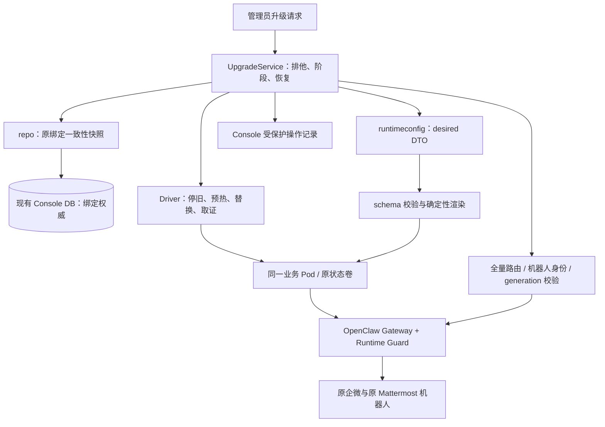
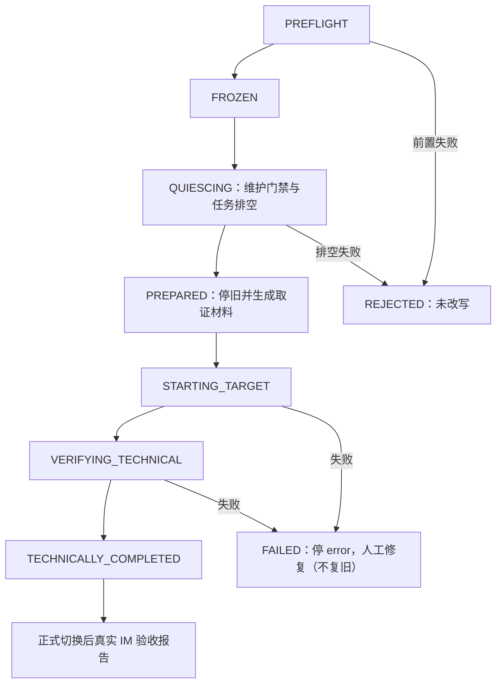

# OpenClaw 运行时升级与绑定保留技术设计

> 文档编号：DESIGN-20261006-OPENCLAW-UPGRADE
> 文档版本：v0.1
> 创建日期：2026-10-06
> 状态：设计评审稿，未授权实施
> 来源：[需求文档](openclaw-runtime-upgrade.prd.md)
> 模板：design-full；适用域为控制面后端、Worker 运行时与部署驱动
> Spec Context：[spec-context.yml](spec-context.yml)

## 1. 文档控制

### 1.1 责任与确认边界

本文继承 PRD 的 US-01～US-08、FEAT-01～FEAT-12、NFR 与范围。用户已确认单 Pod 多用户、双 IM、现有热重启行为、绑定在 DB、历史可选及无法提前演练。2026-10-07 补充确认：目标冻结为最新稳定版且不设同线备选；模型修改需重启服务（实测）；升级无感且不执行人工迁移脚本；**本次跨版本迁移必须一次成功、迁移路径不设计回退**（`allowRollback=false`，失败停在 error 由人工修复，fail-forward）。**Console 既有通用回滚功能保留，默认升级行为不变**；迁移路径只是显式 opt-out。本文新增的模块、取证材料、发布阶段和技术默认值属于可评审设计，不作为既有实现描述。

本轮仅创建文档和 Spec Context，不修改业务代码、不构建镜像、不连接机器人、不部署生产。

### 1.2 修订历史

| 版本 | 日期 | 说明 |
|---|---|---|
| v0.1 | 2026-10-06 | 基于现有实现细化版本兼容、原位升级、DB 保护、双通道验收、历史取舍与恢复 |
| v0.2 | 2026-10-07 | 按评审决策冻结最新稳定版（无备选线）、模型变更纳入 Gateway 重启、无感升级且零人工迁移脚本 |
| v0.3 | 2026-10-07 | 记录实机预验证结论（pod01 状态副本 + 9.8 最新基座/插件）：迁移/路由/插件/链路通过，固化 renderer、channel、自检 pin、entrypoint、registry 等适配清单 |

### 1.3 证据与结论等级

| 等级 | 使用方式 |
|---|---|
| 用户事实 | C-01～C-08，直接作为设计约束 |
| 仓库事实 | 可定位的现有代码，不代表生产已验证目标版本 |
| 上游事实 | 截至 2026-10-06 的官方发布说明/包元数据 |
| 设计建议 | 标明“新增/建议”，实施前评审 |
| 待核对 | 生产部署参数、精确镜像、存储能力、真实账号身份及维护窗口 |

## 2. 需求分析

### 2.1 需求概述

在保留原 Console DB、原机器人账号和原 Agent 身份的条件下，将基于 `2026.7.1` 的 Worker 升级到固定的新稳定版本。兼容主线以 `2026.9.8` 为评审基准。没有提前演练条件，采用代码与合成数据验证、原位正式切换、运行时技术校验和切换后真实 IM 验收。

绑定保留的最低完整链路为：

```text
原机器人账号与通道配置
  + channel / accountId / peerKind / externalId
  → 原 HumanUserID → 原 PodID / AgentID → 原 ModelConfigID
```

AccountID 是通道路由维度，不能擅自替换为企微 Bot ID 或 Mattermost 用户 ID。DB 是绑定权威来源，聊天历史不是绑定主数据。

### 2.2 痛点、价值与现状

| 项目 | 已核对现状 | 设计结论 |
|---|---|---|
| 基础版本 | Dockerfile.base 固定 2026.7.1；镜像自检和 CI 也固定旧值 | 版本清单统一更新，不只改 FROM |
| 双通道 | 企微 Bot ID/Secret、Mattermost 地址/Bot Token 来自控制面通道配置 | 原样复用，不重建账号 |
| 路由生成 | runtimeconfig/routes.go 从用户和身份生成 route/identityLinks | 保留 DB，重新渲染配置 |
| 配置生效 | 2026-10-07 实测复核：模型修改需重启服务才生效；现有 restart 分类仅 bindings/identityLinks 触发 gateway | 将模型/Provider 变更纳入 Gateway 重启判定，旧版用原协议、目标版用目标协议，S-04/E-03 回归 |
| 重启命令 | runtimeapply/apply.go 的 Gateway 分支发送 kill -USR1 1 | 9.6+ 必须调整；不是只修改旧脚本 |
| 升级互斥 | runPodExclusive/Coordinator 串行生命周期与 apply | 还需覆盖写 DB 的入口和重启后恢复 |
| 升级健康门禁 | probeUntilReady 检查 Healthy、RuntimeGuardHealthy、generation | 需补全量绑定路由和机器人身份校验 |
| 现有回滚 | SnapshotStartupConfig/RestoreRuntime 恢复启动输入与镜像 | 尚无完整状态卷恢复，不能抵御存储 schema 变化 |
| Worker 入口 | 自有 entrypoint 执行注入、插件索引整理、自检后启动 Gateway | 官方 entrypoint 实测在 gateway 前自动 `openclaw doctor --fix --non-interactive` 且失败退出；自有 entrypoint 必须承接（fail-closed），不能假设继承 |
| 状态文件 | prune-managed-plugin-installs 已访问 state/openclaw.sqlite 的插件索引 | 9.8 实测 `installed_plugin_index` 表消失，改为 persisted plugin registry（Doctor 自动刷新，实测 6/71）；旧 prune 将静默 no-op，需重做或移除 |
| 存储迁移（实测） | pod01 状态副本上 9.8 Doctor 全自动：sessions.json/jsonl → `agents/<id>/agent/openclaw-agent.sqlite`（main 5 会话/31 事件，业务 3/14）；旧 sessions.json 字节保留；自动生成 `*.pre-startup-migration-*.bak` | 零人工脚本；无回退设计下仅保留 Doctor 原生备份 |
| 路由兼容（实测） | 迁移后配置上 `muad.runtime.verify-routes` 3/3 命中、failed=0；SIGUSR2 重启进程存活、health 保持 | direct 路由兼容；group/channel 口径与 >1000 分批已在 §3.5.4 定义 |
| K8s 发布 | 1 replica、Recreate，避免企微连接互踢 | 保留停旧启新 |
| 容量 | 表结构默认 max_users=10，可配置实际值 | 保留生产实际限制，不自动提升到 50 |

代码依据见附录 A。用户故事沿用 PRD §3.2，最终覆盖关系见 §6。

### 2.3 功能方案

#### 2.3.1 功能与组件映射

| 功能 | 方案 | 优先级 | 来源 |
|---|---|---|---|
| FEAT-01 | 固定兼容清单与 SDK/入口检查 | P0 | US-07 |
| FEAT-02 | repo 一致性快照 + 保护字段比较 | P0 | US-01、US-02 |
| FEAT-03 | 原通道配置复用 + 机器人身份核对 | P0 | US-01、US-06 |
| FEAT-04 | UpgradeService 与现有 Coordinator 共用排他控制 | P0 | US-04 |
| FEAT-05 | 升级前材料取证（状态离线副本 + Doctor 原生备份，仅用于验证/故障取证，不提供回退） | P0 | US-04、US-05 |
| FEAT-06 | 自动兼容或自动新会话（零人工迁移脚本），保留源件与业务资产 | P0 | US-05 |
| FEAT-07 | renderer/SDK/重启能力适配及生效确认 | P0 | US-03、US-07 |
| FEAT-08 | 显式隔离配置 + Guard/技能/租约回归 | P0 | US-02、US-05 |
| FEAT-09 | BindingVerifier、RobotProbe、技术报告与人工业务报告 | P0 | US-01、US-06 |
| FEAT-10 | 分层自动化与正式切换后 manual 外部验收 | P0 | US-04、US-07 |
| FEAT-11 | 受保护的操作记录与中断恢复 | P0 | US-04、US-06 |
| FEAT-12 | 分段估算、维护窗口及后续收益清单 | P1 | US-08 |

#### 2.3.2 不变字段与运行字段

**必须保持的字段**

| 记录 | 字段 |
|---|---|
| pods | pod_id、channels、channel_configs_enc 的语义内容、资源/容量/并发限制、service token 的既有身份 |
| human_users | human_user_id、pod_id、agent_id、model_config_id、browser_profile、browser_cdp_port、status、prompt |
| user_identities | identity_id、human_user_id、channel、openclaw_channel、account_id、external_id、external_id_type、peer_kind、status |
| llm_model_configs | 原引用的 provider、base_url、model、api_key、工具/图像/思考配置 |
| platform/skill 相关记录 | 原用户归属、凭据来源、技能策略、资产与任务关联 |

**允许变化的字段**

镜像标签/digest、config_generation、applied_generation、last_config_hash、last_apply_status/error、应用时间及必要运行状态。generation 在恢复时也单调递增，不回退到旧整数。

通道密文默认不重写；若未来存在加密格式变化，不能把不同密文直接判定为账号更换，需比较解密后的规范化语义。本文不引入密钥轮换。

### 2.4 范围与边界

- 保留现有 Console DB schema；不新增绑定表或为升级新增 DB 表。
- 前端不改版；升级与恢复沿用管理员 API/运维操作，新增接口见 §3.4。
- “无演练”排除提前使用生产 DB 副本和真实机器人演练，不排除合成数据自动化或正式切换后的验收。
- 历史兼容失败可从新会话开始，但未知存储结构不允许宽泛清理；升级不引入人工迁移脚本步骤。
- 原机器人账号、用户身份和模型绑定是强制保留项，无法确认时不能宣告升级完成。
- 初期仍采用现有 Console 单实例协调模式；本设计不扩展多 Console 副本一致性方案。
- 正式停机/恢复时间取决于状态大小、镜像缓存和存储吞吐，未测前不提供数值承诺。

### 2.5 验收条件

#### 2.5.1 业务规则

| ID | 规则 | 验证场景 |
|---|---|---|
| RULE-01 | DB 是绑定权威来源；不重建已有用户、Agent 或机器人 | S-01、E-01 |
| RULE-02 | 保护字段逐条一致，禁用记录也保留 | S-01、B-01 |
| RULE-03 | 两个 IM 身份仍进入同一原用户 Agent | S-02、B-02 |
| RULE-04 | 新增 Agent 热重启；模型变更必须触发 Gateway 重启并生效（实测确认） | S-03、S-04、E-03 |
| RULE-05 | 改写旧状态前完成取证材料（Doctor 原生备份自动生成；升级不做回退） | S-05、E-04 |
| RULE-06 | 同一机器人不能有两个活跃 Gateway | S-05、B-03 |
| RULE-07 | 历史自动兼容/自动新会话，业务资产不能静默删除，升级无人工迁移脚本 | S-06、E-05、S-12 |
| RULE-08 | 隔离显式配置，未知/禁用身份和跨用户工具保持拒绝 | S-07、B-01 |
| RULE-09 | DB、路由、连接、真实收发分别验收 | S-08、E-06、B-04 |
| RULE-10 | 所有阶段有错误/超时和脱敏；失败停在 error，不假成功、不自动回退 | E-07、E-08、E-09 |
| RULE-11 | 切换期间相关写入口和 reconcile 受统一维护控制 | S-09、E-10 |
| RULE-12 | 版本固定、不 fork 上游，未启用微信不阻断双通道 | S-10、B-06 |
| RULE-13 | 验证覆盖全部路由，不以数量或抽样代替 | S-02、B-05 |
| RULE-14 | 不无条件重放可能具有副作用的任务 | S-11、E-02 |
| RULE-15 | 测试与收益范围可追溯，不将 mock 宣称为真实使用结果 | S-12、B-04 |
| RULE-16 | 升级全程零人工迁移脚本：不要求执行一次性迁移脚本、手工 SQL 或手工清理 | S-06、E-05、S-12 |

#### 2.5.2 验收场景与测试边界

下表共 28 个场景，是实施测试设计，不是已执行结果。E2E 在本文指其明示的完整真实边界；控制面 E2E 的外部 Driver 可 fake，但真实 API、临时 SQLite、配置构建/渲染不得 mock。目标 Gateway/IM 不属于这类 E2E 的证明范围。

**正常场景**

| 场景 | FEAT | 层级 | 关键真实边界 | 操作与可观测结果 |
|---|---|---|---|---|
| S-01 | 02、04、09 | E2E | 管理 HTTP → 临时 SQLite → 真实 builder/renderer | 用合成双用户绑定执行升级编排；前后受保护记录逐字段一致；只改运行字段 |
| S-02 | 02、09 | integration | 真实 Guard verifier + 路由解析调用契约 | 两用户、双通道、不同 accountId；传入完整期望路由并严格聚合结果；native resolver 的生产结果另在 S-08 取证 |
| S-03 | 07 | E2E | 创建用户 API → 真 Store → DTO/渲染 → 重启选择 | 新用户绑定未占用模型，新增 Agent 沿用热重启路径；不重建 Pod；fake Driver 记录命令 |
| S-04 | 07 | E2E | 模型修改 API → Store → DTO → 目标重启协议选择 | 修改原用户模型；apply 路径必须选择 Gateway 重启（实测确认否则不生效），目标版本用目标协议、旧版本用原协议；真实生效在 S-08 核对 |
| S-05 | 04、05 | integration | UpgradeService 状态机 + Driver 事件序列 | fake Driver 证明先排空/停旧、取证材料就绪、再启动新版；不存在双 Gateway；失败路径不自动回退 |
| S-06 | 05、06 | integration | 真实临时文件树/SQLite + 自动迁移/新会话路径 | 历史由目标版本自动兼容或自动新会话；全程无人工迁移脚本；工作区、凭据、插件、技能与任务资产仍在；幂等重复运行 |
| S-07 | 08 | integration | 真实 Guard/policy/session-manager 模块 | 合成用户的跨 workspace/profile/model/credential 请求拒绝，技能分层/激活/租约保持 |
| S-08 | 03、07、09 | manual | 生产 native resolver、双 IM 原账号、真实模型响应与用户归属 | 正式切换后全量路由技术校验，原机器人收发，两用户隔离和模型/Agent 生效；原因：无法提前演练且不授权自动发 IM |
| S-09 | 04、11 | E2E | HTTP 写入口 → Store → 维护状态 → reconcile 调度 | 升级时创建身份、消费绑定码、改模型/通道、迁移用户被拒绝/有界等待且不写 DB；维护解除后正常 |
| S-10 | 01、07、10 | integration | 版本清单、自检逻辑、实际模块/配置文件 | 精确版本一致，受支持 SDK 导入成立，启用双通道配置通过；只用安装依赖/合成数据，不建镜像 |
| S-11 | 08、11 | integration | 任务/租约调度与真实临时任务记录 | 维护期间停止新调度，排空已有任务；恢复不会重放未知副作用；原投递归属保持 |
| S-12 | 10、12 | integration | 文档/测试清单/版本报告 | FEAT 有对应验证和依赖记录；报告区分实测、预计、人工待验收，记录零人工迁移步骤，容量未擅自扩大 |

**异常场景**

| 场景 | FEAT | 层级 | 关键真实边界 | 触发与预期 |
|---|---|---|---|---|
| E-01 | 02、09 | E2E | 临时 SQLite → 保护字段比较 → API 错误输出 | 同数量但某 externalId/agentId/accountId 被替换；失败，不能报绑定完整 |
| E-02 | 04、08 | integration | 排空状态机与租约记录 | 已有任务无法在期限内安全结束；切换前中止，不强制杀后自动重放 |
| E-03 | 07、09 | integration | 生效确认解析与计时器 | CLI 退出成功但 generation/配置未收敛或模型仍旧；到期失败，不因信号发送成功就通过 |
| E-04 | 05、11 | integration | 取证材料校验 + fake 存储/Driver | 空间不足、材料缺损或复制超时；未改写状态时安全拒绝 |
| E-05 | 06 | integration | 真实临时状态树与自动迁移失败路径 | 自动迁移失败；回滚或保留旧状态，不删除数据库/业务资产，也不把“请手工执行迁移脚本”当作成功出口 |
| E-06 | 03、09 | integration | 真实响应解析与严格验证器 | 健康但某通道未连、Bot 身份不同或路由命中 default；不能通过；生产实证在 S-08 |
| E-07 | 05、11 | integration | 编排失败路径 + 原配置/状态引用 | 新版启动/迁移失败；停在 error（不恢复旧镜像/旧状态），保留 Doctor 备份与诊断 |
| E-08 | 05、11 | integration | 失败终态/错误封装 | 升级失败终态；进入 error，返回稳定的升级失败码（非 50205/50215 回滚语义），保留阶段与取证材料 |
| E-09 | 09、11 | integration | 真实脱敏函数、日志回调与错误 envelope | 注入带 Token/Cookie/Secret 的错误；输出/审计/apply 字段无明文秘密，模块日志前缀稳定 |
| E-10 | 04、11 | integration | 真实操作记录原子写/加载 + fake 外部边界 | Console 在各关键阶段中断；重启识别未完成操作，冻结 reconcile，不并发覆盖，按 fail-forward 继续收敛或停留 error，绝不自动回退 |

**边界场景**

| 场景 | FEAT | 层级 | 关键真实边界 | 条件与结果 |
|---|---|---|---|---|
| B-01 | 02、08 | integration | builder/Guard 校验 | 0 有效路由、禁用用户/身份、未知 sender；保留 DB 原状态，不放行业务 Agent，不将 0 条当既有用户验收 |
| B-02 | 02、09 | integration | 路由规范化与 identityLinks | default account、双账号、同用户双通道；保持完整匹配语义；重复/冲突期望路由报错 |
| B-03 | 04 | integration | 锁与阶段事件序列 | 并发升级、等待锁时 source generation 改变；持锁后重读，串行且不启动第二个 Gateway |
| B-04 | 09、10 | manual | 正式验收记录 | 技术通过但真实用户尚未发消息；业务报告保持待验收，不能使用 mock 结果补成已通过 |
| B-05 | 09、12 | integration | 真分批/聚合器与 fake RPC | 1000/1001 条合成路由；超过单批上限时完整分批，相同 generation，checked 精确合计、不截断 |
| B-06 | 01、07 | integration | 版本能力选择、配置/自检 | 旧/新精确版本与未启用微信；选择正确重启协议；历史数据不会触发不兼容的未启用插件加载 |

#### 2.5.3 非功能指标映射

| NFR | 技术落点 | 验证 |
|---|---|---|
| REL-01 | 完整保护字段比较与运行时路由核对 | S-01、E-01、B-02 |
| REL-02 | 一次性成功保障：前置门禁 + 取证材料；迁移不可逆不回退 | S-05、E-04、E-07 |
| REL-03 | 分阶段 timeout/cancel、独立 recovery context | E-02、E-03、E-04、E-08 |
| REL-04 | 原子操作记录、启动扫描与维护控制 | S-09、E-10 |
| SEC-01 | §3.5 显式策略与 Guard | S-07、B-01 |
| SEC-02 | 运行时注入、0700/0600/0400、诊断脱敏 | E-09、S-06 |
| COMPAT-01 | 精确版本清单、无上游 fork | S-10、B-06 |
| COMPAT-02 | 原身份、双 IM、现有 API 与生效行为 | S-01、S-03、S-04、S-08 |
| PERF-01 | 一致性批量读取、批量路由 RPC | B-05、S-02 |
| PERF-02 | 原配置容量/并发不变，报告无虚构性能 | S-12、S-01 |

## 3. 技术设计

### 3.1 方案选型

#### 3.1.1 版本与架构决策

| 决策 | 建议 | 理由与边界 |
|---|---|---|
| 目标主线 | 冻结最新稳定版（当前 2026.9.8），实施前固定精确版本与 digest；不使用 beta | 2026-10-07 评审决策：只保留单一目标线，不设同线备选 |
| DB | 沿用 Console DB schema 与主密钥 | 绑定已经持久化，无需迁移；修改只限运行字段 |
| 升级 | 原位停旧启新 | 无法演练，企微连接不能双实例 |
| 历史 | 目标版本自动兼容/自动新会话，零人工迁移脚本 | 原件留存在取证材料；不手工猜测表结构、不宽泛删库，也不提供一次性迁移脚本 |
| 取证 | 停写后的状态离线副本 + Doctor 原生 `*.pre-startup-migration-*.bak`（升级前生成） | 用于前置验证与故障取证；不作为回退通道 |
| 操作记录 | Console 持久数据目录中的受保护原子文件 | 不新增 DB 表；不放在会被恢复覆盖的 Worker 卷内 |
| 协调 | 现有 Coordinator 锁 + 持久维护状态 | 复用已有串行机制，同时补 DB 写入口和中断恢复 |
| 模块 | 建议新增 internal/runtimeupgrade 协调模块 | handler 只做 HTTP；Driver 承载 Docker/K8s/存储细节；是设计提议，编码前评审 |

不采用重新创建用户/机器人、绑定表迁移、全局 DB 恢复回退单 Pod、提前真实 IM 演练、上游 fork、同机器人蓝绿并行、全量清空状态卷或人工迁移脚本。

#### 3.1.2 兼容清单

| 组件 | 当前 | 目标建议/检查 |
|---|---|---|
| OpenClaw | 2026.7.1 | 2026.9.8 + 固定 digest |
| 企微插件 | 2026.6.23 | 候选 2026.9.15；也可保留通过契约检查的旧版，冻结前确定 |
| Mattermost 插件 | 2026.7.1 | 候选 2026.9.8，peer 要求 host >=2026.9.8 |
| Node | 随当前基础镜像 | 目标包要求 24.16+ 且 <25，或 26.1+；核对镜像实际可执行文件 |
| 浏览器依赖 | 当前基线需复核 | 目标锁定版本与实际 browser binary 一致，检查 native 依赖 |
| Runtime Guard | 自有外置插件 | hooks、trustedToolPolicies、current config、resolveAgentRoute、工具 schema |
| session-manager | 自有平台登录态插件 | SDK 工具注册/上下文不变；与上游同名 SessionManager 类不同 |
| 镜像自检/CI/Docker 版 | 2026.7.1 常量与构建默认值（含 `build/docker-build/Dockerfile.openclaw` 的 BASE_TAG） | 与同一精确清单一致；不对所有版本采用无条件最新信号 |

插件导入路径检查只能证明符号路径存在，不能证明运行时完整兼容。上述包版本来自前期公开包检查，实施前需重新核对元数据、lockfile 与目标镜像。未启用微信不做业务适配；若通用自检/发现仍加载该旧包，只处理导致双通道启动失败的依赖问题。

#### 3.1.3 当前必须处理的兼容差异

- 会话与 transcript 的 SQLite 迁移：需要改写前离线副本与自动兼容/自动新会话处理；不引入人工迁移脚本。
- 9.2 在未显式配置时扩大 session 可见性/Agent 间调用：必须明确限定，不照搬协作默认值。
- 9.6 将 USR1 改为调试用途，USR2 用于重启：主 apply 路径需按固定版本能力选择。
- 模型变更需真实重启（2026-10-07 实测复核）：restart 判定位于 pod 内 `bin/runtime-config-transaction.mjs` 的 `selectRestartMode`（当前仅 bindings/identityLinks→gateway，其余恒 none），需把 providers/agents 的模型变化纳入 Gateway 重启并按旧/新版本选择协议；目标版上游 hybrid 将 `agents`/`models` 归为热应用，本项目仍按实测行为强制 Gateway 重启以保证确定性。
- 重启信号发送点全量核查：主 apply 路径（`runtimeapply/apply.go:285`）与镜像内通道脚本（`bin/inject-channels.mjs:206`）都曾发送 SIGUSR1；后者当前无 Go 调用方（仅随镜像分发），plan 需明确按版本适配或删除，避免死代码被误用。
- 目标 SDK 使用受支持子路径，不能依赖移除的根导出、compat 或深层内部导入；仓库扫描确认现有 tools/bin/skills 对 `openclaw/*` 静态导入为 0，主要风险在宿主注入 `api` 的 hook/工具契约形状。
- 自有 entrypoint 必须显式承接目标版本必要的迁移/Doctor 步骤，并放在生成取证材料之后的安全阶段；目标官方容器入口会在启动 Gateway 前自动运行 Doctor 并在无法安全修复挂载状态时退出，自有 entrypoint 当前只做 inject/prune/self-check，必须显式承接该自动修复且失败 fail-closed（编排停 error，不回退）。迁移在启动链路自动执行，不新增一次性人工脚本。
- renderer/channel 配置形态（已实测）：9.8 拒绝 `browser.profiles.*.color` 与 `plugins.bundledDiscovery`，mattermost 要求 `streaming` 为对象；`agents.list` 建议迁移为 `entries` 并保留 main fallback（详见 §3.1.4）。
- 插件注册表（已实测）：9.8 移除 `installed_plugin_index`，改为 persisted plugin registry + derived index（Doctor `--fix` 自动刷新 registry，实测 6/71；镜像插件经 `plugins.load.paths` 正常索引）；旧 prune 在迁移后静默 no-op，需重做或移除（详见 §3.1.4）。
- 新恢复机制不自动等同于业务 exactly-once，仍需现有任务状态与副作用边界。

依据：[8.1 存储说明](https://docs.openclaw.ai/releases/2026.8.1/installation-and-onboarding)、[9.2](https://docs.openclaw.ai/releases/2026.9.2)、[9.6](https://docs.openclaw.ai/releases/2026.9.6)、[SDK 迁移](https://docs.openclaw.ai/plugins/sdk-migration)、[配置热加载](https://docs.openclaw.ai/gateway/configuration/hot-reload)、[容器镜像升级](https://docs.openclaw.ai/install/docker#upgrading-container-images)。

#### 3.1.4 实机预验证结论（2026-10-07，pod01 状态副本离线演练）

在 pod01 状态卷只读副本（107MB，7.1 原状）上，以 2026.9.8 官方镜像与自建候选镜像（最新基座 + 最新通道插件）断网执行，不接机器人、不发消息：

| 验证项 | 结果 |
|---|---|
| Doctor 自动迁移（sessions.json/jsonl → per-agent SQLite、shared state、config key、自动 `*.pre-startup-migration-*.bak`） | 通过，exit 0，无人工脚本 |
| Gateway 启动 + `muad.runtime.health` / `muad.runtime.verify-routes`（真实 3 路由 3/3、failed=0） | 通过 |
| 自有插件（guard/session-manager）+ 最新通道插件（mattermost 2026.9.8、wecom 2026.9.15）加载与 registry 索引 | 通过（Doctor 自动 refresh registry，6/71） |
| SIGUSR2 重启（PID1） | 通过（进程存活、worker 重建、health 保持） |
| 候选应用链（inject→prune→self-check→Doctor→gateway）+ `runtime-config-transaction` prepare/validate | 修掉下方适配项后通过（validate `{"valid":true}`） |

**由此固化的适配清单（均有实测证据）：**

1. `bin/openclaw-config-renderer.mjs`：删除 `browser.profiles.*.color` 与 `plugins.bundledDiscovery`（9.8 `config validate` 直接拒绝）；`agents.list` 单形态可加载但触发迁移 warning，**且 Doctor 迁移时会补 `main` 通道级 fallback 绑定**，renderer 整体替换会丢弃它们——多 Agent 无匹配 binding 时 9.8 fail-closed，且 Doctor 迁移后的首次 apply 会因 bindings 差异触发 Gateway 重启。建议改为输出 `agents.entries`（保留 ownership）并保留/生成 main fallback。
2. `bin/channel-config.mjs`：`streaming` 从字符串 `"off"` 改为对象 `{ mode: "off" }`（mattermost 2026.9.8 插件 schema）。
3. 版本 pin：`runtime-image-self-check.mjs` 的 `PINNED_OPENCLAW_VERSION`、`Dockerfile.base`（含插件版本）、`build/docker-build/Dockerfile.openclaw`、`build-image.yml` 与相关测试断言统一到 2026.9.8/最新插件；否则构建期 `--image-only` 自检及运行时自检阻断（已实测构建失败点）。
4. `entrypoint.sh`：在启动 Gateway 前显式执行 `openclaw doctor --fix --non-interactive`（fail-closed）；官方容器入口即为此逻辑，自定义入口不会自动继承。
5. `prune-managed-plugin-installs.mjs`：9.8 移除 `installed_plugin_index`，改 persisted plugin registry + `plugins registry --refresh`（Doctor 自动刷新）；旧脚本在迁移后静默 no-op，需重做或移除。
6. 重启协议与模型重启：`apply.go` 信号按版本 USR1/USR2；`selectRestartMode` 将 providers/agents 模型变化纳入 gateway；`inject-channels.mjs`（当前无调用方）处置。
7. 路由验证：>1000 条需 `gateway/probe.go` 分批聚合；direct/dm 之外身份不得静默过滤（§3.5.4）。

#### 3.1.5 实机演练发现（2026-10-07，pod02 旧→新演练）

pod02（7.1 运行中）以候选镜像执行真实升级：镜像切换与 Doctor 状态迁移成功，随后 Doctor 维护阶段 fail-closed，Pod CrashLoop；Console 按 fail-forward 正确停在 error（50216 语义，保留目标镜像）。根因与修复：

| 项 | 结论 |
|---|---|
| 现象 | `openclaw doctor --fix` 非零退出：`EPERM: operation not permitted, fchmod` |
| 根因 | 状态 PVC 根目录由 provisioner 以 root 创建（`root:<fsGroup> 2777`），kubelet fsGroup 只调整属组；9.8 运行时将状态目录 tighten 到 0700 需要属主身份 → uid 1000 无 CAP_FOWNER → EPERM（strace 实证 `fchmodat(AT_FDCWD, "<state>", 0700) = EPERM`；离线状态副本属主为当前用户，故预验证未暴露） |
| 修复 | k8s driver 为 Worker Pod 增加 `state-ownership` initContainer：root 运行、`/bin/chown 1000:1000 <StateDir>`、仅保留 CAP_CHOWN（drop ALL + add CHOWN）、无 shell、无特权提升；每次 Pod 启动幂等执行 |
| 验证 | 复现脚本 `oc-upgrade/repro-eperm.sh`：root 属主状态根 → Doctor EPERM；`chown 1000:1000` 后同一状态树 Doctor exit 0；driver 单测断言 initContainer 形状（root/仅 CHOWN/state 挂载） |
| 影响面 | 仅 k8s driver；docker 命名卷首挂由镜像内容初始化（node 属主），不受影响 |

**同场演练发现②（升级卡死，2026-10-07）**：error 态 Pod 再升级时卡在 `prepared`，UI 请求永不返回、维护门禁一直挂起。

| 项 | 结论 |
|---|---|
| 根因 | `WaitForQuiesce` 要求 `status.Healthy`；崩溃循环的 gateway 永不健康 → 排空死循环，仅受 HTTP 请求 ctx 约束（客户端等待则永不超时） |
| 修复 | ① error 态跳过排空（无在跑任务，且为"error 态改镜像"修复出口必经）② 排空独立 2 分钟上限，超时中止（§4.2"超时不能安全排空时中止"）③ 整个升级脱离请求 ctx、按 15 分钟总预算运行（客户端断开不中断） |
| 验证 | 新增排空边界测试（error 态立即放行、非排空状态有界退出）；全量后端回归绿 |

**同场观察③（9.8 资源基线上升，2026-10-07）**：升级成功后 pod02 稳态内存 ~1.05GiB（同 Pod 旧版 ~630MiB，+~420MiB）；gateway 单进程 RSS 983MB（旧 570MB）；CPU 启动尖峰后回落（稳态 20m vs 4m）。来源为上游 9.8 运行时增大（依赖图 2.8GB vs 0.75GB）+ 新增 `spawn-broker` / `sqlite-readonly` 辅助进程；3Gi 限额下占 ~36%，无 OOM 风险。生产重负载 Pod 建议评估 memLimit（如 4g）与告警阈值。

### 3.2 架构设计

#### 3.2.1 组件关系



控制面绑定、机器人认证和 OpenClaw 历史分别处理。操作记录不得位于 Worker 状态卷内；DB 不因原位 runtime 升级整体覆盖。

#### 3.2.2 阶段状态机



TECHNICALLY_COMPLETED 表示 DB/路由/机器人身份/连接/generation 通过，不自动表示真实双用户对话已验收。人工报告是运维交付材料，不引入额外的用户确认弹窗或绑定流程。跨版本迁移（`allowRollback=false`）失败路径为 fail-forward：停在 error，保留取证材料与诊断，通过现有 error 态改镜像/重启出口人工修复；默认升级失败仍保留原自动回滚语义。

#### 3.2.3 模块职责

| 模块 | 职责 |
|---|---|
| api | 请求解码、管理员鉴权、稳定错误输出、调用协调服务 |
| runtimeupgrade（建议新增） | 基线、维护控制、阶段、取证引用、技术结果与中断 fail-forward |
| repo | 事务读取保护记录、条件更新运行字段，不接管 Worker SQLite |
| runtimeconfig/runtimeapply | DTO 构建、校验、generation 和配置生效 |
| driver | Docker/K8s 生命周期与存储面接口；外部命令使用已有 helper |
| gateway | 兼容 probe 解析、VerifyRoutes 与机器人身份结果适配 |
| bin/tools | 版本能力、迁移辅助、配置渲染、Guard 与技能/会话边界 |
| 运维交付材料 | 真实 IM 收发结果、人员/时间/机器人账号和失败/中断造成的历史差额 |

### 3.3 数据设计

#### 3.3.1 既有关系与无 schema 迁移

沿用现有 `pods、human_users、user_identities、llm_model_configs` 与平台/技能/任务表。关系为 pods → human_users → user_identities；human_users 引用独占 model_config_id。身份记录归用户所有，不能因升级删除或重新发绑定码。

不新增数据库索引或绑定表。绑定清单在 repo 内以只读短事务按目标 Pod 批量取得；查询使用参数和显式列，不在 handler 打开裸 DB。外部备份、迁移或网络校验期间不持有 DB 长事务。

**BindingSnapshot（新增内部类型，非 HTTP 存储模型）**

| 字段 | 类型 | 含义 |
|---|---|---|
| podID | string | 原业务 Pod ID |
| sourceGeneration | int64 | 持锁后 DB 当前 generation |
| users | 有类型的用户保护记录数组 | 全部该 Pod 用户及模型/Profile 归属 |
| identities | 有类型的身份保护记录数组 | 包含有效与禁用状态 |
| channelIdentity | 通道/账号规范化记录数组 | Bot ID 或原 Mattermost 用户身份、AccountID 语义 |
| protectedConfigDigest | string | 模型、通道及其他保护配置的内部完整性摘要 |
| canonicalDigest | string | 规范化、稳定排序后的记录集合摘要 |

规范化不修改 ID，保留空值/default 的原语义。排序覆盖完整 tuple 和原 ID；集合差异输出只含脱敏 ID/变化字段。凭据不直接出现在清单或日志中；需要比较密钥内容时使用域隔离的 HMAC 摘要并仅在受保护材料中保存，禁止把可猜测 secret 的普通 hash 对外展示。

#### 3.3.2 升级操作记录

建议路径：`<Console 持久数据目录>/runtime-upgrades/<podId>/<operationId>/`，实际目录配置化，不写死客户机器路径。目录 0700，记录与清单 0600，临时写入、fsync、rename 后才推进下一阶段。

| 字段 | 类型 | 内容 |
|---|---|---|
| operationId / podId | string | 唯一操作及原 Pod |
| source / target | 有类型版本清单 | 镜像 tag/digest、OpenClaw 与插件版本 |
| phase | 受约束字符串枚举 | §3.2.2 阶段；未知值 fail-closed |
| sourceGeneration / targetGeneration | int64 | generation 关联，不回退 |
| bindingSnapshotRef | string | 保护清单引用及摘要 |
| startupSnapshotRef | string | 原 env/file 输入模式和原配置引用；敏感内容单独保护 |
| evidencePoint | 取证材料记录 | 状态离线副本/Doctor 备份标识、覆盖范围、校验；仅用于验证与故障取证，不用于回退 |
| historyPolicy / historyResult | 枚举及有类型摘要 | 自动保留/自动新会话/自动迁移失败；不包含正文、不含人工迁移步骤 |
| technicalChecks | 有类型结果 | DB 一致、route checked/failed/generation、bot identity、channel 连接 |
| createdAt / updatedAt | UTC 时间 | 阶段时间 |
| error | 脱敏诊断 | 原因链、失败阶段与原因；不含回退状态 |
| maintenance | bool | 是否仍需阻止写入/reconcile |

操作文件只存必要业务数据和引用，不把完整配置/密钥混入公共诊断。取证材料含凭据，须使用受保护、受访问控制的存储；可用加密备份时使用加密，不新增镜像内秘密。

#### 3.3.3 取证材料覆盖（不提供回退）

| 材料 | 用途 |
|---|---|
| Console DB | 一致性备份仅作灾难取证，不作为单 Pod 回退通道 |
| Console 主密钥 | 保留既有安全存储与可恢复引用，不打印或烤入镜像 |
| Worker 全状态树与外部工作区 | 升级前离线副本用于前置验证与故障取证，覆盖 SQLite、认证、插件、工作区、技能和任务 |
| 旧镜像与启动输入 | 记录精确 digest 与原启动模式，供人工诊断；不可单独回退 |
| 保护字段基线 | 验证升级后的身份一致 |
| 升级后新增数据 | 仅保留诊断差额，不让旧版读取新 schema |

SQLite 主文件和 WAL 不能在持续写入时用普通复制拼出“快照”。Console 使用 SQLite 一致性备份或暂停写入后复制；Worker 副本在 Gateway 和相关写入者停止后取得。符号链接与卷外路径必须解析覆盖，不认为根目录复制自动覆盖一切。

### 3.4 接口设计

本节为实施建议，不声明接口已存在。维持现有升级请求与成功响应核心字段；新增轻量只读状态和显式恢复接口，无前端重构。

#### API-01：升级运行时（现有接口增强）

- 功能：FEAT-01～FEAT-09、FEAT-11。
- 方法/路径：`POST /api/v1/containers/{podId}/upgrade`。
- 请求：`{"imageTag":"<固定且可追溯的目标镜像>"}`；沿用字段、管理员鉴权和验证。
- 成功：保留 `podId、imageTag、state、configGeneration、appliedGeneration`。可追加 `operationId、verificationState`，不得删改既有字段。
- code=0 表示技术切换完成；真实收发报告独立，不能以 code=0 宣称人工业务验收完成。
- 源与目标镜像相同仍保留现有幂等行为；不能因此清除未完成操作标记。
- 失败策略（`allowRollback`，可选布尔）：缺省/true 保持既有自动回滚语义（失败恢复旧镜像与启动输入，50205/50215）；`false` 用于本次跨版本迁移——迁移不可逆，失败停在 error（50216），保留目标镜像供人工修复。
- 保留 error 态改镜像出口：现有 `/upgrade` 与镜像 PATCH 均允许 error 态改镜像（回滚失败 brick 与迁移 fail-forward 共用的唯一出口），restart 也允许 error 态；新编排不得移除或收窄该路径，并在 E 场景回归。
- 正式过程复用 Coordinator；总操作 timeout 覆盖取证/启动/校验；首次迁移需要更长窗口（实测 Doctor+启动耗时且镜像须预热），当前 2 分钟 health 与 2 分 30 秒操作窗口必须调整；失败路径不设计回退 context。

#### API-02：升级状态（建议新增）

- 功能：FEAT-09、FEAT-11。
- 方法/路径：`GET /api/v1/containers/{podId}/upgrade-status`。
- 返回：最近操作的 `operationId、phase、sourceImageTag、targetImageTag、startedAt、updatedAt、maintenance、technicalChecks、historyResult、error、recoveryError`。
- 不返回密钥、内部备份路径、完整配置、身份明细、未脱敏错误或聊天正文。
- `technicalChecks` 包含 `bindingsUnchanged:boolean、routesChecked:int、routesFailed:int、routeGeneration:int64、channelsConnected:boolean、robotIdentityUnchanged:boolean`。
- 真实业务报告未取得时明确 `businessVerification:"pending_manual"`；该状态不得通过 mock 改成 passed。

#### API-03：升级失败处理（无自动回退）

- 功能：FEAT-11。
- 本设计不提供“恢复原恢复点/回退旧镜像”接口：跨 SQLite 迁移不可逆，旧镜像无法读取新状态。
- 失败时升级操作停在 error，保留 `operationId`、阶段、Doctor 原生备份与诊断；运维通过现有 error 态改镜像（改到修复版镜像）或 restart 出口继续修复（fail-forward）。
- 不接受请求提供的任意目录、任意镜像或任意 shell 参数；原 DB 绑定始终保留。

#### 错误契约

| 情况 | 行为 |
|---|---|
| 旧有无效 imageTag、状态冲突 | 沿用已有 errcode/HTTP status |
| 默认升级失败且回滚成功（`allowRollback` 缺省/true） | 沿用 RuntimeUpgradeRolledBack=50205 |
| 默认升级失败且回滚失败 | 沿用 RuntimeUpgradeRollbackFailed=50215 |
| 跨版本迁移失败（`allowRollback=false`） | 停在 error，不自动回退；返回 RuntimeUpgradeFailed=50216 |
| 前置拒绝、取证材料缺失、维护冲突、绑定差异 | 新场景定义独立稳定常量；具体子码在编码阶段按现有块递增，不复用旧码 |
| 诊断 | writeRuntimeFailure / writeErr / writeRepoError，经 errorCatalog zh/en 与 RedactDiagnostic |

50205/50215 仅用于默认回滚路径；50216 仅用于显式 opt-out 的迁移路径。HTTP 输出仍使用 writeJSON/writeErr，不在 handler 手写 encoder。

#### 内部接口与职责建议

| 接口 | 有类型输入/输出 | 用途 |
|---|---|---|
| BindingSnapshotReader.Read(ctx,podID) | BindingSnapshot / error | repo 内一致性读取 |
| CompareProtected(before,after) | ProtectedDiff / error | 逐字段及集合核对 |
| RuntimeStateRecoveryDriver.Prepare/Restore(ctx,...) | StateRecoveryPoint / error | 存储面恢复，区别于 RuntimeStartupSnapshot |
| UpgradeJournal.Save/Load(ctx,...) | UpgradeOperation / error | 原子操作记录与启动恢复 |
| GatewayBindingVerifier.Verify(ctx,podID,generation,routes) | RouteVerification / error | 原生 resolveAgentRoute |
| RobotIdentityProbe.Probe(ctx,podID,channels) | []RobotIdentityResult / error | 认证后机器人实际身份，不依赖展示名称 |
| UpgradeService.Run/Recover(ctx,...) | UpgradeResult / error | 阶段编排与恢复 |

RuntimeStartupSnapshot 继续表示启动输入，不把“状态卷恢复”偷偷塞入其语义。新增结构/接口放靠近使用方的内部包，避免 api/repo/driver 循环依赖。

### 3.5 质量实现方案

#### 3.5.1 DB 写入冻结与并发

1. 持目标 Pod 操作锁后重读 DB，不使用等待锁前记录。
2. 创建持久维护记录并设置内存快速门禁。所有相关 DB 写入口在写事务前检查同一门禁。
3. 覆盖用户创建/移动/删除/状态、身份与绑定码生成/消费、模型/凭据修改、通道配置、技能应用、资源与服务 Token 变更及镜像 PATCH；不只拦升级 API。
4. 模型变更按其绑定用户追踪所属 Pod；跨 Pod 用户移动同时检查源/目标。禁止先写 DB 后等待 apply 锁。
5. 异步 apply/reconcile 共享 Coordinator，并识别持久维护记录；Console 重启先加载未完成操作再启正常 reconcile。
6. DB 只读事务用于短快照，外部复制、CLI 与 RPC 不在 DB 事务中。
7. 技术切换成功后解除配置维护冻结，保留可用恢复点。恢复时重新冻结并检查是否出现后续保护字段变更。

已核对的未持锁写入口还包括：`apply-config`（handler 直接调用 `drv.UpdateSpec`）、channels PUT、resources PUT/settings、agent-guidance、platform credentials/platforms、human-users attach、skills 各入口；plan 阶段须形成 handler→门禁矩阵并逐项纳入 S-09。

单 Console 进程假设已与部署证据核对一致：Helm `replicaCount: 1` + Recreate、RWO PVC、内置 SQLite 与文档“单实例服务”；本设计不扩展多 Console 副本一致性方案，内存锁不得当作分布式锁。

#### 3.5.2 重启与配置生效

- 从固定兼容清单得到旧/新版本能力，使用明确版本表，不凭宽泛月份字符串或“命令成功”判断。
- 旧 2026.7.1 继续原协议；9.6+ 主线采用上游支持的 USR2 或等价受支持机制。容器前台 Gateway 无 systemd，不能直接套服务管理 CLI。
- 必须确认接收信号的目标确实为前台 Gateway；当前镜像 exec Gateway 为 PID 1，entrypoint 调整时同步检查。
- 保留 RestartNone/Gateway/Pod 三种模式。新增 Agent 按当前产品热重启路径，不擅自重建 Pod；模型/Provider 修改必须归入 Gateway 重启（2026-10-07 实测确认仅热加载不生效），旧版本用原协议、目标版本用目标协议。
- 控制面构建 DTO，调用 validateRuntimeConfig，再按 0600 原子写入。目标 config validate / Doctor 配置变化需要和 renderer 比较，不改动绑定或扩大权限。
- 等待 generation、应用配置及路由实际收敛；自动迁移后服务进程仍旧或配置仍旧不能通过。

#### 3.5.3 多用户隔离与技能回归

- 明确写出 `tools.sessions.visibility="agent"` 和 `tools.agentToAgent.enabled=false`，并核对目标版允许的 schema；确有业务允许的调用通过现有受限策略，不默认开放全 Pod。
- 保留 dmScope、identityLinks、绑定匹配维度及 sessionKey 中原 Agent 归属。
- Runtime Guard 继续校验可信当前用户上下文，未知/禁用 sender 不进入业务 Agent；maintenance 阶段仅允许必要 health/管理调用。
- workspace/profile/platform session 按原 Agent/User 隔离。session-manager 的缓存与上游聊天会话不同，不能随历史清理。
- system protected 优先；public/private 冲突默认失败，只有明确 allow_override 才覆盖。升级同步保留 last-good，遵循既有 skills_pending/generation 守卫。
- 技能激活、工具权限、浏览器/长任务租约、进度事件、终态与失败 stderr/non-zero 语义均回归。
- 插件日志通过注入 log/api.logger 输出，保持 [muad-runtime-guard]/[session-manager] 及动作子标签，禁止输出 Token/Cookie。

这仍是现有受控共享 Pod 的逻辑隔离架构，本次不宣称升级变成对恶意租户的完整 OS 安全边界。

#### 3.5.4 全量技术验收

技术通过必须同时满足：

```text
protected DB records unchanged
AND desired/loaded generation == expected generation
AND Guard healthy
AND routes.checked == all expected active routes
AND routes.failed == 0 AND routes.generation == expected generation
AND every route hits original Agent without default fallback
AND every enabled robot identity unchanged
AND every enabled channel connected
```

- 从 DB 生成期望，调用运行时 `muad.runtime.verify-routes`，使用当前内存配置与 native `resolveAgentRoute`，不能只查看磁盘 bindings。
- RPC 不可达/响应未知可有界重试；确定性 Agent/default/generation 错误直接失败。unknown 到期也不能通过。
- 当前 verifier 单次上限 1000；超过时分批执行并聚合完整覆盖，相同 generation，禁止截断。
- 期望集口径：当前产品入口仅允许 direct 身份（dm 为通道入站映射），验证范围为其全部 active 路由；若 DTO 中存在非 direct/dm 的期望身份，不得静默过滤，必须扩展 verifier 的 peerKind/sessionKey 校验或 fail-closed 并列入报告。
- 分批聚合改造点：`gateway/probe.go` 的单次 RPC 改为 ≤1000 有界分批（同 generation、checked 求和、RPC 错仍为 Unknown）；`apply.go` 的 `expectedDirectRoutes` 过滤与 `route-verifier.mjs` 的 `sessionMatchesAgent`（现要求 routeType=direct、且不识别 dm 路由标记）需与新口径一致。
- account/peer 格式差异必须在插件真实入站身份与 DB 期望之间核对；native resolver 结果不能单独证明插件产生的 externalId 一定正确。
- 企微核对原 Bot ID 与已认证连接；Mattermost 核对服务器、原 Token 对应用户身份与连接。展示名称相同不是账号相同。
- 健康通过不替代真实收发；生产收发证据来自 §4.3 的切换后验收。

#### 3.5.5 性能与容量

| 热点 | 实现 | 相比朴素方式的依据 |
|---|---|---|
| DB 基线 | 目标 Pod 批量查询、短只读事务 | 避免每用户单独查询与长写阻塞 |
| 记录比较 | 稳定 tuple/ID 索引，完整差异 O(n)，规范排序 O(n log n) | 避免两组记录逐条嵌套 O(n²) |
| 路由核对 | 一次批量 RPC，超过上限才有界分批 | 避免每个用户启动昂贵 CLI |
| 健康检查 | 已有通道/Guard 并行 probe，小规模有界重试 | 不在 Pod 内批量 fan-out CLI |
| 恢复材料 | 每操作单一完整恢复点，直接校验摘要/清单 | 不要求副本演练或反复复制全状态 |
| 常规业务 | 保留现有容量和租约 | 不靠新增并发默认值制造未经验证扩容 |

真实数据规模、停机时长、CPU/RSS、技能队列等待时间和恢复速度待正式结果记录。性能收益不作为绑定兼容上线的替代门槛。

#### 3.5.6 日志、权限与有界执行

- 每阶段记录 operationId、podId、source/target 版本、generation、phase、耗时和结果。
- 绑定明细/正文/凭据不进公开日志；Secret、Bot Token、Cookie、LLM Key 与内部上下文经 RedactDiagnostic。
- 操作审计与技能执行 telemetry 分离；公共 API 只返回脱敏摘要。
- 配置/操作记录/恢复材料 0600，目录 0700；Pod service token 保持 0400 及镜像自检认可路径。
- 外部命令走 Driver helper，使用 CommandContext 并合并 stderr 到错误，不拼接任意 shell。
- 各阶段 timeout 单独配置；有界重试、退避与 cancel。参数校验确定值合法后才执行。
- HTTP 请求断开不直接取消已改写操作；恢复 context 独立，不能复用已超时的启动 context。
- 批量任务不使用无界网络 tight loop；将 RPC 批次置于限速有界执行器。
- 新/改函数保持单一职责及项目 50 行限制，禁止吞错误。

## 4. 部署与运维

### 4.0 可行性前置门禁（go/no-go）

按“无回退设计；若无法无感升级则终止”的决策，以下门禁全部通过才进入编码/生产切换：

| # | 门禁 | 状态（2026-10-07） |
|---|---|---|
| G-01 | 7.1 真实状态副本上 Doctor 全自动迁移（会话/配置/插件），零人工脚本 | 已通过（pod01 状态副本离线演练） |
| G-02 | 迁移后 Gateway 启动、绑定路由逐条命中（generation 一致）、双通道插件加载 | 已通过（3/3，failed=0） |
| G-03 | 自有插件（guard/session-manager）在 9.8 的 hook/RPC/工具契约 | 已通过（health / verify-routes） |
| G-04 | renderer/channel/自检 pin 等适配集在 9.8 上 `config validate` 通过 | 已通过（候选链 prepare/validate） |
| G-05 | SIGUSR2 重启与模型变更强制重启路径 | 信号已验证；`selectRestartMode` 改造后复测 |
| G-06 | 最新基座 + 最新通道插件完整构建链（含构建期自检） | 已通过（候选镜像 `openclaw=2026.9.8 status=ok`） |
| G-07 | pod02 状态差异（credentials/多用户）离线迁移验证 | 已通过（2026-10-07：credentials 保留、2+2 会话迁移、verify 1/1、validate valid） |
| G-08 | K8s 卷/锁环境：优雅停旧 → 同卷启动新版（lease 语义） | 已通过（7.1 优雅停止 126ms 无遗留；9.8 启动正常、优雅停止释放租约；硬杀会阻塞至多 TTL≈5 分钟，编排须优雅停止+重试） |
| G-09 | Console 升级编排改造（去除跨迁移自动回退、超时调整、维护门禁） | 待实施（设计已定，见 §3.4/§4.2） |

门禁未全部通过时不得进入生产切换；已通过项不构成对真实 IM 收发的证明。

### 4.1 正式切换条件

没有演练环境，所有生产真实操作都发生在正式维护窗口。上线前可执行代码测试、合成数据配置验证和依赖检查，不启第二个生产机器人实例。

| 核对项 | 条件 |
|---|---|
| 版本 | 目标与旧镜像 digest/依赖清单已固定，实际 Node/browser 匹配 |
| DB | 原绑定可读、主密钥可解密通道配置、保护字段基线已取得 |
| 外部账号 | 企微/Mattermost 实际启用账号与原身份有记录 |
| 取证能力 | 可取得停写后的状态离线副本（用于前置验证与故障取证），外部工作区和安全存储被覆盖 |
| 任务 | 维护门禁和调度暂停生效，正在运行的任务有可判定终态 |
| 自动迁移 | 自有 entrypoint 已显式承接目标版 Doctor/自动迁移，失败停 error（不回退）；无一次性人工脚本 |
| Console 形态 | 已核对单实例部署（Helm replicaCount=1 + Recreate + RWO） |
| 运维 | 正式窗口、人工修复出口和切换后真实验收人员就绪 |
| 代码质量 | 相关自动化与静态检查通过，未声称完成真实 IM 演练 |

不把“已经演练回滚”列入本表（本设计不提供回退）。对取证材料的清单、可读性、摘要和权限检查属于正式切换准备。

### 4.2 原位升级流程（一次性切换，无回退）

#### 4.2.1 正式升级顺序

1. 接收固定目标版本请求，持 Pod 锁，确认不存在未完成操作。
2. 读取受保护 DB 基线与原机器人身份，固定旧镜像、启动模式和配置。
3. 设置维护记录，冻结相关写入；新业务请求进入维护拒绝，暂停定时与长任务调度。
4. 排空已执行任务和租约；超时不能安全排空时中止，不自动杀任务后重放。
5. 停止旧 Gateway 和相关状态写入者，确认单连接退出。
6. 生成停写状态离线副本与 Doctor 原生备份材料（用于前置验证/取证）；确认目标镜像已在节点预热。
7. 从原 DB 构建新版配置；取证材料就绪后由启动链路自动执行目标版本内置迁移/Doctor/历史兼容，不需要人工迁移脚本。
8. 替换为目标镜像，继续维护门禁，启动目标 Gateway。
9. 核对 DB 保护字段、generation/Guard、全部路由、机器人身份与全部启用连接。
10. 技术通过后更新 apply 状态、启动输入及操作结果，解除维护；恢复兼容的调度，保留取证材料。
11. 运维/业务用户执行真实 IM 验收并保存报告；异常停 error，人工诊断修复（fail-forward），不自动回退。

image PATCH 与直接升级入口必须进入同一编排，不能只保护 /upgrade 后允许 PATCH 绕开取证与维护门禁。skills_pending 的成功清理与 generation 守卫遵循既有事务规范。

#### 4.2.2 取证材料实现分支（非回退）

- K8s 若提供存储快照：停写后取得 PVC 快照作为离线副本；记录卷绑定方式。
- 不支持快照（本环境为 local-path，无快照）：在停写状态下由 Driver/运维存储面离线复制完整原卷到独立受保护存储。
- 复制工具如需临时挂卷维护任务，仅用于停旧后的离线复制，不启动 Gateway、不连接机器人，不是真实演练；是否允许该存储操作需核对环境。
- Docker：停止使用原 state volume 的写入者后由驱动受控离线复制；不依赖停止后还能 docker exec。
- 取证材料必须位于被替换状态之外；唯一副本不得放在将被删除或覆盖的目录中。
- 若无法取得任何可用于前置验证的副本，则不得执行存储 schema 改写；保留旧服务并报告阻碍。

#### 4.2.3 迁移失败处理（fail-forward，`allowRollback=false`）

本节仅适用于跨版本迁移的显式 opt-out；默认升级失败仍走既有自动回滚路径（50205/50215）。

1. 升级失败时停在 error；保留 `operationId`、阶段、Doctor 原生备份与诊断材料。
2. 不恢复旧状态、不启动旧镜像：跨 SQLite 迁移不可逆，旧镜像无法读取新状态。
3. 修复方向：改镜像到修复版（现有 error 态改镜像出口）或 restart；修复后按既有 reconciler 收敛。
4. 禁止反复启动新旧实例碰运气；任何后续改动遵守维护门禁与操作记录。
5. 升级路径不使用 50205/50215 的回滚语义；失败码在编码阶段新增。
6. 若新实例因租约未释放无法启动：确认旧实例优雅退出，或等待 TTL（实测 ≈5 分钟）；编排对该错误做有界重试，禁止强启第二个实例。

### 4.3 正式切换后的业务验收

由运维或业务用户主动触发，本次文档不授权自动发消息：

1. 每个启用机器人账号完成真实入站与回复，核对还是原机器人账号。
2. 同 Pod 两名不同用户分别发起对话，确认进入各自原 Agent，不能通过“回答像某用户”代替路由证据。
3. 对已绑定双通道的代表用户检查原归属；仅单通道用户不要求新增绑定。
4. 核对原用户模型响应和实际配置；新增 Agent 热重启、模型修改重启的生产验证须与测试数据/账号安排一致，不临时改普通用户绑定。
5. 用已有无副作用业务查询检查 Skill/session-manager/Profile；没有安全可用的真实用例时标明该项待验收。
6. 使用现有定时任务定义核对投递归属；不为验证而重复执行产生业务副作用的任务。

报告包括操作 ID、账号身份摘要、验证用户的脱敏标识、时间、结果及未验证项。消息正文/凭据不作为公共日志附件。两人消息样本补充全量路由检查，不能替代全量 DB 路由覆盖。

维护窗口内 IM 平台是否缓存/重投消息依赖平台行为，不承诺消息 exactly-once；必要时告知用户维护后重发。本设计不提供恢复到旧点；失败按 fail-forward 人工修复，不改写已有绑定。

### 4.4 数据与历史处理

| 类型 | 策略 |
|---|---|
| Console 绑定主数据 | 不迁移；原 DB 继续使用 |
| 原机器人凭据 | 继续注入；不重建账号、不轮换 IM 凭据 |
| 旧会话/transcript | 目标版本自动兼容则承接；无法自动兼容则自动启动新会话，不做人工迁移 |
| 目标版本内置迁移 | 在启动链路自动执行；不提供、也不要求一次性人工迁移脚本 |
| 工作区/长期记忆源文件/私有技能 | 保留原 Agent 目录与原资产；检索索引可重建 |
| 插件认证/注册信息 | 由目标支持的迁移处理，不作为历史删除 |
| 平台会话缓存 | 按原用户保留或依现有凭据机制重建，不能跨用户复用 |
| 定时任务/业务任务定义 | 保留归属和投递目标；不兼容项暂停并列清单 |
| 可重建索引/缓存 | 明确分类后重建，不扩展成整个状态删除 |

历史处理边界（零人工迁移脚本）：
- 历史兼容/迁移由目标版本内置能力自动执行；项目不提供也不要求一次性迁移脚本、手工 SQL 或手工清理命令。
- 先确认失败确属旧会话兼容，不将认证/插件/任务迁移失败伪装成“可丢历史”。
- 如果迁移已部分改写，先恢复原静止点再走备用路径，避免在半迁移状态继续。
- 无法自动兼容时按 US-05 自动新会话；用户工作区、长期记忆源文件、私有技能与任务定义继续保留。
- 目标版本没有可安全自动迁移的方法时，保留旧服务并报告该历史分支不可执行；用户允许不迁移不等于允许猜测表结构或直接删库。
- 成功或恢复后重新核对业务资产和原绑定；原备份不因升级成功立即清理。

### 4.5 中断处理与运维观察（fail-forward）

| 发现阶段 | 启动后的处理 |
|---|---|
| PREFLIGHT/FROZEN/QUIESCING 且未改写 | 核对源服务和基线后安全中止/解除维护，不能越过排空 |
| PREPARED/STARTING_TARGET/VERIFYING_TECHNICAL | 先阻止普通 reconcile；识别实际镜像/状态，完成技术校验，或停在 error 等待人工修复（不自动回退） |
| TECHNICALLY_COMPLETED | 核对终态和维护标记，保留报告与取证材料 |
| FAILED | 保留 error、阶段、Doctor 备份与诊断；不自动清锁/清材料；由现有 error 态改镜像/restart 出口人工修复 |

不引入新监控平台。沿用已有日志/审计，重点记录阶段超时、材料不可用、route failure、通道身份不符、连接失败和升级失败。未测得时不编造监控阈值；本设计不承诺“5 分钟恢复”。

### 4.6 工作量与实施阶段

下面是设计估算，不是排期承诺。人日与单次停机时间分开。

| 工作段 | 预估人日 | 交付 |
|---|---|---|
| 版本/SDK/配置差异核对 | 1～2 | 固定依赖清单、关键兼容契约 |
| 核心兼容改造 | 2～4 | 重启、入口、自检/CI、插件和隔离配置 |
| 自动化回归与负向场景 | 3～4 | DB/配置完整链路、Guard/模型/恢复契约 |
| 正式切换准备与验收 | 1～2 | 恢复材料方案、运行时报告及双 IM 人工验收 |
| 基础合计 | 7～12 | 前期升级分析的估算口径 |
| Console 编排改造增量（去自动回滚、超时调整、维护门禁） | 额外 1～2，待 Console 改造评审 | fail-forward 编排、持久阶段与操作记录 |

完整方案可能达到约 9～16 人日；是否发生增量取决于存储能力与可复用实现。历史自动兼容/自动新会话且不测微信可减少兼容分支，但不能省略绑定保护、模型变更重启（S-04）、重启协议适配和一次性成功保障。版本线已冻结为最新稳定版，不保留同线备选评估。§3.1.4 已将适配面收敛为固定清单并计入核心兼容改造/自动化回归；无回退决策已落地：状态恢复 Driver、回退接口与恢复编排增量项移除，新增成本集中在适配清单、前置验证与 Console 编排改造（去自动回滚、超时、维护门禁）。

实施建议顺序：
1. 完成精确版本与依赖冻结、API/模块边界评审。
2. 兼容改造与合成数据回归。
3. 恢复能力、维护入口与技术校验。
4. 正式维护窗口切换和真实 IM 验收。
5. 独立评估记忆、长任务/调用效率和容量，不在兼容升级中混入这些功能。

## 5. 风险与依赖

### 5.1 风险与验证闭合

| 风险 | 设计应对 | 验证 |
|---|---|---|
| RISK-01 SDK/插件不兼容 | §3.1 固定组合与受支持导入 | S-10、B-06、S-08 |
| RISK-02 迁移不可逆 | 前置门禁全绿 + 一次性成功编排（§4.0/§4.2） | G-01～G-08、E-07、E-08 |
| RISK-03 DB 完整但路由错 | §3.5.4 native resolver + 原身份入站 | S-02、E-06、S-08 |
| RISK-04 隔离放宽 | §3.5.3 显式配置与 Guard | S-07、B-01 |
| RISK-05 双连接 | §4.2 停旧启新 | S-05、B-03 |
| RISK-06 并发或中断 | §3.5.1 门禁与 §4.5 fail-forward | S-09、E-10、B-03 |
| RISK-07 取证材料无效/缺失 | §3.3.3/§4.2.2 覆盖与校验（无副本不改写） | E-04、E-08 |
| RISK-08 误删业务资产 | §4.4 自动兼容边界与资产保留 | S-06、E-05 |
| RISK-09 凭据泄漏 | §3.5.6 权限、脱敏和日志注入 | E-09、S-06 |
| RISK-10 无提前演练 | §4.1 自动化边界与 §4.3 正式验收 | S-08、B-04、S-12 |
| RISK-11 副作用重放 | §3.5.3/§4.2 排空、不自动重放 | S-11、E-02 |
| RISK-12 验证资源竞争 | §3.5.5 批量与有界调用 | B-05、S-02 |

### 5.2 评审与实施前核对项

| 编号 | 待核对 | 当前建议 | 对实施的影响 |
|---|---|---|---|
| OPEN-01 | 精确 digest/插件组合（版本线已冻结） | 最新稳定版（当前 2026.9.8），不设备选线 | 实施前固定 digest 与插件版本；版本能力和 schema 适配以冻结结果为准 |
| OPEN-02 | K8s/local-path 状态离线副本能力（验证/取证） | 停写后离线复制（本环境无快照能力） | 决定前置验证与取证实现方式 |
| OPEN-03 | 状态大小、空间、取证材料保存期限 | 至少保留到验收完成与观察期后，期限按运维策略 | 影响维护窗口和清理，不能自动过期 |
| OPEN-04 | 目标版本自动迁移路径与失败判定 | 自动兼容优先，失败自动新会话；不提供人工迁移脚本 | 需核对目标 schema 行为；无安全自动路径时保留旧服务，不允许删库绕过 |
| OPEN-05 | 实际账号清单、真实验收人员/用例 | 启用账号全覆盖、代表双用户 | 决定切换后业务验收是否完成 |
| OPEN-06 | API-02/03 与 runtimeupgrade 模块边界 | 轻量后端接口，无前端改版 | 编码前评审接口范围 |
| OPEN-07 | 各阶段超时与维护窗口 | 根据状态体积及存储能力配置 | 未测前不固定停机/RTO 承诺 |

这些项不影响文档完整性，但不能据此把生产验证结果填写为已通过。Spec 文档 Gate 通过仅表示规范落点完整，不代表业务批准或真实升级成功。

## 6. 需求追溯矩阵

| 用户故事 | 功能 | 实现接口/边界 | 验证场景 |
|---|---|---|---|
| US-07 | FEAT-01 | API-01、兼容清单/自检 | S-10、B-06 |
| US-01、US-02 | FEAT-02 | API-01、BindingSnapshotReader/CompareProtected | S-01、S-02、E-01、B-01、B-02 |
| US-01、US-06 | FEAT-03 | API-01/02、RobotIdentityProbe | S-08、E-06、B-04 |
| US-04 | FEAT-04 | API-01/03、UpgradeService/Coordinator/写入口门禁 | S-05、S-09、E-02、B-03 |
| US-04、US-05 | FEAT-05 | API-01、离线副本取证/Doctor 原生备份 | S-05、E-04 |
| US-05 | FEAT-06 | API-01、自动兼容/自动新会话（零人工迁移脚本） | S-06、E-05 |
| US-03、US-07 | FEAT-07 | API-01、原用户/模型 API、runtimeapply/renderer | S-03、S-04、E-03、B-06 |
| US-02、US-05 | FEAT-08 | Guard、session-manager、技能/任务/租约 | S-07、S-11、E-02、B-01 |
| US-01、US-06 | FEAT-09 | API-01/02、GatewayBindingVerifier/RobotProbe/运维报告 | S-01、S-02、S-08、E-06、B-04、B-05 |
| US-04、US-07 | FEAT-10 | API/Store/运行时测试及正式人工验收 | S-08、S-10、S-12、B-04 |
| US-04、US-06 | FEAT-11 | API-01/02、UpgradeJournal/启动扫描 | S-09、E-07、E-08、E-09、E-10 |
| US-08 | FEAT-12 | 兼容与工作量/验收报告 | S-12、B-05 |

## 7. Spec Compliance Matrix

所有选中 Spec 从 PRD 的同一 Context 增量绑定；本需求没有 required Rule 的 N/A 或 waiver。下表表示设计已承接，不表示代码 verifier 或人工生产测试已经执行。

| Spec/Rule | enforcement | 设计影响与具体落点 | 验证场景/实施 verifier | 状态 |
| backend-code-quality-performance#RULE-backend-quality-001 | required | §3.5.6、§4.2：阶段超时、错误链与必要 Go 测试 | E-02/E-03/E-04/E-08；go vet/test | applied（设计） |
| backend-code-quality-performance#RULE-backend-write-err-001 | required | §3.4：HTTP 错误仅经现有 helper 与 errcode 常量 | E-07/E-08/E-09；错误调用 regex | applied（设计） |
| backend-database#RULE-backend-database-001 | required | §3.3.1：repo 参数化读取、不改绑定 schema、不静默破坏数据 | S-01/E-01/E-05；repo/迁移检查 | applied（设计） |
| backend-database#RULE-backend-no-select-star-001 | required | §3.3.1：查询显式列，快照不使用 SELECT 星号 | S-01；SQL regex | applied（设计） |
| backend-directory-structure#RULE-backend-directory-001 | required | §3.2.3/§3.4：internal 分层，handler 不承载存储恢复 | S-09/S-10；包边界检查 | applied（设计） |
| backend-logging#RULE-backend-logging-001 | required | §3.5.6：升级结构化审计、无凭据，与技能 telemetry 分离 | E-09；日志与审计检查 | applied（设计） |
| backend-logging#RULE-backend-redact-001 | required | §3.4/§3.5.6：错误先 RedactDiagnostic 再日志/落库/响应 | E-09；脱敏断言 | applied（设计） |
| backend-platform-rules#RULE-backend-platform-001 | required | §3.5.1～3.5.4：隔离、模型绑定、注入、generation/health/恢复 | S-01/S-07/E-03/E-07 | applied（设计） |
| backend-platform-rules#RULE-backend-http-envelope-001 | required | §3.4：writeJSON/writeErr 与稳定 code envelope | S-01/E-07；TestHTTPEncoder | applied（设计） |
| backend-platform-rules#RULE-backend-model-pool-001 | required | §2.3.2/§3.5.3：原模型不改，新用户必须绑定未占用模型 | S-03/S-07；已占用模型冲突回归 | applied（设计） |
| runtime-config-and-apply#RULE-runtime-config-001 | required | §3.5.2/§4.2：事务配置、阶段、健康与完整恢复 | S-04/E-03/E-07 | applied（设计） |
| runtime-config-and-apply#RULE-runtime-validate-before-write-001 | required | §3.5.2：schema 先校验、0600 原子写、generation 单调 | S-03/S-04/E-03；bin 渲染测试 | applied（设计） |
| runtime-directory-structure#RULE-runtime-directory-001 | required | §3.2.3/§3.1：Worker 放 bin/tools，不 vendor/fork 上游 | S-10/S-12；变更路径检查 | applied（设计） |
| runtime-isolation-and-security#RULE-runtime-security-001 | required | §3.3/§3.5.3：凭据运行时注入、用户 workspace/Profile/session 隔离 | S-07/E-09/B-01 | applied（设计） |
| runtime-isolation-and-security#RULE-runtime-secret-file-mode-001 | required | §3.3.2/§3.5.6：配置/备份 0600、目录 0700、服务 Token 0400 | S-06/E-09；临时文件 mode 断言 | applied（设计） |
| runtime-skill-execution#RULE-runtime-skill-001 | required | §3.5.3：激活与策略、进度、并发租约保持 | S-07/S-11/E-02 | applied（设计） |
| runtime-skill-execution#RULE-runtime-skill-layering-001 | required | §3.5.3：system protected 优先，public/private 不静默覆盖 | S-07；分层/allow_override 回归 | applied（设计） |
| runtime-skill-execution#RULE-runtime-log-injection-001 | required | §3.5.3/§3.5.6：模块注入 log，插件经 api.logger | E-09；日志注入断言 | applied（设计） |
| runtime-skill-execution#RULE-runtime-log-prefix-001 | required | §3.5.3：固定模块前缀和动作子标签 | E-09；前缀断言 | applied（设计） |
| runtime-skill-execution#RULE-runtime-skill-fail-loud-001 | required | §3.5.3：失败 stderr + non-zero，stdout 只放结果 | S-07/E-09；技能失败回归 | applied（设计） |

未选前端候选的原因：本需求未规划前端源码修改；API 与运维报告位于后端范围。若后续新增 UI/契约类型修改，需刷新 Context 并补选相关 Spec，不能套用本表跳过。

## 附录 A：仓库证据

| 证据 | 文件 |
|---|---|
| 当前基础镜像与插件版本 | [Dockerfile.base](../../../../Dockerfile.base) |
| CI 版本默认值 | [build-image.yml](../../../../.github/workflows/build-image.yml) |
| 当前 API 路径与升级逻辑 | [routes.go](../../../../console/backend/internal/api/routes.go)、[pod_upgrade.go](../../../../console/backend/internal/api/pod_upgrade.go) |
| 原 DB 表与 ID 关系 | [schema.go](../../../../console/backend/internal/repo/schema.go)、[models.go](../../../../console/backend/internal/repo/models.go) |
| DB → 路由与模型/Agent | [routes.go](../../../../console/backend/internal/runtimeconfig/routes.go)、[builder.go](../../../../console/backend/internal/runtimeconfig/builder.go) |
| 通道配置与凭据 | [pod_channels.go](../../../../console/backend/internal/api/pod_channels.go)、[channels.go](../../../../console/backend/internal/runtimeconfig/channels.go) |
| 原子配置与重启 | [apply.go](../../../../console/backend/internal/runtimeapply/apply.go)、[openclaw-config-renderer.mjs](../../../../bin/openclaw-config-renderer.mjs) |
| 重启判定与 pod 内事务 | [runtime-config-transaction.mjs](../../../../bin/runtime-config-transaction.mjs) |
| 通道热更脚本（第二 SIGUSR1 发送点，当前无调用方） | [inject-channels.mjs](../../../../bin/inject-channels.mjs) |
| Docker 版基础镜像版本 pin | [Dockerfile.openclaw](../../../../build/docker-build/Dockerfile.openclaw) |
| Console 单实例部署证据 | [values.yaml](../../../../build/helm-build/muad-console/values.yaml) |
| 原生路由核对 | [route-verifier.mjs](../../../../tools/muad-runtime-guard/src/route-verifier.mjs)、[probe.go](../../../../console/backend/internal/gateway/probe.go) |
| 原位部署和启动恢复 | [k8s.go](../../../../console/backend/internal/driver/k8s.go)、[k8s_restore.go](../../../../console/backend/internal/driver/k8s_restore.go)、[docker_restore.go](../../../../console/backend/internal/driver/docker_restore.go) |
| 当前 Worker 入口与 SQLite 插件索引 | [entrypoint.sh](../../../../entrypoint.sh)、[prune-managed-plugin-installs.mjs](../../../../bin/prune-managed-plugin-installs.mjs) |
| 现有排他控制 | [coordinator.go](../../../../console/backend/internal/runtimeapply/coordinator.go) |
| 项目验证配置 | [validation.yml](../../../validation.yml) |

## 附录 B：实施验证命令与适用范围

这些是编码阶段按实际改动运行的验证项。本轮只写文档，不运行或声称这些测试已经通过。

| 范围 | 验证 |
|---|---|
| Go 后端 | 在 console/backend 执行 go vet ./...、go test ./...；可先跑触达包 |
| bin 渲染/迁移 | node --test bin/test/*.test.mjs |
| Runtime Guard | node --test tools/muad-runtime-guard/test/*.test.mjs |
| session-manager | 在 tools/session-manager 执行 npm test |
| 技能执行与进度模块 | 触及时执行对应 muad-run-skill / muad-progress 测试 |
| 新升级服务 | table-driven、fake Driver、真实临时 SQLite/文件、HTTP httptest |
| 生产边界 | 仅正式切换后按 S-08/B-04 人工取证，不把 mock 改名为真实 E2E |

文档阶段执行 PRD/Design Spec Gate、链接/编号/追溯/一致性检查。进入 Plan/Code 阶段仍需遵循项目门禁和后续实施授权。

