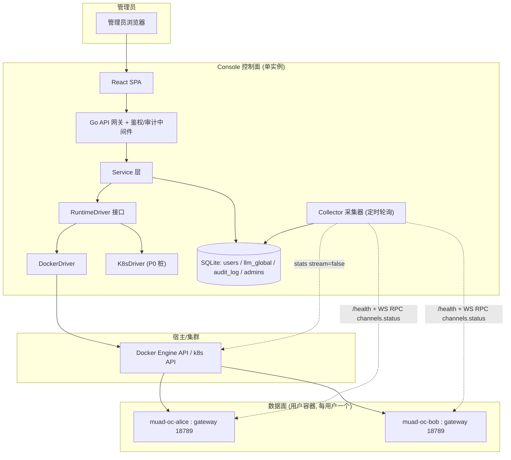
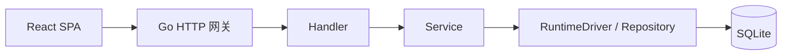
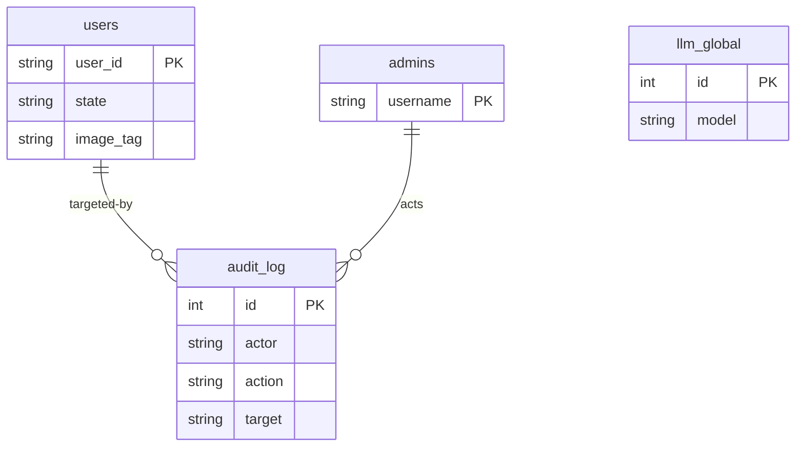
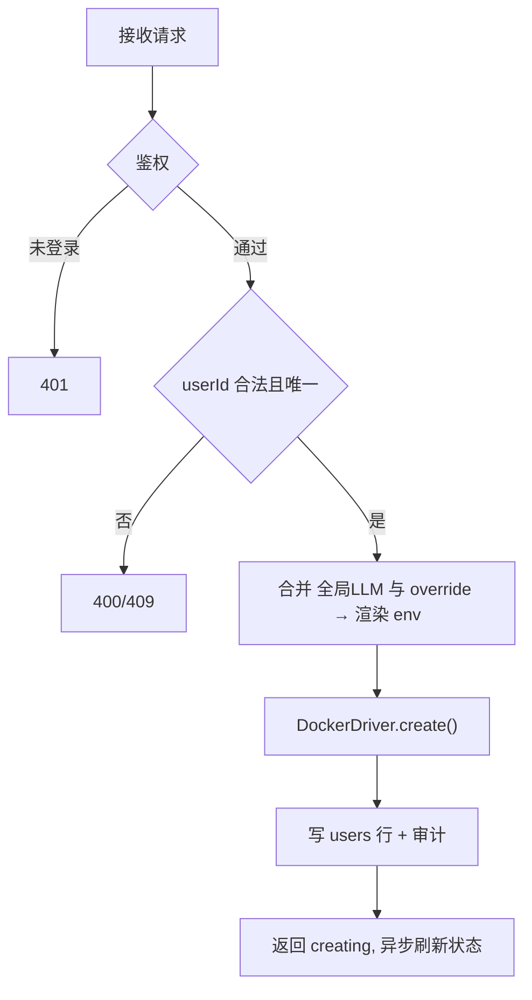

# muad 管理监控控制台 模块需求与设计一体化文档

> **文档编号**: MOD-CONSOLE-v0.1
> **文档版本**: v0.1
> **创建日期**: 2026-06-27
> **文档状态**: 设计评审中

**评审边界说明**:
- **需求评审**: 第 2 章（需求分析）→ 通过后锁定为需求基线 v1.0
- **设计评审**: 第 3-4 章（技术设计 + 部署运维）→ 通过后锁定设计基线 v1.x
- **交接契约**: 2.5 验收条件 — 需求定义 What，设计实现 How

**ID 体系**: FEAT（功能）、API（接口）、RULE（业务规则/系统约束）、TC（测试用例）、RISK（风险）、NFR（非功能指标）
场景编号：S-（正常）、E-（异常）、B-（边界）

---

## 目录

- [1. 文档控制](#1-文档控制)
- [2. 需求分析](#2-需求分析)
- [3. 技术设计](#3-技术设计)
- [4. 部署与运维](#4-部署与运维)
- [5. 风险与依赖](#5-风险与依赖)
- [6. 需求追溯矩阵](#6-需求追溯矩阵)
- [附录：术语表](#附录术语表)

---

## 1. 文档控制

### 1.1 责任人

| 角色 | 姓名 | 职责范围 |
|------|------|---------|
| 产品/需求 | jahan | 需求定义、业务验收 |
| 开发负责人 | | 技术方案、代码实现 |
| 测试负责人 | | 测试策略、质量保证 |

### 1.2 修订历史

| 版本 | 日期 | 作者 | 变更描述 |
|------|------|------|---------|
| v0.1 | 2026-06-27 | Claude | 初始草稿：把 provision-user.sh / reaper 的后台运维操作上移为 Web 控制台 |
| v0.2 | 2026-06-27 | Claude | 补：网络拓扑（gateway 端口不发布 + 单机 bridge/跨机 k8s + 控制面与 worker 隔离）；新增 §4.2 控制台镜像构建与发布 |

---

## 2. 需求分析

### 2.1 需求概述 [必填]

| 项目 | 内容 |
|------|------|
| **模块名称** | muad 管理监控控制台（Admin Console） |
| **模块ID** | MOD-CONSOLE |
| **所属系统/产品线** | muad-openclaw 多租户企微 Agent 平台 |
| **需求类型** | 新功能 |
| **业务背景** | 当前开通/删除/改 LLM/排障全靠 `provision-user.sh` + `docker` CLI 手工操作，无法看全局状态、无审计、无监控，规模上到 100 容器后不可运维 |
| **核心目标** | 把 muad-openclaw 的容器全生命周期管理与运行监控搬到一个 Web 控制台，管理员零 CLI 操作 |

---

### 2.2 痛点与价值 [必填]

| 维度 | 内容 |
|------|------|
| **目标用户** | 平台管理员（运维），规模：1~数名管理员，管理 0~100+ 用户容器 |
| **当前问题** | ① 开通一个用户要 `--init` → 手填 config → `up` 三步 CLI；② 改 LLM 要逐个改 per-user config 文件；③ 无任何"当前有哪些容器/谁在线/谁快被回收"的视图；④ 删除无确认、无审计；⑤ 排障要 `docker logs` 逐个 ssh |
| **业务影响** | 容器规模上升后运维不可持续，误删/凭证泄露/资源打爆无法及时发现 |
| **预期价值** | 开通从 3 步 CLI → 1 个表单；全局 LLM 一处改；100 容器状态/资源/在线一屏可见；所有写操作留审计 |

**用户故事**

| 编号 | 用户故事 | 优先级 |
|------|---------|--------|
| US-01 | 作为管理员，我希望填 user_id/bot_id/secret 一键开通容器，以便快速上线新用户 | P0 |
| US-02 | 作为管理员，我希望一处配置全局 LLM、且能给个别用户覆盖，以便统一换模型又保留特例 | P0 |
| US-03 | 作为管理员，我希望看到所有容器的状态/资源/在线/活跃，以便掌握全局健康 | P0 |
| US-04 | 作为管理员，我希望安全地删除某个容器（确认+可选删卷），以便回收资源 | P0 |
| US-05 | 作为管理员，我希望页面上看日志、启停/重启/回收/唤醒容器，以便不登宿主机就能排障运维 | P1 |
| US-06 | 作为管理员，我希望热更新共享 skill 并推送到全队，以便统一升级能力 | P1 |
| US-07 | 作为管理员，我希望所有危险操作有审计、异常有告警，以便事后追溯与事前预警 | P1 |

---

### 2.3 功能方案 [必填]

#### 2.3.1 功能清单

| 功能ID | 功能名称 | 功能描述 | 优先级 | 来源 |
|--------|---------|---------|--------|------|
| FEAT-01 | 创建容器 | 表单输入 user_id/bot_id/secret（LLM 取全局默认或填覆盖）→ 渲染 env → driver 起容器 | P0 | US-01 |
| FEAT-02 | 容器列表 | 列出全部用户容器：状态、镜像 tag、CPU/MEM、WeCom 在线、最后活跃 | P0 | US-03 |
| FEAT-03 | 删除容器 | 二次确认；可选「是否同时删除状态卷」；删除即留审计 | P0 | US-04 |
| FEAT-04 | LLM 配置 | 全局默认 LLM（provider/baseUrl/apiKey/model）；per-user 覆盖；保存前**连通性测试** | P0 | US-02 |
| FEAT-05 | 日志查看 | 页面 tail 某容器最近 N 行日志 | P0/P1 | US-05 |
| FEAT-06 | 管理员鉴权 | 管理员登录；所有写操作需登录态；操作绑定 actor | P0 | US-07 |
| FEAT-07 | RuntimeDriver 抽象 | docker / k8s 双实现统一契约；P0 实现 docker，k8s 留桩 | P0 | US-01/03/04 |
| FEAT-08 | 运行监控 | CPU/MEM 采集、WeCom 连接健康、距 10 天回收倒计时 | P1 | US-03 |
| FEAT-09 | 生命周期操作 | start / stop / restart / reap（归档保状态）/ revive（唤醒） | P1 | US-05 |
| FEAT-10 | skill 热更 | 上传/更新共享 skill 目录文件 → 扇出触发全队 reload | P1 | US-06 |
| FEAT-11 | LLM 批量应用 | 改全局后，勾选存量容器批量应用新 LLM + 滚动重启 | P1 | US-02 |
| FEAT-12 | 审计日志 | 记录谁/何时/对谁做了什么；可查询 | P1 | US-07 |
| FEAT-13 | 告警 | 容器 down / WeCom 断连 / 内存接近上限 / 即将被回收 | P1 | US-07 |
| FEAT-14 | 镜像版本管理 | 查看各容器 image tag；一键升级到新 tag（重建保卷） | P1 | US-05 |

#### 2.3.2 字段约束

**FEAT-01 创建容器**

| 字段名 | 字段类型 | 必填 | 约束 | 说明 |
|--------|---------|------|------|------|
| user_id | string | Y | `^[A-Za-z0-9][A-Za-z0-9._-]*$`，全局唯一 | 与现有 provision-user.sh 校验一致，作容器名/卷名 |
| bot_id | string | Y | 非空 | 企微智能机器人 botId |
| secret | string | Y | 非空，**加密落盘** | 企微机器人 secret |
| llm_override | object | N | 缺省继承全局 | 仅特例填：provider/baseUrl/apiKey/model |
| image_tag | string | N | 缺省取平台当前默认 tag | 镜像版本 |

**FEAT-04 全局 LLM 配置**

| 字段名 | 字段类型 | 必填 | 约束 | 说明 |
|--------|---------|------|------|------|
| provider | string | Y | 如 `deepseek` | openclaw provider key |
| base_url | string | Y | URL | OpenAI 兼容 baseUrl |
| api_key | string | Y | **加密落盘** | LLM key |
| model | string | Y | 非空 | 模型名 |

---

### 2.4 范围与边界 [必填]

| 类别 | 内容 |
|------|------|
| **范围（In Scope）** | 容器 CRUD + 生命周期、全局/覆盖 LLM 配置、运行监控、日志、skill 热更、审计、告警、管理员鉴权；docker + k8s 双 driver（k8s P0 仅接口桩） |
| **非范围（Out of Scope）** | ① 终端用户自助（仅管理员视角）；② 企微机器人申请流程（bot_id/secret 由管理员线下拿到）；③ 计费/多租户配额；④ openclaw 内部 Agent 行为编排（属镜像层） |
| **前置假设** | ① openclaw gateway 暴露 `/health`（HTTP）与 `channels.status`/session 列表（WS RPC），token 鉴权——**已实地核实**；② 控制台与用户容器网络可达（同 docker network / 同 k8s 集群）；③ 凭证在 DB 加密落盘，运行时仍经 env 注入容器，不进镜像（延续 NFR-SEC-02） |
| **有意妥协 / 技术债** | ① k8s driver P0 仅留桩（`NotImplemented`），先把 docker 形态打通；② 监控采集用定时轮询（非推流），实时性到秒级即可；③ 告警 P1 先做"页面红点 + 列表标记"，外发通道（webhook/邮件）后置 |

---

### 2.5 验收条件 [必填]

#### 2.5.1 业务规则与约束

| ID | 类型 | 描述 |
|----|------|------|
| RULE-01 | 业务规则 | user_id 全局唯一；重复创建拒绝 |
| RULE-02 | 业务规则 | 删除容器必须二次确认；「删卷」默认不勾选（防误删状态/记忆） |
| RULE-03 | 业务规则 | 改全局 LLM 只影响**新建**容器；作用于存量需经 FEAT-11 显式批量应用 |
| RULE-04 | 系统约束 | 凭证（secret / api_key）DB 内加密存储，接口响应一律脱敏（不回传明文） |
| RULE-05 | 系统约束 | 所有写操作（创建/删除/启停/改配置/热更/升级）必须经鉴权且写审计 |
| RULE-06 | 系统约束 | 监控采集对单容器用一次性 `stats?stream=false`，禁止常驻 stats 流 |

#### 2.5.2 功能验收场景

**正常场景**

| 场景ID | 功能ID | 优先级 | 前置条件 | 操作步骤 | 预期结果 |
|--------|--------|--------|---------|---------|---------|
| S-01 | FEAT-01 | P0 | 已登录，全局 LLM 已配 | 填 user_id/bot_id/secret 提交 | 容器起、状态变 running、列表出现该行、审计有一条 create |
| S-02 | FEAT-04 | P0 | 已登录 | 改全局 LLM 并点连通性测试 | 测试通过则可保存；新建容器 `.env` 带新 LLM |
| S-03 | FEAT-02 | P0 | 已有≥1 容器 | 打开列表页 | 显示状态/镜像/CPU/MEM/WeCom 在线/最后活跃 |
| S-04 | FEAT-03 | P0 | 目标容器存在 | 点删除→确认（不勾删卷） | 容器停删、卷保留、列表移除、审计有一条 delete |
| S-05 | FEAT-08 | P1 | 容器在跑且用户发过消息 | 查看该容器 | WeCom 显示在线、最后活跃时间正确、回收倒计时 = 10 天−空闲 |
| S-06 | FEAT-10 | P1 | 多容器运行，共享 skill 已挂 | 上传新版 skill 文件→点热更 | 各容器 reload，`openclaw skills list` 见新内容，不重建容器 |

**异常场景**

| 场景ID | 功能ID | 触发条件 | 系统行为 | 用户感知 |
|--------|--------|---------|---------|---------|
| E-01 | FEAT-01 | user_id 已存在 | 拒绝，不动现有容器 | 报「user_id 已存在」(409) |
| E-02 | FEAT-04 | 连通性测试失败（key 错/baseUrl 不通） | 阻止保存 | 报具体失败原因，不写库 |
| E-03 | FEAT-01 | user_id 非法字符 | 拒绝 | 报校验错误 (400) |
| E-04 | FEAT-08 | 容器 gateway 不可达 | 该容器标 unhealthy，不影响其他行采集 | 列表该行红点 +「连接失败」 |
| E-05 | FEAT-03 | 未登录调删除接口 | 拒绝 | 401 |

**边界场景**

| 场景ID | 字段/条件 | 边界值 | 预期行为 |
|--------|----------|--------|---------|
| B-01 | 容器数量 | 100 | 列表采集一轮在秒级完成，不阻塞 UI（并发采集 + 缓存） |
| B-02 | 日志 tail | N 很大 | 限制最大行数（如 ≤2000），防内存/带宽打爆 |

#### 2.5.3 非功能指标

**性能指标**

| 指标ID | 指标名称 | 目标值 | 测量方法 |
|--------|---------|-------|---------|
| NFR-PERF-01 | 列表页 100 容器一轮采集 | ≤3s（并发轮询，缓存对外） | 压测/计时 |
| NFR-PERF-02 | 控制台自身资源占用 | 常驻 ≤256MiB / ≤0.5 vCPU | 监控 |
| NFR-PERF-03 | 写操作（创建/删除）API P95 | ≤2s（不含容器拉起耗时，异步反馈状态） | 计时 |

**可靠性指标**

| 指标ID | 指标名称 | 目标值 |
|--------|---------|-------|
| NFR-REL-01 | 单容器采集失败隔离 | 任一容器探测失败不影响其余行 |
| NFR-REL-02 | 控制台重启 | 状态全在 SQLite，重启后视图一致（容器本身不受影响） |

**安全性要求**

| 指标ID | 安全域 | 验收标准 |
|--------|--------|---------|
| NFR-SEC-01 | 认证鉴权 | 未登录无法访问任何写接口；只读接口同样需登录 |
| NFR-SEC-02 | 数据加密 | secret / api_key 加密落盘，接口响应脱敏，日志不打印明文 |
| NFR-SEC-03 | 权限面收敛 | docker.sock / k8s SA 仅控制台后端持有，前端无直接访问 |

---

## 3. 技术设计

### 3.1 方案选型 [必填]

#### 关键决策记录

| 决策点 | 选择 | 被否决项 | 理由 | 可逆性 |
|--------|------|---------|------|--------|
| 后端语言 | **Go** | Python/FastAPI、Node | 单二进制部署、docker/k8s 官方 client-go 一等公民、并发采集天然（goroutine）、资源占用低 | 难回退（语言级） |
| 运行时对接 | **RuntimeDriver 抽象 + docker/k8s 双实现** | 只做 docker | 用户已定双形态；接口先定死，docker 先写实、k8s 留桩 | 易（加桩实现） |
| LLM 归属 | **全局默认 + per-user 覆盖** | 纯 per-user / 纯全局 | 建容器只填身份，统一换模型又留特例 | 易 |
| 监控应用层数据 | **openclaw gateway**（`/health` HTTP + `channels.status`/session WS RPC） | 解析日志、读 state 文件 | 已实地核实 gateway 暴露结构化状态；比解析日志稳、比读文件少耦合格式 | 中 |
| 监控容器层数据 | **docker/k8s API**（`stats?stream=false` / metrics-server） | cAdvisor 独立部署 | 无需额外组件；一次性采样避免常驻流开销 | 易 |
| 存储 | **SQLite（pure-Go `modernc.org/sqlite`）** | Postgres | 单实例控制面、数据量小（用户+配置+审计）；无 CGO、随二进制走 | 中（量大可迁 PG） |
| 前端 | **React + Vite SPA** | 服务端渲染 | 监控/列表交互重，SPA + REST 解耦清晰 | 易 |
| 网络底座 | **单机 docker bridge / 多机 k8s 集群网络** | 多机硬撑 docker bridge、Swarm overlay | bridge 仅同机有效；跨机即 k8s 触发条件，Swarm 生态收缩不选 | 中 |
| gateway 端口暴露 | **一律不发布到宿主机** | 逐容器发布到宿主端口 | 100 容器同 18789 不冲突；发布需 user→port 映射表且暴露 token（攻击面） | 易 |

> 核心要沉淀：**Go 选型是为单二进制 + client-go + 并发采集**；监控数据源**已实地核实 openclaw gateway 可提供连接健康与活跃时间**，不靠脆弱的日志解析。

#### 技术栈

| 类别 | 选型 | 版本 | 选型理由 |
|------|------|------|---------|
| 语言 | Go | 1.22+ | 单二进制、并发、client-go |
| HTTP 框架 | chi 或 gin | latest | 轻量路由 + 中间件（鉴权/审计） |
| 容器 API | `github.com/docker/docker/client` | latest | docker driver |
| k8s API | `k8s.io/client-go` | latest | k8s driver（P0 桩） |
| gateway RPC | `nhooyr.io/websocket`（或 `gorilla/websocket`） | latest | 调 openclaw `channels.status`/session（WS RPC） |
| 数据库 | `modernc.org/sqlite` | latest | 纯 Go、无 CGO |
| 凭证加密 | AES-GCM（`crypto/cipher`），主密钥经 env 注入 | stdlib | secret/api_key at-rest 加密 |
| 前端 | React + Vite + 任一表格组件库 | latest | 监控列表/表单 |

---

### 3.2 架构设计 [必填]



#### 技术分层



#### 外部依赖清单

| 外部系统 | 依赖类型 | 协议 | 超时 | 降级策略 |
|---------|---------|------|------|---------|
| Docker Engine | 容器编排 | unix socket / HTTP API | 5s | driver 报错，操作失败回滚，不影响监控 |
| k8s API（P1 实做） | 容器编排 | HTTPS | 5s | 同上 |
| openclaw gateway | 应用层状态 | HTTP `/health` + WS RPC | 3s/容器 | 单容器超时标 unhealthy，隔离不影响他人（NFR-REL-01） |
| LLM provider | 连通性测试 | HTTPS | 8s | 测试失败阻止保存（E-02） |

#### 网络拓扑约束（关键）

**前提事实**：每个用户容器内 gateway 统一监听 `18789`（entrypoint `openclaw gateway --bind lan --port 18789`）。各容器**独立网络命名空间**，同端口**不冲突**；冲突只会发生在"发布到宿主机同一 IP"那一层。

**约定：gateway 端口一律不发布到宿主机（NFR-SEC-03）。** Console 通过"与容器同处一张网络、按容器名直连 18789"采集，不经宿主机端口。

| 形态 | Console↔容器 可达方式 | 网络底座 | 端口 |
|------|----------------------|---------|------|
| 单机 docker | 共享 bridge `muad-net`，按容器名 `muad-oc-<id>:18789` 直连 | 单机 bridge（容器名 DNS 仅同机有效） | 不发布 |
| 多机 / k8s | 经 ClusterIP Service / Pod IP `:18789` 访问任意节点 Pod | 集群 CNI 网络（全集群同网段，跨节点透明） | 不发布（保持 ClusterIP，不开 NodePort） |

**为何不发布**：① 100 容器全用 18789，发布会被迫为每容器分不同宿主端口 + 维护 user→port 映射表；② 发布即把 gateway+token 暴露到宿主机/LAN，扩大攻击面。**例外**：临时调 Control UI 时给单容器临时加 `ports: ["18789:18789"]`，日常运行不加。

**落地缺口**：现 `compose.template.yml` 无 `networks` 段，需补一张外部共享网络供 Console 接入（属 Console 落地工作，不动镜像）：

```yaml
services:
  muad-oc-${PC_USER}:
    networks: [muad-net]
networks:
  muad-net:
    external: true   # 预先 docker network create muad-net
```

**底座边界（与 §3.1 决策一致）**：单机 bridge 仅同机可达 → **跨机器即 K8sDriver 的触发条件**，多机不要硬撑 Docker bridge（否则等于自研跨机编排：DockerDriver 要连多个 `DOCKER_HOST`、自做发现与调度，正是 k8s 替代的部分）。

---

### 3.3 数据设计 [必填]

**新增表: `users`**

| 字段名 | 类型 | 可空 | 默认值 | 索引 | 说明 |
|--------|------|------|--------|------|------|
| user_id | TEXT | N | | PK | 用户/容器标识 |
| bot_id | TEXT | N | | | 企微 botId |
| secret_enc | BLOB | N | | | 企微 secret（AES-GCM 密文） |
| llm_override | TEXT | Y | NULL | | per-user LLM 覆盖（JSON，密文字段同样加密） |
| image_tag | TEXT | N | | | 镜像 tag |
| state | TEXT | N | 'creating' | | creating/running/stopped/archived/unhealthy |
| created_at | DATETIME | N | CURRENT_TIMESTAMP | | |
| updated_at | DATETIME | N | CURRENT_TIMESTAMP | | |

**新增表: `llm_global`**（单行，全局默认）

| 字段名 | 类型 | 可空 | 默认值 | 说明 |
|--------|------|------|--------|------|
| id | INTEGER | N | 1 (CHECK id=1) | 单行约束 |
| provider | TEXT | N | | |
| base_url | TEXT | N | | |
| api_key_enc | BLOB | N | | LLM key 密文 |
| model | TEXT | N | | |
| updated_at | DATETIME | N | CURRENT_TIMESTAMP | |

**新增表: `audit_log`**

| 字段名 | 类型 | 可空 | 默认值 | 索引 | 说明 |
|--------|------|------|--------|------|------|
| id | INTEGER | N | AUTO | PK | |
| actor | TEXT | N | | IDX(actor,ts) | 操作管理员 |
| action | TEXT | N | | | create/delete/update_llm/restart/reap/hotreload/upgrade... |
| target | TEXT | Y | | | 目标 user_id |
| payload | TEXT | Y | | | 脱敏后的请求摘要（JSON） |
| ts | DATETIME | N | CURRENT_TIMESTAMP | IDX | |

**新增表: `admins`**

| 字段名 | 类型 | 可空 | 默认值 | 说明 |
|--------|------|------|--------|------|
| username | TEXT | N | | PK |
| password_hash | TEXT | N | | bcrypt |

> 运行时监控数据（CPU/MEM/在线/活跃）**不落库**，由 Collector 周期采集后内存缓存对外（避免写放大）；只有用户档案、配置、审计持久化。

**索引设计**

| 索引名 | 类型 | 字段 | 使用场景 |
|--------|------|------|---------|
| pk_users | 主键 | user_id | 唯一性校验(E-01)、行查 |
| idx_audit_ts | 普通 | ts | 审计按时间倒序查 |
| idx_audit_actor | 复合 | (actor, ts) | 按操作人查 |

**ER图**



**容量预估**

| 维度 | 预估值 |
|------|--------|
| users | ≤数百行 |
| audit_log | ~每操作 1 行，年级别可加归档/清理，SQLite 足够 |

---

### 3.4 接口设计 [必填]

#### 形态 A：HTTP API

#### 接口清单

| 接口ID | 名称 | 方法 | 路径 | 优先级 |
|--------|------|------|------|------|
| API-01 | 创建容器 | POST | `/api/v1/containers` | P0 |
| API-02 | 容器列表（含监控快照） | GET | `/api/v1/containers` | P0 |
| API-03 | 删除容器 | DELETE | `/api/v1/containers/{userId}?deleteVolume=bool` | P0 |
| API-04 | 容器日志 | GET | `/api/v1/containers/{userId}/logs?tail=N` | P0/P1 |
| API-05 | 读全局 LLM | GET | `/api/v1/llm` | P0 |
| API-06 | 改全局 LLM | PUT | `/api/v1/llm` | P0 |
| API-07 | LLM 连通性测试 | POST | `/api/v1/llm/test` | P0 |
| API-08 | 改 per-user LLM 覆盖 | PUT | `/api/v1/containers/{userId}/llm` | P1 |
| API-09 | 生命周期操作 | POST | `/api/v1/containers/{userId}/actions/{action}` | P1 |
| API-10 | 共享 skill 热更 | POST | `/api/v1/skills/reload` | P1 |
| API-11 | LLM 批量应用 | POST | `/api/v1/llm/apply` | P1 |
| API-12 | 审计查询 | GET | `/api/v1/audit?actor=&from=&to=` | P1 |
| API-13 | 镜像升级 | POST | `/api/v1/containers/{userId}/upgrade` | P1 |
| API-14 | 登录 | POST | `/api/v1/auth/login` | P0 |

> action ∈ {start, stop, restart, reap, revive}（API-09）。所有写接口经鉴权中间件 + 审计中间件。

---

#### API-01: 创建容器

**请求**

| 参数 | 类型 | 必填 | 说明 |
|------|------|------|------|
| userId | string | Y | 唯一、字符集校验 |
| botId | string | Y | 企微 botId |
| secret | string | Y | 企微 secret（落库加密） |
| llmOverride | object | N | 缺省继承全局 |
| imageTag | string | N | 缺省取平台默认 |

**请求示例**

```json
{ "userId": "alice", "botId": "wb-xxxx", "secret": "***" }
```

**响应示例**

```json
{ "code": 0, "message": "success", "data": { "userId": "alice", "state": "creating" } }
```

**错误码**

| 错误码 | 信息 | 场景 | HTTP |
|--------|------|------|------|
| 40001 | 参数错误 | userId 非法 (E-03) | 400 |
| 40901 | user_id 已存在 | 重复创建 (E-01) | 409 |
| 50001 | 容器拉起失败 | driver 报错 | 500 |

**处理逻辑**



#### API-02: 容器列表（含监控快照）

返回每容器：`userId / state / imageTag / cpu / memMiB / wecomConnected / lastActiveAt / reapInEta`。数据来自 Collector 内存缓存（周期刷新），不在请求路径上现采（NFR-PERF-01）。

#### API-06 / API-07: 改全局 LLM / 连通性测试

`PUT /llm` 前端应先调 `POST /llm/test`（用待保存的 provider/baseUrl/apiKey/model 打一次 `/v1/models` 或最小补全请求）；测试失败则后端拒绝保存（RULE 对应 E-02）。

> 其余接口（API-03/04/08~14）结构同上，按 §2.5 场景与错误码补全。

---

### 3.5 质量实现方案 [必填]

#### RuntimeDriver 契约（FEAT-07 核心）

```go
type RuntimeDriver interface {
    Create(ctx context.Context, spec UserSpec) error
    Start(ctx context.Context, userID string) error
    Stop(ctx context.Context, userID string) error
    Restart(ctx context.Context, userID string) error
    Remove(ctx context.Context, userID string, keepState bool) error
    List(ctx context.Context) ([]ContainerInfo, error)
    Stats(ctx context.Context, userID string) (Stats, error)     // stream=false 一次性
    Logs(ctx context.Context, userID string, tail int) (string, error)
    Reap(ctx context.Context, userID string) error               // 归档保状态
    Revive(ctx context.Context, userID string) error
}

type UserSpec struct {
    UserID, BotID, Secret, ImageTag string
    LLM LlmConfig // 已是 全局⊕override 合并结果
}
type ContainerInfo struct {
    UserID, State, ImageTag string
    CPU float64; MemMiB int
    WecomConnected bool; LastActiveAt time.Time
}
```

- **DockerDriver**：用 docker client（容器层）+ HTTP `/health` 与 WS RPC（应用层）。可复用现有 `provision-user.sh` 的渲染逻辑或用 client 直接 create。
- **K8sDriver**：P0 各方法返回 `ErrNotImplemented`，接口先定死，P1 用 client-go 实做。

#### 监控数据源（已实地核实，对应风险2）

| 监控项 | 数据源 | 采集方式 |
|--------|--------|---------|
| 进程存活 | gateway `GET /health` → `{"ok":true,"status":"live"}` | HTTP + token，3s 超时 |
| WeCom 连接健康 | gateway **WS RPC `channels.status`** | `websockets` 连 18789，带 token 调一次 |
| 最后活跃 / 空闲 | session store `updatedAt`/`lastActivityAt`/`lastMessageAt`、agent-db `last_seen_at`（openclaw 已有 idle-reset 评估机制） | 同 WS RPC 拉 session 列表；reaper 复用 idle 机制 |
| CPU/MEM/容器状态 | docker `stats?stream=false` / k8s metrics-server | 周期并发采样 |

#### 性能设计

| 指标ID | 热点路径 | 目标值 | 实现方案（含被放弃的较慢方案） |
|--------|---------|-------|------------------------------|
| NFR-PERF-01 | 100 容器列表采集 | ≤3s | Collector 后台 goroutine 池**并发**对每容器一次性采样，结果写内存缓存；API 读缓存。**放弃**：请求路径上串行现采（100×(stats+RPC) 会到分钟级）；**放弃**：常驻 stats 流（100 条长连接吃资源，违反 RULE-06） |

#### 可靠性设计

| 风险ID | 失效模式 | 影响 | 应对措施 |
|--------|---------|------|---------|
| RISK-01 | 某容器 gateway 卡死 | 采集线程阻塞 | 每容器 3s 超时 + 失败隔离，标 unhealthy（NFR-REL-01, E-04） |
| RISK-02 | 控制台重启 | 监控缓存丢失 | 档案/配置/审计在 SQLite，重启自动重建缓存；用户容器不受影响（NFR-REL-02） |

#### 安全性设计

| 指标ID | 验收标准 | 实现方案 |
|--------|---------|---------|
| NFR-SEC-01 | 未授权不可访问 | 登录签发 JWT/session，鉴权中间件挡所有 `/api/v1/*`（login 除外） |
| NFR-SEC-02 | 敏感字段不明文 | secret/api_key AES-GCM 加密落盘，主密钥经 env（`CONSOLE_MASTER_KEY`）注入；响应脱敏；日志禁打印 |
| NFR-SEC-03 | 权限面收敛 | docker.sock / k8s SA 仅后端持有；前端只经 REST；后端容器最小权限运行 |

#### 可观测性设计

| 场景 | 实现方案 |
|------|---------|
| 日志 | 结构化 JSON + request_id |
| 审计 | 写操作中间件统一落 audit_log（脱敏 payload） |
| 告警(FEAT-13) | Collector 周期评估规则（down/断连/内存>阈值/即将回收）→ 列表标记 + 红点；外发通道后置 |

---

## 4. 部署与运维

### 4.1 部署架构

| 环境 | 形态 | 实例数 | Console 位置 | 操作面 |
|------|------|--------|-------------|--------|
| 单机 docker（PoC/小规模） | Console 容器挂 `/var/run/docker.sock`，接入共享 `muad-net` | 1 | **与用户容器同宿主**（同机妥协，记技术债） | 本机 docker.sock |
| 多机 / k8s（生产，P1） | Deployment + ServiceAccount（list/create/delete pod）+ Console PVC（SQLite） | 1（可加选主主备） | 集群内**任一节点**，且**避开跑用户容器的 worker**（独立 ns / node pool） | kube-apiserver |

**部署定位原则**：Console 是控制面，**全局仅 1 个实例**（不是每机一个）。单机阶段它必须与容器同机（要本机 docker.sock + 同 bridge）；多机阶段它**只要同集群/网络可达**，且基于 RISK-03（Console 握全部凭证 + 能建删容器 vs 用户容器是不可信沙箱）应与 worker **物理隔离**，不与不可信容器同节点。

部署物：单 Go 二进制（内嵌前端静态资源）+ SQLite 文件（挂卷持久化）+ env：`CONSOLE_MASTER_KEY`（加密主密钥）、`RUNTIME_DRIVER=docker|k8s`、`DEFAULT_IMAGE_TAG`、`MUAD_NET`（共享网络名）、初始管理员凭证。

### 4.2 控制台镜像构建与发布

Console 自身需独立镜像与 CI（与现有 muad-openclaw 镜像分开,各自 tag 触发构建到 GHCR）。

| 项 | 方案 |
|----|------|
| 构建 | 多阶段 Dockerfile：① `node` 阶段 `vite build` 出前端静态资源；② `golang` 阶段 `go build` 出单二进制并 `embed` 前端产物；③ 极简 runtime（`gcr.io/distroless/static` 或 `alpine`），非 root 运行 |
| 产物 | 单镜像 `ghcr.io/<owner>/muad-console`，内含二进制 + 内嵌前端，无外部依赖（SQLite 走挂载卷） |
| CI | GitHub Actions，on `push tag v*` → build & push（沿用 muad-openclaw 现有 `build-image.yml` 同款流水线，新增一个工作流文件） |
| 运行 | 单机：`docker run` 挂 docker.sock + `muad-net` + SQLite 卷；k8s：Deployment + SA + PVC |
| 安全 | 非 root；docker.sock / k8s SA 仅后端持有；`CONSOLE_MASTER_KEY` 经 env 注入不入镜像（延续 NFR-SEC-02） |

> 镜像内**不烤任何凭证**：管理员账号初值、加密主密钥、运行时 driver 选择全部 env 注入。

### 4.3 监控告警

| 指标 | 阈值 | 级别 | 处理 |
|------|------|------|------|
| 容器 down | state≠running 且非 archived | P1 | 列表红点 |
| WeCom 断连 | channels.status 离线 | P1 | 列表标记 |
| 内存接近上限 | memMiB > 2048×85% | P2 | 列表黄标 |
| 即将被回收 | reapInEta < 1 天 | P3 | 列表提示 |

---

## 5. 风险与依赖

### 5.1 项目依赖

| 依赖 | 依赖内容 | 状态 | 风险等级 |
|-------------|---------|------|---------|
| openclaw gateway | `/health` + `channels.status`/session WS RPC | ✅ 已实地核实 | 低 |
| muad-openclaw 镜像 | 共享 skill 挂载（`/opt/openclaw-skills` + `skills.load.watch`） | ✅ 已实现 | 低 |
| Docker Engine / k8s | 控制面操作权限 | docker 现成；k8s 待 | 中 |

### 5.2 风险识别

| 风险ID | 类型 | 描述 | 概率 | 影响 | 应对措施 |
|--------|------|------|------|------|---------|
| RISK-03 | 安全 | 控制台能建删容器 + 持 docker.sock = 高权限逃逸面 | 中 | 高 | 强制鉴权 + 全审计 + 后端最小权限/隔离网络；docker.sock 不暴露给前端 |
| RISK-04 | 安全 | 凭证集中存 DB，泄露面集中 | 低 | 高 | AES-GCM 加密 + 主密钥 env 注入（不落库）+ 响应脱敏 |
| RISK-05 | 工期 | dual-runtime 两套实做拖慢可用 | 中 | 中 | 接口先定死，P0 仅 docker 写实，k8s 留桩 |
| RISK-06 | 兼容 | gateway WS RPC 方法名/字段随 openclaw 版本变 | 低 | 中 | 采集层封装适配器，集中一处随版本调整；`/health` 作兜底存活源 |
| RISK-07 | 可靠 | inotify 在 macOS/NFS 上热更不可靠（skill 推送） | 中 | 中 | 扇出 reload 信号（逐容器触发），不单依赖 watch（沿用既有结论） |

---

## 6. 需求追溯矩阵

| 用户故事 | 功能ID | 接口ID | 测试用例ID | 状态 |
|---------|--------|--------|-----------|------|
| US-01 | FEAT-01, FEAT-07 | API-01 | TC=S-01, E-01, E-03 | ⬜ |
| US-02 | FEAT-04, FEAT-11 | API-05/06/07/08/11 | TC=S-02, E-02 | ⬜ |
| US-03 | FEAT-02, FEAT-08 | API-02 | TC=S-03, S-05, E-04, B-01 | ⬜ |
| US-04 | FEAT-03 | API-03 | TC=S-04, E-05 | ⬜ |
| US-05 | FEAT-05, FEAT-09, FEAT-14 | API-04/09/13 | TC=（待补） | ⬜ |
| US-06 | FEAT-10 | API-10 | TC=S-06 | ⬜ |
| US-07 | FEAT-06, FEAT-12, FEAT-13 | API-12/14 | TC=E-05 | ⬜ |

> 测试用例 ID 引用 §2.5.2 场景（S-/E-/B-）。FEAT-05/09/13/14 验收场景 P1 阶段补全（已在矩阵显式标「待补」）。

---

## 附录：术语表

| 术语 | 定义 |
|------|------|
| RuntimeDriver | 屏蔽 docker/k8s 差异的容器编排抽象接口 |
| Collector | 控制台后台周期采集容器/应用监控数据的组件 |
| reap / revive | 10 天空闲归档（保状态）/ 再次使用时唤醒 |
| gateway | openclaw 容器内的 HTTP+WS 服务（默认 18789） |
| FEAT/API/RULE/NFR/RISK | 功能/接口/规则/非功能指标/风险 |

---

*文档结束*
