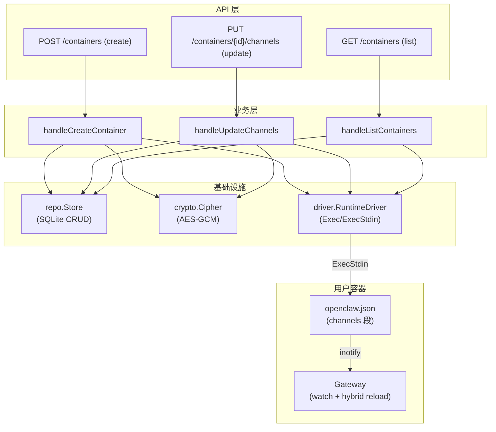
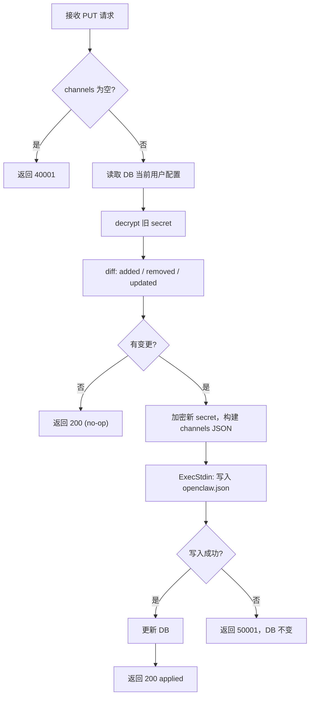

# 多 IM 通道支持 后端模块需求与设计一体化文档

> **文档编号**: MOD-MULTICHAN-001
> **文档版本**: v0.1
> **创建日期**: 2026-07-03
> **文档状态**: 草稿

**评审边界说明**:
- **需求评审**: 第 2 章（需求分析）→ 通过后锁定为需求基线 v1.0
- **设计评审**: 第 3-4 章（技术设计 + 部署运维）→ 通过后锁定设计基线 v1.x
- **交接契约**: 2.5 验收条件 — 需求定义 What，设计实现 How

**ID 体系**: US（用户故事，来自 PRD）、FEAT（功能）、API（接口）、RULE（业务规则/系统约束）、TC（测试用例）、RISK（风险）、NFR（非功能指标）
场景编号：S-（正常）、E-（异常）、B-（边界，按需）

---

## 目录

- [1. 文档控制](#1-文档控制)
- [2. 需求分析](#2-需求分析)
  - [2.1 需求概述](#21-需求概述-必填)
  - [2.2 痛点与价值](#22-痛点与价值-必填)
  - [2.3 功能方案](#23-功能方案-必填)
  - [2.4 范围与边界](#24-范围与边界-必填)
  - [2.5 验收条件](#25-验收条件-必填)
- [3. 技术设计](#3-技术设计)
  - [3.1 方案选型](#31-方案选型-必填)
  - [3.2 架构设计](#32-架构设计-必填)
  - [3.3 数据设计](#33-数据设计-必填)
  - [3.4 接口设计](#34-接口设计-必填)
  - [3.5 质量实现方案](#35-质量实现方案-必填)
- [4. 部署与运维](#4-部署与运维)
  - [4.4 数据迁移](#44-数据迁移-按需)
- [5. 风险与依赖](#5-风险与依赖)
- [6. 需求追溯矩阵](#6-需求追溯矩阵)
- [附录：术语表](#附录术语表)

---

## 1. 文档控制

### 1.1 责任人

| 角色 | 姓名 | 职责范围 |
|------|------|---------|
| 产品经理 | | 需求定义、业务验收 |
| 开发负责人 | | 技术方案、代码实现 |

### 1.2 修订历史

| 版本 | 日期 | 作者 | 变更描述 |
|------|------|------|---------|
| v0.1 | 2026-07-03 | | 初始草稿，PRD 派生 |

---

## 2. 需求分析

### 2.1 需求概述 [必填]

| 项目 | 内容 |
|------|------|
| **模块名称** | 多 IM 通道支持（后端） |
| **模块ID** | MOD-MULTICHAN |
| **所属系统/产品线** | muad-openclaw 多租户 Agent 平台 |
| **需求类型** | 新功能 |
| **业务背景** | 当前每个容器仅支持单一 IM 通道（企微/微信二选一），用户多平台触达需创建多个容器，导致会话分裂、资源浪费。上游 OpenClaw 已原生支持多通道同时运行 + 配置热重载，muad 的人为限制应解除。 |
| **核心目标** | 一个容器支持配置多个 IM 通道，管理员通过 API 增/删/改通道配置，通过热更新即时生效，Docker 和 K8s 同步支持。 |

---

### 2.2 痛点与价值 [必填]

| 维度 | 内容 |
|------|------|
| **目标用户** | 平台管理员（1-3 人），通过 Web 控制台管理用户容器 |
| **当前问题** | 单通道限制导致：① 多平台需多容器，会话记忆分裂；② 资源翻倍；③ 运维复杂 |
| **业务影响** | 限制平台扩展性——后续接入 Slack/Telegram 等通道需全链路改造 |
| **预期价值** | 统一会话体验（多平台共享记忆）；降低资源成本；为新通道接入奠定可扩展基础 |

**用户故事**

| 编号 | 用户故事 | 优先级 |
|------|---------|--------|
| US-01 | 作为管理员，创建用户时能同时勾选多个 IM 通道并分别配置凭证 | P0 |
| US-02 | 作为管理员，能为已有用户追加新的 IM 通道 | P0 |
| US-03 | 作为管理员，能移除用户的某个 IM 通道 | P0 |
| US-04 | 作为管理员，能更新某通道的凭证，未修改通道保持原配置 | P0 |
| US-05 | 作为管理员，通道变更热更新生效，不重启容器 | P0 |

---

### 2.3 功能方案 [必填]

#### 2.3.1 功能清单

| 功能ID | 功能名称 | 功能描述 | 优先级 | 来源 |
|--------|---------|---------|--------|------|
| FEAT-01 | 多通道数据模型 | DB schema 从单 `channel` 列改造为 `channels` JSON 数组 + `channel_configs` JSON 凭证对象；UserSpec、API 类型同步更新 | P0 | US-01, US-02, US-03, US-04 |
| FEAT-05 | 热更新通道配置 | 通过 `ExecStdin` 接口向容器内注入通道配置更新脚本，修改 `openclaw.json`，Gateway 自动热重载；Docker/K8s 共用同一实现 | P0 | US-05 |
| FEAT-08 | 旧数据兼容迁移 | 提供迁移脚本，将旧 `channel`+`bot_id`+`secret_enc` 格式转换为新 JSON 格式；启动时自动执行 | P0 | US-01 |

#### 2.3.2 字段约束

**FEAT-01 字段约束**

| 字段名 | 字段类型 | 必填 | 约束 | 说明 |
|--------|---------|------|------|------|
| channels | TEXT (JSON array) | Y | `["wecom","wechat"]`，元素来自 `validChannels` | 已启用的通道 ID 列表 |
| channel_configs | TEXT (JSON object) | Y | `{"wecom":{"botId":"...","secret":"..."},"wechat":{}}` | 各通道凭证，secret 经 AES-GCM 加密后存入 |

---

### 2.4 范围与边界 [必填]

| 类别 | 内容 |
|------|------|
| **范围（In Scope）** | ① 数据模型从单通道列迁移到 JSON 多通道格式；② 创建/编辑容器 API 支持多通道；③ 热更新：通过 Exec 修改容器内 `openclaw.json`，Gateway 自动热重载；④ Docker + K8s 同步支持；⑤ 数据迁移脚本（启动时自动执行） |
| **非范围（Out of Scope）** | ① 同一平台多账号；② 新增 Slack/Telegram 等具体通道的插件安装（仅做架构可扩展）；③ 热更新的事务回滚（失败时靠最终一致性兜底）；④ 通道级别会话隔离 |
| **前置假设** | ① 上游 Gateway 默认 `reload.mode: hybrid`（已核实）；② `RuntimeDriver.Exec` 在 Docker/K8s 均可用；③ 镜像内已有 Node.js（entrypoint 已用） |
| **有意妥协 / 技术债** | ① 旧 `channel`/`bot_id`/`secret_enc` 列保留不 DROP，下一大版本清理；② 通道配置写入失败不做事务回滚，靠 Gateway 最终一致性兜底；③ Exec 接口当前不支持 stdin 管道——新增 `ExecStdin` 方法 |

---

### 2.5 验收条件 [必填]

#### 2.5.1 业务规则与约束

| ID | 类型 | 描述 |
|----|------|------|
| RULE-01 | 业务规则 | 每个用户至少配置一个通道才能创建 |
| RULE-02 | 业务规则 | 企微通道必须填写 botId + secret，微信通道免凭证 |
| RULE-03 | 业务规则 | 更新凭证时 secret 字段留空 = 保持原值不变 |
| RULE-04 | 业务规则 | 取消勾选已有通道 → 清除该通道配置及凭证 |
| RULE-05 | 系统约束 | 热更新写入 `openclaw.json` 不应通过命令行参数传递敏感信息 |
| RULE-06 | 系统约束 | 同一用户每种通道最多配置一个实例 |

#### 2.5.2 功能验收场景

**正常场景**

| 场景ID | 功能ID | 优先级 | 前置条件 | 操作步骤 | 预期结果 |
|--------|--------|--------|---------|---------|---------|
| S-01 | FEAT-01 | P0 | 空数据库 | 调用 POST `/containers` 传入 `channels: ["wecom","wechat"]` + 对应凭证 | 返回 200，DB 中 `channels`/`channel_configs` 写入正确 |
| S-02 | FEAT-01 | P0 | 已有单通道旧格式数据 | 启动后端 | 旧数据自动迁移为新格式，日志输出迁移条数 |
| S-03 | FEAT-05 | P0 | 容器运行中，当前有企微通道 | 调用 PUT `/containers/alice/channels` 追加微信通道 | Gateway 热重载生效，容器状态保持 running |
| S-04 | FEAT-05 | P0 | 容器运行中，企微 secret 需轮换 | 调用 PUT，只传新的 secret，botId 不变 | 企微用新 secret 重连，微信不受影响 |

**异常场景**

| 场景ID | 功能ID | 触发条件 | 系统行为 | 用户感知 |
|--------|--------|---------|---------|---------|
| E-01 | FEAT-01 | 创建时 channels 为空数组 | 返回 40001 "至少选择一个通道" | 客户端校验拦截 |
| E-02 | FEAT-01 | 企微未填 botId | 返回 40001 "企业微信: Bot ID 必填" | 客户端校验拦截 |
| E-03 | FEAT-05 | 热更新时 Gateway 未运行（容器刚创建） | 写入 `openclaw.json` 成功，返回 200 | 下次启动生效 |
| E-04 | FEAT-05 | Exec 执行失败（容器异常） | 返回 50001 "apply channel config failed: ..." | 提示错误，容器状态不变 |

**边界场景**

| 场景ID | 字段/条件 | 边界值 | 预期行为 |
|--------|----------|--------|---------|
| B-01 | channels | 取消最后一个通道 | 返回成功，容器变为无通道状态（IM 不可用但容器存活） |
| B-02 | secret | 更新时传空字符串 | 保持原 secret 不变，仅更新其他字段 |

#### 2.5.3 非功能指标

**性能指标**

| 指标ID | 指标名称 | 目标值 | 测量方法 |
|--------|---------|-------|---------|
| NFR-PERF-01 | 热更新生效时间 | ≤2s | Exec 调用耗时 + Gateway reload ~200ms |

**安全性要求**

| 指标ID | 安全域 | 验收标准 |
|--------|--------|---------|
| NFR-SEC-01 | 凭证传输 | 热更新脚本通过 stdin 接收 JSON，不在 `ps aux` 中暴露凭证 |
| NFR-SEC-02 | 存储加密 | `channel_configs` 中的 secret 经 AES-GCM 加密（沿用现有 cipher） |

---

## 3. 技术设计

### 3.1 方案选型 [必填]

#### 关键决策记录

| 决策点 | 选择 | 被否决项 | 理由 | 可逆性 |
|--------|------|---------|------|--------|
| 热更新机制 | 修改 `openclaw.json` 文件（Gateway watch 自动热重载） | `openclaw channels add/remove` CLI（凭证暴露在 `ps aux`） | 原子更新所有通道、凭证不经过命令行 | 易（切 CLI 只需改 Exec 调用） |
| 数据迁移 | 启动时执行迁移脚本，UPDATE 旧列→新 JSON 列 | 代码层兼容读取（无 DB 变更） | 用户明确要求脚本迁移；新代码无需维护兼容逻辑 | 难（迁移后不可逆，但旧列保留可手动回滚） |
| stdin 管道 | 新增 `ExecStdin(ctx, userID, stdin, cmd...)` 方法 | 通过 base64 + 命令行参数传 JSON | 避免敏感信息经命令行暴露 | 易（接口扩展，不影响现有 `Exec`） |
| 凭证 diff | 后端对比新旧配置，仅变更差异部分 | 前端发送"操作指令"（add/remove/update） | 前端保持简洁（只传最终态）；后端统一 diff 逻辑 | 易 |

#### 技术栈

| 类别 | 选型 | 版本 | 选型理由 |
|------|------|------|---------|
| 语言 | Go | 1.26 | 沿用现有技术栈 |
| HTTP | `net/http` | stdlib | 沿用，无第三方框架 |
| 数据库 | SQLite | `modernc.org/sqlite` | 沿用，纯 Go 无 CGO |
| 加密 | AES-GCM | `crypto/aes` | 沿用 `internal/crypto` |
| 容器 Exec | stdin 管道 (Docker: `-i`, K8s: SPDY stdin) | — | 新增能力，基于现有 driver |

---

### 3.2 架构设计 [必填]



#### 技术分层

```
API handler (containers.go)
  → channel diff & validate (新增 channels.go)
    → repo.Store (CRUD with JSON columns)
    → crypto.Cipher (decrypt old, encrypt new)
    → driver.ExecStdin (inject config into container)
```

#### 外部依赖清单

| 外部系统 | 依赖类型 | 协议 | 超时 | 降级策略 |
|---------|---------|------|------|---------|
| 容器内 Node.js | Exec | stdin + stdout | 5s | 写入 `openclaw.json` 失败时告警，下次启动生效 |
| Gateway watch | inotify (文件变更通知) | — | ~200ms | 无需处理——Gateway 默认启用 |
| Docker daemon | ExecStdin (`docker exec -i`) | 子进程 stdin pipe | 5s | 报错返回 |
| K8s API | ExecStdin (SPDY stdin stream) | API call | 5s | 报错返回 |

---

### 3.3 数据设计 [必填]

**变更表: `users`**

| 字段名 | 类型 | 可空 | 默认值 | 索引 | 说明 |
|--------|------|------|--------|------|------|
| channels | TEXT | N | `'["wecom"]'` | — | NEW. JSON 数组，已启用通道 ID |
| channel_configs | TEXT | N | `'{}'` | — | NEW. JSON 对象，key=通道ID, value=凭证对象 |
| channel | TEXT | Y | — | — | DEPRECATED. 保留只读，不再写入 |
| bot_id | TEXT | Y | — | — | DEPRECATED. 保留只读，不再写入 |
| secret_enc | TEXT | Y | — | — | DEPRECATED. 保留只读，不再写入 |

**channel_configs JSON 结构**:

```json
{
  "wecom": {
    "botId": "aibxxx",
    "secret": "<AES-GCM ciphertext>"
  },
  "wechat": {}
}
```

**索引设计**

> 无新增索引。`user_id` 已有 PK。`channels` 列不做索引（筛选由前端全量加载后客户端过滤——沿用现有模式）。

**容量预估**

| 维度 | 预估值 |
|------|--------|
| 初始数据量 | < 50 条用户记录 |
| `channel_configs` 单行大小 | ~500 bytes（2-3 通道，含密文） |
| 3年预估 | < 500 用户，总 DB < 10MB |

---

### 3.4 接口设计 [必填]

#### HTTP API

#### 接口清单

| 接口ID | 名称 | 方法 | 路径 | 变更类型 |
|--------|------|------|------|---------|
| API-01 | 创建容器 | POST | `/api/v1/containers` | **修改**：请求体 `channel` → `channels` + `channelConfigs` |
| API-02 | 查询容器列表 | GET | `/api/v1/containers` | **修改**：响应 `channel` → `channels` 数组，每通道带连接状态 |
| API-03 | 更新通道配置 | PUT | `/api/v1/containers/{userId}/channels` | **新增**：热更新通道配置 |
| API-04 | 获取单个容器 | GET | `/api/v1/containers/{userId}` | **新增**：返回单用户详情（含通道配置状态，编辑表单用） |

---

#### API-01: 创建容器 [修改]

**请求**

| 参数 | 类型 | 必填 | 说明 |
|------|------|------|------|
| userId | string | Y | 用户 ID |
| channels | string[] | Y | 通道 ID 数组，如 `["wecom","wechat"]`，至少一个元素 |
| channelConfigs | object | Y | 各通道凭证，key 为通道 ID |
| channelConfigs.{id}.botId | string | 企微必填 | 企微 Bot ID |
| channelConfigs.{id}.secret | string | 企微必填 | 企微 Secret（明文，后端加密存储） |
| imageTag | string | N | 镜像 tag，缺省用全局默认 |

**请求示例**

```json
{
  "userId": "alice",
  "channels": ["wecom", "wechat"],
  "channelConfigs": {
    "wecom": { "botId": "aibxxx", "secret": "sk-xxx" },
    "wechat": {}
  }
}
```

**响应** (同现有，200)

```json
{
  "code": 0,
  "data": { "userId": "alice", "state": "running" }
}
```

**错误码**

| 错误码 | 信息 | 场景 | HTTP状态码 |
|--------|------|------|----------|
| 40001 | channels must not be empty | `channels` 为空数组 | 400 |
| 40001 | invalid channel: {id} | 通道 ID 不在 `validChannels` 中 | 400 |
| 40001 | wecom: botId is required | 企微未填 botId | 400 |
| 40001 | wecom: secret is required | 企微未填 secret | 400 |
| 40901 | user already exists | userId 重复 | 409 |

---

#### API-03: 更新通道配置 [新增]

**请求**

| 参数 | 类型 | 必填 | 说明 |
|------|------|------|------|
| channels | string[] | Y | 目标通道集合（完整列表，非增量） |
| channelConfigs | object | Y | 各通道凭证。secret 为空字符串 = 保持原值 |

**请求示例**

```json
{
  "channels": ["wecom", "wechat", "slack"],
  "channelConfigs": {
    "wecom": { "botId": "aib_new", "secret": "" },
    "wechat": {},
    "slack": { "botToken": "xoxb-xxx", "signingSecret": "ss-xxx" }
  }
}
```

> 语义：保留 wecom+wechat，追加 slack；wecom 只改 botId（secret 留空=不变）；微信无变化。

**响应**

```json
{
  "code": 0,
  "data": {
    "userId": "alice",
    "channels": ["wecom", "wechat", "slack"],
    "applied": true
  }
}
```

**处理逻辑**



**错误码**

| 错误码 | 信息 | 场景 | HTTP状态码 |
|--------|------|------|----------|
| 40001 | channels must not be empty | `channels` 为空数组 | 400 |
| 40001 | invalid channel: {id} | 通道 ID 无效 | 400 |
| 40401 | user not found | userId 不存在 | 404 |
| 50001 | apply channel config failed: {err} | ExecStdin 执行失败 | 500 |

---

#### API-04: 获取单个容器 [新增]

**响应**

```json
{
  "code": 0,
  "data": {
    "userId": "alice",
    "channels": ["wecom", "wechat"],
    "channelConfigs": {
      "wecom": { "botId": "aibxxx", "secretConfigured": true, "lastUpdated": "2026-07-01T10:00:00Z" },
      "wechat": { "connected": true }
    },
    "state": "running",
    "imageTag": "ghcr.io/...:latest"
  }
}
```

> `channelConfigs` 返回脱敏信息：secret 不回传明文，只传 `secretConfigured: true/false` + 最后更新时间。

---

### 3.5 质量实现方案 [必填]

#### 性能设计

| 指标ID | 热点路径 | 目标值 | 实现方案（含被放弃的较慢方案） |
|--------|---------|-------|------------------------------|
| NFR-PERF-01 | PUT channels → ExecStdin → Gateway reload | ≤2s | ExecStdin 同步写入 `openclaw.json` 后立即返回（不等 Gateway 确认）；Gateway 异步 reload ~200ms；放弃轮询等 Gateway 确认的方案（增加延迟） |
| — | GET list → 解析 channel_configs JSON | 无明显热点 | 列表已全量加载+客户端分页，每行多解析一个 JSON 对象，单行 <1KB，无性能影响 |

#### 可靠性设计

| 风险ID | 失效模式 | 影响 | 应对措施 |
|--------|---------|------|---------|
| RISK-01 | ExecStdin 写入 `openclaw.json` 失败（容器异常） | 通道变更未生效，DB 未更新 | 返回错误给前端，容器状态不变；不写入 DB（保持配置一致性） |
| RISK-02 | Gateway 热重载不生效（插件兼容性） | 通道变更延后生效 | 写入的配置在下次 Gateway 启动时加载（最终一致性兜底） |
| RISK-03 | 并发编辑同一用户通道 | 后写覆盖先写 | Phase 1 不做乐观锁；API 文档提示避免并发编辑 |

#### 安全性设计

| 指标ID | 验收标准 | 实现方案 |
|--------|---------|---------|
| NFR-SEC-01 | 凭证不经过命令行参数 | ExecStdin：Go 进程将 JSON 写入 `cmd.Stdin`，`docker exec -i` / K8s SPDY stdin stream 传递 |
| NFR-SEC-02 | Secret 加密存储 | `channel_configs` JSON 中 secret 字段经 AES-GCM 加密后序列化；读取时解密路径与现有 `secret_enc` 一致 |

#### 可观测性设计

| 场景 | 实现方案 |
|------|---------|
| 日志 | 通道变更操作记录：`[channels] user=alice added=wechat removed=none updated=wecom` |
| 审计 | `audit_log` 记录通道变更操作，action=`channels.update`，payload 中不含 secret 明文 |

---

## 4. 部署与运维

### 4.4 数据迁移 [按需]

**迁移脚本**: 在 `repo.migrate()` 中添加，启动时自动执行。

```sql
-- ① 添加新列
ALTER TABLE users ADD COLUMN channels TEXT NOT NULL DEFAULT '["wecom"]';
ALTER TABLE users ADD COLUMN channel_configs TEXT NOT NULL DEFAULT '{}';

-- ② 迁移旧数据：channel + bot_id + secret_enc → channels + channel_configs
UPDATE users SET
  channels = json_array(channel),
  channel_configs = CASE
    WHEN channel = 'wecom' AND bot_id != '' THEN
      json_object('wecom', json_object('botId', bot_id, 'secret', secret_enc))
    WHEN channel = 'wechat' THEN
      json_object('wechat', json_object())
    ELSE json_object()
  END
WHERE channels = '["wecom"]' AND channel_configs = '{}';
--    ↑ 仅迁移未转换的行（幂等：已迁移的跳过）
```

**迁移执行**: Go 代码在 `migrate()` 中执行，与现有 additive migration 同模式：

```go
// 幂等迁移：ALTER ADD COLUMN（tolerate duplicate）+ UPDATE（skip already migrated）
for _, col := range []string{
    `ALTER TABLE users ADD COLUMN channels TEXT NOT NULL DEFAULT '["wecom"]'`,
    `ALTER TABLE users ADD COLUMN channel_configs TEXT NOT NULL DEFAULT '{}'`,
} {
    s.db.Exec(col) // tolerate "duplicate column name"
}
s.db.Exec(migrationSQL) // UPDATE，幂等条件 WHERE channels='["wecom"]' AND channel_configs='{}'
```

---

## 5. 风险与依赖

### 5.1 项目依赖

| 依赖模块/团队 | 依赖内容 | 状态 | 风险等级 |
|-------------|---------|------|---------|
| 上游 OpenClaw | Gateway 配置热重载 (hybrid mode) | ✅ 已就绪 | 低 |
| Docker daemon | `docker exec -i` (stdin 支持) | ✅ 已就绪 | 低 |
| K8s API | Pod exec SPDY stdin stream | ✅ 已就绪 | 低 |
| 容器内 Node.js | `inject-channels.mjs` 脚本 | ✅ 镜像已有 Node | 低 |

### 5.2 风险识别

| 风险ID | 类型 | 描述 | 概率 | 影响 | 应对措施 |
|--------|------|------|------|------|---------|
| RISK-01 | 兼容 | Gateway 热重载在特定插件版本下不生效 | 低 | 中 | 保持最终一致性兜底；监控变更后通道状态 |
| RISK-02 | 安全 | `openclaw.json` 写入时 JSON 格式错误导致下次启动失败 | 低 | 高 | 写入前 `json.Marshal` 保证合法性；Exec 返回后验证文件可读 |
| RISK-03 | 并发 | 多管理员同时编辑同一用户 | 低 | 低 | Last Write Wins；文档提示 |

---

## 6. 需求追溯矩阵

| 用户故事 | 功能ID | 接口ID | 测试用例ID | 状态 |
|---------|--------|--------|-----------|------|
| US-01 | FEAT-01 | API-01 | S-01, E-01, E-02 | ✅ |
| US-02 | FEAT-05 | API-03 | S-03 | ✅ |
| US-03 | FEAT-05 | API-03 | B-01 | ✅ |
| US-04 | FEAT-05 | API-03 | S-04, B-02 | ✅ |
| US-05 | FEAT-05 | API-03 | S-03, E-03, E-04 | ✅ |

---

## 附录：术语表

| 术语 | 定义 |
|------|------|
| US / FEAT / NFR | 用户故事 / 功能项 / 非功能需求 |
| API | HTTP 接口 |
| RULE | 业务规则或系统约束 |
| ExecStdin | 新增 RuntimeDriver 方法，通过 stdin 管道向容器内传数据并执行命令 |
| Gateway | OpenClaw 核心网关进程，负责通道连接和消息路由 |
| hybrid reload | Gateway 配置热重载模式：安全配置变更热应用，关键变更（端口等）自动重启 |

---

*文档结束*
