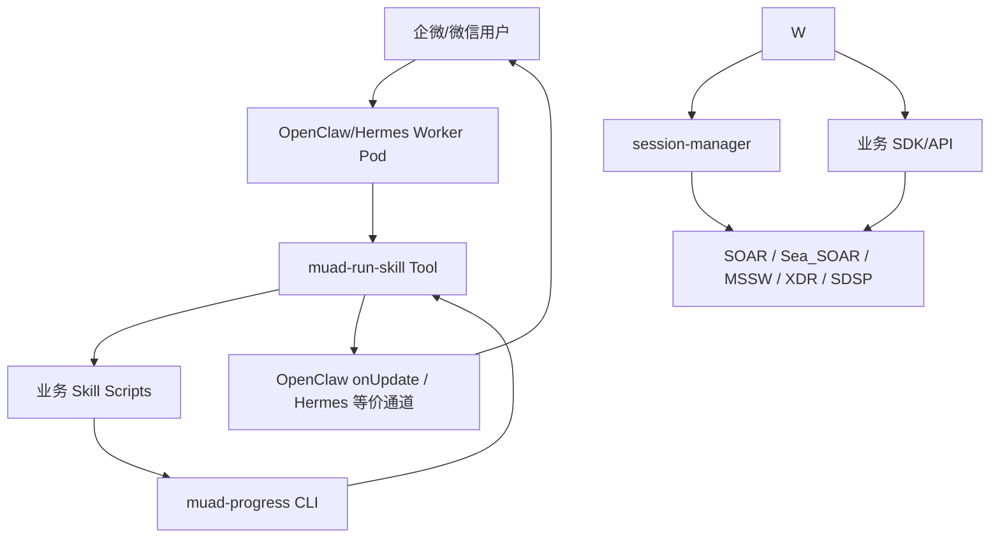
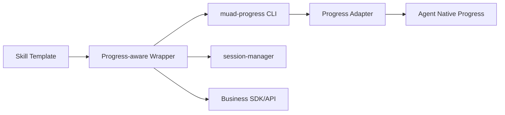

# Skill 长耗时进度反馈规范与 muad-run-skill 设计文档

> **文档编号**: MOD-SKILL-PROGRESS-01
> **文档版本**: v0.1
> **创建日期**: 2026-07-08
> **文档状态**: 草稿

**评审边界说明**:
- **需求评审**: 第 2 章锁定用户体验、skill 编写规范与范围边界。
- **设计评审**: 第 3-4 章锁定 `muad-progress` CLI、Agent adapter、模板与校验方案。
- **交接契约**: 第 2.5、3.4 定义可验收行为与接口契约。

**ID 体系**: US（用户故事）、FEAT（功能）、API（接口）、RULE（规则）、TC（测试用例）、RISK（风险）、NFR（非功能指标）

---

## 1. 文档控制

### 1.1 责任人

| 角色 | 姓名 | 职责范围 |
|------|------|---------|
| 产品经理 | | 用户体验、验收标准 |
| 开发负责人 | | CLI、adapter、skill 模板与测试 |
| 架构负责人 | | OpenClaw/Hermes 兼容与部署形态 |
| 运维负责人 | | K8s 镜像、挂载、发布与回滚 |

### 1.2 修订历史

| 版本 | 日期 | 作者 | 变更描述 |
|------|------|------|---------|
| v0.1 | 2026-07-08 | Codex | 初始设计草稿，沉淀 skill 进度反馈规范与 `muad-progress` CLI 方案 |
| v0.2 | 2026-07-09 | Codex | 根据微信/企微实测结果，将 OpenClaw 对接从 no-op adapter 调整为 `muad-run-skill` runner/tool 方案 |

---

## 2. 需求分析

### 2.1 需求概述

| 项目 | 内容 |
|------|------|
| 模块名称 | Skill 长耗时进度反馈规范与 `muad-run-skill` |
| 模块ID | MOD-SKILL-PROGRESS-01 |
| 所属系统 | muad-openclaw 集中化部署平台 |
| 需求类型 | 新功能 / 架构规范 |
| 业务背景 | 用户在企业微信或微信触发业务 skill 后，部分业务 SDK / 平台操作执行时间较长。当前如果 skill 裸调 SDK，用户只能等待最终结果，容易误以为 Agent 卡住或失败。 |
| 核心目标 | 建立 `muad-run-skill` 统一执行边界和语言无关的 `muad-progress` CLI，使 TS、Python、Shell、Go 等不同语言编写的 script skill 都能在 OpenClaw 当前会话上下文内稳定上报用户可见进度。 |

### 2.2 痛点与价值

| 维度 | 内容 |
|------|------|
| 目标用户 | 企业微信内部用户、微信外部客户、业务 skill 开发者、平台管理员。 |
| 当前问题 | OpenClaw 具备 tool `onUpdate` 等进度承接能力，但业务 skill 通过 `exec` 启动脚本后会进入子进程边界；子进程里的 `muad-progress` 不持有微信/企微会话上下文。旧 adapter 只能记录本地事件，无法稳定投递独立进度。 |
| 业务影响 | 长耗时指令缺少过程反馈，用户会重复追问、误判失败或转人工；外部客户侧体验尤其敏感。 |
| 预期价值 | 用户发起长任务后能快速收到“已受理”和关键阶段反馈；开发者通过 manifest + CLI 即可接入，不需要每个 skill 单独注册 OpenClaw tool。 |

**用户故事**

| 编号 | 用户故事 | 优先级 |
|------|---------|--------|
| US-01 | 作为内部用户，我希望在企微触发长耗时任务后能看到关键进度，以便确认任务仍在执行。 | P0 |
| US-02 | 作为外部客户，我希望在微信请求处理较慢时收到克制、清晰的状态反馈，而不是长时间无响应。 | P0 |
| US-03 | 作为 skill 开发者，我希望无论使用 TS、Python 还是 Shell，都能用统一入口上报进度。 | P0 |
| US-04 | 作为平台管理员，我希望通过模板、规范和 CI 限制不同开发者的实现差异。 | P0 |
| US-05 | 作为架构负责人，我希望底层 Agent 从 OpenClaw 切换到 Hermes 时，不需要重写所有业务 skill。 | P0 |

### 2.3 功能方案

#### 2.3.1 功能清单

| 功能ID | 功能名称 | 功能描述 | 优先级 | 来源 |
|--------|---------|---------|--------|------|
| FEAT-01 | `muad-progress` CLI | 提供语言无关的进度上报入口，支持 `stage`、`done`、`error` 等子命令。 | P0 | US-01, US-02, US-03 |
| FEAT-02 | `muad-run-skill` OpenClaw runner | 注册通用 `muad_run_skill` tool，读取 `muad.skill.json`，执行 steps/entrypoint，接收 `muad-progress` 事件并通过 OpenClaw `onUpdate` 发出进度。 | P0 | US-01, US-02, US-03 |
| FEAT-03 | Skill 编写规范 | 定义长耗时 skill 的阶段拆分、文案、安全边界、频率控制和异常反馈要求。 | P0 | US-03, US-04 |
| FEAT-04 | Skill 模板 | 提供 TS / Python / Shell 通用模板，默认接入 `muad-progress` 与 session-manager。 | P0 | US-03, US-04 |
| FEAT-05 | 运行时兜底 | 自动首条反馈、无进度心跳、节流、去重、敏感信息过滤和超时兜底。 | P0 | US-01, US-02 |
| FEAT-06 | CI / 静态检查 | 检查长耗时或业务系统 skill 是否接入进度、是否绕过 session-manager、是否暴露敏感字段。 | P1 | US-04 |
| FEAT-07 | 可观测性 | 记录脱敏进度事件、阶段耗时、超时和失败原因，用于问题定位。 | P1 | US-04 |

#### 2.3.2 字段约束

**进度事件字段**

| 字段名 | 字段类型 | 必填 | 约束 | 说明 |
|--------|---------|------|------|------|
| `type` | string | 是 | `progress` / `done` / `error` | 事件类型 |
| `skill` | string | 否 | kebab-case，未传时由环境变量或工作目录推断 | skill 名称 |
| `stage` | string | `progress` 时是 | `accepted` / `auth` / `query` / `analysis` / `action` / `done` / 自定义 | 阶段标识 |
| `text` | string | 是 | 用户可见，长度建议 <= 80 中文字符 | 展示文案 |
| `id` | string | 否 | 同一任务内稳定 | 用于去重和覆盖同一阶段 |
| `visibility` | string | 否 | 默认 `channel` | 是否对用户可见 |
| `privacy` | string | 否 | 默认 `public` | 禁止输出敏感内容 |
| `ts` | string | 否 | ISO8601 | 事件时间 |

### 2.4 范围与边界

| 类别 | 内容 |
|------|------|
| 范围（In Scope） | 设计 `muad-run-skill` runner/tool；设计 `muad-progress` CLI；定义 script skill manifest、steps/entrypoint 进度规范；定义模板、CI 检查与运行时兜底策略。 |
| 非范围（Out of Scope） | 不实现独立 Progress Reporter 服务；不要求一次性提供 TS/Python/Go 三套完整 SDK；不要求自动识别黑盒 SDK 内部真实进度；不改造所有历史 skill。 |
| 前置假设 | OpenClaw tool `execute` 支持 `onUpdate`；Hermes 后续可提供等价 plugin/tool 进度通道；worker Pod 可安装 `muad-progress` 二进制和 `muad-run-skill` 插件。 |
| 有意妥协 / 技术债 | P0 只提供 CLI 与模板，TS/Python helper 作为薄封装后续按使用量补充；黑盒 SDK 只能上报 wrapper 层阶段，无法保证真实内部百分比。 |

### 2.5 验收条件

#### 2.5.1 业务规则与约束

| ID | 类型 | 描述 |
|----|------|------|
| RULE-01 | 系统约束 | 所有长耗时 script skill 必须声明 `muad.skill.json` 并通过 `muad_run_skill` 执行；steps 模式由 runner 自动上报阶段，entrypoint 模式通过 `muad-progress` 上报关键阶段。 |
| RULE-02 | 系统约束 | `muad-progress` 是 worker / skill runtime 能力，不归属 Console 后端；Console 只负责配置、镜像构建、挂载和运维入口。 |
| RULE-03 | 安全规则 | 进度文案不得包含 Cookie、token、密码、内部 URL、SQL、堆栈、原始 SDK 错误详情。 |
| RULE-04 | 体验规则 | 首次可见反馈应在 1-2 秒内出现；后续同一会话进度应节流和去重，避免企微/微信刷屏。 |
| RULE-05 | 兼容规则 | 业务 skill 调用 `muad-progress` CLI 或薄封装，不直接依赖 OpenClaw/Hermes 私有 API；OpenClaw 私有上下文只由 `muad-run-skill` 插件持有。 |
| RULE-06 | 登录态规则 | 涉及业务系统登录态时，进度阶段中应体现 session-manager 相关状态，但登录态获取仍由 session-manager 负责。 |

#### 2.5.2 功能验收场景

**正常场景**

| 场景ID | 功能ID | 优先级 | 前置条件 | 操作步骤 | 预期结果 |
|--------|--------|--------|---------|---------|---------|
| S-01 | FEAT-01, FEAT-02 | P0 | OpenClaw worker 中安装 `muad-progress` 和 `muad-run-skill` | `/skill example-long-task` 路由到 `muad_run_skill` | OpenClaw 侧产生 accepted/auth/query/analysis/done tool progress，企微/微信可展示对应进度。 |
| S-02 | FEAT-03, FEAT-04 | P0 | 新建业务 skill | 使用模板创建 Python skill 并调用 `muad-progress` | 不需要 Python SDK 即可完成进度上报。 |
| S-03 | FEAT-05 | P0 | skill 执行超过 8 秒且未主动上报新阶段 | 运行时兜底触发 | 用户收到“仍在处理中”类克制提示，且不会高频重复。 |
| S-04 | FEAT-02 | P0 | OpenClaw 与 Hermes 均部署 adapter | 同一 skill 分别在两种 Agent 下执行 | skill 侧调用方式不变，进度事件均可被用户看到。 |
| S-05 | FEAT-05 | P0 | 同一阶段重复上报 5 次 | 执行长任务 | 用户侧只看到去重后的阶段更新，不刷屏。 |

**异常场景**

| 场景ID | 功能ID | 触发条件 | 系统行为 | 用户感知 |
|--------|--------|---------|---------|---------|
| E-01 | FEAT-01 | CLI 参数缺失或非法 | 返回非 0 退出码，stderr 输出机器可识别错误；不发送脏进度 | skill 可捕获错误并继续或失败。 |
| E-02 | FEAT-05 | 进度文案包含疑似敏感字段 | 本地过滤或拒绝上报，记录脱敏日志 | 用户不会看到敏感信息。 |
| E-03 | FEAT-02 | Agent adapter 不可用 | CLI 降级写本地事件日志并返回可配置退出码 | 用户可能只看到兜底消息，运维可排查。 |
| E-04 | FEAT-05 | 业务 SDK 超时 | wrapper 上报 error 阶段并终止或返回结构化失败 | 用户看到明确失败点，而不是无限等待。 |
| E-05 | FEAT-06 | CI 发现长耗时 skill 未调用 `muad-progress` | 阻断合入或标记失败 | 开发者按规范补充进度。 |

**边界场景**

| 场景ID | 字段/条件 | 边界值 | 预期行为 |
|--------|----------|--------|---------|
| B-01 | 进度文案长度 | > 80 中文字符 | 自动截断或拒绝，避免渠道消息过长。 |
| B-02 | 高频上报 | 1 秒内多次同阶段 | 合并或丢弃重复事件。 |
| B-03 | 多语言 skill | TS / Python / Shell / Go | 均可通过 CLI 接入，不强制 SDK。 |

#### 2.5.3 非功能指标

| 指标ID | 指标名称 | 目标值 | 测量方法 |
|--------|---------|-------|---------|
| NFR-PERF-01 | CLI 单次上报本地开销 | 不设硬指标，要求不阻塞业务主流程；adapter 不可用时快速降级 | 单元测试 + 集成测试观测 |
| NFR-REL-01 | 进度上报可靠性 | 进度失败不影响业务 SDK 主流程，最终结果仍可返回 | 故障注入测试 |
| NFR-SEC-01 | 敏感信息保护 | Cookie/token/password 等敏感字段不得出现在用户可见进度与普通日志中 | 单元测试 + 静态扫描 |

---

## 3. 技术设计

### 3.1 方案选型

#### 3.1.1 备选方案对比

| 对比维度 | 权重 | 方案A：独立 Progress Reporter 服务 | 得分 | 方案B：多语言完整 SDK | 得分 | 方案C：CLI 协议 + 薄 adapter（采纳） | 得分 |
|---------|------|------------------------------------|------|----------------------|------|--------------------------------------|------|
| 功能完备性 | 30% | 能统一收口，但链路重 | 3 | 语言体验好，但覆盖成本高 | 4 | 覆盖所有语言，满足核心诉求 | 4 |
| 性能预期 | 20% | 多一次网络调用 | 2 | 本地调用，性能好 | 4 | 本地进程/管道，开销可控 | 4 |
| 实现复杂度 | 20% | 需服务、鉴权、存储、HA | 2 | 需维护多套包 | 2 | 一个 CLI + adapter，复杂度最低 | 5 |
| 维护成本 | 20% | 运维成本高 | 2 | 多语言版本维护成本高 | 2 | 协议稳定，后续 helper 可选 | 5 |
| 风险评估 | 10% | 新服务稳定性风险 | 2 | SDK 版本分裂风险 | 3 | CLI 分发和上下文注入需治理 | 4 |
| 最终得分 | 100% |  | 2.35 |  | 3.05 |  | 4.35 |

#### 3.1.2 关键决策记录

| 决策点 | 选择 | 被否决项 | 理由 | 可逆性 |
|--------|------|---------|------|--------|
| 进度入口 | `muad-progress` CLI | 独立服务 / 三套 SDK 起步 | CLI 语言无关，最小成本覆盖 TS、Python、Shell、Go。 | 易，后续可增加 SDK 包装 CLI |
| CLI 实现语言 | Go | Node.js / Python / Rust | Go 可编译为无运行时依赖的单二进制，跨 Linux amd64/arm64 与 macOS 开发环境分发简单；启动开销和内存占用低于 Node/Python 脚本；项目已有 Go 工程与测试体系。 | 中，协议稳定时可重写实现 |
| 代码归属 | 独立 worker runtime / tools 目录 | `console/cli` | Console 是控制面；`muad-progress` 在用户 worker 内被 skill 调用，生命周期和职责不属于 Console。 | 中，目录可迁移但影响镜像构建 |
| Agent 对接 | OpenClaw 先通过 `muad-run-skill` tool + `onUpdate` 对接；Hermes 后续实现等价 runner bridge | skill 直接调用 Agent 私有 API / no-op adapter | 进度投递必须发生在 Agent 会话上下文内，不能由子进程独立猜测 channel 目标。 | 中 |
| 进度策略 | 阶段化 + 节流 + 去重 | 百分比进度 | 多数 SDK 无真实百分比，阶段化更可信。 | 易 |
| 开发约束 | 模板 + CI + runtime 兜底 | 仅写文档规范 | 不同开发者仅靠自觉无法稳定执行。 | 易 |

#### 3.1.3 技术栈

| 类别 | 选型 | 版本 | 选型理由 |
|------|------|------|---------|
| CLI 语言 | Go | 与仓库 Go toolchain 对齐 | 单二进制、无 Node/Python 运行时依赖，适合放入 worker 镜像和 K8s init/sidecar 环境；生产目标为 Linux amd64/arm64，开发调试支持 macOS。 |
| 协议 | CLI flags + JSON stdout / stderr | v1 | 人可读与机器可读兼顾。 |
| OpenClaw adapter | TypeScript 薄 adapter | 与 OpenClaw 版本一致 | OpenClaw runtime 为 TS/Node，adapter 只负责把 Go CLI 事件转成现有 `emitToolProgress` / `onUpdate`。 |
| Hermes adapter | Python 薄 adapter | 与 Hermes 版本一致 | Hermes plugin 机制为 Python，adapter 只负责注册 tool / 接收 CLI 事件，不复制核心逻辑。 |
| 存储 | State PVC 本地事件日志（可选） | - | adapter 不可用时排障，不作为用户进度主链路。 |

#### 3.1.4 跨平台与性能结论

`muad-progress` 主体确定使用 Go 实现，不使用 Node.js 或 Python 作为 CLI 主体。

理由：

- **跨平台分发**：Go 可产出 Linux amd64、Linux arm64、macOS arm64/amd64 单二进制，适合 K8s worker 镜像和开发机调试。
- **运行时依赖少**：业务 skill 可能由 TS、Python、Shell、Go 编写，CLI 不能反向要求所有环境安装某个语言包管理器或解释器。
- **启动开销低**：进度上报会在长任务过程中多次触发，Go 单二进制启动和内存开销更可控。
- **工程一致性**：当前 Console backend 已是 Go，仓库具备 Go 测试、构建和代码规范基础。
- **Agent 解耦**：OpenClaw adapter 仍用 TypeScript，Hermes adapter 仍用 Python；它们只是薄适配层，不影响 CLI 主体跨平台。

生产支持矩阵：

| 平台 | 架构 | 支持级别 | 用途 |
|------|------|---------|------|
| Linux | amd64 | P0 | K8s / Docker worker 生产运行 |
| Linux | arm64 | P0 | ARM 节点或本地容器运行 |
| macOS | arm64 / amd64 | P1 | 开发调试 |
| Windows | amd64 | P2 | 非生产，可后续按需要补充 |

### 3.2 架构设计



#### 3.2.1 技术分层



#### 3.2.2 最终目录约定

`muad-progress` 不放到 `console/` 下，也不新增 `runtime/` 顶层目录。最终采用 `tools/` 承载运行时工具与 Agent 适配器，`skills/_templates/` 承载 skill 模板：

```text
tools/
  muad-progress/                   # Go CLI 主体
    cmd/
      muad-progress/
    internal/
    testdata/
    README.md
  muad-run-skill/                  # OpenClaw runner/tool 插件
    openclaw.plugin.json
    src/
      index.mjs                    # 注册 muad_run_skill
      manifest.mjs                 # 读取 muad.skill.json
      runner.mjs                   # 执行 steps/entrypoint

skills/
  _templates/                      # skill 开发模板
    business-skill-ts/
    business-skill-python/
    business-skill-shell/
```

目录职责：

| 目录 | 职责 | 说明 |
|------|------|------|
| `tools/muad-progress/` | Go CLI 主体 | 产出 `/usr/local/bin/muad-progress`，被所有语言的 skill 调用。 |
| `tools/progress-adapters/openclaw/` | OpenClaw adapter | 只做 OpenClaw `onUpdate` / `emitToolProgress` 适配，不放业务逻辑。 |
| `tools/progress-adapters/hermes/` | Hermes adapter | 只做 Hermes plugin/tool 适配，不放业务逻辑。 |
| `skills/_templates/` | skill 模板 | 约束 TS / Python / Shell skill 的接入方式和默认阶段。 |
| `console/` | 控制面 | 不放 CLI 主体、不放 adapter、不放模板；后续仅可增加配置、发布、查看等管理能力。 |

Console 的职责边界：

| 模块 | 是否放在 Console 下 | 说明 |
|------|-------------------|------|
| `muad-progress` CLI | 否 | 在 worker Pod 内被 skill 调用，不是 Console 管理 API。 |
| OpenClaw/Hermes adapter | 否 | 属于 Agent runtime 适配层。 |
| skill 模板 | 否 | 属于共享 skill 开发资产。 |
| 配置项展示 / 发布按钮 | 可选 | 如果后续要在 Console 中管理 public skill 发布，可增加 UI/API。 |
| 镜像构建 / K8s 挂载配置 | 可关联 | Console 部署配置可引用 CLI 路径和 public skills PVC。 |

#### 3.2.3 外部依赖清单

| 外部系统 | 依赖类型 | 协议 | 超时 | 降级策略 |
|---------|---------|------|------|---------|
| OpenClaw progress 通道 | Agent 进度事件 | 进程内 callback / tool update | 不阻塞主流程 | adapter 不可用时写本地日志，业务继续执行 |
| Hermes plugin/tool | Agent 进度事件 | plugin API | 不阻塞主流程 | 同上 |
| 企业微信 / 微信 | 用户消息通道 | OpenClaw channel | 按渠道能力 | 不能编辑消息时采用低频追加消息 |
| session-manager | 登录态阶段来源 | CLI/tool | 业务配置 | 登录态失败时上报结构化 error 阶段 |

### 3.3 数据设计

本设计 P0 不新增数据库表。进度事件是运行时瞬态信息，主链路通过 Agent progress 通道发送，不落 Console DB。

可选本地诊断日志：

```text
/home/node/.muad/progress-events.jsonl
```

| 字段名 | 类型 | 可空 | 默认值 | 索引 | 说明 |
|--------|------|------|--------|------|------|
| `ts` | string | N | 当前时间 | - | ISO8601 时间 |
| `skill` | string | Y | - | - | skill 名称 |
| `stage` | string | Y | - | - | 阶段 |
| `type` | string | N | - | - | progress / done / error |
| `text` | string | N | - | - | 已脱敏文案 |
| `delivery` | string | N | - | - | sent / dropped / adapter_unavailable |

### 3.4 接口设计

#### 3.4.1 CLI 命令

| 命令 | 参数 / Flag | 说明 | 退出码 |
|------|------------|------|--------|
| `muad-progress stage` | `--stage <id>`、`--text <text>`、`--skill <name>`、`--id <id>`、`--json` | 上报执行阶段 | 0=已接受；2=参数错误；3=敏感信息拒绝；4=adapter 不可用且配置为严格模式 |
| `muad-progress done` | `--text <text>`、`--skill <name>`、`--id <id>`、`--json` | 上报完成阶段 | 同上 |
| `muad-progress error` | `--stage <id>`、`--text <text>`、`--code <code>`、`--skill <name>`、`--json` | 上报用户可理解错误 | 同上 |
| `muad-progress heartbeat` | `--text <text>`、`--interval-ms <ms>`、`--max-count <n>` | 长任务无阶段时的低频兜底 | 同上 |
| `muad-progress validate` | `--file <path>` 或 stdin | 校验进度文案与事件 JSON | 0=通过；非 0=不通过 |

stdout / stderr 约定：

- `--json` 时 stdout 输出机器可读 JSON。
- 非 `--json` 时 stdout 可输出简短结果。
- 参数错误、敏感信息拒绝、adapter 不可用等错误写 stderr。
- 默认模式下 adapter 不可用不应中断业务 SDK 主流程；严格模式由环境变量控制。

示例：

```bash
muad-progress stage --stage auth --text "正在检查 XDR 登录态"
muad-progress stage --stage query --text "正在查询 XDR 告警数据"
muad-progress done --text "处理完成，正在生成结果"
```

JSON 输出示例：

```json
{
  "ok": true,
  "event": {
    "type": "progress",
    "skill": "xdr-alert",
    "stage": "query",
    "text": "正在查询 XDR 告警数据",
    "delivery": "sent"
  }
}
```

#### 3.4.2 函数 / 库接口（P1 薄封装）

TS / Python helper 不是 P0 必需项。后续如高频使用，可以只封装 CLI：

| 函数签名 | 入参 | 返回 | 错误处理 |
|---------|------|------|---------|
| `progress.stage(stage: string, text: string, options?: ProgressOptions)` | 阶段、文案、可选 skill/id | `ProgressResult` | 默认吞掉非致命错误并记录日志 |
| `progress.done(text: string, options?: ProgressOptions)` | 完成文案 | `ProgressResult` | 同上 |
| `progress.error(stage: string, text: string, code?: string)` | 阶段、错误文案、错误码 | `ProgressResult` | 同上 |

### 3.5 质量实现方案

#### 3.5.1 性能设计

| 指标ID | 热点路径 | 目标值 | 实现方案（含被放弃的较慢方案） |
|--------|---------|-------|------------------------------|
| NFR-PERF-01 | skill 高频阶段上报 | 不阻塞业务主流程 | 采用本地 CLI + adapter 快速投递；放弃独立服务网络调用，避免长任务中每次进度都产生额外网络依赖。 |
| NFR-PERF-02 | 企微/微信消息发送 | 避免刷屏 | adapter 做节流和去重；放弃每个 SDK callback 都发送消息的朴素方案。 |

#### 3.5.2 可靠性设计

| 风险ID | 失效模式 | 影响 | 应对措施 |
|--------|---------|------|---------|
| RISK-01 | adapter 不可用 | 用户看不到阶段进度 | CLI 写本地诊断日志；业务主流程默认继续；最终结果仍由 Agent 返回。 |
| RISK-02 | skill 忘记上报进度 | 用户仍感知卡住 | 模板默认接入；CI 扫描；runtime 超时兜底发送“仍在处理”。 |
| RISK-03 | 黑盒 SDK 不提供阶段 callback | 只能显示 wrapper 阶段 | 要求 wrapper 拆分登录态、查询、分析、写回等外层阶段；不承诺真实百分比。 |
| RISK-04 | 进度消息过多 | 微信/企微刷屏 | 同阶段去重、最小间隔、最大条数、最终结果优先。 |
| RISK-05 | OpenClaw/Hermes progress 能力差异 | Agent 切换体验不一致 | skill 只依赖 CLI 协议；adapter 分别适配底层能力，不把差异暴露给 skill。 |

#### 3.5.3 安全性设计

| 指标ID | 验收标准 | 实现方案 |
|--------|---------|---------|
| NFR-SEC-01 | 用户可见进度不含敏感信息 | 内置敏感词与模式过滤：Cookie、token、password、authorization、内部 URL、SQL、stack trace 等。 |
| NFR-SEC-02 | 进度事件不跨用户 | CLI 只在当前 worker Pod 内投递，状态与日志写当前用户 State PVC。 |
| NFR-SEC-03 | 业务错误脱敏 | SDK 原始异常先映射为用户可理解错误码和文案，再上报。 |

#### 3.5.4 可观测性设计

| 场景 | 实现方案 |
|------|---------|
| 阶段耗时 | adapter 记录 skill、stage、duration、delivery 结果，日志脱敏。 |
| 失败定位 | 记录 `adapter_unavailable`、`sensitive_rejected`、`throttled`、`delivered` 等状态。 |
| 用户体验排查 | 可按会话查看最近进度事件，不记录敏感正文。 |

---

## 4. 部署与运维

### 4.1 部署架构

| 环境 | 配置 | 实例数 | 用途 |
|------|------|--------|------|
| dev | worker 镜像内置 `muad-progress`，public skills 本地挂载 | 1 | 开发调试 |
| prod | worker 镜像内置 CLI + adapter，public skills PVC 只读挂载 | 每用户 1 Pod | 100 用户集中化部署 |

推荐发布位置：

```text
/usr/local/bin/muad-progress          # worker 镜像内 CLI
/opt/muad/progress-adapters/          # Agent adapter
/opt/openclaw-skills/_templates/      # skill 模板，可选
```

### 4.2 发布与回滚

| 阶段 | 范围 | 进入条件 | 回滚条件 |
|------|------|---------|---------|
| PoC | 1-2 个业务 skill | CLI 可在 OpenClaw worker 内发送 progress | 影响最终回复或敏感信息过滤失败 |
| 灰度 | XDR / SOAR 等 1-2 个核心 skill | PoC 验收通过 | 用户反馈刷屏、进度丢失或失败率异常 |
| 全量 | 所有新增长耗时业务 skill | 模板和 CI 可用 | CI 误拦截大面积影响开发 |

回滚策略：

- CLI 回滚：回退 worker 镜像或 `/usr/local/bin/muad-progress` 版本。
- adapter 回滚：回退 adapter 目录或插件版本。
- skill 规范回滚：保留 CLI，临时关闭 CI 强制项，仅保留 warning。

### 4.3 监控告警

| 指标 | 阈值 | 级别 | 处理SLA |
|------|------|------|---------|
| adapter 投递失败率 | 待灰度后确定 | P2 | 工作时间响应 |
| 敏感信息拒绝次数 | > 0 需关注 | P1 | 当日确认 |
| skill 无进度兜底触发次数 | 持续升高 | P2 | 分析是否有 skill 未按规范接入 |
| 进度消息节流次数 | 持续升高 | P3 | 优化 skill 上报频率 |

### 4.4 数据迁移

不涉及数据库迁移。

---

## 5. 风险与依赖

### 5.1 项目依赖

| 依赖模块/团队 | 依赖内容 | 状态 | 风险等级 |
|-------------|---------|------|---------|
| OpenClaw runtime | `onUpdate` / `emitToolProgress` / channel progress 能力 | 已调研 | 中 |
| Hermes runtime | plugin/tool 进度承接能力 | 已调研基础能力，需实测进度展示 | 中 |
| 业务 skill 团队 | 按模板拆分阶段并调用 CLI | 待落地 | 高 |
| 运维 / 镜像构建 | worker 镜像内置 CLI 与 adapter | 待落地 | 中 |

### 5.2 风险识别

| 风险ID | 类型 | 描述 | 概率 | 影响 | 应对措施 |
|--------|------|------|------|------|---------|
| RISK-01 | 架构 | 把 CLI 放到 Console 下导致职责混乱，worker 使用困难 | 中 | 中 | 明确 CLI 属于 worker runtime；Console 只管理配置和发布。 |
| RISK-02 | 体验 | 不同 skill 阶段命名和文案差异过大 | 高 | 中 | 模板内置标准阶段；CI 检查；review checklist。 |
| RISK-03 | 安全 | 开发者把 SDK 错误原文直接发给用户 | 中 | 高 | 敏感信息过滤 + `safeError` 规范 + 测试。 |
| RISK-04 | 兼容 | Hermes 进度事件展示能力弱于 OpenClaw | 中 | 中 | adapter 降级为低频普通消息；skill 协议不变。 |
| RISK-05 | 维护 | 后续 helper 与 CLI 协议不一致 | 中 | 中 | helper 只包装 CLI，不复制协议逻辑。 |

---

## 6. 需求追溯矩阵

| 用户故事 | 功能ID | 接口ID | 测试用例ID | 状态 |
|---------|--------|--------|-----------|------|
| US-01 | FEAT-01, FEAT-02, FEAT-05 | CLI-01 | S-01, S-03, S-05 | 草稿 |
| US-02 | FEAT-01, FEAT-02, FEAT-05 | CLI-01 | S-01, S-03, E-04 | 草稿 |
| US-03 | FEAT-01, FEAT-03, FEAT-04 | CLI-01, LIB-01 | S-02, B-03 | 草稿 |
| US-04 | FEAT-03, FEAT-04, FEAT-06 | CLI-01 | S-02, E-05 | 草稿 |
| US-05 | FEAT-02 | CLI-01 | S-04 | 草稿 |

---

## 附录：术语表

| 术语 | 定义 |
|------|------|
| `muad-progress` | worker Pod 内的语言无关进度上报 CLI。 |
| Progress adapter | 将 `muad-progress` 事件转换为 OpenClaw/Hermes 原生进度事件的薄适配层。 |
| Progress-aware wrapper | 业务 skill 中包裹 SDK/API 调用的执行层，负责拆分阶段、调用 session-manager 和上报进度。 |
| 长耗时 skill | 执行时间可能超过用户自然等待阈值的业务 skill，通常包括登录态准备、业务系统查询、分析、写回等步骤。 |
| session-manager | 业务系统登录态管理能力，负责 Cookie/storageState 获取、复用和刷新。 |

---

*文档结束*
