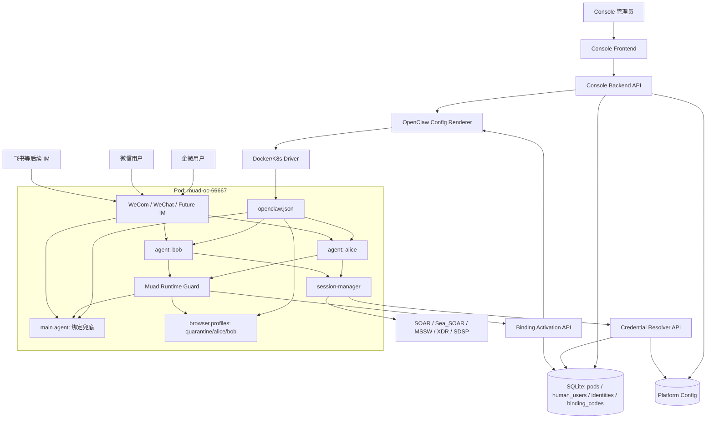
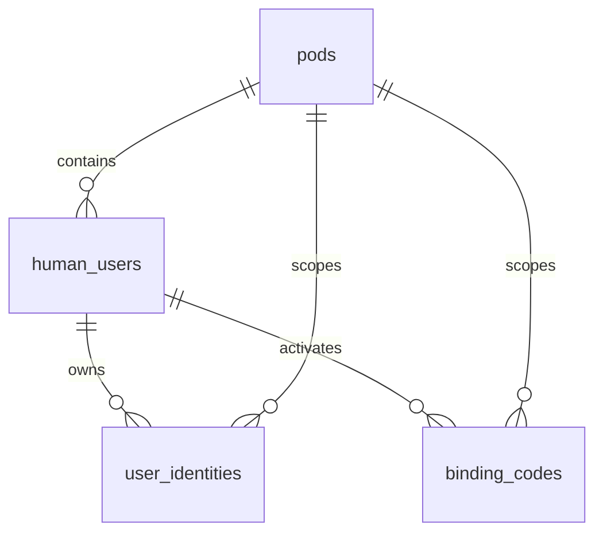

# Multi-User Single-Pod Console 设计文档

> 文档编号: MOD-MUSP-v1  
> 文档版本: v0.2  
> 创建日期: 2026-07-10  
> 文档状态: 设计评审中  
> 输入来源: `docs/multi-user-single-pod.md` v3、实机验证结论、会话内已对齐决策

## 1. 文档控制

### 1.1 责任人

| 角色 | 姓名 | 职责范围 |
|------|------|---------|
| 产品/架构 | 待定 | 多用户管理旅程、方案边界确认 |
| 后端 | 待定 | SQLite schema、API、配置渲染、Pod 配置应用 |
| 前端 | 待定 | Console 管理界面、用户/身份/绑定码流程 |
| 测试 | 待定 | API、配置生成、端到端 IM 验证 |

### 1.2 修订历史

| 版本 | 日期 | 作者 | 变更描述 |
|------|------|------|---------|
| v0.1 | 2026-07-10 | Codex | 基于最新多用户单 Pod 方案生成初版设计 |
| v0.2 | 2026-07-10 | Codex | 修正安全边界、数据约束、确定性绑定、Browser Profile 强制隔离、session-manager 接入、配置调和与生命周期设计 |

## 2. 需求分析

### 2.1 需求概述

| 项目 | 内容 |
|------|------|
| 模块名称 | Multi-User Single-Pod Console |
| 模块ID | MOD-MUSP |
| 所属系统 | muad-openclaw Console + OpenClaw Pod Runtime + session-manager |
| 需求类型 | 新功能 + 技术重构 |
| 业务背景 | 当前 Console 以“一个用户一个 Pod”为核心模型，资源消耗高。实机验证已确认 OpenClaw 可以通过 `agents.list`、`bindings`、`identityLinks` 支持企微私聊多人共享单 Pod，并支持同一用户跨 IM 共享 agent workspace 记忆。同时业务 skill 需要使用用户在 SOAR、Sea_SOAR、MSSW、XDR、SDSP 等平台颁发的 API key 获取登录态或直接调用平台能力。 |
| 核心目标 | 让管理员可以在 Console 中把多个自然人分配到同一个 Pod，每个自然人拥有独立 agent/workspace/browser profile/IM identities，并能为同一自然人配置多个业务平台 API key；业务 skill 通过 session-manager 只拿到当前用户对应平台的凭证/登录态。 |

### 2.2 痛点与价值

| 维度 | 内容 |
|------|------|
| 目标用户 | Console 管理员；通过企微、微信、后续飞书等 IM 使用 OpenClaw 的内部用户或客户 |
| 当前问题 | 当前 `users` 表实质表示 Pod/容器，未区分自然人、IM 身份、agent、browser profile，也没有表达“用户在多个业务平台分别持有 API key”的关系 |
| 业务影响 | 无法按“一个机器人/一个 Pod 服务多个用户”的方式控制资源上限、用户归属、身份绑定、跨 IM 记忆共享和业务平台访问权限 |
| 预期价值 | 降低 Pod 数量；管理员可以按 Pod 容量提前分配用户；同一自然人的多个 IM 入口可路由到同一个 agent/workspace；业务 skill 能按当前用户和目标平台自动选用正确 API key |

### 2.3 功能方案

#### 2.3.1 功能清单

| 功能ID | 功能名称 | 功能描述 | 优先级 |
|--------|---------|---------|--------|
| FEAT-01 | Pod 管理模型重建 | 将当前“user/container”模型重建为 Pod 容器资源，Pod 绑定机器人通道和容量上限 | P0 |
| FEAT-02 | Human User 管理 | 管理员在指定 Pod 下创建自然人用户，并为其分配 agent、workspace、browser profile | P0 |
| FEAT-03 | IM Identity 管理 | 每个自然人可绑定多个 IM 身份，身份在 Pod、通道账号和会话类型范围内唯一 | P0 |
| FEAT-04 | 绑定码激活 | 管理员无法提前拿到外部 ID 时，先创建 pending user 或为已有用户生成绑定码，由用户在指定 IM 中激活 | P0 |
| FEAT-05 | OpenClaw 多用户配置生成 | 根据 DB 生成 `agents.list`、`bindings`、`identityLinks`、`browser.profiles`、multi-provider model 配置 | P0 |
| FEAT-06 | Pod 配置应用 | 用户/身份/LLM/浏览器配置变化后，将新配置应用到目标 Pod 并重启或热更新 Gateway | P0 |
| FEAT-07 | 管理员新旅程 | 前端支持 Pod 详情、用户列表、身份列表、绑定码生成、容量提示、配置应用状态 | P0 |
| FEAT-08 | 业务平台配置 | 管理 SOAR、Sea_SOAR、MSSW、XDR、SDSP 等平台的最小配置，支持后续新增平台 | P0 |
| FEAT-09 | 用户平台 API Key 管理 | 同一 Human User 可配置多个平台 API key，直接以加密数组存放在用户记录中 | P0 |
| FEAT-10 | session-manager 凭证解析 | session-manager 按当前 Pod/agent/platform 解析当前用户的 API key，并生成或复用 Cookie/storageState | P0 |
| FEAT-11 | Pod Runtime Guard | 以外置 OpenClaw 插件实现确定性绑定、`main`/业务 agent 工具边界、文件路径限制和 Browser Profile 强制绑定，不修改上游源码 | P0 |

### 2.4 范围与边界

| 类别 | 内容 |
|------|------|
| 范围 | Console DB 全量重建；Pod/机器人管理；Human User/Identity/Binding Code 管理；业务平台轻量配置；用户平台 API key 管理；session-manager 凭证解析；OpenClaw 多用户配置注入；管理员 Console 页面改造；企微/微信私聊作为验证路径；飞书及后续 IM 复用通用 identity/account 模型接入 |
| 非范围 | 不做旧 DB 在线迁移；不做 Console active-active HA；不做全局 Message Router；不承诺群聊 per-user 强隔离；不 fork OpenClaw 上游代码；不修复上游 IM 插件自身重复回复/排序问题；P0 不允许用户上传或运行未经平台审核的可执行 Skill |
| 前置假设 | P0 运行单个 active Console 实例（SQLite + 进程内 apply queue/rate limiter）；管理员维护 Pod 与机器人绑定关系并把用户分配到指定 Pod/机器人；单 Pod 默认最多 10 个自然人业务用户；每个 Pod 有独立 `main` agent；所有可执行 Skill 均由平台团队开发、评审和发布，不存在恶意 Skill |
| 安全边界 | 同 Pod 多用户采用路由、配置和状态目录的逻辑隔离，用于防止误路由和误用凭证，不承诺抵御同 UID、同 Pod 内恶意代码的主动越权；未来若开放第三方/用户自定义可执行 Skill，必须重新引入进程沙箱或独立 Pod 隔离 |
| 有意妥协 | 开发阶段允许删除并重建 SQLite DB；群聊和不可信 Skill 暂不纳入；单 Pod 10 用户、浏览器/Skill 并发值及资源基线须通过压测确定，不能沿用单用户 Pod 的固定资源结论 |

### 2.5 验收条件

#### 2.5.1 业务规则与约束

| ID | 类型 | 描述 |
|----|------|------|
| RULE-01 | 业务规则 | Pod 与机器人通道绑定由管理员维护，不引入全局 Message Router |
| RULE-02 | 业务规则 | 一个业务 Human User 必须属于且只属于一个 Pod，使用该 Pod 对应机器人入口 |
| RULE-03 | 业务规则 | 每个 Pod 必须显式生成首个且 `default=true` 的 `main` agent；`main` 只用于未绑定用户兜底、确定性绑定码激活和绑定引导，不计入业务用户容量 |
| RULE-04 | 业务规则 | 单 Pod 默认最多 10 个 active/pending Human User，超过容量禁止创建 |
| RULE-05 | 业务规则 | 同一自然人的多个 IM identity 必须路由到同一个 `agent_id`，从而共享同一个 workspace 记忆 |
| RULE-06 | 系统约束 | `(pod_id, openclaw_channel, account_id, peer_kind, external_id)` 唯一，禁止同一机器人账号范围内的 IM 身份绑定到多个 Human User；不同机器人租户可能产生相同外部 ID，不做跨账号全局唯一 |
| RULE-07 | 系统约束 | 绑定码一次性使用，只存哈希并限定 `pod_id`、目标通道账号和 `human_user_id`；激活必须使用 OpenClaw 插件提供的可信消息上下文，过期、重放或发错 Pod 必须拒绝 |
| RULE-08 | 系统约束 | OpenClaw 配置写入必须符合 strict schema，不能写 `_comment` 或未知字段 |
| RULE-09 | 安全约束 | IM secret、LLM API key 等敏感字段继续加密存储，不在日志、文档或管理员 API 响应中明文返回；受 Pod token 保护的内部 Resolver 是向 session-manager 下发目标业务 API key 的唯一例外 |
| RULE-10 | 业务规则 | 业务平台 API key 属于 `human_user` 记录内的 `platform_credentials` 数组，不属于 IM identity；同一用户跨企微/微信/飞书共享同一组平台凭证 |
| RULE-11 | 系统约束 | session-manager 只能通过 service token 隐含的 Pod 和可信 `agent_id` 解析对应 Human User 的平台凭证，不能由调用方指定其他 Pod、枚举用户或读取其他用户 API key |
| RULE-12 | 安全约束 | 用户平台 API key 只加密存储在 Console DB；Pod 内不持久化明文 API key，只持久化 session-manager 生成的当前用户 Cookie/storageState |
| RULE-13 | 系统约束 | 业务 agent 调用 Browser 时，Runtime Guard 必须按可信 `agentId` 覆盖为该用户的固定 profile，拒绝跨 profile 操作；`main` 禁用 Browser、Skill、文件、Shell 和业务平台工具 |
| RULE-14 | 系统约束 | 平台凭证每次使用前必须向 Console 解析当前状态与指纹；平台禁用、凭证修改或删除后，不得继续复用旧 Cookie/storageState |
| RULE-15 | 系统约束 | Pod 配置采用期望代际与已应用代际调和；配置校验、原子替换、重启和健康检查全部成功后，才能标记该代际已应用 |
| RULE-16 | 安全约束 | 运行时逻辑隔离建立在“仅运行平台审核 Skill”的前提上；P0 不把用户自定义代码视为受支持输入 |
| RULE-17 | 安全约束 | 业务 agent 不暴露任意 Shell/Exec；脚本 Skill 统一通过 `muad-run-skill` 执行，文件工具固定 `workspaceOnly=true`，其他 agent 和运行时状态目录必须在可信工具策略中阻断 |

#### 2.5.2 功能验收场景

**正常场景**

| 场景ID | 功能ID | 优先级 | 前置条件 | 操作步骤 | 预期结果 |
|--------|--------|--------|---------|---------|---------|
| S-01 | FEAT-01 | P0 | Console DB 已重建 | 管理员创建 Pod `66667`，配置企微机器人和 maxUsers=10 | `pods` 表新增记录，Pod 可启动，OpenClaw 有 `main` agent |
| S-02 | FEAT-02/03 | P0 | Pod 有可用容量；管理员已知企微明文 userid | 管理员在 Pod 下创建 Alice，录入 `wecom:zhangsan` | Alice 状态为 active，生成 `agent_id`、workspace、browser profile、binding route |
| S-03 | FEAT-04/11 | P0 | 管理员无法提前拿到外部 ID | 管理员创建 Charlie 并生成企微绑定码；Charlie 向指定机器人发送 `/bind <code>` | Runtime Guard 直接使用可信 sender/channel/account 上下文激活；Charlie 变为 active，后续消息路由到 Charlie agent，过程不依赖模型是否调用工具 |
| S-04 | FEAT-04 | P0 | Alice 已存在 | 管理员在 Alice 详情页为飞书生成绑定码；Alice 在飞书机器人发送 `/bind <code>` | 新增 `feishu:<open_id>` identity，不新增 Human User，不新增 agent，飞书消息路由到 Alice agent |
| S-05 | FEAT-05/06 | P0 | Pod 下有 Alice/Bob/Charlie | 管理员点击应用配置或系统自动应用配置 | Pod 内 `openclaw.json` 包含对应 `agents.list`、`bindings`、`identityLinks`、`browser.profiles` |
| S-06 | FEAT-07 | P0 | Pod 有 9 个用户 | 管理员进入 Pod 详情页 | 页面显示容量 `9/10`，可继续创建 1 个用户 |
| S-07 | FEAT-08/09 | P0 | Alice 已创建 | 管理员为 Alice 配置 `xdr` 和 `mssw` 两个平台的 API key | 两条凭证加密保存，Alice 详情页显示平台已配置但不展示明文 key |
| S-08 | FEAT-10 | P0 | Alice 已绑定企微，已配置 XDR API key | Alice 从企微触发 XDR skill | session-manager 解析到 Alice 的 XDR key，生成/复用 Alice 私有 session-store，skill 正常执行 |
| S-09 | FEAT-10 | P0 | Alice 已同时绑定企微和微信，已配置 XDR API key | Alice 从微信触发同一个 XDR skill | 因微信 identity 路由到 Alice agent，session-manager 仍使用 Alice 的 XDR key 和 session-store |
| S-10 | FEAT-11 | P0 | Alice/Bob 位于同一 Pod | 两人同时触发 Browser 操作，且模型参数中省略或错误指定 profile | Runtime Guard 分别强制使用 Alice/Bob 的固定 profile，Cookie、标签页和 storageState 互不串用 |
| S-11 | FEAT-05/06 | P0 | 同一 DeepSeek 服务为 Alice/Charlie 配置不同 API key | 两个 agent 并发调用 LLM | 各 agent 使用其内部 provider alias 对应的 key，不发生 provider 配置覆盖或串用 |

**异常场景**

| 场景ID | 功能ID | 触发条件 | 系统行为 | 用户感知 |
|--------|--------|---------|---------|---------|
| E-01 | FEAT-02 | Pod 已有 10 个 active/pending 用户 | 拒绝创建新 Human User，返回容量错误 | 管理员看到“该 Pod 已满” |
| E-02 | FEAT-03 | 录入同一 Pod、机器人账号和 peer 范围内已绑定的 external ID | DB 唯一约束或服务层校验拒绝 | 管理员看到“该 IM 身份已绑定” |
| E-03 | FEAT-04 | 用户把绑定码发到错误 Pod/机器人 | 激活接口校验 `pod_id` 不匹配并拒绝 | IM 用户收到“请使用管理员分配的机器人完成绑定” |
| E-04 | FEAT-04 | 绑定码过期、已使用或不存在 | 不创建 identity，记录审计 | IM 用户收到绑定失败原因 |
| E-05 | FEAT-04 | 未绑定用户发送非绑定码消息 | 路由到该 Pod 的 `main` agent，只返回绑定/联系管理员引导 | 不进入任何业务 agent，不读取业务用户记忆 |
| E-06 | FEAT-10 | 用户触发某平台 skill，但未配置该平台 API key | session-manager 返回 `not_configured`，不继续调用业务平台 | 用户收到“当前账号未配置该平台凭证，请联系管理员” |
| E-07 | FEAT-09/10 | 平台 API key 已失效或校验失败 | session-manager 返回结构化错误，不继续复用旧 session cache | 用户收到平台凭证异常提示，并联系管理员更新 API key |
| E-08 | FEAT-11 | `main` 或业务 agent 尝试指定其他用户 Browser Profile | Runtime Guard 拒绝或覆盖参数并记录安全审计 | 用户不能访问其他 profile，管理员可定位拒绝原因 |
| E-09 | FEAT-06 | 新配置校验、重启或健康检查失败 | 保留上一份有效运行时配置，期望代际保持 pending/failed 并自动重试 | 管理员看到失败摘要，现有可用配置不被半成品覆盖 |
| E-10 | FEAT-11 | 业务 agent 尝试直接执行 Shell，或文件工具访问其他 agent 状态目录 | Trusted Tool Policy fail-closed 拒绝并记录安全审计 | 请求被明确拒绝，不泄露其他用户文件内容 |

**边界场景**

| 场景ID | 字段/条件 | 边界值 | 预期行为 |
|--------|----------|--------|---------|
| B-01 | `agent_id` | 不符合小写安全命名规则、与 Pod 内已有 agent 重名或为保留值 `main`/`quarantine` | 拒绝创建或要求管理员调整 |
| B-02 | `external_id` | 企微 scoped userid / 明文 userid 大小写混合 | 按插件收到的原始 external_id 保存和匹配，不做小写归一 |
| B-03 | `channel` | 微信外部别名 | DB 可保存外部 channel alias，但渲染 OpenClaw 配置时必须转换为实际 channel id `openclaw-weixin` |
| B-04 | Browser 标识 | profile 为 `main`/`quarantine`、名称重复或 CDP 端口冲突 | 保留名拒绝；自动分配端口遇唯一约束时在事务内选择下一个可用端口 |

#### 2.5.3 非功能指标

| 指标ID | 类型 | 目标值 | 测量方法 |
|--------|------|-------|---------|
| NFR-PERF-01 | 管理查询 | Pod 详情页在 100 Pod / 1000 Human User 量级下不做全表扫描，具体 P95 待压测确认 | API 压测 + SQLite query plan |
| NFR-REL-01 | 配置一致性 | DB 写入成功但 Pod 配置应用失败时，页面必须展示期望/已应用 generation、`last_apply_status=failed` 和错误摘要，并保留上一份有效配置 | API 测试 + fake Driver 故障注入 |
| NFR-SEC-01 | 敏感信息 | 管理员 API、审计日志、前端页面不返回明文 secret/API key；内部 Resolver 响应不落日志且只能由目标 Pod 调用 | 单元测试 + 日志检查 |
| NFR-TEST-01 | 测试覆盖 | DB repo、API handler、配置渲染器、前端关键流程均有测试 | Go test + frontend typecheck/test |
| NFR-COMP-01 | 上游兼容 | Runtime Guard 只使用已锁定版本公开的 Plugin Command、Tool Context、Trusted Tool Policy 和 Hook API；升级 OpenClaw 前执行兼容性测试 | 镜像构建测试 + Pod 端到端测试 |

## 3. 技术设计

### 3.1 方案选型

#### 3.1.1 关键决策记录

| 决策点 | 选择 | 被否决项 | 理由 | 可逆性 |
|--------|------|---------|------|--------|
| 用户路由 | 管理员把用户分配到指定 Pod/机器人 | 全局 Message Router | 当前 Pod/机器人关系可由管理员维护，引入全局 Router 会增加架构复杂度 | 中等 |
| DB 方案 | SQLite schema 全量重建 | 在旧 `users` 表上补 JSON 字段 | 当前开发阶段允许重建；旧 `users` 语义混乱，继续扩展会放大复杂度 | 易 |
| 平台用户 ID | 使用内部 `human_user_id` | 直接用企微 userid 作为用户主键 | IM 标识可能是明文、密文、open_id、union_id 等，后续多 IM 必须解耦 | 难 |
| 身份绑定 | 直接录入 + 绑定码激活双模式 | 只依赖后台提前拿 userid | 普通企微机器人可能只能拿 scoped userid；微信/飞书也需要首次消息上下文 | 中等 |
| 记忆共享 | 多 IM 绑定到同一个 `agent_id` | 强行合并不同 IM session key | OpenClaw workspace 才是记忆边界，session 可以保持按 channel 分离 | 易 |
| 浏览器隔离 | 每个 Human User 一个 browser profile | 共享浏览器 profile | Cookie/session-manager 必须按用户隔离 | 中等 |
| 平台凭证 | Console 集中加密保存用户平台 API key，session-manager 按需解析 | 把所有 key 注入 Pod env 或让用户手动导入 Cookie | 集中保存便于吊销/审计；避免 Pod 持久化明文 key；业务 skill 不直接管理 key | 中等 |
| 首次绑定 | Pod Runtime Guard 注册 `/bind` 确定性命令 | 依赖 `main` 模型理解绑定码并调用工具 | OpenClaw 插件命令可直接取得可信 sender/channel/account 上下文；绑定成功率不受模型行为影响 | 中等 |
| Browser 隔离 | Runtime Guard 的 Trusted Tool Policy 按 agent 强制 profile | 依赖模型主动传正确 profile | OpenClaw Browser Tool 不会自动按 agent 选择 profile，必须在可信工具策略边界强制覆盖 | 中等 |
| Skill 信任 | 仅运行平台开发、评审、发布的 Skill | 在同 Pod 内抵御恶意 Skill | 当前需求明确无恶意 Skill；逻辑隔离满足误操作防护，避免引入不必要的沙箱复杂度 | 难 |

#### 3.1.2 技术栈

| 类别 | 选型 | 版本/位置 | 说明 |
|------|------|----------|------|
| 后端 | Go + net/http | `console/backend` | 沿用现有 Console 后端 |
| 前端 | React + TypeScript + Vite | `console/frontend` | 沿用现有 Console 前端 |
| 数据库 | SQLite | `console/backend/data/console.db` | 开发阶段重建 schema |
| Runtime | OpenClaw Pod | Docker/K8s driver | 通过版本化 Runtime DTO 和 Secret 文件注入多用户配置 |
| 配置注入 | Node.js 脚本 | `bin/inject-env.mjs` + `bin/inject-multi-user-config.mjs` | 后者是 Runtime DTO 到 strict OpenClaw config 的唯一转换器 |
| Runtime Guard | TypeScript/Node.js OpenClaw 外置插件 | `tools/muad-runtime-guard/` | 注册 `/bind`、限制 `main` 工具、强制 Browser Profile；不修改上游源码 |
| session-manager | TypeScript/Node.js 24 | `tools/session-manager/` | 与 OpenClaw/Playwright 运行时一致；同时提供插件 Tool 与跨语言 CLI 接口 |
| OpenClaw 版本 | P0 精确锁定 `2026.6.10` 并在发布记录固定镜像 digest | 镜像构建参数与 lockfile | 依赖插件命令上下文、Trusted Tool Policy 和参数改写能力；后续升级必须先跑兼容测试再修改锁定值/digest |

### 3.2 架构设计



#### 3.2.1 运行时路由原则

1. Pod 与机器人关系由管理员维护。
2. 用户只需要找管理员分配的机器人。
3. 已绑定 identity 的消息通过 OpenClaw `bindings` 直接路由到对应业务 agent。
4. 未绑定 identity 的消息进入该 Pod 显式声明为默认的 `main` agent。
5. `/bind <code>` 由 Runtime Guard 的确定性插件命令直接处理，使用插件提供的可信 sender/channel/account 上下文调用 Console；不经过模型决策。
6. `main` 通过专用 system prompt 对其他消息只提供绑定/联系管理员引导，并禁用 Browser、Skill、Shell、文件和业务平台工具。
7. 业务 agent 的 workspace 是跨 IM 记忆共享边界，会话仍按 channel/peer 分离。
8. 业务平台 API key 绑定在 Human User 上；同一用户无论从哪个 IM 进入，都通过同一 `agent_id` 找到同一组平台凭证。
9. session-manager 使用服务 token 隐含的 Pod 身份、可信 `agent_id` 和 `platform` 向 Console 解析凭证；调用方不能自行指定 `pod_id` 或其他用户。
10. Browser Tool 调用由 Runtime Guard 在 `before_tool_call` 阶段强制写入当前 agent 的 profile；模型传入其他 profile 时覆盖或拒绝并审计。

#### 3.2.2 OpenClaw 配置渲染原则

Console DB 不直接存完整 `openclaw.json`，而是存业务实体。渲染器按 Pod 生成以下配置：

| OpenClaw 字段 | 来源 |
|---------------|------|
| `session.dmScope` | 固定 `per-channel-peer` |
| `session.identityLinks` | `user_identities` 按 `agent_id` 聚合，前缀必须使用真实 OpenClaw channel ID；只在 `channel:peer` 无账号歧义时生成 |
| `agents.list` | 始终先生成独立 workspace 的 `{id: "main", default: true}`；随后生成 active/pending 业务 agent，禁止业务用户使用保留 ID `main` |
| `bindings` | active identities 生成 strict `type=route` 配置 |
| `browser.profiles` | 固定生成不含用户登录态的 `quarantine` 默认 profile，再按 `human_users.browser_profile + browser_cdp_port` 生成稳定映射；`main` 不授予 Browser Tool |
| `models.providers` | Pod/global LLM provider配置；同一厂商不同 key 使用稳定内部 provider ID，例如 `user-<agent_id>-deepseek` |
| `agents.list[].model` | Human User 可选 per-agent override，引用内部 provider ID，避免同名 provider 相互覆盖 |

session-manager 不依赖 `openclaw.json` 中写入用户 API key。OpenClaw 配置只需要让 agent/workspace/session 能定位当前 `agent_id`；平台凭证由 Console 内部 API 动态解析，避免把所有用户 key 写入 Pod env 或配置文件。

模型解析优先级固定为 Human User override > Pod override > `llm_global`；`main` 只使用 Pod/global 默认模型。相同厂商但不同 API key 必须渲染为不同 provider ID，不能按厂商名称去重。

`bindings` 是身份到 agent 的权威路由，必须包含 channel/account/peer 条件。`identityLinks` 只辅助 direct session peer 归一，不是跨 IM 共享记忆的前提；若多个机器人账号会产生相同 `channel:peer`，则省略有歧义的 identityLink，让会话保持分离，但仍通过同一 agent workspace 共享记忆。微信前缀固定使用 `openclaw-weixin`，不能写外部别名 `wechat`/`weixin`。

### 3.3 数据设计

本次直接重建 DB，不保留旧 `users` 表语义。旧表中的“用户”实际是 Pod/容器，重建后使用 `pods` 表表达。

继续沿用当前 SQLite 连接设置：`foreign_keys=ON`、`journal_mode=WAL`、`busy_timeout=5000`。复合外键和级联清理依赖 foreign key pragma，任何新测试库也必须使用同一连接初始化方式。

#### 3.3.1 表关系



`platform_configs` 与用户凭证通过加密 JSON 中的 `platform` 逻辑关联，不建立物理外键。写入凭证时由服务层校验平台存在且启用。

#### 3.3.2 `pods`

```sql
CREATE TABLE pods (
  pod_id TEXT PRIMARY KEY,
  display_name TEXT NOT NULL,
  image_tag TEXT NOT NULL DEFAULT '',
  state TEXT NOT NULL DEFAULT 'creating'
    CHECK (state IN ('creating','running','stopped','unhealthy','error','deleting')),
  max_users INTEGER NOT NULL DEFAULT 10 CHECK (max_users > 0),
  channels TEXT NOT NULL DEFAULT '[]',
  channel_configs_enc TEXT NOT NULL DEFAULT '',
  llm_override_enc TEXT NOT NULL DEFAULT '',
  mem_limit TEXT NOT NULL DEFAULT '',
  cpu_limit TEXT NOT NULL DEFAULT '',
  restart_policy TEXT NOT NULL DEFAULT '',
  max_skill_concurrency INTEGER NOT NULL DEFAULT 0 CHECK (max_skill_concurrency >= 0),
  max_browser_concurrency INTEGER NOT NULL DEFAULT 0 CHECK (max_browser_concurrency >= 0),
  service_token_enc TEXT NOT NULL,
  service_token_fingerprint TEXT NOT NULL UNIQUE,
  service_token_rotated_at TEXT NOT NULL,
  config_generation INTEGER NOT NULL DEFAULT 1 CHECK (config_generation > 0),
  applied_generation INTEGER NOT NULL DEFAULT 0 CHECK (applied_generation >= 0),
  last_config_hash TEXT NOT NULL DEFAULT '',
  last_apply_status TEXT NOT NULL DEFAULT 'pending'
    CHECK (last_apply_status IN ('pending','applying','applied','failed')),
  last_apply_error TEXT NOT NULL DEFAULT '',
  last_applied_at TEXT NOT NULL DEFAULT '',
  created_at TEXT NOT NULL,
  updated_at TEXT NOT NULL,
  CHECK (applied_generation <= config_generation)
);
```

字段说明：
- `pod_id`: 当前容器/Deployment 的稳定 ID，例如 `66667`；服务层按 Kubernetes DNS-1123 label（最长 63 字符）校验，禁止大小写和不安全字符。
- `state`: 保存控制面生命周期状态；`missing` 等 Driver 实时观测结果只在 API 聚合响应中派生，不回写成未声明枚举值。
- `channels`: Console 层 channel alias，例如 `["wecom","wechat"]`。
- `channel_configs_enc`: AES-GCM 加密后的机器人凭证配置；空字符串表示尚未配置，禁止用不可解密的 `'{}'` 充当默认密文。
- `max_users`: 默认 10，统计 active/pending Human User，不统计 `main`。
- `service_token_enc`: Console AES-GCM 加密保存的一 Pod 一 token；明文只以 Secret 文件 `/run/secrets/muad/pod-service-token` 注入 Pod，不进入普通 env、命令行或日志。
- `service_token_fingerprint`: DB 保存完整 SHA-256 用于候选定位，管理界面只展示截断值；随后解密候选 token 并使用恒定时间比较，fingerprint 不能替代最终校验。
- `config_generation`: DB 中期望配置代际；影响运行时配置的事务每次递增。
- `applied_generation`: 已经通过校验、原子替换、重启和健康检查的代际；不得大于当前 `config_generation`。
- `last_config_hash`: `applied_generation` 对应 canonical OpenClaw 配置的 hash；失败代际不得提前覆盖该值。
- `max_skill_concurrency` / `max_browser_concurrency`: `0` 表示继承 Console `runtimeDefaults`；开发期安全 fallback 均为 1，生产默认值须通过 10 用户并发压测后写入部署配置，不修改 `resource_global` 表。

#### 3.3.3 `human_users`

```sql
CREATE TABLE human_users (
  human_user_id TEXT PRIMARY KEY,
  pod_id TEXT NOT NULL REFERENCES pods(pod_id) ON DELETE CASCADE,
  display_name TEXT NOT NULL,
  agent_id TEXT NOT NULL,
  browser_profile TEXT NOT NULL,
  browser_cdp_port INTEGER NOT NULL CHECK (browser_cdp_port BETWEEN 1024 AND 65535),
  status TEXT NOT NULL CHECK (status IN ('pending','active','disabled','deleting')),
  model_override_enc TEXT NOT NULL DEFAULT '',
  platform_credentials_enc TEXT NOT NULL DEFAULT '',
  notes TEXT NOT NULL DEFAULT '',
  created_at TEXT NOT NULL,
  updated_at TEXT NOT NULL,
  CHECK (agent_id NOT IN ('main','quarantine')),
  CHECK (browser_profile NOT IN ('main','quarantine')),
  UNIQUE (human_user_id, pod_id),
  UNIQUE (pod_id, agent_id),
  UNIQUE (pod_id, browser_profile),
  UNIQUE (pod_id, browser_cdp_port)
);

CREATE INDEX idx_human_users_pod_status ON human_users(pod_id, status);
```

状态含义：
- `human_user_id`: 后端使用 `crypto/rand` 生成的不可变 UUIDv4，不得使用 IM external ID。
- `pending`: 已由管理员创建，但还没有 active identity；可用于绑定码等待激活。
- `active`: 至少有一个 active identity。
- `disabled`: 不再渲染 bindings，可保留历史信息。
- `deleting`: 已从配置和容量统计中排除，等待 Pod 状态目录清理；Pod 暂不可用时保留该状态并在下次启动重试，清理成功后才物理删除 DB 记录。
- `agent_id` / `browser_profile`: 服务层按 `[a-z0-9](?:[-a-z0-9]{0,61}[a-z0-9])?` 校验；`main` 和 `quarantine` 为系统保留值。
- `browser_cdp_port`: 创建用户时从业务端口范围（默认从 18802 起）分配并持久化，Pod 重启或重新渲染后保持不变，禁止按列表顺序重新计算；18801 留给无用户登录态的 `quarantine` profile。
- `platform_credentials_enc`: 加密 JSON 数组，保存该用户在多个业务平台上的 API key；API 响应永不回显明文。

`platform_credentials_enc` 解密后的结构：

```json
[
  {
    "platform": "xdr",
    "apiKey": "明文仅在服务端解密后短暂使用",
    "fingerprint": "sha256:8f3a...c91b",
    "updatedAt": "2026-07-10T15:00:00+08:00"
  }
]
```

说明：
- 当前阶段不单独建 `user_platform_credentials` 表，避免过早复杂化。
- P0 每个用户、每个平台只允许一个 API key；同一 `platform` 新增时覆盖，不向公开 API 暴露 account 维度。session-store 内部保留 `default` 目录仅作为未来兼容位。
- 服务端在 `BEGIN IMMEDIATE` 事务内执行解密、按 platform 修改、重新加密和写回，避免并发更新丢失。
- 服务端保存时整体加密；空字符串按空数组处理；读取列表只返回脱敏摘要，不返回 `apiKey`。

`model_override_enc` 只在用户需要覆盖全局/Pod 默认模型时保存最小加密配置：

```json
{
  "provider": "deepseek",
  "model": "deepseek-chat",
  "baseUrl": "https://api.deepseek.com",
  "apiKey": "明文仅在服务端解密和运行时注入阶段短暂使用",
  "keyFingerprint": "sha256:4bc1...90af"
}
```

渲染时为每个覆写生成稳定内部 provider ID，例如 `user-alice-deepseek`。管理员查询只返回 provider/model、是否已配置 key 和 fingerprint；更新时未提交新 key 表示保留原 key。

`agent_id`、`browser_profile` 和 `browser_cdp_port` 创建后不可通过普通 PATCH 修改。端口由服务层在创建用户事务中从 Pod 可用范围分配，唯一约束冲突时重试；确需改名或迁移时走独立运维流程，原子移动状态目录并重新应用配置。

#### 3.3.4 `user_identities`

```sql
CREATE TABLE user_identities (
  identity_id TEXT PRIMARY KEY,
  human_user_id TEXT NOT NULL,
  pod_id TEXT NOT NULL REFERENCES pods(pod_id) ON DELETE CASCADE,
  channel TEXT NOT NULL,
  openclaw_channel TEXT NOT NULL,
  account_id TEXT NOT NULL DEFAULT 'default',
  external_id TEXT NOT NULL,
  external_id_type TEXT NOT NULL,
  peer_kind TEXT NOT NULL DEFAULT 'direct',
  status TEXT NOT NULL CHECK (status IN ('active','disabled')),
  created_at TEXT NOT NULL,
  updated_at TEXT NOT NULL,
  FOREIGN KEY (human_user_id, pod_id)
    REFERENCES human_users(human_user_id, pod_id) ON DELETE CASCADE,
  UNIQUE (pod_id, openclaw_channel, account_id, peer_kind, external_id)
);

CREATE INDEX idx_identities_human_user ON user_identities(human_user_id);
```

字段说明：
- `channel`: Console 展示层 alias，例如 `wechat`。
- `openclaw_channel`: 渲染到 OpenClaw 的实际 channel id，例如微信必须是 `openclaw-weixin`。
- `account_id`: 同一 channel 下的机器人/租户账号标识；外部 ID 只在该范围内唯一。
- `external_id_type`: `corp_userid`、`scoped_userid`、`wechat_peer_id`、`feishu_open_id` 等。
- `external_id`: 必须保存插件收到的原始 ID，企微大小写不归一。
- `agent_id` 不重复存储，配置渲染时通过 `human_user_id` 关联 `human_users.agent_id`，避免用户迁移或修改时产生双重事实源。

#### 3.3.5 `binding_codes`

```sql
CREATE TABLE binding_codes (
  binding_code_id TEXT PRIMARY KEY,
  code_hash TEXT NOT NULL UNIQUE,
  code_hint TEXT NOT NULL,
  human_user_id TEXT NOT NULL,
  pod_id TEXT NOT NULL REFERENCES pods(pod_id) ON DELETE CASCADE,
  channel TEXT NOT NULL,
  openclaw_channel TEXT NOT NULL,
  account_id TEXT NOT NULL DEFAULT 'default',
  purpose TEXT NOT NULL CHECK (purpose IN ('create_user_first_identity','add_identity_to_existing_user')),
  status TEXT NOT NULL CHECK (status IN ('pending','used','expired','revoked')),
  failed_attempts INTEGER NOT NULL DEFAULT 0 CHECK (failed_attempts >= 0),
  expires_at TEXT NOT NULL,
  used_at TEXT NOT NULL DEFAULT '',
  used_external_id TEXT NOT NULL DEFAULT '',
  created_at TEXT NOT NULL,
  updated_at TEXT NOT NULL,
  FOREIGN KEY (human_user_id, pod_id)
    REFERENCES human_users(human_user_id, pod_id) ON DELETE CASCADE
);

CREATE INDEX idx_binding_codes_user_status ON binding_codes(human_user_id, status);
CREATE INDEX idx_binding_codes_scope ON binding_codes(pod_id, openclaw_channel, status);
CREATE INDEX idx_binding_codes_expiry ON binding_codes(status, expires_at);
```

`binding_code_id` 使用 UUIDv4；用户输入的绑定码使用 `MUAD-` + 8 位无歧义 Crockford Base32 安全随机字符，默认 30 分钟、最长 24 小时有效，明文只在创建响应中返回一次。数据库保存 `HMAC-SHA256(binding-code-v1-derived-key, normalized-code)` 和可展示的尾部提示；HMAC key 由现有 `CONSOLE_MASTER_KEY` 做域隔离派生，不新增硬编码 secret。单码累计 5 次失败后吊销；internal API 另用有界内存缓存按 `pod + channel + account + sender` 限制 10 分钟内最多 10 次尝试，Console 重启可清空该短期缓存，持久化单码计数仍有效。

#### 3.3.6 `platform_configs`

平台只保存最小配置，用于支持管理员后续增加平台或调整平台接入参数。用户 API key 不放在这里。

```sql
CREATE TABLE platform_configs (
  platform TEXT PRIMARY KEY,
  display_name TEXT NOT NULL,
  config_enc TEXT NOT NULL DEFAULT '',
  enabled INTEGER NOT NULL DEFAULT 1 CHECK (enabled IN (0,1)),
  updated_at TEXT NOT NULL
);
```

`config_enc` 解密后的结构由平台 adapter 自己解释，只保留必要字段：

```json
{
  "baseUrl": "https://xdr.example.com",
  "sessionMode": "storage_state"
}
```

说明：
- 不单独保存 `adapter`、`auth_type`、`scopes` 等过细字段；默认 `platform` 就是 adapter 名称。
- 平台配置用于“有没有这个平台、平台地址是什么、session-manager 如何处理”，不表达用户授权关系。
- 首期可以 seed 出 `soar`、`sea_soar`、`mssw`、`xdr`、`sdsp`，后续管理员可新增、修改或禁用。新增 DB 记录只启用镜像中已经安装的 session-manager adapter，不能通过配置动态安装执行代码。
- `platform` 按 `[a-z][a-z0-9_]{0,63}` 校验并创建后不可改名，避免 URL/path 注入且兼容 `sea_soar`。

#### 3.3.7 保留或调整的现有表

| 当前表/能力 | 处理方式 |
|-------------|----------|
| `admins` / auth | 保留 |
| `audit_log` | 表结构保留；审计列表页面保留；新增 human user、identity、binding code、platform credential、runtime guard 和配置应用等语义事件 |
| `llm_global` | 表结构保留；模型配置页面和全局默认模型配置能力不变；per-user/agent 模型覆写放在 `human_users.model_override_enc`；查询接口不再回显明文 key |
| `resource_global` | 表结构保留；语义调整为 Pod 默认资源限制，不再表示单个 Human User 的资源；Pod 字段可覆盖全局值 |
| 旧 `users` | 删除，语义由 `pods` + `human_users` 替代 |

### 3.4 接口设计

现有 `/api/v1/containers` 继续作为 Pod 管理入口，返回字段从 user-centric 调整为 pod-centric。管理员 API 继续走现有登录鉴权；内部 API 使用 Pod service token。所有成功响应统一为 `{"code":0,"data":...}`，失败响应继续使用现有 `writeErr` 和 `4xxxx/5xxxx` 错误码。管理员/浏览器 API 均不得返回 secret/API key 明文；唯一例外是受 Pod token 保护的内部 Resolver 向 session-manager 短暂返回目标 API key。

#### 3.4.1 Pod API

| 方法 | 路径 | 说明 |
|------|------|------|
| `GET` | `/api/v1/containers` | 查询 Pod 列表，包含运行状态、容量、通道、配置应用状态 |
| `POST` | `/api/v1/containers` | 创建 Pod，配置机器人通道、资源、maxUsers |
| `GET` | `/api/v1/containers/{podId}` | 查询 Pod 详情 |
| `PATCH` | `/api/v1/containers/{podId}` | 更新展示名、容量、资源、镜像等 |
| `DELETE` | `/api/v1/containers/{podId}?deleteState=true|false` | 删除 Pod；调用方必须明确 PVC 状态保留策略 |
| `PUT` | `/api/v1/containers/{podId}/channels` | 更新机器人通道配置 |
| `POST` | `/api/v1/containers/{podId}/apply-config` | 生成并应用 OpenClaw 多用户配置 |
| `POST` | `/api/v1/containers/{podId}/actions/{action}` | 启动、停止、重启 Pod |
| `GET` | `/api/v1/containers/{podId}/logs` | 查询 Pod 日志 |
| `GET` | `/api/v1/containers/{podId}/qrcode` | 查询支持扫码通道的二维码 |
| `POST` | `/api/v1/containers/{podId}/upgrade` | 升级镜像并重新应用期望配置 |
| `PUT` | `/api/v1/containers/{podId}/resources` | 更新 Pod 资源与并发限制 |

`POST /api/v1/skills/reload` 保留现有批量入口，请求使用 `podIds` 指定目标 Pod。

`GET /containers` 响应关键字段：

```json
{
  "code": 0,
  "data": {
    "items": [{
      "podId": "66667",
      "displayName": "企微一组",
      "state": "running",
      "channels": ["wecom"],
      "maxUsers": 10,
      "userCount": 3,
      "availableSlots": 7,
      "configGeneration": 12,
      "appliedGeneration": 12,
      "lastApplyStatus": "applied"
    }]
  }
}
```

容量相关写入必须在 `BEGIN IMMEDIATE` 事务内检查。创建用户、`disabled -> active/pending`、降低 `maxUsers` 都使用同一容量规则，避免并发请求同时越过上限。删除 Pod 时，`deleteState=false` 保留的 PVC 不允许被同名新 Pod 自动接管；必须显式执行后续 adopt 流程，否则创建同名 Pod 返回冲突。

Pod 和 Human User 列表统一支持 `page`、`pageSize`（默认 20、最大 100）、状态筛选和名称查询；Pod 容量统计使用 `(pod_id,status)` 索引聚合，禁止为每个 Pod 循环查询用户数。

#### 3.4.2 Human User API

| 方法 | 路径 | 说明 |
|------|------|------|
| `GET` | `/api/v1/containers/{podId}/human-users` | 查询 Pod 下用户 |
| `POST` | `/api/v1/containers/{podId}/human-users` | 创建用户，可直接录入首个 identity，也可生成绑定码 |
| `GET` | `/api/v1/human-users/{humanUserId}` | 用户详情 |
| `PATCH` | `/api/v1/human-users/{humanUserId}` | 更新显示名、状态、备注；启用时重新检查容量 |
| `PUT` | `/api/v1/human-users/{humanUserId}/model` | 设置或清除 per-agent 模型覆写 |
| `DELETE` | `/api/v1/human-users/{humanUserId}` | 将用户置为 deleting，移除运行时路由并清理私有状态；成功后物理删除 |

创建用户请求示例：

```json
{
  "displayName": "Alice",
  "agentId": "alice",
  "identity": {
    "channel": "wecom",
    "accountId": "default",
    "externalId": "zhangsan",
    "externalIdType": "corp_userid"
  }
}
```

绑定码创建用户请求示例：

```json
{
  "displayName": "Charlie",
  "agentId": "charlie",
  "activation": {
    "channel": "wecom",
    "accountId": "default",
    "expiresInMinutes": 30
  }
}
```

创建时可提交符合规则的 `agentId`，未提交则由后端从 displayName/内部 ID 生成；`browserProfile` 和 `browserCdpPort` 始终由后端分配。普通 PATCH 不允许修改这三个运行时标识。

#### 3.4.3 Identity / Binding Code API

| 方法 | 路径 | 说明 |
|------|------|------|
| `POST` | `/api/v1/human-users/{humanUserId}/identities` | 管理员直接新增 identity |
| `PATCH` | `/api/v1/human-users/{humanUserId}/identities/{identityId}` | 启用或禁用 identity；启用时检查 scoped unique |
| `DELETE` | `/api/v1/human-users/{humanUserId}/identities/{identityId}` | 删除 identity；删除最后一个 active identity 后用户转为 pending |
| `POST` | `/api/v1/human-users/{humanUserId}/binding-codes` | 为已有用户生成新增 IM 的绑定码 |
| `GET` | `/api/v1/human-users/{humanUserId}/binding-codes` | 查询绑定码状态和提示，不返回明文 code |
| `DELETE` | `/api/v1/human-users/{humanUserId}/binding-codes/{bindingCodeId}` | 吊销未使用绑定码 |
| `POST` | `/internal/v1/bindings/activate` | Runtime Guard 的 `/bind` 命令调用，使用可信消息上下文激活 |

绑定码激活请求：

```json
{
  "code": "MUAD-7K4P9Q2D",
  "channel": "wecom",
  "openclawChannel": "wecom",
  "accountId": "default",
  "externalId": "scoped-user-example",
  "externalIdType": "scoped_userid",
  "peerKind": "direct"
}
```

激活服务行为：
1. 由 `Authorization: Bearer <pod-service-token>` 确定 Pod；请求体不能选择 `podId`。
2. 对 code 做带 pepper 的哈希查询，校验 `status=pending`、未过期、失败次数和接口限流。
3. 校验 code 的 Pod、channel、account 与 Runtime Guard 提供的可信消息上下文一致。
4. 在单个 `BEGIN IMMEDIATE` 事务中校验 scoped identity 唯一性、创建 `user_identities`、将用户置为 active、标记 code used，并递增 Pod `config_generation`。
5. 提交后进入该 Pod 的配置应用队列；激活响应明确区分“身份已绑定”和“配置应用中”。

#### 3.4.4 Platform Config / Credential API

| 方法 | 路径 | 说明 |
|------|------|------|
| `GET` | `/api/v1/platforms` | 查询平台配置列表 |
| `POST` | `/api/v1/platforms` | 新增平台配置，例如 `xdr`、`mssw` |
| `PATCH` | `/api/v1/platforms/{platform}` | 更新平台展示名、配置、状态 |
| `GET` | `/api/v1/human-users/{humanUserId}/platform-credentials` | 查询用户已配置的平台凭证，不返回明文 key |
| `PUT` | `/api/v1/human-users/{humanUserId}/platform-credentials/{platform}` | 新增或覆盖某平台 API key |
| `DELETE` | `/api/v1/human-users/{humanUserId}/platform-credentials/{platform}` | 删除该平台 API key，并使对应 session cache 失效 |

新增/覆盖用户平台 key 请求：

```json
{
  "apiKey": "输入时提交，响应永不回显"
}
```

响应只返回脱敏信息：

```json
{
  "code": 0,
  "data": {
    "humanUserId": "u_alice",
    "platform": "xdr",
    "keyFingerprint": "sha256:8f3a...c91b",
    "updatedAt": "2026-07-10T15:00:00+08:00"
  }
}
```

#### 3.4.5 Internal Credential Resolver API

该接口只给 Pod 内 session-manager 使用，不暴露给浏览器前端。

| 方法 | 路径 | 说明 |
|------|------|------|
| `POST` | `/internal/v1/session-credentials/resolve` | 由 service token 确定 Pod，按可信 `agentId + platform` 解析当前用户平台 API key |

请求：

```json
{
  "agentId": "alice",
  "platform": "xdr",
  "purpose": "session_get_state"
}
```

成功响应：

```json
{
  "code": 0,
  "data": {
    "humanUserId": "u_alice",
    "podId": "pod_66667",
    "agentId": "alice",
    "platform": "xdr",
    "credentialFingerprint": "sha256:8f3a...c91b",
    "platformConfigFingerprint": "sha256:106b...7d2e",
    "apiKey": "仅返回给 Pod 内 session-manager，禁止日志输出",
    "sessionMode": "storage_state",
    "adapter": "xdr"
  }
}
```

鉴权与安全：
- Pod 创建时 Console 生成高熵 service token，加密保存并以只读 Secret 文件注入；支持轮换并记录 fingerprint/rotatedAt。
- P0 轮换采用维护重启：停止接收新任务，生成并写入新 token、更新 Secret、重建/重启 Pod并通过 Resolver 健康检查后完成；失败则恢复旧 token 和旧 Secret。首版不维护双 token 宽限窗口。
- Resolver 从 token 确定唯一 Pod，再校验 `agentId` 属于该 Pod、用户状态为 active、平台已启用且凭证存在；请求体不接受 `podId` 或 `humanUserId`。
- token 校验采用恒定时间比较；反向代理、请求日志和错误响应不得记录 Authorization 或响应中的 API key。
- Internal Resolver 不对公网暴露：Kubernetes 通过 namespace 内 Service + NetworkPolicy 只允许 Muad Pod 访问，生产流量使用 TLS/服务网格加密；Docker 开发环境只绑定内部 bridge network，不映射到宿主公网端口。
- API key 返回只允许 session-manager 使用；adapter 日志必须脱敏。
- session-manager 不把 API key 写入 PVC，只写 Cookie/storageState/meta/lock。
- 每次 `get-state` 都先 resolve 当前状态、credential fingerprint 和 platform config fingerprint，再判断缓存是否可复用；修改/删除凭证或修改/禁用平台后旧缓存立即失效。
- 平台 key 是否有效由 session-manager 首次真实调用时校验；首版不做 Console 侧独立 verify API。

#### 3.4.6 LLM / Resource API 兼容调整

- 保留现有全局 LLM 与资源 API 路径，内部关联从旧 user 语义调整为 Pod。
- `GET` LLM 配置只返回 `apiKeyConfigured` 和 `keyFingerprint`，不返回可复用的明文 key；`PUT` 未提交新 key 时保留原值。
- per-agent 模型通过 `PUT /api/v1/human-users/{humanUserId}/model` 管理；同厂商不同 key 生成不同内部 provider ID。
- 批量模型应用请求使用 `podIds`，不得继续接收语义含混的旧 `userIds`。
- CPU/内存/重启策略解析优先级为 Pod 非空 override > `resource_global`；Skill/Browser 并发解析优先级为 Pod 非零 override > Console `runtimeDefaults`。资源 API 的目标是 Pod，告警阈值从解析后的有效内存限制计算，不再硬编码单用户 `2GiB`。

错误响应只给稳定错误码和脱敏摘要，详细原因写结构化服务日志。沿用现有码并新增以下子码：

| 错误码 | HTTP | 语义 |
|--------|------|------|
| `40001` | 400 | 请求字段/格式无效 |
| `40002` | 400 | 外部配置或连通性校验失败（沿用现有） |
| `40003` | 400 | 绑定码无效、过期、已使用或上下文不匹配 |
| `40101` | 401 | 管理员未认证（沿用现有） |
| `40102` | 401 | Pod service token 无效或已轮换 |
| `40401` | 404 | Pod/Human User/Identity 等资源不存在（沿用现有） |
| `40402` | 404 | 用户未配置目标平台凭证 |
| `40901` | 409 | Pod/资源已存在（沿用现有） |
| `40902` | 409 | Pod Human User 容量不足 |
| `40903` | 409 | scoped IM identity 已被绑定 |
| `40904` | 409 | 状态/generation 冲突，调用方应刷新后重试 |
| `40905` | 409 | 目标业务平台已禁用 |
| `42901` | 429 | 绑定码尝试触发限流 |
| `50001` | 500 | DB、加密或未分类服务端异常（沿用现有） |
| `50201` | 502 | Driver/配置应用/健康检查失败 |
| `50301` | 503 | Credential Resolver 或其依赖暂不可用 |

### 3.5 后端实现方案

#### 3.5.1 Repository

当前 `console/backend/internal/repo/repo.go` 需要从单表 `users` 扩展为聚合仓储：

| Repository 方法 | 说明 |
|------------------|------|
| `CreatePod` / `GetPod` / `ListPods` / `UpdatePod` / `DeletePod` | 替代现有 `CreateUser` / `GetUser` / `ListUsers` |
| `CreateHumanUser` / `ListHumanUsersByPod` / `UpdateHumanUser` / `DeleteHumanUser` | 管理自然人 |
| `CreateIdentity` / `DeleteIdentity` / `FindIdentityByExternalID` | 管理 IM 身份 |
| `CreateBindingCode` / `ActivateBindingCode` / `ExpireBindingCodes` | 管理绑定码 |
| `CreatePlatformConfig` / `ListPlatformConfigs` / `UpdatePlatformConfig` | 管理轻量平台配置 |
| `UpsertUserPlatformCredential` / `ListUserPlatformCredentials` / `ResolveUserPlatformCredential` / `DeleteUserPlatformCredential` | 管理和解析 `human_users.platform_credentials_enc` 数组 |
| `MarkPodConfigPending` / `StartPodConfigApply` / `CompletePodConfigApply` | 使用 generation 条件更新配置应用状态，禁止旧任务覆盖新代际结果 |
| `FindPodByServiceToken` / `RotatePodServiceToken` | 按 token fingerprint 定位并恒定时间校验 Pod，管理 token 轮换 |

实现要求：
- 所有跨表写入使用事务，例如“创建用户 + 创建 identity + 递增配置代际”。
- 容量检查、用户创建/启用、`maxUsers` 下调和凭证数组 read-modify-write 使用 `BEGIN IMMEDIATE`，不能在事务外先查后写。
- `ActivateBindingCode` 必须在一个事务内完成 scoped identity 唯一性校验、identity 创建、code used 标记、用户状态和配置代际更新。
- 删除最后一个 active identity 后，用户自动回到 `pending`；`disabled -> active/pending` 时重新检查容量。
- 加密字段空字符串在 repo 层转换为空对象/数组，非空值必须成功解密；解密失败不能静默降级为空配置。
- repo 测试使用临时 SQLite DB，不依赖真实 Docker/K8s。

#### 3.5.2 API / Helper

首版不强制拆一组细粒度 service。实现上保持轻量：

| 模块 | 责任 |
|------|------|
| API handlers | 参数校验、错误码映射、调用 repo/helper，继续使用 `writeJSON` / `writeErr` |
| Repo | SQLite CRUD、事务、加密字段读写 |
| Runtime config builder | 从 DB 聚合稳定、可排序的 Pod Runtime DTO，计算 canonical hash；不直接拼 OpenClaw JSON |
| Runtime apply coordinator | 每 Pod 串行调和最新 generation，调用 Driver/注入脚本并更新 apply 状态 |
| Credential resolver helper | 从 service token 得到 Pod，再按 `agentId + platform` 解析 active 用户凭证 |
| Typed audit helper | 写入 human user、identity、binding、credential、guard 拒绝和配置应用等语义事件；HTTP 中间件只保留通用兜底，避免重复记录 |

后续如果逻辑变复杂，再把 helper 提升为独立 service 包。

#### 3.5.3 Driver / Runtime

在 `console/backend/internal/driver` 新增 `PodSpec` 并将容器管理调用全部迁移到该类型；完成 DB 重建后移除 `UserSpec` 的业务使用，避免继续传播旧“用户等于容器”语义：

```go
type PodSpec struct {
    PodID          string
    Channels       []string
    ChannelConfigs map[string]map[string]string
    ImageTag       string
    LLMOverride    LLMOverride
    MultiUser      MultiUserRuntimeConfig
    Resource       ResourceSpec
    ServiceToken   SecretFileSpec
}
```

运行时输入固定为：

| 输入项 | 说明 |
|--------|------|
| `MUAD_RUNTIME_CONFIG` | 启动时使用的完整版本化 Runtime DTO；运行中应用时同一 DTO 通过脚本 stdin 传入 |
| `MUAD_POD_ID` | 当前 Pod ID，仅用于日志/路径标识，不作为 internal API 的授权依据 |
| `MUAD_CONSOLE_INTERNAL_URL` | Pod 内 session-manager 调用 Console internal resolver 的地址 |
| `/run/secrets/muad/pod-service-token` | Pod 访问 internal API 的只读 Secret 文件；不使用 `MUAD_POD_SERVICE_TOKEN` 普通环境变量 |

Kubernetes Driver 使用 namespace 内 Secret volume，以 runtime UID/GID 可读的 `0400` 模式只读挂载；Docker Driver 在 Console 管理的 `0700` 私有目录创建 token 文件，按容器 runtime UID/GID 设置 `0400/0600` 后 read-only bind mount，容器删除/轮换时清理旧文件。两种 Driver 对 Pod 内暴露相同路径，session-manager 和 Runtime Guard 不感知底层差异。

配置应用策略：
1. DB 事务提交期望状态并递增 `config_generation`，随后只投递 Pod ID，不把旧快照塞入任务队列。
2. Runtime apply coordinator 对每个 Pod 使用互斥队列并合并请求；执行时重新读取最新 generation 和完整 DTO。
3. 新配置先写临时文件，以该临时文件为配置路径执行 `openclaw config validate`，通过后再备份旧文件并原子替换。
4. 仅 bindings、identityLinks、model 变化时重启 Gateway；Browser Profile/端口或底层资源变化时完整重启 Pod。
5. 重启后执行 Gateway 和插件健康检查；失败时恢复上一份有效配置并启动旧配置，当前 generation 标记 failed。
6. 状态更新使用 `WHERE config_generation = ?`；过期任务不能把较新的 generation 标记成功。Console 重启后自动扫描 pending/applying/failed 且未追平的 Pod 重试。
7. 用户平台 API key 变化不需要重启 Pod；session-manager 下次解析凭证时根据最新 fingerprint 失效对应 session cache。

#### 3.5.4 注入脚本

新增 `bin/inject-multi-user-config.mjs`，并让现有 `bin/inject-env.mjs` 只负责收集启动输入和调用它。Go 侧只定义版本化 Runtime DTO；Node 脚本是唯一负责把该 DTO 转换为 OpenClaw strict config 的实现，避免 Go/Node 两套 schema 逻辑漂移。要求：

- 从启动 env 或运行时 stdin 解析同一版本化 Runtime DTO，并用同一套 schema 校验。
- 只输出 OpenClaw schema 支持字段，不写 `_comment`。
- 第一个 agent 固定生成 `{id:"main", default:true}` 和独立 workspace；再生成 active/pending 业务 agent 及其基础文件。
- 写入每个用户 workspace 的 `AGENTS.md` 记忆边界规则。
- 将 `wechat` alias 转换为 `openclaw-weixin`。
- 按 `agent_id` 聚合 `identityLinks`。
- 根据 Runtime DTO 中的 routes 生成 strict `bindings[]`，不再维护第二套独立 `BINDINGS_CONFIG` 数据结构。
- 固定生成 `browser.defaultProfile="quarantine"`（默认 18801、不得导入用户登录态），再从 DB 读取稳定 `browser_cdp_port` 生成业务 `browser.profiles`，不按用户列表位置动态重排。
- 为 `main` 生成最小工具 allowlist/denylist；业务 agent 显式禁用 Shell/Exec、设置 `tools.fs.workspaceOnly=true`，只开放 Browser、`muad_run_skill`、`session_get_state` 和业务所需安全工具；同时加载 Runtime Guard 与 session-manager 插件。
- `plugins.allow` 显式加入 `muad-run-skill`、`session-manager`、`muad-runtime-guard`；`plugins.load.paths` 分别指向 `/opt/muad/<plugin>`；对应 `plugins.entries.<id>.enabled=true`。不得依赖目录存在即自动启用。
- 同一厂商不同 key 使用稳定且不冲突的内部 provider ID，并将 agent model 指向该 ID。
- 写入 session-manager runtime 配置：Console internal URL、service token 文件路径、agent 到 workspace/session-store 的映射。
- 输出 key 排序稳定的 JSON，以便 canonical hash 和幂等测试。

#### 3.5.5 session-manager 集成

session-manager 最终放在 `tools/session-manager/`，使用 TypeScript/Node.js 24 开发和测试，镜像内安装到 `/opt/muad/session-manager`，并提供 `/usr/local/bin/session-manager` CLI 包装。选择 Node 是因为 OpenClaw 插件、Playwright 和 storageState 原生运行时均为 Node；未来切换 Hermes Agent 时只开发薄 Python adapter，核心凭证和状态逻辑保持一套。

session-manager 同时提供两个入口，并共享同一核心实现：

1. OpenClaw 插件 Tool `session_get_state`：manifest 在 `contracts.tools` 声明该工具并在 Gateway 启动时加载；从可信 `toolContext.agentId` 获取 agent，不接受模型传入 agentId。
2. 脚本 Skill CLI `session-manager get-state --platform <name>`：`muad-run-skill` 从可信 Tool Context 注入 `MUAD_AGENT_ID` 和 `MUAD_SESSION_KEY`；CLI 不提供允许模型/用户选择其他 agent 的 `--agent-id` 参数。Python、TypeScript、Shell Skill 均调用该 CLI，不需要分别维护三套 SDK。

CLI stdout 只输出稳定 JSON（状态、cookies/storageState 路径、过期时间和 fingerprint），诊断写脱敏 stderr；成功退出码为 0，`not_configured`、`platform_disabled`、`credential_service_unavailable` 和 adapter 失败使用稳定非零退出码。任何输出都不得包含 API key 或 Cookie 内容。

调用链：

```text
业务 skill
  -> session_get_state(platform=xdr) 或 session-manager get-state --platform xdr
    -> 插件 Tool 或 muad-run-skill 注入可信 agentId
    -> 调 Console internal resolver 获取当前 Human User 的平台 API key
    -> platform adapter 使用 API key 换 Cookie/storageState 或直接调用平台校验
    -> Cookie/storageState 写入当前 agent 私有 session-store
```

State PVC 路径固定为：

```text
/home/node/.openclaw/agents/<agent_id>/session-store/
  xdr/default/
    cookies.json
    storageState.json
    meta.json
    refresh.lock
  mssw/default/
    cookies.json
    storageState.json
    meta.json
    refresh.lock
```

关键约束：
- session-store 以 `agent_id/platform/default` 隔离；`default` 只是内部兼容目录，P0 对外不支持多 account。
- 真实业务 HTTP Cookie 名称由目标平台定义，不能添加用户前缀；用户隔离信息放在目录路径和 `meta.json`，文件名固定以兼容 Playwright。
- `meta.json` 必须保存 `humanUserId`、`agentId`、`podId`、`platform`、credential fingerprint、platform config fingerprint、过期时间和来源状态；读取时校验 owner 元数据与当前解析结果一致。
- 每次调用先向 Resolver 获取 active 状态和两个当前 fingerprint，再决定是否复用 Cookie/storageState；Resolver 不可用时不允许 stale-if-error。
- Resolver 单次超时 3 秒，只做 1 次带 jitter 重试；仍失败时在 6 秒左右返回 `credential_service_unavailable`，不能让 Skill 无限等待。上层 Skill 按既有进度反馈规范向用户说明重试状态。
- 同一 `agent/platform` 刷新使用原子创建的 `refresh.lock` 单飞：首个调用负责刷新，其他调用有界等待后重新读取 meta/state；锁记录 PID/开始时间并支持超时回收，异常进程不能永久阻塞后续请求。
- API key 不落盘；不输出到 stdout/stderr、进度消息或 Skill 结果。
- 同一用户从多个 IM 进入时，因为都路由到同一个 agent，所以自然复用同一 session-store。
- 平台被禁用或用户删除某个平台 key 后，session-manager 必须在下次访问返回 `platform_disabled` 或 `not_configured`，不能继续使用旧 Cookie。
- `muad-run-skill` 按 Pod 有效 `max_skill_concurrency` 执行有界排队；超过等待超时返回明确 busy 错误，不无限创建子进程。

#### 3.5.6 Muad Runtime Guard

新增外置插件 `tools/muad-runtime-guard/`，通过镜像配置加载，不修改 OpenClaw 上游代码：

- 使用 `api.registerCommand` 注册 `/bind`，显式配置 `acceptsArgs:true`、`requireAuth:false`，使尚未绑定、尚不在 allowlist 的发送者也能调用；绑定码本身、Pod token、direct-message 限制和限流共同完成授权。
- handler 从 `PluginCommandContext` 读取 senderId、channel/channelId、accountId、agentId 和 sessionKey；缺少可信 sender、非 direct session 或不支持的 channel 时直接拒绝。调用 `/internal/v1/bindings/activate` 后返回 `continueAgent:false`，保证命令被插件消费且不会再交给模型生成第二份回复。
- 为 `main` 注入只允许绑定/联系管理员引导的专用 system prompt；配置层禁用 Browser、Shell、文件、Skill 和业务工具，Trusted Tool Policy 再做 fail-closed 拒绝兜底。关键 `/bind` 路径不依赖该提示词或模型行为。
- 插件 manifest 在 `contracts.trustedToolPolicies` 声明 `muad-browser-profile`、`muad-main-deny`、`muad-agent-files`，且渲染器显式写入 `plugins.entries.muad-runtime-guard.enabled=true`；缺少声明或显式启用时 OpenClaw 会拒绝注册，健康检查必须失败。
- 使用 `api.registerTrustedToolPolicy` 在普通 `before_tool_call` hook 之前执行策略：对 Browser Tool 按可信 `ctx.agentId` 强制写入 `params.profile`；请求其他 profile 时拒绝或覆盖并写审计；对 `main` 的受限工具调用 fail-closed block。
- 对业务 agent 禁用任意 Shell/Exec，只允许平台插件提供的 `muad_run_skill`；原生 `tools.fs.workspaceOnly=true` 是第一层限制，可信策略再使用 host 派生路径确认文件类工具只访问当前 workspace，跨 agent/agentDir/session-store 路径 fail-closed。
- 禁止业务 agent 执行 profile 创建、删除、重置或跨 profile 枚举等管理动作。
- 使用 Browser Tool 前后 hook 维护带 TTL 的并发 lease，按 Pod 有效 `max_browser_concurrency` 排队并设置超时；`after_tool_call` 释放名额，异常路径由 TTL/watchdog 回收，避免一次工具崩溃永久占满并发槽位。
- 插件启动时校验 Runtime DTO 版本及 agent/profile 映射完整性；不完整则健康检查失败，阻止错误配置被标记 applied。
- 使用 `registerGatewayMethod("muad.runtime.health", ...)` 暴露仅控制面可调用的健康结果，返回插件版本、Runtime DTO generation、映射数量和 session-manager 加载状态，不返回凭证；apply coordinator 以该结果确认目标 generation 已生效。

该插件依赖 OpenClaw 已验证版本的公开插件 API。镜像固定版本，升级前必须通过 command context、参数改写、WeCom/WeChat `/bind`、Browser 并发和 main denylist 兼容测试。

源码验证基线（相对 OpenClaw 仓库）：`src/plugins/types.ts` 的 `PluginCommandContext` 提供 sender/channel/account/agent/session 上下文，并公开 `registerCommand`、`registerGatewayMethod`、`registerTrustedToolPolicy`；`src/plugins/commands.ts` 表明命令默认 `requireAuth=true`，因此绑定命令必须显式关闭该前置检查并由一次性 code 完成授权；`src/plugins/trusted-tool-policy.ts` 表明可信策略先执行、可改写 params、异常时 fail-closed；`src/config/zod-schema.agent-runtime.ts` 支持 per-agent `tools.fs.workspaceOnly`；`docs/plugins/building-plugins.md` 要求外置插件在 manifest 声明 policy 且显式启用；`extensions/browser/src/browser-tool.schema.ts` 的 `profile` 仍是调用参数，因此不能依赖 Browser Tool 自动按 agent 选择。

#### 3.5.7 生命周期与状态清理

- `pending -> active`: 首个 identity 激活；容量已在创建 pending 用户时占用。
- `active -> pending`: 删除/禁用最后一个 active identity；workspace 和凭证保留。
- `pending/active -> disabled`: 从 bindings 和 Resolver 可用范围移除；重新启用时原子检查容量。
- `* -> deleting`: 先从运行时配置排除，再清理该 agent workspace、agentDir、browser profile、session-store 和 private skill 目录；清理成功后物理删除。Pod 离线时保持 deleting，并在下次启动重试。
- Pod 删除必须显式选择 PVC retain/delete。retain 状态不得被同名新 Pod 自动复用，防止历史用户状态串入新租户。

#### 3.5.8 Skill 分层与可信发布边界

- Public Skill 由平台发布到只读 `/opt/openclaw-skills/`，通过 `skills.load.extraDirs` 给业务 agent 共享。
- Private Skill 放在当前 agent 的 State PVC/workspace skills 目录，只对该 agent 可见；同名时 OpenClaw 会优先加载 private 版本。
- P0 不提供普通用户上传、编辑或执行任意代码的入口。Public/Private Skill 都必须经过平台代码评审、测试和镜像/受控发布流程；本需求不新增 Skill 商店或任意上传 API，private Skill 继续由受控发布流程写入目标 agent 目录。
- `muad-run-skill` 只能按当前 agent 可见的 Skill manifest 解析平台声明的入口脚本，拒绝任意命令字符串、绝对脚本路径和 `../` 越界；它注入当前 agent 上下文后启动受控子进程。
- 纯提示型 Skill 不受影响；所有需要执行脚本的 P0 Skill 必须补齐可校验 manifest/entrypoint 并通过 `muad-skill-check`。仍依赖模型直接调用 Shell 的旧 Skill 在发布前改造，否则不得进入多用户 Pod。
- 发布校验默认拒绝 private Skill 与 public Skill 同名，确需覆盖时要求显式审批并记录版本，防止无意覆盖。
- `main` 的 skill allowlist 固定为空；用户删除流程同时清理其 private Skill 目录。

#### 3.5.9 当前代码改造范围

| 现有位置 | 必要调整 |
|----------|----------|
| `console/backend/internal/repo/repo.go` | 重建 schema、事务化容量/身份/绑定/凭证操作、service token 与 config generation |
| `console/backend/internal/config/config.go` | 增加不含 secret 的 `runtimeDefaults.maxSkillConcurrency/maxBrowserConcurrency`，保持 config.yaml/env 统一覆盖规则 |
| `internal/api/server.go` + 新增 `human_users.go` / `bindings.go` / `platforms.go` / `internal_credentials.go` | 注册管理员与 internal API，保持 handler 单一职责并统一使用 `writeJSON`/`writeErr` |
| `internal/api/containers.go` / `ops.go` | 将旧 user/container 语义改为 Pod，补全详情、删除状态策略和配置应用入口 |
| `internal/api/llm.go` / `resources.go` | 改为 Pod 关联；LLM 查询不回显 key；资源告警使用解析后的 Pod 限制 |
| `internal/api/audit.go` / `audit_query.go` | 增加语义审计 helper 和新事件查询，保留通用中间件兜底 |
| `internal/driver/driver.go` / `docker.go` / `k8s.go` | 引入 `PodSpec`、Secret 文件、Runtime DTO、稳定端口和 apply/restart 能力；外部命令继续统一走现有 helper |
| `internal/collector/collector.go` / `monitor/cache.go` / `gateway/probe.go` | 缓存 key 改为 podId，按有效 Pod 资源计算指标，配置应用后做 Gateway/插件健康检查 |
| `bin/inject-env.mjs` / `bin/inject-multi-user-config.mjs` | 前者兼容启动入口，后者作为唯一 OpenClaw 配置转换器 |
| `tools/session-manager/` | 新增凭证解析、adapter、状态缓存、插件 Tool 与 CLI |
| `tools/muad-runtime-guard/` | 新增确定性 `/bind`、main denylist 兜底和 Browser Profile 强制绑定 |
| `tools/muad-run-skill/` | 注入可信 agent/session 上下文并执行 Skill 并发限制；不为每个 Skill 注册独立 Tool |
| `Dockerfile` | 锁定 OpenClaw `2026.6.10`，构建并安装 session-manager、Runtime Guard 和更新后的 muad-run-skill |
| `console/backend/test/*.go` | 更新旧 user fixture，并补 DB、API、Driver、配置调和和敏感字段测试 |

### 3.6 前端实现方案

#### 3.6.1 页面结构

当前 `console/frontend/src/pages/Containers.tsx` 需要从“用户容器列表”调整为 Pod 管理入口：

| 页面/区域 | 功能 |
|-----------|------|
| Pod 列表 | Pod ID、展示名、运行状态、通道、容量、配置应用状态 |
| 创建 Pod 弹窗 | Pod ID、机器人通道、资源、镜像、maxUsers |
| Pod 详情 - 用户 Tab | Human User 列表、状态、agent、identity 数、browser profile |
| Pod 详情 - 通道 Tab | WeCom/WeChat/后续 IM 通道配置 |
| Pod 详情 - 配置 Tab | 期望/已应用 generation、应用/重试/重启按钮、错误摘要 |
| Human User 详情 | 基本信息、identities、绑定码、平台 API key、model override |
| 平台配置页/设置区 | SOAR、Sea_SOAR、MSSW、XDR、SDSP 的 displayName、config、enabled |

保持现有 `App.tsx` 的轻量页面切换方式，在 `Containers.tsx` 内增加 Pod 详情子视图/Tab，不为本需求强制引入路由库。`LLM.tsx`、`Settings.tsx`、`Audit.tsx`、`NotificationBell.tsx` 继续保留，但数据语义和类型从旧 user 调整为 Pod。所有请求必须经 `src/api.ts`，页面组件不得裸 `fetch`。

#### 3.6.2 管理员核心旅程

**旅程 A：创建 Pod**

1. 管理员进入 Pod 列表，点击创建。
2. 输入 Pod ID、展示名、maxUsers=10。
3. 配置企微机器人凭证。
4. Console 创建 `pods` 记录并启动 Pod。
5. Pod 默认具备 `main` agent。

**旅程 B：已知外部 ID，直接创建用户**

1. 管理员进入 Pod 详情，看到容量未满。
2. 点击新增用户。
3. 输入展示名，agentId 可自动生成。
4. 选择 channel/account（例如 `wecom/default`），录入明文 userid 或 scoped userid。
5. Console 创建 Human User + Identity。
6. Console 应用 Pod 配置。
7. 用户给对应机器人发消息，直接进入自己的业务 agent。

**旅程 C：未知外部 ID，绑定码创建用户**

1. 管理员在 Pod 详情新增用户，选择“用绑定码激活”。
2. Console 创建 pending Human User 和绑定码。
3. 管理员把绑定码给用户，并提醒用户向指定机器人发送。
4. 用户向指定机器人发送 `/bind <code>`。
5. Runtime Guard 直接读取可信消息上下文并调用激活 API，不等待模型识别或工具选择。
6. Console 绑定当前消息上下文里的 external_id，并应用配置。
7. 用户收到绑定成功提示，重新发送业务问题。

**旅程 D：已有用户新增 IM**

1. 管理员进入 Human User 详情。
2. 点击新增 IM 身份，选择 channel/account，例如飞书默认机器人账号。
3. Console 生成绑定码，复用原 `human_user_id`、`agent_id`、`pod_id`。
4. 用户在飞书机器人发送 `/bind <code>`。
5. Console 新增 identity，不创建新用户，不创建新 agent。
6. 飞书后续消息路由到原 agent，共享原 workspace 记忆。

**旅程 E：为用户配置多个业务平台 API key**

1. 管理员进入 Human User 详情。
2. 打开“业务平台凭证”区域。
3. 选择平台，例如 XDR，录入该平台颁发给该用户的 API key。
4. 可继续选择 MSSW、SOAR、SDSP 等平台分别录入 key。
5. Console 加密保存每个平台 key，只展示平台、fingerprint、更新时间，不展示明文 key。
6. 用户从任意已绑定 IM 触发平台 skill 时，session-manager 根据当前 agent 找到该 Human User，并使用目标平台对应的 key。

**旅程 F：平台凭证异常处理**

1. 用户触发 XDR skill。
2. session-manager 解析到 XDR key，但平台返回认证失败。
3. session-manager 返回结构化错误，不继续复用该平台旧 session cache。
4. 用户收到明确失败原因，并联系管理员更新 XDR API key。

#### 3.6.3 前端 API 封装

所有 API 继续通过 `console/frontend/src/api.ts` 封装，新增方法示例：

```ts
listPods()
createPod(payload)
getPod(podId)
listHumanUsers(podId)
createHumanUser(podId, payload)
createIdentity(humanUserId, payload)
createBindingCode(humanUserId, payload)
listPlatformConfigs()
upsertPlatformCredential(humanUserId, platform, payload)
deletePlatformCredential(humanUserId, platform)
applyPodConfig(podId)
```

危险操作交互要求：删除 Human User 显示将清理的 workspace/browser/session 状态；删除 Pod 必须明确选择保留或删除 PVC；配置应用失败时页面同时展示 `configGeneration`、`appliedGeneration` 和可重试状态。

### 3.7 测试方案

| 层级 | 测试内容 |
|------|----------|
| Repo 单元测试 | schema 初始化；空加密值处理；Pod/user/identity/code CRUD；composite FK/scoped unique；事务回滚；并发容量；状态迁移；凭证数组原子更新 |
| API 测试 | 创建 Pod/user；`/bind` 激活、重放/过期/错 Pod/限流；平台凭证增删改；service token 鉴权/轮换；LLM 查询不回显 key；统一错误码 |
| Config 渲染测试 | 固定 fixture -> stable JSON/hash；`main` 首位且 default；strict bindings、identityLinks、quarantine 默认 profile、稳定用户 browser port、channel alias、同厂商不同 key provider alias |
| 配置调和测试 | per-Pod 队列合并；旧 generation 不能覆盖新 generation；validate/重启/健康检查失败时恢复上一有效配置；Console 重启后重试 |
| Credential 测试 | API key 加密保存；两个 fingerprint 稳定；跨 IM 同 agent 解析同一 key；非本 Pod agent 拒绝；凭证或平台配置修改/禁用/删除后缓存立即失效 |
| session-manager / Skill runner 测试 | Plugin Tool 与 CLI 共用核心；可信 agent 注入；CLI 不允许指定其他 agent；meta owner 校验；并发刷新单飞/超时锁回收；Python/TS/Shell 示例 Skill 均可调用 CLI；runner 拒绝任意命令、绝对路径和目录穿越 |
| Runtime Guard 测试 | 未授权 sender 可用有效 code 执行 `/bind`，无效/群聊调用被拒绝且不进入模型；manifest/显式启用缺失时健康检查失败；`main` 工具拒绝；业务 agent Shell 和跨 workspace 文件访问拒绝；Browser 参数缺失/伪造时强制当前 profile |
| Driver fake 测试 | Runtime DTO、Secret 文件、apply/restart/cleanup 调用 fake driver，不触碰真实 Docker/K8s |
| 生命周期测试 | 最后 identity 删除转 pending；disable/re-enable 容量；deleting 在 Pod 离线时重试；PVC retain 后禁止自动复用 |
| 前端测试/类型检查 | API 类型、Pod/详情 Tab、容量、绑定码一次展示、平台凭证、generation 状态、删除确认；LLM/资源/审计页回归；全量 strict typecheck |
| E2E 手动验证 | 66667 Pod 上验证企微/微信 `/bind`、跨 IM 记忆、Alice/Charlie 不同 DeepSeek key 并发、Alice/Bob Browser 并发、XDR/MSSW 凭证隔离 |

## 4. 部署与运维

### 4.1 部署架构

开发期仍使用现有 Console + Docker/K8s driver 架构：

```text
Console Backend
  -> SQLite DB
  -> Credential Resolver API
  -> Docker/K8s Driver
  -> Pod muad-oc-<pod_id>
       -> OpenClaw Gateway
       -> main agent
       -> user agents
       -> browser profiles
       -> session-manager
          -> Console Credential Resolver
          -> SOAR / Sea_SOAR / MSSW / XDR / SDSP
       -> muad-runtime-guard
          -> Console Binding API
```

### 4.2 发布与回滚

本次不做兼容迁移：

1. 停止 Console。
2. 备份旧 `console/backend/data/console.db`（仅用于回看）。
3. 删除旧 DB 或使用 dev reset 命令重建 schema。
4. 启动 Console，自动创建新 schema。
5. 删除旧测试 Pod 的状态卷以获得干净基线；确需保留的卷只能配合新 Pod ID 走显式审计/adopt，不得自动挂到同名新 Pod。
6. 构建包含锁定 OpenClaw 版本、session-manager、Runtime Guard 和配置注入脚本的新镜像。
7. 重新初始化管理员账号、全局 LLM/资源配置，再由管理员创建 Pod、通道、用户、identity、平台配置和用户平台 API key。

回滚方式：
- 代码回滚到旧版本。
- 恢复旧 DB 文件。
- 重新启动 Console。

上述只恢复控制面。若需要恢复旧 Browser/session/private Skill 状态，发布前必须单独做卷快照；开发期选择删除旧卷时，状态数据视为主动放弃，不能仅靠恢复 SQLite 找回。

### 4.3 监控与审计

需要新增审计事件：

| 事件 | 说明 |
|------|------|
| `pod.create/update/delete` | Pod 管理 |
| `human_user.create/update/delete` | 自然人管理 |
| `identity.create/update/delete` | IM 身份管理 |
| `binding_code.create/activate/fail` | 绑定码生命周期 |
| `platform_config.create/update/disable` | 业务平台轻量配置管理 |
| `platform_credential.create/update/delete` | 用户平台凭证管理，日志只记录 fingerprint |
| `session_credential.resolve_fail` | resolver 失败审计，日志不记录明文 key；成功调用仅计指标，避免高频审计膨胀 |
| `pod_config.apply/success/fail` | 配置应用 |
| `runtime_guard.bind/reject` | 确定性绑定结果和 main/tool/profile 越界拒绝 |
| `pod_service_token.rotate` | Pod service token 轮换，只记录 fingerprint |

管理员事件使用当前 admin 作为 actor；Runtime Guard、Resolver 等内部事件使用 `pod:<pod_id>` 作为 actor，并在脱敏 metadata 中记录 agentId/humanUserId/fingerprint。语义 helper 负责这些字段，不能继续只依赖把 URL 中旧 `userId` 当 target 的通用审计中间件。

页面需要展示：
- Pod last apply status。
- Pod config/applied generation 和未收敛时长。
- 最近一次 apply error。
- Human User status。
- Binding code status 和过期时间。
- 用户已配置平台、fingerprint、更新时间，以及对应平台是否全局启用。

运行指标至少包括：Pod 用户数/容量、Skill/Browser 当前并发与排队、配置 generation lag、Gateway/Runtime Guard 健康、Resolver 失败率、绑定失败/限流次数。资源告警阈值使用 Pod 的有效资源配置。2026-07-12 的 10 用户真实负载验证将生产基线固化为 `2 CPU / 3 GiB`、`max_skill_concurrency=2`、`max_browser_concurrency=2`；禁止在 Pod 内批量并发启动 `openclaw` CLI 进程，批量调用必须复用 Gateway 连接或 HTTP/RPC 客户端。

### 4.4 数据重建

本项目当前处于开发阶段，本需求采用 DB 全量重建：

- 删除旧 `users` 表及其数据。
- 新建 `pods`、`human_users`、`user_identities`、`binding_codes`、`platform_configs`。
- 重新创建并保留现有 `admins`、`audit_log`、`llm_global`、`resource_global` 表结构；这些表不做多用户语义重构。
- 不编写旧 `users` 到新模型的数据迁移。
- 不保留旧 API 语义，只保留必要路径名兼容，例如 `/containers` 表示 Pod。
- 不迁移旧 session-manager 本地 session-store；用户平台 API key 由管理员重新录入或后续导入。

## 5. 风险与依赖

| 风险ID | 风险 | 影响 | 缓解 |
|--------|------|------|------|
| RISK-01 | Runtime Guard 使用的 OpenClaw Plugin Command/Hook API 随上游升级变化 | 绑定或 Browser 强制隔离失效 | 锁定已验证版本；升级前运行插件契约和端到端兼容测试，不 fork 上游 |
| RISK-02 | Browser profile 逻辑隔离配置错误 | 多用户浏览器操作串 profile | Guard 在工具边界按可信 agent 强制覆盖 profile；稳定端口入库；跨 profile 测试和拒绝审计 |
| RISK-03 | 群聊 per-user 强隔离 OpenClaw 不支持 | 群聊不能处理敏感任务 | 产品边界写清楚，强隔离任务引导私聊 |
| RISK-04 | 普通企微机器人与超管机器人拿到的 user id 形态不同 | 预录入可能失败 | 统一抽象为 identity，未知 ID 走绑定码 |
| RISK-05 | OpenClaw strict schema 拒绝未知字段 | Gateway 启动失败 | 配置渲染测试覆盖；注入脚本禁止写 `_comment` |
| RISK-06 | 单 Pod 多用户资源竞争 | LLM、Skill、Browser 并发互相影响 | 容量上限 + Pod 可配置并发限制；10 用户基线使用 2 CPU/3 GiB、Skill 2、Browser 2；禁止 Pod 内批量 CLI fan-out |
| RISK-07 | 平台 API key 被错误下发到其他用户 agent | 严重越权 | service token 确定 Pod，Resolver 再按可信 agentId 反查 active Human User；跨 Pod/用户拒绝测试 |
| RISK-08 | Pod 内 service token 泄露 | 可请求该 Pod 内用户平台 key | token 加密保存、Secret 文件注入、按 Pod 生成和轮换；内网限制、恒定时间校验和异常审计 |
| RISK-09 | 平台 API key 失效但旧 Cookie 仍可用 | 用户继续使用已吊销权限 | 每次使用前解析状态/fingerprint，凭证变化立即失效缓存，不允许 stale-if-error |
| RISK-10 | 同 Pod Skill 子进程仍共享 UID/PVC | 若平台发布恶意/缺陷代码，逻辑隔离不能抵御主动越权 | 普通 agent 禁用任意 Shell、文件工具限制当前目录；P0 仅运行平台评审 Skill；开放不可信 Skill 前必须引入沙箱或独立 Pod |
| RISK-11 | 配置写入和 Gateway 重启并发 | 旧配置覆盖新配置或 Pod 不可用 | generation 条件更新、每 Pod 串行合并、validate + 原子替换 + 健康检查 + 自动回滚 |
| RISK-12 | 用户删除或 Pod retain 遗留状态 | 新用户复用旧 Cookie/记忆 | deleting 状态重试清理；retain PVC 禁止同名 Pod 自动接管 |
| RISK-13 | `/bind` 必须对未授权 sender 开放 | 攻击者尝试猜测绑定码 | 40-bit 随机码、短有效期、HMAC 存储、单码失败上限、按 Pod/sender 限流且仅允许 direct message |

### 5.1 发布前验证门槛

以下项目不再是架构选型待确认项，而是实现完成后的发布门槛：

1. 锁定镜像内 OpenClaw 版本/digest，并通过 Runtime Guard manifest、Trusted Tool Policy、`/bind` command context 契约测试。
2. 在 66667 或等价测试 Pod 完成企微/微信 direct `/bind`、跨 IM 记忆、双用户 Browser 并发和不同 LLM key 并发验证。
3. 10 用户混合负载已验证并固化 Pod 默认值：2 CPU/3 GiB、`max_skill_concurrency=2`、`max_browser_concurrency=2`。
4. 用 Docker fake/integration 与 K8s 测试分别验证 Secret 文件权限、配置原子回滚、deleting 重试和 PVC retain 防复用。

## 6. 需求追溯矩阵

| 功能ID | 业务规则 | 验收场景 | 主要实现位置 |
|--------|----------|----------|--------------|
| FEAT-01 | RULE-01/03/04/15 | S-01/S-06/E-01/E-09 | `repo.go` schema、`containers.go`、Driver、`Containers.tsx` |
| FEAT-02 | RULE-02/04/05/16 | S-02/S-03/S-06 | Human User repo/API/frontend、状态清理 |
| FEAT-03 | RULE-05/06/08 | S-02/S-04/E-02/B-02/B-03 | Identity repo/API/config renderer |
| FEAT-04 | RULE-03/07 | S-03/S-04/E-03/E-04/E-05 | Binding repo/internal API、Runtime Guard command |
| FEAT-05 | RULE-03/05/08/09/13 | S-05/S-10/S-11/B-03/B-04 | Runtime DTO、`bin/inject-multi-user-config.mjs` |
| FEAT-06 | RULE-08/09/15 | S-05/E-09 | Runtime apply coordinator、generation、Driver/probe |
| FEAT-07 | RULE-01/02/04 | S-01-S-06 | Frontend Pod/User/Identity views |
| FEAT-08 | RULE-09/10/12 | S-07/E-06/E-07 | Platform config repo/API/frontend |
| FEAT-09 | RULE-09/10/12/14 | S-07/S-08/S-09/E-06/E-07 | `human_users.platform_credentials_enc` repo/API/crypto |
| FEAT-10 | RULE-10/11/12/14 | S-08/S-09/E-06/E-07 | Internal resolver、`tools/session-manager/` |
| FEAT-11 | RULE-03/07/13/16/17 | S-03/S-10/E-05/E-08/E-10 | `tools/muad-runtime-guard/`、OpenClaw plugin config |

## 附录：术语表

| 术语 | 说明 |
|------|------|
| Pod | Console 管理的 OpenClaw 运行单元，当前对应 Docker container 或 K8s Deployment |
| Human User | 平台内部自然人用户，不等同于企微/微信/飞书的外部 user id |
| Identity | 某个 Human User 在某个 IM 通道中的外部身份，例如 `wecom:zhangsan` |
| Agent | OpenClaw agent，拥有独立 workspace、memory、session namespace、可选 model |
| Main Agent | 每个 Pod 显式声明为 `default=true` 的首个 agent；只提供固定兜底和 `/bind` 命令入口，不执行业务任务 |
| Binding Code | 管理员生成的一次性激活码，把当前发消息的 IM 外部身份绑定到指定 Human User |
| Browser Profile | 每个 Human User 的稳定 OpenClaw Browser 配置；Runtime Guard 按可信 agent 强制选择，用于逻辑隔离 Chromium cookie/localStorage/标签页 |
| Quarantine Profile | 不保存任何用户登录态的系统默认 Browser Profile；只有 Guard 漏配时才可能承接默认调用，不能替代用户 profile |
| Platform Config | 业务系统轻量配置项，例如 SOAR、Sea_SOAR、MSSW、XDR、SDSP 的连接配置 |
| Platform Credential | 某个 Human User 在某个业务平台持有的 API key，加密存放在 `human_users.platform_credentials_enc` |
| Credential Resolver | Pod 内 session-manager 用来按当前 agent 解析用户平台 API key 的 Console internal API |
| Session Manager | 业务 skill 获取平台 Cookie/storageState/API 会话的统一组件 |
| Runtime Guard | Muad 外置 OpenClaw 插件，使用确定性命令和 Trusted Tool Policy 负责绑定、工具/文件边界及 Browser Profile 强制映射，不修改上游源码 |
| Pod Service Token | Console 为每个 Pod 生成的内部 API 凭证，以 Secret 文件注入，只能解析该 Pod 内 active agent 的平台凭证 |
