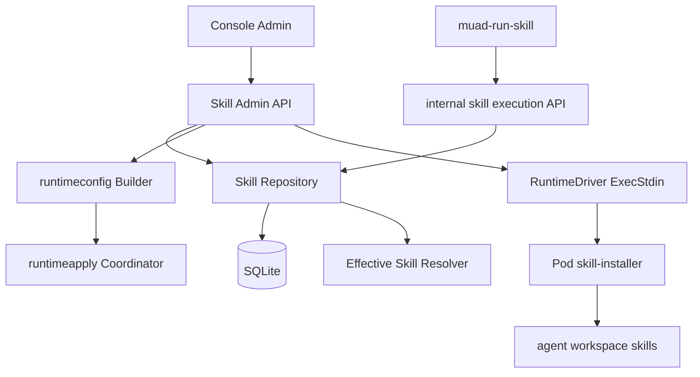
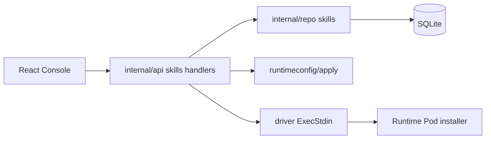
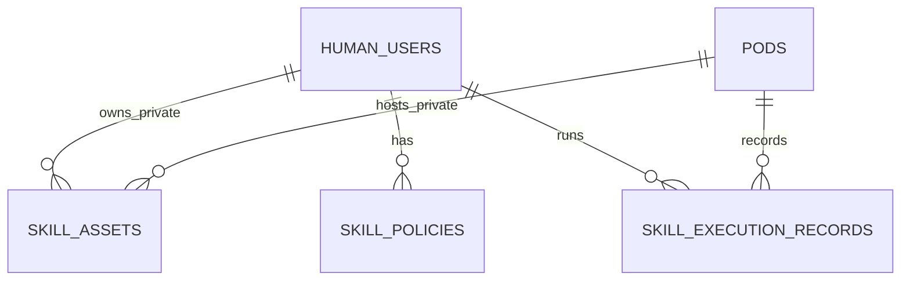
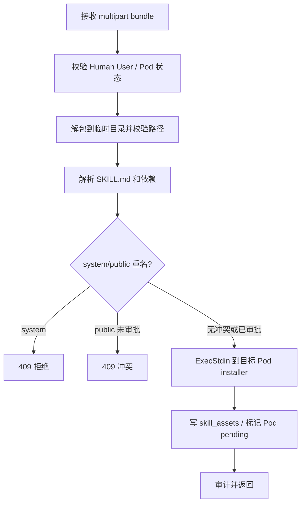

# Skill 管理后端模块需求与设计一体化文档

> **文档编号**: MOD-SKILL-MGMT-v0.1  
> **文档版本**: v0.1  
> **创建日期**: 2026-07-13  
> **文档状态**: 草稿

**评审边界说明**:
- **需求评审**: 第 2 章定义 Skill 管理要解决的业务问题和验收条件。
- **设计评审**: 第 3-4 章定义后端数据模型、API、Runtime 集成和运维方式。
- **交接契约**: 2.5 验收条件是后续 `cf-task-plan` 和测试拆解依据。

**ID 体系**: US（用户故事）、FEAT（功能）、API（接口）、RULE（业务规则/系统约束）、TC（测试用例）、RISK（风险）、NFR（非功能指标）

---

## 1. 文档控制

### 1.1 责任人

| 角色 | 姓名 | 职责范围 |
|------|------|---------|
| 产品经理 |  | Skill 管理范围、用户旅程、验收 |
| 开发负责人 |  | 后端 schema、API、Runtime 集成 |
| 测试负责人 |  | API、Repository、Runtime 配置和权限回归 |

### 1.2 修订历史

| 版本 | 日期 | 作者 | 变更描述 |
|------|------|------|---------|
| v0.1 | 2026-07-13 | Codex | 根据已对齐内容生成初始设计 |

---

## 2. 需求分析

### 2.1 需求概述

| 项目 | 内容 |
|------|------|
| **模块名称** | Skill 管理 |
| **模块ID** | MOD-SKILL-MGMT |
| **所属系统/产品线** | muad-openclaw Console / OpenClaw Runtime |
| **需求类型** | 新功能 |
| **业务背景** | 当前架构已经支持 public/private skill 加载、`muad-run-skill` 执行和 per-user workspace，但控制台缺少针对 Skill 的资产管理、用户可用性视图、冲突保护和执行观测。管理员无法回答“平台有哪些 skill”“某个用户实际能用哪些 skill”“为什么调用不了某个 skill”“是否被 private 覆盖”等问题。 |
| **核心目标** | 建立 Skill 管理闭环：全局资产视图、Human User 生效视图、private skill 管理、冲突限制、依赖/凭证检查和执行记录。 |

### 2.2 痛点与价值

| 维度 | 内容 |
|------|------|
| **目标用户** | 平台管理员、运维人员、Skill 开发者、安全/IT 业务负责人 |
| **当前问题** | Public skill、private skill、系统 skill 的最终生效结果只能从文件路径或运行时行为推断；private/public 重名覆盖风险不可见；用户缺业务平台凭证时只能到执行失败后排查。 |
| **业务影响** | Skill 增多后，用户维度的能力边界不清晰，升级、回滚、排障和审计成本上升。 |
| **预期价值** | 管理员能从 Console 看到 Skill 资产和单用户最终生效 Skill；平台默认阻止危险覆盖；执行失败可追溯到 skill、用户、Pod 和凭证状态。 |

**用户故事**

| 编号 | 用户故事 | 优先级 |
|------|---------|--------|
| US-01 | 作为管理员，我希望看到全局 Skill 列表，以便知道平台当前发布了哪些 system/public/private skill。 | P0 |
| US-02 | 作为管理员，我希望在 Human User 详情中看到该用户最终可用的 Skill，以便排查用户为什么不能调用某个能力。 | P0 |
| US-03 | 作为管理员，我希望 private skill 与 public/system skill 重名时被阻止或提示，以便避免无意覆盖公共能力。 | P0 |
| US-04 | 作为管理员，我希望看到 Skill 依赖的平台和该用户凭证状态，以便提前发现 XDR、SOAR 等平台 key 缺失。 | P0 |
| US-05 | 作为管理员，我希望能上传、禁用、删除某个用户的 private skill，以便支持用户私有流程。 | P1 |
| US-06 | 作为运维人员，我希望查看 Skill 最近执行记录、耗时、进度阶段和失败原因，以便定位长任务和脚本问题。 | P1 |

### 2.3 功能方案

#### 2.3.1 功能清单

| 功能ID | 功能名称 | 功能描述 | 优先级 | 来源 |
|--------|---------|---------|--------|------|
| FEAT-01 | Skill 资产目录 | 采集并保存 system/public/private skill 元数据，支持分页、搜索、过滤。 | P0 | US-01 |
| FEAT-01A | Public Skill 上传 | 管理员上传 `.tar.gz` 或 `.zip` public skill bundle，Console 校验后写入公共目录并更新资产元数据。 | P0 | US-01 |
| FEAT-02 | Human User 生效 Skill 视图 | 按用户合并 system/public/private、策略和依赖状态，返回最终生效结果。 | P0 | US-02 |
| FEAT-03 | 重名冲突与覆盖保护 | 默认拒绝 private 覆盖 public，禁止覆盖 system；仅审批策略允许普通 public 覆盖。 | P0 | US-03 |
| FEAT-04 | 依赖平台与凭证状态 | 解析 Skill manifest 的平台依赖，返回用户是否已配置对应平台 key。 | P0 | US-04 |
| FEAT-05 | Private Skill 管理 | 为单个 Human User 安装、禁用、删除 private skill，并触发目标 Pod 配置应用或 reload。 | P1 | US-05 |
| FEAT-06 | Skill 执行记录 | 接收 `muad-run-skill` 上报的 start/progress/done/fail，保存最近执行记录并支持查询。 | P1 | US-06 |
| FEAT-07 | Skill 可见性策略 | 支持按 Human User 禁用 skill 或审批一次 private override。Pod/业务线策略作为后续扩展。 | P1 | US-02/US-03 |

#### 2.3.2 字段约束

**FEAT-01 Skill 元数据**

| 字段名 | 字段类型 | 必填 | 约束 | 说明 |
|--------|---------|------|------|------|
| `name` | string | 是 | `^[a-z][a-z0-9_-]{0,63}$` | Skill 名称，跨来源用于合并与冲突判断 |
| `scope` | enum | 是 | `system/public/private` | 系统、公共、用户私有 |
| `version` | string | 否 | ≤64 字符 | 来自 manifest 或目录元数据 |
| `platforms` | array | 否 | 平台 ID 必须存在于 `platform_configs` 或标记 missing | 依赖 SOAR/XDR/MSSW/SDSP 等 |
| `progress_supported` | bool | 是 | 默认 false | 是否支持 `muad-progress` |
| `system_protected` | bool | 是 | system 默认 true | 是否禁止覆盖/禁用 |

**FEAT-05 private skill 安装**

| 字段名 | 字段类型 | 必填 | 约束 | 说明 |
|--------|---------|------|------|------|
| `bundle` | multipart file | 是 | 最大 5 MiB，`.tar.gz` | 包含 `SKILL.md` 和脚本目录 |
| `human_user_id` | string | 是 | 必须存在且非 deleting | 安装目标用户 |
| `expected_name` | string | 否 | 与 manifest name 一致时通过 | 防止上传错包 |

### 2.4 范围与边界

| 类别 | 内容 |
|------|------|
| **范围（In Scope）** | Skill 资产元数据、Public Skill 上传、用户最终生效 Skill 视图、private skill 安装/禁用/删除、重名冲突限制、依赖平台/凭证状态、执行记录、审计。 |
| **非范围（Out of Scope）** | 在线编辑脚本代码；公共 skill 的 Git/CI 发布流水线；远程 marketplace；跨租户 RBAC；为每个 skill 注册独立 OpenClaw tool；修改上游 OpenClaw 或第三方插件代码。 |
| **前置假设** | Skill 包结构遵循 OpenClaw `SKILL.md` 约定；script skill 通过 `muad-run-skill` 执行；业务平台由 `platform_configs` 管理；用户凭证存于 Human User 平台凭证。 |
| **有意妥协 / 技术债** | 首版只做 Human User 级策略；Pod/业务线级 skill policy 后续扩展。Public skill 支持控制台上传，但不做完整制品审批、版本回滚和灰度发布流水线。 |

### 2.5 验收条件

#### 2.5.1 业务规则与约束

| ID | 类型 | 描述 |
|----|------|------|
| RULE-01 | 系统约束 | system skill 永远不可被 private/public 覆盖、禁用或删除。 |
| RULE-02 | 业务规则 | private skill 与 public skill 重名时默认不生效，返回 `conflict`；只有显式 `allow_override` 策略时 private 才可覆盖 public。 |
| RULE-03 | 业务规则 | Human User Skill 视图必须展示最终生效来源、版本、冲突、依赖平台、凭证状态和最近执行状态。 |
| RULE-04 | 安全约束 | Public skill bundle 允许 `.tar.gz` / `.zip`，private skill bundle 仍只允许 `.tar.gz`；解包路径必须防 `../`、绝对路径、符号链接逃逸。 |
| RULE-05 | 系统约束 | private skill 写入目标 Pod 的对应 agent workspace，Console 不直接修改 Runtime Pod PVC；通过 driver `ExecStdin` 调用 Pod 内 installer。 |
| RULE-06 | 系统约束 | `muad-run-skill` 是 script skill 的唯一执行入口；执行记录通过内部 API 上报，不能让子进程直接持有 IM 会话上下文。 |
| RULE-07 | 安全约束 | API/UI 不展示密钥、cookie、完整输入输出，只展示 fingerprint、摘要和脱敏错误。 |
| RULE-08 | 运维约束 | 修改 private skill 或策略后必须标记目标 Pod `config_generation` pending，并可触发 apply/reload。 |

#### 2.5.2 功能验收场景

**正常场景**

| 场景ID | 功能ID | 优先级 | 前置条件 | 操作步骤 | 预期结果 |
|--------|--------|--------|---------|---------|---------|
| S-01 | FEAT-01 | P0 | public/system skill 已存在 | 调用 `GET /api/v1/skills` | 返回分页列表，包含 scope、version、status、platforms、protected 标记 |
| S-02 | FEAT-02 | P0 | 用户有 public skill 和 private skill | 调用 `GET /api/v1/human-users/{id}/skills` | 返回该用户最终生效列表和每个 skill 的 effectiveSource |
| S-03 | FEAT-03 | P0 | private `xdr-query` 与 public `xdr-query` 重名 | 查询用户 skill 视图 | private 行标记 conflict，public 仍为 effective |
| S-04 | FEAT-04 | P0 | skill 依赖 XDR，用户配置了 XDR key | 查询用户 skill 视图 | `credentialStatus=xdr:configured` |
| S-05 | FEAT-05 | P1 | 用户 active，Pod running | 上传合法 private skill bundle | installer 成功，DB 记录创建，目标 Pod config pending，审计记录写入 |
| S-06 | FEAT-06 | P1 | `muad-run-skill` 执行一个脚本 | 内部 API 上报 start/progress/done | 执行记录包含阶段、耗时、状态和用户/Pod/agent |

**异常场景**

| 场景ID | 功能ID | 触发条件 | 系统行为 | 用户感知 |
|--------|--------|---------|---------|---------|
| E-01 | FEAT-03 | private 覆盖 system skill | 拒绝安装或标记不生效，返回 409 | UI 显示“系统 Skill 不允许覆盖” |
| E-02 | FEAT-04 | skill 依赖平台但用户未配置 key | 接口返回 `credentialStatus=missing`，不报 500 | UI 标红缺失平台凭证 |
| E-03 | FEAT-05 | bundle 含 `../` 或符号链接逃逸 | 拒绝安装，返回 400 | UI 显示包结构非法 |
| E-04 | FEAT-05 | Pod 不运行或 installer 失败 | DB 不创建 active private skill，返回 502 或 failed 状态 | UI 显示安装失败和重试入口 |
| E-05 | FEAT-06 | 上报 execution 的 Pod token 无效 | 返回 401/403，不写记录 | Runtime 日志可见 unauthorized |

**边界场景**

| 场景ID | 字段/条件 | 边界值 | 预期行为 |
|--------|----------|--------|---------|
| B-01 | bundle size | 5 MiB | 允许；超过拒绝 |
| B-02 | skill name | 64 字符 | 允许；超过拒绝 |
| B-03 | 查询分页 | pageSize=100 | 允许；超过按 100 拒绝或截断 |

#### 2.5.3 非功能指标

| 指标ID | 指标名称 | 目标值 | 测量方法 |
|--------|---------|-------|---------|
| NFR-PERF-01 | Skill 列表查询 | P95 ≤ 300ms（1000 skill 以内） | Repository/API 测试 + 本地压测 |
| NFR-PERF-02 | Human User 生效视图 | P95 ≤ 300ms（单用户 200 skill 以内） | API 测试 |
| NFR-SEC-01 | 包安全 | 解包不能写出目标目录，不能保留 symlink/hardlink | 单元测试构造恶意 tar |
| NFR-SEC-02 | 凭证安全 | 不返回 API key/cookie/完整 stdout/stderr | API 响应断言 |

---

## 3. 技术设计

### 3.1 方案选型

#### 备选方案对比

| 对比维度 | 权重 | 方案A：DB 元数据 + Pod 内 installer | 得分 | 方案B：Console 直接挂载/写 PVC | 得分 |
|---------|------|------------------------------------|------|-------------------------------|------|
| 功能完备性 | 30% | 支持资产、私有安装、策略、执行记录 | 9 | 只能在 Console 有 PVC 权限时稳定 | 6 |
| 安全边界 | 25% | 写入动作发生在目标 Pod 内，路径由 installer 和 Runtime Guard 校验 | 9 | Console 需要写 Runtime 状态卷，权限扩大 | 4 |
| 实现复杂度 | 20% | 复用 `ExecStdin`，新增 installer 脚本和 API | 7 | 需要跨 driver 暴露卷路径，K8s/Docker 分歧大 | 5 |
| 维护成本 | 15% | 与现有 runtimeconfig/apply 模式一致 | 8 | 存储路径耦合控制面 | 4 |
| 风险评估 | 10% | 主要风险是 installer 校验和执行失败回滚 | 7 | 易造成跨用户/跨 Pod 状态写错 | 3 |
| **最终得分** | **100%** |  | **8.2** |  | **4.8** |

#### 关键决策记录

| 决策点 | 选择 | 被否决项 | 理由 | 可逆性 |
|--------|------|---------|------|--------|
| private skill 写入路径 | 通过 `ExecStdin` 调目标 Pod 内 installer 写 agent workspace | Console 直接写 PVC | 已有 driver 抽象支持 stdin，避免控制面扩大文件系统权限 | 中 |
| public skill 发布 | Console 上传 `.tar.gz` / `.zip` 到 Public Skills 目录并写入资产元数据 | 只走镜像/PVC 外部流程 | 当前需要管理端入口；上传必须校验包结构、禁止覆盖 system skill，并标记所有 Pod 配置待应用 | 中 |
| 重名覆盖策略 | 默认拒绝 private 覆盖 public，system 永久禁止覆盖 | 完全依赖 OpenClaw 优先级 | OpenClaw 能覆盖，但平台必须保证公共能力一致性和可审计 | 易 |
| 执行记录来源 | `muad-run-skill` 上报 internal API | 从 IM 消息或日志反推 | runner 持有可信 agent/session 上下文，数据准确且可脱敏 | 中 |
| 可见性策略 | 首版 Human User 级 policy | Pod/业务线多级 policy | 当前用户维度排障最急，避免过度设计 | 易 |

#### 技术栈

| 类别 | 选型 | 版本 | 选型理由 |
|------|------|------|---------|
| 语言 | Go / TypeScript(Node) | Go 1.26 / Node 24 | 后端与 Pod 内工具链沿用现有技术栈 |
| HTTP | net/http | stdlib | 与现有 Console API 一致 |
| 数据库 | SQLite modernc | 当前 go.mod | 与控制面已有 repo/schema 方式一致 |
| Runtime 写入 | `RuntimeDriver.ExecStdin` | 现有接口 | 支持 Docker/K8s 统一向 Pod 内传 bundle |

### 3.2 架构设计



#### 技术分层



#### 外部依赖清单

| 外部系统 | 依赖类型 | 协议 | 超时 | 降级策略 |
|---------|---------|------|------|---------|
| Runtime Pod | private skill installer / scan | `ExecStdin` | 30s | 写 DB 前失败则返回错误；写 DB 后 reload 失败标记 pending |
| `muad-run-skill` | 执行记录上报 | internal HTTP | 2s | 上报失败不阻断 skill 执行，只记本地日志 |
| OpenClaw skill loader | 最终加载 | 本地文件/配置 | N/A | 平台策略生成 whitelist，runner 再二次校验 |

### 3.3 数据设计

**新增表: `skill_assets`**

| 字段名 | 类型 | 可空 | 默认值 | 索引 | 说明 |
|--------|------|------|--------|------|------|
| `skill_id` | TEXT | N |  | PK | UUID |
| `name` | TEXT | N |  | idx | Skill 名称 |
| `scope` | TEXT | N |  | idx | `system/public/private` |
| `human_user_id` | TEXT | Y |  | idx | private skill 所属用户；public/system 为空 |
| `pod_id` | TEXT | Y |  | idx | private skill 所属 Pod 快照；便于清理和排障 |
| `display_name` | TEXT | N | `name` |  | 展示名 |
| `version` | TEXT | N | `""` |  | manifest 版本 |
| `status` | TEXT | N | `active` | idx | `active/disabled/deleted/conflict` |
| `source_path` | TEXT | N |  |  | 运行时路径，返回 UI 时可脱敏到相对路径 |
| `manifest_hash` | TEXT | N |  | idx | `SKILL.md` hash |
| `manifest_json` | TEXT | N | `{}` |  | 解析后的非敏感 manifest |
| `entry_type` | TEXT | N | `script` |  | `script/tool/prompt-only/system` |
| `platforms_json` | TEXT | N | `[]` |  | 依赖业务平台 |
| `browser_required` | INTEGER | N | `0` |  | 是否需要浏览器 |
| `progress_supported` | INTEGER | N | `0` |  | 是否支持 `muad-progress` |
| `system_protected` | INTEGER | N | `0` |  | system skill true |
| `created_at` | TEXT | N |  |  | 创建时间 |
| `updated_at` | TEXT | N |  |  | 更新时间 |

**索引设计**

| 索引名 | 类型 | 字段 | 使用场景 |
|--------|------|------|---------|
| `idx_skill_assets_scope_name` | 普通 | `(scope, name)` | 全局列表过滤 |
| `idx_skill_assets_human_user` | 普通 | `(human_user_id, status)` | 查询用户 private skill |
| `idx_skill_assets_pod` | 普通 | `(pod_id, status)` | 删除 Pod/User 时清理与审计 |
| `uidx_skill_public_name` | 唯一 | public/system active name | 防止 public/system 重名 |
| `uidx_skill_private_user_name` | 唯一 | `(human_user_id, name)` | 防止同用户 private 重名 |

> SQLite partial unique index 可用：`CREATE UNIQUE INDEX ... WHERE scope IN ('system','public') AND status != 'deleted'`。

**新增表: `skill_policies`**

| 字段名 | 类型 | 可空 | 默认值 | 索引 | 说明 |
|--------|------|------|--------|------|------|
| `policy_id` | TEXT | N |  | PK | UUID |
| `human_user_id` | TEXT | N |  | idx | 首版只支持用户维度 |
| `skill_name` | TEXT | N |  | idx | 目标 Skill 名 |
| `action` | TEXT | N |  |  | `disable/allow_override` |
| `reason` | TEXT | N | `""` |  | 审批原因 |
| `created_by` | TEXT | N |  |  | 管理员 |
| `expires_at` | TEXT | N | `""` |  | 可选过期 |
| `created_at` | TEXT | N |  |  | 创建时间 |

**新增表: `skill_execution_records`**

| 字段名 | 类型 | 可空 | 默认值 | 索引 | 说明 |
|--------|------|------|--------|------|------|
| `execution_id` | TEXT | N |  | PK | runner 生成或 Console 生成 |
| `pod_id` | TEXT | N |  | idx | Runtime Pod |
| `human_user_id` | TEXT | N |  | idx | 执行用户 |
| `agent_id` | TEXT | N |  | idx | 执行 agent |
| `skill_name` | TEXT | N |  | idx | Skill 名 |
| `skill_scope` | TEXT | N |  |  | 生效来源 |
| `skill_version` | TEXT | N | `""` |  | 执行时版本 |
| `status` | TEXT | N |  | idx | `running/succeeded/failed/cancelled` |
| `started_at` | TEXT | N |  | idx | 开始时间 |
| `ended_at` | TEXT | N | `""` |  | 结束时间 |
| `duration_ms` | INTEGER | N | `0` |  | 耗时 |
| `progress_json` | TEXT | N | `[]` |  | 阶段进度摘要 |
| `error_code` | TEXT | N | `""` |  | 脱敏错误码 |
| `error_message` | TEXT | N | `""` |  | 脱敏错误 |
| `input_summary` | TEXT | N | `""` |  | 输入摘要，不存原文 secret |
| `output_summary` | TEXT | N | `""` |  | 输出摘要 |
| `created_at` | TEXT | N |  |  | 创建时间 |

**ER图**



**容量预估**

| 维度 | 预估值 |
|------|--------|
| 初始数据量 | 100 用户、public/system 50-150 个、private 0-500 个 |
| 执行记录 | 按 100 用户每天 20 次 skill 执行，90 天约 18 万行 |
| 保留策略 | P1：默认保留 90 天；首版可不做自动清理，但查询必须分页 |

### 3.4 接口设计

#### 接口清单

| 接口ID | 名称 | 方法 | 路径 | 覆盖功能 |
|--------|------|------|------|------|
| API-01 | Skill 资产列表 | GET | `/api/v1/skills` | FEAT-01 |
| API-02 | Skill 详情 | GET | `/api/v1/skills/{skillId}` | FEAT-01/03/04 |
| API-03 | 扫描 Skill 元数据 | POST | `/api/v1/skills/scan` | FEAT-01 |
| API-03A | 上传 public skill | POST | `/api/v1/skills/public` | FEAT-01A |
| API-04 | 更新 Skill 状态 | PATCH | `/api/v1/skills/{skillId}` | FEAT-01/03 |
| API-05 | 用户生效 Skill 列表 | GET | `/api/v1/human-users/{humanUserId}/skills` | FEAT-02/03/04 |
| API-06 | 上传 private skill | POST | `/api/v1/human-users/{humanUserId}/skills/private` | FEAT-05 |
| API-07 | 删除 private skill | DELETE | `/api/v1/human-users/{humanUserId}/skills/private/{skillId}` | FEAT-05 |
| API-08 | 创建用户 Skill 策略 | POST | `/api/v1/human-users/{humanUserId}/skill-policies` | FEAT-07 |
| API-09 | 删除用户 Skill 策略 | DELETE | `/api/v1/human-users/{humanUserId}/skill-policies/{policyId}` | FEAT-07 |
| API-10 | Skill 执行记录 | GET | `/api/v1/skill-executions` | FEAT-06 |
| API-11 | 内部执行记录上报 | POST | `/internal/v1/skill-executions` | FEAT-06 |

#### API-01: Skill 资产列表

**请求**

| 参数 | 类型 | 必填 | 说明 |
|------|------|------|------|
| `page` | int | 否 | 默认 1 |
| `pageSize` | int | 否 | 默认 10，最大 100 |
| `q` | string | 否 | 按 name/displayName 模糊搜索 |
| `scope` | string | 否 | `system/public/private` |
| `status` | string | 否 | `active/disabled/deleted/conflict` |

**响应示例**

```json
{
  "code": 0,
  "message": "success",
  "data": {
    "items": [
      {
        "skillId": "sk_001",
        "name": "xdr-query",
        "scope": "public",
        "version": "1.2.0",
        "status": "active",
        "platforms": ["xdr"],
        "browserRequired": false,
        "progressSupported": true,
        "systemProtected": false,
        "updatedAt": "2026-07-13T10:00:00Z"
      }
    ],
    "total": 1,
    "page": 1,
    "pageSize": 10
  }
}
```

#### API-05: 用户生效 Skill 列表

**请求**

| 参数 | 类型 | 必填 | 说明 |
|------|------|------|------|
| `humanUserId` | path | 是 | 用户 ID |
| `q` | string | 否 | Skill 名搜索 |
| `status` | string | 否 | `effective/conflict/disabled/missing_credential` |

**响应示例**

```json
{
  "code": 0,
  "message": "success",
  "data": {
    "items": [
      {
        "name": "xdr-query",
        "effective": true,
        "effectiveSource": "public",
        "version": "1.2.0",
        "privateSkillId": "sk_private_01",
        "publicSkillId": "sk_public_01",
        "conflict": true,
        "conflictReason": "private_overrides_public_requires_approval",
        "platforms": [
          {"platform": "xdr", "credentialStatus": "configured", "platformEnabled": true}
        ],
        "progressSupported": true,
        "browserRequired": false,
        "lastExecution": {
          "status": "succeeded",
          "startedAt": "2026-07-13T10:00:00Z",
          "durationMs": 1520
        }
      }
    ],
    "total": 1
  }
}
```

#### API-06: 上传 private skill

**请求**

| 参数 | 类型 | 必填 | 说明 |
|------|------|------|------|
| `bundle` | multipart file | 是 | `.tar.gz` |
| `expectedName` | string | 否 | 期望 Skill 名 |

**处理逻辑**



**错误码**

| 错误码 | 信息 | 场景 | HTTP 状态码 |
|--------|------|------|----------|
| 40001 | invalid request body | multipart 或参数无效 | 400 |
| 40002 | invalid skill bundle | 包结构、路径、manifest 无效 | 400 |
| 40401 | not found | Human User/Pod 不存在 | 404 |
| 40901 | skill conflict | 重名覆盖不允许 | 409 |
| 50201 | runtime failure | Pod installer 执行失败 | 502 |

#### API-11: 内部执行记录上报

**请求**

```json
{
  "executionId": "exec_001",
  "event": "progress",
  "podId": "pod01",
  "agentId": "alice",
  "skillName": "xdr-query",
  "status": "running",
  "stage": "query",
  "message": "查询 XDR",
  "occurredAt": "2026-07-13T10:00:00Z"
}
```

**约束**

- 仅 Pod service token 可调用。
- 后端按 `podId + agentId` 反查 Human User，拒绝跨 Pod/未知 agent。
- `message`、`errorMessage` 需要截断并脱敏，不保存 API key、cookie、完整业务 payload。

### 3.5 质量实现方案

#### 性能设计

| 指标ID | 热点路径 | 目标值 | 实现方案（含被放弃的较慢方案） |
|--------|---------|-------|------------------------------|
| NFR-PERF-01 | `GET /api/v1/skills` | P95 ≤ 300ms | 使用 `(scope,name,status)` 索引分页；放弃每次递归扫描文件系统的方案，扫描改为显式触发或安装时写入元数据。 |
| NFR-PERF-02 | `GET /human-users/{id}/skills` | P95 ≤ 300ms | 批量加载 public/system、该用户 private、policy、platform credentials、last execution 后内存合并；禁止对每个 skill 单独查凭证或执行记录。 |
| NFR-PERF-03 | 执行记录查询 | P95 ≤ 300ms | `(human_user_id, started_at)`、`(skill_name, started_at)` 索引分页；保留窗口默认 90 天。 |

#### 可靠性设计

| 风险ID | 失效模式 | 影响 | 应对措施 |
|--------|---------|------|---------|
| RISK-01 | installer 成功但 DB 写入失败 | Pod 文件和控制面不一致 | 先校验再执行；DB 写失败时再次 ExecStdin 删除临时目录，失败则标记 `scan_required` 并审计 |
| RISK-02 | DB 写入成功但 apply/reload 失败 | UI 显示已安装但运行时未生效 | skill row active，Pod `last_apply_status=failed/pending`，用户视图显示 `runtimePending=true` |
| RISK-03 | 执行记录上报失败 | 最近执行缺失 | runner 不阻断主流程，内部日志记录；健康页可提示 telemetry degraded |
| RISK-04 | public/private 元数据与文件系统漂移 | 生效视图不准确 | 提供 `POST /skills/scan`，scan 后按 manifest_hash 修正 DB |

#### 安全性设计

| 指标ID | 验收标准 | 实现方案 |
|--------|---------|---------|
| NFR-SEC-01 | bundle 解包不可逃逸 | installer 和 Console 预校验同时拒绝绝对路径、`../`、symlink/hardlink |
| NFR-SEC-02 | 系统 skill 不可覆盖 | system protected 名称表 + DB/RUNTIME 双层校验 |
| NFR-SEC-03 | 用户不能访问其他用户 private skill | API 按 human_user_id 查询；Runtime Guard 强制 workspace/session-store 边界 |
| NFR-SEC-04 | 日志和 API 不泄露凭证 | 只存摘要、fingerprint、脱敏错误；测试断言不包含 secret 形态 |

#### 可观测性设计

| 场景 | 实现方案 |
|------|---------|
| Skill 变更审计 | 新增 `skill.asset.scan/install/update/delete`、`skill.policy.create/delete`、`skill.execution.fail` 审计 action |
| Pod 告警 | 复用 alerts：skill queue 非 0、runtime guard unhealthy；新增 execution failure rate 后续可接入 |
| Runtime 健康 | `muad.runtime.health` 后续返回 skill catalog generation、installer version、runner telemetry 状态 |

---

## 4. 部署与运维

### 4.1 部署架构

| 环境 | 配置 | 实例数 | 用途 |
|------|------|--------|------|
| dev | Console + 本地 Runtime Pod | 1 | 开发调试 |
| prod | Console 单实例 + N 个 Runtime Pod | 1 + N | 管理 100 用户规模 |

### 4.2 发布与回滚

| 阶段 | 范围 | 进入条件 | 回滚条件 |
|------|------|---------|---------|
| DB/API 发布 | Console | repo/API 测试通过 | API 兼容性失败 |
| Runtime installer 发布 | 新镜像 | installer 单测 + e2e 安装测试通过 | private skill 安装失败 |
| 前端发布 | Console UI | typecheck/lint/vitest 通过 | 核心页面不可用 |

回滚策略：DB 首版只新增表，不删除旧字段；Runtime installer 随镜像回滚；已安装 private skill 文件保留，控制面可通过 scan 恢复元数据。

### 4.3 监控告警

| 指标 | 阈值 | 级别 | 处理 |
|------|------|------|------|
| skill installer failure | 连续失败 > 3 次 | P2 | 检查目标 Pod、bundle 和 installer 日志 |
| skill execution failed | 单用户最近 10 次失败 > 5 次 | P3 | 提示管理员查看执行记录 |
| skill conflict count | > 0 | P3 | 用户详情标记冲突，不作为系统告警 |

### 4.4 数据迁移

| 阶段 | 操作 | 验证方法 |
|------|------|---------|
| 1 | 新增 `skill_assets` / `skill_policies` / `skill_execution_records` | schema 测试检查表和索引 |
| 2 | 首次启动不自动扫描文件系统 | API 返回空列表但不报错 |
| 3 | 管理员触发 scan 或安装 private skill | DB 生成 metadata，列表可见 |

---

## 5. 风险与依赖

### 5.1 项目依赖

| 依赖模块/团队 | 依赖内容 | 状态 | 风险等级 |
|-------------|---------|------|---------|
| `tools/muad-run-skill` | 执行记录上报、可信 agent/session 上下文 | 已有基础能力，需扩展 | 中 |
| Runtime Pod 镜像 | 新增 skill installer 脚本 | 待实现 | 中 |
| OpenClaw skill loader | public/private 加载优先级和 `agents.list[].skills` | 已验证方向 | 中 |
| Platform Credential | 用户平台凭证状态 | 已有 | 低 |

### 5.2 风险识别

| 风险ID | 类型 | 描述 | 概率 | 影响 | 应对措施 |
|--------|------|------|------|------|---------|
| RISK-05 | 范围膨胀 | public skill 发布流水线做重 | 中 | 高 | 首版只做受控上传、校验、资产写入和 Pod pending，不做审批、灰度和回滚流水线 |
| RISK-06 | Prompt 可见性不一致 | DB 显示 disabled，但 OpenClaw 仍加载到 prompt | 中 | 高 | runtimeconfig 生成 per-agent skill whitelist，runner 再校验执行 |
| RISK-07 | 私有包安全 | 恶意或误包写出 workspace | 低 | 高 | tar 双层校验、禁止 symlink、路径 canonical 检查 |
| RISK-08 | 执行记录数据过大 | progress/output 摘要增长 | 中 | 中 | 字段截断、只存摘要和阶段，不存完整 stdout/stderr |

---

## 6. 需求追溯矩阵

| 用户故事 | 功能ID | 接口ID | 测试用例ID | 状态 |
|---------|--------|--------|-----------|------|
| US-01 | FEAT-01 | API-01/API-02/API-03 | S-01 | ✅ |
| US-02 | FEAT-02 | API-05 | S-02 | ✅ |
| US-03 | FEAT-03 | API-05/API-06/API-08 | S-03/E-01 | ✅ |
| US-04 | FEAT-04 | API-05 | S-04/E-02 | ✅ |
| US-05 | FEAT-05 | API-06/API-07 | S-05/E-03/E-04/B-01/B-02 | ✅ |
| US-06 | FEAT-06 | API-10/API-11 | S-06/E-05 | ✅ |

---

## 附录：术语表

| 术语 | 定义 |
|------|------|
| Skill Asset | 控制面记录的一条 skill 元数据，不一定代表当前用户可用 |
| Effective Skill | 对某个 Human User 合并 system/public/private/policy/credential 后的最终可用 skill |
| System Skill | `session-manager`、`muad-run-skill`、Runtime Guard 相关基础能力，禁止覆盖 |
| Public Skill | 平台公共能力，由 Console 上传到共享目录或随镜像发布 |
| Private Skill | 写入某个 Human User agent workspace 的用户私有能力 |
| Override | private skill 与 public skill 同名时的覆盖行为，默认禁止 |

---

*文档结束*
