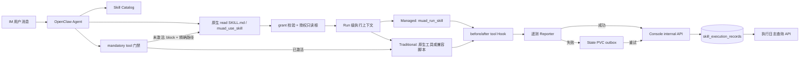
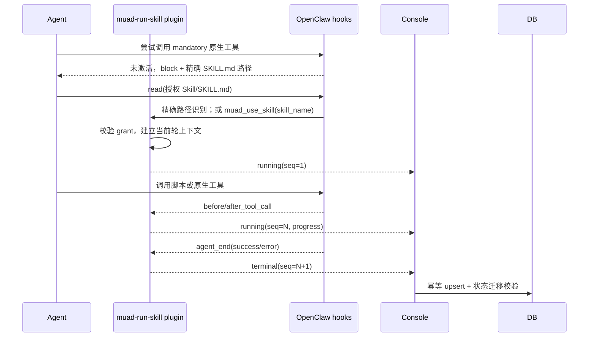
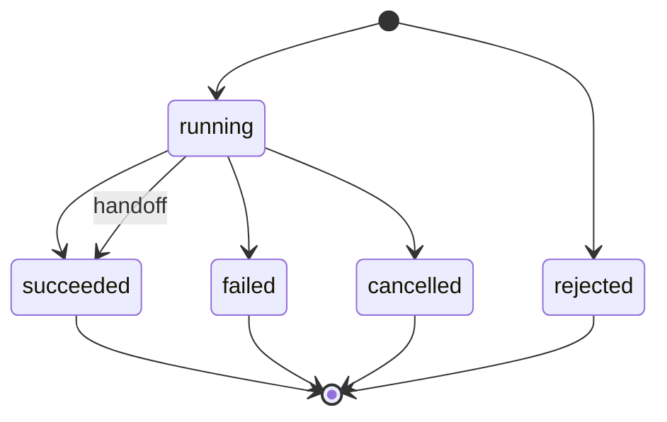

# Skill 执行审计与传统 Skill 兼容执行后端设计

> **文档编号**: MOD-SKILL-AUDIT-001  
> **文档版本**: v0.4  
> **创建日期**: 2026-07-14  
> **文档状态**: 设计评审中

## 1. 文档控制

### 1.1 评审边界

本设计覆盖 Skill 从识别、激活、执行到审计落库的完整链路。前端展示见同目录的前端设计文档。

### 1.2 修订历史

| 版本 | 日期 | 变更描述 |
|------|------|---------|
| v0.1 | 2026-07-14 | 初始设计，补齐全量执行审计、传统 Skill 兼容执行和可靠上报 |
| v0.2 | 2026-07-15 | 明确 Skill 激活按用户消息轮次隔离，重试和继续执行必须重新激活，并补齐已有 workspace 指引迁移 |
| v0.3 | 2026-07-15 | 以原生精确读取 `SKILL.md` 作为主激活入口，补齐业务 Agent 只读能力、Runtime Guard 授权根和原生 read 参数审计 |
| v0.4 | 2026-07-15 | 增加标准 `SKILL.md` 必选工具门禁，防止模型绕过 Skill 激活后直接调用原生工具而漏记审计 |

## 2. 需求分析

### 2.1 需求概述

| 项目 | 内容 |
|------|------|
| **模块名称** | Skill 执行审计与传统 Skill 兼容层 |
| **所属系统** | muad-openclaw Console、`muad-run-skill` OpenClaw 插件 |
| **需求类型** | 功能完善、运行时可观测性增强 |
| **业务背景** | 当前只有经 `muad-run-skill` 且遥测成功的脚本执行才可能进入 `skill_execution_records`；传统 Skill 可能直接使用原生工具，成功执行也不会出现在审计页面 |
| **核心目标** | 所有通过平台 Skill 激活入口发起的执行均形成可查询、可追踪、最终状态明确的审计记录，同时兼容没有 `muad.skill.json` 的传统 Skill |

### 2.2 痛点与价值

| 维度 | 内容 |
|------|------|
| **目标用户** | 平台管理员、运维人员、Skill 开发者、使用企微/微信等 IM 的业务用户 |
| **当前问题** | 成功执行不写操作审计；遥测失败被静默忽略；没有 `muad.skill.json` 的 Skill 可能被模型识别但无法进入统一执行边界；prompt-only Skill 使用原生工具时无法归因 |
| **业务影响** | 管理员无法确认 Skill 是否真的执行、由谁执行、在哪个 Pod 执行、成功或失败原因；出现“模型说会用但实际执行不了”时缺少证据链 |
| **预期价值** | 建立统一的 Skill 激活和执行边界，不增加每个 Skill 的手工 Tool 开发工作，并让脚本型和原生工具型 Skill 都具备审计能力 |

**用户故事**

| 编号 | 用户故事 | 优先级 |
|------|---------|--------|
| US-01 | 作为管理员，我希望看到全部 Skill 执行结果，以便定位执行失败和确认用户行为 | P0 |
| US-02 | 作为 Skill 开发者，我希望传统 Skill 无需补充 `muad.skill.json` 也能被 Agent 激活和执行 | P0 |
| US-03 | 作为运维人员，我希望 Console 暂时不可用时执行记录不会静默丢失 | P0 |
| US-04 | 作为安全与审计人员，我希望执行输入、输出和错误经过脱敏且可按用户、Pod、Skill 查询 | P0 |

### 2.3 功能方案

#### 2.3.1 功能清单

| 功能ID | 功能名称 | 功能描述 | 优先级 | 来源 |
|--------|---------|---------|--------|------|
| FEAT-BE-01 | 统一 Skill 激活入口 | 优先复用 OpenClaw 原生 Skill 流程：读取授权清单中的精确 `SKILL.md` 即创建执行上下文；`muad_use_skill` 作为通用显式激活后备，不按 Skill 单独注册 Tool | P0 | US-01、US-02 |
| FEAT-BE-02 | 全生命周期执行审计 | 通过 `before_tool_call`、`after_tool_call`、`agent_end` Hook 记录激活、工具调用摘要和终态；单次工具失败只记录过程，Agent 或 Runner 结束时才决定整次执行终态 | P0 | US-01 |
| FEAT-BE-03 | 传统 Skill 兼容执行 | 扫描到 `SKILL.md` 即可进入 Skill 授权清单；无 `muad.skill.json` 时按传统模式运行，脚本通过相对路径和参数调用，prompt-only Skill 在激活上下文中使用原生工具 | P0 | US-02 |
| FEAT-BE-04 | 可靠遥测上报 | 上报失败时写入 Pod State PVC 中的本地 outbox，后台重试并以 `executionId + eventSeq` 幂等合并，禁止静默丢弃 | P0 | US-03 |
| FEAT-BE-05 | 执行日志查询 | 扩展执行日志列表筛选条件并增加详情接口，支持执行进度、错误和脱敏输入/输出查询 | P0 | US-01、US-04 |
| FEAT-BE-06 | 执行状态规范 | 明确 `running/succeeded/failed/cancelled/rejected` 状态及合法迁移，阻止迟到事件覆盖终态 | P0 | US-01 |
| FEAT-BE-07 | 操作审计分流 | `audit_log` 只保留上传、删除、启禁用、应用等平台操作；Skill 运行统一进入 `skill_execution_records`，避免重复和语义混淆 | P1 | US-01、US-04 |

#### 2.3.2 核心概念

| 概念 | 定义 |
|------|------|
| Skill 资产 | 已扫描并进入 `skill_assets` 的 Skill，至少包含合法 `SKILL.md` |
| Managed Skill | 包含合法 `muad.skill.json`，由平台定义步骤或入口点的 Skill |
| Traditional Skill | 不包含 `muad.skill.json`，依赖 `SKILL.md` 指导 Agent 调用脚本或 OpenClaw 原生工具的 Skill |
| Skill 激活 | Agent 读取当前授权 Skill 的精确 `SKILL.md`，或调用 `muad_use_skill(skill_name)`；平台校验 grant 后建立本轮执行上下文 |
| Skill 执行 | 从激活成功开始，到当前 Skill 被切换或 Agent 本轮结束为止 |
| 执行上下文 | 以 OpenClaw `runId` 为主键关联的 `executionId`、Skill、Agent、Pod、开始时间和工具进度 |

#### 2.3.3 传统 Skill 的执行规则

1. 扫描器只要求存在可解析的 `SKILL.md`，`muad.skill.json` 变为可选增强文件。
2. Runtime Config 必须把 `managed`、`traditional-script` 和 `traditional-prompt` 三种 Skill 都下发到用户授权清单，不能再跳过 prompt-only Skill。
3. Agent 使用任意 Skill 前必须在当前消息轮次完成激活：优先按 OpenClaw 原生约定读取 `<available_skills>` 中的精确 `SKILL.md`；无法原生读取时调用 `muad_use_skill`。重试、继续、再次执行等后续消息必须重新激活，不为每个 Skill 注册独立 Tool。
4. 无 manifest 的脚本执行使用 `muad_run_skill` 的兼容参数：`skill_name + script_path + args`。`script_path` 必须是 Skill 根目录内的相对路径，禁止原始 shell 字符串。
5. 仅调用 `browser`、`web_search`、`opencli` 等原生工具的 Skill，由 OpenClaw Hook 将这些工具调用归入当前激活的 Skill，在 `agent_end` 时写入终态。若标准 `SKILL.md` 的 frontmatter `description` 声明 `MANDATORY before calling <tools>`，插件必须在 `before_tool_call` 强制检查本轮激活状态；未激活时阻断工具并返回精确 `SKILL.md` 路径，激活后才允许重试。
6. Managed Skill 仍优先使用 `muad.skill.json` 的确定性步骤和进度定义；缺失 manifest 不影响识别和基础执行。

### 2.4 范围与边界

| 类别 | 内容 |
|------|------|
| **范围（In Scope）** | Skill 扫描分类、Runtime Config 授权、通用激活工具、传统脚本兼容执行、OpenClaw 生命周期 Hook、可靠遥测、执行记录 API、数据库约束和测试 |
| **非范围（Out of Scope）** | 修改或 fork OpenClaw 上游源码；为每个 Skill 开发独立 Tool；允许任意 shell 命令；保存完整业务输入、完整模型输出或密钥；分析用户未激活 Skill 时的模型内部意图 |
| **前置假设** | OpenClaw 当前版本提供插件 `before_tool_call`、`after_tool_call`、`agent_end` Hook，并在 Hook 上下文中提供 `runId/agentId/sessionKey/toolCallId` |
| **有意妥协** | 平台将“当前轮成功读取精确 `SKILL.md` 或调用 `muad_use_skill`”定义为 Skill 执行开始。Prompt 和 workspace 指引负责 Skill 选择；对 Skill 明确声明的必选原生工具再用运行时门禁保证激活。未声明映射且未出现可观测激活信号时不猜测归因 |

### 2.5 验收条件

#### 2.5.1 业务规则与系统约束

| ID | 类型 | 描述 |
|----|------|------|
| RULE-01 | 业务规则 | 每次成功或失败的 Skill 激活必须产生唯一 `executionId`，并最终进入一个终态 |
| RULE-02 | 系统约束 | `muad.skill.json` 为可选增强文件，不得作为 Skill 可见性的必要条件 |
| RULE-03 | 安全约束 | 传统脚本只能执行 Skill 根目录内的相对文件，禁止路径逃逸、符号链接逃逸和原始 shell 字符串 |
| RULE-04 | 数据约束 | API Key、Cookie、Token、Authorization 头及匹配敏感字段的值不得写入执行记录 |
| RULE-05 | 可靠性约束 | Console 上报失败必须进入本地 outbox 并重试，不得静默返回成功后丢弃记录 |
| RULE-06 | 状态约束 | 终态记录不可被较小 `eventSeq` 或迟到的 `running` 事件覆盖 |
| RULE-07 | 审计边界 | Skill 资产管理操作写入 `audit_log`；Skill 实际运行写入 `skill_execution_records` |
| RULE-08 | 归因约束 | 同一 Agent Run 同时只允许一个前台激活 Skill；切换 Skill 时关闭前一个执行后再创建新执行 |
| RULE-09 | 状态约束 | 原生工具单次失败不得提前关闭执行；重试后 Agent 正常结束时整次执行为 succeeded，同时保留 tool-failed 过程 |
| RULE-10 | 激活约束 | Skill 激活不得跨用户消息轮次复用；已有 workspace 在运行时应用时必须补齐受管激活区块且保留原有自定义内容；业务 Agent 仅可只读当前授权 Skill 根目录，主 Agent、未授权根目录和写入操作保持拒绝 |
| RULE-11 | 执行约束 | Prompt 不作为强制边界；Skill 在标准 `SKILL.md description` 中声明的 mandatory tools，必须由插件在公开 `before_tool_call` Hook 中阻断未激活调用，且不得依赖 `muad.skill.json` |

#### 2.5.2 功能验收场景

| 场景ID | 功能ID | 类型 | 前置与操作 | 可观测结果 | 测试层级与真实边界 |
|--------|--------|------|-----------|-----------|------------------|
| S-01 | FEAT-BE-01、02 | 正常 | 用户请求使用 managed Skill，Agent 调用 `muad_use_skill` 后执行脚本成功 | 只有一条执行记录，状态由 running 变为 succeeded，包含 Pod、用户、Agent、Skill 和耗时 | E2E：真实插件 Tool + Hook + Console API + SQLite |
| S-02 | FEAT-BE-03 | 正常 | 上传仅含 `SKILL.md` 和 Python 脚本的 Skill，不提供 `muad.skill.json` | Agent 可激活并通过相对脚本路径执行；执行日志显示 `traditional-script` | E2E：真实 Skill 包 + Runtime Config + Pod 插件 |
| S-03 | FEAT-BE-03 | 正常 | Agent 无视 Prompt，尝试直接调用传统 Skill 声明的 mandatory `browser`，随后完成抓取 | 首次工具调用被阻断并返回精确 `SKILL.md` 路径；读取或 `muad_use_skill` 后重试成功，原生工具归入唯一记录，Agent 结束后状态为 succeeded | Integration：真实 Hook block 结果；Pod E2E：原生 read/tool、browser、Console API、SQLite |
| S-04 | FEAT-BE-04 | 正常 | Console 首次上报失败，随后恢复 | 事件先写入 outbox，恢复后自动补传；数据库仅保留一条正确终态记录 | Integration：真实临时文件 outbox + `httptest` Console |
| S-05 | FEAT-BE-05 | 正常 | 按用户、Pod、Skill、状态和时间范围查询 | 返回正确总数、分页数据和脱敏摘要，详情返回进度 | Integration：HTTP + SQLite |
| S-06 | FEAT-BE-07 | 正常 | 执行一个成功 Skill，同时上传并应用一个 Public Skill | 执行只出现在 Skill 执行日志；上传和应用只出现在操作审计 | E2E：两个 API 列表及数据库真实边界 |
| E-01 | FEAT-BE-01、06 | 异常 | Agent 激活未授权或不存在的 Skill | 生成 rejected 记录，包含稳定错误码，不返回 Skill 内容 | Integration：Tool + Console API；覆盖 RULE-01 |
| E-02 | FEAT-BE-03 | 异常 | 传统脚本使用 `../`、绝对路径或符号链接逃逸 | 执行被拒绝，脚本不启动，记录为 rejected | Unit + Integration：真实临时目录；覆盖 RULE-03 |
| E-03 | FEAT-BE-02、06 | 异常 | Agent Run 异常结束，或 Runner 明确返回不可恢复失败 | 执行记录为 failed，错误摘要可见且不包含敏感值 | Integration：Hook Runner；覆盖 RULE-04、RULE-09 |
| E-04 | FEAT-BE-04 | 异常 | Console 持续不可用或 outbox 达到容量上限 | 插件输出结构化错误日志并触发运行时健康告警；已有 outbox 不被覆盖 | Integration + manual：磁盘满仅手工验证；覆盖 RISK-02 |
| B-01 | FEAT-BE-02 | 边界 | 同一 Run 依次激活两个 Skill | 前一个记录以 handoff 原因关闭，新 Skill 获得新的 executionId，不串联工具进度 | Unit + Integration；覆盖 RULE-08 |
| B-02 | FEAT-BE-04、06 | 边界 | 终态后收到较小序号的 running 事件 | 数据库保持原终态和较大 `eventSeq` | Integration：HTTP + SQLite；覆盖 RULE-06 |
| B-03 | FEAT-BE-05 | 边界 | 执行记录超过一页，pageSize 分别为 10、20、50、100 | 总数、页数、排序稳定，无重复或漏项 | Integration：HTTP + SQLite |
| B-04 | FEAT-BE-01、02 | 边界 | 用户完成一次 Skill 后发送“再次执行/继续/重试”等后续消息 | 当前轮重新读取精确 `SKILL.md` 或调用 `muad_use_skill`；若直接调用 mandatory tool 则再次被门禁阻断；最终产生新的 executionId 并独立落库 | Integration + Pod E2E：Prompt Hook、工具门禁、已有 workspace 指引、真实 IM 形态消息 |

#### 2.5.3 非功能指标

| 指标ID | 指标名称 | 目标值 | 测量方法 |
|--------|---------|-------|---------|
| NFR-REL-01 | 执行记录最终落库 | Console 短暂故障恢复后可补传；不可静默丢失 | S-04、E-04 |
| NFR-PERF-01 | Hook 同步开销 | 不在 Tool 热路径执行 Console 网络请求；同步部分只做内存状态更新与有界摘要 | 基准测试和代码审查 |
| NFR-SEC-01 | 敏感信息保护 | 持久化前统一脱敏，数据库抽查无明文凭据 | E-03、单元测试 |
| NFR-COMPAT-01 | 上游兼容 | 仅使用 OpenClaw 插件公开 Tool/Hook API，不修改上游源码 | 构建检查和插件集成测试 |

## 3. 技术设计

### 3.1 方案选型

| 方案 | 说明 | 优点 | 缺点 | 结论 |
|------|------|------|------|------|
| A. 强制所有 Skill 编写 `muad.skill.json` | 只有 manifest Skill 进入 runner | 最确定、实现简单 | 增加 Skill 接入成本，传统 Skill 无法直接兼容 | 否决 |
| B. 扫描 `SKILL.md` 并自动猜测全部命令 | 从自然语言生成命令模板 | 无需显式激活 | 解析误差高，容易把示例当命令，难覆盖原生工具型 Skill | 否决 |
| C. 原生 Skill 读取 + 通用后备激活 + Hook 关联 | 原生读取精确 `SKILL.md` 或通用工具建立上下文，Hook 关联原生工具，runner 执行受控脚本 | 无需逐 Skill 注册 Tool，兼容传统 Skill，符合 OpenClaw 原生流程 | Prompt 无法阻止模型直接调用工具，存在漏记窗口 | 部分采用 |
| E. 方案 C + 标准描述工具门禁 | 从 `SKILL.md description` 读取 mandatory tool 声明，未激活时通过公开 Hook 阻断并引导精确读取 | 保留原生兼容性，不需要 manifest 或上游改造，消除已声明工具的漏记窗口 | 需要 Skill 对关键工具作标准声明；不能可靠猜测未声明的自然语言意图 | **采用** |
| D. fork OpenClaw 增加 Skill 生命周期事件 | 修改核心 Skill 加载器 | 理论上最精确 | 破坏不上游 fork 的原则，升级成本高 | 否决 |

**关键决策**

| 决策点 | 选择 | 理由 | 可逆性 |
|--------|------|------|--------|
| Skill 执行边界 | 精确 `SKILL.md` 读取成功，`muad_use_skill` 为后备 | 两者均是可观测、可校验的显式激活；不依赖模型内部意图 | 易 |
| mandatory tool 边界 | `SKILL.md description` 声明 + `before_tool_call` 阻断 | Prompt 只负责引导，运行时 Hook 才能提供确定性约束；无需 `muad.skill.json` | 易 |
| 运行时集成 | 扩展现有 `muad-run-skill` 插件并使用公开 Hook | 不改上游，复用现有授权、进度和遥测能力 | 易 |
| 传统脚本参数 | 相对 `script_path` + argv 数组 | 兼容多语言脚本，同时避免 shell 注入 | 中 |
| 审计存储 | 延续 `skill_execution_records` 汇总表 | 当前数据结构已覆盖查询需求，避免新建事件表的过度设计 | 易 |
| 遥测可靠性 | State PVC 文件 outbox + 幂等 upsert | Pod 内已有持久卷，Console 短暂不可用时可最终补传 | 中 |

### 3.2 架构设计



#### 3.2.1 模块职责

| 模块 | 位置 | 职责 |
|------|------|------|
| Skill 扫描器 | `console/backend/internal/api/skill_bundle.go` 及相关扫描模块 | 识别 `SKILL.md`、可选 manifest、脚本能力，写入标准化资产元数据 |
| Runtime Config Builder | `console/backend/internal/runtimeconfig/` | 为用户下发全部有效 Skill grant、entry type、根路径和遥测配置 |
| Skill 激活与执行插件 | `tools/muad-run-skill/` | 注册 `muad_use_skill`、`muad_run_skill`，维护 Run 上下文，执行脚本，监听 Hook |
| mandatory tool 门禁 | `tools/muad-run-skill/src/tool-activation-gate.mjs` | 解析授权 `SKILL.md description` 的 mandatory tool 声明；在未激活时阻断原生工具并返回精确 Skill 路径 |
| Runtime Guard | `tools/muad-runtime-guard/` | 仅允许业务 Agent 读取自身授权 Skill 根；拒绝写入、未授权 Skill、跨用户目录和 main Agent |
| 遥测 Reporter | `tools/muad-run-skill/src/telemetry.mjs` 及拆分模块 | 生成序号、脱敏、异步上报、outbox 持久化和重试 |
| Console Skill Execution API | `console/backend/internal/api/skill_executions.go` | 校验 Pod token、解析 Agent 身份、幂等更新、列表和详情查询 |
| Repository | `console/backend/internal/repo/skills.go` | 状态迁移、筛选分页和数据库访问 |

#### 3.2.2 执行时序



### 3.3 数据设计

#### 3.3.1 `skill_assets` 调整

不新增资产表，扩展现有 `entry_type` 语义：

| 值 | 判定条件 | 执行方式 |
|----|---------|---------|
| `managed` | 存在合法 `muad.skill.json` | manifest steps/entrypoint |
| `traditional-script` | 无 manifest，但存在 `SKILL.md` 且扫描到可执行脚本 | 激活后通过受控 `script_path + args` 执行 |
| `traditional-prompt` | 无 manifest，存在 `SKILL.md`，未扫描到脚本 | 激活后由 Agent 使用 OpenClaw 原生工具 |

`manifest_json` 对 traditional Skill 只保存扫描事实，不生成业务语义命令：

```json
{
  "runtime": "traditional",
  "hasScripts": true,
  "scriptFiles": ["scripts/export.py", "scripts/send_mail.sh"]
}
```

`scriptFiles` 仅用于路径白名单和 UI 能力展示，不用于猜测用户意图。

#### 3.3.2 `skill_execution_records` 调整

沿用现有表，新增以下字段并扩展状态约束：

| 字段 | 类型 | 可空 | 默认值 | 说明 |
|------|------|------|--------|------|
| `entry_type` | TEXT | N | `''` | `managed/traditional-script/traditional-prompt` |
| `activation_mode` | TEXT | N | `tool` | `tool/path-detected/runner`，用于定位激活来源 |
| `event_seq` | INTEGER | N | `0` | 单次执行递增事件序号，防止乱序覆盖 |
| `last_tool_name` | TEXT | N | `''` | 最近一次工具名，不保存完整参数 |
| `terminal_reason` | TEXT | N | `''` | `agent_end/handoff/rejected/cancelled` 等稳定原因 |

状态集合调整为：`running/succeeded/failed/cancelled/rejected`。

**状态迁移**



Repository 更新条件必须包含 `incoming.event_seq > stored.event_seq`，并禁止任何终态回到 `running`。

**旧库迁移**

Console 启动时检查执行表字段和 `status` 约束。旧表缺少审计字段，或状态约束不包含
`rejected` 时，在单一 SQLite 事务内执行“旧表改名、新表创建、数据复制、旧表删除、索引重建”。
迁移保留已有执行记录，并允许重复启动；任何一步失败均回滚，不能留下半迁移表。

#### 3.3.3 索引

保留现有用户、Pod、Skill、状态索引，补充全局时间索引：

| 索引名 | 字段 | 使用场景 |
|--------|------|---------|
| `idx_skill_executions_started` | `started_at DESC` | 审计页默认全局倒序 |
| 现有用户索引 | `human_user_id, started_at` | 用户详情和用户过滤 |
| 现有 Pod 索引 | `pod_id, started_at` | Pod 过滤 |
| 现有 Skill 索引 | `skill_name, started_at` | Skill 过滤 |
| 现有状态索引 | `status, started_at` | 状态过滤 |

### 3.4 接口设计

#### API-BE-01：写入执行状态

`POST /internal/v1/skill-executions`

沿用 Pod Service Token 鉴权。请求新增字段：

```json
{
  "executionId": "uuid",
  "eventSeq": 3,
  "agentId": "user-bbd2727a",
  "skillName": "web-tools-guide",
  "skillScope": "public",
  "skillVersion": "sha256:...",
  "entryType": "traditional-prompt",
  "activationMode": "tool",
  "status": "running",
  "startedAt": "2026-07-14T21:30:00Z",
  "endedAt": null,
  "durationMs": 0,
  "lastToolName": "browser",
  "terminalReason": "",
  "progress": [],
  "inputSummary": "抓取指定仓库待合并请求",
  "outputSummary": "",
  "errorCode": "",
  "errorMessage": ""
}
```

| 场景 | HTTP | 错误码 | 处理 |
|------|------|--------|------|
| Pod token 无效 | 401 | `401xx` 现有 Pod 鉴权码 | 拒绝写入 |
| Agent 不属于当前 Pod | 404 | 现有资源不存在码 | 拒绝跨 Pod 归因 |
| 状态或字段非法 | 400 | `40002` | 返回稳定错误信息 |
| 事件序号过期 | 200 | `0` | 幂等忽略并返回当前记录 |
| 数据库失败 | 500 | `500xx` | Reporter 进入 outbox |

覆盖：FEAT-BE-02、04、06。

#### API-BE-02：查询执行日志

`GET /api/v1/skill-executions`

| 参数 | 类型 | 说明 |
|------|------|------|
| `page` / `pageSize` | int | 默认 1/10，pageSize 支持 10、20、50、100 |
| `q` | string | 对 Skill 名称、Pod ID、用户 ID 和 Agent ID 统一模糊匹配 |
| `podId` | string | 精确筛选 Pod |
| `humanUserId` | string | 精确筛选用户 |
| `agentId` | string | 精确筛选 Agent |
| `skillName` | string | Skill 名称模糊匹配；保留用于旧调用方兼容 |
| `status` | string | 执行状态 |
| `scope` | string | system/public/private |
| `entryType` | string | managed/traditional-script/traditional-prompt |
| `startedFrom` / `startedTo` | RFC3339 | 开始时间范围 |

列表只返回表格所需摘要，不返回完整 `progressJson`，避免 over-fetch。覆盖：FEAT-BE-05。

#### API-BE-03：查询执行详情

`GET /api/v1/skill-executions/{executionId}`

返回单条完整脱敏记录，包括进度、输入/输出摘要、错误、终态原因和最近工具。不存在返回 404。覆盖：FEAT-BE-05。

#### Tool-BE-01：激活 Skill

`muad_use_skill({ skill_name, input_summary? })`

该 Tool 是原生读取不可用时的后备显式入口。正常流程优先读取 `<available_skills>` 指定的精确 `SKILL.md`，两种入口使用同一 grant 校验和执行上下文。

| 参数 | 必填 | 约束 |
|------|------|------|
| `skill_name` | 是 | 必须命中当前 Agent 的 grant |
| `input_summary` | 否 | 最大 512 字节，插件再次脱敏 |

成功返回 Skill 指令、scope、version、entryType 和 `executionId`。失败也上报 rejected 记录，但不返回 Skill 内容。

#### Tool-BE-02：执行 Skill 脚本

`muad_run_skill` 保留现有 managed 参数，并增加 traditional 参数：

| 参数 | 必填 | 约束 |
|------|------|------|
| `skill_name` | 是 | 必须与当前激活 Skill 一致 |
| `script_path` | traditional-script 必填 | 相对路径，必须属于扫描到的 Skill 文件 |
| `args` | 否 | 字符串数组，每项单独传给子进程，不经 shell 拼接 |
| `input` | 否 | 通过 stdin 传入，按摘要规则记录 |

### 3.5 质量实现方案

#### 3.5.1 可靠遥测

- Reporter 不在 `before_tool_call/after_tool_call` 热路径同步等待网络；Hook 只更新内存上下文并将快照放入有界异步队列。
- 网络失败或进程退出前未发送的快照追加到 `/home/node/.openclaw/muad/skill-execution-outbox.ndjson`。
- outbox 逐条包含校验和、`executionId` 和 `eventSeq`，启动时和定时器触发重放；服务端幂等处理。
- 文件写入失败、文件损坏或达到配置上限时输出结构化错误日志，Runtime Guard 健康状态暴露 `skillTelemetryHealthy=false`，由 Console 告警。
- 不把遥测故障转换成用户 Skill 执行失败；业务结果与审计传输状态分开。

#### 3.5.2 脱敏

统一复用一个持久化前脱敏器，按字段名和内容模式处理：`api_key`、`token`、`cookie`、`authorization`、`secret`、`password` 及常见 Bearer/Key 格式。输入、输出、错误和进度均先截断后脱敏；禁止仅在前端遮罩。

#### 3.5.3 并发与清理

- 执行上下文以 `runId` 为主键；无 `runId` 时用 `sessionKey + agentId` 作为受限回退键并记录告警。
- `agent_end` 必须在 `finally` 路径关闭上下文；插件还需设置超时清理，防止异常终止造成内存泄漏。
- 现有 Pod Skill 并发队列仍负责子进程限流；prompt-only Skill 只记录上下文，不额外占用脚本并发槽。

#### 3.5.4 测试策略

| 层级 | 覆盖内容 |
|------|---------|
| Unit | Skill 分类、路径安全、mandatory tool frontmatter 解析、状态机、序号幂等、脱敏、Run 上下文切换、outbox 编解码 |
| Integration | OpenClaw Hook Runner、未激活 Tool block、通用 Tool、`httptest` internal API、SQLite Repository、outbox 重放 |
| E2E | 构建运行时镜像，上传无 manifest 脚本 Skill 和 prompt-only Skill；对抗性直接调用工具后仍需激活，经 Agent 执行后在 Console 查询终态 |
| Regression | Managed Skill 现有步骤进度、Public/Private grant、并发限制、IM 最终回复不受影响 |

## 4. 部署与运维

### 4.1 发布范围

| 组件 | 是否重建/重启 | 原因 |
|------|--------------|------|
| Console Backend | 重建并重启 | Schema、API、Runtime Config 调整 |
| Console Frontend | 重建 | 审计双 Tab 和执行详情 |
| OpenClaw 运行时镜像 | 重建 | `muad-run-skill` 插件和 Hook 调整 |
| 现有 Pod | 滚动升级或重建 | 加载新版插件；仅“应用 Skill”不足以替换插件代码 |

### 4.2 数据迁移

开发阶段允许重建数据库；仍需提供可重复执行的 Schema 测试。若保留现有数据，则用临时表迁移扩展 CHECK 约束，复制历史记录后原子替换，不在启动过程中静默丢弃旧数据。

### 4.3 监控与告警

| 信号 | 级别 | 条件 |
|------|------|------|
| `skill_telemetry_outbox_pending` | P2 | outbox 持续存在且重试未清空 |
| `skill_telemetry_outbox_write_failed` | P1 | 无法持久化执行快照 |
| `skill_execution_running_stale` | P2 | running 记录超过配置的执行超时时间 |
| `skill_execution_rejected` | 信息/P2 | 短时间集中出现，可能是授权或 Skill 包问题 |

## 5. 风险与依赖

| 风险ID | 描述 | 影响 | 应对 | 验证场景 |
|--------|------|------|------|---------|
| RISK-01 | 模型未读取精确 `SKILL.md`，也未调用后备激活 Tool，而直接调用原生工具 | 已声明工具的 Skill 执行漏记 | Prompt 负责选择；对 `description` 声明的 mandatory tools 使用 Hook 强制阻断，直到精确读取或显式激活；未声明映射时仍不猜测意图 | S-03、B-04、E-01 |
| RISK-02 | Console 和本地磁盘同时不可用 | 审计记录无法持久化 | outbox 健康告警、日志、磁盘容量限制和运维处理 | E-04 |
| RISK-03 | 传统 Skill 脚本参数变化大 | 通用 runner 兼容性不足 | 使用相对脚本路径 + argv，不猜测业务参数；复杂确定性流程仍可选择 manifest | S-02、E-02 |
| RISK-04 | Hook 重复触发或事件乱序 | 重复记录或错误终态 | `executionId + eventSeq` 幂等、终态不可逆 | B-02 |
| RISK-05 | 多 Skill 串联导致归因串线 | 工具进度记到错误 Skill | 每个 Run 单前台激活上下文，切换时显式 handoff | B-01 |

## 6. 需求追溯矩阵

| 用户故事 | 功能ID | 接口/入口 | 测试场景 |
|---------|--------|----------|---------|
| US-01 | FEAT-BE-01、02、05、06、07 | Tool-BE-01、API-BE-01/02/03 | S-01、S-03、S-05、S-06、E-01、E-03、B-01/02/03 |
| US-02 | FEAT-BE-01、03 | Tool-BE-01/02 | S-02、S-03、E-02 |
| US-03 | FEAT-BE-04 | API-BE-01、Reporter outbox | S-04、E-04、B-02 |
| US-04 | FEAT-BE-05、07 | API-BE-02/03 | S-05、S-06、E-03 |

追溯自检：所有 FEAT 均有来源和验收场景；所有 RULE 与高影响 RISK 均映射到自动化场景或明确的手工边界；接口与场景闭合。

## 附录：最终边界结论

- `muad.skill.json` 不再是可执行 Skill 的硬性门槛，而是确定性编排、显式步骤和精确参数校验的增强能力。
- 全平台只新增一个通用激活 Tool，不为每个 Skill 开发或注册独立 Tool。
- 脚本型 Traditional Skill 走受控 runner；原生工具型 Traditional Skill 走 Run 级 Hook 审计；声明 mandatory tools 时由运行时门禁确保模型不能绕过激活。
- “所有执行都有审计”的技术定义是：所有已成功或被拒绝的 Skill 激活都有记录；未激活 Skill 的普通 Agent 行为不做错误归因。
