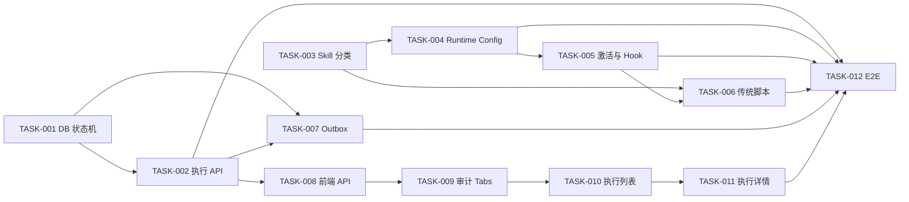

# Tasks: Skill 执行审计与传统 Skill 兼容执行

- **Source**: `.code-flow/tasks/2026-07-14/skill-execution-audit/skill-execution-audit.backend.design.md`, `.code-flow/tasks/2026-07-14/skill-execution-audit/skill-execution-audit.frontend.design.md`
- **Created**: 2026-07-14
- **Updated**: 2026-07-15

## Proposal

建立统一的 Skill 激活、执行和审计边界，让包含或不包含 `muad.skill.json` 的 Skill 都可被 Agent 识别和执行，并保证每次激活都有可查询终态。审计页面拆分为操作审计与 Skill 执行日志两个 Tab，执行遥测通过 Pod State PVC outbox 实现故障期间的最终补传，全程不修改 OpenClaw 上游源码，也不为每个 Skill 单独开发 Tool。

---

## Acceptance Coverage

| 场景ID | 来源设计 | 测试层级 | 关键真实边界 | 最终负责任务 | 状态 |
|--------|---------|---------|-------------|-------------|------|
| S-01 | skill-execution-audit.backend.design.md#2.5 验收条件 | E2E | 真实插件 Tool + Hook + Console API + SQLite | TASK-012 | verified |
| S-02 | skill-execution-audit.backend.design.md#2.5 验收条件 | E2E | 真实传统 Skill 包 + Runtime Config + Pod 插件 | TASK-012 | verified |
| S-03 | skill-execution-audit.backend.design.md#2.5 验收条件 | Integration + E2E | Hook Runner + 原生工具；真实 Pod 补充验证 | TASK-012 | verified |
| S-04 | skill-execution-audit.backend.design.md#2.5 验收条件 | Integration | 真实临时文件 outbox + `httptest` Console | TASK-007 | verified |
| S-05 | skill-execution-audit.backend.design.md#2.5 验收条件 | Integration | HTTP API + SQLite | TASK-002 | verified |
| S-06 | skill-execution-audit.backend.design.md#2.5 验收条件 | E2E | 操作审计 API + 执行日志 API + SQLite | TASK-012 | verified |
| E-01 | skill-execution-audit.backend.design.md#2.5 验收条件 | Integration | 通用 Tool + Console API | TASK-005 | verified |
| E-02 | skill-execution-audit.backend.design.md#2.5 验收条件 | Unit + Integration | 真实临时 Skill 目录与子进程边界 | TASK-006 | verified |
| E-03 | skill-execution-audit.backend.design.md#2.5 验收条件 | Integration | OpenClaw Hook Runner + 脱敏持久化载荷 | TASK-005 | verified |
| E-04 | skill-execution-audit.backend.design.md#2.5 验收条件 | Integration + Manual | outbox 容量限制自动化；真实磁盘写满手工验证 | TASK-007 | verified |
| B-01 | skill-execution-audit.backend.design.md#2.5 验收条件 | Unit + Integration | 同一 runId 的两个 Skill 激活上下文 | TASK-005 | verified |
| B-02 | skill-execution-audit.backend.design.md#2.5 验收条件 | Integration | HTTP API + SQLite 终态记录 | TASK-001 | verified |
| B-03 | skill-execution-audit.backend.design.md#2.5 验收条件 | Integration | HTTP API + SQLite 多页数据 | TASK-002 | verified |
| B-04 | skill-execution-audit.backend.design.md#2.5 验收条件 | Integration + E2E | Prompt Hook + mandatory tool 门禁 + 同会话重复执行 | TASK-005, TASK-012 | verified |
| S-101 | skill-execution-audit.frontend.design.md#2.4 验收条件 | Component + E2E | 真实路由查询参数 + 两类 API | TASK-009 | verified |
| S-102 | skill-execution-audit.frontend.design.md#2.4 验收条件 | Component + E2E | 筛选组件 + 真实列表 API | TASK-010 | verified |
| S-103 | skill-execution-audit.frontend.design.md#2.4 验收条件 | Component | Semi Modal + 详情 API 状态 | TASK-011 | verified |
| S-104 | skill-execution-audit.frontend.design.md#2.4 验收条件 | Component | 项目统一 Pagination | TASK-010 | verified |
| S-105 | skill-execution-audit.frontend.design.md#2.4 验收条件 | Unit + Component | 定时器 + 请求竞态控制 | TASK-010 | verified |
| E-101 | skill-execution-audit.frontend.design.md#2.4 验收条件 | Component | 列表 API 失败和重试 | TASK-010 | verified |
| E-102 | skill-execution-audit.frontend.design.md#2.4 验收条件 | Unit + Component | null/非法 progress + 详情 API 失败 | TASK-011 | verified |
| B-101 | skill-execution-audit.frontend.design.md#2.4 验收条件 | Component + Screenshot | 长文本、Modal 和表格真实渲染 | TASK-011 | verified |

> E-04 使用独立 `1MiB emptyDir.medium=Memory` 临时卷完成手工验证，未写入共享开发磁盘；卷满后遥测暴露 `writeFailed=true`、`lastError=enospc`，Runtime Guard 返回 `ok=false`。

---

## TASK-001: 扩展执行记录 Schema、状态机和幂等序号

- **Status**: done
- **Priority**: P0
- **Depends**:
- **Source**: `skill-execution-audit.backend.design.md#3.3 数据设计`, `skill-execution-audit.backend.design.md#3.5 质量实现方案`
- **Acceptance-Refs**: B-02, RULE-06, RISK-04

### Description

扩展 `skill_execution_records` 的执行模式、激活来源、事件序号、最近工具和终态原因字段，增加 `rejected` 状态，并在 Repository 层实现终态不可逆和事件序号幂等规则。

### Checklist

- [x] [B-02][integration] 修改生产代码前，在 Repository 测试中构造 succeeded 后迟到 running 的场景并记录 RED
- [x] 更新 `schema.go` 和 `models.go`，补齐字段、状态常量和全局开始时间索引
- [x] 更新 `skills.go` 的插入、扫描、筛选和 upsert，只接受更大的 `eventSeq`
- [x] 明确 `running → terminal` 合法迁移，拒绝 terminal → running 和终态互相覆盖
- [x] [B-02] 断言迟到事件返回当前记录且数据库状态、序号、终态原因均不变化
- [x] 增加 Schema 重建和重复初始化测试，确保开发库全量重建可重复执行
- [x] 增加旧版执行表事务迁移，保留已有记录并扩展 `rejected` 状态约束
- [x] 运行 `cd console/backend && go test ./test -run 'SkillExecution|Schema'` 并填写 Acceptance Evidence

### Acceptance Contract

| 场景ID | 测试层级 | 不得 Mock 的真实边界 | 关键断言 | 测试文件 / 用例 | 执行命令 | 状态 |
|--------|---------|--------------------|---------|----------------|---------|------|
| B-02 | integration | SQLite Schema、Repository SQL | 终态不回退；较小 eventSeq 不覆盖；旧表无损迁移 | `console/backend/test/skills_repo_test.go::TestSkillExecutionRepositoryRejectsLateEventAfterTerminal`, `console/backend/test/schema_test.go::TestOpen_MigratesLegacySkillExecutionSchema` | `cd console/backend && go test ./test -run 'TestSkillExecutionRepositoryRejectsLateEventAfterTerminal|TestSchemaSkillExecution|TestOpen_MigratesLegacySkillExecutionSchema'` | verified |

### Acceptance Evidence

- B-02 verified: 真实 SQLite Repository 保持 succeeded 终态和较大 `eventSeq`，迟到 running 不覆盖。
- 旧库 verified: 旧表记录在事务迁移后保留，新增字段使用稳定默认值，并可写入 `rejected` 记录。
- RED: `go test ./test -run 'TestSkillExecutionRepositoryRejectsLateEventAfterTerminal|TestSchemaSkillExecution'` 失败；`SkillExecutionRecord` 缺少 `EventSeq/EntryType/ActivationMode/TerminalReason`，符合预期
- GREEN: `go test ./test -run 'SkillExecution|Schema'` 通过；Repository 返回数据库当前终态，Schema 重复初始化和全局时间索引通过

### Log

- [2026-07-14] created (draft)
- [2026-07-14] started，先建立状态机和 Schema 的失败验收测试
- [2026-07-14] completed，状态机、幂等序号、Schema 与回归测试通过
- [2026-07-15] regression，补齐旧版执行表事务迁移，修复真实数据库列表和告警接口 500

---

## TASK-002: 完善执行记录写入、列表筛选和详情 API

- **Status**: done
- **Priority**: P0
- **Depends**: TASK-001
- **Source**: `skill-execution-audit.backend.design.md#3.4 接口设计`, `skill-execution-audit.backend.design.md#3.3 数据设计`
- **Acceptance-Refs**: S-05, B-03, RULE-07

### Description

扩展 internal upsert 请求和执行日志视图，增加 scope、entryType、时间范围等筛选与详情接口，并将 Skill 运行从平台操作审计中分流。

### Checklist

- [x] [S-05][integration] 修改 Handler 前先覆盖组合筛选、详情和脱敏响应并记录 RED
- [x] 扩展 `skill_executions.go` 的请求、响应和字段校验，沿用 `writeJSON/writeErr`
- [x] 在 `routes.go` 增加 `GET /api/v1/skill-executions/{executionId}`
- [x] 列表响应移除完整 `progressJson`，详情响应返回完整脱敏进度
- [x] Repository 查询支持 scope、entryType、模糊 Skill 名和 RFC3339 时间范围
- [x] 移除执行失败写入 `audit_log` 的重复逻辑，保留上传、删除、启禁用、应用等资产操作审计
- [x] [B-03][integration] 插入跨 2 页数据，断言 10/20/50/100 页量、总数和倒序稳定
- [x] 运行 `cd console/backend && go test ./test -run 'SkillExecution|AuditSemantic'` 并填写 Acceptance Evidence

### Acceptance Contract

| 场景ID | 测试层级 | 不得 Mock 的真实边界 | 关键断言 | 测试文件 / 用例 | 执行命令 | 状态 |
|--------|---------|--------------------|---------|----------------|---------|------|
| S-05 | integration | HTTP Handler、Repository、SQLite | 组合筛选准确；列表无完整进度；详情字段完整且脱敏 | `console/backend/test/skill_executions_api_test.go::TestSkillExecutionAPIListsFiltersDetailsAndRedacts` | `cd console/backend && go test ./test -run 'TestSkillExecutionAPI'` | verified |
| B-03 | integration | HTTP Handler、SQLite 多页记录 | 页量和总数正确；排序无重复漏项 | `console/backend/test/skill_executions_api_test.go::TestSkillExecutionAPIPaginatesStablePageSizes` | `cd console/backend && go test ./test -run 'TestSkillExecutionAPI'` | verified |

### Acceptance Evidence

- S-05 verified: HTTP + SQLite 组合筛选、详情进度和脱敏摘要断言通过。
- B-03 verified: 10/20/50/100 页量的总数、倒序和跨页无重复断言通过。
- RED: `go test ./test -run 'TestSkillExecutionAPI|TestSkillExecutionRuntimeFailureDoesNotWriteOperationAudit'` 失败；新字段被 strict JSON 拒绝、详情路由缺失、失败记录仍进入操作审计
- GREEN: `go test ./test -run 'SkillExecution|AuditSemantic'` 通过；组合筛选、详情脱敏、四档页量及审计分流均由真实 HTTP + SQLite 覆盖

### Log

- [2026-07-14] created (draft)
- [2026-07-14] started，先补组合筛选、详情、分页和审计分流失败测试
- [2026-07-14] completed，执行写入、摘要列表、详情、筛选与分页通过

---

## TASK-003: 扫描并分类无 manifest 的传统 Skill

- **Status**: done
- **Priority**: P0
- **Depends**:
- **Source**: `skill-execution-audit.backend.design.md#2.3 功能方案`, `skill-execution-audit.backend.design.md#3.3 数据设计`
- **Acceptance-Refs**: S-02 (supporting), S-03 (supporting), RULE-02

### Description

调整 Skill 包扫描规则，使 `SKILL.md` 成为唯一必要入口，将 `muad.skill.json` 定位为可选增强，并将资产分类为 managed、traditional-script 或 traditional-prompt。

### Checklist

- [x] [S-02][integration-supporting] 先增加无 manifest、包含 Python 脚本的上传扫描测试并记录 RED
- [x] 在 `skill_bundle.go` 中解析 `SKILL.md`，扫描受支持的相对脚本文件并生成标准化资产元数据
- [x] 保留 managed manifest 的现有校验和优先级，不从自然语言猜测命令参数
- [x] traditional-prompt 未包含脚本时仍标记为有效 Skill，不返回 invalid bundle
- [x] 拒绝缺少 `SKILL.md`、路径逃逸、符号链接逃逸和超出包边界的脚本条目
- [x] 断言脚本清单只保存相对路径，不包含上传临时目录和主机绝对路径
- [x] 运行 `cd console/backend && go test ./internal/api -run SkillBundle` 并填写 Acceptance Evidence

### Acceptance Contract

| 场景ID | 测试层级 | 不得 Mock 的真实边界 | 关键断言 | 测试文件 / 用例 | 执行命令 | 状态 |
|--------|---------|--------------------|---------|----------------|---------|------|
| S-02 | integration supporting | 真实 tar.gz/zip 解包目录与 Skill 扫描器 | 无 manifest 包可扫描；分类为 traditional-script；脚本路径相对 | `console/backend/internal/api/skill_bundle_test.go::TestInspectSkillBundleClassifiesTraditionalScript` | `cd console/backend && go test ./internal/api -run 'TestInspectSkillBundleClassifiesTraditional'` | verified |
| S-03 | integration supporting | 真实 Skill 目录与扫描器 | 无脚本 Skill 分类为 traditional-prompt 且保持 active | `console/backend/internal/api/skill_bundle_test.go::TestInspectSkillBundleClassifiesTraditionalPrompt` | `cd console/backend && go test ./internal/api -run 'TestInspectSkillBundleClassifiesTraditional'` | verified |

### Acceptance Evidence

- S-02 verified: 真实无 manifest 脚本包分类为 `traditional-script`，只保留相对脚本路径。
- S-03 verified: 仅含 `SKILL.md` 的包分类为 `traditional-prompt` 且保持 active。
- RED: `go test ./internal/api -run 'TestInspectSkillBundleClassifiesTraditional'` 失败；两类无 manifest Skill 均被旧逻辑分类为 `prompt-only`
- GREEN: `go test ./internal/api -run SkillBundle` 通过；额外覆盖 managed 优先级和符号链接脚本拒绝
- 最终 Pod 可执行性由 TASK-012 验收。

### Log

- [2026-07-14] created (draft)
- [2026-07-14] started，先建立传统脚本和纯提示 Skill 分类的失败验收测试
- [2026-07-14] completed，三类 entryType、相对脚本清单和路径边界测试通过

---

## TASK-004: 下发完整 Skill Grant 和运行时激活配置

- **Status**: done
- **Priority**: P0
- **Depends**: TASK-003
- **Source**: `skill-execution-audit.backend.design.md#2.3 功能方案`, `skill-execution-audit.backend.design.md#3.2 架构设计`, `skill-execution-audit.backend.design.md#4.1 发布范围`
- **Acceptance-Refs**: S-02 (supporting), S-03 (supporting), RULE-02, NFR-COMPAT-01

### Description

让 Runtime Config 为 managed、traditional-script 和 traditional-prompt 三类有效 Skill 下发 grant、entryType、版本和根路径；业务 Agent 具备受限 `read` 能力，Runtime Guard 仅放行该 Agent 已授权 Skill 的读取，并为运行时插件注入通用激活规则及遥测配置。

### Checklist

- [x] 修改 Runtime Config 测试，先证明 prompt-only Skill 当前被跳过并记录 RED
- [x] 更新 `runtimeconfig/builder.go` 及相关模型，统一生成三类 Skill grant
- [x] 更新 `bin/openclaw-config-renderer.mjs`，向插件下发 activation、outbox 和 Console internal 配置
- [x] 在运行时提示中明确“优先读取精确 `SKILL.md`，无法读取时调用 `muad_use_skill`”，不为每个 Skill 生成独立 Tool
- [x] 业务 Agent 允许原生 `read`，main Agent 保持禁用；Runtime Guard 只放行当前 Agent 授权的 Skill 根且始终拒绝写入
- [x] Renderer 对旧版 Console Runtime DTO 补齐 `read` 和授权根，避免后端、镜像滚动升级期间配置退化
- [x] 运行时应用对已有 `AGENTS.md` 幂等补齐受管激活区块，保留原有自定义内容
- [x] 保持 Public/Private 优先级、冲突标记和用户授权语义不变
- [x] 断言生成配置不包含 Skill 密钥、后台主机路径或未授权 Skill
- [x] 运行 Runtime Config Go 测试和 `node --test bin/test/*skill*.test.mjs`，填写 Acceptance Evidence

### Acceptance Contract

| 场景ID | 测试层级 | 不得 Mock 的真实边界 | 关键断言 | 测试文件 / 用例 | 执行命令 | 状态 |
|--------|---------|--------------------|---------|----------------|---------|------|
| S-02 | integration supporting | Repository 资产、Runtime Config Builder、Renderer | traditional-script grant 和脚本元数据进入最终配置 | `console/backend/test/runtime_builder_test.go::TestRuntimeBuilderIncludesAllSkillGrantTypes` | `cd console/backend && go test ./test -run 'TestRuntimeBuilderIncludesAllSkillGrantTypes'` | verified |
| S-03 | integration supporting | Runtime Config Builder、Renderer、Runtime Guard | traditional-prompt 不被跳过；业务 Agent 可读取授权 Skill，main/跨用户/写入均被拒绝 | `console/backend/test/runtime_builder_test.go`, `bin/test/inject-multi-user-config.test.mjs`, `tools/muad-runtime-guard/test/tool-policies.test.mjs` | `go test ./... && node --test bin/test/*.test.mjs && cd tools/muad-runtime-guard && npm test` | verified |

### Acceptance Evidence

- S-02 verified: Repository 到 Renderer 的真实链路下发 traditional-script grant 和脚本白名单。
- S-03 verified: traditional-prompt grant、通用激活规则与 Agent 指引进入最终配置；业务 Agent 的授权 Skill 只读根进入 Runtime Guard，main、跨用户、未授权路径和写入保持拒绝；已有 workspace 可幂等升级且不覆盖自定义内容。
- RED: Go 测试因 grant 缺少 `EntryType/RootPath/Version/ScriptFiles` 无法编译；Node 测试因插件缺少 activation/telemetry 配置失败
- GREEN: Runtime Builder/Config 测试、`node --test bin/test/*.test.mjs` 与后端全量测试通过；三类 grant 均包含容器路径、版本和脚本白名单
- 最终真实 Pod 加载由 TASK-012 验收。

### Log

- [2026-07-14] created (draft)
- [2026-07-14] started，先证明 prompt Skill 被跳过且 grant 元数据未下发
- [2026-07-14] completed，完整 grant、激活配置、遥测配置和 Agent 指引已下发
- [2026-07-15] corrected，补齐业务 Agent 原生 `read`、旧 DTO 渲染兼容和 Runtime Guard 授权 Skill 只读根

---

## TASK-005: 实现通用 Skill 激活和 Run 生命周期 Hook

- **Status**: done
- **Priority**: P0
- **Depends**: TASK-004
- **Source**: `skill-execution-audit.backend.design.md#3.2 架构设计`, `skill-execution-audit.backend.design.md#3.4 接口设计`, `skill-execution-audit.backend.design.md#3.5 质量实现方案`
- **Acceptance-Refs**: S-03, E-01, E-03, B-01, B-04, RULE-01, RULE-04, RULE-08, RULE-09, RULE-10, RULE-11, RISK-01, RISK-05

### Description

在现有插件内把“读取授权 Skill 的精确 `SKILL.md`”作为原生激活入口，保留单一 `muad_use_skill` Tool 作为显式后备，建立以 runId 为主键的执行上下文，并通过 OpenClaw 公开 `before_tool_call`、`after_tool_call`、`agent_end` Hook 归集原生工具执行和终态。

### Checklist

- [x] [E-01][integration] 先增加未授权 Skill 激活测试，断言生成 rejected 遥测并记录 RED
- [x] 扩展 `execution-context.mjs`，维护 executionId、eventSeq、当前 Skill、进度和终态
- [x] 在插件入口注册 `muad_use_skill`，授权成功后返回 `SKILL.md`、scope、version、entryType
- [x] 注册 `before_prompt_build` Hook，仅对有授权 Skill 的用户注入“每轮、重试和继续均重新激活”协议
- [x] 新增 Hook 生命周期模块，使用 runId 关联 before/after tool 和 agent_end
- [x] 从标准 `read.params.path` 识别原生读取，仅精确命中授权根下的 `SKILL.md` 时自动激活
- [x] 从标准 `SKILL.md description` 解析 mandatory tools，并在模型绕过激活直接调用时通过 `before_tool_call` 阻断并返回精确路径
- [x] 可选 `derivedPaths` 仅作为补充信号；无 runId 的回退键必须输出结构化告警
- [x] [E-03][integration] 工具失败记录为可恢复进度；Agent 失败才形成 failed 终态，错误摘要脱敏
- [x] [S-03][integration] 工具失败后重试成功时，Agent 成功终态覆盖整次执行结果且保留失败过程
- [x] [B-01][unit+integration] 同一 Run 切换 Skill 时前一个以 handoff 关闭，新 Skill 使用新 executionId
- [x] 防止 `muad_use_skill`、遥测 Tool 自身递归进入工具进度
- [x] 运行 `cd tools/muad-run-skill && npm test` 并填写 Acceptance Evidence

### Acceptance Contract

| 场景ID | 测试层级 | 不得 Mock 的真实边界 | 关键断言 | 测试文件 / 用例 | 执行命令 | 状态 |
|--------|---------|--------------------|---------|----------------|---------|------|
| E-01 | integration | Tool 注册、grant 校验、Reporter 调用 | 不泄露 Skill 内容；状态 rejected；稳定错误码 | `tools/muad-run-skill/test/activation.test.mjs::rejects unauthorized activation without exposing Skill content` | `node --test test/activation.test.mjs` | verified |
| E-03 | integration | OpenClaw Hook Runner 兼容接口、Reporter 载荷 | 工具失败保持 running；Agent 失败形成 failed；错误脱敏 | `tools/muad-run-skill/test/hook-lifecycle.test.mjs::keeps a tool failure as progress until the agent reports failure` | `node --test test/hook-lifecycle.test.mjs` | verified |
| S-03 | integration | Tool Event 与 Agent Event 生命周期 | 工具失败后 Agent 成功形成 succeeded，失败过程仍可见 | `tools/muad-run-skill/test/hook-lifecycle.test.mjs::allows a successful agent result after a recoverable tool failure`, `tools/muad-run-skill/test/agent-event-lifecycle.test.mjs::agent lifecycle success wins after an intermediate Tool error` | `node --test test/hook-lifecycle.test.mjs test/agent-event-lifecycle.test.mjs` | verified |
| B-01 | unit + integration | 同一 runId 的真实上下文实例 | executionId 不复用；进度不串线；handoff 原因正确 | `tools/muad-run-skill/test/hook-lifecycle.test.mjs::closes the prior Skill with handoff on the same run` | `node --test test/hook-lifecycle.test.mjs` | verified |
| B-04 | integration | Prompt Hook 注册、原生 read 参数、用户授权清单、已有 workspace 文件 | 每轮重新读取精确 `SKILL.md` 或调用后备 Tool；非 `SKILL.md` 文件不触发激活；旧文件升级后保留自定义内容且不重复写入 | `tools/muad-run-skill/test/activation.test.mjs`, `hook-lifecycle.test.mjs`, `bin/test/inject-multi-user-config.test.mjs` | `npm test && node --test ../../bin/test/inject-multi-user-config.test.mjs` | verified |
| S-03 | integration | 标准 `SKILL.md description`、公开 `before_tool_call` Hook、Run 上下文 | 未激活 mandatory tool 被阻断；精确读取后重试放行并启动 path-detected 审计；Skill 正文中的偶然工具词不误判 | `tools/muad-run-skill/test/tool-activation-gate.test.mjs` | `node --test test/tool-activation-gate.test.mjs` | verified |

### Acceptance Evidence

- E-01 verified: 未授权激活形成 `rejected` 和稳定错误码，响应不泄露 Skill 内容。
- E-03 verified: 工具失败形成脱敏进度但不提前终止；Agent 异常结束形成 failed，并记录最后工具与耗时。
- S-03 verified: browser 超时后 Agent 重试成功，最终状态为 succeeded，progress 保留 tool-failed。
- B-01 verified: 同 Run 切换 Skill 以 handoff 关闭前一个 executionId，进度不串线。
- B-04 verified: Prompt Hook 对授权用户逐轮注入协议；真实 `read.params.path` 可激活精确 `SKILL.md`，同目录其他文件不会误激活；已有 workspace 受管区块幂等更新并保留自定义内容。
- S-03 deterministic gate verified: RED 因 `tool-activation-gate.mjs` 不存在而失败；GREEN 覆盖 `browser` 未激活阻断、精确 Skill 激活后放行、正文偶然工具词不误判。真实 `web-tools-guide` 解析结果为 `browser/opencli/web_fetch/web_search`。
- RED: `node --test test/activation.test.mjs test/hook-lifecycle.test.mjs test/execution-context.test.mjs` 失败；`activation.mjs`、`hook-lifecycle.mjs` 尚不存在，且可信上下文未保留 `runId`，符合预期。
- GREEN: `npm test` 通过 54 个插件测试；Runtime Guard 42/42；`node --test bin/test/*.test.mjs` 28/28，Runtime Builder 与配置渲染测试通过。
- 公开 API 兼容: 插件入口仅通过 `api.registerTool` 和 `api.on("before_tool_call"/"after_tool_call"/"agent_end")` 注册；Tool 与 Hook 上下文按本地 OpenClaw `src/plugins/hook-types.ts` 公开字段实现。
- 无上游源码修改: 所有实现均位于本仓库 `tools/muad-run-skill`、Runtime Config Builder 和 renderer，未编辑 `/Users/jahan/workspace/openclaw`。

### Log

- [2026-07-14] created (draft)
- [2026-07-14] started，先证明未授权激活、工具失败终态和同 Run 切换隔离尚未实现
- [2026-07-14] completed，通用 Tool、路径激活、Run 隔离、Hook 终态和工具策略测试通过
- [2026-07-15] corrected，工具级失败改为可恢复进度，最终状态由 Agent/Runner 生命周期决定
- [2026-07-15] corrected，原生 `read.params.path` 精确读取 `SKILL.md` 成为主激活入口，`muad_use_skill` 保留为后备
- [2026-07-15] corrected，真实企微证明模型可能绕过 Prompt 直接调用 browser；增加标准 description mandatory tool 门禁并完成 RED/GREEN

---

## TASK-006: 实现传统脚本兼容执行和路径安全校验

- **Status**: done
- **Priority**: P0
- **Depends**: TASK-003, TASK-005
- **Source**: `skill-execution-audit.backend.design.md#2.3 功能方案`, `skill-execution-audit.backend.design.md#3.4 接口设计`, `skill-execution-audit.backend.design.md#3.5 质量实现方案`
- **Acceptance-Refs**: E-02, RULE-03, RISK-03

### Description

为 `muad_run_skill` 增加无 manifest 的兼容参数，以 `skill_name + script_path + args` 执行受控脚本，同时保留 managed manifest 的现有步骤模式。

### Checklist

- [x] [E-02][unit] 先增加绝对路径、`../`、符号链接逃逸和原始 shell 字符串测试并记录 RED
- [x] 扩展 `tool-params.mjs`，区分 managed 与 traditional 参数且保持类型严格
- [x] 扩展 `command-policy.mjs/runner.mjs`，通过 realpath 验证目标仍位于 Skill 根目录
- [x] `args` 逐项传给子进程，不使用 shell 拼接；解释器按允许列表和脚本类型解析
- [x] 只允许扫描资产记录的脚本文件，拒绝隐藏文件、目录和未知路径
- [x] 兼容 `.sh/.py/.js` 及现有 manifest steps/entrypoint，不改变并发队列和进度消息行为
- [x] [E-02][integration] 断言被拒绝路径不启动子进程并形成 rejected 记录
- [x] 运行 `cd tools/muad-run-skill && npm test` 并填写 Acceptance Evidence

### Acceptance Contract

| 场景ID | 测试层级 | 不得 Mock 的真实边界 | 关键断言 | 测试文件 / 用例 | 执行命令 | 状态 |
|--------|---------|--------------------|---------|----------------|---------|------|
| E-02 | unit + integration | 真实临时目录、符号链接、子进程启动边界 | 路径逃逸均拒绝；合法相对脚本可执行；拒绝时无子进程 | `tools/muad-run-skill/test/traditional-runner.test.mjs`, `tool-params.test.mjs` | `node --test test/traditional-runner.test.mjs test/tool-params.test.mjs` | verified |

### Acceptance Evidence

- E-02 verified: 真实子进程执行三类合法脚本；所有路径逃逸在启动子进程前被拒绝。
- RED: `node --test test/traditional-runner.test.mjs test/tool-params.test.mjs` 失败；传统 runner 模块不存在，参数解析没有 managed/traditional 判别，符合预期。
- GREEN: 合法 `.sh/.py/.js` 使用真实子进程执行通过；绝对路径、遍历、隐藏路径、未知路径、目录和符号链接逃逸均被拒绝，外部 marker 文件未创建；`npm test` 共 47 项通过。

### Log

- [2026-07-14] created (draft)
- [2026-07-14] started，先证明传统参数、路径逃逸和真实多语言脚本执行尚未实现
- [2026-07-14] completed，传统 argv 执行、三类解释器和路径白名单边界测试通过

---

## TASK-007: 实现可靠遥测 outbox、重试和健康告警

- **Status**: done
- **Priority**: P0
- **Depends**: TASK-001, TASK-002
- **Source**: `skill-execution-audit.backend.design.md#3.5 质量实现方案`, `skill-execution-audit.backend.design.md#4.3 监控与告警`
- **Acceptance-Refs**: S-04, E-04, RULE-05, NFR-REL-01, NFR-PERF-01, RISK-02

### Description

将执行遥测改为异步有界队列，并在 Console 不可用时把脱敏快照写入 State PVC outbox；恢复后按 eventSeq 重放，同时暴露写入失败和积压健康状态。

### Checklist

- [x] [S-04][integration] 使用真实 HTTP Server 先模拟首次失败、随后恢复，断言当前实现丢记录并记录 RED
- [x] 新增 outbox 模块，使用 NDJSON、校验和和原子追加保存脱敏事件
- [x] 扩展 `telemetry.mjs`，网络失败进入 outbox，启动和定时器触发有界重放
- [x] Hook 热路径只更新内存并入队，不同步等待 Console 网络调用
- [x] 重放按 executionId/eventSeq 幂等，损坏行隔离并输出结构化错误
- [x] [E-04][integration] 覆盖容量上限、文件不可写、Console 持续失败，断言已有记录不被覆盖
- [x] 将 outbox pending/write failed 暴露到现有 Runtime Guard 健康结果和日志
- [x] [E-04][manual] 在测试 Pod 将专用小容量临时卷写满，确认健康告警出现；不得写满共享开发磁盘
- [x] 运行插件遥测测试和 Console internal API 测试并填写 Acceptance Evidence

### Acceptance Contract

| 场景ID | 测试层级 | 不得 Mock 的真实边界 | 关键断言 | 测试文件 / 用例 | 执行命令 | 状态 |
|--------|---------|--------------------|---------|----------------|---------|------|
| S-04 | integration | 真实 outbox 文件、HTTP server、Console SQLite | 失败入盘；恢复补传；最终仅一条正确终态 | `tools/muad-run-skill/test/telemetry.test.mjs::persists failed telemetry and replays it after Console recovery` + backend API test | `node --test test/telemetry.test.mjs && go test ./test -run TestSkillExecution` | verified |
| E-04 | integration + manual | 真实文件系统错误；手工仅限专用测试卷磁盘写满 | 不覆盖已有 outbox；结构化错误和健康告警可见 | `tools/muad-run-skill/test/outbox.test.mjs`；专用测试卷手工记录 | `node --test test/outbox.test.mjs` | verified |

### Acceptance Evidence

- S-04 verified: HTTP 503 时事件进入真实 outbox，Console 恢复后按序补传并只保留正确终态。
- E-04 verified: 容量、不可写和独立内存卷写满均产生结构化健康失败，已有 outbox 不被覆盖。
- RED: Node 测试因 `outbox.mjs/createSkillTelemetryClient` 不存在失败；Runtime Guard 缺少 telemetry 健康段；Go 监控快照缺少 outbox 字段，符合预期。
- GREEN: 插件 47 项、Runtime Guard 41 项测试通过；后端 Skill execution、Collector、Alerts 测试通过。HTTP 503 后两条事件写入真实 outbox，恢复后按序补传并删除文件；持久化内容不含测试 secret。
- 手工专用测试卷: `1MiB emptyDir.medium=Memory` 写满后产生 `ENOSPC`；错误码规范化 RED 为 `EEXIST != eexist`，修复后运行时快照为 `writeFailed=true, dropped=1, lastError=enospc`，Runtime Guard 为 `ok=false`。测试 Pod 随即删除。

### Log

- [2026-07-14] created (draft)
- [2026-07-14] started，先证明 Console 故障会丢事件且运行时健康不包含 outbox 状态
- [2026-07-14] automated complete，专用测试卷磁盘满验证并入 TASK-012 真实 Pod 阶段
- [2026-07-15] completed，独立内存卷磁盘满和 Runtime Guard 告警完成真实验证

---

## TASK-008: 扩展前端执行日志类型和 API 封装

- **Status**: done
- **Priority**: P0
- **Depends**: TASK-002
- **Source**: `skill-execution-audit.frontend.design.md#3.5 状态与数据流`, `skill-execution-audit.frontend.design.md#3.6 表格与详情设计`
- **Acceptance-Refs**: S-102 (supporting), S-103 (supporting), E-102 (supporting)

### Description

更新严格 TypeScript 类型和统一 API 客户端，支持 rejected、entryType、activationMode、详情查询及新增筛选参数，为审计 UI 提供稳定契约。

### Checklist

- [x] 先在 `api.test.ts` 增加列表参数编码和详情响应测试并记录 RED
- [x] 更新 `types/api.ts` 的状态联合类型、列表摘要、详情和查询类型
- [x] 更新 `api.ts` 的 `listSkillExecutions` 和 `getSkillExecution`，禁止页面裸 `fetch`
- [x] progress 类型允许后端空值，解析逻辑不使用 loose typing
- [x] 断言查询参数不发送空字符串，时间范围按 API 契约编码
- [x] 运行 `cd console/frontend && npx vitest run test/api.test.ts && npx tsc --noEmit`

### Acceptance Contract

| 场景ID | 测试层级 | 不得 Mock 的真实边界 | 关键断言 | 测试文件 / 用例 | 执行命令 | 状态 |
|--------|---------|--------------------|---------|----------------|---------|------|
| S-102 | unit supporting | API request 封装 | 筛选参数和分页正确编码 | `console/frontend/test/api.test.ts::encodes every Skill execution filter and omits blank values` | `cd console/frontend && npx vitest run test/api.test.ts` | verified |
| S-103 | unit supporting | API request 封装 | 详情路径和响应类型正确 | `console/frontend/test/api.test.ts::loads a Skill execution detail through an encoded path` | `cd console/frontend && npx vitest run test/api.test.ts` | verified |
| E-102 | unit supporting | API 响应类型 | progress 允许 null/非法值进入安全解析边界 | `console/frontend/test/skillProgress.test.ts` | `cd console/frontend && npx vitest run test/skillProgress.test.ts` | verified |

### Acceptance Evidence

> 最终 UI 场景由 TASK-010/011 验收。

- S-102 verified: 查询 DTO 编码全部筛选和分页参数，并省略空字符串。
- S-103 verified: 详情 API 使用编码后的 executionId 路径并返回严格类型。
- E-102 verified: progress 类型允许 null/非法值进入统一安全解析函数。
- RED: 完整筛选断言缺少 `scope/entryType/startedFrom/startedTo`，详情调用报 `getSkillExecution is not a function`。
- GREEN: `npx vitest run test/api.test.ts` 19/19 通过；`npx tsc --noEmit` 通过。

### Log

- [2026-07-14] created (draft)
- [2026-07-14] started，先补执行日志列表查询与详情 API 的 RED 测试
- [2026-07-14] completed，严格 DTO、完整查询编码和详情 API 已落地

---

## TASK-009: 将审计页面重构为两个独立 Tab

- **Status**: done
- **Priority**: P0
- **Depends**: TASK-008
- **Source**: `skill-execution-audit.frontend.design.md#3.2 页面与路由结构`, `skill-execution-audit.frontend.design.md#3.3 组件设计`, `skill-execution-audit.frontend.design.md#3.5 状态与数据流`
- **Acceptance-Refs**: S-101, RISK-FE-03

### Description

把现有审计列表提取为操作审计 Tab，并新增 Skill 执行日志 Tab 容器。两个 Tab 独立维护筛选和分页，当前 Tab 通过 URL 查询参数持久化。

### Checklist

- [x] [S-101][component] 先增加 Tab 切换、URL 恢复和状态隔离测试并记录 RED
- [x] 重构 `Audit.tsx` 为页面容器，使用 Semi `Tabs`
- [x] 提取 `OperationAuditTab`，保持现有查询、列表、分页和错误反馈行为
- [x] 增加 `SkillExecutionLogTab` 占位容器，为后续列表任务提供组件边界
- [x] 非法 tab 参数回退 operations；刷新页面不能跳到 Pod 管理
- [x] 两个 Tab 的请求只在各自激活时触发，切换后保留本地状态
- [x] [S-101][E2E] 用真实路由和 API mock server 验证刷新恢复及两类数据不混合
- [x] 运行 `cd console/frontend && npx vitest run test/Audit.test.tsx`

### Acceptance Contract

| 场景ID | 测试层级 | 不得 Mock 的真实边界 | 关键断言 | 测试文件 / 用例 | 执行命令 | 状态 |
|--------|---------|--------------------|---------|----------------|---------|------|
| S-101 | component + E2E | React Router 查询参数、两个 API 入口 | 切换与刷新恢复正确；状态隔离；数据不混合 | `console/frontend/test/Audit.test.tsx` + 页面 E2E | `cd console/frontend && npx vitest run test/Audit.test.tsx` | verified |

### Acceptance Evidence

- S-101 verified: URL 恢复、非法参数回退、Tab 状态和两个 API 请求均保持隔离。
- RED: 旧页面只有单一操作审计列表，`?tab=skill-executions` 无法恢复且会请求错误数据源。
- GREEN: `Audit.test.tsx` 覆盖 URL 恢复、非法参数回退、Tab 状态隔离和 API 请求隔离；前端全量 120 项测试通过。
- 浏览器: 直接访问及刷新 `?tab=operations`、`?tab=skill-executions` 均保持当前 Tab，两个列表内容互不混合。

### Log

- [2026-07-14] created (draft)
- [2026-07-14] started，先补 Tab、URL 恢复和请求隔离 RED 测试
- [2026-07-15] completed，双 Tab、URL 状态和请求隔离完成组件与浏览器验证

---

## TASK-010: 实现 Skill 执行列表、筛选、分页和运行中刷新

- **Status**: done
- **Priority**: P0
- **Depends**: TASK-009
- **Source**: `skill-execution-audit.frontend.design.md#3.3 组件设计`, `skill-execution-audit.frontend.design.md#3.5 状态与数据流`, `skill-execution-audit.frontend.design.md#3.6 表格与详情设计`, `skill-execution-audit.frontend.design.md#3.7 UI 四态`
- **Acceptance-Refs**: S-102, S-104, S-105, E-101, RISK-FE-02

### Description

实现只读 Skill 执行表格、右上角筛选、统一分页和有条件轮询；操作区和过滤区遵循全平台列表布局，不在表头上方增加页量控件。

### Checklist

- [x] [S-102][component] 先覆盖 Skill 名、状态、Pod 组合筛选并记录 RED
- [x] 实现 `SkillExecutionToolbar`，搜索和筛选位于列表右上角
- [x] 实现 `SkillExecutionTable`，展示用户/Agent、Pod、Skill、模式、状态、耗时、最近工具和结果摘要
- [x] Pod 字段可跳转 Pod 详情，状态和 scope 使用 Semi Tag 语义色
- [x] [S-104] 复用统一 Pagination，默认 10，页量 10/20/50/100 位于翻页左侧
- [x] [S-105] 仅 Tab 激活且当前页含 running 时启动定时刷新，终态后停止
- [x] 使用 requestId/mountedRef 防止旧请求覆盖和卸载后更新状态
- [x] [E-101] 列表失败显示 FeedbackBanner，保留筛选并支持重新查询
- [x] 运行 Audit 组件测试、TypeScript 和 ESLint 并填写 Acceptance Evidence

### Acceptance Contract

| 场景ID | 测试层级 | 不得 Mock 的真实边界 | 关键断言 | 测试文件 / 用例 | 执行命令 | 状态 |
|--------|---------|--------------------|---------|----------------|---------|------|
| S-102 | component + E2E | 筛选组件、API query、表格渲染 | 组合筛选准确；总数和当前页正确 | `console/frontend/test/Audit.test.tsx` + 页面 E2E | `cd console/frontend && npx vitest run test/Audit.test.tsx` | verified |
| S-104 | component | 项目统一 Pagination 组件 | 页量位置和选项正确；切换回第 1 页 | `console/frontend/test/Audit.test.tsx` | `cd console/frontend && npx vitest run test/Audit.test.tsx` | verified |
| S-105 | unit + component | fake timer、请求竞态逻辑 | 仅 running 且 Tab 激活时轮询；终态停止 | `console/frontend/test/Audit.test.tsx` | `cd console/frontend && npx vitest run test/Audit.test.tsx` | verified |
| E-101 | component | API reject、页面错误组件 | 不白屏；错误可见；筛选保留；可重试 | `console/frontend/test/Audit.test.tsx` | `cd console/frontend && npx vitest run test/Audit.test.tsx` | verified |

### Acceptance Evidence

- S-102 verified: Skill、Pod、Agent、用户、状态和时间组合筛选返回正确列表与总数。
- S-104 verified: 统一分页提供 10/20/50/100，切换页量后回到第 1 页。
- S-105 verified: 仅激活 Tab 中存在 running 时轮询，进入终态后停止。
- E-101 verified: 列表 API 失败保留筛选、显示错误并允许重试，无白屏。
- RED: Skill 执行 Tab 尚无组合筛选、统一分页和 running 条件轮询，新增组件测试按预期失败。
- GREEN: Skill 名、Pod、Agent、用户、状态、时间范围、失败重试、页量复位及轮询停止均由 `Audit.test.tsx` 覆盖；TypeScript、ESLint、Prettier 通过。
- 浏览器: `mss-report-skill` 筛选将真实列表缩小为 2 条；页量控件位于翻页左侧并提供 10/20/50/100。

### Log

- [2026-07-14] created (draft)
- [2026-07-15] completed，列表、组合筛选、统一分页和条件轮询完成验证

---

## TASK-011: 实现执行详情弹窗和异常数据保护

- **Status**: done
- **Priority**: P0
- **Depends**: TASK-010
- **Source**: `skill-execution-audit.frontend.design.md#3.4 组件接口契约`, `skill-execution-audit.frontend.design.md#3.6 表格与详情设计`, `skill-execution-audit.frontend.design.md#3.8 样式与交互约定`
- **Acceptance-Refs**: S-103, E-102, B-101, RISK-FE-01, RISK-FE-04

### Description

增加执行详情 Modal，展示基本信息、生命周期、脱敏输入/输出和错误，并对 null、非法进度及超长内容提供稳定降级。

### Checklist

- [x] [E-102][unit] 先构造 null、空数组和非法 progress 响应，证明页面不再访问 null `.length` 并记录 RED
- [x] 实现 `SkillExecutionDetailModal`，打开时按 executionId 加载详情，关闭时清理状态
- [x] 展示 executionId、用户、Agent、Pod、Skill、模式、状态、开始/结束、耗时和终态原因
- [x] 生命周期解析失败回退“暂无进度明细”，详情 API 失败显示 Modal 内错误和重试
- [x] [B-101] 表格摘要 ellipsis + Tooltip，详情文本换行且不撑破 Modal
- [x] Modal 使用统一顶部间距和内容滚动，底部不增加重复关闭按钮
- [x] 增加深浅主题组件截图，检查长文本、错误态和空进度布局
- [x] 运行组件测试、TypeScript、ESLint 和 Prettier 检查

### Acceptance Contract

| 场景ID | 测试层级 | 不得 Mock 的真实边界 | 关键断言 | 测试文件 / 用例 | 执行命令 | 状态 |
|--------|---------|--------------------|---------|----------------|---------|------|
| S-103 | component | Semi Modal、详情请求状态 | 字段和进度可见；关闭后列表状态不变 | `console/frontend/test/Audit.test.tsx` | `cd console/frontend && npx vitest run test/Audit.test.tsx` | verified |
| E-102 | unit + component | progress 解析、API reject、Modal error UI | null/非法数据不白屏；空态和重试可见 | `console/frontend/test/Audit.test.tsx`, `skillProgress.test.ts` | `cd console/frontend && npx vitest run test/Audit.test.tsx test/skillProgress.test.ts` | verified |
| B-101 | component + screenshot | 浏览器真实布局和主题 token | 长文本不溢出；Modal 尺寸稳定；Tooltip 可见 | Audit screenshot test | `/tmp/skill-execution-audit-detail.png` | verified |

### Acceptance Evidence

- S-103 verified: 详情字段、生命周期、脱敏摘要及关闭后列表状态均由组件测试覆盖。
- E-102 verified: null、空数组、非法 JSON 和详情请求失败均稳定降级并支持重试。
- B-101 verified: 长摘要和错误可换行，深浅主题 Modal 在桌面视口均无溢出。
- RED: `progress=null` 会触发 `.length` 异常，非法 JSON 缺少稳定降级；详情失败无 Modal 内重试。
- GREEN: progress 解析仅接受合法字符串字段，null、空数组和非法 JSON 均回退空态；详情加载、重试、关闭状态和长文本由组件测试覆盖。
- 浏览器截图: 深色 `/tmp/skill-execution-audit-detail.png`、浅色 `/tmp/skill-execution-audit-detail-light.png`；1800x952 视口下 `scrollWidth=clientWidth=1800`，Modal top=152、bottom=902，无横向溢出。

### Log

- [2026-07-14] created (draft)
- [2026-07-15] completed，详情、异常数据降级和桌面布局完成组件与浏览器验证

---

## TASK-012: 完成真实 Pod 跨栈 E2E 和回归验证

- **Status**: done
- **Priority**: P0
- **Depends**: TASK-002, TASK-004, TASK-005, TASK-006, TASK-007, TASK-011
- **Source**: `skill-execution-audit.backend.design.md#2.5 验收条件`, `skill-execution-audit.backend.design.md#4.1 发布范围`, `skill-execution-audit.frontend.design.md#2.4 验收条件`
- **Acceptance-Refs**: S-01, S-02, S-03, S-06, RULE-01, RULE-02, RULE-07, NFR-COMPAT-01

### Description

构建最新 Console 和 OpenClaw 运行时镜像，在真实测试 Pod 中验证 managed、传统脚本和原生工具型 Skill 的完整链路，并验证操作审计和执行日志严格分流。

### Checklist

- [x] [S-01][E2E] 在部署前准备 managed Skill 用例，记录旧镜像无法形成完整成功审计的 RED
- [x] 构建带唯一 tag/digest 的 Console 和 OpenClaw 镜像，滚动升级测试 Pod 并确认插件版本
- [x] [S-01] 从真实 Agent 触发 managed Skill，断言单条记录从 running 到 succeeded，身份、Pod、耗时正确
- [x] [S-02] 上传无 manifest 的脚本 Skill，应用后从真实 Agent 激活并执行，断言模式为 traditional-script
- [x] [S-03] 上传只使用 browser/web 工具的传统 Skill，断言 Hook 记录最近工具并在 agent_end 写入成功终态
- [x] [S-06] 同时保留 Skill 管理操作和执行记录，断言两个审计 Tab 数据互不重复
- [x] 验证 Private Skill 上传自动生效、Public Skill 应用全 Pod 生效、禁用删除同步逻辑无回归
- [x] 验证 Hook 不改变 Agent 最终回复和工具结果，多用户身份由 Agent grant 与执行 API 再次核对
- [x] 运行后端、前端、插件完整测试集并保存镜像 digest、Pod 日志、API 响应和页面截图
- [x] 清理临时 Skill 与无效测试记录，保留最新成功验收记录和可复现命令

### Acceptance Contract

| 场景ID | 测试层级 | 不得 Mock 的真实边界 | 关键断言 | 测试文件 / 用例 | 执行命令 | 状态 |
|--------|---------|--------------------|---------|----------------|---------|------|
| S-01 | E2E | 真实 Agent、插件 Tool/Hook、Console API、SQLite | managed Skill 只有一条完整成功记录 | 真实 Pod Agent CLI + Console API | `openclaw agent ... && GET /api/v1/skill-executions` | verified |
| S-02 | E2E | 真实传统 Skill 包、PVC、Runtime Config、Pod 插件 | 无 manifest 可识别、执行、审计 | 真实 Pod Agent CLI + Console API | `openclaw agent ... && GET /api/v1/skill-executions` | verified |
| S-03 | E2E | 真实 Agent、browser/web Tool、agent_end Hook | 原生工具调用归入正确 Skill 并形成终态 | 真实 Pod browser + Agent CLI + Console API | `openclaw browser start && openclaw agent ...` | verified |
| S-06 | E2E | 操作审计 API、执行日志 API、SQLite、前端 Tabs | 资产操作和执行记录不重复、不串表 | E2E API/UI test | 两个 API 字段分流 + 浏览器双 Tab | verified |

### Acceptance Evidence

- 镜像: Console `muad-console:dev-20260715-skill-audit2` = `sha256:3070e59c...b042`；最终 Runtime `muad-openclaw:dev-20260715-skill-audit18` = `sha256:9d8b24f4e40004eb5317fe900922c2686affd82c71e1243ca67adabef993bf13`。Deployment 为 Ready，Pod 配置 generation 44/44，启动自检 `openclaw=2026.6.10 status=ok`。
- S-01 verified (managed): 私有版 `skills/_templates/example-long-task` 完成 5 个阶段；执行 `f1b460e4-b836-41a0-ad53-4b71aa1ae446` 为 `succeeded/eventSeq=7/entryType=managed/terminalReason=runner`。将 `visibility=public` 包错误安装到 private 的负例稳定返回 `skill_manifest_unavailable`。
- S-02 verified (traditional-script): 无 `muad.skill.json` 的 `mss-report-skill` 从用户 PVC 识别并执行；记录 `0a5ef722-26e9-49ca-a032-f5b17eafbc30` 为 `succeeded/eventSeq=4/terminalReason=runner`。
- S-03 RED: `skill-audit17` 下真实企微 14:08 成功调用两次 `browser`，但 DeepSeek 未读取 Skill 或调用 `muad_use_skill`，因此没有可信激活信号且无执行记录，证明 Prompt 不能作为强制边界。
- S-03 GREEN (traditional-prompt): `skill-audit18` 中对抗性请求明确要求“不读取 Skill，直接 browser”。轨迹首个 `browser` 被门禁以 `plugin-before-tool-call` 阻断并返回 `/opt/openclaw-skills/web-tools-guide/SKILL.md`；随后精确读取、`muad_use_skill` 和 browser 重试成功。记录 `a8a1deeb-aca3-4f63-a1fd-9ba4ad6417f9` 为 `succeeded/activationMode=path-detected/eventSeq=16/lastToolName=browser/terminalReason=agent_end/duration=38431ms`。
- B-04 GREEN: 同一 sessionKey 再发“再次抓取”产生独立记录 `4ce576a1-be74-4a38-bf05-05b2e8e660b5`，为 `succeeded/activationMode=tool/eventSeq=6/lastToolName=browser/duration=25924ms`。Console API 最新两项和浏览器 UI 的 14:30、14:32 两行一致。
- Hook RED/GREEN: 工具超时曾提前写入 failed，导致后续成功 `agent_end` 无法覆盖；修复后工具错误保留为 running 进度，插件最终 51/51 通过。
- S-06 verified: 操作审计返回 `action/actor/target`，执行接口返回 `executionId/status/entryType`；抽样结果 `actionLeakedIntoExecutions=false`、`executionLeakedIntoOperations=false`。浏览器双 Tab 与刷新恢复验证通过。
- UI: 深色 `/tmp/skill-execution-audit-detail.png`、浅色 `/tmp/skill-execution-audit-detail-light.png`、门禁 E2E 列表 `/tmp/skill-execution-audit-gate.png`；详情字段、进度、筛选、分页及无横向溢出均已检查。
- 回归: `go test ./...`；muad-run-skill 54/54；Runtime Guard 42/42；`node --test bin/test/*.test.mjs` 28/28；前端 TypeScript、ESLint、Prettier 通过，Vitest 18 文件 120/120。
- 数据兼容: 启动迁移将旧 `prompt-only/script` 规范化为 `traditional-prompt/traditional-script`，避免升级时 Runtime Config 校验失败。
- UI/API: Skill、Pod、用户和 Agent 合并为单个 `q` 模糊搜索框；旧分字段参数继续兼容。
- 真实恢复验证: Pod 遥测地址恢复为 `http://host.internal:8080`，Runtime Guard 为 `ok=true/generation=35`；真实服务令牌上报测试记录后，详情 API 返回 `succeeded/eventSeq=2`，测试记录已删除。
- 清理: 临时 managed 资产已删除，Pod 配置收敛到 44/44；用户私有目录仅保留 `mss-report-skill`，公共目录仅保留 `skill-vetter`、`web-tools-guide`。保留最新真实成功记录用于页面验收，其余临时 E2E 资源已清理。

### Log

- [2026-07-14] created (draft)
- [2026-07-15] started，构建唯一镜像并在真实 Pod 验证 managed、traditional-script、traditional-prompt
- [2026-07-15] completed，三类执行、双审计分流、最终镜像和完整回归均通过
- [2026-07-15] corrected，以原生 `read SKILL.md` 重做 traditional-prompt E2E，API、SQLite 与审计页面均显示最新成功记录
- [2026-07-15] corrected，升级 `skill-audit18` 并增加 mandatory tool 门禁；真实首次与同会话重复执行均独立落库并由 UI 验证

---

## Dependency Summary

建议执行顺序：

1. TASK-001 与 TASK-003 并行。
2. TASK-002 与 TASK-004 在各自依赖完成后并行。
3. TASK-005、TASK-007、TASK-008 可并行推进。
4. TASK-006 依赖激活上下文；TASK-009 至 TASK-011 按前端链路顺序执行。
5. TASK-012 在所有后端、插件和前端任务完成后执行真实 Pod 验收。
