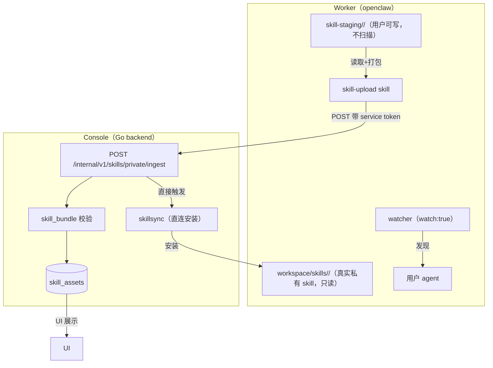
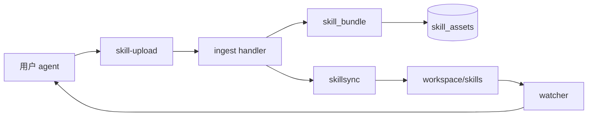
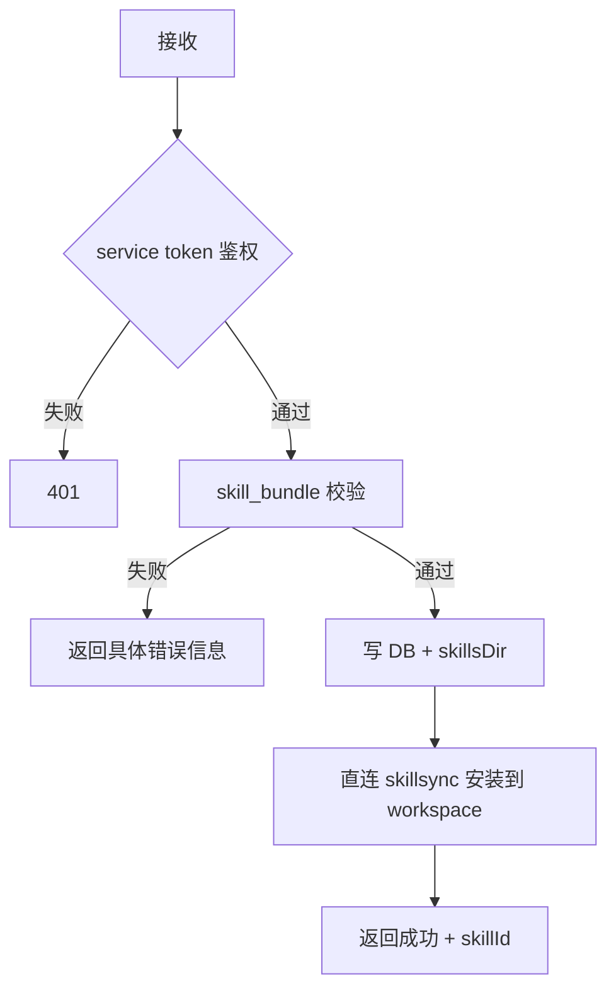

# 用户自建 Skill（staging → 上传 → console 生效）模块设计文档

> **文档编号**: MOD-USS-001
> **文档版本**: v0.1
> **创建日期**: 2026-08-04
> **文档状态**: 草稿

**评审边界说明**:
- **需求评审**: 第 2 章（需求分析）→ 通过后锁定需求基线 v1.0
- **设计评审**: 第 3-4 章（技术设计 + 部署运维）→ 通过后锁定设计基线 v1.x
- **交接契约**: 2.5 验收条件 — 需求定义 What，设计实现 How

**ID 体系**: US（用户故事）、FEAT（功能）、API（接口）、RULE（业务规则）、TC（测试用例）、RISK（风险）、NFR（非功能指标）
场景编号：S-（正常）、E-（异常）、B-（边界，按需）

---

## 目录

- [1. 文档控制](#1-文档控制)
- [2. 需求分析](#2-需求分析)
- [3. 技术设计](#3-技术设计)
- [4. 部署与运维](#4-部署与运维)
- [5. 风险与依赖](#5-风险与依赖)
- [6. 需求追溯矩阵](#6-需求追溯矩阵)
- [Spec Compliance Matrix](#spec-compliance-matrix)

---

## 1. 文档控制

### 1.1 责任人

| 角色 | 人员 | 职责 |
|------|------|------|
| 产品/需求 | 待定 | 需求确认 |
| 设计/开发 | 待定 | 设计实现 |
| 测试 | 待定 | 验收 |

### 1.2 修订历史

| 版本 | 日期 | 修订人 | 说明 |
|------|------|--------|------|
| v0.1 | 2026-08-04 | muad | 初始草稿（对齐产出） |
| v0.2 | 2026-08-04 | muad | 补充 RULE-07：Skill 变更（上传/删除/禁用/allow_override）自动同步生效，无需手动「应用配置」 |

---

## 2. 需求分析

### 2.1 需求概述 [必填]

服务经理用户通过 openclaw **自己编写 skill**，编写完成后通过显式上传动作，使 skill 在自己的 agent 中**正式可调用**；平台展示（DB/UI）与**实际可调用**严格一致；无需轮询后台进程、无需修改 `openclaw.json`、无需重启 gateway、无需手动「应用 Skill」。

**核心目标**：
1. 用户可写自己的 skill（staging 目录）
2. 上传前**不可调用**（显式门槛），上传后**正式生效**
3. 平台 DB 是唯一权威源，展示与实际可用一致
4. 复用现有 skill 校验/同步管线，不引入轮询

**用户**：服务经理（platform 业务用户，通过自己的 agent 使用 skill）

### 2.2 痛点与价值 [必填]

**当前问题**：
- openclaw 原生 `skill_workshop` 被工具策略禁用；`workspace/skills/` 对 agent 只读——用户无法自建 skill
- 若直接放开 workspace 写，会出现"实际能用 ≠ 平台展示"的不一致，且绕过校验/审计
- 现有上传链路要求手动「应用 Skill」+ gateway 重启，体验差

**预期价值**：
- 用户自建 skill 全流程自助：写 → 上传 → 生效
- 平台展示与可用严格一致（DB 权威）
- 上传不重启、不改配置（skill 同步与 config apply 解耦）
- 上传失败原因明确透传给用户，可修复后重传

### 2.3 功能方案 [必填]

| FEAT | 优先级 | 功能 | 来源 | 说明 |
|------|--------|------|------|------|
| FEAT-01 | P0 | 用户 staging 目录可写 | 需求描述 | `workspace-<agent>/skill-staging/<name>/`，openclaw 不扫描（不可调用），runtime-guard 放开写权限 |
| FEAT-02 | P0 | skill-upload skill | 需求描述 | 平台提供、装到 worker：读 staging → 最小预检 → 打包 → POST console ingest |
| FEAT-03 | P0 | console ingest 端点 | 需求描述 | `POST /internal/v1/skills/private/ingest`：复用 skill_bundle 校验 → 建 private skill asset → 直接触发 skillsync 安装 |
| FEAT-04 | P0 | skill 同步与 config apply 解耦 | 需求描述 | skill 变更（上传）只同步文件、不 bump generation、不改 openclaw.json、不重启 |
| FEAT-05 | P0 | 去掉 per-agent skill allowlist | 需求描述 | agent 可用范围 = 所有公共 skill + 自己已安装的私有 skill（隔离按 workspace 结构保证） |
| FEAT-06 | P0 | 上传错误明确透传 | 需求描述 | 三层反馈：skill-upload 预检 → console 权威校验 → 错误原样回传用户 |
| FEAT-07 | P1 | UI 调整 | 需求描述 | 全局「应用 Skill」保留 + "i" Tooltip（自动同步说明）；去掉告警块与「应用到当前用户Pod」按钮 |

### 2.4 范围与边界 [必填]

**In Scope**：
- staging 目录 + runtime-guard 放宽（仅 staging 可写，真实 skills 保持只读）
- skill-upload skill + console ingest 端点
- skill 同步与 config apply 解耦（上传直连同步，不重启）
- allowlist 移除（渲染器 + Go builder filters 对齐）
- 错误透传
- UI 调整（tooltip / 去按钮）

**Out Scope**：
- 用户 skill 的**分享**给其他用户（仅本人使用）
- openclaw 原生 `skill_workshop`（提案制评审）——不启用
- 平台 skill（public/private）的 per-agent 精确白名单控制（allowlist 移除后不再按人配）
- 浏览器/CDP 相关
- 后台轮询镜像用户自建 skill（用户已否决此方向）

### 2.5 验收条件 [必填]

#### 2.5.1 业务规则与约束

| ID | 类型 | 描述 | 验证场景 |
|----|------|------|---------|
| RULE-01 | 业务规则 | 用户 skill 写于 staging 目录，上传前不可被 agent 调用 | S-01, E-01 |
| RULE-02 | 业务规则 | 上传后的 skill 成为平台私有 skill asset，DB 与 workspace 一致 | S-02 |
| RULE-03 | 系统约束 | 上传不修改 openclaw.json、不触发 gateway 重启 | S-03 |
| RULE-04 | 系统约束 | 真实 skills 目录对 agent 保持只读，仅 console 安装可写 | E-02 |
| RULE-05 | 业务规则 | 上传校验失败时，具体原因透传给用户 | E-01 |
| RULE-06 | 系统约束 | 多用户隔离：用户仅可写/可调用自己 workspace 的 skill | E-03 |
| RULE-07 | 业务规则 | public/private Skill 与 Skill policy 变更（上传/删除/禁用/启用/allow_override）后自动同步生效（handler enqueue reconcile → apply 链同步文件并清 skills_pending），无需手动「应用配置」，不触发 gateway 重启 | S-02, S-03 |

#### 2.5.2 功能验收场景

**正常场景**

| 场景ID | 功能ID | 优先级 | 测试层级 | 关键真实边界 | 前置条件 | 操作步骤 | 预期结果 |
|--------|--------|--------|---------|-------------|---------|---------|---------|
| S-01 | FEAT-01/02 | P0 | E2E | runtime-guard → staging 文件 → openclaw skill snapshot | 用户在 staging 写好合法 skill（SKILL.md + name） | 用户触发 skill-upload | skill 打包上传成功；上传前 agent 不可调用 |
| S-02 | FEAT-03/04 | P0 | E2E | ingest API → DB → skillsync → workspace/skills → watcher | skill 已上传 | console 校验入库 + 安装 | skill 出现在 DB/UI，agent 可调用；无 gateway 重启 |
| S-03 | FEAT-04 | P0 | integration | 渲染器 → openclaw.json hash → selectRestartMode | 上传 skill 后 | 检查配置字节与重启日志 | openclaw.json 字节不变、无 SIGUSR1 重启 |
| S-04 | FEAT-05 | P0 | integration | 渲染器 agents.list | 去掉 allowlist 后 | agent 列出可用 skill | 含所有公共 skill + 自己已安装私有 skill |

**异常场景**

| 场景ID | 功能ID | 测试层级 | 关键真实边界 | 触发条件 | 系统行为 | 用户感知 |
|--------|--------|---------|-------------|---------|---------|---------|
| E-01 | FEAT-02/06 | E2E | ingest 校验 → 错误回传 agent | staging skill 不符合规范（缺 SKILL.md / name 不合法 / manifest 错） | console 校验失败，错误信息原样返回 skill-upload | 用户看到具体失败原因，可修复后重传 |
| E-02 | FEAT-01 | E2E | runtime-guard → 真实 skills 写 | agent 尝试写平台安装的私有 skill | 被 runtime-guard 拒绝（只读） | 写入被拒 |
| E-03 | FEAT-01 | E2E | runtime-guard isWithin 边界 | agent 尝试写他人 workspace / 绝对路径 / symlink 逃逸 | 被拒绝 | 写入被拒 |

**边界场景**

| 场景ID | 测试层级 | 关键真实边界 | 字段/条件 | 边界值 | 预期行为 |
|--------|---------|-------------|----------|--------|---------|
| B-01 | unit | skill_bundle 校验 | 上传 skill 名与已有平台 skill 冲突 | 同名 | 遵循现有"同名冲突不静默覆盖"，拒绝/提示 |

#### 2.5.3 非功能指标 [按需]

**性能指标**

| 指标ID | 指标名称 | 目标值 | 测量方法 |
|--------|---------|-------|---------|
| NFR-PERF-01 | 上传 → 生效延迟 | ≤5s | 集成测试（skill-upload → ingest → install → watcher） |
| NFR-PERF-02 | 上传不触发 gateway 重启 | 0 次 | 重启日志断言 |

**安全性要求**

| 指标ID | 安全域 | 验收标准 |
|--------|--------|---------|
| NFR-SEC-01 | 多用户隔离 | 用户仅可写/调用自己 workspace skill（isWithin 边界 + workspace 结构隔离） |
| NFR-SEC-02 | 平台 skill 保护 | 真实 skills 目录 agent 只读；误改时 console hash 检测重装自愈 |

---

## 3. 技术设计

### 3.1 方案选型 [必填]

#### 备选方案对比

| 对比维度 | 权重 | 方案A（staging+上传，选定） | 得分 | 方案B（轮询镜像） | 得分 |
|---------|------|------|------|------|------|
| 一致性 | 30% | DB 权威，即时有 | / | 最终一致，有滞后 | / |
| 后台进程 | 20% | 无（push 式） | / | 需轮询 | / |
| 实现复杂度 | 20% | 中（staging + skill-upload + ingest） | / | 中高（镜像 + 双所有权） | / |
| 复用现有管线 | 20% | 高（上传校验 + skillsync） | / | 低（需新增镜像逻辑） | / |
| 安全边界 | 10% | 清晰（staging 可写、真实只读） | / | 需 managed 区分 | / |

#### 关键决策记录

| 决策点 | 选择 | 被否决项 | 理由 | 可逆性 |
|--------|------|---------|------|--------|
| 用户 skill 生效方式 | staging → 上传 → console 安装 | 直接写 workspace（写完即用） | 保证 DB 权威、展示一致、过校验；用户显式门槛 | 难回退（改动面大） |
| 一致性维护 | push 式上传（skill-upload） | 轮询镜像 | 无后台进程、DB 权威、更优雅 | 易回退（可切回） |
| allowlist | 移除 | 保留 + 上传更新 | 上传不改变量 → 不重启；公共 skill 本就该全可见 | 易回退（可恢复） |
| 上传后重启 | 直接同步（不 bump generation） | skills_pending → apply | 配置字节不变 → selectRestartMode=none → 不重启 | 易回退 |
| 真实 skills 写权限 | 保持只读 | 放开 | 平台 skill 保护 + hash 自愈兜底 | 易回退 |

#### 技术栈

| 类别 | 选型 | 版本 | 选型理由 |
|------|------|------|---------|
| 后端 | Go（现有） | 1.26 | 复用 console/backend |
| 前端 | React + Semi Design（现有） | 现有 | 复用 |
| 运行时 | openclaw（现有 worker） | 2026.7.x | skill-upload skill 运行环境 |
| 存储 | SQLite（现有） | 现有 | 无新表（复用 skill_assets） |

### 3.2 架构设计 [必填]

#### 技术分层

#### 关键机制说明

1. **staging 不可调用**：openclaw 只扫描 `workspace/skills/`（已验证 `refresh.ts:96`），`skill-staging/` 不在扫描目标 → 上传前不可调用
2. **不重启**：ingest 直接调 skillsync 同步文件，不 bump `config_generation` → 渲染配置字节不变 → `selectRestartMode` 返回 `none`（已验证 `runtime-config-transaction.mjs:281`）
3. **allowlist 移除**：渲染器不再设置 `agents.list[].skills` → openclaw 语义"unrestricted"（`schema.help.core.ts:243`）→ 上传不改变量
4. **隔离**：runtime-guard `isWithin(workspace)` + openclaw `resolveAgentWorkspaceDir(agentId)` 双层锁定（`index.mjs:122`）

### 3.3 数据设计 [必填]

**无新表。** 复用现有 `skill_assets` 表存上传的用户 skill（scope=private，human_user_id=用户，pod_id=用户 pod）。

**可选增强（不阻塞）**：若 UI 需要区分"用户上传"与"管理员上传"来源，可加 `source` 列（`'user' | 'admin'`），幂等迁移，默认 `'admin'`。非必选。

| 字段 | 类型 | 说明 |
|------|------|------|
| skill_id | TEXT PK | 现有 |
| scope | TEXT | `'private'`（用户上传） |
| human_user_id / pod_id | TEXT | 绑定用户 |
| status | TEXT | `'active'` |
| source_path | TEXT | console skillsDir 下的镜像副本路径 |
| manifest_hash | TEXT | 目录内容 hash（复用现有，重装检测） |
| [可选] source | TEXT | `'user'/'admin'`，UI 展示来源 |

### 3.4 接口设计 [必填]

#### 形态 A：HTTP API

##### 接口清单

| 接口ID | 名称 | 方法 | 路径 | 详细 |
|--------|------|------|------|------|
| API-01 | 私有 skill 上传（ingest） | POST | `/internal/v1/skills/private/ingest` | [↓](#api-01) |

---

##### API-01: 私有 skill 上传（ingest）

**请求**

| 参数 | 类型 | 必填 | 说明 |
|------|------|------|------|
| agentId | string | 是 | 目标 agent（解析 human_user） |
| bundleFormat | string | 是 | `tar.gz` / `zip` |
| bundle | binary | 是 | skill 打包内容（body 内 multipart/raw） |

**鉴权**：pod service token（`/internal/v1/` 内部端点，复用 internalAuthMiddleware）

**响应**

| 参数 | 类型 | 说明 |
|------|------|------|
| code | int | 0=成功 |
| data.skillId | string | 创建的 skill asset ID |
| data.name | string | skill 名 |
| data.manifestHash | string | 目录内容 hash |

**错误码**

| 错误码 | 信息 | 场景 | HTTP状态码 |
|--------|------|------|----------|
| 4xxxx | bundle must contain a SKILL.md | 缺 SKILL.md | 400 |
| 4xxxx | invalid skill name | name 不合法 | 400 |
| 4xxxx | invalid Skill manifest | muad.skill.json 格式错 | 400 |
| 409xx | skill name conflict | 与已有平台 skill 同名 | 409 |

**处理逻辑**

#### 形态 B：CLI 命令（installer）

| 命令 | 参数 / Flag | 说明 | 退出码 |
|------|------------|------|--------|
| `private-skill-installer.mjs export` | `--agent-id` `--name` | 打包 workspace skill 目录为 tar.gz（供 skill-upload 使用） | 0=成功 / 非 0=失败 |

#### 形态 C：函数 / 库接口

| 函数签名 | 入参 | 返回 | 错误处理 |
|---------|------|------|---------|
| `installPrivateSkillBundle(bundle, skillsRoot, userID, expectedName, validateName)`（复用） | bundle, 根路径, 用户, 名称 | `privateSkillInstallResult` | 校验错误带具体原因 |

### 3.5 质量实现方案 [必填]

#### 性能设计

| 指标ID | 热点路径 | 目标值 | 实现方案 |
|--------|---------|-------|---------|
| NFR-PERF-01 | skill-upload → ingest → install → watcher | ≤5s | 上传直连同步（无轮询），watcher 亚秒级发现；复用现有 install 幂等（hash 一致则 no-op） |
| NFR-PERF-02 | 上传是否重启 gateway | 0 次 | ingest 不 bump generation → 配置字节不变 → 不重启（放弃"走 skills_pending → apply"的较慢/重启路径） |

#### 可靠性设计

| 风险ID | 失效模式 | 影响 | 应对措施 | 验证场景 |
|--------|---------|------|---------|---------|
| RISK-01 | ingest 同步失败（pod 不可达） | skill 未安装 | 返回错误给 skill-upload，用户可重传；保留全局「应用 Skill」手动重试 | E-01 |
| RISK-02 | 用户误改平台私有 skill | 平台 skill 被污染 | 真实 skills 只读（runtime-guard）+ console hash 检测重装自愈 | E-02 |

#### 安全性设计

| 指标ID | 验收标准 | 实现方案 |
|--------|---------|---------|
| NFR-SEC-01 | 多用户隔离 | runtime-guard `isWithin(workspace)` + openclaw `resolveAgentWorkspaceDir(agentId)` 双层；staging 在各自 workspace |
| NFR-SEC-02 | 平台 skill 保护 | 真实 skills 只读；上传校验复用 skill_bundle（SKILL.md/name/路径安全/大小） |
| NFR-SEC-03 | ingest 鉴权 | pod service token（internal 端点） |

#### 可观测性设计

| 场景 | 实现方案 |
|------|---------|
| ingest 日志 | 结构化日志：agentId、skillId、校验结果、安装结果 |
| 错误审计 | ingest 失败记 audit，错误信息经 RedactDiagnostic 后透传 |

---

## 4. 部署与运维

### 4.1 部署架构

- **Worker 镜像**：需包含新版 `skill-upload` skill + `installer export` 子命令 → 重建 worker 镜像
- **Console 镜像**：需包含 ingest 端点 + 渲染器 allowlist 移除 → 重建 console 镜像
- **升级顺序**：先 console（新端点/渲染器），再 worker（skill-upload/export）

### 4.2 发布与回滚

- 可逆：allowlist 移除、上传直连同步均易回退（恢复渲染器/恢复 skills_pending）
- 回滚：旧镜像恢复即回旧行为

### 4.4 数据迁移

- 无新表（复用 skill_assets）；可选 `source` 列走幂等迁移

---

## 5. 风险与依赖

### 5.1 项目依赖

| 依赖 | 说明 |
|------|------|
| openclaw 2026.7.x | watcher（watch:true）、workspace skill 发现、`agents.list[].skills` unrestricted 语义 |
| muad-runtime-guard | staging 写放宽 + 真实 skills 只读（tool-policies.mjs 调整） |
| installer | 新增 `export` 子命令 |

### 5.2 风险识别

| 风险ID | 描述 | 影响 | 缓解 |
|--------|------|------|------|
| RISK-01 | 上传同步失败（pod 不可达/网络） | skill 未生效 | 用户重传 + 全局「应用 Skill」兜底 |
| RISK-02 | 新用户首启与 skill 安装竞态 | 短暂未就绪 | watcher 补上，可接受（亚秒级） |
| RISK-03 | allowlist 移除后公共 skill 全可见 | 原按人控制失效 | 用户已确认接受（公共本就共享） |

---

## 6. 需求追溯矩阵

| 用户故事 | 功能ID | 接口ID | 测试用例ID | 测试层级 | 状态 |
|---------|--------|--------|-----------|---------|------|
| 需求描述（staging 可写） | FEAT-01 | — | S-01, E-02, E-03 | E2E | 待实现 |
| 需求描述（skill-upload） | FEAT-02 | CLI export | S-01, E-01 | E2E | 待实现 |
| 需求描述（ingest） | FEAT-03 | API-01 | S-02 | E2E | 待实现 |
| 需求描述（解耦不重启） | FEAT-04 | — | S-03 | integration | 待实现 |
| 需求描述（allowlist 移除） | FEAT-05 | — | S-04 | integration | 待实现 |
| 需求描述（错误透传） | FEAT-06 | API-01 | E-01 | E2E | 待实现 |
| 需求描述（UI 调整） | FEAT-07 | — | S-03 | integration | 待实现 |

---

## Spec Compliance Matrix

> 从需求目录 `spec-context.yml` 继承并逐 Rule 回填。required Rule 必须有具体设计落点和 verifier/验收场景。

| Spec/Rule | enforcement | 设计影响 | 设计落点 | 验证场景 | 状态 |
|-----------|-------------|---------|---------|---------|------|
| backend-platform-rules#RULE-backend-platform-001 | required | 多用户隔离、runtime apply 语义保持 | §3.2 隔离机制、§3.5 安全 | E-03, S-02 | applied |
| backend-platform-rules#RULE-backend-http-envelope-001 | required | ingest 端点走 writeErr | §3.4 API-01 | E-01 | applied |
| runtime-config-and-apply#RULE-runtime-config-001 | required | skill 同步与 config apply 解耦 | §3.2 机制2 | S-03 | applied |
| runtime-config-and-apply#RULE-runtime-validate-before-write-001 | required | ingest 校验复用 skill_bundle | §3.4 API-01 处理逻辑 | E-01 | applied |
| runtime-isolation-and-security#RULE-runtime-security-001 | required | 多用户隔离、service token 注入 | §3.5 安全 | E-03 | applied |
| runtime-isolation-and-security#RULE-runtime-secret-file-mode-001 | required | skill/bundle 落盘 0o600 | §3.5 | S-02 | applied |
| runtime-skill-execution#RULE-runtime-skill-001 | required | skill 分层、激活门槛 | §2.3 FEAT-01/03 | S-01 | applied |
| runtime-skill-execution#RULE-runtime-skill-layering-001 | required | 同名冲突不静默覆盖 | §2.5.2 B-01 | B-01 | applied |
| backend-code-quality-performance#RULE-backend-quality-001 | required | 错误处理、超时、测试 | §3.4/§3.5 | S/E 全 | applied |
| backend-database#RULE-backend-database-001 | required | 无新表；可选 source 列幂等 | §3.3 | S-02 | applied |
| backend-logging#RULE-backend-redact-001 | required | 错误透传前 Redact | §3.5 可观测 | E-01 | applied |
| frontend-quality-standards#RULE-frontend-api-client-001 | required | UI 走 api.ts | §2.3 FEAT-07 | — | applied |
| frontend-component-specs#RULE-frontend-component-001 | required | tooltip/按钮组件 | §2.3 FEAT-07 | — | applied |

---

## 附录：术语表

| 术语 | 定义 |
|------|------|
| staging | 用户可写的 skill 草稿目录（`skill-staging/`），上传前不可调用 |
| ingest | 上传入库动作（console 内部端点） |
| allowlist | `agents.list[].skills`，per-agent skill 白名单（本设计移除） |
| watcher | openclaw `skills.load.watch:true`，亚秒级发现新 skill |

---

*文档结束*
