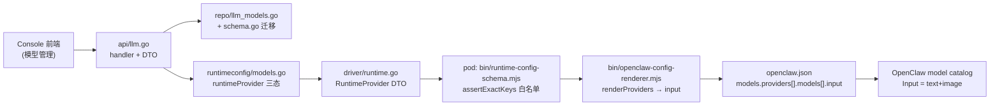
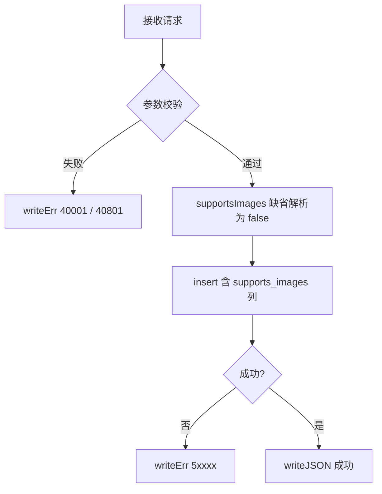
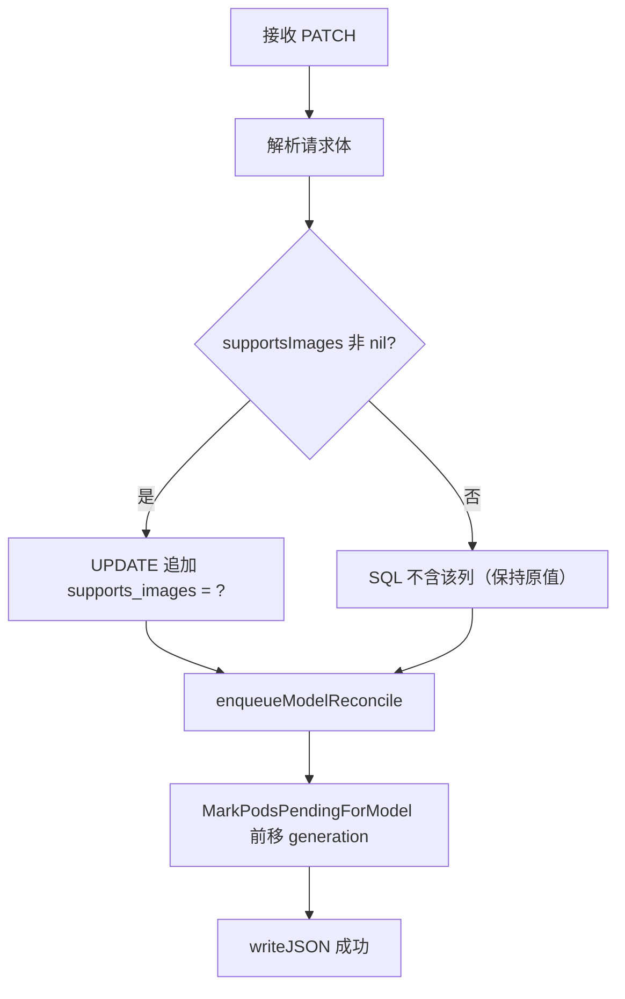

# LLM 模型图片输入能力 模块需求与设计简报（后端 / Runtime）

> **文档编号**: MOD-LLMIMG-1.0
> **文档版本**: v0.1
> **创建日期**: 2026-09-22
> **文档状态**: 草稿

**评审边界说明**:
- **需求评审**: 第 2 章（需求分析）→ 通过后锁定需求基线
- **设计评审**: 第 3 章（技术设计）→ 通过后锁定设计基线

**ID 体系**: FEAT（功能）、API（接口）、NFR（非功能指标）、DEC（设计决策）、RISK（风险）
场景编号：S-（正常）、E-（异常）、B-（边界）。**本需求为全栈双文档；为满足校验器的 `[SEB]-\d+` 编号约定并避免前后端合并时撞号，后端占 `S-01..04` / `E-01..04`，前端占 `S-11..13` / `E-11..12`**（本文件全部为 `0x` 段）。

**适用场景**: 功能开发（简单）—— 为既有 LLM 模型配置增加一个能力布尔字段，端到端沿用 `supportsTools` 既有链路
**不适用**: 跨系统集成 / 性能优化 / 架构演进

> 本文档为**后端 + Runtime（bin/）域**设计；前端域见同目录 `llm-model-image-input.frontend.design.md`

---

## 目录

- [1. 文档控制](#1-文档控制)
- [2. 需求分析](#2-需求分析)
  - [2.1 需求概述](#21-需求概述-必填)
  - [2.2 功能方案](#22-功能方案-必填)
  - [2.3 范围与边界](#23-范围与边界-必填)
  - [2.4 验收条件](#24-验收条件-必填)
- [3. 技术设计](#3-技术设计)
  - [3.1 技术选型](#31-技术选型-按需)
  - [3.2 架构设计](#32-架构设计-按需)
  - [3.3 接口设计](#33-接口设计-按需)
  - [3.4 性能与容量考量](#34-性能与容量考量-按需)
- [4. 风险与依赖](#4-风险与依赖-按需)
- [Spec Compliance Matrix](#spec-compliance-matrix)
- [附录：术语表](#附录术语表)

---

## 1. 文档控制

### 1.1 责任人

| 角色 | 姓名 | 职责范围 |
|------|------|---------|
| 开发负责人 | | 技术方案、代码实现 |
| 测试负责人 | | 测试策略、质量保证 |

### 1.2 修订历史

| 版本 | 日期 | 作者 | 变更描述 |
|------|------|------|---------|
| v0.1 | 2026-09-22 | | 初始草稿（自会话对齐结论细化） |
| v0.2 | 2026-09-22 | | 补 RISK-B05：实测确认模型能力变更需重启 pod 才生效（热重载不足）；S-03 端到端验收 PASS |

---

## 2. 需求分析

### 2.1 需求概述 [必填]

| 项目 | 内容 |
|------|------|
| **模块名称** | LLM 模型配置 — 图片输入能力声明（后端 / Runtime） |
| **需求类型** | 功能开发（缺陷修复性质：缺失字段导致能力不可达） |
| **业务背景** | 用户在 WeCom 通道向 agent 发送图片，图片被下载解密成功后并未进入模型上下文，而是落盘为路径文本（`[media attached: media://inbound/<id>]`）。agent 因此只能自行 `exec` 在容器内现装 OCR（rapidocr 约 288MB），单轮耗时 8 分 34 秒才回复，且该 OCR 依赖安装在容器可写层，pod 重建即丢失。经在运行中的 pod 实证：<br>① 所用模型（`deepseek-flash`）本身具备视觉能力——对其发送 `image_url` 内容块返回 HTTP 200 并准确描述图片内容；<br>② OpenClaw 运行时的判定入口是 `attachment-normalize` 中的 `shouldForceImageOffload = opts?.supportsImages === false`；<br>③ `supportsImages` 取自 gateway model catalog，`models list` 显示该模型 `Input = text`；<br>④ 对照实验证明：config 中 provider model 未写 `input` 时，运行时**一律**按 text-only 处理，与模型名无关（连 `gpt-4o`、`qwen2.5-vl-7b-instruct` 亦然）；写入 `input: ["text","image"]` 后 catalog 变为 `text+image`。<br>根因：`bin/openclaw-config-renderer.mjs` 的 `renderProviders` 从不输出 `input` 字段，导致**凡经 console 下发的模型全部被登记为 text-only**。 |
| **核心目标** | 让 console 能在模型配置上声明「支持图片输入」，并端到端下发为 OpenClaw 的 `models.providers[id].models[].input = ["text","image"]`，使图片直接进入模型上下文，消除 offload + exec OCR 兜底路径 |

---

### 2.2 功能方案 [必填]

#### 2.2.1 功能清单

| 功能ID | 功能名称 | 功能描述 | 优先级 | 来源 |
|--------|---------|---------|--------|------|
| FEAT-B01 | DB 列与迁移 | `llm_model_configs` 新增 `supports_images INTEGER NOT NULL DEFAULT 0`，并提供幂等迁移 | P0 | 对齐结论（会话） |
| FEAT-B02 | API 读写字段 | create 默认 `false`、update 可选不触碰、view 输出具体布尔；随既有 `enqueueModelReconcile` 触发热下发 | P0 | 对齐结论（会话） |
| FEAT-B03 | Runtime DTO 传递 | `supportsImages` 仅在 `true` 时置指针并出现在 DTO（`omitempty`），保证存量配置字节不变 | P0 | 对齐结论（会话） |
| FEAT-B04 | Worker schema 白名单 | `bin/runtime-config-schema.mjs` 的 `assertExactKeys` 接受 `supportsImages`，否则 apply 校验失败 | P0 | 对齐结论（会话） |
| FEAT-B05 | Renderer 映射 | `true` → `models[0].input = ["text","image"]`；`false`/缺省 → 不输出 `input` | P0 | 对齐结论（会话） |

> P0=核心必做，P1=重要
> 来源：本需求无 PRD，来源为会话中对齐结论（含 pod 实证）。

#### 2.2.2 字段约束 [按需]

**FEAT-B01 字段约束**

| 字段名 | 字段类型 | 必填 | 约束 | 说明 |
|--------|---------|------|------|------|
| `supports_images` | INTEGER | 是 | `NOT NULL DEFAULT 0 CHECK (supports_images IN (0,1))` | 与既有 `supports_tools` 同构；0=false, 1=true |

**FEAT-B03 / FEAT-B05 渲染契约**

| 输入（DTO `provider.supportsImages`） | 输出（openclaw.json） | 说明 |
|--------------------------------------|----------------------|------|
| `true` | `models[0].input = ["text","image"]` | 唯一能表达「支持图片」的方式 |
| `false` / 字段缺失 | 不输出 `input` | OpenClaw 对无 `input` 的模型默认 text-only，与现状字节一致 |

> **关键不对称（实现时必须注意）**：`supportsTools` 是 **`false` 时**输出 `compat.supportsTools:false`（默认开）；`supportsImages` 必须 **`true` 时**输出 `input`（默认关）。结构同构但条件方向相反，不可对称照抄。

---

### 2.3 范围与边界 [必填]

| 类别 | 内容 |
|------|------|
| **范围（In Scope）** | console 后端（`repo` / `api` / `runtimeconfig` / `driver`）字段贯通；DB 迁移；worker 侧 `bin/runtime-config-schema.mjs` 白名单与 `bin/openclaw-config-renderer.mjs` 渲染映射；对应单元/集成测试 |
| **非范围（Out of Scope）** | ① 不实现/复刻上游按模型名推断能力的正则（上游 `resolveCustomModelImageInputInference` 把 `deepseek` 判为 text-only，与本需求目标相反）；② 不动 `agents.imageModel`（视觉兜底模型中转，属另一能力面）；③ 不在镜像预装 OCR 依赖（本改动生效后 exec OCR 路径消失）；④ 不改动上游 OpenClaw 源码或 fork（见 `runtime-directory-structure#RULE-runtime-directory-001`）；⑤ 不做存量 provider 记录回填 |
| **有意妥协 / 技术债** | 新增字段为「按需升级」语义：旧 worker 镜像不认识 `supportsImages`（`assertExactKeys` 严格校验），因此**默认不勾 → 字段不出现在 DTO → 存量 pod 完全不受影响**；代价是管理员启用该能力前必须先把目标 pod 升级到含新 schema 的 worker 镜像。该约束被接受为自限的发布顺序要求（console 先行、worker 镜像跟上），不引入 capability 协商机制 |

---

### 2.4 验收条件 [必填]

#### 2.4.1 功能验收场景

**正常场景**

| 场景ID | 功能ID | 优先级 | 测试层级 | 关键真实边界 | 操作步骤 | 预期结果 |
|--------|--------|--------|---------|-------------|---------|---------|
| S-01 | FEAT-B05 | P0 | unit | renderer 真实实现（不 mock） | 1. 构造 provider DTO `supportsImages:true`<br>2. 调用 renderer 渲染 | 渲染出的 config 中 `models.providers[id].models[0].input === ["text","image"]` |
| S-02 | FEAT-B02 | P0 | integration | HTTP handler → Store（真实 SQLite） | 1. `PATCH /api/v1/llm/models/{id}` 携带 `supportsImages:true`<br>2. `GET /api/v1/llm/models` | PATCH 响应与 GET 列表均返回 `supportsImages:true`；`enqueueModelReconcile` 被触发，目标 pod config generation 前移 |
| S-03 | FEAT-B01/B03/B04/B05 | P0 | **E2E** | API → Store → runtimeapply → **pod 内实际生成的 openclaw.json** → OpenClaw model catalog（不得 mock 任一环） | 1. 对目标 pod 勾选 `supportsImages` 并 apply<br>2. 在 pod 内执行 `node openclaw.mjs models list`<br>3. 向该 agent 发送一张真实图片 | ① `models list` 的 `Input` 列显示 `text+image`；② trajectory 中该 user message 的 `content[].type` 出现 `image`；③ 不再出现 `openclaw-staged` / `[media attached:]` offload 标记；④ 不再出现 `exec` 触发的 OCR 工具调用 |
| S-04 | FEAT-B03 | P0 | unit | DTO 序列化真实实现 | 1. 模型 `supportsImages=true` 构建 runtime DTO<br>2. 模型 `supportsImages=false` 构建 runtime DTO | 前者 JSON 含 `"supportsImages":true`；后者 JSON **不含** `supportsImages` 键（`omitempty` 生效，存量字节不变） |

**异常场景**

| 场景ID | 功能ID | 测试层级 | 关键真实边界 | 触发条件 | 系统行为 |
|--------|--------|---------|-------------|---------|---------|
| E-01 | FEAT-B01 | integration | 迁移 → 真实 SQLite | 对已存在 `supports_images` 列的库重复执行迁移 | 迁移幂等：`columnExists` 守卫命中，不报错、不重建表、不丢数据；既有行取值保持 `0` |
| E-02 | FEAT-B04 | unit | schema 校验真实实现 | DTO 携带 schema 白名单之外的 key | `validateRuntimeConfig` 抛错（`assertExactKeys` 严格模式），apply 前置失败，不产生半截配置 |
| E-03 | FEAT-B05 | unit | renderer 真实实现 | provider DTO 未携带 `supportsImages`（存量配置） | 渲染结果与改动前**逐字节一致**（不新增 `input` 键） |
| E-04 | FEAT-B02 | integration | HTTP handler → Store | `PATCH` 未携带 `supportsImages` 字段（`*bool` 为 nil） | SQL UPDATE 不含 `supports_images`，库中既有值保持不变（不被隐式改写为 `false`） |

#### 2.4.2 非功能指标 [按需]

| 指标ID | 指标名称 | 目标值 | 测量方法 |
|--------|---------|-------|---------|
| NFR-COMPAT-B01 | 存量配置零漂移 | 存量 provider 渲染结果字节级不变 | E-03 断言 + renderer 确定性单测 |
| NFR-COMPAT-B02 | 迁移幂等性 | 重复执行零副作用 | E-01 断言 |
| NFR-DATA-B01 | 数据保全 | 迁移不删除、不改写既有行数据 | E-01 断言（迁移前后行数与取值比对） |

---

## 3. 技术设计

### 3.1 技术选型 [按需]

沿用既有栈，不引入新依赖。

| 类别 | 选型 | 版本 | 选型理由 |
|------|------|------|---------|
| 语言（控制面） | Go | 既有 | 与 `console/backend` 一致 |
| 语言（Worker Runtime） | Node.js (ESM `.mjs`) | 既有 | `bin/` 既有渲染/校验链路 |
| 数据库 | SQLite | 既有 | `llm_model_configs` 表所在存储 |
| 参考实现 | `supportsTools` 既有链路 | 既有 | 端到端同构，最大化复用与一致性 |

---

### 3.2 架构设计 [按需]



| 层级 | 职责 | 本次改动 |
|------|------|---------|
| `api` | 请求校验、响应格式化（`writeJSON` / `writeErr`） | DTO 加 `SupportsImages *bool`；create 默认 `false`；view 输出 |
| `repo` | 持久化与迁移（唯一允许写 SQL 的层） | 加列 + 幂等迁移 + 列清单/scan/update |
| `runtimeconfig` | 控制面 DTO（desired state）构建 | `runtimeProvider` 三态：`true` 才置指针 |
| `driver` | 下发 DTO 定义 | `SupportsImages *bool` + `omitempty` |
| `bin/`（Worker） | schema 校验 + 渲染 config | 白名单加 key；`true` → `input:["text","image"]` |

> 分层纪律：handler 不拥有持久化与 runtime-driver 细节（`backend/directory-structure#RULE-backend-directory-001`）。

---

### 3.3 接口设计 [按需]

#### 形态 A：HTTP API [Web 服务选此]

##### 接口清单

| 接口ID | 名称 | 方法 | 路径 | 详细 |
|--------|------|------|------|------|
| API-B01 | 批量创建 LLM 模型 | POST | `/api/v1/llm/models/batch` | [详细 ↓](#api-b01) |
| API-B02 | 更新 LLM 模型 | PATCH | `/api/v1/llm/models/{modelConfigId}` | [详细 ↓](#api-b02) |
| API-B03 | 列出 LLM 模型 | GET | `/api/v1/llm/models` | [详细 ↓](#api-b03) |

> 三个接口均为**既有接口扩展字段**，不新增 endpoint、不新增错误码。

---

#### API-B01: 批量创建 LLM 模型

**接口契约**

```
POST /api/v1/llm/models/batch
Content-Type: application/json
```

**请求参数**

| 参数 | 类型 | 必填 | 说明 |
|------|------|------|------|
| `models[].supportsImages` | bool | 否 | 缺省 `false`（**与 `supportsTools` 缺省 `true` 相反**） |

**请求示例**

```json
{
  "models": [
    {
      "displayName": "deepseek-flash",
      "provider": "deepseek",
      "baseUrl": "https://api.deepseek.com",
      "apiKey": "sk-***",
      "model": "deepseek-flash",
      "supportsTools": true,
      "supportsImages": true
    }
  ]
}
```

**响应参数**

| 参数 | 类型 | 说明 |
|------|------|------|
| code | int | 0=成功 |
| message | string | 提示信息 |
| data | object | 响应数据 |

**错误码**

| 错误码 | 信息 | 场景 | HTTP状态码 |
|--------|------|------|----------|
| 40001 | 参数错误 | 请求体解析失败 | 400 |
| 40801 | 模型配置非法 | provider/baseUrl/model 校验失败 | 400 |
| 50019 | 服务端错误 | 列表查询异常 | 500 |

> 本次改动**不新增错误码**：`supportsImages` 为裸布尔，无值域校验失败路径；沿用既有 `errcode.InvalidLLMModel` 与 `writeErr` 契约（`backend-code-quality-performance#RULE-backend-write-err-001`）。

**处理逻辑**



---

#### API-B02: 更新 LLM 模型

**接口契约**

```
PATCH /api/v1/llm/models/{modelConfigId}
Content-Type: application/json
```

**请求参数**

| 参数 | 类型 | 必填 | 说明 |
|------|------|------|------|
| `supportsImages` | bool | 否 | `*bool`；**nil = 不触碰该列**，显式 `false` 才写 0 |
| `supportsTools` | bool | 否 | 既有字段，本次不变 |

**请求示例**

```json
{ "supportsImages": true }
```

**响应参数**

| 参数 | 类型 | 说明 |
|------|------|------|
| code | int | 0=成功 |
| data.supportsImages | bool | 更新后的具体布尔值 |

**处理逻辑**



> nil 语义必要性：PATCH 必须区分「字段缺省」与「显式置 false」，否则前端只改 apiKey 时会把图片能力隐式关掉（见 E-04）。

---

#### API-B03: 列出 LLM 模型

**响应参数**

| 参数 | 类型 | 说明 |
|------|------|------|
| data[].supportsImages | bool | 具体布尔（非指针），前端读取模型必填字段 |

---

### 3.4 性能与容量考量 [按需]

> **无性能敏感点**。本改动为配置字段透传：单次写路径为一行 `UPDATE`/`INSERT`，读路径随既有列表查询（列清单多一列整数）；渲染期为每 provider 多输出至多一个 JSON 数组。不涉及高频调用、大数据量、循环内 IO 或并发热点。

| 热点路径 | 预估负载 | 潜在瓶颈 | 应对策略 | 目标值 |
|---------|---------|---------|---------|--------|
| — | 无性能敏感点，跳过 | — | — | — |

---

## 4. 风险与依赖 [按需]

### 4.1 项目依赖

| 依赖模块 | 依赖内容 | 风险等级 |
|---------|---------|---------|
| 上游 OpenClaw `2026.7.1`（`Dockerfile.base` pin） | 运行时消费 `models.providers[].models[].input` 决定是否 inline 图片 | 中 —— 该字段语义为上游契约，无本仓测试覆盖，靠 S-03 E2E 兜底 |
| `bin/runtime-config-schema.mjs` | 严格 `assertExactKeys` 校验；新增 key 必须同步 | 低（同 PR 内改动） |
| Worker 镜像发布流水线 | 新 schema 需随镜像下发到 pod | 中 —— 见 RISK-B01 |

### 4.2 风险识别

| 风险ID | 描述 | 影响 | 应对措施 | 验证场景 |
|--------|------|------|---------|---------|
| RISK-B01 | 旧 worker 镜像不认识 `supportsImages`，收到即 `assertExactKeys` 失败，apply 中断 | 管理员勾选能力后 apply 失败，pod 配置无法下发 | 默认 `false` → 字段不出现在 DTO，存量 pod 零影响；发布顺序固定为 console 先行、worker 镜像跟上；apply 失败走既有 health/rollback 语义不影响既有配置 | E-03、S-04 |
| RISK-B02 | 管理员对不具备视觉能力的模型勾选 `supportsImages` | 该模型收到图片后在 provider 层报错（上游 400） | UI 提供说明文案（前端文档 FEAT-F02）；首版不做按模型名推断（推断本身不可靠，见 2.3 非范围①） | 手动验证（外部模型行为，无法在 CI 内自动化） |
| RISK-B03 | 存量 provider 记录未回填，行为保持 text-only | 现有用户不会自动获得图片能力，需管理员逐个勾选 | 有意为之（2.3 有意妥协）：回填依赖不可靠的名字推断，反而更混乱 | E-03 |
| RISK-B04 | 上游未来改变 `input` 缺省语义（当前缺省 = text-only） | 渲染契约失效 | S-03 E2E 覆盖真实 catalog 输出，上游升级时会暴露 | S-03 |
| RISK-B05 | **模型能力字段（`input`）经控制面变更后，仅配置热重载不足以让图片内联生效 —— 必须重启 pod** | 界面保存成功、日志打 `config hot reload applied`、`models list` 也显示 `text+image`，但图片仍以路径交付、模型拿不到像素；极易被误判为『功能未实现』而重复排查 | 变更模型能力后重启目标 pod（2026-09-22 实测结论，当前由人工执行）；后续可考虑让控制面在能力类变更时选择 restart 模式而非 hot reload | S-03（pod01 重启前 FAILED / 重启后 PASS + pod02 双复核） |

---

## Spec Compliance Matrix

> 从需求目录 `spec-context.yml` 继承并逐 Rule 回填。required Rule 必须有具体设计落点和 verifier/验收场景；N/A 只接受逐项用户确认。

| Spec/Rule | enforcement | 设计影响 | 设计落点 | 验证场景 | 状态/N/A 理由 |
|-----------|-------------|---------|---------|---------|----------------|
| `backend-code-quality-performance#RULE-backend-quality-001` | required | 新增字段贯通需显式处理 error；不改动既有超时/上下文约束 | §3.3 API-B01/B02 处理逻辑；FEAT-B02 | S-02、E-04 + `go test ./...`（console/backend） | applied |
| `backend-code-quality-performance#RULE-backend-write-err-001` | required | 不新增错误场景，沿用既有 errcode 常量与 `writeErr` | §3.3 错误码表（40001/40801/50019 沿用） | E-02、S-02 | applied |
| `backend-database#RULE-backend-database-001` | required | 迁移必须幂等且不破坏既有数据；SQL 参数化且限于 `internal/repo` | §2.2.2 字段约束；FEAT-B01 | E-01（幂等）、E-04（不动他行） | applied |
| `backend-database#RULE-backend-no-select-star-001` | required | 显式列清单常量需纳入新列 | FEAT-B01（`llmModelColumns` 追加 `m.supports_images`） | S-02 | applied |
| `backend-directory-structure#RULE-backend-directory-001` | required | 改动全部落在 `console/backend/internal/{repo,api,runtimeconfig,driver}`，handler 不持有持久化细节 | §3.2 分层职责表 | S-02 | applied |
| `backend-logging#RULE-backend-logging-001` | required | 本改动不新增日志/审计输出，不引入凭证外泄面 | §2.3 非范围（不新增日志点） | 不适用（无新增日志） | N/A —— confirmed 2026-09-22 |
| `backend-logging#RULE-backend-redact-001` | required | 不新增写入日志/审计/apply 失败字段的 error 内容 | §2.3 非范围 | 不适用（无新增诊断输出） | N/A —— confirmed 2026-09-22 |
| `backend-platform-rules#RULE-backend-platform-001` | required | 能力字段随既有 generation-based runtime apply 下发，不改变多用户隔离与 model-pool 绑定语义 | §3.2 架构图（经 `runtimeapply` 下发） | S-02（generation 前移）、S-03 | applied |
| `backend-platform-rules#RULE-backend-http-envelope-001` | required | 响应经 `writeJSON`/`writeErr`，不手写 `json.NewEncoder` | §3.3 三个接口的响应参数与错误码 | S-02、E-02 | applied |
| `backend-platform-rules#RULE-backend-model-pool-001` | required | 不涉及创建 Human User 与模型绑定逻辑 | §2.3 非范围 | 不适用（未触碰绑定路径） | N/A —— confirmed 2026-09-22 |
| `runtime-config-and-apply#RULE-runtime-config-001` | required | 变更必须过 schema 校验 + 事务 apply + 保留回滚/健康恢复 | §3.2（`bin/runtime-config-schema.mjs` → renderer → `runtimeapply`） | S-03、E-02 | applied |
| `runtime-config-and-apply#RULE-runtime-validate-before-write-001` | required | renderer/inject 物化 config 前必须过 `validateRuntimeConfig`；desired state 携带单调 generation | FEAT-B04（白名单）、FEAT-B05（渲染后仍走既有原子写） | E-02、S-03 | applied |
| `runtime-directory-structure#RULE-runtime-directory-001` | required | 只修改 `bin/` 既有文件，不 vendor / fork 上游 OpenClaw 源码 | §3.2（改动限定 `bin/runtime-config-schema.mjs`、`bin/openclaw-config-renderer.mjs`） | S-01、E-03 | applied |
| `runtime-isolation-and-security#RULE-runtime-security-001` | required | 不新增凭证通道；apiKey 仍由控制面注入，绝不进镜像 | §3.3 请求示例（apiKey 打码） | E-03（存量字节不变） | applied |
| `runtime-isolation-and-security#RULE-runtime-secret-file-mode-001` | required | config 物化沿用既有 `0o600` 原子写，不加新的落盘路径 | §3.2（沿用既有 renderer 写盘） | S-03 | applied |
| `runtime-skill-execution#RULE-runtime-skill-001` | required | 本改动不触及 Skill 分层/激活/telemetry/并发 | §2.3 非范围 | 不适用（未触碰 Skill 路径） | N/A —— confirmed 2026-09-22 |
| `runtime-skill-execution#RULE-runtime-skill-layering-001` | required | 不涉及 system/public/private 解析顺序 | §2.3 非范围 | 不适用 | N/A —— confirmed 2026-09-22 |
| `runtime-skill-execution#RULE-runtime-log-injection-001` | required | 不新增 tool/plugin 模块，不改日志注入方式 | §2.3 非范围 | 不适用 | N/A —— confirmed 2026-09-22 |
| `runtime-skill-execution#RULE-runtime-log-prefix-001` | required | 不新增日志行，不涉及模块前缀 | §2.3 非范围 | 不适用 | N/A —— confirmed 2026-09-22 |
| `runtime-skill-execution#RULE-runtime-skill-fail-loud-001` | required | 不新增 Skill 脚本 | §2.3 非范围 | 不适用 | N/A —— confirmed 2026-09-22 |

> `runtime-skill-execution` 由 path router 因 `bin/*.mjs` 目录邻近匹配，其 5 条 required Rule 与本改动无设计影响，已逐条经用户确认（`decision.kind = not_applicable`，`confirmed_by: user:jahan`，2026-09-22）。

---

## 附录：术语表

| 术语 | 定义 |
|------|------|
| Input 模态 | OpenClaw model catalog 中模型可接受的输入类型，取值为 `text` / `image` |
| `input` | provider model 配置中声明输入模态的字段（config schema 只认此拼写） |
| `inputModalities` | catalog entry 的模态字段拼写；写入 provider config 会报 `Invalid input`，**不可用** |
| offload | 图片超出内联条件时落盘并替换为 `[media attached: media://inbound/<id>]` 路径文本的行为 |
| DTO | Data Transfer Object，此处指控制面下发给 pod 的 desired runtime config |

---

*文档结束*
