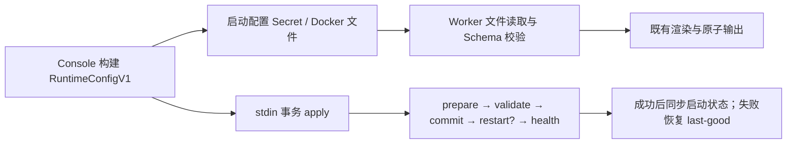

# Runtime 配置精简与文件输入设计简报

> 文档编号：MOD-RUNTIME-CONFIG-FILE-01
> 版本：v1.1；日期：2026-09-30
> 状态：设计已确认；用户先确认“写入”，后明确保留通用旧镜像回滚并支持手动删除、同名重建接管旧工作空间。尚未授权编码、构建或部署。
> 模板：Full；来源：本次生产排查记录及会话中已对齐的方案，无独立 PRD。

## 1. 文档控制

| 版本 | 日期 | 变更 |
|---|---|---|
| v0.1 | 2026-09-30 | 总结既有决定，补充输入契约、迁移、兼容、回滚和验收 |
| v1.0 | 2026-09-30 | 用户确认写入，锁定 Docker 同步支持、新建仅新 Worker、首次迁移失败恢复旧 workload |
| v1.1 | 2026-09-30 | 用户明确保留通用旧镜像回滚，加入同名删除重建接管路径及 3 个验收场景 |

需求与设计由项目负责人确认，编码和验证责任在后续 Plan 中分配。本文不宣称实现已完成或生产已验证。

## 2. 需求分析

### 2.1 需求概述

固定约 10 位用户共用一个 Worker。Console 每次重建 Runtime DTO 时，为每个 Agent 的 Skill Grant 复制完整脚本路径，再把完整 JSON 放入单个 MUAD_RUNTIME_CONFIG 环境变量。共享 Skill 的路径按用户重复，配置超过 Linux 单字符串限制后，容器入口无法执行。

分享记录 https://chatgpt.com/s/cx_6abb7057044481918f8f2039118fd093 显示：原 DTO 为 139343 bytes，managed 授权 195 份、scriptFiles 2424 条；清空非 traditional-script 的路径后为 70798 bytes，更新 Secret 并 rollout 后恢复 1/1 Running。这些是历史现场记录，不是本次重新测试的测量值；Running 不能替代 Skill 业务验证。

目标：保留 RuntimeConfigV1 和按 Agent 授权的设计，移除无用传输字段内容，启动改为文件输入，使有效的大 DTO 不再因单环境变量长度限制阻止进程执行。允许短暂重建中断，保留工作空间、会话、用户和凭证。

### 2.2 痛点与价值

配置并非随时间无限追加，而是重新生成时随 Skill 数量、文件路径和授权数增长。10 个 Agent 共享同一 Skill 时重复元数据是现有设计成本；本次先消除无人消费的路径，不引入共享定义和引用解析的重构风险。

自动升级沿用 Console 的 Worker 升级入口，不手工复制 JSON，不删除逻辑 Pod 或 PVC。另保留用户主动删除逻辑 Pod、选择保留状态，再以相同 Pod ID 创建新 Worker 接管的升级路径。Helm 只更新 Console，已有 Worker 迁移由升级流程或用户主动重建完成。

### 2.3 功能方案

| 功能 | 描述 | 优先级 | 来源 |
|---|---|---|---|
| FEAT-01 | managed/traditional-prompt 的 scriptFiles 输出非 nil 空数组；traditional-script 原样复制 | P0 | 会话：精简无人消费的数据，保留 DTO 结构 |
| FEAT-02 | Worker 启动支持 MUAD_RUNTIME_CONFIG_FILE，兼容旧 env 和 stdin | P0 | 会话：完整迁移到文件输入 |
| FEAT-03 | K8s 使用独立 Runtime Secret，完整 JSON 不再进入 envFrom | P0 | 会话：已有 Secret 内容转成挂载文件 |
| FEAT-04 | Docker 使用持久、只读挂载的配置目录和原子文件写入 | P0 | 用户确认：Docker 需要一起支持 |
| FEAT-05 | 既有升级入口切换镜像与输入方式；保留通用原镜像回滚，恢复配套 env/file 输入与服务 | P0 | 用户明确保留回滚旧镜像恢复服务的通用功能 |
| FEAT-06 | 启动输入与事务 apply 输入隔离，generation、health、rollback 正确 | P0 | 会话与现有 runtimeapply 规范 |
| FEAT-07 | 手动删除时保留状态，再以同名 Pod、新镜像接管旧卷并恢复原用户 | P0 | 用户明确要求手动删除、新建关联旧 workspace 升级 |

字段约束：RuntimeConfigV1.version 保持 1；不删除 scriptFiles 键，不变为 null；不修改数据库资产清单，不合并 Agent 权限，不裁剪真实配置或静默截断授权。

### 2.4 范围与边界

范围：配置构建、Worker 输入读取、K8s/Docker 启动资源、既有 Worker 升级/恢复、手动删除并同名重建接管旧工作空间、对应测试。Docker 已确认同时覆盖。

排除：共享 Skill 定义/引用的 DTO 重构、数据库表迁移、新前端交互、零停机多副本、上游 OpenClaw fork、压缩/分片环境变量、新增预警系统及任意 100/120 KiB 的产品门禁；新 Console 创建旧镜像、能力注册/白名单、根据 tag 猜能力均不实现。

前提：发布可使用不可变的新 Worker 镜像 tag/digest；测试环境能够运行真实 Worker。Secret 的平台容量上限仍存在，文件输入不承诺无限配置或消除所有启动故障。

### 2.5 验收条件

#### 2.5.1 规则与约束

| ID | 要求 | 场景 |
|---|---|---|
| RULE-01 | 精简只改变无用路径，授权、目录、隔离、模型与长任务语义不变 | S-01、S-02、S-09 |
| RULE-02 | 文件模式下 DTO 不得出现在进程 env、argv 或入口脚本中间转换的 env | B-01、S-03、S-04 |
| RULE-03 | 启动选定文件失败必须报错；事务 apply 始终消费本次 stdin | S-05、E-01 |
| RULE-04 | 保留状态，迁移与 apply 使用 Pod 级互斥；健康失败不能报成功 | S-06、E-02、E-03 |
| RULE-05 | 校验后写入，应用写出的配置 mode 0600、原子替换；K8s 注入源为 0440＋服务组读取；秘密不进镜像或诊断 | S-07、E-04 |
| RULE-06 | API 保持现有 envelope/errcode；外部操作有 deadline，明确处理错误 | E-02、E-03、E-05 |
| RULE-07 | 手动重建须显式保留状态和接管，同名卷及用户关联保持；新实例凭证和配置重新建立 | S-10、E-06、B-03 |

#### 2.5.2 验收场景

| 场景 | 功能 | 层级 | 关键真实边界、输入与可观测结果 |
|---|---|---|---|
| S-17 | FEAT-07 | integration | Real Node startup and transaction files plus Coordinator/Applier: retained higher generation eventually converges to new DTO and refreshed credentials; same-instance stale startup remains protected. Supplemental functional coverage; B-03 remains real Worker E2E. |
| S-16 | FEAT-04/06 | integration | Real Docker recovery arguments and local files with fake external CLI: original image and env/file input restored together; volume/token retained; failures explicit. Supplemental functional coverage; S-04/E-02 remain real Worker E2E. |
| S-15 | FEAT-05/06 | integration | Real K8s recovery manifest/resource builders with fake external API: snapshot and restore env/file inputs with original image, token and PVC preserved; supplemental functional coverage, E-02 remains real Worker E2E. |
| S-14 | FEAT-06 | integration | Real Coordinator/applier factory with fake external execution: source failure never completes apply; retried recovery uses current generation under existing Pod lock. Supplemental functional coverage; E-05 remains real Worker E2E. |
| S-13 | FEAT-06 | integration | Real Applier with fake external Driver: source publication follows validation and health; Pod restart prepares source before restart; failures restore source and runtime. Supplemental functional coverage of API-05/RULE-04/05; E-05 remains real Worker E2E. |
| S-12 | FEAT-04/06 | integration | 真实本地文件与目录：0700/0600、owner、原子 rename、无效输入及 I/O 失败保留 last-good；补充 API-03 和 RULE-05 的文件 helper 验收 |
| S-11 | FEAT-03/04/05 | unit | 强类型启动 payload、真实 Go Schema 和 JSON 编解码：file env 无 DTO，错误显式返回，env/file 恢复材料 round-trip；补充既有 API-03/04 契约的可执行验收，不改变行为方案 |
| S-01 | FEAT-01 | unit | Go grants 构建器：三种 EntryType 输出符合字段约束，复制不别名原 slice；Skill 名称/来源/目录/版本/longTask 保持 |
| S-02 | FEAT-01 | E2E | Go DTO 生成 → Node Schema → 真实 renderer：精简前后最终配置和指导文件字节一致；无需集群 |
| S-03 | FEAT-02/03 | E2E | 真实 K8s Secret → Deployment → 非 root Worker 启动：文件可读、env 不含完整 DTO，启动 generation 正确 |
| S-04 | FEAT-02/04 | E2E | 真实 Docker 目录 bind → Worker：文件模式启动正常，重启可读，原子更新后读取新文件 |
| S-05 | FEAT-02/06 | integration | 真实 Node 文件/管道：启动 file 优先 env；无 file 时旧 env 优先 stdin；transaction 的 stdin DTO 不受启动 file/env 干扰；已知 file 时不阻塞读取 stdin |
| S-06 | FEAT-05/06 | E2E | Console 升级 API → 存储 → 真实 K8s → Worker：旧 env Pod 切换新镜像和文件模式，PVC UID、工作空间与会话哨兵保持，凭证不意外轮换，generation/应用状态/健康收敛 |
| S-07 | FEAT-03/04/06 | integration | K8s manifest 与本地真实文件权限：生成权限设置正确；原子替换不留半截 JSON；fake client/command runner 覆盖驱动写入与错误路径 |
| S-08 | FEAT-05 | E2E | 新 Console → 真实 K8s/Docker → 配套新 Worker：新建和升级均使用文件；普通流程没有旧镜像/env 分支；新版 loader 的历史 env 读取由 S-05 独立验证 |
| S-09 | FEAT-01/05 | E2E | 真实 runtime guard 与隔离工作区：两个用户同名私有 Skill 不串扰；system 优先；传统脚本可执行、审计归属正确、长任务行为不变、模型绑定保持 |
| E-01 | FEAT-02 | integration | 真实 Node 读取：声明 file 但不存在/无权限/空文件/损坏 JSON/Schema 无效 → stderr 可定位错误、非零退出、原 openclaw.json 不被覆盖；不静默回退 env |
| E-02 | FEAT-05/06 | E2E | 升级 API → 真实 K8s/Docker/Worker：已迁移 Pod 的新镜像 health 失败后恢复先前文件模式镜像及输入资源；首次旧 Pod 迁移失败恢复升级前镜像与 env 输入；保留状态；回滚 generation 单调前移；健康成功才报告恢复 |
| E-03 | FEAT-05/06 | integration | httptest + fake Driver/Store：替换失败、回滚失败、取消/超时明确返回既有失败码并落终态，错误字段脱敏，不伪报 Running |
| E-04 | FEAT-03/04 | integration | fake K8s 写入错误/真实本地磁盘权限错误：失败向上返回，秘密不泄漏；候选写入失败不替换 last-good |
| E-05 | FEAT-06 | E2E | 真实 Worker 与事务管道：Secret 传播延迟/Console 重启/迁移重复执行/配置更新和升级竞争时，启动与 apply generation 不倒退；失败不发布未经健康验证的启动配置 |
| B-01 | FEAT-02/03/04 | E2E | 真实容器启动：有效合成 DTO 的 UTF-8 bytes >128 KiB、低于平台资源限制；file 模式正常执行入口并健康。固定 10 用户且保留传统脚本，不能只用 managed 冗余路径构造后被精简掉 |
| B-02 | FEAT-03/05 | integration | fake client：旧 env key 已不存在、部分迁移失败、Runtime Secret 已存在时可幂等继续；只清理已成功迁移资源，不误删服务令牌或保留状态 |
| S-10 | FEAT-07 | E2E | 真实 Console 删除/创建 API → SQLite → K8s/Docker 卷 → 新 Worker：deleteState=false 后卷与用户数据保留；相同 podId、新镜像、adoptState=true、restoreUsers=true 创建，卷 UID/标识、Agent ID、会话/记忆/私有 Skill 哨兵保持；新 DTO 走文件并健康，用户身份/模型绑定恢复 |
| E-06 | FEAT-07 | integration | httptest＋真实 repo＋fake driver：接管未明确授权返回保留状态冲突；创建/状态写入失败不能删除保留卷或工作空间；用户恢复冲突明确报错；新建生成新服务凭证、旧凭证失效 |
| B-03 | FEAT-07 | E2E | 保留卷 openclaw.json generation 高于新 Pod 记录初始 generation：同名重建后最终应用新 Pod 的通道/模型/文件 DTO 和新 gateway 凭证，不能永久停留旧配置或 token_mismatch；代次收敛与后续容器重启正常 |

集群/Docker E2E 不得以 mock 单元测试替代；项目常规 Go 测试仍用 fake client/runner，不连接生产集群。真实边界测试放独立 opt-in 测试套件，在隔离环境执行。真实企微身份、外部模型响应和平台账号可作发布人工抽查：自动化环境无法获得生产外部账号，不能据此免除上表可自动化验证。

## 3. 技术设计

### 3.1 方案选型

| 决策 | 采用 | 未采用 | 依据 |
|---|---|---|---|
| DTO 精简 | 仅保留 traditional-script 的 scriptFiles | 共享 Skill 引用/压缩/静默删授权 | 不改 version/schema，验证渲染等价，减少路径复制与 JSON 序列化成本 |
| K8s 文件来源 | 独立 name-runtime-config Secret，key 为 runtime.json | 长期复用 name-env 的完整 envFrom | 明确分离，文件模式 env Secret 不含大 DTO，现有 RBAC 已覆盖 |
| Docker 挂载 | 持久目录只读 bind，目录内原子 rename runtime.json | 临时 env-file、单文件 bind 后替换 inode | 支持后续更新和重启；单文件 bind 可能继续看到旧 inode |
| 更新方式 | 启动文件＋现有 stdin 事务 apply | Shell 将 JSON 放到 argv/env，文件变化直接绕过 apply | 消除 exec 字符串风险，不重新实现事务管道 |
| 发布兼容 | 新 Console 统一 file，先发布配套新 Worker；loader 保留 env/stdin 读取 | 旧镜像创建、能力注册/白名单 | 用户明确新建均使用新 Worker，避免新增配置与数据库字段 |

沿用 Go（当前 go.mod 1.25.10）、Node ESM、client-go；无需新增数据库或外部依赖。性能热点是序列化大小与路径复制：一次构建/序列化供本次资源写入使用，不按每个 Agent 额外创建 Secret；不增加按用户远程调用。10 用户及历史体积为容量基准，不编造延迟或吞吐目标。

### 3.2 架构与职责

runtimeconfig：构建精简后的 DTO。driver：管理 Secret/文件/挂载。api 与 runtimeapply：复用独占锁、升级/应用编排和失败恢复。Worker：读取、Schema 校验、渲染与原子输出。handler 不直接操作 Kubernetes 或 Docker 文件。

修改候选：internal/runtimeconfig/builder.go；internal/driver/{driver,runtime,k8s,k8s_manifest,docker}.go；internal/api/pod_upgrade.go、pod_spec.go 与 pods.go 的接管失败清理；runtimeapply 的编排衔接；bin/{runtime-config-schema,inject-multi-user-config,inject-env}.mjs。能力配置接口不新增，复用现有 repo 用户解绑/恢复接口，不增加 SQL 或表结构。辅助函数单一职责、≤50 行，新增 Go helper 放现有 internal 包。

### 3.3 存储设计

不新增/迁移数据库表，RuntimeConfigV1 内容结构保持。K8s 新增 ContainerName(podID)+"-runtime-config" Secret，runtime.json 为 UTF-8 DTO，主容器只读挂载到 /run/muad-config；启动读取 /run/muad-config/runtime.json。挂载整个 Secret 目录，不使用 subPath 单文件挂载。

K8s Secret 投影 root 所有权与非 root Worker 的权限必须实际验证。使用 0440 的只读 Secret 投影，FSGroup=1000，使 runtime 服务组可读、其他用户不可读；这是平台注入源，不由应用写入。Worker 直接读文件并校验，不添加 init/sidecar，不产生第二份 DTO 副本。应用写出的 openclaw.json、候选和备份仍使用 0600。禁止直接把 root:root 0600 投影交给 UID 1000 读取，禁止默认 0644 投影。现有 service-token 路径保持原契约。

Secret 自动传播不是事务完成依据。新 Pod 必须读取准备好的启动源；当前 Pod 的文件可能短暂仍是旧 generation，此时延续既有启动规则：磁盘 openclaw.json generation 更高则保留已应用配置。启动源最后同步成功才完成业务流程；若发生失败/重启，由重试与恢复收敛。E-05 必须覆盖传播延迟和容器重启，不只验证首次 Pod 启动。

Docker：配置文件放在驱动管理的每 Pod 私有目录，目录 0700、文件 0600，UID/GID 与 Worker 一致；目录只读挂载，控制面可更新。临时文件和目标同目录后 rename；更新期间保留旧版本用于恢复。删除 workload 保留 state 时不得误删仍被保留 workload 使用的配置。

### 3.4 输入与内部接口契约

| 接口 ID | 功能 | 契约 |
|---|---|---|
| API-01 | FEAT-01 | runtimeSkillScriptFiles(skill) []string：非脚本类型返回非 nil []，脚本类型复制原清单 |
| API-02 | FEAT-02 | MUAD_RUNTIME_CONFIG_FILE：绝对路径，声明后启动仅选择该文件；校验失败报错。未声明时保持 env → stdin |
| API-03 | FEAT-03/04 | 驱动准备启动资源：输入 PodSpec；统一输出文件路径、小环境变量、Secret/目录挂载；序列化/校验/写入均显式返回 error |
| API-04 | FEAT-05 | 复用既有升级 API imageTag 请求及稳定返回；升级配套新镜像使用 file，无新的前端请求字段 |
| API-05 | FEAT-06 | transaction 始终以显式 stdin JSON 为输入；prepare/commit 不读取 MUAD_RUNTIME_CONFIG_FILE 或启动 env |
| API-06 | FEAT-07 | 复用 DELETE /api/v1/containers/{podId}?deleteState=false 与 POST /api/v1/containers；创建传原 podId、新 imageTag、adoptState=true、restoreUsers=true；既有 envelope 和冲突码保持 |

所有 Node 输入统一经过 parseRuntimeConfig/validateRuntimeConfig。file 输入已确定时不先读取 stdin，避免挂起。普通 BuildEnv 不再产生 MUAD_RUNTIME_CONFIG；loader 保留旧 env 输入不代表 Console 支持旧镜像创建。BuildEnv 当前静默跳过 Marshal 错误的问题在相关传输 helper 中改为明确错误。

### 3.5 质量实现与合规落点

- Q-01：所有 Serialize/Write/K8s/Docker/Exec 错误显式处理并包装；沿用既有 operation deadline，go test/vet 与 bin/test 覆盖。API 仅调用 writeErr/writeRuntimeFailure/writeRepoError，传 errcode 常量。验证 E-03/E-04/E-05。
- Q-02：只记录 pod_id、generation、输入模式、字节数和 stage；不记录完整 DTO/Secret/通道或模型密钥。保存 apply/audit/日志错误前 RedactDiagnostic；操作审计不写入 Skill telemetry。验证 E-03/E-04/S-09。
- Q-03：Secret/挂载由 driver 管理，DTO 由 runtimeconfig 管理，升级编排复用 runtimeapply 和现有 API；删除重建复用 repo 的用户解绑/恢复，用户目录/模型绑定规则不变；接管失败保留原卷。验证 S-02/S-06/S-09/S-10/E-06。
- Q-04：事务成功前不把新状态认定为 last-good；startup 文件同步失败使流程明确失败或进入可观测恢复，不声称升级完成。健康校验 generation；同名重建不能因旧磁盘高代次而永久停留旧配置。驱动下发 DTO 前调用 Go Validate；Worker 调用共享 Node Schema；应用写出的配置使用 mode 0600、原子替换，K8s 投影注入源权限按 §3.3。验证 S-05/E-01/E-02/E-05/B-03。
- Q-05：发布产物不含凭证，运行时注入；投影权限与 UID/FSGroup 必须实际验证，保留工作区/浏览器/会话隔离，service-token 固定路径不变。删除重建生成新凭证，旧 token 不复用，磁盘契约刷新后必须能鉴权。验证 S-03/S-04/S-07/S-09/S-10/E-06/B-03。

- Q-06：RULE-backend-database-001 / RULE-backend-no-select-star-001：不新增 SQL 或表结构；保持 repo 边界、参数化与显式列名。TASK-001 承接自动补入的数据库规范。

- Q-07：RULE-runtime-directory-001, RULE-runtime-skill-001, RULE-runtime-skill-layering-001, RULE-runtime-log-injection-001, RULE-runtime-log-prefix-001, RULE-runtime-skill-fail-loud-001：共享启动读取位于 bin，不 fork 上游；保持 Skill 分层、保护、activation/并发/遥测；复用 CLI 模块日志前缀，读取/校验失败 stderr 并非零退出。TASK-002 承接路径自动补入的规范。

## 4. 部署与运维

### 4.1 发布路径

1. 构建并发布兼容 file/env/stdin 的不可变 Worker 镜像。
2. 发布支持新输入契约的 Console；新建默认镜像更新为配套新 Worker。既有旧 Worker 不在 Console 启动时被批量强制重建；迁移前的旧 workload 不由普通 UpdateSpec 清掉环境配置。
3. 管理员沿用升级操作，Pod 级互斥内准备新启动配置、更新镜像和挂载、等待 generation 与健康收敛。新建 Pod 统一 file，不使用能力识别。
4. 一个隔离测试 Pod 验证后再推广；升级期间保留 PVC、工作空间和既有 gateway/service 凭证的生命周期语义。

Helm templates/deployment.yaml 创建 Console，不创建 Worker；Role 已含 Secret 与 Deployment 所需权限。构建/打包方式保持，发布按现有版本/tag 流程，configFile.content 中 defaultImage 指向配套新 Worker。Helm upgrade 不等于自动迁移已有 Worker。

### 4.2 既有环境配置迁移

不在容器内把大 env 写成文件。迁移由 Console 在替换前读取现有启动 Secret，准备独立 Runtime Secret，并在同次 workload 替换中删除 env DTO 注入。新建启动 DTO 沿用现有 buildDesiredPodRuntime 与最新 generation，不盲目把旧 Secret 整体复制为新期望状态；读取旧 Secret 用于保留凭证、旧传输方式与回滚材料。

只有文件模式 workload 生效后才清理旧 env 中的大 key；若旧 env workload 尚可能重启，提前删除会破坏旧镜像启动。若保留旧 key 作为临时回滚材料，新 workload 必须改用逐项 SecretKeyRef 或新小 env Secret，不能继续 envFrom 旧整份 Secret。成功确认后清理冗余材料，不删除 PVC。

### 4.3 回滚与热更新

保存输入方式、启动资源和先前镜像的恢复材料；通用升级失败自动恢复升级前镜像及其 env/file 输入，不仅限首次迁移，generation 按现有 recoverPodUpgrade 逻辑单调前移。它是原 workload 的恢复能力，不开放旧镜像的普通 Create。恢复到 env 镜像时 DTO 必须可由 env 承载，否则明确报告回滚不可行，不伪报恢复。

热更新继续 stdin transaction，不由 Secret 文件变化触发直接写 openclaw.json。文件模式的启动源与已验证 apply 保持一致；失败恢复上一份可用启动源，避免未来重启应用失败候选。启动保留磁盘高 generation 的逻辑不能作为未验证候选的兜底，也不能取代启动源同步。配置更新、升级与恢复均使用同一 Pod 级互斥。

普通配置刷新通过已有 workload 的 manifest/挂载判断是否已迁移，不根据 imageTag 猜能力。尚未迁移的 K8s Pod 保持原 env 启动契约；必要时更新该既有启动源，不把它转为 file 或删除 key。Docker 尚未迁移的容器环境不变。该过渡行为仅维护已有旧 workload，普通 Create/ReplaceRuntime 仍统一 file；管理员完成新镜像升级才切换输入。

旧 Pod 自动重建、启动与普通 restart 入口需检查当前资源形态：普通新建/升级使用配套新镜像和 file；恢复旧 workload 使用独立恢复入口，按原输入形态重建，不能默默对旧镜像传 file。此约束通过既有错误 envelope 明确反馈，无新前端开关。

补充实现落点（2026-10-01）：升级进入 Pod 互斥后重新加载最新记录；普通 metadata 更新使用同一锁，避免旧快照覆盖。缺失 workload 的 restart 从原资源形态恢复；K8s 从保留启动 Secret 确认模式，Docker 在升级前持久化私有 0600 恢复材料，重建时校验 Pod ID 与 DTO。无可靠材料明确失败，不猜镜像能力。此处细化原恢复要求，不增加普通旧镜像创建。

### 4.4 手动删除与同名重建升级

保留通用自动回滚；用户也可主动选择这条独立升级路径，不要求先发生升级失败。复用当前 UI/API 和两种驱动的 AdoptState，不新增跨 Pod ID 迁移、卷重命名或数据库表。

1. 删除时明确选择保留状态（deleteState=false）。删除 workload 和 Pod 记录；保留 PVC/Docker 状态卷；用户解绑并保留 LastPodID、原 Agent ID、模型与身份/私有资产关联。旧 Pod 的服务凭证随删除失效，未使用绑定码按既有删除语义处理。
2. 用相同 podId 创建逻辑新 Pod，选择配套新 Worker 镜像，adoptState=true、restoreUsers=true。先恢复用户，再构建 DTO，使第一次配置已引用原 Agent ID/工作区；用户已绑定其他 Pod 或 Agent 冲突时明确报错，不静默转移。
3. 接管原卷，生成新的 service/gateway 凭证及文件启动源。新记录不直接复用旧 Secret 的 DTO/凭证；通道、资源等 Pod 级设置按新创建表单填写，不能承诺被删除记录的配置自动全部恢复。
4. 接管创建失败时保留原卷和用户资产，允许修正后重试。审查现有 provisionPod 在状态写入失败时调用 Remove(..., false) 的路径：接管场景不得沿用这种删卷清理。Runtime Secret/文件清理与 state 保留策略分别处理。
5. 旧磁盘高 generation 时必须让新实例配置和新凭证最终收敛；不能跨实例代次比较后永久屏蔽新 DTO。保留启动契约修复与协调器 apply，验收包含首次启动、apply 收敛、重启和实际 Skill 访问，不能只检查 Running。

卷名与用户恢复当前依赖相同 Pod ID。本次不新增不同 Pod ID 下任意指定旧 workspace 的交互。既有“接管同名保留状态卷”和“恢复原 Pod 用户”继续可用，无新增前端页面。代码依据：internal/api/pods.go 的 AdoptState/RestoreUsers、handleDeletePod；test/pod_keep_users_test.go、test/pods_api_test.go；K8s ensureStatePVC 和 Docker ensureStateVolume。

## 5. 风险与确认决定

| 风险 | 影响与措施 | 验证 |
|---|---|---|
| RISK-01：旧镜像不识别 file | 新建只选配套新 Worker；首次迁移更新镜像与输入；失败恢复旧 workload 及原 env 输入 | S-08/E-02 |
| RISK-02：完整 DTO 残留 envFrom | 新模式明确检查 env 集合，入口不能转成 argv/env | S-03/B-01/B-02 |
| RISK-03：权限及 stale inode/副本 | 非 root 权限实测；Docker 挂目录；K8s 重启必须重新取得正确启动源 | S-04/S-07/E-05 |
| RISK-04：应用或回滚状态漂移 | 保存 last-good、Pod 互斥、generation health、不隐式吞错 | S-06/E-02/E-03/E-05 |
| RISK-05：精简误删运行语义 | 只移除 DTO 冗余路径，真实渲染等价、传统脚本和隔离行为验证 | S-01/S-02/S-09 |
| RISK-06：跨边界测试缺失 | unit/fake 测试不足以证明容器启动，独立 opt-in E2E 必须验证真实挂载与进程 | S-03/S-04/S-06/B-01 |
| RISK-07：接管丢数据/新配置不收敛 | 失败清理不得删保留卷；原用户关联恢复；新实例凭证重建，覆盖旧磁盘高 generation | S-10/E-06/B-03 |

已确认：OPEN-01 Docker 一起支持；OPEN-02 新 Console 不兼容旧 Worker 创建，新建均使用新镜像。不增加镜像能力注册或旧镜像创建选项。

已确认：OPEN-03 用户明确保留回滚旧镜像恢复服务的通用功能，覆盖 env 和 file 输入；日常新建仍只有配套新 Worker＋file。OPEN-04 支持手动删除逻辑 Pod 保留状态，以同名 Pod、新镜像接管原卷并恢复用户；复用当前功能，不新增跨 Pod ID 任意 workspace 选择。无待确认的范围事项。

启动源同步时序：普通热更新先完成事务 health，再同步本次 DTO 到启动 Secret/文件，最后完成应用状态记录；源同步失败进入失败/重试，保留已生效磁盘配置及可恢复源。需要触发 Pod 重启的 apply 必须在重启前安全准备启动源并保存上一份用于回滚；不能先发未验证候选再尝试校验。Console 在其中任一窗口崩溃时协调器要能幂等收敛，E-05 覆盖该真实边界。新建/升级先准备源再创建新 workload；迁移源和已有 env 源分别管理，不原地破坏运行旧 Pod 的 Secret。

## 6. 需求追溯矩阵

| 来源 | 功能 | 接口 | 验收 | 状态 |
|---|---|---|---|---|
| 会话：保留设计并精简 | FEAT-01 | API-01 | S-01/S-02/S-09 | 待实现 |
| 会话：文件输入、保留兼容 | FEAT-02 | API-02/API-05 | S-03/S-05/E-01/B-01 | 待实现 |
| 会话：迁移已有 Secret | FEAT-03 | API-03 | S-03/S-07/E-04/B-02 | 待实现 |
| 用户确认：Docker 一起支持 | FEAT-04 | API-03 | S-04/S-07/B-01 | 待实现 |
| 用户明确：保留旧镜像回滚的通用功能 | FEAT-05 | API-04 | S-06/S-08/E-02/E-03/B-02 | 待实现 |
| 既有 runtimeapply 规范 | FEAT-06 | API-05 | S-05/E-01/E-02/E-05 | 待实现 |
| 用户明确：手动删除并接管旧 workspace 升级 | FEAT-07 | API-06 | S-10/E-06/B-03 | 复用已有能力，补回归与必要修正 |

## Spec Compliance Matrix

Context 已选择 6 个相关 Spec；以下 12 条 required Rule 均有具体落点和验收方式。无 N/A 或 waiver，实际编码验证尚未执行。

| Spec/Rule | enforcement | 设计影响及具体落点 | 验证场景/verifier | 状态 |
|---|---|---|---|---|
| backend-code-quality-performance#RULE-backend-quality-001 | required | §3.5 Q-01：错误、deadline、Go 测试/vet | E-03/E-04/E-05；manual 设计审核＋自动测试 | applied（设计落点，待实现验证） |
| backend-code-quality-performance#RULE-backend-write-err-001 | required | §3.5 Q-01：仅稳定 errcode 输出 | E-03；regex＋httptest | applied（设计落点，待实现验证） |
| backend-directory-structure#RULE-backend-directory-001 | required | §3.2、§3.5 Q-03：driver/runtimeconfig/api 分层 | S-02/S-06；manual 包边界审核 | applied（设计落点，待实现验证） |
| backend-logging#RULE-backend-logging-001 | required | §3.5 Q-02：结构化且无秘密、审计独立 | E-03/E-04/S-09；manual＋日志断言 | applied（设计落点，待实现验证） |
| backend-logging#RULE-backend-redact-001 | required | §3.5 Q-02：写失败字段前脱敏 | E-03/E-04；manual＋注入敏感错误断言 | applied（设计落点，待实现验证） |
| backend-platform-rules#RULE-backend-platform-001 | required | §3.5 Q-03/Q-04/Q-05、§4.3：隔离、runtime health/rollback | S-06/S-09/E-02/E-05；manual＋E2E | applied（设计落点，待实现验证） |
| backend-platform-rules#RULE-backend-http-envelope-001 | required | §3.4 API-04、§3.5 Q-01：维持响应 envelope | E-03；regex＋httptest | applied（设计落点，待实现验证） |
| backend-platform-rules#RULE-backend-model-pool-001 | required | §2.5 RULE-01、§3.5 Q-03：模型绑定不回退不改共享 | S-09；既有模型绑定回归＋E2E | applied（设计落点，待实现验证） |
| runtime-config-and-apply#RULE-runtime-config-001 | required | §3.5 Q-04、§4.3：继续事务 apply 与恢复 | S-05/E-02/E-05；manual＋E2E | applied（设计落点，待实现验证） |
| runtime-config-and-apply#RULE-runtime-validate-before-write-001 | required | §3.4、§3.5 Q-04：校验→原子输出、generation | S-05/E-01/E-05；manual＋Node 测试 | applied（设计落点，待实现验证） |
| runtime-isolation-and-security#RULE-runtime-security-001 | required | §3.5 Q-05：运行时注入且用户隔离 | S-03/S-04/S-09；manual＋E2E | applied（设计落点，待实现验证） |
| runtime-isolation-and-security#RULE-runtime-secret-file-mode-001 | required | §3.3、§3.5 Q-05：配置 0600、保留 token 契约 | S-07/E-04/E-05；manual＋权限断言 | applied（设计落点，待实现验证） |

## 7. 设计验证状态

用户已确认写入并明确增补通用回滚与手动重建路径。设计有 7 个功能、19 个验收场景，12 条 required Rule 均具备具体落点与验证方式；需求、功能、接口、验收、规范与高影响风险追溯闭合。Spec Context 绑定及 artifact/section/item/hash 由脚本回填，Context 校验与 Design Gate 的输出作为本轮最终结果。设计门禁通过不代表实现测试或生产验证通过，也不授权编码、构建和部署。
