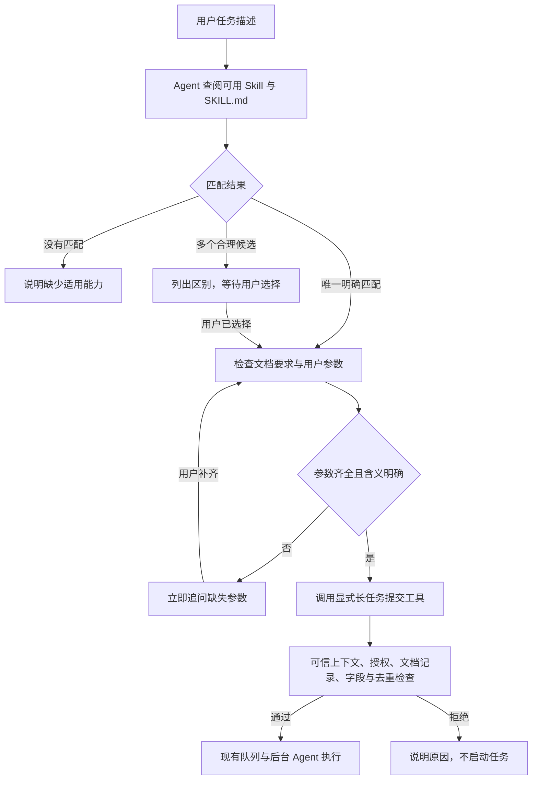

# Skill 执行前匹配与参数检查设计

> 文档编号：MOD-SKILL-PREFLIGHT-1.0
> 文档版本：v1.0
> 创建日期：2026-10-01
> 文档状态：已批准（用户于 2026-10-01 确认写入）
> 来源：本会话需求与生产问题；无独立 PRD
> 模板：Full（运行时触发、工具入口、指导规则、审计进度跨模块调整）

## 1. 文档控制

### 1.1 责任与评审

用户负责需求与行为取舍确认；实施阶段负责插件、renderer、测试与上线验证。本文仅设计，不授权直接修改业务代码、构建镜像或部署。Spec Context 已按预计实现路径绑定；用户已确认本设计及范围取舍，可进入计划阶段。

### 1.2 修订历史

| 版本 | 日期 | 说明 |
|---|---|---|
| v0.1 | 2026-10-01 | 汇总已确认行为，形成基于 SKILL.md 的执行前检查与显式长任务提交草稿 |
| v1.0 | 2026-10-01 | 用户“确认写入”，批准设计；首期仅改长任务执行机制，文档要求不明时先澄清、不启动 |

## 2. 需求分析

### 2.1 需求概述

用户以自然语言描述任务。Agent 在可用 Skill 中选择适用能力，读取文档明确脚本调用方式和必填参数，满足执行条件后才执行。唯一明确匹配无需二次确认；多个合理候选必须等用户选择；缺参数必须先追问。

生产案例：用户要求客户安全分析报告，Agent 找不到对应能力，在查找期间读取季报 Skill，意外启动季报长任务。另一个案例：脚本要求客户 ID，用户只给客户名称，任务却被提前丢到后台进行各种尝试。

### 2.2 现状与根因

| 代码位置 | 当前行为 | 问题 |
|---|---|---|
| tools/muad-runtime-guard/src/long-task-hooks.mjs | read 命中已授权 longTask 根目录内文件即 manager.submit；SKILL.md 和脚本均可命中 | 读取候选即提交，不区分了解与执行 |
| 同文件 beforeDispatch | /skill:名称直接提交；自然语言确定后 exec/bash 命中脚本也自动提交 | 可绕过参数补齐阶段 |
| tools/muad-runtime-guard/src/skill-audit-hooks.mjs | read SKILL.md 即登记执行审计并调用进度激活 | 查阅可能产生执行记录和进度消息 |
| bin/openclaw-config-renderer.mjs | 固定指导规则声明读取即激活与审计边界 | 与新行为冲突，仅追加提示词不能修复 |
| tools/muad-runtime-guard/src/long-task-manager.mjs | 创建后台会话，传递原任务与 Skill 路径，要求遵循真实文档 | 过早提交让缺参数请求在后台探索 |

当前 Skill 文档已描述脚本及入参。复用 SKILL.md，不要求另写 inputSchema，不新增每个 Skill 的重复配置。旧 muad-run-skill 插件及工具已在 renderer 标记废弃，导航 map 中的旧入口不能作为实际实现依据。

### 2.3 功能方案

| 功能 | 名称 | 说明 | 优先级 | 来源 |
|---|---|---|---|---|
| FEAT-01 | 无副作用查阅 | read 长任务文档、脚本及引用文件不提交、不执行、不登记该长任务为已执行 | P0 | 用户“在 read 的过程中不能触发执行” |
| FEAT-02 | 匹配与选择 | 唯一明确匹配直接进入参数检查；多个合理候选列明差异并等用户选择；无匹配如实说明 | P0 | 用户“多个二次确认，唯一不用确认” |
| FEAT-03 | 文档入参检查 | 依据 SKILL.md 的命令、必填参数与说明检查输入，缺失或含义不明立即追问 | P0 | 用户“文档描述了脚本怎么调用” |
| FEAT-04 | 显式提交 | 新增专用长任务工具，复用现有队列；提交固定 Skill、目标及已确定参数 | P0 | 已对齐“取消 read 入队，显式提交”方案 |
| FEAT-05 | 拦截旧触发与绕行 | /skill:不再立即入队；前台命中长任务脚本阻止执行且不自动提交 | P0 | 防止绕过匹配与参数检查 |
| FEAT-06 | 执行记录与进度 | 查阅和缺参不显示任务已启动；接受提交后产生任务状态，真实开始执行后登记执行审计 | P0 | 生产可观测结果与现有代码分析 |
| FEAT-07 | 隔离与幂等 | 可信身份与会话决定路径、投递目标；同一轮重试不重复提交；保留授权及并发上限 | P0 | 现有运行时约束 |
| FEAT-08 | 后台使用确定输入 | 传递已选 Skill、最终目标和已补齐参数；不把缺参请求丢到后台探索 | P0 | 用户“快速提醒完善输入，而不是后台各种尝试” |

### 2.4 范围与边界

已确认：自然语言交互；唯一匹配直接执行；多个匹配等待选择；缺参先补齐；读取无执行副作用；入参来源为 SKILL.md；可用集合必须是当前用户的有效授权 Skill。

本次仅改造长任务的代码提交机制，普通 Skill 统一接受匹配与缺参系统指导，但保持原执行机制。普通 Skill 的完整显式激活、审计与进度边界重构不纳入本次；后续若纳入，必须增量扩展 Context 和普通任务入口设计，不能直接套长任务队列。

不新增后台管理页面，不修改数据库表结构，不维护独立语义搜索服务，不硬编码“季报”等业务名，不逐 Skill 新增结构化参数契约，不重写业务脚本或后台队列，不 fork OpenClaw。

缺文档要求的处理：如果文档没有明确调用方式或必须提供什么输入，先澄清并提示完善文档，不启动任务；文档明确无需输入时可正常执行。该兼容取舍已获用户确认。

取舍：匹配准确性、参数语义和用户是否选定由模型理解；代码强制检查显式提交、授权、文档读取记录、字段完整性和去重。不能声称自然语言文档提供了确定性的参数 Schema，也不能把模型提供的“已确认”布尔值当作可信用户授权。

### 2.5 验收条件

#### 2.5.1 业务规则

| 规则 | 内容 | 场景 |
|---|---|---|
| RULE-01 | 读取长任务目录文件只用于了解，不入队、不执行、不触发长任务执行审计/进度 | S-01、S-06、E-01 |
| RULE-02 | 唯一明确适用且参数齐全直接提交，禁止额外确认 | S-02 |
| RULE-03 | 多个合理适用候选先让用户选择，选择前不得提交 | S-03、B-01 |
| RULE-04 | 无适用 Skill 不擅自用季报等近似能力替代 | E-01 |
| RULE-05 | 客户名称不得猜成客户 ID；只有文档定义了转换流程才可解析 | S-04、S-05、E-02 |
| RULE-06 | 前台脚本、/skill:与提交失败不能绕过执行前检查或退化为自动串行执行 | E-03、E-04、B-02 |
| RULE-07 | 只使用可信用户/会话授权；保留 system 优先、protected、覆盖规则、并发限制及重复提交保护 | E-05、B-03、S-07 |
| RULE-08 | 后台使用选定 Skill 和已补齐输入；业务执行错误正常失败，不能不断猜参数 | S-08、E-06 |

#### 2.5.2 验收场景

| 场景 | 功能 | 层级 | 关键真实边界 | 输入与可观测结果 |
|---|---|---|---|---|
| S-01 | FEAT-01 | integration | 真实文档、long-task/audit/progress hooks、真实队列状态文件；外部通知可 spy | read SKILL.md/脚本/引用文件；队列与执行记录不变，脚本哨兵未生成、无进度通知 |
| S-02 | FEAT-02/03/04 | E2E | renderer→实际 OpenClaw/模型→新工具→队列→脚本→实际回复 | 单一适用 Skill、提供完整 customerId；无确认追问，恰好一任务，脚本收到正确 ID |
| S-03 | FEAT-02 | E2E | 实际模型多轮对话、读取工具、新提交工具与队列 | 两个明确候选，首轮列出候选与差异且零任务；用户选择后参数齐全才执行选定 Skill |
| S-04 | FEAT-03 | E2E | 真实 SKILL.md 参数要求、实际模型、多轮会话、队列与脚本 | 文档要求 customerId，仅给客户名称；首轮提示补 ID，零任务/零业务调用；补 ID 后一次提交 |
| S-05 | FEAT-03 | E2E | 文档定义的转换工具、实际模型与队列 | 文档允许名称解析 ID；唯一查询结果才可提交，多结果需用户选择，查不到则追问 |
| S-06 | FEAT-06 | integration | 真实激活 hooks 和提交入口、记录与进度投递捕获 | 只读说明不登记长任务执行；排队与真实开始分别产生对应状态，不因重复 read 重复审计 |
| S-07 | FEAT-07 | integration | 真实授权索引、工具上下文、manager、临时状态文件、shared lease | 两用户同名 Skill 按各自 root 分离；有效 system 优先；同轮重复工具调用返回同任务；并发不超限 |
| S-08 | FEAT-04/08 | E2E | 实际后台会话、消息构造、脚本、结果投递 | 用户后续补齐参数；后台收到原请求、最终目标及绑定参数，不丢最新补充，不重复澄清 |
| E-01 | FEAT-01/02 | E2E | 生产问题等价真实模型对话、read、队列、季报脚本哨兵 | 只有季报 Skill，要求安全分析报告；读取季报说明也不得建任务；回复无适用 Skill |
| E-02 | FEAT-03 | integration | 新工具字段校验和真实队列 | 自报缺参、必填参数没有绑定、值为空、引用不存在；明确拒绝，零入队 |
| E-03 | FEAT-05 | integration | 真实 exec/bash hooks、命令判定与真实队列 | 前台执行长任务脚本；block且零提交；ls/cat/grep 等普通查看放行 |
| E-04 | FEAT-04/05 | integration | 真实提交入口/队列关闭与 I/O 失败边界 | manager不可用或写入失败；不返回已启动，不退化前台执行，诊断脱敏 |
| E-05 | FEAT-07 | integration | 可信工具上下文、真实 grant/root 解析 | 伪造 agent/session/peer、越权 Skill、root traversal、读取后撤销授权；拒绝且无其他用户输出 |
| E-06 | FEAT-08 | integration | 真实后台消息构造、非零退出脚本、状态与投递 | 脚本失败写 stderr/非零；记录失败，不修改客户 ID 自动重试，保留既有输出及错误转发 |
| B-01 | FEAT-02/03 | E2E | 实际多轮模型会话及队列 | “第2个”只关联本会话未取消候选；用户改换目标、取消或切换用户后不能复用旧选择 |
| B-02 | FEAT-05/03 | E2E | 实际 /skill: 分发与模型预检 | /skill:季报但缺 ID；先追问，零任务；/skill:提供完整输入按预检后提交，无额外确认 |
| B-03 | FEAT-07/08 | integration | 真实 manager持久化、重启恢复和执行消息 | 新任务保持明确输入；旧队列记录无新字段仍可恢复原行为；不承诺已存在的错误任务自动取消 |
| B-04 | FEAT-03 | E2E | 真实文档与模型、提交入口 | 明确无参 Skill 可执行；未说明参数或文档矛盾时先澄清并提示完善文档，零提交 |
| B-05 | FEAT-01/04 | integration | 实际 read after hook、版本标识与授权 | 未读/读取失败/文档更新后沿用旧预检记录，拒绝并要求重新读取；read成功本身零副作用 |
| S-09 | FEAT-01/04 | E2E | 控制面 DTO→schema/transaction→renderer→真实 Worker工具可见性 | 更新指导规则与配套插件；校验/健康通过后生效；工具在业务 Agent 可见且 main 不可用；失败恢复 last-good |

E2E 不使用 fake 模型代替语义匹配；固定可复核 Skill 文档、任务和脚本哨兵，检测真实回复与任务/业务调用数量。不声称所有自然语言都可保证识别；E2E 编码期只登记，功能验收后按流程执行。

#### 2.5.3 非功能要求

缺参首轮只做文档预检、必要澄清，不创建后台任务或无文档依据的业务查询。无真实延迟/QPS测量，本文不编造指标。已有并发上限、投递与失败恢复继续有效；秘密不出现在提交日志和提示中。

## 3. 技术设计

### 3.1 方案选型

| 方案 | 评价 | 决策 |
|---|---|---|
| 只改 system prompt | 无法阻止 read hook 在模型判断前入队 | 否决 |
| 取消 read 入队＋system prompt＋专用长任务提交工具 | 不重复定义参数，队列可复用，代码明确提交边界 | 采用 |
| 全量 inputSchema 与参数服务 | 确定性校验更强，但重复现有文档且扩大后台/迁移范围 | 本次不采用 |
| 引入专用检索/匹配模型服务 | 增加请求、依赖和延迟；仍无法天然判断用户意图 | 本次不采用 |

技术继续使用外置 Node ESM 插件、renderer 和现有 LongTaskManager。插件 API 的 registerTool 工厂形式参考仓库 tools/session-manager/openclaw-plugin.mjs；具体上下文/工具 allowlist 以安装的 OpenClaw 版本做集成确认。

### 3.2 架构与执行流程



方案保留普通 read 的真实文档返回，不再生成提交桩、改写 read 路径或使用 read 自动提交。成功读取只在 after_tool_call 记录本轮预检材料，不登记执行、不占执行租约；before hook不能把失败读取标为成功。

exec/bash 命中长任务执行脚本时仅拦截，提示使用提交入口；删除拦截分支中的自动 manager.submit。沿用并加强既有命令判定测试，查看命令不阻断。该路径检测是现有范围内的防误运行措施，不承诺检测任意动态/混淆 shell。

/skill:名称表示已指定 Skill，可跳过候选选择，但仍进入文档和参数预检；取消 beforeDispatch 即时提交。后台专用 longtask 会话保留防递归逻辑；该会话只能执行已提交 Skill，不能再次提交长任务。

原读文档即执行的固定指导块必须替换，不能只在用户自定义 prompt 后追加规则。匹配与缺参要求作为平台固定指导保留，用户 guidance 不得重新开启 read 自动入队。

### 3.3 数据与上下文

不新增 SQLite 表或列。前台候选、用户选择和补充参数主要使用现有对话上下文，不新增全局候选数据库；跨用户/跨会话不继承决策。

新增短期读取记录按可信 agentId＋sessionKey＋runId＋Skill有效身份保存，只记录文档真实路径及修订标识。继承现有 turn TTL/清理方式。每轮执行前重读文档，回复“第2个”可从当前对话理解选择，不能把上轮 read当本轮执行授权。

manager任务记录增加可选 executionInputs 字段：参数名称、最终值、来源说明及 requiredNames。旧记录缺字段按原队列恢复逻辑读取；新提交必须带该字段。敏感记录沿用0600/原子写及压缩机制，正常日志只输出 taskId、Skill、状态及原因码。

### 3.4 工具与内部接口

API-01：建议工具名 muad_submit_long_task，覆盖 FEAT-03/04/07。注册在 muad-runtime-guard，业务 Agent 可见，main无权调用；不得接受 agentId、peerId、rootPath、投递通道等模型可指定的身份字段。参数采用严格对象，拒绝未知键。

| 请求字段 | 类型 | 必填 | 约束 |
|---|---|---|---|
| skillName | string | 是 | 当前用户 effective longTask grant的精确名称；root可信解析 |
| objective | string | 是 | 本次最终任务目标，不用说明文档冒充用户请求 |
| selectionBasis | unique_match / user_choice / explicit_name | 是 | 模型对匹配来源的说明；不能等同可信授权证据 |
| requiredNames | string[] | 是 | 从当前 SKILL.md识别的必填参数名，去重；允许明确无参文档的空数组 |
| bindings | 参数绑定对象数组 | 是 | 每项 name:string、value:string、source:user_message/conversation/document_default/document_resolution；必填参数必须存在且非空 |

请求示例（Skill无需新增字段）：

```json
{
  "skillName": "quarterly-report",
  "objective": "生成客户本季度报告",
  "selectionBasis": "unique_match",
  "requiredNames": ["customerId"],
  "bindings": [
    {"name": "customerId", "value": "customer-123", "source": "user_message"}
  ]
}
```

API-02：内部 preflight校验读取记录与输入、授权，覆盖 FEAT-01/05/07；API-03：现有 manager.submit和longTaskMessage增加输入传递，覆盖 FEAT-04/06/08。

工具成功结果返回 status:accepted、taskId、skillName、queuedAhead、active、queued。失败返回 status:rejected和稳定reason：skill_not_authorized、context_unavailable、documentation_not_read、documentation_changed、invalid_input、missing_input、queue_unavailable。这是插件工具契约，不复用HTTP状态码。所有拒绝零入队；重试同run/Skill使用已接受taskId，不允许偷偷创建另一任务；不同Skill再次提交应明确拒绝或要求新一轮请求。

代码只能确定性校验“模型提交的 requiredNames是否均有值”，不能证明 requiredNames覆盖文档全部要求，不能证明 value确为真实customerId，也不能凭selectionBasis证明用户确实选过。上述语义由固定指导及真实模型验收覆盖，不宣传为强语义门禁。

后台消息传递：原始用户请求＋最终目标＋已确定绑定值＋Skill路径。明确遵循文档调用，使用已确定参数；不得把名称猜成ID、擅自替换值或换Skill。发现预检遗漏时返回明确缺参结果，不在后台反复探索。正常业务失败保留现有失败上报与投递。

### 3.5 质量实现与 Spec Compliance 落点

- Q-CONFIG：指导与工具可见性由renderer确定性生成，经DTO/schema验证、prepare/validate/commit、generation与health/rollback生效，不直接覆盖Worker配置。场景S-09。
- Q-WRITE：renderer仍在inject/transaction执行validateRuntimeConfig后原子落盘；新队列字段沿用原子写和0600，不更换service-token0400规范路径。场景S-09、B-03。
- Q-DIR：新增模块放tools/muad-runtime-guard/src与test；指导在bin及bin/test。文档更新docs/long-task-async-execution.md，不恢复废弃runner、不fork上游。场景S-01、S-09及代码审查。
- Q-SECURITY：身份、session、投递目标从可信tool上下文派生；重新校验当前授权；不接受模型root/用户参数；业务凭证运行时解析，禁止日志输出完整prompt/绑定值/命令/密钥。场景E-05、S-07。
- Q-FILEMODE：任务输入与短期材料只使用用户隔离范围；若落盘使用0600及临时文件rename；service-token仍0400。场景B-03、E-05。
- Q-SKILL：提交与实际运行分别维护幂等和现有队列/租约；授权撤销后不能提交；后台会话不重复入队，进度沿现有接口。场景S-06、S-07、B-02。
- Q-LAYER：有效Skill解析保持system优先与protected，public/private默认不覆盖，allow_override才显式覆盖；不自行扫描别的用户目录。场景S-07、E-05。
- Q-LOG：工具和hooks注入log回调默认no-op，入口使用api.logger?.warn；既有CLI用console.warn。场景E-04、E-06及代码审查。
- Q-PREFIX：统一[muad-runtime-guard][skill-preflight] / [longtask-submit]等稳定子标签；记录拒绝原因和taskId，不记录敏感内容。场景E-04、E-05。
- Q-FAIL：提交失败显式rejected，不fallback前台；脚本错误stderr/非零，stdout机器结果，保持exec失败转发。场景E-04、E-06。

性能策略：先通过现有available_skills描述缩小候选，再按需读取候选真实文档；不每轮扫描所有目录，不增加一轮外部LLM匹配服务。共享最新grant索引按agent/name查找，实际提交前校验；文档变更比较受影响材料，不全量hash所有Skill。已有队列异步运行，预检不占长任务执行槽。日志和读取记录按现有TTL有界清理。匹配模型调用成本沿用现有Agent，不承诺新增语义过程零延迟。

## 4. 部署与运维

需要配套Worker插件与固定指导，K8s/Docker相同插件逻辑；不改变部署模板或状态卷结构。不能只热更新prompt、仍保留旧read hook，也不能只取消read提交却没有可见的新工具。

发布前验证工具注册/allowlist、hooks与当前安装OpenClaw版本契约；检查读取、缺参、唯一匹配、多个匹配真实会话。发布后使用相同generation事务与health策略应用指导，并按现有升级机制更新Worker镜像。

已有running任务不因新前台规则被取消；已有queued记录按原队列行为处理。灰度期间需检查旧误提交任务并由管理员判断是否取消，不能声称本变更能追溯撤销。回滚旧镜像/指导会恢复read触发的旧行为，需明确回滚边界；保留数据兼容，不删用户workspace。

## 5. 风险与依赖

| 风险 | 内容 | 应对 | 场景 |
|---|---|---|---|
| RISK-01 | 模型误判唯一匹配、漏读必填项或把名称填成ID | 固定指导、明确文档证据、无歧义fixture与真实模型验收；不承诺确定性语义校验 | S-03、S-04、E-01、E-02 |
| RISK-02 | 文档不完整，旧Skill不能完成预检 | 区分明确无参与未说明；要求不明先澄清，不自动猜参数、不提交 | B-04 |
| RISK-03 | 旧read审计/进度仍误报启动 | 长任务相关审计与进度一起迁移；普通Skill原执行机制保留，不宣称其读取审计也已迁移 | S-01、S-06 |
| RISK-04 | 新工具不可见或/skill与exec仍自动提交 | 注册与allowlist集成检查，去掉所有隐式入队及serial fallback | E-03、B-02、S-09 |
| RISK-05 | 用户选择串会话或重试重复入队 | 可信会话上下文，当前轮重读，幂等与取消/变更目标回归 | B-01、S-07、E-05 |
| RISK-06 | 参数持久化泄密或丢用户补充 |0600任务材料，最小化日志，兼容旧记录，传递最终输入 | S-08、B-03、E-05 |

依赖：当前安装OpenClaw的工具注册和上下文API；现有文档的实际入参描述质量；实际模型可访问及独立测试用户。专用fixture验证不向真实客户发测试报告，不以fake模型冒充完整E2E。

## 6. 需求追溯矩阵

| 来源 | 功能 | 入口/落点 | 场景 | 状态 |
|---|---|---|---|---|
| 用户读取不能执行 | FEAT-01 | API-02、read/audit/progress hooks | S-01、S-06、E-01、B-05 | 待实现 |
| 用户唯一直接/多个选择 | FEAT-02 | 固定系统指导、API-01 | S-02、S-03、E-01、B-01 | 待实现 |
| 用户文档已有脚本参数 | FEAT-03 | 固定系统指导、API-01/02 | S-04、S-05、E-02、B-04 | 待实现 |
| 用户显式提交方案 | FEAT-04 | API-01/03 | S-02、S-08、S-09、E-04 | 待实现 |
| 已对齐执行边界 | FEAT-05 | exec/bash、beforeDispatch、API-02 | E-03、E-04、B-02 | 待实现 |
| 可观测结果不误报 | FEAT-06 | 审计/进度触发、API-03 | S-01、S-06 | 待实现 |
| 原有授权/隔离约束 | FEAT-07 | API-01/02/03、可信上下文 | S-07、E-05、B-01、B-03 | 待实现 |
| 缺参不后台探索 | FEAT-08 | API-03、后台消息 | S-08、E-06、B-03 | 待实现 |

## Spec Compliance Matrix

| Spec/Rule | enforcement | 设计影响 | 设计落点 | 验证场景/verifier | 状态 |
|---|---|---|---|---|---|
| runtime-config-and-apply#RULE-runtime-config-001 | required | 指导及工具更新事务化 | §3.5/Q-CONFIG | S-09＋规范manual verifier | 设计已落点，待实施验证 |
| runtime-config-and-apply#RULE-runtime-validate-before-write-001 | required | schema、generation及原子写 | §3.5/Q-WRITE | S-09、B-03＋规范manual verifier | 设计已落点，待实施验证 |
| runtime-directory-structure#RULE-runtime-directory-001 | required | 外置插件目录与不fork | §3.5/Q-DIR | S-01、S-09＋代码审查manual verifier | 设计已落点，待实施验证 |
| runtime-isolation-and-security#RULE-runtime-security-001 | required | 用户隔离及运行时凭证 | §3.5/Q-SECURITY | S-07、E-05＋规范manual verifier | 设计已落点，待实施验证 |
| runtime-isolation-and-security#RULE-runtime-secret-file-mode-001 | required | 材料权限、原子写 | §3.5/Q-FILEMODE | B-03、E-05＋规范manual verifier | 设计已落点，待实施验证 |
| runtime-skill-execution#RULE-runtime-skill-001 | required | 激活、进度、并发 | §3.5/Q-SKILL | S-06、S-07、B-02＋规范manual verifier | 设计已落点，待实施验证 |
| runtime-skill-execution#RULE-runtime-skill-layering-001 | required | system优先与覆盖规则 | §3.5/Q-LAYER | S-07、E-05＋规范manual verifier | 设计已落点，待实施验证 |
| runtime-skill-execution#RULE-runtime-log-injection-001 | required | 注入logger | §3.5/Q-LOG | E-04、E-06＋代码审查manual verifier | 设计已落点，待实施验证 |
| runtime-skill-execution#RULE-runtime-log-prefix-001 | required | 稳定日志标签 | §3.5/Q-PREFIX | E-04、E-05＋规范manual verifier | 设计已落点，待实施验证 |
| runtime-skill-execution#RULE-runtime-skill-fail-loud-001 | required | 显式失败，不前台fallback | §3.5/Q-FAIL | E-04、E-06＋规范manual verifier | 设计已落点，待实施验证 |

## 用户确认记录

确认日期：2026-10-01。确认来源：用户在设计摘要及两个推荐取舍后回复“确认写入”。

1. 首期仅改造长任务执行机制，普通 Skill 保留原执行机制但统一指导规则。
2. SKILL.md 没有明确参数/调用要求时，先澄清、不提交；明确无参文档仍可执行。
3. 设计批准并定稿。该确认不等于代码实施授权，也不等于实现测试或规范人工验收已通过。
