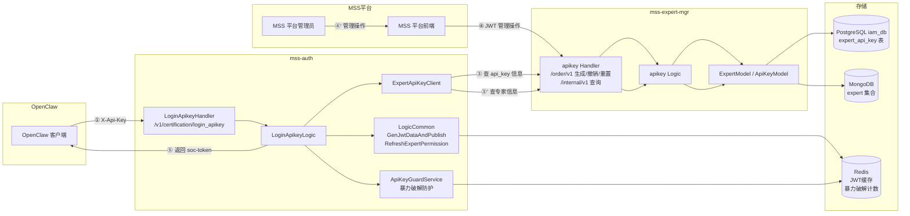
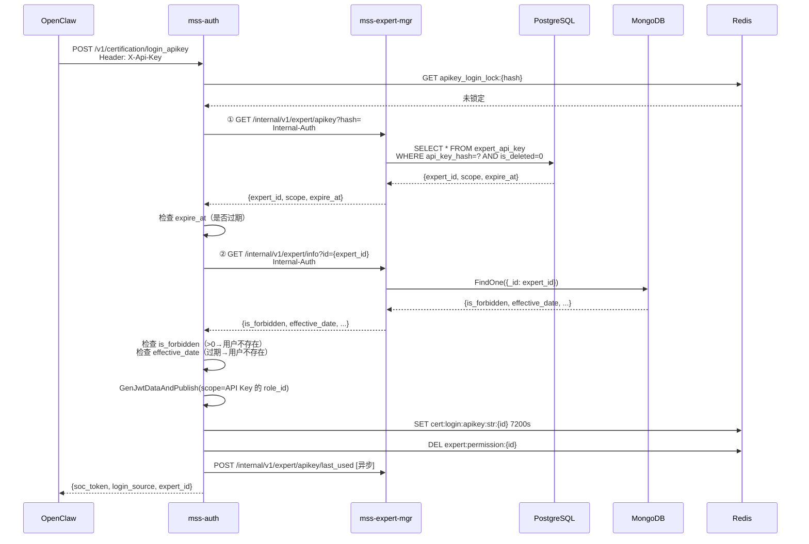

SFRD-TS-03-1.4_release-v4.0.2_API Key 登录认证模块微型设计说明书

# SFRD-TS-03-1.4_release-v4.0.2_API Key 登录认证模块微型设计说明书

## 目录

- [1. 介绍](#1-介绍)
  - [1.1. 目的](#11-目的)
  - [1.2. 定义和缩写](#12-定义和缩写)
  - [1.3. 参考和引用](#13-参考和引用)
- [2. 模块方案概述](#2-模块方案概述)
  - [2.1. 方案选型](#21-方案选型)
    - [2.1.1. 选型零：整体登录方式（核心选型）](#211-选型零整体登录方式核心选型)
    - [2.1.2. 选型一：API Key 存储位置](#212-选型一api-key-存储位置)
    - [2.1.3. 选型二：API Key 授权范围（scope）](#213-选型二api-key-授权范围scope)
  - [2.2. 系统全景](#22-系统全景)
  - [2.3. 实现原理](#23-实现原理)
  - [2.4. 交互流程](#24-交互流程)
- [3. 模块详细设计](#3-模块详细设计)
  - [3.1. API Key 登录子流程（mss-auth）](#31-api-key-登录子流程mss-auth)
  - [3.2. API Key 生命周期管理子流程（mss-expert-mgr）](#32-api-key-生命周期管理子流程mss-expert-mgr)
  - [3.3. 跨服务查询子流程（mss-auth ↔ mss-expert-mgr）](#33-跨服务查询子流程mss-auth--mss-expert-mgr)
  - [3.4. 数据结构设计](#34-数据结构设计)
  - [3.5. 接口设计](#35-接口设计)
  - [3.6. 异常处理](#36-异常处理)
- [4. DFX 设计](#4-dfx-设计)
- [5. 关联分析](#5-关联分析)
- [6. 变更控制](#6-变更控制)
  - [6.1. 变更列表](#61-变更列表)
- [7. 修订记录](#7-修订记录)

---

# 1. 介绍

## 1.1. 目的

本设计为 MSS 平台新增 API Key 登录认证方式，解决 AI Agent（OpenClaw）场景下无法通过账号密码登录的问题——现有登录方式依赖图形验证码、短信/邮箱验证码等人工交互环节，OpenClaw 作为程序化客户端无法介入。

本设计描述：客户端持专家 API Key 调用 mss-auth 换取标准 soc-token，后续走现有鉴权链路调用业务接口；API Key 的生成/撤销/重置管理在 mss-expert-mgr 实现，API Key 数据存储在 PostgreSQL 独立表中。设计目标是**最大化复用现有登录签发与鉴权链路**，新增代码集中在登录入口与 Key 管理两处。

阅读对象：mss-auth 开发（关注 §3.1/§3.3/§3.4/§3.5 登录接口）、mss-expert-mgr 开发（关注 §3.2/§3.4/§3.5 管理接口与数据模型）、测试与评审人员（关注 §2 方案与 §5 关联影响）。

## 1.2. 定义和缩写

| 术语 | 说明 |
|------|------|
| API Key | 专家级长期凭证，用于自动化登录，SHA-256 哈希存储于 PostgreSQL |
| scope | API Key 的独立授权范围，存储 MSS 新增的 OpenClaw 专用角色 ID |
| soc-token | mss-auth 签发的 JWT，客户端后续请求的鉴权凭证 |
| login_source | 登录来源标识，新增 `apikey`，与 `mss`/`wecom`/`prm`/`portal`/`qiyu` 并列 |
| Internal-Auth | 服务间内部调用鉴权头，现有机制 |

## 1.3. 参考和引用

1. `doc/requirement/requirement.md` v1.2 — 需求文档
2. `doc/requirement/user-story.md` — 用户需求（Epic/Feature/Story）
3. `internal/logic/common/commonlogic.go` — `GenJwtDataAndPublish`、`getExpertPlatform`（复用点）
4. `internal/logic/certification/loginWecomLogic.go` — 登录 Logic 模式参考
5. mss-expert-mgr `internal/handler/routes.go` — `/order/v1` 与 `/internal/v1` 路由规范参考
6. wiki [企微侧边栏对接模块_概要设计](https://wiki.sangfor.com/pages/viewpage.action?pageId=76298105) — 方案 B 复用的 `login_wechat` SSO 架构、内外网通信、安全 SDL 自检表来源

---

# 2. 模块方案概述

## 2.1 方案选型

OpenClaw 是接入企微的聊天机器人，后端通过长连接与企微机器人对接，用户与企微机器人的对话会传到后端 OpenClaw。本设计需确定 OpenClaw 以何种方式获取 mss-auth 的 soc-token。本节给出三个层级的选型，结论均为**方案 A**（详见各选型末尾结论）。

### 2.1.1 整体登录方式（核心选型）

#### 方案 A：新增 API Key 登录

OpenClaw 持专家 API Key 调用 `POST /v1/certification/login_apikey` 换取 soc-token，由 mss-auth + mss-expert-mgr 两服务实现。

**登录链路：**
```
用户(企微) ↔ OpenClaw ──(X-Api-Key)──> mss-auth(login_apikey) ──> soc-token
                                          ↓ 两步查 mss-expert-mgr
                                       PG expert_api_key + MongoDB expert
```

| 维度 | 评价 |
|------|------|
| 优点 | ① **协议中立**：API Key 是通用凭证，与 IM 系统解耦，后续对接微信/飞书等无需改 mss-auth；② mss-auth 不新增对任何 IM 的依赖；③ 凭证可由用户自助管理（生成/撤销/重置）；④ 暴力破解防护、错误码安全收敛等安全机制内建 |
| 缺点 | ① mss-auth 需新增一种登录方式（login_apikey 接口 + scope 独立授权 + expert_api_key 表）；② 用户需先在 mss 平台生成并配置 API Key 到 OpenClaw，多一步前置操作 |
| 扩展性 | ⭐⭐⭐ 高——IM 无关，新增 IM 零改动 mss-auth |
| 工作量 | mss-auth 7.8 人日 + mss-expert-mgr 3.1 人日（见 §6） |

#### 方案 B：复用企微 login_wechat 登录流程

复用 mss-auth 现有 `POST /v1/certification/login_wechat` 接口（企微侧边栏 SSO 方案，见 wiki [企微侧边栏对接模块_概要设计](https://wiki.sangfor.com/pages/viewpage.action?pageId=76298105)）。OpenClaw 作为企微自建应用，通过企微 OAuth code 走 `login_wechat`，由 mss-auth 调企微 API 解析 code 拿工号 → 查专家 → 签发 soc-token。

**登录链路（复用 wiki 中的架构）：**

```
用户(企微) ↔ 企微侧边栏/OpenClaw ──(OAuth code)──> mss-auth(login_wechat)
                                                    ↓ 调企微 API 解析 code → 工号
                                                 查 MongoDB expert → soc-token
```

| 维度 | 评价 |
|------|------|
| 优点 | ① **仅适配工作**：mss 平台不用新增登录方式，复用已上线的 `login_wechat`；② OpenClaw 已接入企微长连接，天然持有企微上下文，OAuth code 获取顺理成章；③ 无需用户额外配置 API Key |
| 缺点 | ① **扩展性低**：强绑定企微 OAuth，后续对接微信/飞书等其他 IM 时，每种 IM 需在 mss-auth 新增对应 `login_xxx` 接口（如 `login_wechat_work`、`login_feishu`）；② mss-auth 需为每种 IM 维护对应的 IM API 调用、token 缓存、code 解析逻辑；③ 登录态强依赖企微会话，OpenClaw 离线场景（非企微对话驱动）无法登录 |
| 扩展性 | ⭐ 低——每新增一种 IM 需新增一套 mss-auth 登录逻辑 |
| 工作量 | mss-auth 0（复用）+ OpenClaw 侧适配 OAuth code 获取（约 1-2 人日） |

#### 方案对比

| 对比维度 | 方案 A（API Key） | 方案 B（复用 login_wechat） |
|---------|------------------|---------------------------|
| mss-auth 改动 | 新增 login_apikey | **零改动（复用）** |
| IM 耦合度 | 无（协议中立） | 强绑定企微 OAuth |
| 后续对接微信/飞书 | mss-auth 零改动 | 每种 IM 新增一套登录接口 |
| 用户前置操作 | 需生成+配置 API Key | 无（依赖企微会话） |
| 离线/非对话场景 | 支持 | 不支持（需企微 code） |
| 凭证自助管理 | 支持（生成/撤销/重置） | 不支持（跟随企微登录态） |
| 安全机制内建 | 暴力破解+错误码收敛+软删除 | 复用 login_wechat 现有机制 |
| 工作量 | 10.9 人日 | 1-2 人日（仅 OpenClaw 适配） |

#### 选型结论

**选定方案 A：新增 API Key 登录。** 理由：OpenClaw 后续规划对接微信、飞书等其他 IM 系统，方案 A 的协议中立性可避免每接入一种 IM 就在 mss-auth 重复开发一套登录逻辑；API Key 作为通用凭证与 IM 解耦，长期扩展性更优。方案 B 虽短期投入低，但强绑定企微 OAuth，扩展性不足。本文档后续章节（§2.2 起）均按方案 A 展开。

---

## 2.2 系统全景




**职责划分：** mss-auth 负责登录认证（签发 soc-token）；mss-expert-mgr 负责 API Key 生命周期管理（生成/撤销/重置）与 API Key 及专家信息查询；API Key 数据存储在 PostgreSQL `expert_api_key` 表，mss-auth 仅通过内部接口只读访问。

## 2.3 实现原理

API Key 由 mss-expert-mgr 为每个专家生成（一专家一 Key），其 SHA-256 哈希与 scope（角色 ID）、有效期、expert_id 存入 PostgreSQL `expert_api_key` 表。OpenClaw 持 API Key 明文调 mss-auth 登录接口，mss-auth 计算 hash 后分两步调 mss-expert-mgr：（1）通过 hash 获取 API Key 信息，校验有效期；（2）通过 expert_id 获取专家信息，校验 is_forbidden 与账号有效期。校验通过后 mss-auth 使用 scope 指定的角色 ID 签发 soc-token（`login_source=apikey`），签发的 soc-token 与密码登录完全等价，网关鉴权、权限刷新、登出零改动。

**安全收敛：** 专家被禁用（is_forbidden>0）或账号有效期过期时，统一返回"用户不存在"（不区分具体原因），防止信息泄露。

## 2.4 交互流程



---

# 3. 模块详细设计

## 3.1. API Key 登录子流程（mss-auth）

**输入：** HTTP Header `X-Api-Key`（API Key 明文，长度 10~128）

**输出：** `{soc_token, login_source:"apikey", expert_id}`，同时 Redis 写入 JWT 缓存

**内部逻辑：**

```
1. 参数校验：X-Api-Key 非空且长度 10~128 → 否则 ParamsErr(9001)
2. hash = SHA-256(X-Api-Key) → hex
3. 暴力破解前置检查：GET apikey_login_lock:{hash}，命中则 VerifyLimited(9151)
4. ① 调 ExpertApiKeyClient.QueryApiKeyByHash(hash) → mss-expert-mgr
   ├─ 返回 {expert_id, scope, expire_at}
   ├─ 未找到或已删除(is_deleted=1) → 计入失败计数 → ApiKeyInvalid(9360)
   └─ 服务异常 → ServerErr(10102)，不计入失败计数
5. 校验 API Key 有效期：expire_at < now → 计入失败计数 → ApiKeyInvalid(9360)
6. ② 调 ExpertApiKeyClient.QueryExpertById(expert_id) → mss-expert-mgr
   ├─ 返回 {is_forbidden, effective_date, name}
   ├─ 未找到 → ExpertNotExists(10003)
   └─ 服务异常 → ServerErr(10102)
7. 专家状态校验（安全收敛）
   ├─ is_forbidden > 0 → ExpertNotExists(10003)，不暴露禁用状态
   └─ effective_date 已过期 → ExpertNotExists(10003)，不暴露过期状态
8. LogicCommon.GenJwtDataAndPublishWithScope(expert_id, "apikey", "", scope)
   └─ 用 scope（API Key 自带 role_id）构造 JWT Role，而非专家原角色
   └─ getExpertPlatform 按 apikey 返回 00/02 角色前缀
9. LogicCommon.RefreshExpertPermission(expert_id)
10. 异步 goroutine 回写 last_used（失败静默）
11. DEL apikey_login_failed:{hash} 清失败计数
12. 返回 soc_token
```

> **GenJwtDataAndPublishWithScope** 为现有 `GenJwtDataAndPublish` 的变体：除 expert_id + login_source 外，额外接收 scope 参数，在 JWT Payload 的 Role 字段直接写入 scope 角色，tags 按 scope 角色查询而非按 getExpertPlatform 前缀筛选专家原角色。

**数据结构：**

```go
// internal/logic/certification/loginApikeyLogic.go
type LoginApikeyLogic struct {
    ctx          context.Context
    svcCtx       *svc.ServiceContext
    logicCommon  *common.LogicCommon
    apiKeyClient *expertapikey.Client        // 新增：调 mss-expert-mgr（两次调用）
    guard        *expertapikey.GuardService  // 新增：暴力破解防护
}
```

**接口：** `POST /v1/certification/login_apikey`，中间件链 Log→Recovery→Validation→Csrf（免 JWT，加入 JwtWhiteMap）。

## 3.2. API Key 生命周期管理子流程（mss-expert-mgr）

**输入：** `expert_id`，管理员 JWT 登录态

**输出：** 生成/重置返回 Key 明文（仅一次），撤销返回成功

**内部逻辑：**

- **生成：** JWT 鉴权 + 管理员权限校验 → 校验专家存在且 `is_forbidden=0` → 检查 `expert_api_key` 表该 expert_id 不存在有效记录（`is_deleted=0`）→ `crypto/rand` 生成 40 字符明文（`sk-`+37位base62）→ `SHA-256(明文)` → INSERT `expert_api_key`（api_key_hash、scope、expert_id、expire_at、is_deleted=0）
- **撤销：** JWT 鉴权 → `UPDATE expert_api_key SET is_deleted=1 WHERE expert_id=? AND is_deleted=0`（软删除，幂等）
- **重置：** JWT 鉴权 → UPDATE 旧记录的 is_deleted=1 → INSERT 新记录（含新 hash、新 scope，复用原 expert_id，expire_at 可更新）；旧 Key 立即失效

> `scope` 由 MSS 前端在生成/重置时传入（从 OpenClaw 专用角色列表中选择），mss-expert-mgr 存储到 `expert_api_key.scope`。生成时与 Key 明文一同返回 scope 角色信息供管理员确认。

**scope 角色来源：** MSS 平台新增独立的 OpenClaw 专用角色（如 `openclaw_reader` / `openclaw_admin`），在 mss-auth 的角色管理页面创建，添加到 `roles` 表。API Key 生成时管理员选择一个 scope 角色，登录后 soc-token 装此角色（而非专家原来的多角色）。

**数据结构：**

```go
// mss-expert-mgr internal/model/expert_apikey/ 新增
type ExpertApiKey struct {
    Id          int64     `gorm:"primaryKey;autoIncrement"`
    ApiKeyHash  string    `gorm:"column:api_key_hash;type:varchar(64);uniqueIndex"`
    ExpertId    string    `gorm:"column:expert_id;type:varchar(36);index"`
    Scope       string    `gorm:"column:scope;type:varchar(36)"`   // 角色 ID
    ExpireAt    int64     `gorm:"column:expire_at;type:bigint;default:0"`  // 0=长期有效
    IsDeleted   int8      `gorm:"column:is_deleted;type:smallint;default:0"`
    LastUsedAt  int64     `gorm:"column:last_used_at;type:bigint;default:0"`
    CreatedAt   int64     `gorm:"column:created_at;autoCreateTime:milli"`
    UpdatedAt   int64     `gorm:"column:updated_at;autoUpdateTime:milli"`
}
```

**接口：** `/order/v1/expert/apikey/{generate|revoke|reset}`，JWT 鉴权（与 mss-expert-mgr 现有 `/order/v1` 接口一致）。

## 3.3. 跨服务查询子流程（mss-auth ↔ mss-expert-mgr）

**步骤一：通过 hash 获取 API Key 信息**

- **输入：** SHA-256 hash（query 参数）+ Internal-Auth 头
- **输出：** `{expert_id, scope, expire_at}`
- **查询：** `SELECT expert_id, scope, expire_at FROM expert_api_key WHERE api_key_hash=? AND is_deleted=0`
- **接口：** `GET /internal/v1/expert/apikey?hash=`（Internal-Auth 鉴权）

**步骤二：通过 expert_id 获取专家信息**

- **输入：** expert_id（query 参数）+ Internal-Auth 头
- **输出：** `{is_forbidden, effective_date_type, effective_date, name, email}`
- **查询：** MongoDB `expert` 集合 FindOne by _id
- **接口：** `GET /internal/v1/expert/info?id=`（Internal-Auth 鉴权；若 mss-expert-mgr 已有此接口则复用）

**回写 last_used：** `POST /internal/v1/expert/apikey/last_used {hash}`，UPDATE expert_api_key SET last_used_at=now WHERE api_key_hash=?（异步，失败静默）。

## 3.4. 数据结构设计

### PostgreSQL expert_api_key 表

```sql
CREATE TABLE expert_api_key (
    id            BIGSERIAL PRIMARY KEY,
    api_key_hash  VARCHAR(64)  NOT NULL,           -- SHA-256 hex
    expert_id     VARCHAR(36)  NOT NULL,           -- 专家 ID
    scope         VARCHAR(36)  NOT NULL DEFAULT '', -- OpenClaw 专用角色 ID
    expire_at     BIGINT       NOT NULL DEFAULT 0, -- 0=长期有效，>0=过期时间戳(秒)
    is_deleted    SMALLINT     NOT NULL DEFAULT 0, -- 0=启用，1=已删除
    last_used_at  BIGINT       NOT NULL DEFAULT 0, -- 最后登录时间戳(秒)
    created_at    BIGINT       NOT NULL DEFAULT 0, -- 创建时间戳(ms)
    updated_at    BIGINT       NOT NULL DEFAULT 0  -- 更新时间戳(ms)
);

-- 索引
CREATE UNIQUE INDEX uk_api_key_hash ON expert_api_key(api_key_hash);
CREATE INDEX idx_expert_id ON expert_api_key(expert_id);
```

| 字段 | 类型 | 说明 |
|------|------|------|
| `api_key_hash` | VARCHAR(64) | API Key 的 SHA-256 hex，唯一索引，登录查询主键 |
| `expert_id` | VARCHAR(36) | 关联专家 ID，普通索引 |
| `scope` | VARCHAR(36) | MSS 新增的 OpenClaw 专用角色 ID，登录后 JWT 装此角色 |
| `expire_at` | BIGINT | 过期时间戳(秒)；0=长期有效 |
| `is_deleted` | SMALLINT | 0=启用；1=逻辑删除（撤销/重置操作设此值） |
| `last_used_at` | BIGINT | 最后登录时间戳(秒)，mss-auth 异步回写 |

> `expert_id` 不设 UNIQUE：一专家当前仅一个有效 Key，但历史软删除记录保留（一个专家可能有多条 is_deleted=1 的记录）。

### API Key 密码学与格式

| 属性 | 值 |
|------|-----|
| 明文格式 | `sk-` + 37 位 base62 随机字符（共 40 字符），`crypto/rand` 32字节→base62 |
| 存储 | `SHA-256(明文)` → hex（64 字符）存入 `api_key_hash` |
| 传输 | HTTPS，明文在 `X-Api-Key` Header，服务端收到后立即哈希 |

### Redis Key（mss-auth 侧）

| Key | TTL | 用途 |
|-----|-----|------|
| `apikey_login_failed:{hash}` | 600s | 失败计数，INCR 原子递增 |
| `apikey_login_lock:{hash}` | 1800s | 锁定标记，10 次失败触发 |
| `cert:login:apikey:str:{expert_id}` | 7200s | soc-token 缓存 |

### JWT Payload 角色构造

登录成功后 `GenJwtDataAndPublish` 的变体处理：

```
1. scope 为 API Key 的授权角色 ID
2. 查 roles 表获取 scope 角色的 role_code
3. getExpertPlatform 按 login_source=apikey 取前缀 00/02 做兼容校验
4. JWT Payload:
   - Role: {ID: scope角色ID, Name: scope角色名, RoleCode: scope角色code}
   - Roles: [scope角色ID]
   - 其他字段 (Email/Name/ExpertId/...) 从 Expert 文档取
```

## 3.5. 接口设计

### mss-auth 侧

| 接口 | 方法 | 路径 | 鉴权 | 调用方 |
|------|------|------|------|--------|
| API Key 登录 | POST | `/v1/certification/login_apikey` | 免 JWT + CSRF | OpenClaw |

请求 Header：`X-Api-Key: sk-...`（无 Body）。
响应：`{code, msg, data:{soc_token, login_source:"apikey", expert_id}}`。

### mss-expert-mgr 侧

| 接口 | 方法 | 路径 | 鉴权 | 调用方 |
|------|------|------|------|--------|
| 生成 Key | POST | `/order/v1/expert/apikey/generate` | JWT | MSS 前端 |
| 撤销 Key | POST | `/order/v1/expert/apikey/revoke` | JWT | MSS 前端 |
| 重置 Key | POST | `/order/v1/expert/apikey/reset` | JWT | MSS 前端 |
| 查 API Key 信息 | GET | `/internal/v1/expert/apikey?hash=` | Internal-Auth | mss-auth |
| 查专家信息 | GET | `/internal/v1/expert/info?id=` | Internal-Auth | mss-auth |
| 回写 last_used | POST | `/internal/v1/expert/apikey/last_used` | Internal-Auth | mss-auth(异步) |

**生成/重置请求 Body：** `{expert_id, scope, expire_at?}`
**生成/重置响应：** `{code, msg, data:{api_key, scope, expire_at}}`（api_key 明文仅返回一次）
**查 API Key 响应：** `{code, msg, data:{expert_id, scope, expire_at}}`
**查专家响应：** `{code, msg, data:{is_forbidden, effective_date_type, effective_date, name, email}}`

## 3.6. 异常处理

**mss-auth 侧错误码：**

| 场景 | 错误码 | 处理 |
|------|--------|------|
| X-Api-Key 缺失/长度非法 | 9001 ParamsErr | 本地校验拦截 |
| API Key 无效/已撤销/已过期 | 9360 ApiKeyInvalid | 计入暴力破解计数 |
| 暴力破解锁定（10次/10分钟） | 9151 VerifyLimited | 返回剩余锁定时间 |
| 专家不存在/禁用/过期 | 10003 ExpertNotExists | **安全收敛**：不区分具体原因 |
| mss-expert-mgr 超时/5xx | 10102 ServerErr | 不计失败计数，不缓存负面结果 |

**安全收敛设计：**

专家 is_forbidden>0 或 effective_date 过期时，统一返回 `ExpertNotExists (10003)`（中文："用户不存在"），不暴露专家是否被禁用或过期。API Key 自身过期返回 `ApiKeyInvalid (9360)`（中文："API Key 无效"），与专家状态收敛分离——Key 过期与专家状态是两个不同层面的信息。

**错误码收敛表：**

| 旧设计错误码 | 收敛后 | 收敛原因 |
|-------------|--------|---------|
| `LoginForbidden (9141)` | `ExpertNotExists (10003)` | 防止攻击者试探出哪些专家被禁用 |
| `LoginExpiry (9140)` | `ExpertNotExists (10003)` | 防止攻击者试探出有效期信息 |
| `LoginNoRoles (9142)` | 不再出现 | scope 自带角色，不存在"无角色"情况 |
| `ExpertNotExists (10003)` | 不变 | 专家真实不存在 |

**降级策略：** mss-expert-mgr 宕机返回 ServerErr，不签发 Token，不缓存负面结果；Redis 暴力破解 Key 读取失败时 fail-open（视为未锁定，避免 Redis 抖动阻断登录）。

---

# 4. DFX 设计

## 4.1 安全性

### 威胁建模（STRIDE）

| 威胁 | 场景 | 防护措施 | 残余风险 |
|------|------|---------|---------|
| 仿冒 | 攻击者用泄露的 API Key 冒充专家 | HTTPS 传输 + SHA-256 哈希存储 + 暴力破解锁定 + 撤销/重置机制 | Key 明文泄露可冒充（用户保管责任） |
| 信息泄露 | 日志泄露 API Key 明文 / 通过错误码试探专家状态 | 严禁打印明文 + 日志仅用 hash 前 8 位 + 专家状态统一收敛为"用户不存在" | 低 |
| 篡改 | 中间人篡改 X-Api-Key | HTTPS TLS 完整性保护 | 低 |
| 拒绝服务 | 暴力枚举 Key 拖垮服务 | 失败计数+锁定（10次/10分钟→锁30分钟）+ 长度预校验 | 锁定以 hash 为维度 |
| 提权 | 普通用户调管理接口 | 管理接口 JWT 鉴权 + Logic 层校验管理员权限 + Internal-Auth 隔离 | 低 |
| 抵赖 | 用户否认用过 API Key | last_used_at 回写 + 日志记录 hash 前 8 位 | 审计日志本期未做（后续） |

### 敏感数据处理

| 数据 | 存储 | 日志 | 传输 |
|------|------|------|------|
| API Key 明文 | ❌ 不存 | ❌ 不打 | ✅ HTTPS Header（仅生成时返回一次） |
| API Key 哈希(SHA-256) | ✅ PG expert_api_key | ⚠️ 仅前 8 位 | ✅ 内部接口 |
| scope 角色 ID | ✅ PG | ✅ 可打 | ✅ 内部接口 |
| soc-token | ❌ 不存（Redis 存） | ⚠️ 仅前 N 位 | ✅ HTTPS |

### 防暴力破解

- **阈值：** 同一 hash 在 10 分钟内失败 10 次 → Redis 锁定 30 分钟
- **计数 Key：** `apikey_login_failed:{hash}`（TTL 600s）
- **锁定 Key：** `apikey_login_lock:{hash}`（TTL 1800s）
- **不计入失败的场景：** mss-expert-mgr 服务异常（避免因服务抖动误锁）
- **不计入失败的场景：** 专家不存在/禁用/过期（Key 有效，非暴力行为）

## 4.2 可靠性

| 故障点 | 影响 | 降级策略 |
|--------|------|---------|
| mss-expert-mgr 宕机 | API Key 登录不可用 | 返回 ServerErr，不缓存负面结果 |
| mss-expert-mgr 慢响应（>3s） | 登录超时 | 返回 ServerErr，不计入暴力破解计数 |
| PG expert_api_key 表不可用 | API Key 查询失败 | 返回 ServerErr |
| MongoDB 不可用 | 专家查询失败 | 返回 ServerErr |
| Redis 不可用 | 暴力破解防护失效 | fail-open（视为未锁定） |
| 异步回写失败 | last_used_at 不更新 | 静默记日志，不影响登录 |

**数据一致性：** API Key 数据 owner 唯一归属 mss-expert-mgr（PG 表），mss-auth 不直连。撤销用 UPDATE is_deleted=1（软删除），DBA 可审计追溯。重置：旧记录 is_deleted=1 → 新记录 INSERT，两个操作在同一个 PG 事务中。

**幂等性：** 登录幂等（Redis SET 覆盖）；撤销幂等（UPDATE is_deleted=1 WHERE is_deleted=0，无匹配行也返回成功）；生成/重置非幂等（符合语义）。

## 4.3 性能

| 阶段 | 预算 | 说明 |
|------|------|------|
| 参数校验 + SHA-256 | <1ms | 本地计算 |
| Redis 锁定检查 | <2ms | GET |
| ① mss-expert-mgr 查 API Key 信息 | <50ms | PG uk_api_key_hash 唯一索引 O(log n) |
| ② mss-expert-mgr 查专家信息 | <200ms | MongoDB _id 查询 |
| JWT 签发 + Redis 缓存 | <7ms | RS256 + SET |
| **总计 P99** | **≤ 350ms** | 需求 ≤ 500ms，有余量 |

两步调用都在 mss-expert-mgr 内部，可合并为一个聚合接口减少往返（后续优化）。异步回写不计入响应。QPS 受 mss-expert-mgr 制约（预估 100），横向扩容可提升。

## 4.4 可测试性

- ExpertApiKeyClient / GuardService 抽象为接口，测试注入 mock
- 错误码全覆盖：9001/9151/9360/10003/10102，每个至少一个测试用例
- 安全收敛测试：验证 is_forbidden>0 → 10003（非 9141），expire → 10003（非 9140）
- API Key 过期测试：expire_at < now → 9360（非 10003）
- 软删除测试：is_deleted=1 → 9360（查不到 Key）
- PG 表 CRUD 测试：用 testcontainers 或 go-sqlmock 验证生成/撤销/重置/查询

## 4.5 可观测性

| 事件 | 级别 | 关键字段 |
|------|------|---------|
| 登录成功 | INFO | expert_id、hash 前 8 位、login_source |
| Key 无效/过期 | WARN | hash 前 8 位、errcode=9360 |
| 专家不存在（含禁用/过期收敛） | WARN | expert_id、errcode=10003 |
| 暴力破解锁定 | WARN | hash 前 8 位、fail_count、lock_ttl |
| 跨服务异常 | ERROR | hash 前 8 位、调用步骤(①/②)、详细错误 |
| Key 生成/撤销/重置 | INFO | expert_id、operator_id、action、scope |

监控指标：apikey_login_total(按 result/errcode)、apikey_brute_force_lock_total、expert_mgr_query_duration。
链路追踪：复用现有 OpenTelemetry，两步调用分别记为 span `expert_mgr_query_apikey` 和 `expert_mgr_query_expert`。

## 4.6 可扩展性

| 维度 | 扩展能力 |
|------|---------|
| mss-auth / mss-expert-mgr 多实例 | ✅ 无状态 |
| 一专家多 Key | ⚠️ 需去掉校验"同一 expert_id 不存在 is_deleted=0 记录"逻辑 |
| Key 有效期 | ✅ 已内置 expire_at，生成时传入 |
| 防重放（HMAC+nonce） | ⚠️ 需扩展密钥模型，当前明文+HTTPS |
| 审计日志 | ✅ 已有 created_at/updated_at/last_used_at/is_deleted |

## 4.7 DFX 遗留事项

| # | 事项 | 优先级 | 计划 |
|---|------|--------|------|
| 1 | 防重放（HMAC+nonce+timestamp） | P2 | 后续 Epic |
| 2 | 审计日志 | P2 | 后续 Epic |
| 3 | 两步查询合并为聚合接口（减少往返） | P3 | 性能优化 |
| 4 | 一专家多 Key 支持 | P3 | 视业务需求 |

---

# 5. 关联分析

## 5.1 对 mss-auth 现有功能的影响

| 改动点 | 影响 | 说明 |
|--------|------|------|
| `LoginApikeyLogic` 新增 | **无影响现有** | 新文件，不涉及现有代码 |
| `GenJwtDataAndPublish` 变体 (WithScope) | **需新增方法，不改现有** | 现有方法不变；新增变体接收 scope 参数直接写入 JWT Role |
| `getExpertPlatform` 新增 apikey 分支 | **需回归** 现有登录 | 仅新增分支，不改现有代码逻辑 |
| `JwtWhiteMap` / `CsrfUrlMap` 新增 login_apikey | **无影响** | 仅 map 新增条目 |

## 5.2 对 mss-expert-mgr 现有功能的影响

| 改动点 | 影响 | 说明 |
|--------|------|------|
| `expert_api_key` 表（PG `iam_db`） | **无影响现有表** | 新增表与索引，不修改现有表结构 |
| 新增 apikey 路由组 | **无影响** | 新增路由，不改现有 |
| expert 查询接口复用或新增 | **若无现有接口则新增** | `GET /internal/v1/expert/info?id=` 为 expert_id 查 MongoDB |

## 5.3 MVC 角色新增（MSS 平台侧）

MSS 需在 `roles` 表中新增 OpenClaw 专用角色（如 `openclaw_reader` / `openclaw_admin`），角色 code 符合 00/02 前缀。此角色供 API Key 的 scope 字段引用。角色新增不在本次设计范围，但为前置依赖——生成 API Key 前角色必须已存在。

## 5.4 跨服务依赖

mss-auth → mss-expert-mgr：新增 HTTP 依赖（两步查询 + 异步回写），mss-expert-mgr 宕机将导致 API Key 登录不可用（降级返回 ServerErr）。mss-expert-mgr → mss-auth：无新增依赖。

---

# 6. 变更控制

## 6.1. 变更列表

| 变更章节 | 变更内容 | 变更原因 | 变更对老功能、原有设计的影响 |
|---|---|---|---|
|  |  |  |  |

---

# 7. 修订记录

| 修订版本号 | 作者 | 日期 | 简要说明 |
|---|---|---|---|
| V1.0 | 卢洪剑12536 | 20260722 | 初始设计：API Key 登录认证模块微型设计说明书 |
| V2.0 | 卢洪剑12536 | 20260723 | 重大设计变更：① API Key 从 MongoDB embedded → PG expert_api_key 表 ② 登录流程改为两步查询 ③ 新增 scope 独立角色授权 ④ 撤销改为软删除(is_deleted) ⑤ 专家状态错误码安全收敛 ⑥ Key 自带 expire_at 有效期 |
| V2.1 | 卢洪剑12536 | 20260723 | 新增选型零：整体登录方式选型（方案 A API Key vs 方案 B 复用企微 login_wechat），方案 B 架构复用 wiki 文档；更新目录与参考引用 |
| V2.2 | 卢洪剑12536 | 20260723 | 重组第 2 章结构：方案选型前置为 2.1（含选型零/一/二，结论均选方案 A），系统全景/实现原理/交互流程顺延为 2.2/2.3/2.4 |
