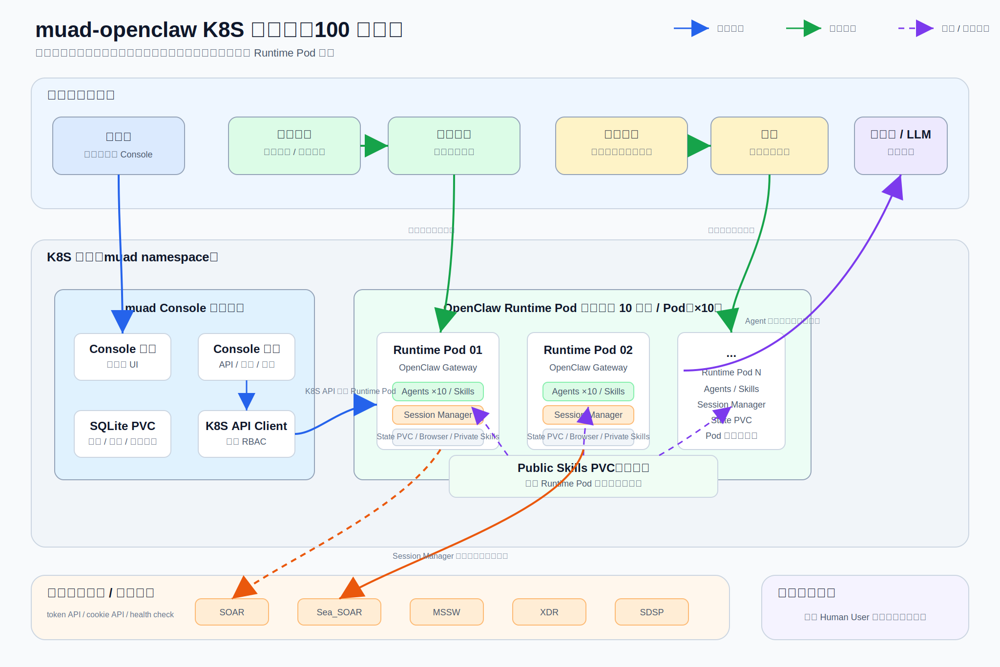

# muad-openclaw · K8S 部署方案（100 用户）

> 版本 v3（2026-07-08）｜ 一句话：**一个管理控制台在 K8S 集群内管理 100 个独立用户工作空间；内部用户通过企业微信协作，外部客户通过微信触达，LLM 在远端提供推理能力。**

---

## 1. 架构总览



muad-openclaw 面向“多用户、多通道、可审计”的 Agent 场景。整体可以先按业务角色理解，而不是按技术组件理解：

| 模块 | 面向对象 | 主要价值 |
|---|---|---|
| 管理控制台 | 平台管理员 / 运维人员 | 统一开通用户、配置模型、查看运行状态、处理异常、审计操作 |
| 用户工作空间 | 每个内部用户 | 每人一个独立 Agent 工作环境，保存自己的会话、登录态、技能状态 |
| 企业微信通道 | 内部用户 | 内部员工直接在企业微信里和自己的 Agent 协作，处理工单、查询系统、执行流程 |
| 微信通道 | 外部客户 | 客户通过微信和服务入口沟通，由对应 Agent 承接咨询、查询或流程触发 |
| Session Manager | 业务 skill | 位于 skill 与业务系统之间，统一处理业务系统登录态、Cookie 和浏览器会话状态 |
| 业务系统 | 企业内部平台 | SOAR、Sea_SOAR、MSSW、XDR、SDSP 等系统为 Agent 提供业务数据和操作入口 |
| 远端 LLM | Agent 推理服务 | 提供自然语言理解、推理、总结和工具调用决策；集群本身不承载大模型 |

从用户视角看，平台的核心体验是：管理员先在控制台开通用户工作空间；内部用户或客户在各自 IM 中发起对话；Agent 根据消息内容调用技能、查询业务系统、必要时使用浏览器能力，并把结果返回到原会话。

技术实现细节单独放在第 3 章，避免把管理员和用户旅程写成底层资源清单。

---

## 2. 用户旅程

### 2.1 开通与配置

#### 企业微信：面向内部用户

企业微信通道用于企业内部员工和 Agent 协作。典型对象是安全运营、IT 运维、客服主管、项目成员等内部用户。

1. 内部用户或系统管理员在企业微信管理后台准备机器人信息。
2. 管理员在 muad Console 中创建该内部用户的工作空间，填写用户 ID，选择“企业微信”通道，并录入机器人凭据。
3. 平台为该用户准备独立的 Agent 工作空间。这个空间会保存用户自己的会话上下文、技能配置、浏览器状态和业务系统登录状态。
4. 通道就绪后，内部用户在企业微信里直接给机器人发消息，例如“查询今天高危告警”“帮我总结这个工单”“生成处置建议”。
5. Agent 把处理结果返回企业微信。对用户来说，它表现为一个可持续协作的个人工作助手。

企业微信旅程的重点是“内部协作”：身份相对明确、业务权限更强、可执行内部系统查询和处置动作，因此更强调权限边界、审计和稳定运行。

#### 微信：面向外部客户

微信通道用于连接外部客户或服务对象。客户不需要进入企业内部系统，只在微信里完成咨询、查询或服务请求。

1. 管理员在 muad Console 中为负责该客户入口的用户或服务账号创建工作空间。
2. 管理员选择“微信”通道。容器启动后，控制台提供扫码入口，用于完成微信登录或绑定。
3. 客户通过微信发起消息，例如“查询我的服务进度”“我遇到这个问题怎么办”“帮我提交一个需求”。
4. Agent 根据客户消息判断意图，必要时调用业务系统或服务记录，但只返回客户可见的信息。
5. 如果问题需要人工处理，Agent 可以生成摘要、补全工单信息或提醒内部用户跟进。

微信旅程的重点是“客户触达”：交互门槛低、话术更服务化、返回内容需要控制边界，避免把内部敏感信息直接暴露给客户。

### 2.2 一次完整对话体验

#### 内部用户：从企业微信发起工作请求

内部用户通常带着明确的工作目标来找 Agent，例如查询告警、分析工单、总结事件、生成处置建议。

1. 用户在企业微信中向自己的 Agent 发送请求。
2. Agent 理解用户意图，判断是否需要调用技能或业务系统。
3. 如果需要业务数据，Agent 使用该用户工作空间内已配置好的访问能力完成查询或页面操作。
4. Agent 将结果整理成适合内部协作的格式，例如结论、依据、风险、下一步动作。
5. 用户可以继续追问，Agent 会沿用当前上下文，不需要每次重新解释背景。
6. 关键操作、异常和管理员侧变更会进入审计链路，便于后续追踪。

内部用户的体验目标是提高工作效率：少切系统、少复制粘贴、少重复查询，让 Agent 成为企业微信里的业务操作入口。

#### 外部客户：从微信发起服务请求

客户通常不会关心平台内部有哪些系统，只关心“问题是否被理解、结果是否清楚、是否有人跟进”。

1. 客户在微信中发送咨询、查询或问题描述。
2. Agent 识别客户诉求，优先使用 XDR、服务记录或流程规则生成回复。
3. 如果请求涉及客户状态、工单进度或服务记录，Agent 查询对应业务系统，并只返回客户允许看到的信息。
4. 对于简单问题，Agent 直接给出答案或引导客户补充信息。
5. 对于复杂问题，Agent 生成结构化摘要，辅助内部人员接手。
6. 客户继续对话时，Agent 保持上下文，避免重复询问已经提供过的信息。

客户侧体验目标是降低服务摩擦：客户仍然只使用微信，但背后可以连接企业知识、流程和内部协作。

### 2.3 异常与恢复

| 场景 | 用户可感知行为 | 管理员处理方式 |
|---|---|---|
| 企业微信机器人凭据失效 | 内部用户收不到回复或提示通道异常 | 在 Console 更新企业微信通道配置，保存后热更新 |
| 微信登录态失效 | 客户消息无法被正常接收或需要重新登录 | 在 Console 打开扫码入口，重新完成微信登录 |
| 业务系统登录失效 | Agent 提示暂时无法访问相关系统 | 检查 Session Manager、业务系统账号或登录态换取接口 |
| LLM 供应商异常 | Agent 回复变慢或失败 | 在模型配置页测试连通性，必要时切换供应商或模型 |
| 单个用户工作空间异常 | 只影响该用户或该客户入口 | 重启、停止、唤醒或重建对应工作空间 |
| 节点或 Pod 重建 | 用户状态从持久化存储恢复 | 等待平台自动拉起；必要时由管理员在 Console 处理 |

---

## 3. 技术模块说明

本章用于解释第 1 章背后的技术组成，方便研发、运维和架构评审时对齐边界。

### 3.1 控制平面

控制平面由 muad Console 承担，部署为 K8S 集群内的单实例服务。

| 组件 | 职责 |
|---|---|
| Console 前端 | 管理员登录、容器列表、通道配置、扫码、LLM 配置、资源配置、审计查询 |
| Console 后端 | 提供 API、鉴权、配置加密、审计、调用 K8S API 管理 worker |
| SQLite PVC | 保存用户记录、管理员账号、LLM 配置、资源配置、审计日志 |
| K8S ServiceAccount | 限定 Console 只能在指定命名空间管理相关资源 |

控制平面不直接处理用户消息。它负责开通、配置、监控、审计和运维操作。

### 3.2 用户工作空间

每个用户对应一个独立 worker。K8S 中主要由 Deployment、Secret 和 PVC 组成。

| 资源 | 作用 |
|---|---|
| Deployment / Pod | 运行 OpenClaw gateway、IM 通道、浏览器能力和技能 |
| Secret | 注入通道凭据、LLM key、gateway token 等运行时配置 |
| State PVC | 保存用户会话、微信登录态、浏览器 profile、private skills、Session Manager 的业务系统登录态 |
| Public Skills PVC | 公共技能目录，只读挂载到 worker，便于统一更新 public skills |

这种“每用户一个工作空间”的模型牺牲了一部分资源密度，但换来更清晰的隔离边界：一个用户异常不会拖垮其他用户，一个用户的状态也不会混入其他用户空间。

### 3.3 Skill 分层

OpenClaw 支持同时加载公共技能和工作空间技能。muad 在 K8S 形态下可以把它映射成两层，同时把 Session Manager 作为公共能力放在业务 skill 与业务系统之间：

| 类型 | 存储位置 | OpenClaw 加载路径 | 可见范围 |
|---|---|---|---|
| Public skill | Public Skills PVC | `/opt/openclaw-skills/<skill>/SKILL.md`，通过 `skills.load.extraDirs` 加载 | 所有 worker 共享 |
| Private skill | 每用户 State PVC | `/home/node/.openclaw/workspace/skills/<skill>/SKILL.md` | 仅当前用户 worker 可见 |

OpenClaw 的加载优先级中，workspace skills 高于 `skills.load.extraDirs`。因此同名 skill 同时存在时，用户自己的 private skill 会覆盖 public skill。建议企业公共技能使用统一命名规范，用户私有技能用于个人流程、个人偏好或临时扩展，避免误覆盖公共技能。

当前基线配置已经把 public skill 目录接入 OpenClaw：

```json
{
  "skills": {
    "load": {
      "extraDirs": ["/opt/openclaw-skills"],
      "watch": true
    }
  }
}
```

Private skill 不需要额外共享卷。因为每个 worker 的 `/home/node/.openclaw` 已经来自独立 State PVC，只要把用户私有 skill 写入 `workspace/skills`，OpenClaw 就会按工作空间技能加载。

### 3.4 Session Manager

Session Manager 位于业务 skill 与企业业务系统之间，负责把“访问业务系统前需要登录态”这件事统一收口。它不替代 SOAR、Sea_SOAR、MSSW、XDR、SDSP 等业务 skill，而是为这些 skill 提供稳定的会话状态能力。

| 主要功能 | 说明 |
|---|---|
| 登录态获取 | 按当前用户和目标业务系统获取可用 Cookie 或浏览器会话状态 |
| 登录态复用 | 优先复用 State PVC 中仍然有效的业务系统登录态，减少重复登录 |
| 登录态刷新 | 登录态失效时统一刷新，避免每个业务 skill 各自处理登录逻辑 |
| 状态持久化 | 将业务系统登录态保存到当前用户的 State PVC，Pod 重建后可恢复 |
| 统一错误反馈 | 业务系统不可达或登录态失效时，向业务 skill 返回明确状态，避免用户无反馈等待 |

通过这一层，业务 skill 只需要关注“要访问哪个业务系统、完成什么业务动作”，不需要重复处理 Cookie、浏览器会话和登录态失效恢复。

### 3.5 消息通道

平台当前关注两类 IM 通道：

| 通道 | 主要用户 | 接入方式 | 典型场景 |
|---|---|---|---|
| 企业微信 | 内部员工 | 机器人凭据，长连接 | 内部查询、工单处理、运营协作、告警分析 |
| 微信 | 外部客户 | 扫码登录 | 客户咨询、服务查询、需求收集、人工转接辅助 |

同一个 worker 可以同时启用企业微信和微信，但实际产品设计上建议明确区分“内部用户入口”和“客户入口”，避免一个 Agent 同时承担过多角色导致权限和话术混乱。

### 3.6 LLM 与业务系统

LLM 由外部供应商提供，worker 只通过 API 调用模型。这样集群不需要部署大模型服务，容量主要受 worker 内存、浏览器峰值和并发任务影响。

业务系统通过 skill 访问。常见系统包括 SOAR、Sea_SOAR、MSSW、XDR、SDSP 或内部 API。涉及登录态的系统统一经过 Session Manager：业务 skill 不直接管理 Cookie，而是由 Session Manager 负责换取、复用和刷新当前用户的业务系统会话状态。

## 4. 硬件资源（100 用户，已含 +30%）

### 实测单容器（真实对话 + 浏览器）

| 指标 | 空闲 / 文本 | 浏览器任务峰值 |
|---|---|---|
| 内存 | ~300 MiB | **~1.8 GiB** |
| CPU | < 0.05 核 | **1.5 核**（瞬时） |

> 结论：内存是主要约束；**决定容量的核心变量 = 同时开浏览器的人数**。

### 集群总量

| 资源 | 数值 |
|---|---|
| vCPU | **≈ 42 核** |
| 内存 | **≈ 128 GiB** |
| 存储 | **≈ 350 GB NVMe SSD** |

### 推荐节点池

> **3 × (16 vCPU / 48 GiB / 200 GB SSD)** = 48 核 / 144 GiB / 600 GB  
> ＋ 托管控制平面；console 与系统组件再留 ~2 核 / 4 GiB。

### 单 Pod 资源 & 存储

| 项 | request（预留） | limit（上限） |
|---|---|---|
| CPU | 100m | 1500m |
| 内存 | 512Mi | **3Gi**（防浏览器 OOM） |

- 每用户状态 PVC：**2–5 GiB（SSD）**，保存会话、微信登录态、业务系统登录态、浏览器 profile 与 private skills。
- Public Skills PVC：RWX，只读挂载到 worker，保存所有用户共享的 public skills。
- Console DB PVC：建议 5 GiB 起步。

---

*硬件数值基于 2026-06-29 单机实测 + 30% 余量；架构描述按当前 K8S driver 已写实的控制台方案整理。*
