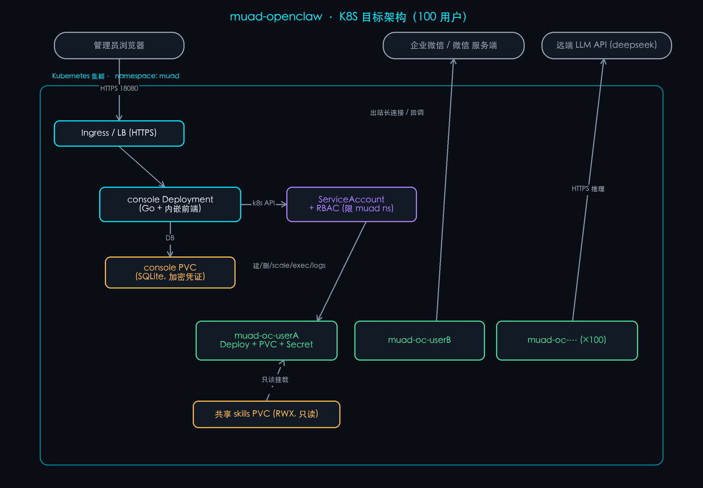
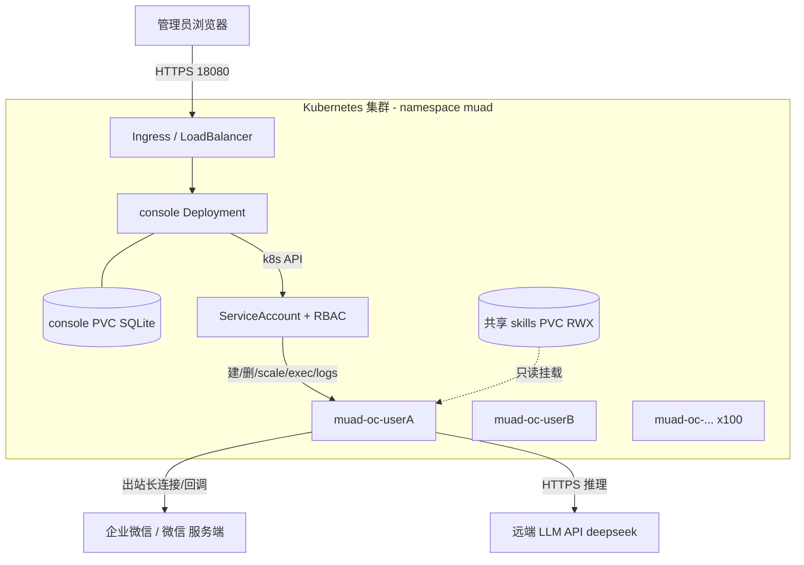

# muad-openclaw · K8S 部署技术方案（100 用户规模）

> 版本：v1（2026-06-29）
> 适用范围：企业微信 / 微信 多用户 openclaw AI Agent 平台，目标承载 **100 个并发用户容器**。
> 本文为**目标架构方案**——当前代码的 K8S 驱动尚为桩实现（见 §2、§9），落地前需先实现。

---

## 1. 背景与目标

muad-openclaw 是「一个控制台（console）管理 N 个每用户 openclaw worker 容器」的多租户平台：

- **console**：Go 后端 + React 前端，提供创建/生命周期/监控/审计/LLM 与资源配置等能力。
- **worker**：每个用户一个 openclaw 容器，跑各自的企微/微信通道、浏览器、技能与会话状态。
- **LLM 推理在远端**（如 deepseek API），容器本身不跑模型。

目标：把现有「单机 Docker」形态迁移到 **Kubernetes**，以获得多节点水平扩展、调度与自愈、声明式运维，稳定承载 100 用户。

---

## 2. 现状与差距

| 维度 | 当前（单机 Docker） | K8S 目标 |
|---|---|---|
| 运行时驱动 | `DockerDriver`：通过宿主 `docker.sock` + `docker` CLI 起停容器（已实现） | `K8sDriver`：通过 client-go 管理每用户工作负载 **（当前为桩 `ErrNotImplemented`，必须实现）** |
| 容器编排 | `docker run --name muad-oc-<user>` | 每用户一个 Deployment/StatefulSet + PVC + Secret |
| 网络互通 | 共享 `muad-net`，按容器名 `muad-oc-<user>:18789` 访问 | ClusterIP Service / Pod IP；exec/logs 走 k8s API |
| 状态持久化 | docker 命名卷 `muad-oc-<user>-state` | 每用户 PVC（RWO）挂 `/home/node/.openclaw` |
| 共享技能 | 宿主目录只读 bind-mount | RWX PVC（NFS/CephFS）或只读 ConfigMap/镜像内置 |
| 凭证注入 | 运行时 env-file（0600，不入镜像，NFR-SEC-02） | k8s Secret → env（不入镜像） |
| 资源限制 | `docker --memory/--cpus/--restart`（已支持页面动态配置：全局默认 + 每用户覆盖） | 映射为 Pod `resources.requests/limits` + 重启策略 |

> **关键前置**：K8S 落地的**第一步是实现 `internal/driver/k8s.go`** 的 client-go 版本，把 `RuntimeDriver` 接口（Create/Start/Stop/Restart/Remove/List/StatsAll/Logs/Exec/Reap/Revive）映射到 k8s 资源操作。接口已固定，console 其余部分对运行时无感知（FEAT-07）。

---

## 3. 目标架构



<details>
<summary>架构图源码（Mermaid，可编辑后重渲染）</summary>



</details>

**要点**：
- worker **无入站端口**（企微走出站长连接、微信走扫码登录），不需对外暴露；console 经 k8s API（exec/logs）和 ClusterIP 访问其网关 `:18789`。
- console 通过受限 ServiceAccount（RBAC）在 `muad` namespace 内创建/管理每用户工作负载——**替代单机 `docker.sock` 等价 root 的风险面**（见 §8）。

---

## 4. 核心设计

### 4.1 K8sDriver 操作映射（docker → k8s）

| RuntimeDriver 方法 | K8S 实现 |
|---|---|
| `Create(spec)` | 创建 PVC + Secret + Deployment（1 副本），name=`muad-oc-<user>`，注入资源 requests/limits、env |
| `Start/Stop` | scale replicas 1/0（Stop 即缩到 0，保留 PVC） |
| `Restart` | rollout restart（或 scale 0→1） |
| `Remove(keepState)` | 删 Deployment+Secret；`keepState=false` 时一并删 PVC |
| `List` | list Deployments（label `app=muad-oc`）+ pod 状态归一化 |
| `StatsAll` | metrics-server / `kubectl top` API 取 CPU/MEM |
| `Logs` | Pod log API |
| `Exec` | Pod exec 子资源（执行 `openclaw channels status/login/logs`） |
| `Reap/Revive` | scale 0 / scale 1（空闲回收，PVC 保留） |

> 监控采集（collector）现按 30s 周期 + 并发 + 单容器超时；k8s 下 `StatsAll` 改用 metrics-server 聚合，`Exec` 探针沿用 `openclaw channels status --json`。

### 4.2 每用户工作负载形态

- **推荐：Deployment（1 副本）+ 独立 PVC（RWO）**，简单且与现有「单实例 + 状态卷」语义一致。
- 也可用 **StatefulSet + volumeClaimTemplate**（稳定标识 + 自动 PVC）。
- 每用户工作负载 **= 1 个 Pod**；100 用户 = 100 个 Pod，由调度器跨节点 bin-pack。

### 4.3 网络

- worker 不暴露端口；如需 console 直连网关，建每用户 **ClusterIP Service** `muad-oc-<user>:18789`，或直接用 Pod IP；探针/日志/扫码统一走 **k8s exec/log API**（无需 Service）。
- 仅 **console** 经 Ingress/LoadBalancer 对外（HTTPS）。

### 4.4 状态与共享

- **每用户状态**：PVC 挂 `/home/node/.openclaw`（会话/记忆/登录态/已装插件）。StorageClass 选 **SSD/NVMe**（SQLite + 浏览器 I/O 敏感）。
- **共享技能**：一个 **RWX PVC**（NFS/CephFS/云文件存储）只读挂进所有 worker 的 `/opt/openclaw-skills`；改它即热更（`skills.load.watch`）。

### 4.5 凭证与配置（NFR-SEC-02）

- **凭证绝不入镜像**：每用户 bot 凭证、LLM key、网关 token 存 **k8s Secret**，运行时注入 env。
- console 自身配置走 `config.yaml`（ConfigMap/Secret 挂载）；`masterKey`/`adminPassword` 经 Secret。
- console DB（含 AES-GCM 加密的 bot secret / LLM key）落 console PVC。

### 4.6 通道特性约束（影响调度）

- **企微 bot 同一时刻只允许一个长连接**：同一 bot 凭证若被两个实例连接会**互踢**（实测 `Kicked by server: a new connection was established elsewhere`）。因此：
  - 每用户工作负载**必须严格单副本**（不可 HPA 多副本、不可滚动期间双实例并存）；
  - 升级用 `Recreate` 策略（先停后起）而非 `RollingUpdate`，避免新旧 Pod 同时持连接互踢。
- **微信（个人）走扫码登录**：`openclaw channels login --channel openclaw-weixin`，经 console exec 触发并回传二维码 URL。

### 4.7 镜像与架构（视频 codec 限制）

- 镜像多架构发布（`linux/amd64,linux/arm64`），GHCR：`muad-console`、`muad-openclaw`。
- **浏览器视频播放（H.264）需 Google Chrome，仅 amd64 Linux 有**；arm64 用开源 Chromium 无专有 codec。**若用户需要视频能力，worker 节点池应选 amd64**；否则 arm64 可降低成本但视频站只能截图、不能播放。

### 4.8 资源限制动态配置 → Pod resources

console 已支持「全局默认 + 每用户覆盖」的内存/CPU/重启策略动态配置。K8sDriver 在 `Create` 时把解析后的有效值写入 Pod：

```yaml
resources:
  requests: { cpu: "100m",  memory: "512Mi" }   # 调度预留（按空闲基线）
  limits:   { cpu: "1500m", memory: "3Gi"  }    # 突发上限（建议 3Gi，规避浏览器 OOM）
restartPolicy: Always   # 由 Deployment 管理；对应 unless-stopped 语义
```

---

## 5. 部署拓扑

- **namespace**：`muad`（worker + console 同 ns，便于 RBAC 收敛）。
- **RBAC**：console 的 ServiceAccount 仅授予 `muad` ns 内 `pods/deployments/services/persistentvolumeclaims/secrets` 的 `get/list/create/delete` + `pods/exec`、`pods/log`。**不授予集群级权限**。
- **Ingress**：仅暴露 console（HTTPS，建议加 IP allowlist / SSO）。
- **节点池**：worker 池（承载 100 Pod）+ 可选 console/系统池分离。

---

## 6. 硬件资源要求（实测 + 30%）

### 6.1 实测单容器画像（真实对话 + 浏览器，2026-06-29）

| 指标 | 空闲/文本 | 浏览器任务峰值 |
|---|---|---|
| 内存 | ~300 MiB | **~1.8 GiB**（逼近 2g 上限，建议上限设 3Gi） |
| CPU | < 0.05 核 | **1.5 核**（打满 limit，瞬时） |

> 结论：**内存是绑定约束**（远端 LLM → CPU 轻，浏览器 → 内存/CPU 峰值）。决定容量的核心变量是「同时跑浏览器任务的并发数」。

### 6.2 100 用户容量（基线 → +30%）

基线推荐（之前给出的「舒适」单机当量）：**32 vCPU / 96 GiB / 250 GB NVMe**。
按要求 **+30%** 并向上取整：

| 资源 | 基线 | **+30%（本方案采用）** |
|---|---|---|
| vCPU（worker 容量） | 32 | **≈ 42 vCPU** |
| 内存（worker 容量） | 96 GiB | **≈ 128 GiB** |
| 存储（聚合） | 250 GB NVMe | **≈ 350 GB NVMe** |

### 6.3 K8S requests / limits 与集群总量

| 项 | 单 Pod | 100 Pod 合计 | +30% |
|---|---|---|---|
| CPU request（调度预留） | 100m | 10 核 | **~13 核** |
| CPU limit（突发上限） | 1500m | （可超分） | — |
| 内存 request | 512Mi | 50 GiB | **~65 GiB** |
| 内存 limit | 3Gi | （可超分） | — |

- **调度可行性**：scheduler 按 requests 预留，集群可分配 request 容量需 ≥ ~65 GiB / ~13 核（+30% 后）。
- **突发安全**：limits 允许单 Pod 冲到 3Gi/1.5 核；需保证「同时浏览器并发」高峰时**总用量不超物理内存**，否则触发节点级 OOM。按 6.2 的 128 GiB worker 容量留足缓冲。

### 6.4 推荐节点池（任选其一，均已覆盖 +30% 目标 + 节点系统开销 + 调度余量）

| 方案 | worker 节点 | 合计 | 说明 |
|---|---|---|---|
| **A（推荐）** | 3 × (16 vCPU / 48 GiB / 200 GB SSD) | 48 vCPU / 144 GiB / 600 GB | 容错好，单节点故障可重调度 ~33 Pod |
| B | 4 × (12 vCPU / 32 GiB / 150 GB SSD) | 48 vCPU / 128 GiB / 600 GB | 更细粒度，调度更均衡 |

- **控制平面**：托管（EKS/GKE/ACK 等）或自建 3 master（各 2 vCPU / 4 GiB）。
- **console + 系统组件**：console（~0.25 核 / 256–512 Mi）、metrics-server、ingress、NFS provisioner 等，合计预留 ~2 vCPU / 4 GiB（可并入 worker 池或独立小节点）。
- **存储**：
  - 每用户状态 PVC：建议 **2–5 GiB/用户**（随会话/记忆/媒体增长）→ 合计 **~200–500 GiB** SSD（StorageClass=SSD，RWO）。
  - 共享 skills PVC：少量（RWX）。
  - console DB PVC：~5 GiB。
  - 每节点本地盘还需容纳 worker 镜像缓存（~3.5 GB/节点）+ 临时层。
- **节点架构选择**：需视频能力 → **amd64** 节点池（可装 Google Chrome）；纯文本/截图 → arm64 可省成本（见 §4.7）。

> 备注：以上为「浏览器中度使用」（高峰约 10–20 并发浏览器）下的舒适配置（已含 +30%）。若浏览器为重度高频，按「同时浏览器数 × (1.5 核 + ~1.5 GiB)」线性追加节点。

---

## 7. 伸缩与高可用

- **worker 不做 HPA**（单 bot 单连接，多副本会互踢）；扩容 = 增加用户工作负载数量，由集群水平承载。
- **节点水平扩展**：用户增长 → 加 worker 节点（Cluster Autoscaler 可选）。
- **自愈**：Pod 崩溃由 Deployment 拉起（对应重启策略）；节点故障 Pod 重调度（PVC 跟随，需支持跨节点挂载的 StorageClass 或区域内 RWO 重绑定）。
- **console HA**：可 2 副本（无状态除 DB；DB 在 PVC，需主备或换外部数据库以支持多副本——P1 可演进）。

---

## 8. 安全

- **凭证不入镜像**（NFR-SEC-02）：全部经 Secret 运行时注入。
- **去除 docker.sock 等价 root**：单机形态 console 持 `docker.sock`（RISK-03，等价宿主 root）；K8S 下改为**受限 ServiceAccount + RBAC**，权限收敛到 `muad` ns 内必要资源，显著降低风险面。
- **worker 无入站端口**、最小权限 SA、可加 NetworkPolicy 限制 worker 仅能出站到 LLM/微信端点。
- console 入口加 TLS + 访问控制（SSO / IP allowlist）。

---

## 9. 实施步骤

1. **实现 `K8sDriver`（client-go）**：按 §4.1 映射 RuntimeDriver 全部方法（含 exec/logs/top）。— *硬前置*
2. 定义工作负载模板：每用户 Deployment + PVC + Secret(+ 可选 Service)；`Recreate` 升级策略。
3. StorageClass：SSD（per-user RWO）+ RWX（shared skills）。
4. RBAC：console SA + Role/RoleBinding（§5）。
5. console 配置：ConfigMap/Secret 提供 `config.yaml`（`runtimeDriver: k8s`）。
6. 资源映射：把动态资源配置（全局/每用户）写入 Pod requests/limits（建议内存 limit 默认 3Gi）。
7. 可观测：metrics-server（StatsAll）、日志收集、告警接入。
8. 灰度：先迁移少量用户验证（创建/扫码/对话/浏览器/回收/升级全链路），再批量。

---

## 10. 风险与限制

| 风险 | 说明 / 缓解 |
|---|---|
| K8sDriver 未实现 | 当前为桩；K8S 部署的**前置工作量**，须先开发 |
| 单 bot 单连接互踢 | 严格单副本 + `Recreate` 升级；杜绝同 bot 多实例（跨集群/历史实例也会踢，运维需登记） |
| 浏览器内存峰值近上限 | 内存 limit 建议 3Gi；或限制浏览器并发/标签数，否则重页面 OOM |
| 视频 codec 仅 amd64 | 需视频 → amd64 节点池；arm64 无 H.264 |
| 内存超分 | 按 requests 预留 + limits 突发，但高峰总量不得超物理内存，否则节点 OOM |
| console DB 单点 | 单副本 + PVC；多副本 HA 需外部数据库（P1） |

---

*本文基于 2026-06-29 单机实测数据与既有 DockerDriver 架构推导；硬件数值已按基线 +30%。落地以 §9 第 1 步（实现 K8sDriver）为前提。*
