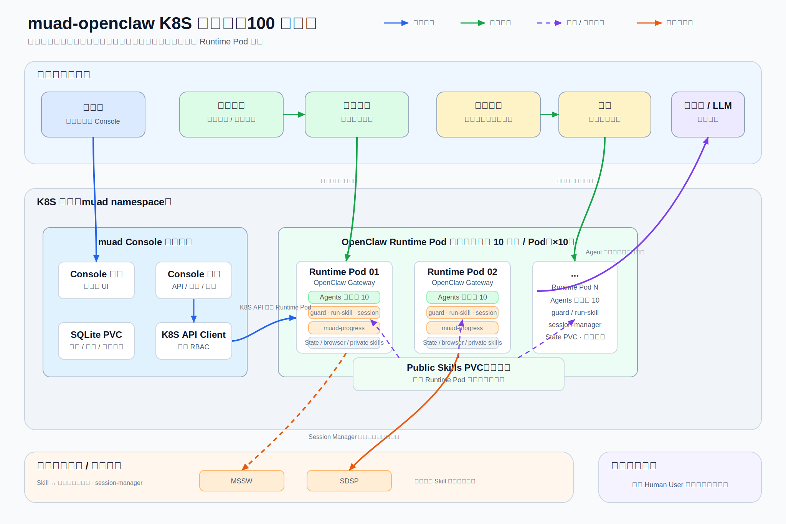

# muad-openclaw · K8S 部署方案（100 用户）

> 版本 v4（2026-07-13）｜ 一句话：**一个管理控制台在 K8S 集群内管理多个 OpenClaw Runtime Pod；每个 Pod 承载约 10 个 Human User，通过 IM Identity 路由到独立 agent/workspace/browser profile，支撑 100 用户规模。**

---

## 1. 架构总览



当前架构已经从“每个用户一个 Pod”优化为“多个用户共享一个 Runtime Pod”。平台不再把企微、微信或其他 IM 的外部 user id 当作系统用户，而是使用内部 `Human User` 作为统一用户实体，再把不同 IM 身份绑定到这个用户上。

100 用户规模下的推荐形态：

- 约 10 个 Runtime Pod。
- 每个 Runtime Pod 默认承载 10 个 Human User。
- 管理员负责维护 Pod 与机器人/通道的绑定关系，并把用户分配到容量较空的 Pod。
- 用户进入企微、微信或后续飞书等 IM 后，通过 `Identity` 路由到自己的 agent。
- 同一个 Human User 可以绑定多个 IM 身份，它们共享同一个 agent、记忆、private skill、业务平台凭证和浏览器 profile。

从业务功能模块看，整体由以下部分组成：

| 模块 | 面向对象 | 主要价值 |
|---|---|---|
| 管理控制台 | 平台管理员 / 运维人员 | 管理 Pod、用户、模型池、Skill、业务平台、资源配置和审计日志 |
| Runtime Pod | 平台运行单元 | 一个 Pod 承载多个 Human User，降低资源成本并保留用户隔离 |
| Human User | 企业内部自然人或服务账号 | 平台内部统一用户实体，不等同于企微/微信/飞书外部 ID |
| IM Identity | 企业微信、微信、后续飞书等 IM 身份 | 把不同通道的外部发送者绑定到同一个 Human User |
| 模型池 | LLM 凭证和模型配置 | 每个 Human User 绑定一个未占用模型配置，支持不同用户使用不同 key |
| Skill 管理 | 业务能力开发者 / 管理员 | 管理 system/public/private skill 资产、用户生效视图、冲突策略和执行记录 |
| Skill 体系 | Agent / 业务 skill | Public skill 全局共享，Private skill 按用户隔离，最终执行由 `muad-run-skill` 统一约束 |
| Session Manager | 业务 skill | 位于 skill 与业务系统之间，统一处理平台 API key、Cookie 和浏览器会话状态 |
| 业务平台 | 企业内部系统 | SOAR、Sea_SOAR、MSSW、XDR、SDSP 等业务系统由 skill 调用 |
| Runtime Guard | 平台安全边界 | 保证 agent 只能访问自己的 workspace、browser profile 和 session-store |
| 审计与状态 | 管理员 / 运维 | 记录用户、Identity、绑定码、平台配置、Skill、Pod 变更等关键操作 |

第 1 章只描述业务模块和架构边界。底层实现细节放在第 3 章，避免把管理员和用户旅程写成资源清单。

---

## 2. 用户旅程

### 2.1 管理员开通与配置

管理员的核心工作不是直接创建单个容器，而是维护 Pod 容量、IM 通道、用户身份、模型和业务平台凭证。

典型流程：

1. 管理员先创建 Runtime Pod，设置显示名称、镜像、用户容量、资源限制、skill/browser 并发上限。
2. 管理员为 Pod 配置 IM 通道。企微机器人和 Pod 的绑定关系由管理员维护；微信通道需要扫码或登录态维护。
3. 管理员在模型配置页批量导入 LLM key，形成模型池。每个模型配置只能绑定给一个 Human User。
4. 管理员在 Skill 管理页扫描或确认当前 system/public skill，并查看是否存在禁用、冲突或缺凭证风险。
5. 管理员创建 Human User，并选择一个未占用模型配置。
6. 如果管理员已知用户的 IM external id，可以直接录入首个 Identity，例如企微超管机器人拿到的明文 `userid`。
7. 如果管理员不知道 external id，则创建 pending 用户并生成绑定码，让用户在指定机器人私聊中发送绑定码完成激活。
8. 用户激活后，平台为该用户生成 agent、workspace、browser profile、session-store，并把 IM route 写入目标 Pod 的运行时配置。
9. 管理员可以在 Human User 详情中查看该用户最终可用的 Skill，上传 private skill、处理 public/private 同名冲突、补齐业务平台凭证。
10. 后续用户新增飞书、微信或另一个企微身份时，从 Human User 详情页生成“新增 IM 身份”的绑定码，绑定成功后复用原 agent 和 workspace。

这套流程的关键点是：**用户归属由管理员分配 Pod；首次消息不负责自动分配 Pod。** 不额外引入全局 message router，避免增加架构复杂度。

### 2.2 企业微信：内部用户协作旅程

企业微信通道用于内部员工和 Agent 协作。典型对象是安全运营、IT 运维、客服主管、项目成员等内部用户。

1. 内部用户在管理员指定的企微机器人私聊中发消息。
2. Runtime Pod 根据消息里的 channel、account、peer/external id 匹配 Identity。
3. 匹配成功后，消息被路由到该 Human User 对应的 agent。
4. Agent 读取自己的 workspace 记忆、private skill、业务平台凭证和浏览器 profile。
5. 如果用户发起长耗时任务，skill 通过 `muad-run-skill` 和 `muad-progress` 返回阶段进度。
6. Agent 将最终结果返回企业微信，用户可以继续追问，记忆在同一个 agent workspace 内持续积累。

企业微信旅程的重点是“内部协作”：身份相对明确、权限更强、可能触发内部系统查询或处置动作，因此需要更明确的权限边界、审计和运行时隔离。

### 2.3 微信：外部客户触达旅程

微信通道用于连接外部客户或服务对象。客户不需要进入企业内部系统，只在微信里完成咨询、查询或服务请求。

1. 客户通过微信向服务入口发起消息。
2. Runtime Pod 根据微信通道的 external id 匹配 Identity。
3. 如果该微信身份已经绑定到某个 Human User，消息会路由到同一个 agent，并复用该用户记忆和业务状态。
4. Agent 根据客户诉求调用允许的业务 skill，例如查询服务进度、生成问题摘要、提交需求或辅助转人工。
5. 回复内容需要按客户可见边界输出，不能把内部系统敏感字段直接暴露给客户。
6. 如果客户身份尚未绑定，平台应引导管理员按绑定码流程处理，而不是让未知客户自动创建 agent。

微信旅程的重点是“客户触达”：交互门槛低、话术更服务化、返回内容边界更严格。

### 2.4 业务平台凭证旅程

每个 Human User 可以配置多个业务平台的 API key，例如 SOAR、Sea_SOAR、MSSW、XDR、SDSP。平台定义由管理员统一维护，用户凭证存放在 Human User 侧。

1. 管理员在“资源与平台”中启用或维护业务平台配置。
2. 管理员在 Human User 详情中为该用户配置对应平台的 API key。
3. 用户触发业务 skill 时，skill 不直接读取密钥，而是通过 Session Manager 获取目标平台的可用访问状态。
4. Session Manager 使用 Pod service token 调用 Console internal resolver，按当前 agent 解析 Human User 和平台凭证。
5. API key 不写入 skill 输出、不进入普通日志；Session Manager 可把派生出的 Cookie/storageState 持久化到该用户的 session-store。
6. 平台禁用或用户删除某个平台 key 后，下一次访问应返回明确错误，不继续复用旧 session cache。

### 2.5 长任务进度反馈旅程

OpenClaw 原生最终回复仍然负责承载最终结果，包含文本、附件、图片或卡片等内容。muad 只在长任务执行过程中补充阶段进度。

1. Agent 判断需要执行某个长耗时 skill。
2. Agent 调用统一的 `muad_run_skill` tool，而不是为每个 skill 注册独立 tool。
3. `muad-run-skill` 根据当前 agent 可见的 skill manifest 找到入口脚本，并注入可信 agent/session 上下文。
4. Skill 脚本使用语言无关的 `muad-progress` CLI 上报阶段，例如 accepted、auth、query、analysis、done。
5. 进度消息作为独立 IM 消息投递，避免用户长时间无反馈。
6. Skill 执行完成后，最终结果仍走 OpenClaw native final reply 链路，保证附件和富媒体内容不丢失。

### 2.6 异常与恢复

| 场景 | 用户可感知行为 | 管理员处理方式 |
|---|---|---|
| 未绑定 IM 身份直接发消息 | 无法进入个人 agent，提示需要绑定或联系管理员 | 创建 pending 用户并生成绑定码，或直接录入 external id |
| 绑定码过期或发错机器人 | 绑定失败，提示绑定码无效或上下文不匹配 | 重新生成绑定码，确认 channel、Pod、agent 是否正确 |
| 企业微信机器人凭据失效 | 内部用户收不到回复或提示通道异常 | 在 Console 更新 Pod 通道配置并应用 |
| 微信登录态失效 | 客户消息无法被正常接收或需要重新登录 | 在 Console 重新扫码或处理微信登录态 |
| 业务平台凭证失效 | Agent 提示目标平台不可用或未配置 | 在用户详情中更新平台 API key，必要时清理 session cache |
| LLM key 异常 | 该用户回复失败或变慢 | 在模型配置页测试并替换该用户绑定的模型配置 |
| 单个 agent 异常 | 影响一个 Human User | 禁用/修复该用户，重新应用 Pod 配置 |
| Runtime Pod 异常 | 影响该 Pod 下多个用户 | 重启 Pod；State PVC 恢复 agent、browser、session 和 private skill 状态 |

---

## 3. 技术模块说明

本章用于解释第 1 章背后的技术组成，方便研发、运维和架构评审时对齐边界。

### 3.1 控制平面

控制平面由 muad Console 承担，部署为 K8S 集群内的单实例服务。

| 组件 | 职责 |
|---|---|
| Console 前端 | 管理 Pod、Human User、Identity、绑定码、模型池、Skill、平台配置、资源和审计 |
| Console 后端 | 提供 API、鉴权、配置加密、审计、Skill resolver、运行时配置生成、调用 K8S API 管理 Pod |
| SQLite PVC | 保存 Pod、Human User、Identity、绑定码、模型池、平台配置、审计日志 |
| K8S ServiceAccount | 限定 Console 只能在指定命名空间管理相关资源 |
| Internal Resolver | 仅供 Pod 内 Session Manager 使用，按可信 agent 解析用户平台凭证 |

控制平面不直接处理用户消息。它负责开通、配置、监控、审计和运维操作。

核心数据模型：

| 表 | 作用 |
|---|---|
| `pods` | Runtime Pod 配置、容量、通道、资源、并发和 generation 状态 |
| `human_users` | 平台内部用户，绑定 Pod、agent、browser profile、模型配置和平台凭证 |
| `user_identities` | IM 身份映射，按 Pod + channel + peer 定位到 Human User |
| `binding_codes` | 一次性绑定码，用于首个 IM 身份激活或已有用户新增 IM |
| `llm_model_configs` | 可分配模型配置，API key 加密保存，只暴露 fingerprint |
| `platform_configs` | 业务平台定义，首期包括 SOAR、Sea_SOAR、MSSW、XDR、SDSP |
| `skill_assets` | system/public/private skill 元数据，记录来源、版本、依赖平台和状态 |
| `skill_policies` | Human User 维度的 skill 策略，例如禁用或允许 private 覆盖 public |
| `skill_execution_records` | `muad-run-skill` 上报的执行摘要、进度阶段、耗时和失败原因 |
| `resource_global` | Pod 默认资源配置 |
| `audit_log` | 管理员和系统关键操作审计 |

### 3.2 Runtime Pod

一个 Runtime Pod 是当前架构的运行单元，内部承载多个 Human User。

| 模块 | 职责 |
|---|---|
| OpenClaw Gateway | 接收 IM 消息、执行 agent、调用工具和模型 |
| main agent | 未绑定或系统级入口，不承载具体用户业务状态 |
| business agents | 每个 Human User 一个 agent，拥有独立 workspace 和 agent dir |
| bindings / routes | 将 channel + peer 精确路由到目标 agent |
| identityLinks | 辅助一人多 IM 的身份归一；记忆共享主要依赖多个 Identity 路由到同一个 agent |
| browser profiles | 每个 Human User 一个浏览器 profile 和 CDP 端口 |
| Runtime Guard | 强制工具访问当前 agent 的 workspace、browser profile 和 session-store |
| muad-run-skill | 统一执行 script skill，注入可信 agent/session 上下文并控制并发 |
| Session Manager | 统一管理平台凭证解析、Cookie/storageState 和业务系统会话 |
| State PVC | 持久化 agent workspace、browser profile、session-store、private skills |

运行时配置由 Console 生成版本化 Runtime DTO，再注入到 Pod 内转换为 OpenClaw strict config。Pod 通过 `config_generation` / `applied_generation` 表示配置是否已经应用。

### 3.3 IM Identity 与绑定码

平台内部使用 `Human User` 作为自然人或服务账号的稳定 ID。IM 外部 ID 只作为 Identity，不直接作为平台用户。

```text
Human User
  ├── agent_id
  ├── browser_profile
  ├── model_config_id
  ├── platform credentials
  └── identities[]
        ├── wecom:XuWenBin
        ├── wecom:wojmppEQAA1lYfixAU-eb0rhEmcVD2gg
        ├── openclaw-weixin:wxid_xxx
        └── feishu:ou_xxx
```

两种创建方式：

| 方式 | 适用场景 | 结果 |
|---|---|---|
| 直接录入 external id | 管理员已知 IM 外部 ID，例如超管企微机器人拿到明文 userid | 创建 Human User + active Identity |
| 绑定码激活 | 管理员不知道外部 ID，例如普通企微机器人、微信、飞书 | 创建 pending Human User，用户在指定机器人私聊中发送绑定码后激活 |

绑定码必须指向明确的 `human_user_id`、`pod_id`、`channel` 和用途，不能“谁发了就新建谁”。已有用户新增 IM 时也必须从用户详情页生成绑定码，绑定成功后复用原 agent 和 workspace。

### 3.4 模型池

模型配置采用最终形态：只有模型池，没有 global model、Pod model override 或 Human User model override fallback。

| 规则 | 说明 |
|---|---|
| 每个 Human User 必须绑定模型配置 | 创建用户时必须选择一个 `model_config_id` |
| 一个模型配置只能绑定一个用户 | 通过唯一索引避免多个用户共享同一个 key |
| Runtime provider 按用户生成 | 每个 agent 使用自己绑定模型对应的 provider/key |
| API key 加密保存 | 管理界面只展示 fingerprint，不返回明文 |
| 多 agent 并发 LLM 调用 | 不同 agent 可以同时使用不同供应商或不同 key |

这样可以直接支持“同一个 Runtime Pod 内多个用户并发调用 LLM，但使用不同 API key”的测试场景。

### 3.5 Skill 分层与执行

OpenClaw 支持公共技能和工作空间技能。muad 在 K8S 形态下保留这套能力，但由 Console 增加资产管理、生效计算和执行约束，避免管理员只能从文件路径推断 Skill 状态。

Console 侧提供两个视角：

| 视角 | 回答的问题 | 主要操作 |
|---|---|---|
| 全局 Skill 管理 | 平台当前有哪些 system/public/private skill | 上传 public skill、扫描元数据、搜索过滤、查看详情、禁用或启用资产 |
| Human User Skill Tab | 某个用户最终能用哪些 skill，为什么不能用 | 查看 effective source、冲突、平台凭证状态、最近执行；上传或删除 private skill；创建禁用/allow_override 策略 |

运行时仍映射为两层：

| 类型 | 存储位置 | 可见范围 | 说明 |
|---|---|---|---|
| Public skill | Public Skills PVC / 镜像内目录 | 所有 Runtime Pod 和所有用户共享 | 由 Console 上传或随镜像发布，Runtime 只读使用，适合企业统一维护的业务 skill |
| Private skill | State PVC 中当前 agent workspace | 仅当前 Human User 可见 | 适合个人流程、临时扩展或用户私有能力 |

推荐路径：

```text
/opt/openclaw-skills/                         # public skills，只读共享
  ├── soar/
  ├── sea_soar/
  ├── mssw/
  ├── xdr/
  ├── sdsp/
  └── session-manager/

/home/node/.openclaw/agents/<agent>/agent/
  └── skills/                                 # private skills
```

同名覆盖要谨慎。OpenClaw 原生加载顺序允许 workspace skill 优先于 public skill，但 muad 控制面和 `muad-run-skill` 默认拒绝未经审批的同名覆盖，避免用户误替换企业公共技能。当前规则如下：

| 规则 | 说明 |
|---|---|
| system skill 受保护 | `session-manager`、`muad-run-skill`、Runtime Guard 等基础能力不允许被覆盖、禁用或删除 |
| public/private 同名默认冲突 | private skill 可以上传，但在 Human User 生效视图中标记 conflict，默认 public 生效 |
| allow_override 后 private 生效 | 管理员在用户维度确认覆盖后，Runtime config 为该 agent 下发 private skill 白名单 |
| disable 策略按用户生效 | 管理员可以只禁用某个 Human User 的某个 skill，不影响其他用户 |
| 缺平台凭证不执行 | Skill manifest 声明的平台依赖会与用户平台凭证合并，缺 key 或平台禁用时返回明确状态 |

Private skill 上传不由 Console 直接写 Runtime PVC。Console 通过目标 Pod 的 `ExecStdin` 调用 Pod 内 installer，把 `.tar.gz` bundle 安装到目标 agent workspace。installer 会校验包大小、路径逃逸、符号链接和 `SKILL.md`，成功后 Console 写入 `skill_assets` 并标记目标 Pod 配置待应用。

Public skill 由全局 Skill 管理页上传 `.tar.gz` 或 `.zip` bundle。Console 解包前校验路径逃逸、符号链接和 `SKILL.md`，skill 名称优先取 `muad.skill.json.name`，其次取 `SKILL.md` frontmatter 的 `name`，最后才取包内 skill 目录名；发布成功后写入 public `skill_assets` 并标记所有 Pod 配置待应用。system skill 受保护，public 上传不能覆盖同名 system skill。

长耗时 script skill 必须通过 `muad-run-skill` 执行；脚本内部用 `muad-progress` 上报阶段。Python、TypeScript、Shell skill 都通过 CLI 接入，不需要为不同语言分别维护 SDK。

`muad-run-skill` 执行前会读取当前 agent 的 skill whitelist，拒绝 disabled、conflict、unknown 或跨用户 skill。执行过程中 runner 以 best-effort 调用 Console internal API 写入 `skill_execution_records`：start/progress/done/fail 事件只保存脱敏摘要、阶段、耗时和错误信息，不保存完整 stdout、业务 payload、API key 或 Cookie。

审计日志记录以下 Skill 相关动作：`skill.asset.scan`、`skill.asset.install`、`skill.asset.update`、`skill.asset.delete`、`skill.policy.create`、`skill.policy.delete`、`skill.execution.fail`。

### 3.6 Session Manager 与业务平台

Session Manager 位于业务 skill 与企业业务平台之间，负责把“访问业务系统前需要凭证和登录态”统一收口。

| 能力 | 说明 |
|---|---|
| 平台凭证解析 | 根据当前 agent 找到 Human User，再解析目标平台 API key |
| 登录态获取 | 按用户和平台获取 Cookie 或浏览器 storageState |
| 登录态复用 | 优先复用该用户 session-store 中仍有效的状态 |
| 登录态刷新 | 失效时统一刷新，避免每个业务 skill 重复实现 |
| 状态持久化 | Cookie/storageState/meta/lock 保存在当前用户 State PVC |
| 结构化错误 | 平台未配置、被禁用、凭证失效、resolver 不可用时返回明确错误 |

Session Manager 不替代 SOAR、Sea_SOAR、MSSW、XDR、SDSP 等业务 skill。它只提供登录态和平台凭证能力，让业务 skill 专注于业务动作。

### 3.7 浏览器隔离与并发

每个 Human User 拥有独立 browser profile 和 CDP 端口。Runtime Guard 根据当前 agent 强制选择对应 profile，避免 A 用户的浏览器 Cookie、localStorage 或标签页被 B 用户复用。

Pod 级别提供两个并发限制：

| 配置 | 作用 |
|---|---|
| `max_skill_concurrency` | 限制同一 Pod 内同时执行的长耗时 skill 数量 |
| `max_browser_concurrency` | 限制同一 Pod 内同时使用浏览器的任务数量 |

并发限制不是为了限制用户数量，而是为了避免同一 Pod 被长任务或浏览器任务打满。超过并发能力时应排队或返回明确 busy 提示，不能无限创建子进程或浏览器实例。

### 3.8 消息通道

当前主通道：

| 通道 | 主要用户 | 接入方式 | 典型场景 |
|---|---|---|---|
| 企业微信 | 内部员工 | 机器人凭据，长连接 | 内部查询、工单处理、运营协作、告警分析 |
| 微信 | 外部客户 | 扫码登录 | 客户咨询、服务查询、需求收集、人工转接辅助 |

后续新增飞书等 IM 时，不改变用户模型：新增的外部身份仍写入 `user_identities`，通过绑定码绑定到已有或新建的 Human User。

### 3.9 存储与持久化

| 存储 | 内容 | 说明 |
|---|---|---|
| Console DB PVC | Pod/User/Identity/绑定码/模型池/平台配置/审计 | 控制平面唯一状态源 |
| Runtime State PVC | agent workspace、memory、browser profile、session-store、private skills | 每个 Runtime Pod 一个，内部按 agent 分目录 |
| Public Skills PVC / 镜像目录 | 公共 skill | Console 写入或镜像内置；所有 Pod 只读共享 |
| Secret / projected token | 通道凭据、Pod service token | 运行时只读注入，不进入普通日志 |

State PVC 不再表示“单用户状态卷”，而是一个 Runtime Pod 内多个用户的状态根目录。隔离依赖 agent 目录、browser profile、session-store 和 Runtime Guard。

---

## 4. 100 用户容量建议

### 4.1 容量模型

当前推荐以“10 用户 / Runtime Pod”为初始容量规划：

| 项 | 建议值 |
|---|---|
| 总用户数 | 100 |
| Runtime Pod 数量 | 约 10 |
| 单 Pod 用户上限 | 10 |
| 单 Pod skill 并发 | 默认 5，可按业务调整 |
| 单 Pod browser 并发 | 默认 5，可按节点资源调整 |

这种配置的优点是：

- 比每用户一个 Pod 更节省资源。
- 比 100 用户共享一个 Pod 更容易控制故障半径。
- 管理员可以按机器人、团队或业务线分配 Pod。
- 单个 Pod 异常只影响约 10 个用户。

### 4.2 单 Runtime Pod 资源

| 项 | request（预留） | limit（上限） |
|---|---|---|
| CPU | 500m | 4000m |
| 内存 | 2Gi | 8Gi |
| State PVC | 20-50Gi | 取决于浏览器 profile、session-store、private skills 和日志保留 |

如果 `max_skill_concurrency=5` 且 `max_browser_concurrency=5`，单 Pod 建议至少按 **4 vCPU / 8Gi** 预留上限评估。浏览器任务峰值会明显高于纯文本对话，因此浏览器并发是容量规划的主要约束。

### 4.3 集群总量

按 10 个 Runtime Pod 估算：

| 资源 | 建议值 |
|---|---|
| vCPU | 40-48 核 |
| 内存 | 96-128 GiB |
| 存储 | 500 GiB 以上 SSD |

推荐节点池：

> **3 × (16 vCPU / 48 GiB / 200 GB SSD)** = 48 核 / 144 GiB / 600 GB  
> Console 与系统组件再预留约 2 核 / 4 GiB。

### 4.4 关键扩容信号

| 信号 | 处理方式 |
|---|---|
| Pod 用户容量接近上限 | 新建 Runtime Pod，并把新用户分配过去 |
| 浏览器任务排队明显 | 降低单 Pod 用户数或增加 `max_browser_concurrency` 与资源上限 |
| LLM 调用失败集中在某用户 | 检查该用户绑定的模型配置 |
| 单业务平台 session 频繁失效 | 检查该平台 adapter、用户 API key 和 Session Manager cache |
| 用户看不到某个 skill | 在 Human User Skill Tab 查看 effective source、conflict、disable 策略和平台凭证状态 |
| private skill 上传失败 | 查看上传错误、Pod 运行状态和 installer 日志；失败时不会创建 active private skill |
| 长任务失败或无进度 | 查询 Skill 执行记录，按 humanUserId、podId、skillName 或 status 过滤 |
| 单 Pod generation 应用失败 | 查看 Pod 日志和 `last_apply_error`，修复后重新应用配置 |

### 4.5 优化前后资源差异

优化前是“每用户一个 Pod”，优化后是“约 10 用户共享一个 Runtime Pod”。这个变化显著减少了基础运行开销和 K8S 对象数量，但不会让浏览器、LLM 调用和长耗时 skill 的峰值资源线性消失。

| 项 | 优化前：每用户 1 Pod | 优化后：约 10 用户 / Pod | 差异 |
|---|---:|---:|---|
| Runtime Pod 数量 | 100 | 约 10 | 降低约 90% |
| State PVC 数量 | 100 | 约 10 | 降低约 90%，但单 PVC 变大 |
| K8S Deployment / Secret 等对象 | 约 100 组 | 约 10 组 | 运维复杂度明显下降 |
| 空闲基础内存 | 约 30Gi | 约 8-15Gi | 预计节省 15-22Gi |
| 浏览器峰值资源 | 取决于同时开浏览器人数 | 仍取决于同时开浏览器人数 | 不会按 Pod 数线性下降 |
| CPU 峰值 | 主要由浏览器和 skill 并发决定 | 由 Pod 级并发限制控制 | 更容易限流和排队 |
| 故障半径 | 1 个用户 / Pod | 约 10 个用户 / Pod | 故障半径变大 |
| 隔离边界 | K8S Pod 强隔离 | Runtime Guard + workspace + browser profile 隔离 | 隔离层级下降，资源效率提升 |

资源建议对比：

| 资源 | 优化前建议 | 优化后建议 |
|---|---:|---:|
| vCPU | 约 42 核 | 40-48 核 |
| 内存 | 约 128Gi | 96-128Gi |
| 存储 | 约 350Gi SSD | 500Gi+ SSD |
| 单 Pod limit | 1.5 CPU / 3Gi | 4 CPU / 8Gi |
| 单 Pod 用户数 | 1 | 10 |
| 单 Pod 浏览器并发 | 1 | 5 |

结论：优化后主要节省 OpenClaw gateway、Node 进程、通道连接、基础内存和 K8S 管理开销；CPU 不建议明显下调，因为浏览器任务和 skill 并发仍然决定峰值。内存可以从 128Gi 下探到 96Gi，但如果按 `max_browser_concurrency=5` 规划，建议保留 128Gi 更稳。存储建议提高到 500Gi+，因为 Runtime State PVC 会集中保存多个用户的 browser profile、session-store、private skill 和日志。

---

## 5. 架构边界与约束

| 约束 | 说明 |
|---|---|
| 不引入全局 Message Router | 管理员提前维护 Pod 与机器人/用户关系，降低架构复杂度 |
| 未绑定 sender 不自动创建正式用户 | 必须由管理员创建 Human User 或绑定码，避免未知用户占用资源 |
| 用户模型只走模型池 | 禁止恢复 global model、Pod model override、Human User override fallback |
| 不直接改上游插件代码 | 通过 adapter、wrapper、配置注入或 Runtime Guard 扩展 OpenClaw |
| OpenClaw final reply 保持原生链路 | 进度消息只补充阶段反馈，最终结果仍保留文本、附件、图片、卡片等能力 |
| 业务平台 key 不落入普通日志 | Session Manager 和 internal resolver 只传递必要凭证，输出必须脱敏 |
| Public / Private skill 有边界 | Public 只读共享，Private 按 agent workspace 隔离，默认拒绝未经审批的同名覆盖 |
| Skill 执行必须双层约束 | Runtime config 下发 per-agent whitelist，`muad-run-skill` 执行前再次校验 |
| Private skill 不跨用户安装 | Console 只通过目标 Pod installer 写入目标 agent workspace，不直接写 Runtime PVC |
| Skill 执行记录只存摘要 | 只记录阶段、耗时、状态和脱敏错误，禁止保存完整业务 payload、API key 或 Cookie |

---

*本版按 2026-07-13 已优化的多用户单 Pod 架构整理：Pod 承载多个 Human User，Identity 负责 IM 路由，模型池负责 per-user LLM key，Skill 管理负责 public/private/system 生效边界，Session Manager 负责业务平台凭证和登录态，Runtime Guard 负责 workspace/browser/session 隔离。*
