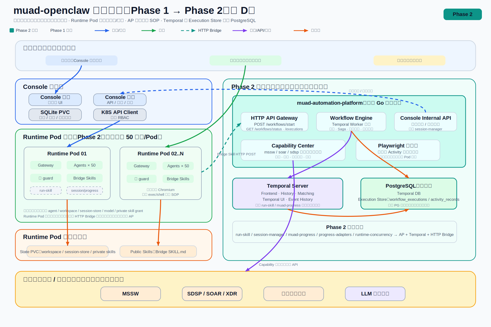

# muad-openclaw 第二阶段架构演进：Skill 可靠执行层

> **文档编号**: SFRD-TS-03-PHASE2
> **状态**: 草案
> **创建日期**: 2026-07-22
> **关联总设**: `docs/muad-openclaw-总体设计说明书.md` V0.5.3
> **关联调研**: `docs/agent-runtime-selection.md`（OpenClaw vs Hermes）
> **参考架构**: `docs/agent-runtime-selection.md` 及已归档的 Agent Runtime 架构调研（MCP + Temporal + Capability 三层模型）
> **架构图**: `docs/images/total-design/phase2-architecture.svg`

---

## 1. 背景与问题

### 1.1 当前阶段（Phase 1）：脚本型 Skill

总设 V0.5.3 定义了「Agent → run-skill → 脚本 → 业务 API」的执行链，其可靠性缺点在实际运行中已充分暴露：

| 痛点 | 表现 | 业务影响 |
|------|------|---------|
| **无状态持久化** | `subprocess.Popen` 后台导出，Pod 重启即丢失 | 长任务中断后无法恢复 |
| **步骤强耦合** | 脚本内顺序调用 6-15 个 API，任一步失败全流程重来 | 第 N-1 步失败，前 N-2 步白做 |
| **容错缺失** | 固定重试 3 次无退避，Cookie 过期即全挂 | 瞬时网络抖动导致整条 SOP 失败 |
| **能力无法复用** | `mss-report-skill/shared/api.py` 636 行 vs `sangfor-report-downloader/api_client.js` 各自实现 | 每个 SOP 重复封装分页、鉴权、重试 |
| **审计盲区** | 只有 stdout/console.log | 管理员无法追溯执行轨迹 |

### 1.2 两个典型 Skill 现状

| 维度 | mss-report-skill | sangfor-report-downloader |
|------|------------------|--------------------------|
| 语言 | Python | Node.js |
| 文件数 | ~20 | ~10 |
| API 封装 | `shared/api.py` 636 行，手工 10+ 接口 | `api_client.js` 独立实现 |
| 步骤数 | 6 | 15 |
| 容错 | `request_with_retry` 固定重试 | `maxRetries=3, retryDelay=2000` |
| 状态持久化 | 无 | 无 |
| 浏览器需求 | 无 | Chromium 导出 Excel |

---

## 2. 第二阶段目标架构

### 2.1 核心思路

```text
Phase 2 目标态:
Agent → Bridge Skill → muad-automation-platform → Temporal Workflow → Capability → 业务 API
```

### 2.2 三层架构模型

参考 `muad-openclaw-agent-architecture-selection-summary.md` 的三层模型：



三层职责：Runtime Pod 负责对话和任务触发；muad-automation-platform 负责 SOP 编排、重试、补偿和审计；业务平台层负责真实业务数据读写。Runtime Pod 到 automation-platform 统一走 HTTP Bridge。

### 2.3 系统上下文（Phase 2 全景）

新增组件以青色（#0d9488）标识，废弃组件以删除线标记。详见 `docs/images/total-design/phase2-architecture.svg`。

**各层变化汇总**：

| 总设 5 层 | Phase 1 | Phase 2 |
|-----------|---------|---------|
| 1. 入口角色 | 管理员 / 服务经理 / 外部客户 | **不变** |
| 2. 控制面 | Console FE/BE、SQLite、Config Builder、Apply Coordinator | 新增 `automationPlatformURL` / `automationPlatformToken` 全局配置 |
| 3. 运行时 | Pod × N、Gateway、agents、**tools/六件套**（guard / run-skill / session-manager / progress / adapters / concurrency） | ~~run-skill~~、~~session-manager~~、~~muad-progress~~、~~progress-adapters~~、~~runtime-concurrency~~；**仅保留 guard**；Pod 内不再运行 Chromium |
| 4. 外部 | K8S/Docker、LLM、MSSW/SDSP | 新增 **muad-automation-platform**（Temporal + Capability + Playwright）、**Temporal Server** |
| 5. 存储 | State PVC、Public Skills、SQLite 审计 | 新增 **Execution Store**（PostgreSQL）、Capability 数据（不含用户状态） |

### 2.4 tools/ 六件套去留

| 组件 | 去留 | 理由 |
|------|------|------|
| ① guard | ✅ 保留 | 运行时安全隔离（agent workspace / browser profile / 文件访问控制），与 SOP 执行无关 |
| ② run-skill | ~~废弃~~ | Phase 2 目标态不再在 Runtime Pod 内执行 SOP 脚本；SOP 执行移至 automation-platform |
| ③ session-manager | ~~废弃~~ | automation-platform 直接调 Console internal API 解析凭证 |
| ④ muad-progress | ~~废弃~~ | Temporal Event History 替代进度记录 |
| ⑤ progress-adapters | ~~废弃~~ | Agent native reply 直接推送最终结果 |
| ⑥ runtime-concurrency | ~~废弃~~ | 并发控制移至 Temporal Activity max_concurrent + Task Queue |

**最终结论**：Phase 1 六件套 → Phase 2 一件（guard）。Runtime Pod 从"重量级执行容器"简化为"纯对话容器"。

### 2.5 浏览器执行层后置

涉及浏览器导出的场景（PDF 生成、Excel 导出、网页截图），Playwright 和无头浏览器部署在 automation-platform 内：

- 每个 Workflow Activity 独立启动浏览器上下文，执行完销毁
- 并发由 Temporal Activity 信号量控制
- 不再占用 Runtime Pod 内存和 CPU

### 2.6 容量目标

| 指标 | Phase 1 | Phase 2 |
|------|---------|---------|
| 单 Pod 内存占用/用户 | ~800MB-1.5GB（含 Chromium profile） | ~300MB（纯 agent + workspace） |
| 默认用户/Pod | 10 | **目标 50（需压测确认）** |
| 100 用户所需 Pod | 10 | **目标 2（需压测确认）** |
| 主要瓶颈 | Chromium 内存 | LLM 对话延迟（每人独立 API key，无并发限制） |

---

## 3. 关键技术决策

### 3.1 Workflow 引擎：Temporal

| 维度 | 选择 | 理由 |
|------|------|------|
| 引擎 | Temporal（强制） | 原生重试+断点续传+Saga 补偿+Event History；Go SDK 成熟 |
| 部署 | Docker `temporaliotest/auto-setup`（开发）→ 单实例+PG（生产） | 开发零配置，生产一台 2C/4G 足够 |
| Demo 数据库 | SQLite（`modernc.org/sqlite`） | 零运维，单文件；生产迁移 PG 只换 driver |

**弃用项**: 自建轻量引擎（无法匹敌 Temporal 的断点续传和 Saga）；Camunda BPMN（Java 生态，与 Go 栈不匹配）。

### 3.2 Capability Center

将 Skill 脚本中重复的 API 调用抽象为**版本化 Capability**：

```
Phase 1: 每个 Skill 独立实现 API 封装
  mss-report-skill/shared/api.py  ← 重复
  sangfor-report-downloader/api_client.js ← 重复

Phase 2: Capability 一次实现，多 Workflow 复用
  internal/capability/mssw/   ← company.go, report.go, email.go, portal.go
  internal/capability/soar/   ← company.go, asset.go, exposed.go, event.go...
```

**核心原则**（来自 agent-architecture-selection-summary.md）：

- **80%** SOP 应只增加 Workflow 定义（复用已有 Capability）
- **20%** SOP 才需要扩展 Capability Center
- **0%** SOP 需要新增独立微服务
- Capability 之间**禁止**相互调用，跨域组合在 Workflow 层编排
- Workflow 层**禁止**直接操作 DB 或发起 HTTP 调用（所有 IO 封装在 Capability 内）
- Workflow 层**禁止**编写业务规则判断，规则下沉至 Capability

### 3.3 Skill 定位变化

Phase 2 后，Skill 不再是“在 Runtime Pod 内执行脚本的载体”，而是 Agent 理解和触发 SOP 的**入口契约**：

| 维度 | Phase 1 | Phase 2 |
|------|---------|---------|
| Skill 职责 | 承载脚本、依赖和执行逻辑 | 描述 SOP 语义、参数、触发方式和结果解释 |
| 执行位置 | Runtime Pod 内 `run-skill` 执行脚本 | automation-platform 内 Temporal Workflow 执行 |
| Agent 权限 | 需要 exec/shell、脚本文件和运行依赖 | 仅需按 SKILL.md 调用 HTTP Bridge |
| 状态与审计 | 脚本 stdout / skill_execution_records | Temporal Event History + Execution Store |
| 失败恢复 | 脚本自管重试，Pod 重启易丢失 | Temporal 重试、补偿、断点续传 |

因此，架构演进后 Skill 的核心定位变为：

- **用户意图到 SOP 的语义映射**：告诉 Agent 什么时候应触发哪个业务流程。
- **HTTP Bridge 调用契约**：定义 `workflow_type`、参数 schema、鉴权方式、状态查询方式。
- **结果解释模板**：把 Workflow 结果转换成 Agent 可回复给用户的业务语言。
- **权限边界声明**：标明该 SOP 需要哪些平台能力和用户授权，但不直接持有凭证或执行业务 API。

所有 SOP Skill 都采用 Bridge Skill 形态；原脚本型 Skill 转换为 Workflow + Capability 后，不再作为运行时执行入口。

### 3.4 MCP 语义聚合（后续展望）

参考 `agent-architecture-selection-summary.md` §11.3：

- **禁止**直接将细粒度 Capability（如 `getUser`）暴露为 MCP Tool
- **必须**按 SOP 语义聚合（如 `submit_health_report`）
- 全局 MCP Tool 数量不超过 50 个

Phase 2 统一采用 HTTP Bridge 模式；后续如引入 MCP，也只作为语义聚合适配层，不改变 Skill → automation-platform 的 HTTP 服务协议。

### 3.5 环境变量注入

Console 新增两个全局配置项，通过 `BuildEnv()` 注入所有 Pod：

| 配置字段 | 环境变量 | 说明 |
|---------|---------|------|
| `server.automationPlatformURL` | `MUAD_AUTOMATION_URL` | automation-platform 地址 |
| `server.automationPlatformToken` | `MUAD_AUTH_TOKEN` | 鉴权 token |

### 3.6 标准化容错基线（来自 agent-architecture-selection-summary.md §11.5）

| 故障类型 | 处理策略 |
|---------|---------|
| **瞬时故障**（超时/网络抖动） | 指数退避重试（初始 1s，最大 30s，≤ 3 次） |
| **业务预期失败**（如客户不存在） | 不重试，直接 Fail Workflow |
| **部分成功需回滚**（如通知失败） | 执行 Saga 补偿 Activity |

**强制要求**：所有涉及写操作的 Activity 必须同步设计补偿 Activity。

---

## 4. 工作流示例：mss-weekly-report

### 改造前（Phase 1）

```text
Agent → muad_run_skill → trigger_export.py (175 行)
  ① search_company_id → ② get_locale_config → ③ get_template
  ④ build_export_url → ⑤ subprocess.Popen(background_export.py)
  ⑥ fire-and-forget → Pod 重启即丢失
```

### 改造后（Phase 2）

```text
Agent → Bridge SKILL.md → HTTP POST automation-platform:9000
  → Temporal Workflow "MSSWeeklyReport"
    ├─ Activity 1: ResolveCompany   (重试 1s→4s→16s, max 3)
    ├─ Activity 2: GetTemplate      (重试)
    ├─ Activity 3: TriggerExport    (重试)
    ├─ Activity 4: PollUntilComplete (30min 轮询)
    ├─ Activity 5: SendEmail        (Saga: RecallEmail)
    └─ Activity 6: SyncPortal       (Saga: UnpublishPortal)
```

---

## 5. Demo 实测验证

### 5.1 部署拓扑

```text
docker compose (5 容器)
├── temporal              (Temporal Server + UI)
├── temporal-ui           (Web UI :8233)
├── postgres:16           (Temporal DB)
├── mock-server           (MSSW/SOAR Mock)
└── automation-platform   (Go :9000 + Temporal Worker)
```

### 5.2 验证结果

| 场景 | 结果 |
|------|------|
| MSS 月报全流程（6 Activity） | ✅ |
| SOAR 数据下载 type 过滤 | ✅ |
| Activity 瞬时故障重试 | ✅ attempt=3 SUCCEEDED |
| 预期失败不重试 | ✅ attempt=1 FAILED |
| Saga 补偿 | ✅ Email Recall 被调用 |
| 部分失败不阻塞 | ✅ Excel 标注"未获取" |
| Worker 重启恢复 | ✅ 新 Worker 接续执行 |
| Bridge Skill 从 Pod 企微触发 | ✅ Agent → automation-platform |

### 5.3 Console 侧改动

| 文件 | 改动 | 目的 |
|------|------|------|
| `config/config.go` | 新增 `AutomationPlatformURL` / `Token` | 全局配置 |
| `driver/runtime.go` | `PodSpec` 加 2 字段 | 传给 BuildEnv |
| `driver/driver.go` | `BuildEnv()` 加 `putIf` | 注入 `MUAD_AUTOMATION_URL` / `MUAD_AUTH_TOKEN` |
| `api/pod_operations.go` | `handleApplyPodConfig` 调 `UpdateSpec` | 应用配置时同步 K8S Secret |
| `api/skill_bundle.go` | `skillBundleManifest` 加 `entrypoint`；managed 写 `scriptFiles` | 修复 managed skill 脚本路径丢失 |
| `config.example.yaml` | 加 2 个配置项 | 文档 |

---

## 6. 生产演进路径

### 6.1 从 Demo 到生产

| 组件 | Demo | 生产 |
|------|------|------|
| Temporal Server | Docker `auto-setup` 单实例 | 单实例 + PostgreSQL（HA 可选） |
| 数据库 | SQLite | PostgreSQL（换 driver） |
| Mock Server | Go HTTP mock | 移除，Capability 直连真实 API |
| Playwright | 未部署（Demo 无浏览器场景） | `apt install chromium` + Playwright Go binding |
| 鉴权 | 固定 `demo-token` | JWT / mTLS |
| 部署 | Docker Compose | K8S Deployment + Service |
| Console 集成 | 手动配置 env | Pod 创建时自动注入 |

### 6.2 容量规划（~100 用户，需压测确认）

| 组件 | 实例数 | CPU/实例 | 内存/实例 | 存储 |
|------|--------|---------|----------|------|
| Runtime Pod | 2（目标 50 用户/Pod） | 4C | 16G | 20Gi × 2 |
| automation-platform | 2 (HA) | 4C | 8G | — |
| Temporal Server | 1 | 2C | 4G | — |
| PostgreSQL | 1 | 2C | 4G | 50Gi SSD |
| Console | 1 | 2C | 4G | — |
| **合计** | | **20C** | **52G** | **90Gi** |

Phase 1 同等规模估算需 ~10 Pod + ~48C/128G/500Gi。Phase 2 在去除 Pod 内 Chromium 后，规划资源降幅约 ~55%；该数值需以压测结果确认。

### 6.3 待解决

| 优先级 | 项 | 说明 |
|--------|----|------|
| P0 | Capability 真实 API 对接 | 当前 Mock，需逐接口替换为真实 MSSW/SOAP API |
| P0 | Console reconcile 联动 `UpdateSpec` | 新增 env 需手动触发后才写 K8S Secret |
| P1 | Playwright 集成 | 浏览器导出类 Capability 需 Playwright 运行时 |
| P1 | 多 Workflow 并发 | 当前单 Worker，生产按 Task Queue 扩展 |
| P2 | MCP 语义适配层 | 当前 HTTP Bridge；后续如引入 MCP，仅做聚合适配，不替换后台 HTTP 协议 |
| P2 | 监控告警 | Temporal 内置 metrics，对接 Prometheus/Grafana |

---

## 7. 与总设的衔接

本文档是 `docs/muad-openclaw-总体设计说明书.md` V0.5.3 的补充和演进：

- **总设 §5.4**（Worker 工具链）→ Phase 2 六件套缩减为一件（guard）。run-skill、session-manager、progress、adapters、concurrency 被 muad-automation-platform 替代
- **总设 §5.3**（Pod 内部）→ Pod 从"重量级执行容器"简化为"对话容器"，用户上限从 10 提升到 50
- **总设 ADR-001-008**→ 全部保留；新增 ADR-009-013
- **总设 CONST-*** → 全部保留

## 8. Phase 2 目标态验收

Phase 2 的目标态是所有 SOP Skill 都采用 Bridge Skill + Temporal Workflow + Capability：

| 维度 | 目标态 |
|------|--------|
| SOP 入口 | 全部通过 Bridge Skill 触发 automation-platform |
| SOP 执行 | 全部由 Temporal Workflow 编排，Capability 负责业务 API 调用 |
| Runtime Pod | 只保留 Gateway / Agent / guard / Bridge Skills，不再执行脚本或内置 Chromium |
| tools/ | 缩减为 guard；run-skill、session-manager、muad-progress、progress-adapters、runtime-concurrency 不再承担 SOP 执行职责 |
| 浏览器场景 | 统一由 automation-platform 内 Playwright Activity 承接 |
| 审计与状态 | Execution Store + Temporal Event History 作为 SOP 执行记录来源 |

**验收口径**：任一 SOP 均应满足“Agent 通过 Bridge Skill 发起 → automation-platform 创建 Workflow → Capability 调用业务平台 → Execution Store 可查询执行结果”的闭环。

---

## 附录 A：项目结构

```
muad-openclaw/（现仓库，不变）       muad-automation-platform/（新仓库）
├── console/                        ├── cmd/
│   ├── backend/                    │   ├── server/main.go
│   │   ├── config/config.go (+2)   │   └── mock/main.go
│   │   ├── driver/runtime.go (+2)  ├── internal/
│   │   ├── driver/driver.go (+2)   │   ├── api/grpc/server.go
│   │   ├── api/pod_operations (+3) │   ├── capability/
│   │   └── api/skill_bundle (+9)   │   │   ├── common/retry.go
│   └── frontend/                   │   │   ├── mssw/{company,report,email,portal}.go
├── tools/                          │   │   └── soar/{company,asset,exposed,...}.go
│   ├── muad-runtime-guard ✅       │   ├── registry/registry.go
│   ├── muad-run-skill     ~~废弃~~ │   ├── store/repository.go
│   ├── session-manager    ~~废弃~~ │   ├── temporal/{client,worker}.go
│   ├── muad-progress      ~~废弃~~ │   └── workflow/
│   ├── progress-adapters  ~~废弃~~ │       ├── mss/weekly_report.go
│   └── runtime-concurrency ~~废弃~~│       └── soar/download_report.go
├── docs/                           ├── migrations/001_init.sql
│   ├── muad-openclaw-总体设计说明书.md ├── skills/（bridge skill 源文件）
│   ├── muad-openclaw-phase2-reliable-execution.md ├── docker-compose.yml
│   └── agent-runtime-selection.md  ├── Dockerfile
└── skills/                         └── README.md
    ├── mss-report-bridge/
    └── soar-download-bridge/
```

## 附录 B：关键 ADR

| ID | 决策 | 理由 |
|----|------|------|
| ADR-009 | 引入 Temporal 作为 Workflow 引擎 | 原生断点续传+Saga，自建成本远超引入 |
| ADR-010 | Capability Center 作为 automation-platform 内部 Go 模块 | 复用 Go 技术栈；通过 boundary_test/AST import scan 约束跨 Capability 依赖 |
| ADR-011 | Demo SQLite，生产 PostgreSQL | Go `database/sql` 统一接口，换 driver 即可 |
| ADR-012 | Bridge Skill 用 traditional-prompt 模式 | Agent 无需 exec/shell 权限 |
| ADR-013 | 浏览器后置到 automation-platform | Playwright Activity 隔离，释放 Pod 内存 |
| ADR-014 | Phase 2 目标态 tools/ 缩减为 guard | 其余 5 个组件职责被 Temporal + AP 替代 |
| ADR-015 | 单 Pod 用户默认值目标提高到 50 | 去除 Chromium 后内存下降，目标值需压测确认 |

---

*文档结束*
