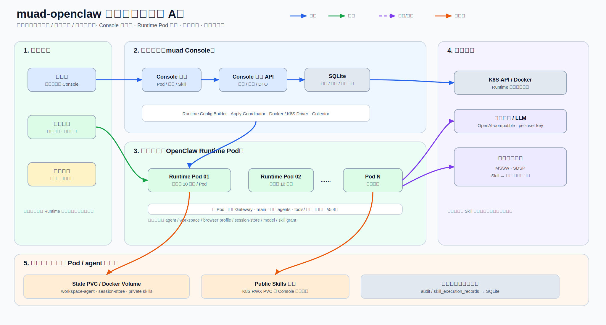
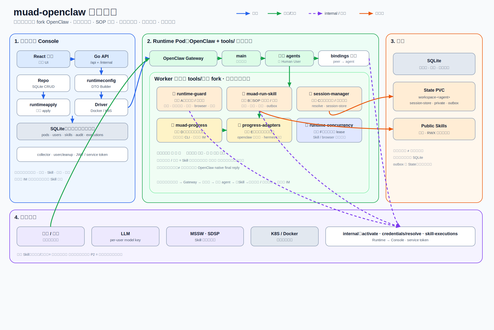
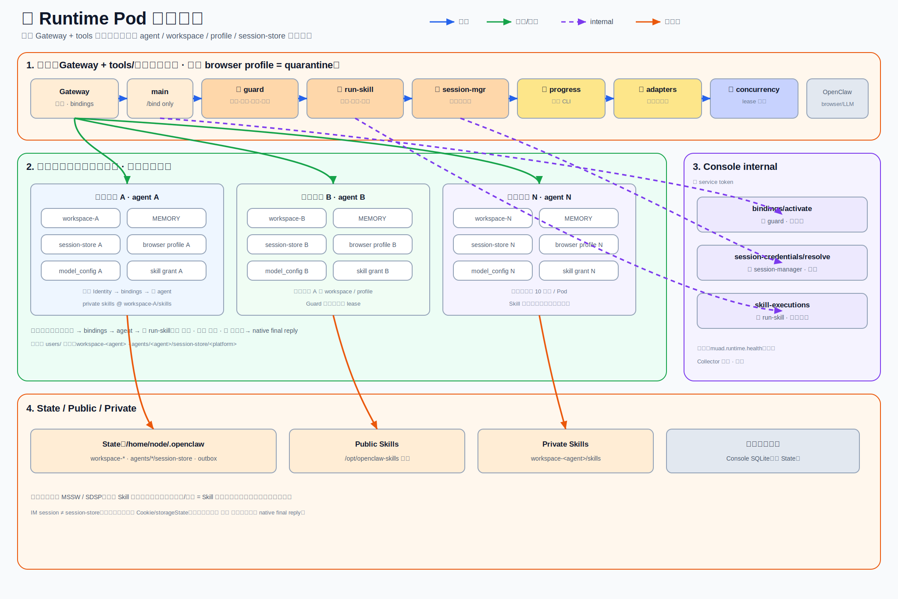
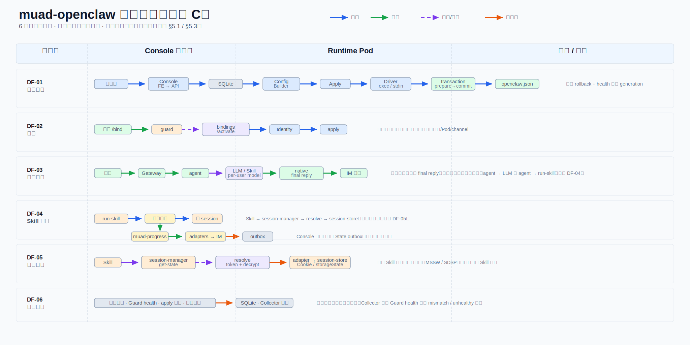

# SFRD-TS-03-1.4 当前版本 muad-openclaw 系统总体设计说明书

---

| 项目     | 内容                            |
| -------- | ------------------------------- |
| 文档编号 | SFRD-TS-03-1.4                  |
| 产品名称 | muad-openclaw 多用户 Agent 平台 |
| 版本号   | V0.5.3                          |
| 作者     | 待填                            |
| 审核人   | 待填                            |
| 批准人   | 待填                            |
| 创建日期 | 2026-07-20                      |
| 最后修订 | 2026-07-21                      |
| 状态     | 评审中                          |

---

## 修订历史

| 版本 | 日期 | 变更描述 |
| ---- | ---- | -------- |
| 0.4.x | 2026-07-20 | 评审稿、绑定场景、资源规划摘要 |
| **0.5** | **2026-07-21** | **全文重梳：产品定位、Worker 工具链专章、图件重画、章节顺序按「诉求→选型→架构→运行时→数据流→部署→质量」组织** |
| 0.5.1 | 2026-07-21 | 扩充第 4 章：演进路径、Hermes 对比、最终选型决策依据 |
| 0.5.2 | 2026-07-21 | 第 4 章改为选型结论；Hermes/演进细节拆到独立调研文档 |
| **0.5.3** | **2026-07-21** | **§5.3/§5.4 对调（先 Pod 内部再工具链）；§5.7 去重 K8S 图改为文字总结；CONST-PLAT-01 备注更新** |

---

## 目录

1. [引言](#1-引言)
2. [设计输入与约束](#2-设计输入与约束)
3. [关键应用场景](#3-关键应用场景)
4. [架构选型与技术栈](#4-架构选型与技术栈)
5. [总体架构设计](#5-总体架构设计)
   - [5.1 系统上下文](#51-系统上下文)
   - [5.2 逻辑组件与依赖](#52-逻辑组件与依赖)
   - [5.3 单 Runtime Pod 内部](#53-单-runtime-pod-内部)
   - [5.4 Worker 工具链](#54-worker-工具链tools--为何拆成六块)
   - [5.5 关键数据流](#55-关键数据流)
   - [5.6 用户绑定](#56-用户绑定关键场景)
   - [5.7 部署与资源规划](#57-部署与资源规划)
   - [5.8 控制面故障影响](#58-控制面故障影响摘要)
6. [质量属性与风险](#6-质量属性与风险)
7. [附录](#附录-a架构决策记录adr)

---

## 1. 引言

### 1.1 文档目的与适用范围

**目的：** 给出 muad-openclaw 的系统级架构基线——控制面、多用户 Runtime、Worker 工具链、数据流与部署形态——供架构评审与概要设计引用。

**读者：** 技术经理、架构师、研发、运维。

**本次刷新原因：** 原总设对「Worker 侧 tools/ 为何拆成多组件」叙述不足，章节与图件未形成「诉求 → 组件 → 部署」一条线；V0.5 按该逻辑重排。

### 1.2 产品定位（一句话）

> **不 fork OpenClaw 的多用户 Agent 控制面 + 运行时底座。**  
> 服务经理在**企业微信**中一句话发起标准服务任务；管理员在 Console 开通用户、模型、Skill 与平台凭证；业务能力（预防流、报告等）以 **Skill 扩展**，不另起运行时。

| 角色 | 入口 | 职责 |
| ---- | ---- | ---- |
| 管理员 | Console | Pod、Human User、模型池、Skill、平台、审计 |
| 服务经理 | 企微（Human User） | 发起任务、确认关键项、接收进度与交付结果 |
| 系统 | Runtime Pod | Agent 编排、Skill 执行、平台调用、隔离与审计 |

**能力节奏（与 MSS-Claw 需求对齐）：**

| 阶段 | 内容 | 架构影响 |
| ---- | ---- | -------- |
| 当前：助手 | 标准 SOP 交付（预防流、出报告等 Skill） | 现有底座足够，Skill 内容扩展 |
| 后续：专家 | 经验沉淀与能力平权（病毒/漏洞/复杂调查） | 同一 Agent/Skill 链纵向加深，非新运行时 |

### 1.3 表述约定

| 类型 | 含义 |
| ---- | ---- |
| **实现态** | 仓库代码与部署清单已具备 |
| **产品约束 / 目标态** | 产品范围或待代码收口的规则 |
| **不做承诺** | 边界或待验证项 |

### 1.4 术语

| 名 | 含义 |
| -- | ---- |
| Console | 控制面（Go API + React） |
| Runtime Pod | 单 OpenClaw Gateway，多 Human User |
| Human User | 平台用户；≠ IM external id |
| Identity | IM 身份 → Human User |
| Runtime DTO | `RuntimeConfigV1`，generation 版本化配置 |
| tools/ 工具链 | Worker 内插件与 CLI（见 §5.4） |
| grant | 下发给 Agent 的 Skill 授权清单 |
| quarantine | 默认 browser profile，业务 agent 不可复用 |

### 1.5 参考文档

| 文档 | 用途 |
| ---- | ---- |
| `docs/k8s-architecture-100users.md` | 100 用户容量与部署专题 |
| `docs/multi-user-single-pod.md` | bindings / 绑定码机制 |
| `docs/agent-runtime-selection.md` | Agent 运行时与部署单元选型调研（OpenClaw vs Hermes 等） |
| `docs/deploy-k8s-linux.md` | 测试部署 |
| `docs/images/total-design/` | 架构 SVG |
| `tools/*/README.md` | 各 Worker 组件说明 |

---

## 2. 设计输入与约束

### 2.1 范围

**在范围内：**

1. 多用户 Runtime（Pod / Agent / workspace / browser / 模型）  
2. 企微/微信身份与绑定  
3. Runtime DTO 构建与事务 apply  
4. Worker 工具链（隔离、Skill、凭证、进度、并发）  
5. Console 管理、审计、Docker/K8S 编排  
6. 容量规划摘要（~100 用户）  

**业务 Skill 内容（策略检查、扫描、报告等）在范围内作为扩展方式说明，具体 Playbook 属后续 Skill 交付，不改变本章架构。**

**排除 / 不做强承诺：** 全局 Message Router；PG/Redis/向量库/对象存储；群聊强隔离；多用户共享同一微信登录态；browser 上游自动选 profile 的无条件保证；专家知识库产品化（P2）。

### 2.2 约束与假设

| ID | 类型 | 内容 |
| -- | ---- | ---- |
| CONST-DB-01 | 约束 | 控制面 SQLite 单实例 |
| CONST-RUNTIME-01 | 约束 | Driver 同时支持 Docker 与 K8S |
| CONST-CAP-01 | 约束 | `max_users` 默认 10；100 用户按每 Pod 10 评估故障半径 |
| CONST-LLM-01 | 约束 | 用户必绑未占用模型；无 model fallback |
| CONST-APPLY-01 | 约束 | 配置 generation + prepare/validate/commit/health/rollback |
| CONST-ISO-01 | 约束 | 每用户独立 agent/workspace/profile/session-store |
| CONST-SEC-01 | 约束 | 密钥不进镜像与普通日志 |
| CONST-SKILL-01 | 约束 | system 保护；public/private 冲突需 allow_override |
| CONST-PLAT-01 | 产品约束 | 业务平台产品范围 **MSSW、SDSP**；业务 Skill 与平台一对一。Go 后端已改为 DB 驱动；Worker 镜像 session-manager 侧暂保留历史 adapter |
| CONST-ID-01 | 约束 | 未绑定不自动开户；绑定码预指向用户/Pod/channel |
| CONST-ROUTE-01 | 约束 | 无全局消息路由；用户归管理员分配 Pod |
| CONST-NOFORK-01 | 约束 | 不 fork OpenClaw；扩展仅配置 + 外置插件/CLI |
| ASSUME-NET-01 | 假设 | Runtime 可出站访问 IM/LLM/业务平台 |
| ASSUME-K8S-01 | 假设 | 生产具备 StorageClass；Public Skills 共享需 RWX |
| ASSUME-CH-01 | 假设 | 同一机器人凭证不跨多 Pod 复用 |

---

## 3. 关键应用场景

| ID | 场景 | 架构要点 |
| -- | ---- | -------- |
| USE-01 | 管理员创建 Pod / 通道 / 容量 | Driver、Token、State PVC |
| USE-02 | 开通服务经理（Human User + 模型） | 容量、模型唯一 |
| USE-03 | 企微绑定（预录 Identity 或 `/bind`） | Guard、bindings/activate、apply |
| USE-04 | 服务经理一句话发起标准任务 | Agent + Skill grant |
| USE-05 | Skill 按 SOP 执行并出进度 | run-skill、progress、审计 |
| USE-06 | Skill 调用 MSSW/SDSP | session-manager、resolver |
| USE-07 | 配置变更 apply | DTO、transaction、回滚 |
| USE-08 | ~100 用户扩展 | 多 Pod、故障半径 |
| USE-09 | 异常与人工确认 | Skill 规则 + 用户确认（业务层） |
| USE-10 | 后续专家类分析（P2） | 更深 Skill/知识，同一工具链 |

---

## 4. 架构选型与技术栈

### 4.1 选型结论

在「**服务经理企微私聊交付**、标准 **SOP Skill 化**、约 **100 用户** 并行、**密钥与租户隔离**、**不 fork 上游**」约束下，稳态架构定为：

| 决策点 | 选择 | 不选 |
| ------ | ---- | ---- |
| Agent 内核 | **OpenClaw** | 不以 Hermes 等为默认 Gateway |
| 部署单元 | **单 Pod 多用户**（默认约 10 用户/Pod） | 不以「每用户一 Pod」为稳态 |
| 控制面 | **muad Console**（Go/React + SQLite） | 不依赖运行时自带管理台 |
| 运行时扩展 | **tools/ 外置插件与 CLI**（§5.4） | 不 fork OpenClaw |
| 消息路由 | 管理员分配 Pod + OpenClaw bindings | 不做全局 Message Router |
| 业务增长 | **Skill 内容扩展**（预防流/报告等） | 不另起业务运行时 |

**演进一句话：** 早期 **单 Pod 单用户** 用于验证 → 因规模成本重构为 **单 Pod 多用户**；曾对照 **Hermes**（群聊 per-user、会话模型更「天生多人」），因主路径是企微私聊、企业 Skill 分层与已投工具链，**主运行时仍选 OpenClaw**；Hermes 仅作对照，进度层保留 `progress-adapters/hermes`。

调研过程、对照表与源码依据见独立文档：  
**[`docs/agent-runtime-selection.md`](./agent-runtime-selection.md)**（含对本地 `hermes-agent` 源码的核对）。

### 4.2 技术栈（实现态）

| 层 | 选型 |
| -- | ---- |
| 控制面 | Go + React/Semi；SQLite |
| 运行时 | OpenClaw（固定镜像版本）+ Chromium |
| 扩展 | tools/（§5.4） |
| 编排 | Docker 或 K8S Driver |
| 通道 | 企微 wecom、微信 openclaw-weixin |

### 4.3 关键问题与解决途径

| 问题 | 途径 |
| ---- | ---- |
| 不改上游如何扩展 | 外置插件 + Runtime DTO |
| 多用户如何隔离 | agent/workspace/profile + Guard |
| SOP 如何规模交付 | Skill + run-skill + 审计 |
| 平台密钥如何安全 | session-manager + service token |
| 长任务如何体验 | progress 旁路 + native final reply |
| Pod 如何不被打满 | runtime-concurrency |

---

## 5. 总体架构设计

### 5.1 系统上下文



```text
服务经理(企微) ──消息──► Runtime Pod(s) ──► LLM
管理员(浏览器) ──API──► Console ──编排──► Runtime Pod(s)
Runtime ──internal──► Console（绑定/凭证/执行上报）
Runtime ──► MSSW / SDSP
Runtime ──► State PVC / Public Skills
```

### 5.2 逻辑组件与依赖



| 层 | 组件 | 职责 |
| -- | ---- | ---- |
| 控制面 | Console FE/API、Repo、runtimeconfig、runtimeapply、Driver、Collector | 开通、配置、编排、审计 |
| 运行时核心 | OpenClaw Gateway、main、业务 agents | 消息、编排、原生工具 |
| **Worker 工具链** | 见 §5.4 | 隔离、Skill、凭证、进度、并发 |
| 存储 | SQLite；State PVC；Public Skills | 控制面状态 vs 运行态 |
| 外部 | 企微/微信、LLM、MSSW/SDSP、K8S/Docker | 入口与执行依赖 |

**信任边界：** 管理员 JWT；Pod service token；Agent 间 workspace/profile/grant 隔离；同 Pod 为**逻辑隔离**（非独立内核）。

### 5.3 单 Runtime Pod 内部



- **共享：** Gateway、工具链插件、并发队列、Public Skills 只读挂载  
- **每用户：** agent、`workspace-<id>`、browser profile、session-store、private skills、model  
- **main：** 仅绑定引导  
- **defaultProfile：** quarantine  

### 5.4 Worker 工具链（tools/）— 为何拆成六块

> **核心诉求：** 在 **CONST-NOFORK-01** 下，把多服务经理共用的 Runtime 做成：可隔离、可跑标准 SOP、可安全调平台、可反馈进度、可审计、打不满。

#### 5.4.1 诉求 → 组件

| 诉求 | 组件 | 类型 | 缺了会怎样 |
| ---- | ---- | ---- | ---------- |
| A. 谁能进、能碰哪 | **muad-runtime-guard** | OpenClaw 插件 | 绑定/隔离/门禁失效 |
| B. SOP 怎么跑、怎么记账 | **muad-run-skill** | OpenClaw 插件 | 无统一 Skill 生命周期 |
| C. 平台怎么登、密钥不进 Skill | **session-manager** | 插件 + CLI | 凭证易泄露或无法调平台 |
| D. 长任务用户看到哪一步 | **muad-progress** | Go CLI | 无标准进度事件 |
| E. 进度如何进当前 IM 会话 | **progress-adapters** | 适配器（openclaw 主路径；hermes 可选） | CLI 与会话脱节 |
| F. Skill/浏览器如何有界并发 | **runtime-concurrency** | 共享库 | Pod 易被打满 |

#### 5.4.2 主路径与配套

```text
主路径插件/CLI
  guard ── 安全边界与绑定
  run-skill ── Skill 执行与审计
  session-manager ── 平台登录态
  muad-progress ── 进度事件生产

配套
  progress-adapters/openclaw ── 进度投递到会话
  runtime-concurrency ── 被 guard/run-skill 使用的 lease 队列
```

**不是六个平行产品**，而是「3 个运行时职责插件 + 进度链路 + 横切并发」。

#### 5.4.3 协作关系（实现态）

```text
IM 消息
  → Gateway + bindings
  → [guard] 模型/文件/browser 门禁
  → 业务 Agent
       → [run-skill] 激活并执行 Skill
            → 脚本调用 [muad-progress] → [progress-adapters] → IM 进度消息
            → 脚本/Tool 调用 [session-manager] → Console resolve → session-store
            → 并发受 [runtime-concurrency] 约束
       → OpenClaw native final reply → IM 终态
  → run-skill 上报 skill-executions（失败则 outbox）
```

#### 5.4.4 与业务扩展的关系

预防流、报告、策略检查等 = **新增 Skill 包 + Tool 约定**，挂在上述链上：

- 不新增第七种「业务运行时」  
- 不改控制面主模型  
- 专家平权（P2）= 更深 Skill/知识/标准，仍走同一工具链  

### 5.5 关键数据流



| ID | 流 | 路径 |
| -- | -- | ---- |
| DF-01 | 管理配置 | 管理员 → Console → SQLite → Builder → Apply → transaction → openclaw.json |
| DF-02 | 绑定 | 企微 `/bind` → guard → bindings/activate → Identity → apply |
| DF-03 | 任务对话 | 企微 → Gateway → bindings → agent → LLM/Skill → **native final reply** |
| DF-04 | Skill 执行 | run-skill → 脚本；progress 旁路；skill-executions / outbox |
| DF-05 | 平台会话 | Skill → session-manager → resolve → adapter → session-store |
| DF-06 | 审计告警 | 操作审计 / Guard health / apply 状态 / 执行日志 |

### 5.6 用户绑定（关键场景）

Human User 是平台用户；IM external id 是 Identity。未绑定不自动开户。

| 场景 | 做法 | 结果 |
| ---- | ---- | ---- |
| 已知 external id | 建用户并直接录 Identity | apply 后可对话 |
| 未知 external id | pending 用户 + 绑定码 + `/bind` | activate 后 active + apply |
| 已有用户加 IM | 用户详情发码 + `/bind` | 只追加 Identity，复用 agent |

### 5.7 部署与资源规划

部署支持三种形态：本地开发用 Docker Compose 按需启停；测试环境见 `deploy-k8s-linux.md` 中的 K3S 部署方案；~100 用户生产环境采用 **Console×1 + Runtime≈10 Pod** 的 K8S 部署，管理员按 Pod 分配用户，每 Pod 默认 `max_users=10` 以控制故障半径。详细部署拓扑见 [`docs/k8s-architecture-100users.md`](./k8s-architecture-100users.md)。

**资源规划（规划值，非压测 SLA；细节见 `k8s-architecture-100users.md`）：**

| 项 | 建议 |
| -- | ---- |
| 切分 | 10 Pod × 默认 10 用户 |
| 集群 | 约 40–48 vCPU / 96–128 GiB / 500Gi+ SSD |
| 节点示意 | 3×(16C/48G/200G) |
| Runtime limit | 4 vCPU / 8 GiB；State PVC 20–50Gi |
| Console 预留 | 约 2C/4G |
| 并发默认 | Skill/Browser=2（可上调；浏览器为主瓶颈） |

### 5.8 控制面故障影响（摘要）

| 故障 | 已绑定对话 | 新绑定 | Skill 上报 | 平台 resolve |
| ---- | ---------- | ------ | ---------- | ------------ |
| Console 挂 | 通常可继续 | 失败 | outbox | 失败 |
| 单 Runtime 挂 | 该 Pod 用户不可用 | 该 Pod 失败 | 该 Pod 失败 | 该 Pod 失败 |
| 单用户模型失效 | 仅该用户 | — | 视任务 | — |

---

## 6. 质量属性与风险

| 属性 | 目标（本阶段） | 手段 |
| ---- | -------------- | ---- |
| 安全隔离 | 用户状态/密钥/浏览器不串 | Guard、grant、session-store、加密 |
| 可交付 | 标准 SOP 可 Skill 化 | run-skill、progress、审计 |
| 稳定性 | Pod 有界并发；apply 可回滚 | concurrency、generation 事务 |
| 可扩展 | 加 Pod / 加 Skill | 管理员分配；Skill 包扩展 |
| 可观测 | 执行与操作可查 | execution、audit、health、alerts |

| 风险 | 等级 | 应对 |
| ---- | ---- | ---- |
| 逻辑隔离弱于 Pod 隔离 | 高 | Guard + 默认 10 人半径 + 测试 |
| 平台文档与代码 adapter 集合不一致 | 中 | CONST-PLAT-01；实现收口 |
| SQLite 单点 | 中 | 备份；规模上去再评 PG |
| 浏览器峰值 | 中 | 并发上限与资源 |
| 业务 Skill 未建全 | 中 | 属内容扩展，不挡底座 |

**未决：** 平台种子收口；Skill platforms 长度强制 1；压测基线；专家知识库形态；Console 备份 RPO。

---

## 附录 A：架构决策记录（ADR）

| ID | 决策 | 状态 |
| -- | ---- | ---- |
| ADR-001 | 多用户单 Runtime Pod | 已采纳 |
| ADR-002 | 控制面 SQLite 单实例 | 已采纳（本阶段） |
| ADR-003 | 不 fork OpenClaw，外置插件/CLI 扩展 | 已采纳 |
| ADR-004 | Docker 单机 / K8S 生产 | 已采纳 |
| ADR-005 | 模型池无 fallback | 已采纳 |
| ADR-006 | 无全局 Message Router | 已采纳 |
| ADR-007 | 业务平台产品范围 MSSW/SDSP；Skill 一对一（实现收口中） | 产品已采纳 |
| ADR-008 | Worker 能力按「隔离 / Skill / 凭证 / 进度 / 并发」拆分 tools/ 组件，而非单一巨型插件 | 已采纳 |

---

## 附录 B：实现要点（精简）

### B.1 Internal API

- `POST /internal/v1/bindings/activate` — Guard  
- `POST /internal/v1/session-credentials/resolve` — session-manager  
- `POST /internal/v1/skill-executions` — run-skill  

### B.2 配置 apply

`prepare → validate → commit → restart? → health`；DTO=`RuntimeConfigV1`。

### B.3 通道

| Console | OpenClaw |
| ------- | -------- |
| wecom | wecom |
| wechat | openclaw-weixin |

### B.4 路径

- workspace：`/home/node/.openclaw/workspace-<agent>`  
- session-store：`.../agents/<agent>/session-store/<platform>/`  
- Public Skills：`/opt/openclaw-skills`  

### B.5 源码

```text
console/backend/internal/{api,repo,runtimeconfig,runtimeapply,driver}
tools/{muad-runtime-guard,muad-run-skill,session-manager,muad-progress,progress-adapters,runtime-concurrency}
bin/*.mjs
docs/images/total-design/
```

---

_文档结束_
